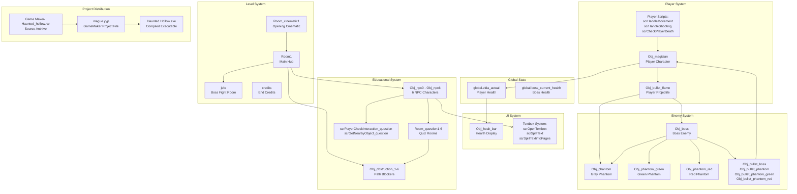
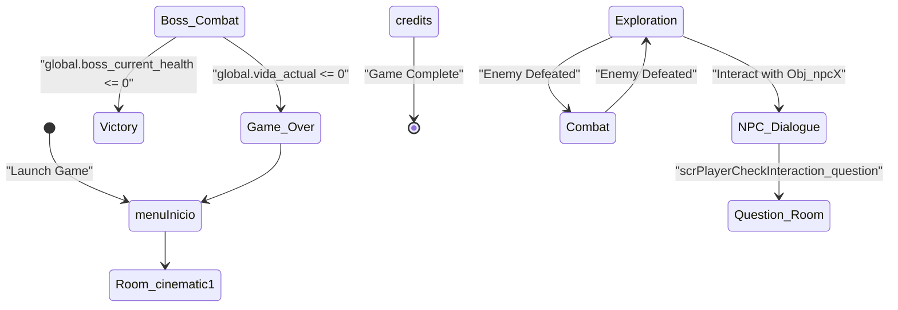
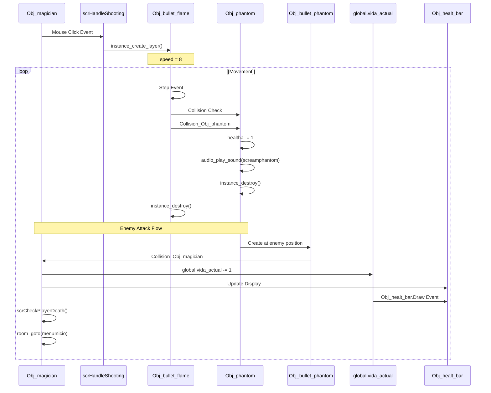
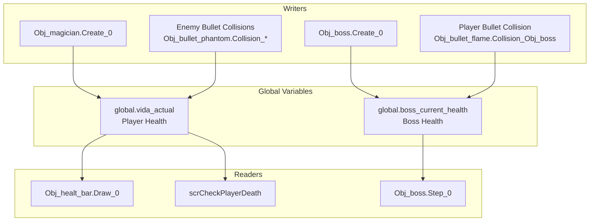

# Home

> **Relevant source files**
> * [Game Maker- Haunted_hollow.rar](https://github.com/axchisan/Haunted_hollow/blob/96079758/Game Maker- Haunted_hollow.rar)
> * [Haunted Hollow.exe](https://github.com/axchisan/Haunted_hollow/blob/96079758/Haunted Hollow.exe)
> * [README.md](https://github.com/axchisan/Haunted_hollow/blob/96079758/README.md)

## Purpose and Scope

This wiki documents the **Haunted Hollow** codebase, an educational dungeon-crawler game developed in GameMaker Studio 2. The game transforms English language learning into an interactive experience where players navigate haunted dungeons, battle enemies, and solve English comprehension puzzles to progress.

This documentation covers:

* Core game systems and their interactions
* GameMaker object hierarchy and event handling
* Educational content integration with gameplay progression
* Asset organization and resource management

For instructions on running the game or opening the project in GameMaker, see [Getting Started](/axchisan/Haunted_hollow/2-getting-started). For detailed architectural patterns and system designs, see [Architecture Overview](/axchisan/Haunted_hollow/3-architecture-overview).

**Sources:** `README.md`, `mague.yyp`, `Game Maker- Haunted_hollow.rar`

---

## Project Overview

Haunted Hollow is structured as a GameMaker Studio 2 project where gameplay, educational content, and visual/audio assets are organized into a hub-and-spoke progression model. The player controls a wizard (`Obj_magician`) trapped in a haunted dungeon who must defeat enemies and answer English comprehension questions to unlock paths and ultimately face the boss.

### Technology Stack

| Component | Technology |
| --- | --- |
| Game Engine | GameMaker Studio 2 |
| Project File | `mague.yyp` |
| Scripting Language | GameMaker Language (GML) |
| Distribution | Compiled `.exe` + Source `.rar` |
| Fonts | `fnt_medieval`, `gothic-pixel-font` |
| Audio | `.wav` sound effects and background music |

**Sources:** `mague.yyp`, `Game Maker- Haunted_hollow.rar`, `.gitattributes`

---

## Core System Architecture

The following diagram maps the natural language system descriptions to their concrete code implementations in the GameMaker project:

**Sources:** `mague.yyp`, `objects/Obj_magician/`, `objects/Obj_boss/`, `objects/Obj_npc*/`, `rooms/`

---

## Game Flow and Progression

Haunted Hollow uses a structured progression system where educational content gates advancement. The game flow centers around `Room1` as the main hub:

**Sources:** `rooms/menuInicio`, `rooms/Room1`, `rooms/Room_question1-6`, `rooms/jefe`, `rooms/credits`, `objects/Obj_npc*/`, `objects/Obj_obstruction_*/`

---

## Project File Structure

The GameMaker project follows a hierarchical organization defined in `mague.yyp`:

```mermaid
flowchart TD

ROOT["mague.yyp<br>Project Root"]
SPRITES["Sprites/<br>Visual Assets"]
SOUNDS["Sounds/<br>Audio Assets"]
FONTS["Fonts/<br>fnt_medieval<br>gothic-pixel-font"]
OBJECTS["Objects/<br>Game Entities"]
SCRIPTS["Scripts/<br>Reusable Functions"]
ROOMS["Rooms/<br>Game Levels"]
TILESETS["Tile Sets/<br>Level Textures"]
PLAYER_OBJ["Obj_magician"]
ENEMY_OBJ["Obj_boss<br>Obj_phantom*"]
PROJECTILE_OBJ["Obj_bullet_flame<br>Obj_bullet_boss<br>Obj_bullet_phantom*"]
NPC_OBJ["Obj_npc0-6"]
UI_OBJ["Obj_healt_bar<br>Obj_button_play"]
ENV_OBJ["Obj_colision_block<br>Obj_obstruction_*<br>Obj_barrel_*"]
PLAYER_SCRIPTS["scrHandleMovement<br>scrHandleShooting<br>scrHandleAttackAnimation<br>scrCheckPlayerDeath"]
INTERACT_SCRIPTS["scrPlayerCheckInteraction_question<br>scrGetNearbyObject_question"]
TEXT_SCRIPTS["scrOpenTextbox<br>scrSplitText<br>scrSplitTextintoPages"]
MENU["menuInicio"]
CINE["Room_cinematic1<br>cinejefe"]
HUB["Room1"]
QUEST["Room_question1-6"]
BOSS["jefe"]
END["credits"]
MUSIC["music1"]
SFX["fire<br>hit<br>screamphantom<br>correctanswer<br>uff"]

ROOT --> SPRITES
ROOT --> SOUNDS
ROOT --> FONTS
ROOT --> OBJECTS
ROOT --> SCRIPTS
ROOT --> ROOMS
ROOT --> TILESETS
OBJECTS --> PLAYER_OBJ
OBJECTS --> ENEMY_OBJ
OBJECTS --> PROJECTILE_OBJ
OBJECTS --> NPC_OBJ
OBJECTS --> UI_OBJ
OBJECTS --> ENV_OBJ
SCRIPTS --> PLAYER_SCRIPTS
SCRIPTS --> INTERACT_SCRIPTS
SCRIPTS --> TEXT_SCRIPTS
ROOMS --> MENU
ROOMS --> CINE
ROOMS --> HUB
ROOMS --> QUEST
ROOMS --> BOSS
ROOMS --> END
SOUNDS --> MUSIC
SOUNDS --> SFX
```

**Sources:** `mague.yyp`, `mague.resource_order`, `objects/`, `scripts/`, `rooms/`, `fonts/`, `sounds/`

---

## Key Object Interactions

The following diagram shows how core game objects interact during gameplay, using their actual code entity names:

**Sources:** `objects/Obj_magician/`, `objects/Obj_bullet_flame/`, `objects/Obj_phantom/`, `scripts/scrHandleShooting.gml`, `objects/Obj_healt_bar/`

---

## Educational System Integration

The educational content is tightly integrated with progression mechanics through a gating system:

| Component | Code Entity | Purpose |
| --- | --- | --- |
| NPCs | `Obj_npc0` - `Obj_npc6` | Trigger dialogue and quiz transitions |
| Quiz Rooms | `Room_question1` - `Room_question6` | Present English comprehension questions |
| Obstructions | `Obj_obstruction_1` - `Obj_obstruction_6` | Block paths until questions answered |
| Question Objects | `Obj_question_1` - `Obj_question_6` | Display question text and manage answers |
| Answer Checkboxes | `Obj_checkbox_false1` - `Obj_checkbox_false5` | True/False answer selection |
| Interaction Scripts | `scrPlayerCheckInteraction_question`, `scrGetNearbyObject_question` | Handle NPC-player interaction |
| Textbox System | `scrOpenTextbox`, `scrSplitText`, `scrSplitTextintoPages` | Display NPC dialogue |

When a player interacts with an NPC, the `scrPlayerCheckInteraction_question` script triggers a room transition to the corresponding `Room_questionX`. Upon answering correctly, the associated `Obj_obstruction_X` is destroyed via `instance_destroy()`, allowing further exploration of `Room1`.

**Sources:** `objects/Obj_npc*/`, `objects/Obj_obstruction_*/`, `objects/Obj_question_*/`, `rooms/Room_question*/`, `scripts/scrPlayerCheckInteraction_question.gml`

---

## Global Game State

Critical game state is managed through global variables accessible throughout the codebase:

**Sources:** `objects/Obj_magician/Create_0.gml`, `objects/Obj_boss/Create_0.gml`, `objects/Obj_bullet_flame/Collision_Obj_boss.gml`, `objects/Obj_healt_bar/`, `scripts/scrCheckPlayerDeath.gml`

---

## Navigation

This wiki is organized into the following main sections:

* **[Getting Started](/axchisan/Haunted_hollow/2-getting-started)** - Instructions for running the game and opening the project
* **[Architecture Overview](/axchisan/Haunted_hollow/3-architecture-overview)** - Detailed system architecture and design patterns * [Game Flow and Progression](/axchisan/Haunted_hollow/3.1-game-flow-and-progression) * [Combat Architecture](/axchisan/Haunted_hollow/3.2-combat-architecture) * [Educational System Integration](/axchisan/Haunted_hollow/3.3-educational-system-integration)
* **[Boss Enemy System](/axchisan/Haunted_hollow/4-boss-enemy-system)** - Boss AI, attack patterns, and minion spawning
* **[Player Combat System](/axchisan/Haunted_hollow/5-player-combat-system)** - Player projectiles and collision handling
* **[Level Design and Environment](/axchisan/Haunted_hollow/6-level-design-and-environment)** - Environmental objects and decorations
* **[Visual Assets and Typography](/axchisan/Haunted_hollow/7-visual-assets-and-typography)** - Font systems and text rendering
* **[Project Configuration and Development](/axchisan/Haunted_hollow/8-project-configuration-and-development)** - Development setup and version control

**Sources:** Table of contents JSON structure