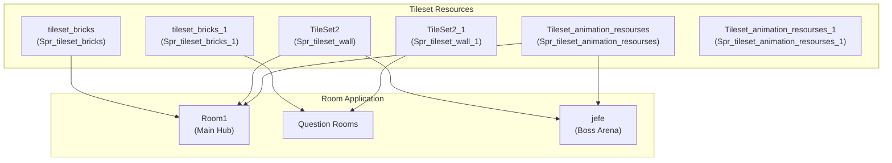
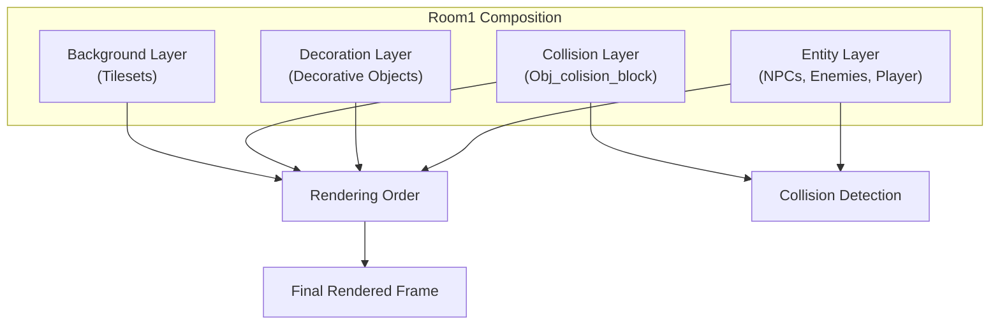

# Level Design and Environment

> **Relevant source files**
> * [magician project1/mague.yyp](https://github.com/axchisan/Haunted_hollow/blob/96079758/magician project1/mague.yyp)
> * [magician project1/objects/Obj_barrel_big/Obj_barrel_big.yy](https://github.com/axchisan/Haunted_hollow/blob/96079758/magician project1/objects/Obj_barrel_big/Obj_barrel_big.yy)
> * [magician project1/objects/Obj_barrel_small/Obj_barrel_small.yy](https://github.com/axchisan/Haunted_hollow/blob/96079758/magician project1/objects/Obj_barrel_small/Obj_barrel_small.yy)

This page documents the environmental and level design objects in Haunted Hollow, including collision geometry, decorative elements, and tileset organization. These objects form the static physical world that players navigate and interact with. For information about the NPCs and obstruction gates that control progression, see [Educational System Integration](/axchisan/Haunted_hollow/3.3-educational-system-integration). For room transitions and overall level flow, see [Game Flow and Progression](/axchisan/Haunted_hollow/3.1-game-flow-and-progression).

## Overview

The level environment in Haunted Hollow consists of three primary categories of objects:

1. **Collision Objects** - Define physical boundaries and prevent movement through walls and water
2. **Decorative Objects** - Provide visual detail and atmosphere without gameplay functionality
3. **Environmental Sprites** - Background tilesets and animated elements that construct the dungeon aesthetic

All level objects are organized under the `Objects/Level` folder hierarchy in the GameMaker project, with decorative objects inheriting from a common parent for consistency.

**Sources:** [magician L12-L76](https://github.com/axchisan/Haunted_hollow/blob/96079758/magician project1/mague.yyp#L12-L76)

## Level Object Hierarchy

The following diagram illustrates the inheritance structure and categorization of level-related objects:

```

```

**Sources:** [magician L88-L316](https://github.com/axchisan/Haunted_hollow/blob/96079758/magician project1/mague.yyp#L88-L316)

 [magician L1-L39](https://github.com/axchisan/Haunted_hollow/blob/96079758/magician project1/objects/Obj_barrel_big/Obj_barrel_big.yy#L1-L39)

 [magician L1-L39](https://github.com/axchisan/Haunted_hollow/blob/96079758/magician project1/objects/Obj_barrel_small/Obj_barrel_small.yy#L1-L39)

## Collision System

The collision system uses invisible objects to define the physical boundaries of the game world. These objects prevent player and projectile movement through walls and water.

### Collision Objects

| Object Name | Purpose | Sprite |
| --- | --- | --- |
| `Obj_colision_block` | Primary wall and boundary collision | `Spr_colision_block` |
| `Obj_colision_block_1` | Secondary collision variant | `Spr_editor_wall_1` |
| `Obj_collision_water` | Water hazard collision | `Spr_swamp` |

These objects interact with multiple systems:

* **Player Movement** - Prevents `Obj_magician` from moving through walls (referenced in player movement scripts)
* **Projectile Physics** - Destroys all bullet types on collision (see [Environment Collision Detection](/axchisan/Haunted_hollow/5.5-environment-collision-detection))
* **Enemy AI** - Constrains enemy pathfinding and movement patterns

The collision blocks use GameMaker's built-in collision detection, with the `solid` property set to `false` to allow manual collision handling in code rather than automatic physics blocking.

**Sources:** [magician L112-L114](https://github.com/axchisan/Haunted_hollow/blob/96079758/magician project1/mague.yyp#L112-L114)

## Decorative Objects

Decorative objects inherit from `Obj_decorativo_parent`, which serves as a base class for all non-interactive environmental details. This inheritance structure allows for consistent depth sorting and rendering properties across all decorative elements. For detailed documentation of individual decorative object implementations, see [Decorative Objects](/axchisan/Haunted_hollow/6.1-decorative-objects).

### Decorative Object Types

The game includes the following decorative object categories:

**Barrels:**

* `Obj_barrel_big` - Large barrel decoration using `Spr_barrel_big`
* `Obj_barrel_small` - Small barrel decoration using `Spr_barrel_small`

**Pillars:**

* `Obj_pillar_whole` - Intact decorative pillar using `Spr_pilar_whole`
* `Obj_pillar_half` - Partially destroyed pillar using `Spr_pilar_half`
* `Obj_pillar_fallen` - Collapsed pillar using `Spr_pilar_fallen`

All decorative objects share the following properties:

* `persistent: false` - Do not persist across room transitions
* `physicsObject: false` - Do not participate in physics simulation
* `solid: false` - Do not block movement (visual only)
* `visible: true` - Always rendered to screen

**Sources:** [magician L1-L39](https://github.com/axchisan/Haunted_hollow/blob/96079758/magician project1/objects/Obj_barrel_big/Obj_barrel_big.yy#L1-L39)

 [magician L1-L39](https://github.com/axchisan/Haunted_hollow/blob/96079758/magician project1/objects/Obj_barrel_small/Obj_barrel_small.yy#L1-L39)

 [magician L88-L90](https://github.com/axchisan/Haunted_hollow/blob/96079758/magician project1/mague.yyp#L88-L90)

 [magician L141-L143](https://github.com/axchisan/Haunted_hollow/blob/96079758/magician project1/mague.yyp#L141-L143)

## Environmental Sprites and Tilesets

The visual construction of the dungeon environment uses a combination of tilesets for structural elements and individual sprites for detailed decorations.

### Tileset Organization



**Sources:** [magician L311-L316](https://github.com/axchisan/Haunted_hollow/blob/96079758/magician project1/mague.yyp#L311-L316)

### Environmental Sprite Categories

The following table documents the environmental sprites used for decoration and atmosphere:

| Category | Sprite Name | Usage |
| --- | --- | --- |
| **Bones & Debris** | `Spr_bones_pile_0`, `Spr_bones_pile_1` | Scattered skeletal remains |
| **Rocks** | `Spr_loose_rocks` | Environmental rubble |
| **Lighting** | `Spr_torch_off`, `Spr_torch_glow` | Torch decorations and lighting effects |
| **Hazards** | `Spr_swamp` | Water/swamp visual representation |
| **Gates** | `Spr_gate_gold_1`, `Spr_gate_gold_2` | Doorway decorations |
| **Entrance** | `Spr_entrance`, `Spr_entrance_particle` | Portal/entry visual effects |

**Sources:** [magician L205-L310](https://github.com/axchisan/Haunted_hollow/blob/96079758/magician project1/mague.yyp#L205-L310)

## Interactive Environmental Objects

Some environmental objects have interactive properties beyond pure decoration:

### Chest Object

The `Obj_chest` object uses two sprite states:

* `Spr_chest` - Closed chest sprite
* `Spr_chest_open` - Open chest sprite

This object likely triggers state changes through player interaction scripts, though the specific interaction logic would be defined in its event code.

### Pentagram Object

The `Obj_pentagrama` object uses the `Spr_pentagrama` sprite and may serve as:

* A spawn point marker
* A ritual circle decoration
* A teleportation point

**Sources:** [magician L109](https://github.com/axchisan/Haunted_hollow/blob/96079758/magician project1/mague.yyp#L109-L109)

 [magician L134](https://github.com/axchisan/Haunted_hollow/blob/96079758/magician project1/mague.yyp#L134-L134)

## Level Construction in Rooms

The level environment is assembled in individual room assets, with the primary gameplay occurring in Room1 (the main hub). The following diagram shows how environmental components combine to create playable space:



GameMaker's depth system controls rendering order, with higher depth values rendering first (appearing behind lower depth values). Collision objects are typically invisible but positioned at depth 0 to accurately interact with entities.

**Sources:** [magician L320-L333](https://github.com/axchisan/Haunted_hollow/blob/96079758/magician project1/mague.yyp#L320-L333)

## Editor Visualization Sprites

The project includes special editor-only sprites used during level design in GameMaker Studio:

| Sprite Name | Purpose |
| --- | --- |
| `Spr_editor_wall` | Visible wall indicator during editing |
| `Spr_editor_wall_1` | Alternative wall visualization |
| `Spr_colision_block` | Collision block visibility toggle |

These sprites help level designers visualize collision geometry during development but may be set to invisible during runtime.

**Sources:** [magician L232-L235](https://github.com/axchisan/Haunted_hollow/blob/96079758/magician project1/mague.yyp#L232-L235)

## Asset Organization in Project Structure

The GameMaker project organizes level-related assets into clearly separated folders:

```
Objects/
├── Level/
│   ├── questions/ (covered in page #3.3)
│   ├── (Collision objects)
│   ├── (Decorative objects)
│   └── (Interactive objects)
├── obstrucciones/ (covered in page #3.3)
└── npc/ (covered in page #3.3)

Sprites/
├── Level/
│   ├── questions/ (covered in page #3.3)
│   └── Shaders/Sounds/ (audio assets)
├── tilesets/
└── visual_Asets/

Tile Sets/
├── tileset_bricks
├── TileSet2
└── Tileset_animation_resourses
```

This organization follows GameMaker conventions, separating object definitions (behavior) from sprite resources (visuals) while maintaining logical groupings by functional purpose.

**Sources:** [magician L12-L76](https://github.com/axchisan/Haunted_hollow/blob/96079758/magician project1/mague.yyp#L12-L76)