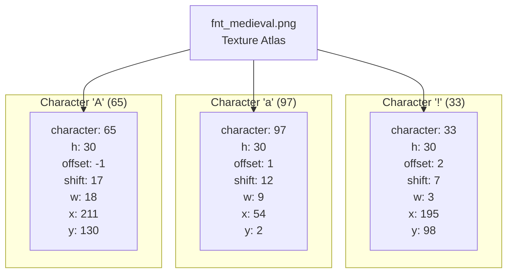
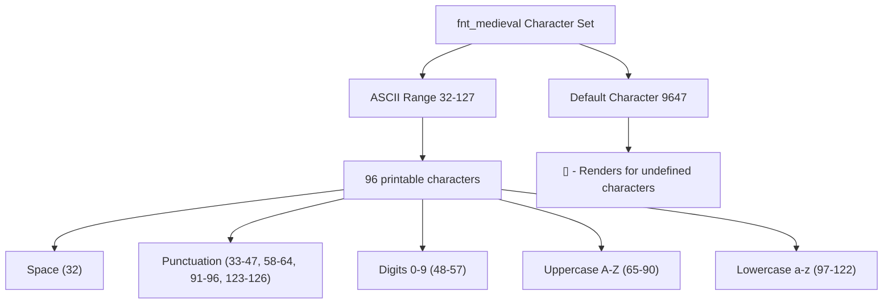
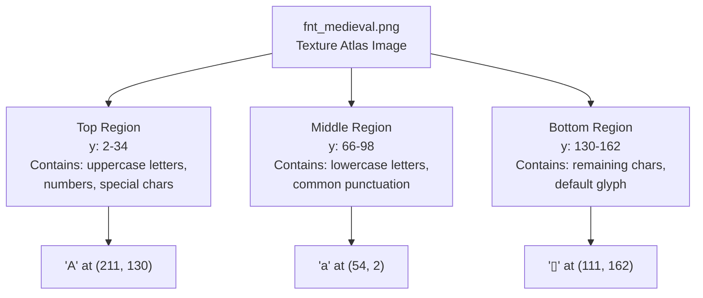
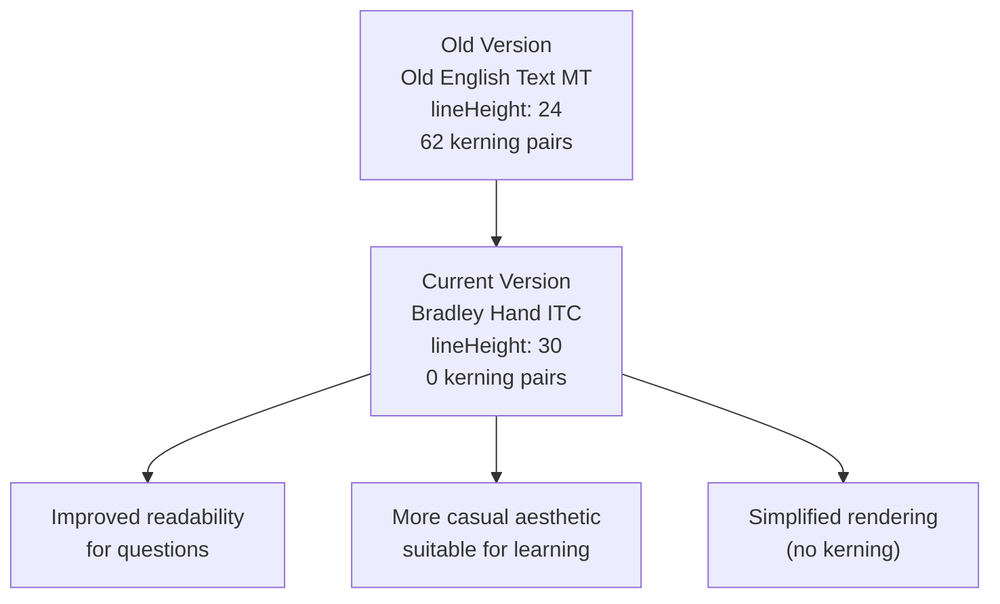
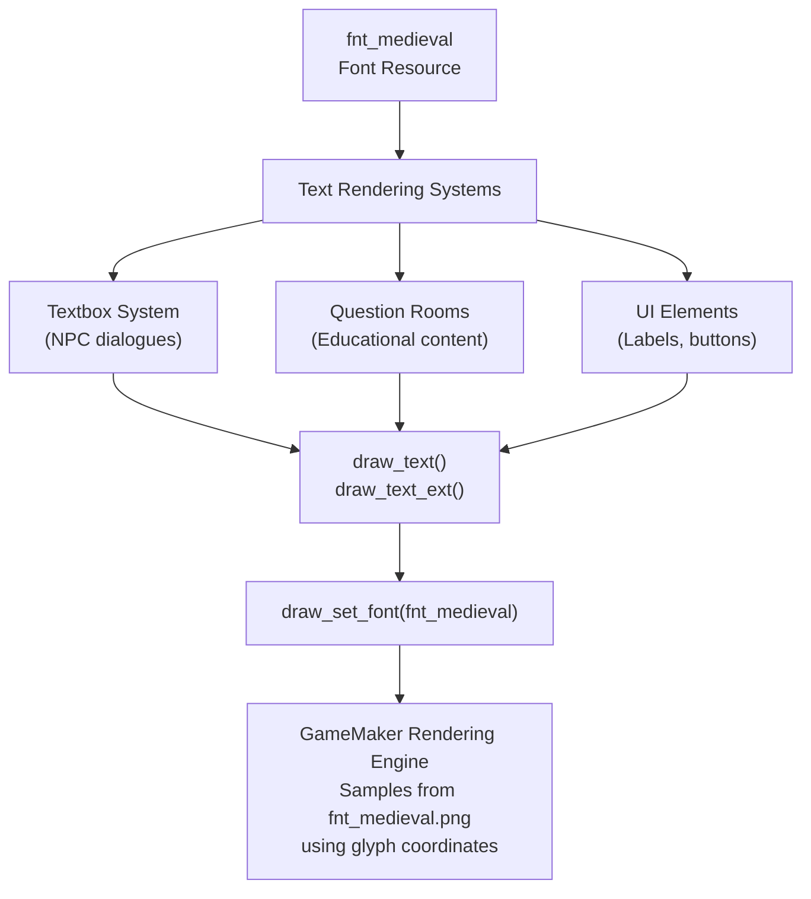

# Medieval Font System

> **Relevant source files**
> * [magician project1/fonts/fnt_medieval/fnt_medieval.old.png](https://github.com/axchisan/Haunted_hollow/blob/96079758/magician project1/fonts/fnt_medieval/fnt_medieval.old.png)
> * [magician project1/fonts/fnt_medieval/fnt_medieval.old.yy](https://github.com/axchisan/Haunted_hollow/blob/96079758/magician project1/fonts/fnt_medieval/fnt_medieval.old.yy)
> * [magician project1/fonts/fnt_medieval/fnt_medieval.png](https://github.com/axchisan/Haunted_hollow/blob/96079758/magician project1/fonts/fnt_medieval/fnt_medieval.png)
> * [magician project1/fonts/fnt_medieval/fnt_medieval.yy](https://github.com/axchisan/Haunted_hollow/blob/96079758/magician project1/fonts/fnt_medieval/fnt_medieval.yy)

## Purpose and Scope

This document describes the `fnt_medieval` font asset used throughout Haunted Hollow for rendering text in dialogue boxes, UI elements, and educational content. The font system is a GameMaker font resource that defines glyph rendering properties, character mappings, and texture coordinates for bitmap font rendering.

For information about the Gothic Pixel Font (the other font in the project), see [Gothic Pixel Font](/axchisan/Haunted_hollow/7.2-gothic-pixel-font).

---

## Font Asset Overview

The `fnt_medieval` font asset consists of two primary files that work together to render text:

| Component | File | Purpose |
| --- | --- | --- |
| Configuration | `fnt_medieval.yy` | Defines font properties, glyph metrics, and rendering settings |
| Texture Atlas | `fnt_medieval.png` | Contains pre-rendered character glyphs in a texture atlas |

The font is located at [magician project1/fonts/fnt_medieval/](https://github.com/axchisan/Haunted_hollow/blob/96079758/magician project1/fonts/fnt_medieval/)

 and is registered as a resource in the GameMaker project structure under the "Fonts" folder.

**Sources:**

* [magician L1-L143](https://github.com/axchisan/Haunted_hollow/blob/96079758/magician project1/fonts/fnt_medieval/fnt_medieval.yy#L1-L143)

---

## Font Configuration Structure

The following diagram illustrates the hierarchical structure of the font configuration defined in the `.yy` file:

```

```

**Sources:**

* [magician L1-L25](https://github.com/axchisan/Haunted_hollow/blob/96079758/magician project1/fonts/fnt_medieval/fnt_medieval.yy#L1-L25)
* [magician L112-L143](https://github.com/axchisan/Haunted_hollow/blob/96079758/magician project1/fonts/fnt_medieval/fnt_medieval.yy#L112-L143)

---

## Glyph Data Structure

Each character in the font has associated glyph metrics that define its position in the texture atlas and rendering properties. The structure follows GameMaker's standard glyph format:

| Property | Type | Description |
| --- | --- | --- |
| `character` | int | ASCII character code |
| `h` | int | Glyph height in pixels (always 30 for this font) |
| `offset` | int | Horizontal rendering offset from baseline |
| `shift` | int | Character advance width (space to next character) |
| `w` | int | Glyph width in pixels |
| `x` | int | X coordinate in texture atlas |
| `y` | int | Y coordinate in texture atlas |

### Example Glyph Definitions



**Sources:**

* [magician L14-L110](https://github.com/axchisan/Haunted_hollow/blob/96079758/magician project1/fonts/fnt_medieval/fnt_medieval.yy#L14-L110)

---

## Rendering Properties

The font configuration defines several properties that control how glyphs are rendered at runtime:

### Typography Properties

| Property | Value | Description |
| --- | --- | --- |
| `fontName` | "Bradley Hand ITC" | System font used to generate glyphs |
| `size` | 18.0 | Font size in points |
| `bold` | true | Bold weight enabled |
| `italic` | false | Italic style disabled |
| `styleName` | "Regular" | Font style variant |

### Layout Properties

| Property | Value | Description |
| --- | --- | --- |
| `lineHeight` | 30 | Vertical spacing between lines |
| `ascender` | 20 | Height above baseline |
| `ascenderOffset` | 0 | Additional ascender adjustment |

### Rendering Flags

| Property | Value | Description |
| --- | --- | --- |
| `AntiAlias` | 1 | Anti-aliasing enabled for smooth edges |
| `hinting` | 0 | Font hinting disabled |
| `usesSDF` | false | Signed distance field rendering disabled |
| `sdfSpread` | 8 | SDF spread value (unused since SDF disabled) |
| `applyKerning` | 0 | Kerning adjustments disabled |

**Sources:**

* [magician L4-L12](https://github.com/axchisan/Haunted_hollow/blob/96079758/magician project1/fonts/fnt_medieval/fnt_medieval.yy#L4-L12)
* [magician L112-L142](https://github.com/axchisan/Haunted_hollow/blob/96079758/magician project1/fonts/fnt_medieval/fnt_medieval.yy#L112-L142)

---

## Character Coverage

The font includes two character ranges defining which glyphs are available:



The ranges are defined as:

* **Range 1:** Characters 32 through 127 (standard ASCII printable characters)
* **Range 2:** Character 9647 (the "▯" symbol used as the default/fallback character)

**Sources:**

* [magician L126-L129](https://github.com/axchisan/Haunted_hollow/blob/96079758/magician project1/fonts/fnt_medieval/fnt_medieval.yy#L126-L129)

---

## Texture Atlas Organization

The `fnt_medieval.png` file is a texture atlas containing all font glyphs packed into a single image. The packing coordinates are defined in the glyph data:



Each glyph occupies a rectangular region defined by its `(x, y)` coordinates (top-left corner) and `w` (width) and `h` (height) dimensions. GameMaker's rendering engine uses these coordinates to extract the correct portion of the texture when drawing text.

**Sources:**

* [magician L1](https://github.com/axchisan/Haunted_hollow/blob/96079758/magician project1/fonts/fnt_medieval/fnt_medieval.png#L1-L1)
* [magician L14-L110](https://github.com/axchisan/Haunted_hollow/blob/96079758/magician project1/fonts/fnt_medieval/fnt_medieval.yy#L14-L110)

---

## Font Version History

The font asset has undergone a significant revision, with both old and current versions preserved in the project directory:

### Old Version (fnt_medieval.old.*)

| Property | Old Value | Description |
| --- | --- | --- |
| Font Face | "Old English Text MT" | Gothic/medieval decorative font |
| Line Height | 24 | Shorter line spacing |
| Kerning Pairs | 62 defined | Character spacing adjustments |
| Style | Bold | Heavy weight appearance |

The old version included extensive kerning pair definitions (e.g., 'A'-'T', 'F'-',', 'W'-'a') to improve visual spacing between specific character combinations.

### Current Version (fnt_medieval.*)

| Property | New Value | Description |
| --- | --- | --- |
| Font Face | "Bradley Hand ITC" | Handwritten/casual font |
| Line Height | 30 | Increased vertical spacing |
| Kerning Pairs | 0 | Kerning disabled |
| Style | Bold | Maintained bold weight |

The font face change from "Old English Text MT" to "Bradley Hand ITC" represents a shift from a formal medieval aesthetic to a more casual, readable handwritten style. This improves legibility for educational content while maintaining thematic consistency.



**Sources:**

* [magician L1-L189](https://github.com/axchisan/Haunted_hollow/blob/96079758/magician project1/fonts/fnt_medieval/fnt_medieval.old.yy#L1-L189)
* [magician L1-L143](https://github.com/axchisan/Haunted_hollow/blob/96079758/magician project1/fonts/fnt_medieval/fnt_medieval.yy#L1-L143)

---

## Integration with Game Systems

The `fnt_medieval` font is referenced throughout the game's text rendering systems. GameMaker objects that display text specify this font resource to control typography:



The font is typically set using GameMaker's `draw_set_font(fnt_medieval)` function before drawing text with `draw_text()` or `draw_text_ext()`. The rendering engine then automatically uses the glyph metrics and texture atlas to render the specified string.

**Sources:**

* [magician L121-L124](https://github.com/axchisan/Haunted_hollow/blob/96079758/magician project1/fonts/fnt_medieval/fnt_medieval.yy#L121-L124)  (parent folder reference)
* Architecture diagrams (showing textbox and question room systems)

---

## Technical Specifications Summary

| Specification | Value |
| --- | --- |
| Resource Type | GMFont |
| Resource Version | 2.0 |
| Font Family | Bradley Hand ITC |
| Point Size | 18pt |
| Bitmap Height | 30 pixels per glyph |
| Character Count | 96 (ASCII 32-127 + default char) |
| Texture Format | PNG with alpha channel |
| Texture Group | Default |
| Anti-Aliasing | Enabled |
| SDF Rendering | Disabled (bitmap font) |
| Kerning | Disabled |

**Sources:**

* [magician L1-L143](https://github.com/axchisan/Haunted_hollow/blob/96079758/magician project1/fonts/fnt_medieval/fnt_medieval.yy#L1-L143)