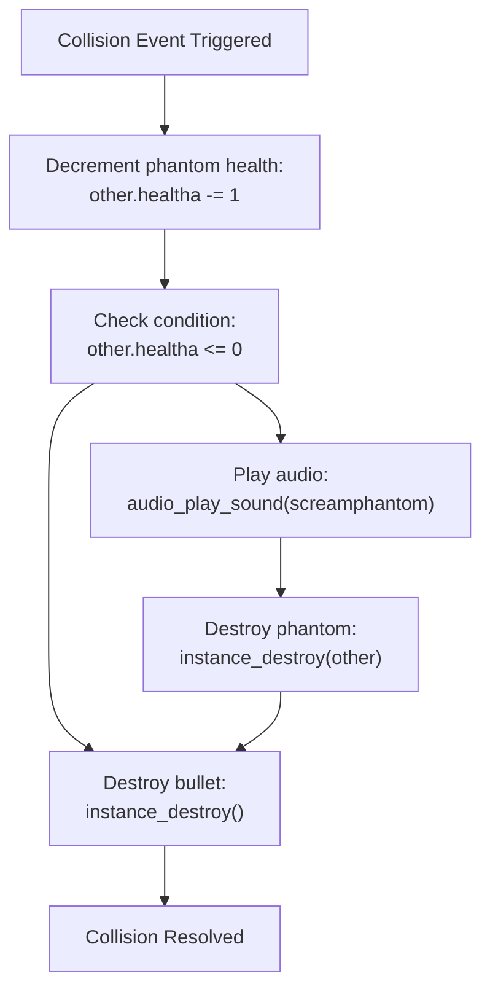

# Phantom Enemy Collisions

> **Relevant source files**
> * [magician project1/objects/Obj_bullet_flame/Collision_Obj_phantom.gml](https://github.com/axchisan/Haunted_hollow/blob/96079758/magician project1/objects/Obj_bullet_flame/Collision_Obj_phantom.gml)
> * [magician project1/objects/Obj_bullet_flame/Collision_Obj_phantom1.gml](https://github.com/axchisan/Haunted_hollow/blob/96079758/magician project1/objects/Obj_bullet_flame/Collision_Obj_phantom1.gml)
> * [magician project1/objects/Obj_bullet_flame/Collision_Obj_phantom_green.gml](https://github.com/axchisan/Haunted_hollow/blob/96079758/magician project1/objects/Obj_bullet_flame/Collision_Obj_phantom_green.gml)
> * [magician project1/objects/Obj_bullet_flame/Collision_Obj_phantom_green_1.gml](https://github.com/axchisan/Haunted_hollow/blob/96079758/magician project1/objects/Obj_bullet_flame/Collision_Obj_phantom_green_1.gml)
> * [magician project1/objects/Obj_bullet_flame/Collision_Obj_phantom_red.gml](https://github.com/axchisan/Haunted_hollow/blob/96079758/magician project1/objects/Obj_bullet_flame/Collision_Obj_phantom_red.gml)
> * [magician project1/objects/Obj_bullet_flame/Collision_Obj_phantom_red_1.gml](https://github.com/axchisan/Haunted_hollow/blob/96079758/magician project1/objects/Obj_bullet_flame/Collision_Obj_phantom_red_1.gml)

## Purpose and Scope

This document describes how player projectiles (`Obj_bullet_flame`) interact with phantom enemy types through collision detection and damage application. It covers the damage calculation, health depletion, audio feedback, and instance destruction for all phantom variants encountered in the game.

For collision handling with the boss enemy, see [Boss Collision Handling](/axchisan/Haunted_hollow/5.3-boss-collision-handling). For projectile interactions with level geometry, see [Environment Collision Detection](/axchisan/Haunted_hollow/5.5-environment-collision-detection).

---

## Phantom Enemy Types

The game features three color-coded phantom enemy types, each with two object variants. Player flame bullets have dedicated collision handlers for each phantom object type.

### Phantom Object Hierarchy

| Phantom Type | Primary Object | Variant Object | Visual Distinction |
| --- | --- | --- | --- |
| Gray Phantom | `Obj_phantom` | `Obj_phantom1` | Standard ghost enemy |
| Green Phantom | `Obj_phantom_green` | `Obj_phantom_green_1` | Enhanced variant |
| Red Phantom | `Obj_phantom_red` | `Obj_phantom_red_1` | Enhanced variant |

Each phantom object maintains its own health value in the `healtha` variable, which is decremented when hit by player projectiles.

**Sources:**

* [magician L1-L13](https://github.com/axchisan/Haunted_hollow/blob/96079758/magician project1/objects/Obj_bullet_flame/Collision_Obj_phantom.gml#L1-L13)
* [magician L1-L12](https://github.com/axchisan/Haunted_hollow/blob/96079758/magician project1/objects/Obj_bullet_flame/Collision_Obj_phantom1.gml#L1-L12)
* [magician L1-L13](https://github.com/axchisan/Haunted_hollow/blob/96079758/magician project1/objects/Obj_bullet_flame/Collision_Obj_phantom_green.gml#L1-L13)
* [magician L1-L12](https://github.com/axchisan/Haunted_hollow/blob/96079758/magician project1/objects/Obj_bullet_flame/Collision_Obj_phantom_green_1.gml#L1-L12)
* [magician L1-L12](https://github.com/axchisan/Haunted_hollow/blob/96079758/magician project1/objects/Obj_bullet_flame/Collision_Obj_phantom_red.gml#L1-L12)
* [magician L1-L12](https://github.com/axchisan/Haunted_hollow/blob/96079758/magician project1/objects/Obj_bullet_flame/Collision_Obj_phantom_red_1.gml#L1-L12)

---

## Collision Event Architecture

The `Obj_bullet_flame` object defines six separate collision events, one for each phantom object type. This architecture uses GameMaker's collision event system to automatically trigger damage logic when the bullet's collision mask intersects with a phantom's collision mask.

### Collision Event Mapping

```

```

**Sources:**

* [magician L1-L13](https://github.com/axchisan/Haunted_hollow/blob/96079758/magician project1/objects/Obj_bullet_flame/Collision_Obj_phantom.gml#L1-L13)
* [magician L1-L12](https://github.com/axchisan/Haunted_hollow/blob/96079758/magician project1/objects/Obj_bullet_flame/Collision_Obj_phantom1.gml#L1-L12)
* [magician L1-L13](https://github.com/axchisan/Haunted_hollow/blob/96079758/magician project1/objects/Obj_bullet_flame/Collision_Obj_phantom_green.gml#L1-L13)
* [magician L1-L12](https://github.com/axchisan/Haunted_hollow/blob/96079758/magician project1/objects/Obj_bullet_flame/Collision_Obj_phantom_green_1.gml#L1-L12)
* [magician L1-L12](https://github.com/axchisan/Haunted_hollow/blob/96079758/magician project1/objects/Obj_bullet_flame/Collision_Obj_phantom_red.gml#L1-L12)
* [magician L1-L12](https://github.com/axchisan/Haunted_hollow/blob/96079758/magician project1/objects/Obj_bullet_flame/Collision_Obj_phantom_red_1.gml#L1-L12)

---

## Damage Application Logic

All phantom collision handlers implement identical damage logic. When a collision is detected, the system:

1. Decrements the phantom's `healtha` variable by 1
2. Checks if health has depleted to zero or below
3. Conditionally triggers death sequence
4. Destroys the bullet instance

### Damage Calculation

The damage value is hardcoded to `-= 1` per bullet hit. There is no damage variation between phantom types or bullet properties.

```
other.healtha -= 1;
```

In GameMaker collision events, the `other` keyword references the instance that the current object collided with. Since these events are defined on `Obj_bullet_flame`, `other` refers to the phantom object instance.

**Sources:**

* [magician L4](https://github.com/axchisan/Haunted_hollow/blob/96079758/magician project1/objects/Obj_bullet_flame/Collision_Obj_phantom.gml#L4-L4)
* [magician L3](https://github.com/axchisan/Haunted_hollow/blob/96079758/magician project1/objects/Obj_bullet_flame/Collision_Obj_phantom1.gml#L3-L3)
* [magician L4](https://github.com/axchisan/Haunted_hollow/blob/96079758/magician project1/objects/Obj_bullet_flame/Collision_Obj_phantom_green.gml#L4-L4)

---

## Death Sequence

When a phantom's health depletes, a two-step death sequence executes within the same frame as the fatal hit.

### Death Sequence Flow

```mermaid
sequenceDiagram
  participant Obj_bullet_flame
  participant Obj_phantom
  participant (or variant)
  participant Audio System

  Obj_bullet_flame->>Obj_phantom: "Collision detected"
  Obj_bullet_flame->>Obj_phantom: "other.healtha -= 1"
  Obj_bullet_flame->>Obj_phantom: "Check if healtha <= 0"
  loop [Health Depleted]
    Obj_phantom->>Audio System: "audio_play_sound(screamphantom, 1, false)"
    Obj_phantom->>Obj_phantom: "instance_destroy(other)"
    note over Obj_phantom,(or variant): "Phantom instance removed"
  end
  Obj_bullet_flame->>Obj_bullet_flame: "instance_destroy()"
  note over Obj_bullet_flame: "Bullet instance removed"
```

### Death Condition Check

```
if (other.healtha <= 0) {
    audio_play_sound(screamphantom, 1, false);
    instance_destroy(other);
}
```

The condition uses `<=` rather than `==` to handle cases where health might drop below zero (though the current damage system always decrements by 1).

### Audio Feedback

The `screamphantom` sound plays at priority 1 with looping disabled (`false`). This audio cue provides immediate feedback that the phantom has been defeated.

**Sources:**

* [magician L7-L10](https://github.com/axchisan/Haunted_hollow/blob/96079758/magician project1/objects/Obj_bullet_flame/Collision_Obj_phantom.gml#L7-L10)
* [magician L6-L9](https://github.com/axchisan/Haunted_hollow/blob/96079758/magician project1/objects/Obj_bullet_flame/Collision_Obj_phantom1.gml#L6-L9)
* [magician L7-L10](https://github.com/axchisan/Haunted_hollow/blob/96079758/magician project1/objects/Obj_bullet_flame/Collision_Obj_phantom_green.gml#L7-L10)

---

## Bullet Destruction

Regardless of whether the phantom dies, the bullet always destroys itself after collision processing completes. This occurs via `instance_destroy()` called on the bullet instance.

```
instance_destroy();
```

This ensures bullets do not persist after impact, preventing:

* Bullets passing through enemies
* Multiple damage applications from a single projectile
* Visual artifacts of bullets overlapping defeated enemies

The bullet destruction occurs after the conditional death sequence, ensuring audio and enemy destruction execute before the bullet is removed.

**Sources:**

* [magician L12](https://github.com/axchisan/Haunted_hollow/blob/96079758/magician project1/objects/Obj_bullet_flame/Collision_Obj_phantom.gml#L12-L12)
* [magician L11](https://github.com/axchisan/Haunted_hollow/blob/96079758/magician project1/objects/Obj_bullet_flame/Collision_Obj_phantom1.gml#L11-L11)
* [magician L12](https://github.com/axchisan/Haunted_hollow/blob/96079758/magician project1/objects/Obj_bullet_flame/Collision_Obj_phantom_green.gml#L12-L12)

---

## Code Duplication Pattern

All six phantom collision handlers are functionally identical, implementing the same logic with only the collision target differing. This represents code duplication across the codebase.

### Collision Handler Comparison

| File | Lines | Logic Difference |
| --- | --- | --- |
| `Collision_Obj_phantom.gml` | 13 | None (includes comment) |
| `Collision_Obj_phantom1.gml` | 12 | None |
| `Collision_Obj_phantom_green.gml` | 13 | None (includes comment) |
| `Collision_Obj_phantom_green_1.gml` | 12 | None |
| `Collision_Obj_phantom_red.gml` | 12 | None |
| `Collision_Obj_phantom_red_1.gml` | 12 | None |

### Duplication Analysis

The duplication exists because GameMaker's collision event system requires separate events for each object type. Alternative approaches could include:

1. **Parent Object**: All phantoms could inherit from a common parent object, requiring only one collision event
2. **Collision Group**: GameMaker Studio 2.3+ supports collision filtering that could consolidate handlers
3. **Manual Detection**: Replace collision events with `place_meeting()` or `instance_place()` checks in Step event

The current implementation prioritizes simplicity and explicit behavior over code reuse.

**Sources:**

* [magician L1-L13](https://github.com/axchisan/Haunted_hollow/blob/96079758/magician project1/objects/Obj_bullet_flame/Collision_Obj_phantom.gml#L1-L13)
* [magician L1-L12](https://github.com/axchisan/Haunted_hollow/blob/96079758/magician project1/objects/Obj_bullet_flame/Collision_Obj_phantom1.gml#L1-L12)
* [magician L1-L13](https://github.com/axchisan/Haunted_hollow/blob/96079758/magician project1/objects/Obj_bullet_flame/Collision_Obj_phantom_green.gml#L1-L13)
* [magician L1-L12](https://github.com/axchisan/Haunted_hollow/blob/96079758/magician project1/objects/Obj_bullet_flame/Collision_Obj_phantom_green_1.gml#L1-L12)
* [magician L1-L12](https://github.com/axchisan/Haunted_hollow/blob/96079758/magician project1/objects/Obj_bullet_flame/Collision_Obj_phantom_red.gml#L1-L12)
* [magician L1-L12](https://github.com/axchisan/Haunted_hollow/blob/96079758/magician project1/objects/Obj_bullet_flame/Collision_Obj_phantom_red_1.gml#L1-L12)

---

## Complete Collision Processing Flow

The following diagram illustrates the complete execution flow when a player bullet collides with any phantom type.



**Sources:**

* [magician L1-L13](https://github.com/axchisan/Haunted_hollow/blob/96079758/magician project1/objects/Obj_bullet_flame/Collision_Obj_phantom.gml#L1-L13)
* [magician L1-L12](https://github.com/axchisan/Haunted_hollow/blob/96079758/magician project1/objects/Obj_bullet_flame/Collision_Obj_phantom1.gml#L1-L12)

---

## Implementation Notes

### Variable Naming Convention

All phantom objects use `healtha` (with trailing 'a') for their health variable. This differs from the player's health variable (`global.vida_actual`) and the boss's health variable (`global.boss_current_health`), which use global scope. Phantom health is instance-local.

### Death Sequence Timing

The death sequence (audio + destruction) executes within the same frame as the collision. There is no death animation or fade-out effect. The phantom instance is immediately removed from the game after `instance_destroy()` is called.

### Collision Order

GameMaker processes collision events in the order they are defined in the object's event list. Since bullet destruction occurs at the end of the handler, the bullet can only damage one phantom per frame, even if it overlaps multiple enemies.

**Sources:**

* [magician L4-L12](https://github.com/axchisan/Haunted_hollow/blob/96079758/magician project1/objects/Obj_bullet_flame/Collision_Obj_phantom.gml#L4-L12)