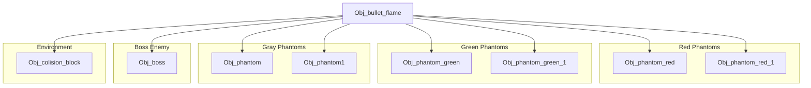
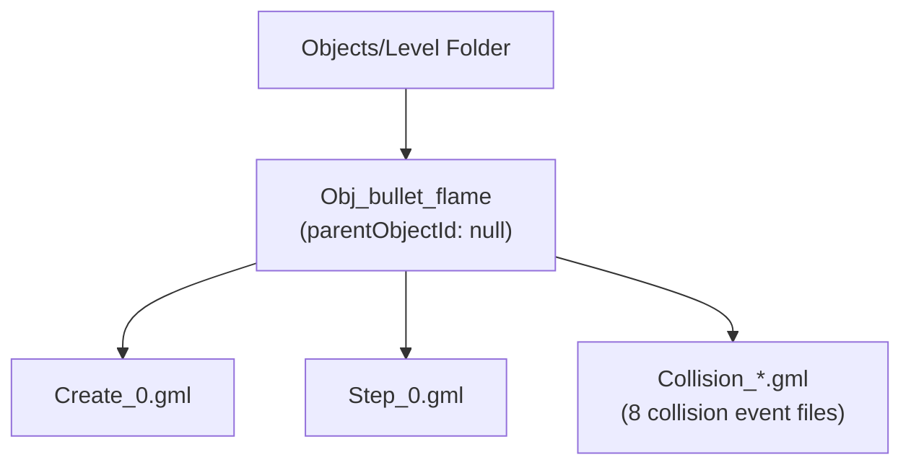

# Player Projectile Definition

> **Relevant source files**
> * [magician project1/objects/Obj_bullet_flame/Obj_bullet_flame.yy](https://github.com/axchisan/Haunted_hollow/blob/96079758/magician project1/objects/Obj_bullet_flame/Obj_bullet_flame.yy)

## Purpose and Scope

This document defines the structure and configuration of `Obj_bullet_flame`, the player's projectile object in Haunted Hollow. It covers the object's event registrations, collision event mappings, sprite associations, and property configurations as defined in the GameMaker object definition file.

This page focuses exclusively on the object's **structure and definition**. For implementation details of how projectiles are created and move, see [Projectile Initialization and Movement](/axchisan/Haunted_hollow/5.2-projectile-initialization-and-movement). For collision handling logic with specific enemy types, see [Boss Collision Handling](/axchisan/Haunted_hollow/5.3-boss-collision-handling), [Phantom Enemy Collisions](/axchisan/Haunted_hollow/5.4-phantom-enemy-collisions), and [Environment Collision Detection](/axchisan/Haunted_hollow/5.5-environment-collision-detection).

---

## Object Overview

`Obj_bullet_flame` is the primary projectile fired by the player character (`Obj_magician`). It is defined as a non-physics, non-persistent object located in the Level objects folder within the project hierarchy.

### Basic Properties

| Property | Value | Description |
| --- | --- | --- |
| **Object Name** | `Obj_bullet_flame` | Unique identifier in GameMaker project |
| **Parent Object** | `null` | No inheritance; standalone object |
| **Sprite** | `Spr_bullet_flame` | Visual representation of the projectile |
| **Persistent** | `false` | Destroyed when room changes |
| **Visible** | `true` | Rendered on screen |
| **Solid** | `false` | Does not block movement |
| **Physics Enabled** | `false` | Uses standard GameMaker movement system |

The object is categorized under `folders/Objects/Level.yy`, grouping it with other level-specific entities rather than player-specific objects.

**Sources:** [magician L1-L47](https://github.com/axchisan/Haunted_hollow/blob/96079758/magician project1/objects/Obj_bullet_flame/Obj_bullet_flame.yy#L1-L47)

---

## Event Structure

`Obj_bullet_flame` defines ten events that handle its lifecycle, movement, and interactions. The event structure follows GameMaker's event system, with each event type corresponding to a specific execution phase.

```

```

### Core Events

| Event Type | Event Number | Purpose |
| --- | --- | --- |
| **Create** | 0 | Initialization logic executed once when projectile is spawned |
| **Step** | 0 | Per-frame logic for movement and behavior updates |

### Collision Events

The object registers eight collision events, each targeting a specific collidable entity in the game world. GameMaker automatically checks for collisions each frame and executes the corresponding event handler when overlap is detected.

**Sources:** [magician L4-L15](https://github.com/axchisan/Haunted_hollow/blob/96079758/magician project1/objects/Obj_bullet_flame/Obj_bullet_flame.yy#L4-L15)

---

## Collision Event Registry

`Obj_bullet_flame` defines collision handlers for all damageable entities in the game, plus environmental obstacles. This comprehensive collision mapping ensures the projectile responds appropriately to every interactive object it encounters.



### Enemy Collision Targets

| Collision Target | Object Path | Enemy Type |
| --- | --- | --- |
| `Obj_boss` | `objects/Obj_boss/Obj_boss.yy` | Primary boss enemy |
| `Obj_phantom` | `objects/Obj_phantom/Obj_phantom.yy` | Gray phantom (standard) |
| `Obj_phantom1` | `objects/Obj_phantom1/Obj_phantom1.yy` | Gray phantom (variant 1) |
| `Obj_phantom_green` | `objects/Obj_phantom_green/Obj_phantom_green.yy` | Green phantom (standard) |
| `Obj_phantom_green_1` | `objects/Obj_phantom_green_1/Obj_phantom_green_1.yy` | Green phantom (variant 1) |
| `Obj_phantom_red` | `objects/Obj_phantom_red/Obj_phantom_red.yy` | Red phantom (standard) |
| `Obj_phantom_red_1` | `objects/Obj_phantom_red_1/Obj_phantom_red_1.yy` | Red phantom (variant 1) |

### Environmental Collision Targets

| Collision Target | Object Path | Purpose |
| --- | --- | --- |
| `Obj_colision_block` | `objects/Obj_colision_block/Obj_colision_block.yy` | Level geometry and walls |

The registration of multiple phantom variants (standard and "1" variants) suggests that phantoms may have different behavioral states or spawn conditions, but all require collision detection with player projectiles.

**Sources:** [magician L6-L14](https://github.com/axchisan/Haunted_hollow/blob/96079758/magician project1/objects/Obj_bullet_flame/Obj_bullet_flame.yy#L6-L14)

---

## Sprite and Visual Properties

The projectile uses `Spr_bullet_flame` as its visual representation. GameMaker automatically associates this sprite with the object at runtime, handling rendering, animation frame progression, and visual dimensions for collision detection.

### Sprite Configuration

| Property | Value |
| --- | --- |
| **Sprite ID** | `Spr_bullet_flame` |
| **Sprite Path** | `sprites/Spr_bullet_flame/Spr_bullet_flame.yy` |
| **Sprite Mask** | `null` (uses sprite's own collision mask) |

The absence of a custom sprite mask means collision detection uses the sprite's natural bounding box or per-pixel alpha channel, depending on GameMaker's collision mode settings.

**Sources:** [magician L41-L45](https://github.com/axchisan/Haunted_hollow/blob/96079758/magician project1/objects/Obj_bullet_flame/Obj_bullet_flame.yy#L41-L45)

---

## Physics Configuration

`Obj_bullet_flame` is configured as a non-physics object, relying on GameMaker's standard movement system (`speed` and `direction` variables) rather than the physics engine. This provides deterministic, arcade-style projectile motion suitable for bullet-hell gameplay.

### Physics Properties

| Property | Value | Implication |
| --- | --- | --- |
| `physicsObject` | `false` | Standard movement system used |
| `physicsKinematic` | `false` | Not affected by physics forces |
| `physicsSensor` | `false` | N/A (physics disabled) |
| `physicsStartAwake` | `true` | N/A (physics disabled) |
| `physicsAngularDamping` | 0.1 | N/A (physics disabled) |
| `physicsLinearDamping` | 0.1 | N/A (physics disabled) |
| `physicsDensity` | 0.5 | N/A (physics disabled) |
| `physicsFriction` | 0.2 | N/A (physics disabled) |
| `physicsRestitution` | 0.1 | N/A (physics disabled) |
| `physicsGroup` | 1 | N/A (physics disabled) |
| `physicsShape` | 1 | N/A (physics disabled) |
| `physicsShapePoints` | `[]` | N/A (physics disabled) |

Although physics properties are defined in the object file (likely GameMaker's default structure), they have no effect since `physicsObject` is `false`. The projectile's movement is controlled programmatically via the Step event.

**Sources:** [magician L25-L36](https://github.com/axchisan/Haunted_hollow/blob/96079758/magician project1/objects/Obj_bullet_flame/Obj_bullet_flame.yy#L25-L36)

---

## Object Hierarchy and Organization

`Obj_bullet_flame` has no parent object, making it a root-level entity in the GameMaker object hierarchy. This design choice means it does not inherit behaviors from a base projectile class, and all functionality must be explicitly defined within its own events.



### Project Organization

* **Folder Path:** `folders/Objects/Level.yy`
* **Parent Object:** None (`parentObjectId: null`)
* **Managed:** `true` (tracked by GameMaker's resource management system)
* **Overridden Properties:** `[]` (no parent properties to override)

The placement in the "Level" folder groups the projectile with environmental objects rather than player-specific entities, suggesting organizational focus on in-game entities that exist within the level space during gameplay.

**Sources:** [magician L16-L24](https://github.com/axchisan/Haunted_hollow/blob/96079758/magician project1/objects/Obj_bullet_flame/Obj_bullet_flame.yy#L16-L24)

---

## Event Implementation Files

While this page documents the object's structure, the actual event code is stored in separate GML (GameMaker Language) files within the object's directory. The following files implement the declared events:

| Event | Implementation File |
| --- | --- |
| Create Event | `Obj_bullet_flame/Create_0.gml` |
| Step Event | `Obj_bullet_flame/Step_0.gml` |
| Collision: Obj_colision_block | `Obj_bullet_flame/Collision_Obj_colision_block.gml` |
| Collision: Obj_boss | `Obj_bullet_flame/Collision_Obj_boss.gml` |
| Collision: Obj_phantom | `Obj_bullet_flame/Collision_Obj_phantom.gml` |
| Collision: Obj_phantom1 | `Obj_bullet_flame/Collision_Obj_phantom1.gml` |
| Collision: Obj_phantom_green | `Obj_bullet_flame/Collision_Obj_phantom_green.gml` |
| Collision: Obj_phantom_green_1 | `Obj_bullet_flame/Collision_Obj_phantom_green_1.gml` |
| Collision: Obj_phantom_red | `Obj_bullet_flame/Collision_Obj_phantom_red.gml` |
| Collision: Obj_phantom_red_1 | `Obj_bullet_flame/Collision_Obj_phantom_red_1.gml` |

For detailed documentation of these implementations, refer to subsequent pages in this section.

**Sources:** [magician L4-L15](https://github.com/axchisan/Haunted_hollow/blob/96079758/magician project1/objects/Obj_bullet_flame/Obj_bullet_flame.yy#L4-L15)