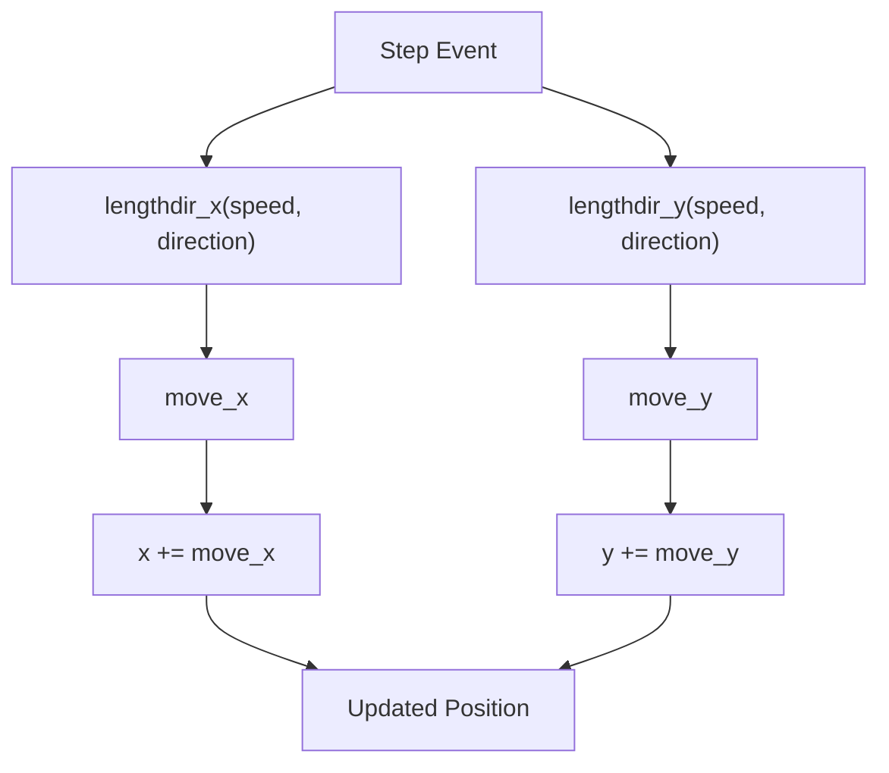
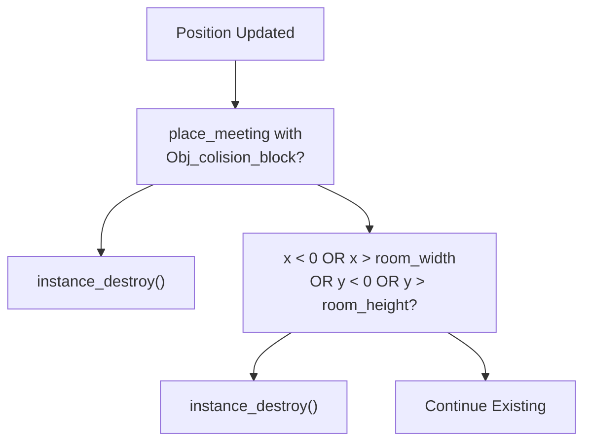
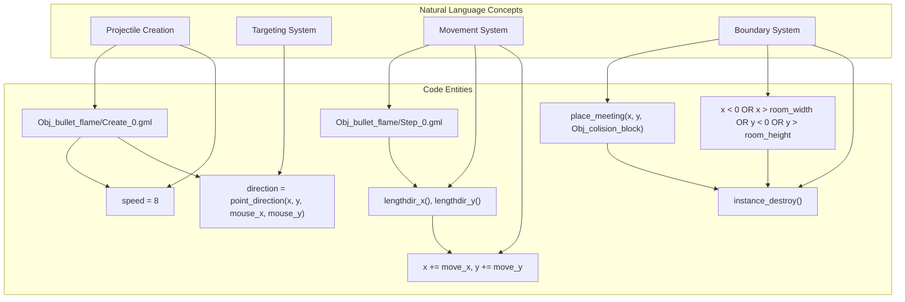

# Projectile Initialization and Movement

> **Relevant source files**
> * [magician project1/objects/Obj_bullet_flame/Create_0.gml](https://github.com/axchisan/Haunted_hollow/blob/96079758/magician project1/objects/Obj_bullet_flame/Create_0.gml)
> * [magician project1/objects/Obj_bullet_flame/Obj_bullet_flame.yy](https://github.com/axchisan/Haunted_hollow/blob/96079758/magician project1/objects/Obj_bullet_flame/Obj_bullet_flame.yy)
> * [magician project1/objects/Obj_bullet_flame/Step_0.gml](https://github.com/axchisan/Haunted_hollow/blob/96079758/magician project1/objects/Obj_bullet_flame/Step_0.gml)

## Purpose and Scope

This page documents the initialization and movement mechanics of player projectiles in Haunted Hollow. It covers how `Obj_bullet_flame` instances are created, how they calculate targeting toward the mouse cursor, and how they move through the game world each frame. This page focuses specifically on the projectile lifecycle from creation to movement, including boundary checking and self-destruction when leaving the room.

For collision handling with enemies, see [Boss Collision Handling](/axchisan/Haunted_hollow/5.3-boss-collision-handling) and [Phantom Enemy Collisions](/axchisan/Haunted_hollow/5.4-phantom-enemy-collisions). For detailed collision with level geometry, see [Environment Collision Detection](/axchisan/Haunted_hollow/5.5-environment-collision-detection).

---

## Object Definition

The player projectile is implemented as `Obj_bullet_flame`, which resides in the Level object folder within the GameMaker project structure. This object is non-solid and non-physics-enabled, using GameMaker's built-in speed and direction system for movement.

### Object Properties

| Property | Value | Description |
| --- | --- | --- |
| Object Name | `Obj_bullet_flame` | Player projectile identifier |
| Parent Object | `null` | No inheritance hierarchy |
| Sprite | `Spr_bullet_flame` | Visual representation |
| Solid | `false` | Does not block other objects |
| Physics Object | `false` | Uses GameMaker's built-in motion system |
| Persistent | `false` | Destroyed when room changes |
| Visible | `true` | Rendered to screen |

**Sources:** [magician L16-L46](https://github.com/axchisan/Haunted_hollow/blob/96079758/magician project1/objects/Obj_bullet_flame/Obj_bullet_flame.yy#L16-L46)

---

## Initialization Process

When a player projectile is spawned, the Create event (`Create_0`) executes initialization logic that sets the bullet's speed and calculates its direction toward the mouse cursor position.

### Create Event Sequence

```

```

**Diagram:** Obj_bullet_flame initialization sequence showing speed assignment and direction calculation.

### Speed Configuration

The bullet's movement speed is hardcoded to 8 pixels per frame:

```
speed = 8;
```

This value determines how quickly the projectile traverses the game world. At 60 frames per second (GameMaker's default), this translates to 480 pixels per second.

**Sources:** [magician L1](https://github.com/axchisan/Haunted_hollow/blob/96079758/magician project1/objects/Obj_bullet_flame/Create_0.gml#L1-L1)

### Direction Calculation

The projectile's direction is calculated using GameMaker's `point_direction()` function, which computes the angle in degrees from the bullet's spawn position to the mouse cursor:

```
direction = point_direction(x, y, mouse_x, mouse_y);
```

This function returns an angle in the range [0, 360) degrees, where](https://github.com/axchisan/Haunted_hollow/blob/96079758/0, 360) degrees, where#LNaN-LNaN)

---

## Movement System

The projectile's movement is handled in the Step event (`Step_0`), which executes every frame. This event calculates movement vectors, updates position, checks boundaries, and handles collision with level geometry.

### Movement Calculation Flow



**Diagram:** Per-frame movement calculation using directional vector components.

### Vector Decomposition

GameMaker's `lengthdir_x()` and `lengthdir_y()` functions decompose the speed and direction into X and Y components:

```javascript
var move_x = lengthdir_x(speed, direction);
var move_y = lengthdir_y(speed, direction);
```

These functions compute:

* `move_x = speed * cos(direction)`
* `move_y = speed * sin(direction)`

This converts polar coordinates (speed, direction) into Cartesian coordinates (move_x, move_y) for position updates.

**Sources:** [magician L4-L5](https://github.com/axchisan/Haunted_hollow/blob/96079758/magician project1/objects/Obj_bullet_flame/Step_0.gml#L4-L5)

### Position Update

The calculated movement vectors are applied to the projectile's position each frame:

```
x += move_x;
y += move_y;
```

This direct position manipulation occurs before collision checking, ensuring the bullet moves to its intended location before testing for impacts.

**Sources:** [magician L6-L7](https://github.com/axchisan/Haunted_hollow/blob/96079758/magician project1/objects/Obj_bullet_flame/Step_0.gml#L6-L7)

---

## Boundary Management

The projectile implements two boundary management mechanisms: immediate collision-based destruction and room boundary checking.

### Boundary Checking Logic



**Diagram:** Decision tree for projectile boundary checking and destruction conditions.

### Collision Block Destruction

After position updates, the projectile checks if it occupies the same space as an `Obj_colision_block` instance:

```
if (place_meeting(x, y, Obj_colision_block)) {
    instance_destroy();
}
```

The `place_meeting()` function tests for collision at the current position. If any collision block is detected, the projectile immediately destroys itself. This prevents bullets from passing through walls and level geometry.

**Sources:** [magician L10-L12](https://github.com/axchisan/Haunted_hollow/blob/96079758/magician project1/objects/Obj_bullet_flame/Step_0.gml#L10-L12)

### Room Boundary Destruction

The projectile also checks if it has exited the room boundaries:

```
if (x < 0 || x > room_width || y < 0 || y > room_height) {
    instance_destroy();
}
```

This four-condition check tests all room edges:

* Left edge: `x < 0`
* Right edge: `x > room_width`
* Top edge: `y < 0`
* Bottom edge: `y > room_height`

If any condition is true, the bullet is destroyed to prevent memory leaks from projectiles continuing indefinitely outside the playable area.

**Sources:** [magician L14-L17](https://github.com/axchisan/Haunted_hollow/blob/96079758/magician project1/objects/Obj_bullet_flame/Step_0.gml#L14-L17)

---

## Movement Parameters Summary

The following table summarizes the key parameters governing projectile movement:

| Parameter | Value | Unit | Notes |
| --- | --- | --- | --- |
| Speed | 8 | pixels/frame | Constant throughout lifetime |
| Direction | Calculated | degrees | Set once at creation toward mouse |
| Movement Type | Linear | - | Straight-line trajectory |
| Boundary Check | Every frame | - | Room edges and collision blocks |
| Destruction Triggers | 2 | - | Out of bounds or wall collision |

**Sources:** [magician L1-L4](https://github.com/axchisan/Haunted_hollow/blob/96079758/magician project1/objects/Obj_bullet_flame/Create_0.gml#L1-L4)

 [magician L1-L17](https://github.com/axchisan/Haunted_hollow/blob/96079758/magician project1/objects/Obj_bullet_flame/Step_0.gml#L1-L17)

---

## Code Entity Mapping

The following diagram maps the natural language concepts to their code implementations:



**Diagram:** Mapping between system concepts and their code implementations in Obj_bullet_flame.

**Sources:** [magician L1-L4](https://github.com/axchisan/Haunted_hollow/blob/96079758/magician project1/objects/Obj_bullet_flame/Create_0.gml#L1-L4)

 [magician L1-L17](https://github.com/axchisan/Haunted_hollow/blob/96079758/magician project1/objects/Obj_bullet_flame/Step_0.gml#L1-L17)

---

## Integration Points

The projectile initialization and movement system integrates with other game systems through the following mechanisms:

### Spawn Trigger

Player projectiles are spawned via the `scrHandleShooting` script when the player clicks the mouse. The script creates an `Obj_bullet_flame` instance at the player's position, triggering the Create event documented in this page.

### Collision System Integration

While movement is self-contained, the projectile participates in the broader collision system through:

* Enemy collision events (documented in [Boss Collision Handling](/axchisan/Haunted_hollow/5.3-boss-collision-handling) and [Phantom Enemy Collisions](/axchisan/Haunted_hollow/5.4-phantom-enemy-collisions))
* Environment collision detection with `Obj_colision_block` (basic check in Step event, detailed in [Environment Collision Detection](/axchisan/Haunted_hollow/5.5-environment-collision-detection))

**Sources:** [magician L4-L14](https://github.com/axchisan/Haunted_hollow/blob/96079758/magician project1/objects/Obj_bullet_flame/Obj_bullet_flame.yy#L4-L14)