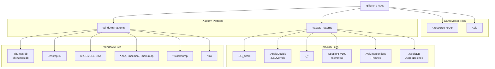
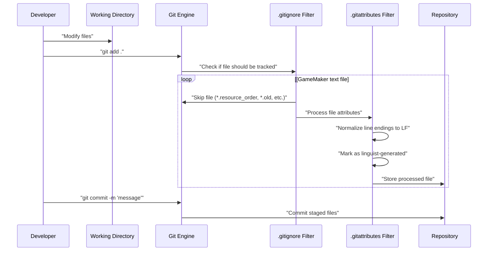

# Version Control Configuration

> **Relevant source files**
> * [magician project1/.gitattributes](https://github.com/axchisan/Haunted_hollow/blob/96079758/magician project1/.gitattributes)
> * [magician project1/.gitignore](https://github.com/axchisan/Haunted_hollow/blob/96079758/magician project1/.gitignore)

## Purpose and Scope

This document describes the Git version control configuration for the Haunted Hollow project. It covers the `.gitattributes` and `.gitignore` files that control how Git handles GameMaker Studio 2 project files, including line ending normalization, language statistics generation, and file exclusion patterns.

For information about the overall GameMaker project structure and organization, see [GameMaker Project Structure](/axchisan/Haunted_hollow/8.1-gamemaker-project-structure). For details on the build and distribution process, see [Building and Distribution](/axchisan/Haunted_hollow/8.3-building-and-distribution).

**Sources:** [magician project1/.gitattributes](https://github.com/axchisan/Haunted_hollow/blob/96079758/magician project1/.gitattributes)

 [magician project1/.gitignore](https://github.com/axchisan/Haunted_hollow/blob/96079758/magician project1/.gitignore)

---

## Git Attributes Configuration

The `.gitattributes` file configures Git's behavior for specific file types within the GameMaker project. This file ensures consistent handling across different development environments and platforms.

### Language Statistics Override

```
*.yy linguist-generated=true
```

This directive marks all `.yy` files (GameMaker YAML metadata files) as generated content. When GitHub analyzes the repository's language composition, it excludes these files from statistics, providing a more accurate representation of hand-written code versus auto-generated project metadata.

**Sources:** [magician L1-L2](https://github.com/axchisan/Haunted_hollow/blob/96079758/magician project1/.gitattributes#L1-L2)

### Line Ending Normalization

The configuration enforces LF (Line Feed, Unix-style) line endings for all text-based GameMaker files:

| File Extension | Line Ending | Purpose |
| --- | --- | --- |
| `*.gml` | `eol=lf` | GameMaker Language script files |
| `*.yy` | `eol=lf` | GameMaker YAML object/resource metadata |
| `*.yyp` | `eol=lf` | GameMaker project definition file |
| `*.json` | `eol=lf` | JSON configuration and data files |

This normalization prevents merge conflicts caused by line ending differences between Windows (CRLF) and Unix-based (LF) systems. GameMaker Studio 2 itself uses LF endings internally, making this configuration essential for multi-platform development.

**Sources:** [magician L4-L8](https://github.com/axchisan/Haunted_hollow/blob/96079758/magician project1/.gitattributes#L4-L8)

### File Type Handling Flow

```

```

**Diagram: Git Attributes Processing Pipeline**

This diagram shows how files are processed when committed to the repository. GameMaker metadata files (`.yy`) receive both linguist marking and line ending normalization, while script and configuration files (`.gml`, `.yyp`, `.json`) only receive line ending normalization.

**Sources:** [magician L1-L8](https://github.com/axchisan/Haunted_hollow/blob/96079758/magician project1/.gitattributes#L1-L8)

---

## Git Ignore Configuration

The `.gitignore` file specifies which files and directories Git should exclude from version control. This prevents temporary files, system-generated files, and build artifacts from cluttering the repository.

### Platform-Specific Ignore Patterns

#### Windows Exclusions

The configuration excludes Windows-specific system files:

| Pattern | Description | Purpose |
| --- | --- | --- |
| `Thumbs.db`, `ehthumbs.db` | Thumbnail cache databases | Windows Explorer generated caches |
| `[Dd]esktop.ini` | Folder configuration | Windows folder customization data |
| `$RECYCLE.BIN/` | Recycle bin directory | Windows trash folder |
| `*.stackdump` | Crash dump files | Windows application crash reports |
| `*.cab`, `*.msi`, `*.msix`, `*.msm`, `*.msp` | Installer packages | Windows installation files |
| `*.lnk` | Shortcut files | Windows file shortcuts |

**Sources:** [magician L1-L26](https://github.com/axchisan/Haunted_hollow/blob/96079758/magician project1/.gitignore#L1-L26)

#### macOS Exclusions

The configuration excludes macOS-specific system files:

| Pattern | Description | Purpose |
| --- | --- | --- |
| `.DS_Store` | Directory services store | macOS folder metadata |
| `.AppleDouble`, `.LSOverride` | Resource fork files | macOS file system metadata |
| `._*` | AppleDouble resource forks | Hidden metadata files |
| `.Spotlight-V100`, `.fseventsd` | Spotlight index files | macOS search indexing |
| `.Trashes`, `.VolumeIcon.icns` | Volume metadata | macOS volume information |
| `.AppleDB`, `.AppleDesktop` | AFP share directories | Apple Filing Protocol metadata |

**Sources:** [magician L28-L55](https://github.com/axchisan/Haunted_hollow/blob/96079758/magician project1/.gitignore#L28-L55)

### GameMaker-Specific Exclusions

```
*.resource_order
*.old
```

These patterns exclude GameMaker-generated temporary and backup files:

* **`*.resource_order`**: Auto-generated files that define the display order of resources in the GameMaker IDE. These are frequently modified during development and can cause unnecessary merge conflicts without affecting game functionality.
* **`*.old`**: Backup files created by GameMaker when modifying resources. These are temporary recovery files that should not be versioned.

**Sources:** [magician L57-L59](https://github.com/axchisan/Haunted_hollow/blob/96079758/magician project1/.gitignore#L57-L59)

### Ignore Pattern Hierarchy



**Diagram: Git Ignore Pattern Organization**

The ignore patterns are organized into three categories: Windows platform files, macOS platform files, and GameMaker-specific temporary files. This structure enables cross-platform development while excluding system-specific artifacts.

**Sources:** [magician L1-L59](https://github.com/axchisan/Haunted_hollow/blob/96079758/magician project1/.gitignore#L1-L59)

---

## Version Control Workflow

### File Commit Flow with Ignore and Attribute Filtering



**Diagram: Version Control File Processing Sequence**

This sequence diagram illustrates how files flow through Git's filtering system. When a developer commits files, Git first consults `.gitignore` to determine which files to track. Files that pass the ignore filter are then processed by `.gitattributes` for line ending normalization and linguist marking before being stored in the repository.

**Sources:** [magician project1/.gitignore](https://github.com/axchisan/Haunted_hollow/blob/96079758/magician project1/.gitignore)

 [magician project1/.gitattributes](https://github.com/axchisan/Haunted_hollow/blob/96079758/magician project1/.gitattributes)

---

## Configuration File Locations

Both configuration files reside in the project root directory:

```
magician project1/
├── .gitattributes
├── .gitignore
├── mague.yyp
├── options/
├── rooms/
├── scripts/
├── sounds/
└── sprites/
```

The placement at the root level ensures these rules apply to all subdirectories and files within the GameMaker project structure.

**Sources:** [magician project1/.gitattributes](https://github.com/axchisan/Haunted_hollow/blob/96079758/magician project1/.gitattributes)

 [magician project1/.gitignore](https://github.com/axchisan/Haunted_hollow/blob/96079758/magician project1/.gitignore)

---

## Cross-Platform Considerations

### Line Ending Consistency

GameMaker Studio 2 internally uses LF line endings for all text-based project files. The `.gitattributes` configuration enforces this standard regardless of the developer's operating system:

* **Windows developers** using Git for Windows will automatically convert CRLF to LF on commit and LF to CRLF on checkout (unless overridden by `.gitattributes`)
* **Unix/Linux/macOS developers** natively use LF and will not experience conversions

By forcing `eol=lf` for GameMaker files, the configuration eliminates line ending-related merge conflicts and ensures consistent file hashes across platforms.

**Sources:** [magician L4-L8](https://github.com/axchisan/Haunted_hollow/blob/96079758/magician project1/.gitattributes#L4-L8)

### System File Exclusion

The comprehensive ignore patterns for both Windows and macOS ensure that:

1. Developers on either platform can work without committing system files
2. File explorers and system indexing services don't pollute the repository
3. Cross-platform collaboration remains clean without platform-specific artifacts appearing in commits

**Sources:** [magician L1-L55](https://github.com/axchisan/Haunted_hollow/blob/96079758/magician project1/.gitignore#L1-L55)

---

## Best Practices for Repository Maintenance

### Updating Ignore Patterns

When adding new GameMaker resources or encountering new temporary file types, update `.gitignore` to exclude them:

```markdown
# Example additions for build output
/build/
/compiled/
*.log
```

### Verifying Line Ending Configuration

To verify that line endings are properly configured, developers can use:

```

```

This command displays the line ending configuration for each tracked file, confirming that GameMaker files use LF endings.

**Sources:** [magician project1/.gitattributes](https://github.com/axchisan/Haunted_hollow/blob/96079758/magician project1/.gitattributes)

---

## Summary

The version control configuration consists of two complementary files:

1. **`.gitattributes`**: Ensures GameMaker project files (`.gml`, `.yy`, `.yyp`, `.json`) use consistent LF line endings and marks auto-generated metadata files for language statistics exclusion.
2. **`.gitignore`**: Excludes platform-specific system files (Windows and macOS) and GameMaker temporary files (`*.resource_order`, `*.old`) from version control.

Together, these configurations enable clean cross-platform collaboration while maintaining GameMaker Studio 2 project integrity.

**Sources:** [magician project1/.gitattributes](https://github.com/axchisan/Haunted_hollow/blob/96079758/magician project1/.gitattributes)

 [magician project1/.gitignore](https://github.com/axchisan/Haunted_hollow/blob/96079758/magician project1/.gitignore)