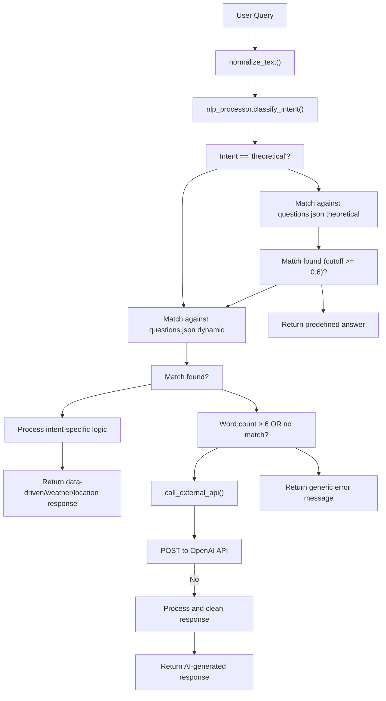
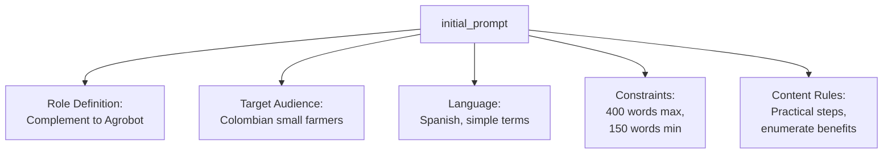
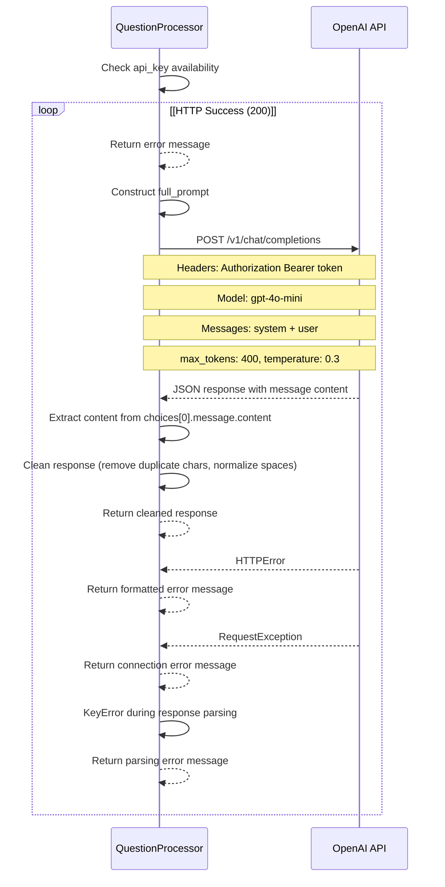
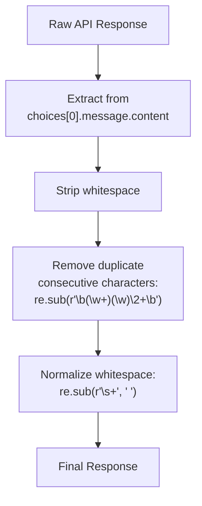
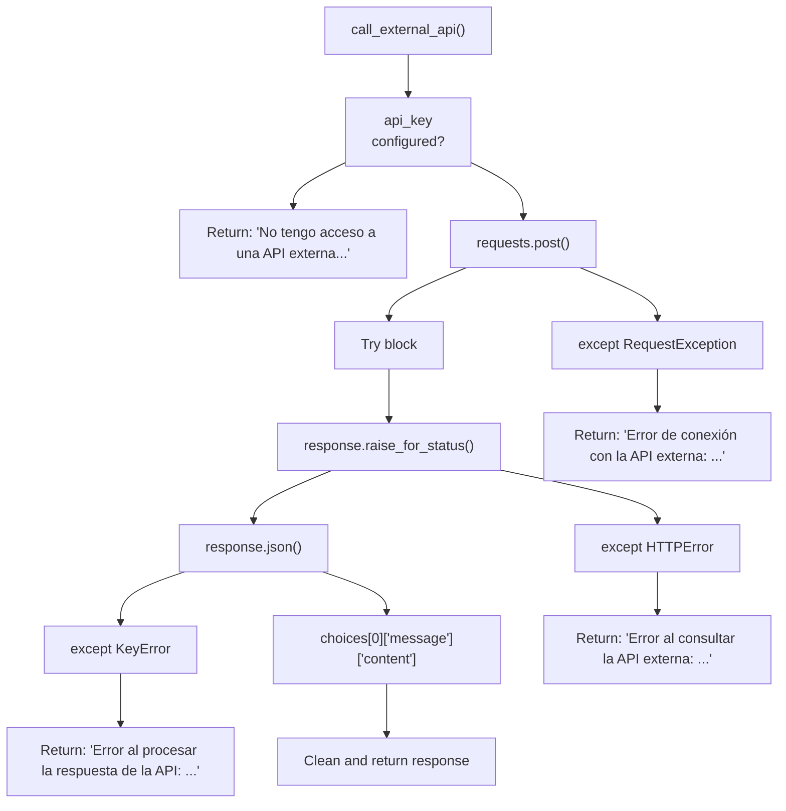
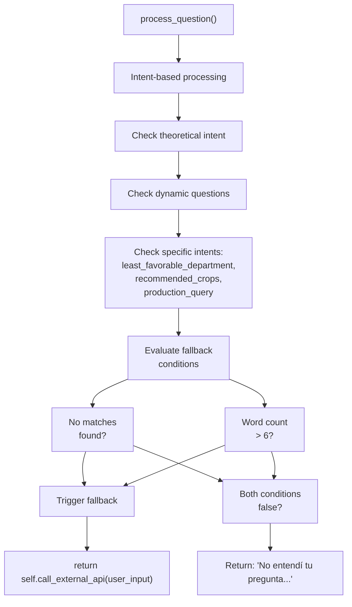
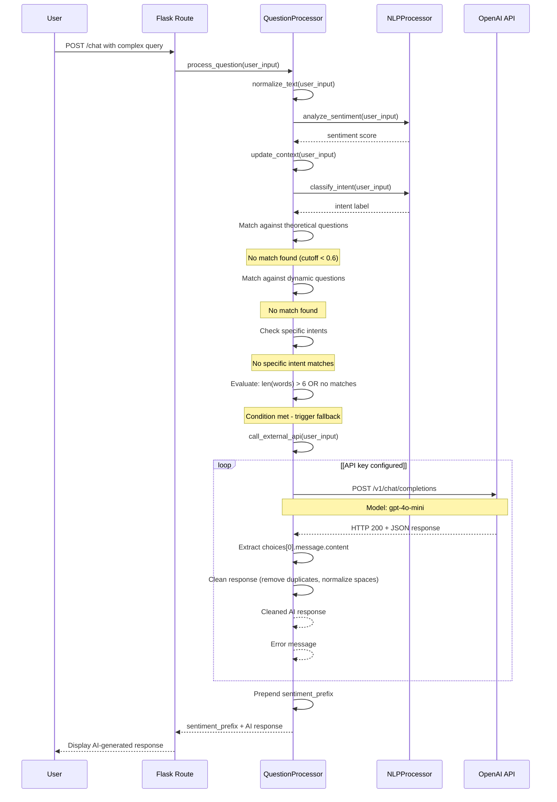

# AI Fallback Service

> **Relevant source files**
> * [app/chatbot/__init__.py](https://github.com/axchisan/ProyectoAgroBot/blob/bc782fcf/app/chatbot/__init__.py)
> * [app/chatbot/question_processor.py](https://github.com/axchisan/ProyectoAgroBot/blob/bc782fcf/app/chatbot/question_processor.py)

## Purpose and Scope

The AI Fallback Service provides a mechanism for handling user queries that cannot be answered through the chatbot's built-in knowledge base or data-driven responses. When Agrobot encounters a complex, unrecognized, or out-of-scope agricultural question, it delegates to OpenAI's GPT-4o-mini model to generate contextually appropriate responses for Colombian farmers.

This document covers the integration architecture, prompt engineering, request/response handling, and error management for the external AI service. For information about the primary question processing flow, see [Question Processing](/axchisan/ProyectoAgroBot/4.2-question-processing). For intent classification that determines when fallback is needed, see [Intent Classification](/axchisan/ProyectoAgroBot/4.3-intent-classification).

---

## System Architecture

The AI Fallback Service operates as the final tier in Agrobot's multi-tier response strategy. It is invoked only when pattern matching, intent-based routing, and data-driven responses fail to produce a suitable answer.

### Fallback Decision Flow



**Sources:** [app/chatbot/question_processor.py L132-L344](https://github.com/axchisan/ProyectoAgroBot/blob/bc782fcf/app/chatbot/question_processor.py#L132-L344)

---

## Configuration and Initialization

The AI Fallback Service requires an OpenAI API key for operation. The key is configured during chatbot initialization and can be provided through environment variables or direct parameter passing.

### Initialization Parameters

| Parameter | Type | Default | Purpose |
| --- | --- | --- | --- |
| `api_key` | `str` | `"Api Key"` | OpenAI API authentication key |
| `api_type` | `str` | `"openai"` | API provider type (currently only OpenAI supported) |

The initialization process in `init_chatbot` retrieves the API key from the environment variable `OPENAI_API_KEY` if not explicitly provided:

[app/chatbot/__init__.py L29](https://github.com/axchisan/ProyectoAgroBot/blob/bc782fcf/app/chatbot/__init__.py#L29-L29)

```
openai_api_key = openai_api_key or os.getenv("OPENAI_API_KEY", "Api Key")
```

The key is then passed to the `QuestionProcessor` constructor:

[app/chatbot/__init__.py L35-L43](https://github.com/axchisan/ProyectoAgroBot/blob/bc782fcf/app/chatbot/__init__.py#L35-L43)

### QuestionProcessor Configuration

The `QuestionProcessor` class stores API configuration as instance attributes:

[app/chatbot/question_processor.py L19-L21](https://github.com/axchisan/ProyectoAgroBot/blob/bc782fcf/app/chatbot/question_processor.py#L19-L21)

```
self.api_key = api_key
self.api_type = api_type.lower()
```

**Sources:** [app/chatbot/__init__.py L6-L44](https://github.com/axchisan/ProyectoAgroBot/blob/bc782fcf/app/chatbot/__init__.py#L6-L44)

 [app/chatbot/question_processor.py L12-L21](https://github.com/axchisan/ProyectoAgroBot/blob/bc782fcf/app/chatbot/question_processor.py#L12-L21)

---

## Prompt Engineering

The AI Fallback Service uses a carefully crafted system prompt to ensure responses are contextually appropriate for Colombian small farmers. The prompt is defined as an instance attribute and used consistently across all API calls.

### System Prompt Structure



The complete system prompt is stored in `QuestionProcessor.initial_prompt`:

[app/chatbot/question_processor.py L35-L43](https://github.com/axchisan/ProyectoAgroBot/blob/bc782fcf/app/chatbot/question_processor.py#L35-L43)

Key elements of the prompt:

| Element | Specification |
| --- | --- |
| **Role** | Complement to Agrobot, helping with unresolved queries |
| **Domain** | Agricultural concepts, sustainable farming, pest management |
| **Context** | Colombian agricultural environment |
| **Language** | Spanish, clear and practical |
| **Length** | 150-400 words (strict limit) |
| **Style** | Enumerated steps for techniques, specific reasons/benefits |
| **Quality** | No spelling or typographical errors |

**Sources:** [app/chatbot/question_processor.py L35-L43](https://github.com/axchisan/ProyectoAgroBot/blob/bc782fcf/app/chatbot/question_processor.py#L35-L43)

---

## API Request Structure

The `call_external_api` method constructs and executes requests to the OpenAI Chat Completions endpoint.

### Request Flow Diagram



### Request Configuration

The method constructs a POST request to `https://api.openai.com/v1/chat/completions` with the following configuration:

[app/chatbot/question_processor.py L102-L116](https://github.com/axchisan/ProyectoAgroBot/blob/bc782fcf/app/chatbot/question_processor.py#L102-L116)

| Parameter | Value | Purpose |
| --- | --- | --- |
| `model` | `"gpt-4o-mini"` | Cost-effective GPT-4 variant optimized for chat |
| `store` | `True` | Enable conversation storage for analysis |
| `messages` | `[system, user]` | Two-message structure: system prompt + user query |
| `max_tokens` | `400` | Enforce response length limit |
| `temperature` | `0.3` | Low temperature for consistent, focused responses |

The messages array structure:

```json
[
  {
    "role": "system",
    "content": "<initial_prompt>"
  },
  {
    "role": "user",
    "content": "<user_input>"
  }
]
```

**Sources:** [app/chatbot/question_processor.py L96-L131](https://github.com/axchisan/ProyectoAgroBot/blob/bc782fcf/app/chatbot/question_processor.py#L96-L131)

---

## Response Processing

The AI Fallback Service applies post-processing to OpenAI's raw responses to ensure quality and consistency.

### Processing Pipeline



### Text Cleaning Operations

The response cleaning process applies two regex transformations:

[app/chatbot/question_processor.py L119-L122](https://github.com/axchisan/ProyectoAgroBot/blob/bc782fcf/app/chatbot/question_processor.py#L119-L122)

1. **Duplicate Character Removal:** `re.sub(r'\b(\w+)(\w)\2+\b', r'\1\2', raw_response)` * Matches words with repeated consecutive characters * Replaces with single occurrence (e.g., "tomaateee" → "tomate")
2. **Whitespace Normalization:** `re.sub(r'\s+', ' ', raw_response)` * Collapses multiple whitespace characters into single space * Ensures consistent formatting

**Sources:** [app/chatbot/question_processor.py L117-L122](https://github.com/axchisan/ProyectoAgroBot/blob/bc782fcf/app/chatbot/question_processor.py#L117-L122)

---

## Error Handling

The AI Fallback Service implements comprehensive error handling to gracefully manage API failures and configuration issues.

### Error Handling Architecture



### Error Types and Responses

| Error Type | Exception Class | User-Facing Message | Triggered By |
| --- | --- | --- | --- |
| **Missing API Key** | N/A (conditional check) | "No tengo acceso a una API externa. Configura una clave API para respuestas avanzadas." | API key not configured or empty |
| **HTTP Error** | `requests.exceptions.HTTPError` | "Error al consultar la API externa: {error}" | Non-2xx status codes (401, 429, 500, etc.) |
| **Connection Error** | `requests.exceptions.RequestException` | "Error de conexión con la API externa: {error}" | Network failures, timeouts |
| **Parse Error** | `KeyError` | "Error al procesar la respuesta de la API: {error}" | Unexpected JSON structure |
| **Unsupported API Type** | N/A (conditional check) | "Tipo de API no soportado. Usa 'openai'." | api_type != "openai" |

Code references:

* Missing API key check: [app/chatbot/question_processor.py L97-L98](https://github.com/axchisan/ProyectoAgroBot/blob/bc782fcf/app/chatbot/question_processor.py#L97-L98)
* HTTP error handling: [app/chatbot/question_processor.py L125-L126](https://github.com/axchisan/ProyectoAgroBot/blob/bc782fcf/app/chatbot/question_processor.py#L125-L126)
* Connection error handling: [app/chatbot/question_processor.py L127-L128](https://github.com/axchisan/ProyectoAgroBot/blob/bc782fcf/app/chatbot/question_processor.py#L127-L128)
* Parse error handling: [app/chatbot/question_processor.py L129-L130](https://github.com/axchisan/ProyectoAgroBot/blob/bc782fcf/app/chatbot/question_processor.py#L129-L130)

**Sources:** [app/chatbot/question_processor.py L96-L131](https://github.com/axchisan/ProyectoAgroBot/blob/bc782fcf/app/chatbot/question_processor.py#L96-L131)

---

## Integration with Question Processing

The AI Fallback Service is invoked by the main `process_question` method when all other response strategies fail.

### Fallback Trigger Logic



The fallback is triggered at the end of `process_question`:

[app/chatbot/question_processor.py L340-L342](https://github.com/axchisan/ProyectoAgroBot/blob/bc782fcf/app/chatbot/question_processor.py#L340-L342)

```
words = user_input.split()
if not matches or len(words) > 6:
    return sentiment_prefix + self.call_external_api(user_input)
```

### Trigger Conditions

The AI fallback is invoked when:

1. **No pattern match found:** The `matches` variable from `get_close_matches()` is empty (None or empty list)
2. **Complex query detected:** The user input contains more than 6 words

This dual-condition approach ensures:

* Short, unrecognized queries don't waste API calls
* Long, detailed questions that likely need comprehensive answers are routed to AI
* Questions with partial matches but insufficient information trigger fallback

### Sentiment Integration

Before returning the AI response, the question processor prepends a sentiment-aware prefix based on the user's emotional state:

[app/chatbot/question_processor.py L134-L135](https://github.com/axchisan/ProyectoAgroBot/blob/bc782fcf/app/chatbot/question_processor.py#L134-L135)

```
sentiment = self.nlp_processor.analyze_sentiment(user_input)
sentiment_prefix = "¡Entiendo que estás preocupado! " if sentiment["compound"] < -0.1 else ""
```

The final response combines sentiment awareness with AI-generated content:

[app/chatbot/question_processor.py L342](https://github.com/axchisan/ProyectoAgroBot/blob/bc782fcf/app/chatbot/question_processor.py#L342-L342)

**Sources:** [app/chatbot/question_processor.py L132-L344](https://github.com/axchisan/ProyectoAgroBot/blob/bc782fcf/app/chatbot/question_processor.py#L132-L344)

---

## Complete Request-Response Cycle

The following diagram shows the complete lifecycle of an AI fallback request from user input to final response.



**Sources:** [app/chatbot/question_processor.py L96-L131](https://github.com/axchisan/ProyectoAgroBot/blob/bc782fcf/app/chatbot/question_processor.py#L96-L131)

 [app/chatbot/question_processor.py L132-L344](https://github.com/axchisan/ProyectoAgroBot/blob/bc782fcf/app/chatbot/question_processor.py#L132-L344)

---

## Configuration Best Practices

### Environment Variable Setup

The recommended approach for configuring the AI Fallback Service is through environment variables:

```javascript
export OPENAI_API_KEY="sk-..."
```

This approach:

* Keeps sensitive credentials out of source code
* Allows different keys for development and production
* Follows the Twelve-Factor App methodology

### API Key Security

The API key should:

* Never be committed to version control
* Be stored in `.env` files (excluded via `.gitignore`)
* Use restricted permissions in production environments
* Be rotated periodically for security

### Fallback Behavior Without API Key

When no API key is configured, the system gracefully degrades:

1. Fallback attempts return the error message: "No tengo acceso a una API externa. Configura una clave API para respuestas avanzadas."
2. All other chatbot functionality remains operational
3. Users can still access predefined answers, data-driven responses, and weather information

**Sources:** [app/chatbot/__init__.py L27-L29](https://github.com/axchisan/ProyectoAgroBot/blob/bc782fcf/app/chatbot/__init__.py#L27-L29)

 [app/chatbot/question_processor.py L97-L98](https://github.com/axchisan/ProyectoAgroBot/blob/bc782fcf/app/chatbot/question_processor.py#L97-L98)

---

## Performance and Cost Considerations

### Model Selection

The system uses `gpt-4o-mini` for cost-effectiveness:

* Lower cost per token compared to full GPT-4
* Sufficient quality for agricultural advisory content
* Faster response times than larger models

### Token Limit Strategy

The `max_tokens: 400` setting balances:

* Response completeness (400 tokens ≈ 300-350 words in Spanish)
* API cost per request
* Alignment with the 400-word limit specified in system prompt

### Temperature Setting

`temperature: 0.3` ensures:

* Consistent, focused responses
* Minimal creative divergence
* Factual accuracy for agricultural advice

**Sources:** [app/chatbot/question_processor.py L108-L115](https://github.com/axchisan/ProyectoAgroBot/blob/bc782fcf/app/chatbot/question_processor.py#L108-L115)