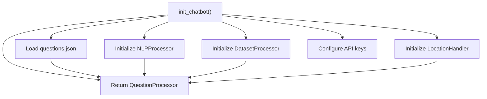
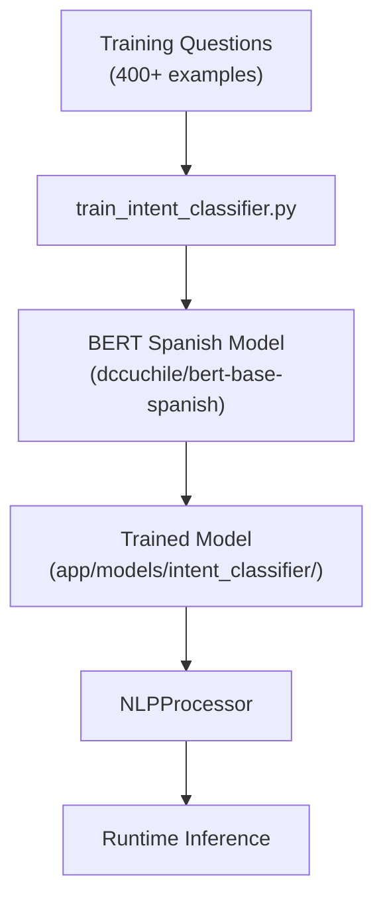

# Agrobot Overview

> **Relevant source files**
> * [.gitignore](https://github.com/axchisan/ProyectoAgroBot/blob/bc782fcf/.gitignore)
> * [docs/README.md](https://github.com/axchisan/ProyectoAgroBot/blob/bc782fcf/docs/README.md)
> * [requirements.txt](https://github.com/axchisan/ProyectoAgroBot/blob/bc782fcf/requirements.txt)

## Purpose and Scope

This document provides a high-level introduction to the Agrobot system, an agricultural chatbot designed for Colombian small farmers. It covers the system's purpose, target users, core capabilities, and architectural structure. For detailed information about specific subsystems, see:

* Project directory structure: [Project Structure](/axchisan/ProyectoAgroBot/1.1-project-structure)
* Feature descriptions: [Key Features](/axchisan/ProyectoAgroBot/1.2-key-features)
* Technology details: [Technology Stack](/axchisan/ProyectoAgroBot/1.3-technology-stack)
* Setup instructions: [Getting Started](/axchisan/ProyectoAgroBot/2-getting-started)
* Architecture deep dive: [System Architecture](/axchisan/ProyectoAgroBot/3-system-architecture)

**Sources:** [docs/README.md L1-L11](https://github.com/axchisan/ProyectoAgroBot/blob/bc782fcf/docs/README.md#L1-L11)

---

## System Purpose

Agrobot is an AI-powered chatbot designed to support small-scale farmers in Colombia with agricultural decision-making. The system provides:

* **Personalized crop recommendations** based on regional agricultural data
* **Weather-integrated advice** using real-time meteorological information
* **Agricultural knowledge** covering theoretical concepts and practical techniques
* **Data analytics** for exploring production trends, yields, and regional comparisons
* **Context-aware responses** that consider the farmer's location and conversation history

The system aims to make agricultural expertise accessible through a simple web interface, reducing barriers for farmers who may have limited technical resources.

**Sources:** [docs/README.md L9-L11](https://github.com/axchisan/ProyectoAgroBot/blob/bc782fcf/docs/README.md#L9-L11)

 [docs/README.md L27-L32](https://github.com/axchisan/ProyectoAgroBot/blob/bc782fcf/docs/README.md#L27-L32)

---

## Target Users

Agrobot is specifically designed for:

| User Type | Characteristics | Primary Needs |
| --- | --- | --- |
| Small farmers | Colombian agricultural producers | Crop planning guidance |
| Agricultural extension workers | Support personnel | Data-driven recommendations |
| Regional planners | Agricultural authorities | Production analytics |

The interface uses Spanish language processing optimized for Colombian agricultural terminology and regional contexts.

**Sources:** [docs/README.md L9-L11](https://github.com/axchisan/ProyectoAgroBot/blob/bc782fcf/docs/README.md#L9-L11)

---

## Core Capabilities

### Question Answering

The chatbot handles multiple query types through intent classification:

| Intent Category | Examples | Handler |
| --- | --- | --- |
| Theoretical questions | "¿Qué es rotación de cultivos?" | `questions.json` lookup |
| Weather queries | "¿Cómo está el clima?" | OpenWeatherMap integration |
| Location-based recommendations | "¿Qué sembrar en Antioquia?" | CSV dataset analysis |
| Crop timing | "¿Cuándo sembrar maíz?" | Agricultural calendar data |
| Production statistics | "Producción de café en Colombia" | Dataset aggregation |

### Analytics Dashboard

The analytics subsystem provides data exploration capabilities:

* National crop production visualization
* Municipal-level data analysis
* Departmental comparisons
* Export functionality for filtered datasets

For details on analytics features, see [Analytics Dashboard](/axchisan/ProyectoAgroBot/7.3-analytics-dashboard).

**Sources:** [docs/README.md L27-L32](https://github.com/axchisan/ProyectoAgroBot/blob/bc782fcf/docs/README.md#L27-L32)

---

## High-Level Architecture

### System Layers

```

```

**Architecture Overview: System Layers and Component Relationships**

The architecture follows a clear separation of concerns across five layers:

1. **User Interface Layer**: HTML templates rendered by Jinja2
2. **Application Server Layer**: Flask routes handle HTTP requests and responses
3. **Business Logic Layer**: Specialized processors manage chatbot functionality
4. **Data Access Layer**: Centralized data loading from JSON and CSV sources
5. **External Services Layer**: Third-party API integrations

**Sources:** [docs/README.md L144-L153](https://github.com/axchisan/ProyectoAgroBot/blob/bc782fcf/docs/README.md#L144-L153)

---

## Core Components

### Chatbot Initialization

The `init_chatbot()` function in [app/chatbot/init_chatbot.py](https://github.com/axchisan/ProyectoAgroBot/blob/bc782fcf/app/chatbot/init_chatbot.py)

 orchestrates system startup:



**Chatbot Initialization Flow**

For detailed initialization sequence, see [Chatbot Initialization](/axchisan/ProyectoAgroBot/4.1-chatbot-initialization).

### Request Processing Flow

When a user submits a question through the chat interface:

```mermaid
sequenceDiagram
  participant User
  participant /chat route
  participant (routes.py)
  participant QuestionProcessor
  participant (question_processor.py)
  participant NLPProcessor
  participant (nlp_processor.py)
  participant Specialized Handler
  participant (dataset/location/weather)

  User->>/chat route: "POST /chat"
  /chat route->>QuestionProcessor: "process_question(text, location)"
  QuestionProcessor->>NLPProcessor: "classify_intent(text)"
  NLPProcessor->>NLPProcessor: "BERT inference"
  NLPProcessor-->>QuestionProcessor: "intent classification"
  loop [Intent: location_based_recommendation]
    QuestionProcessor->>Specialized Handler: "DatasetProcessor.get_recommended_crops()"
    QuestionProcessor->>Specialized Handler: "get_weather_data()"
    QuestionProcessor->>Specialized Handler: "lookup questions.json"
    QuestionProcessor->>Specialized Handler: "OpenAI API fallback"
  end
  Specialized Handler-->>QuestionProcessor: "response data"
  QuestionProcessor-->>/chat route: "formatted response"
  /chat route-->>User: "JSON response"
```

**Request Processing Sequence**

The flow demonstrates the multi-tier response strategy: intent classification → specialized handler → formatted response. For details on this strategy, see [Response Strategy](/axchisan/ProyectoAgroBot/4.4-response-strategy).

**Sources:** [docs/README.md L144-L153](https://github.com/axchisan/ProyectoAgroBot/blob/bc782fcf/docs/README.md#L144-L153)

---

## Key Technologies

| Component | Technology | Purpose |
| --- | --- | --- |
| Web Framework | Flask 3.1.1 | HTTP server and routing |
| NLP Model | BERT (Spanish) | Intent classification |
| ML Framework | PyTorch 2.7.0 | Model inference |
| Transformers | Hugging Face 4.52.3 | BERT implementation |
| Data Processing | Pandas 2.2.3 | CSV data manipulation |
| UI Rendering | Jinja2 3.1.6 | Template rendering |

**Sources:** [requirements.txt L10-L61](https://github.com/axchisan/ProyectoAgroBot/blob/bc782fcf/requirements.txt#L10-L61)

### Python Version

The system requires Python 3.11.2, managed through Anaconda 24.9.2+.

**Sources:** [docs/README.md L4-L6](https://github.com/axchisan/ProyectoAgroBot/blob/bc782fcf/docs/README.md#L4-L6)

 [docs/README.md L35-L40](https://github.com/axchisan/ProyectoAgroBot/blob/bc782fcf/docs/README.md#L35-L40)

---

## Data Sources

### Knowledge Base

* **questions.json**: Static Q&A pairs covering agricultural theory
* **Training data**: 400+ examples for 14 intent types

### Agricultural Datasets

Located in `data/processed/`:

* Production statistics by crop and department
* Yield data by region
* Agricultural area measurements
* Municipal-level data

For dataset structure details, see [Agricultural Data Structure](/axchisan/ProyectoAgroBot/5.4-agricultural-data-structure).

### External APIs

* **OpenWeatherMap**: Current weather and 5-day forecasts
* **OpenAI**: Fallback for complex queries
* **Nominatim**: Geocoding and location services

For API integration details, see [External Integrations](/axchisan/ProyectoAgroBot/6-external-integrations).

**Sources:** [docs/README.md L144-L153](https://github.com/axchisan/ProyectoAgroBot/blob/bc782fcf/docs/README.md#L144-L153)

---

## Deployment Options

### Local Development

Using Anaconda environment with Flask development server on port 5000.

**Sources:** [docs/README.md L42-L103](https://github.com/axchisan/ProyectoAgroBot/blob/bc782fcf/docs/README.md#L42-L103)

 [docs/README.md L134-L143](https://github.com/axchisan/ProyectoAgroBot/blob/bc782fcf/docs/README.md#L134-L143)

### Docker Deployment

Production deployment uses:

* **Base Image**: `python:3.11.2-slim`
* **WSGI Server**: Gunicorn
* **Container Port**: 5000 (mapped to host 5017)
* **Volume Mount**: Application code for hot-reloading

Configuration managed through `docker-compose.yaml` and `Dockerfile`.

For deployment instructions, see [Docker Deployment](/axchisan/ProyectoAgroBot/2.4-docker-deployment) and [Docker Configuration](/axchisan/ProyectoAgroBot/9.1-docker-configuration).

**Sources:** [docs/README.md L1-L11](https://github.com/axchisan/ProyectoAgroBot/blob/bc782fcf/docs/README.md#L1-L11)

---

## System Entry Points

| File | Purpose | Description |
| --- | --- | --- |
| `app.py` | Main application | Flask app initialization and server startup |
| `main.py` | Alternative entry | Alternate entry point for application |
| `train_intent_classifier.py` | Model training | Trains BERT intent classifier before deployment |
| `convert_xlsx_to_csv.py` | Data preparation | Converts Excel datasets to CSV format |

**Sources:** [docs/README.md L144-L153](https://github.com/axchisan/ProyectoAgroBot/blob/bc782fcf/docs/README.md#L144-L153)

---

## Machine Learning Pipeline

The system employs a BERT-based intent classifier:



**ML Pipeline: Training to Deployment**

The model must be trained before first use:

```

```

For ML pipeline details, see [Machine Learning Pipeline](/axchisan/ProyectoAgroBot/8-machine-learning-pipeline).

**Sources:** [docs/README.md L118-L132](https://github.com/axchisan/ProyectoAgroBot/blob/bc782fcf/docs/README.md#L118-L132)

---

## Configuration Requirements

### Environment Variables

Required API keys (stored in `.env` file):

* `OPENWEATHER_API_KEY`: OpenWeatherMap access
* `OPENAI_API_KEY`: OpenAI fallback service

For environment variable details, see [Environment Variables](/axchisan/ProyectoAgroBot/9.2-environment-variables).

### Training Artifacts

Generated by training process:

* `app/models/intent_classifier/`: Trained BERT model
* `app/models/intent_classifier/label_map.pkl`: Intent mapping

These are excluded from version control via [.gitignore L33-L34](https://github.com/axchisan/ProyectoAgroBot/blob/bc782fcf/.gitignore#L33-L34)

**Sources:** [.gitignore L40-L54](https://github.com/axchisan/ProyectoAgroBot/blob/bc782fcf/.gitignore#L40-L54)

---

## Quick Start Summary

1. Install Anaconda and create Python 3.11.2 environment
2. Install dependencies: `pip install -r requirements.txt`
3. Train intent classifier: `python train_intent_classifier.py`
4. Start application: `python app.py`
5. Access at `http://127.0.0.1:5000`

For detailed setup instructions, see [Installation and Setup](/axchisan/ProyectoAgroBot/2.1-installation-and-setup).

**Sources:** [docs/README.md L42-L162](https://github.com/axchisan/ProyectoAgroBot/blob/bc782fcf/docs/README.md#L42-L162)