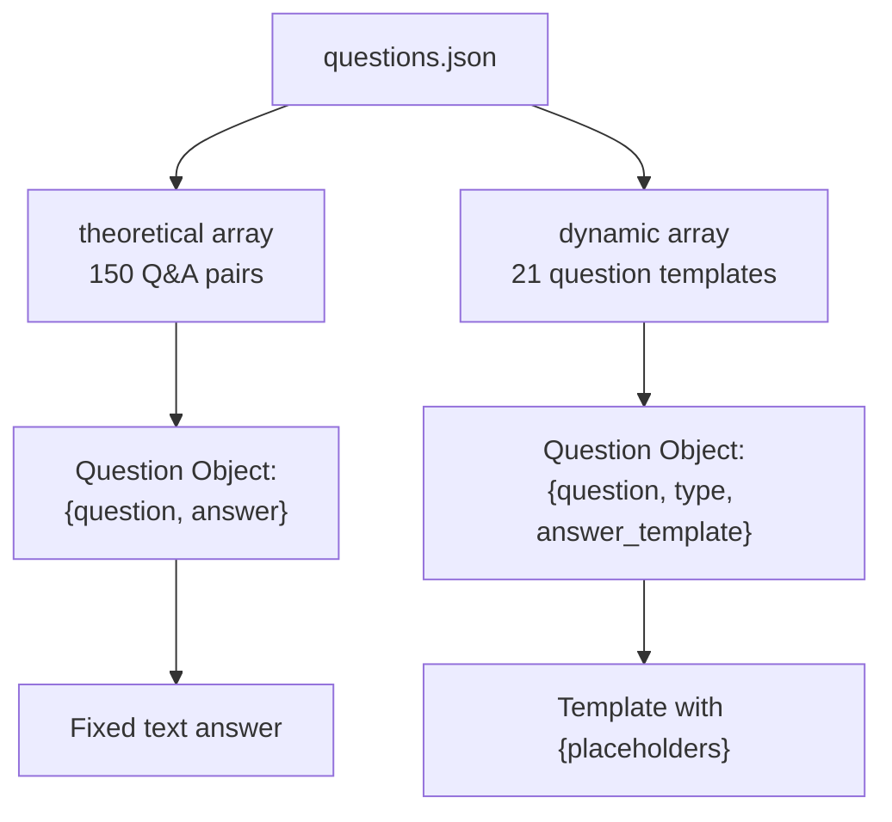
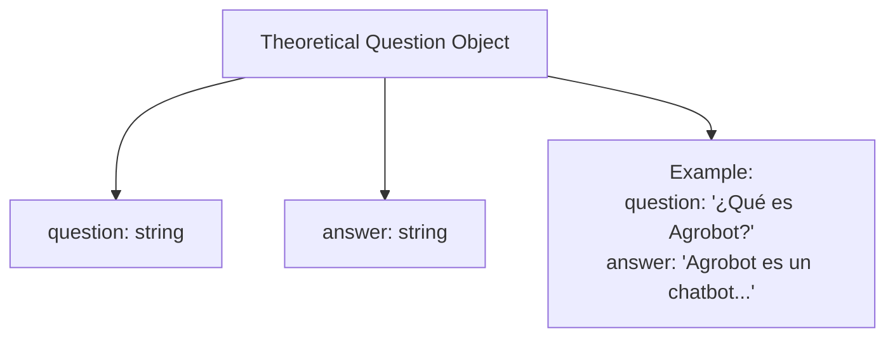
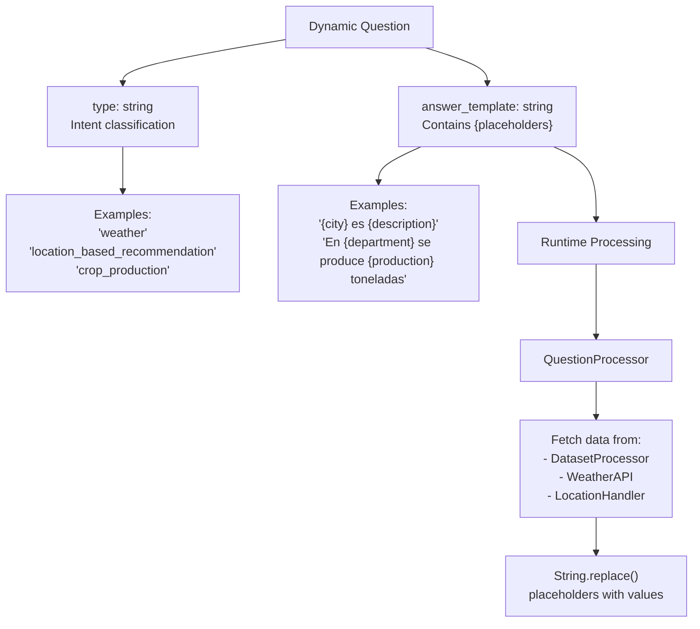
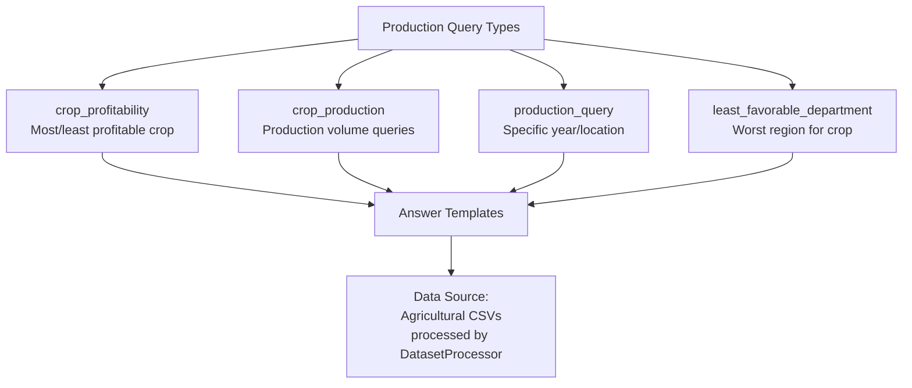
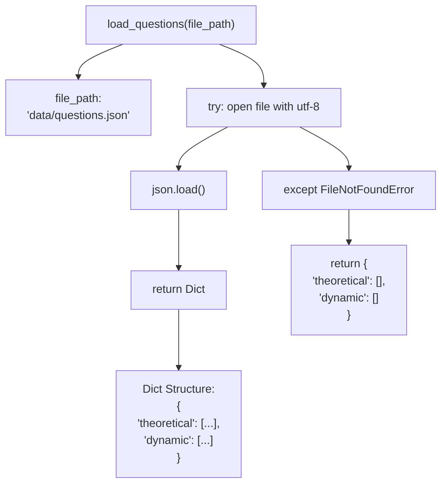
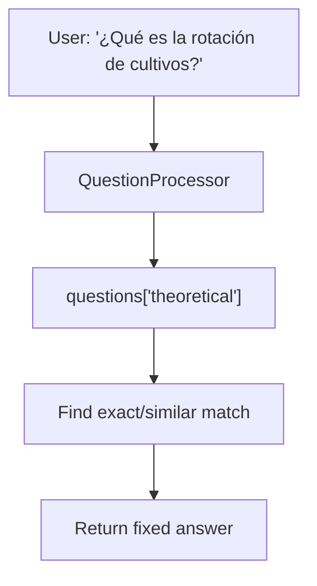
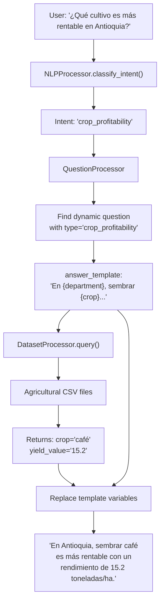
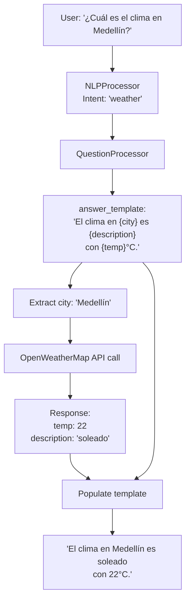

# Base de conocimientos

> **Archivos fuente relevantes**
> * [aplicación/chatbot/data_loader.py](https://github.com/axchisan/ProyectoAgroBot/blob/bc782fcf/app/chatbot/data_loader.py)
> * [datos/preguntas.json](https://github.com/axchisan/ProyectoAgroBot/blob/bc782fcf/data/questions.json)

La Base de Conocimiento es la estructura de datos fundamental que impulsa las capacidades de Agrobot para responder preguntas. Consiste en una colección completa de preguntas y respuestas predefinidas, almacenadas en formato JSON, organizadas en categorías teóricas (estáticas) y dinámicas (basadas en plantillas). Este sistema permite al chatbot proporcionar contenido agrícola educativo y respuestas basadas en datos según la ubicación del usuario, los tipos de cultivo e información en tiempo real.

Para obtener información sobre cómo se carga y se accede a esta base de conocimientos en tiempo de ejecución, consulte [Carga de datos](/axchisan/ProyectoAgroBot/5.2-data-loading) . Para obtener más información sobre cómo el chatbot utiliza este conocimiento para procesar consultas, consulte [Procesamiento de preguntas](/axchisan/ProyectoAgroBot/4.2-question-processing) .

## Estructura de la base de conocimientos

La base de conocimientos se define en un único archivo JSON ubicado en[questions.json L1-L244](https://github.com/axchisan/ProyectoAgroBot/blob/bc782fcf/data/questions.json#L1-L244)

Este archivo contiene dos matrices de nivel superior: `theoretical`y `dynamic`, cada una con propósitos distintos en la estrategia de respuesta del chatbot.

### Organización de archivos



**Fuentes:** [questions.json L1-L244](https://github.com/axchisan/ProyectoAgroBot/blob/bc782fcf/data/questions.json#L1-L244)

### Esquema de datos

La base de conocimientos utiliza dos esquemas distintos según la categoría de la pregunta:

| Campo | Tipo | Requerido | Descripción | Categoría |
| --- | --- | --- | --- | --- |
| `question` | cadena | Sí | El texto de la pregunta en español | Ambos |
| `answer` | cadena | Sí | Texto de respuesta completo | Teorético |
| `type` | cadena | Sí | Tipo de clasificación de intención | Dinámica |
| `answer_template` | cadena | Sí | Responder con variables de marcador de posición | Dinámica |

**Fuentes:** [questions.json L2-L244](https://github.com/axchisan/ProyectoAgroBot/blob/bc782fcf/data/questions.json#L2-L244)

## Preguntas teóricas

Las preguntas teóricas proporcionan contenido educativo estático sobre conceptos, prácticas y técnicas agrícolas. Son pares de preguntas y respuestas completos que no requieren datos ni cálculos externos.

### Estructura y contenido



Cada pregunta teórica sigue una estructura simple de dos campos definida en[questions.json L3-L6](https://github.com/axchisan/ProyectoAgroBot/blob/bc782fcf/data/questions.json#L3-L6)

El `question`campo contiene la consulta del usuario y `answer`proporciona una respuesta completa y rica en contexto adaptada a los pequeños agricultores colombianos.

### Cobertura del tema

Las 150 preguntas teóricas cubren los siguientes dominios agrícolas:

| Categoría de tema | Preguntas de ejemplo | Contar (aprox.) |
| --- | --- | --- |
| Información del sistema | "¿Qué es Agrobot?", "¿De dónde saca la información Agrobot?" | 5 |
| Agricultura sostenible | "¿Qué es la agricultura sostenible?", "¿Qué es la agroecología?" | 15 |
| Manejo de plagas | "¿Cómo controlar plagas de manera orgánica?", "¿Qué es el MIP?" | 8 |
| Ciencia del suelo | "¿Qué es la fertilidad del suelo?", "¿Qué es el pH del suelo?" | 20 |
| Técnicas de cultivo | "¿Qué es la rotación de cultivos?", "¿Cómo siembro en invernadero?" | 25 |
| Insumos orgánicos | "¿Qué son abonos orgánicos?", "¿Qué son los biofertilizantes?" | 12 |
| Métodos alternativos | "¿Qué es permacultura?", "¿Qué es siembra hidropónica?" | 15 |
| Manejo del suelo | "¿Qué es la erosión del suelo?", "¿Qué es la lixiviación?" | 10 |
| Sistemas agrícolas | "¿Qué es agricultura biodinámica?", "¿Qué es agricultura urbana?" | 12 |
| Acceso a recursos | "¿Cómo puedo acceder a financiamiento?" | 3 |
| Comparative Questions | "¿Me conviene rotar papa con maíz o con tomate?" | 25 |

**Example Entry:**

The question about sustainable agriculture at [data/questions.json L8-L10](https://github.com/axchisan/ProyectoAgroBot/blob/bc782fcf/data/questions.json#L8-L10)

 demonstrates the structure:

```json
{
  "question": "¿Qué es la agricultura sostenible?",
  "answer": "La agricultura sostenible busca producir alimentos de manera que no dañe el medio ambiente ni agote los recursos para el futuro. En Colombia, esto significa usar técnicas como rotación de cultivos, abonos orgánicos y menos químicos para cuidar el suelo y el agua..."
}
```

### Answer Characteristics

Theoretical answers are designed with specific characteristics for Colombian farmers:

* **Contextual**: Mention Colombian regions (e.g., "En Antioquia", "como en Boyacá")
* **Practical**: Include actionable steps and real-world examples
* **Accessible**: Use simple language (tuteo form: "puedes", "tu finca")
* **Comprehensive**: Typically 3-5 sentences covering definition, Colombian context, benefits, and examples
* **Educational**: Explain both the "what" and "why" of agricultural practices

**Sources:** [data/questions.json L2-L151](https://github.com/axchisan/ProyectoAgroBot/blob/bc782fcf/data/questions.json#L2-L151)

## Dynamic Questions

Dynamic questions use template-based answers that are populated with real-time or dataset-derived information. These questions require the chatbot to interact with external services or query internal datasets.

### Template System



Dynamic questions are defined at [data/questions.json L152-L243](https://github.com/axchisan/ProyectoAgroBot/blob/bc782fcf/data/questions.json#L152-L243)

 and follow a three-field structure that enables runtime data insertion.

**Sources:** [data/questions.json L152-L243](https://github.com/axchisan/ProyectoAgroBot/blob/bc782fcf/data/questions.json#L152-L243)

### Question Types

The knowledge base defines 21 distinct question types that map to specific data processing handlers:

#### Weather-Related Types

| Type | Purpose | Template Example | Data Source |
| --- | --- | --- | --- |
| `weather` | Current weather query | `"El clima en {city} es {description} con {temp}°C."` | OpenWeatherMap API |
| `weather_forecast` | Future weather (not implemented) | Redirects to current weather | N/A |
| `weather_sowing_advice` | Weather + planting advice | `"En {city}: {description}, {temp}°C, {humidity}%. {recommendation}"` | OpenWeatherMap + logic |

**Sources:** [data/questions.json L154-L167](https://github.com/axchisan/ProyectoAgroBot/blob/bc782fcf/data/questions.json#L154-L167)

 [data/questions.json L239-L242](https://github.com/axchisan/ProyectoAgroBot/blob/bc782fcf/data/questions.json#L239-L242)

#### Location-Based Types

| Type | Purpose | Template Example | Data Source |
| --- | --- | --- | --- |
| `current_location` | Confirm user location | `"Parece que estás en {city}, {department}. ¿Es correcto?"` | LocationHandler / Nominatim |
| `recommendation` | Generic crop recommendation prompt | Asks for department info | N/A |
| `location_based_recommendation` | Crops for specific region | `"En {department}, te recomiendo sembrar {crop} con un rendimiento promedio de {yield_value} toneladas/ha."` | Agricultural CSVs |
| `recommended_crops` | List of recommended crops | `"En {department}, te recomiendo los siguientes cultivos:\n{crop_list}"` | DatasetProcessor |

**Sources:** [data/questions.json L169-L187](https://github.com/axchisan/ProyectoAgroBot/blob/bc782fcf/data/questions.json#L169-L187)

#### Production and Profitability Types



| Type | Purpose | Template Variables | Example Query |
| --- | --- | --- | --- |
| `crop_profitability` | Find most profitable crop | `{department}`, `{crop}`, `{yield_value}` | "¿Qué cultivo es más rentable en Antioquia?" |
| `crop_production` | Production statistics | `{crop}`, `{department}`, `{production}` | "¿Cuánto café se produce en Caldas?" |
| `production_query` | Detailed production data | `{location}`, `{crop}`, `{production_ton}`, `{year}` | "¿Cuánto maíz se produjo en Manizales en 2020?" |
| `least_favorable_department` | Worst region for crop | `{crop}`, `{department}`, `{value}`, `{year}` | "¿Dónde es menos favorable sembrar maíz?" |

**Sources:** [data/questions.json L189-L227](https://github.com/axchisan/ProyectoAgroBot/blob/bc782fcf/data/questions.json#L189-L227)

#### Agricultural Timing Types

| Type | Purpose | Template Example | Data Source |
| --- | --- | --- | --- |
| `crop_timing` | When to plant | `"El mejor momento para sembrar {crop} es en {month}..."` | Agricultural calendar data |
| `irrigation_advice` | Irrigation optimization | `"Para optimizar el riego en {city}, usa riego por goteo... {recommendation}"` | Weather + logic |

**Sources:** [data/questions.json L229-L237](https://github.com/axchisan/ProyectoAgroBot/blob/bc782fcf/data/questions.json#L229-L237)

## Answer Template Variables

Dynamic questions use placeholder variables enclosed in curly braces `{}` that are replaced at runtime with actual data values. The system supports the following variable types:

### Geographic Variables

| Variable | Type | Source | Example Value |
| --- | --- | --- | --- |
| `{city}` | string | User input or LocationHandler | "Bogotá" |
| `{department}` | string | User input or context | "Cundinamarca" |
| `{location}` | string | Dataset query result | "Manizales" |
| `{location_type}` | string | Dataset metadata | "municipio" |

### Agricultural Variables

| Variable | Type | Source | Example Value |
| --- | --- | --- | --- |
| `{crop}` | string | Dataset query or user input | "café" |
| `{crop_list}` | string | Formatted list from DatasetProcessor | "1. Café\n2. Plátano\n3. Yuca" |
| `{yield_value}` | float/string | Agricultural CSV data | "12.5" |
| `{production}` | float/string | Agricultural CSV data | "45000" |
| `{production_ton}` | float/string | Dataset query with units | "45000" |

### Weather Variables

| Variable | Type | Source | Example Value |
| --- | --- | --- | --- |
| `{temp}` | float | OpenWeatherMap API | "18.5" |
| `{description}` | string | OpenWeatherMap API | "parcialmente nublado" |
| `{humidity}` | int | OpenWeatherMap API | "75" |

### Temporal Variables

| Variable | Type | Source | Example Value |
| --- | --- | --- | --- |
| `{year}` | int | Dataset filter or current year | "2020" |
| `{month}` | string | Agricultural calendar | "marzo" |

### Recommendation Variables

| Variable | Type | Source | Example Value |
| --- | --- | --- | --- |
| `{recommendation}` | string | Logic-based advice generation | "Riega temprano en la mañana para evitar evaporación." |
| `{value}` | float | Calculated metric | "8.3" |

**Sources:** [data/questions.json L154-L242](https://github.com/axchisan/ProyectoAgroBot/blob/bc782fcf/data/questions.json#L154-L242)

## Knowledge Base Loading

The knowledge base is loaded into the chatbot system through the `data_loader` module, which provides dedicated functions for accessing questions and other data sources.

### Loading Function



The `load_questions` function is defined at [app/chatbot/data_loader.py L7-L15](https://github.com/axchisan/ProyectoAgroBot/blob/bc782fcf/app/chatbot/data_loader.py#L7-L15)

 and follows this logic:

1. **Input**: File path string pointing to `questions.json`
2. **Process**: Opens file with UTF-8 encoding and parses JSON
3. **Output**: Dictionary with `theoretical` and `dynamic` keys
4. **Error Handling**: Returns empty structure if file not found

**Function Signature:**

```python
def load_questions(file_path: str) -> Dict
```

**Sources:** [app/chatbot/data_loader.py L7-L15](https://github.com/axchisan/ProyectoAgroBot/blob/bc782fcf/app/chatbot/data_loader.py#L7-L15)

### Integration with Chatbot System

```mermaid
sequenceDiagram
  participant init_chatbot()
  participant data_loader.load_questions()
  participant questions.json
  participant QuestionProcessor
  participant NLPProcessor

  init_chatbot()->>data_loader.load_questions(): load_questions('data/questions.json')
  data_loader.load_questions()->>questions.json: Read file
  questions.json-->>data_loader.load_questions(): Raw JSON data
  data_loader.load_questions()-->>init_chatbot(): Dict{'theoretical': [...], 'dynamic': [...]}
  init_chatbot()->>QuestionProcessor: QuestionProcessor(questions=questions_data)
  QuestionProcessor->>QuestionProcessor: Store theoretical questions
  QuestionProcessor->>QuestionProcessor: Store dynamic templates
  note over QuestionProcessor,NLPProcessor: Runtime query processing
  QuestionProcessor->>NLPProcessor: classify_intent(user_input)
  NLPProcessor-->>QuestionProcessor: Intent type (e.g., 'weather')
  QuestionProcessor->>QuestionProcessor: Match intent to dynamic type
  QuestionProcessor->>QuestionProcessor: Fetch data for template variables
  QuestionProcessor->>QuestionProcessor: Populate template with values
```

The knowledge base is loaded during chatbot initialization and passed to the `QuestionProcessor` class, which manages both theoretical and dynamic question handling. The integration flow:

1. **Initialization**: `init_chatbot()` calls `load_questions()` at application startup
2. **Storage**: Questions dictionary is stored in `QuestionProcessor` instance
3. **Classification**: User input is classified by `NLPProcessor` to determine intent
4. **Matching**: Intent type is matched against dynamic question types
5. **Processing**: Appropriate template is selected and populated with data
6. **Response**: Generated answer is returned to the user

**Sources:** [app/chatbot/data_loader.py L7-L15](https://github.com/axchisan/ProyectoAgroBot/blob/bc782fcf/app/chatbot/data_loader.py#L7-L15)

## Usage Patterns

The knowledge base supports multiple query resolution patterns depending on question complexity and data requirements.

### Pattern 1: Direct Theoretical Match



For theoretical questions, the system performs direct pattern matching against the `theoretical` array. This is the fastest response path with no external dependencies.

**Sources:** [data/questions.json L2-L151](https://github.com/axchisan/ProyectoAgroBot/blob/bc782fcf/data/questions.json#L2-L151)

### Pattern 2: Dynamic Template with Dataset



Dynamic questions with dataset requirements follow this multi-step process involving intent classification, template selection, data querying, and variable substitution.

**Sources:** [data/questions.json L152-L243](https://github.com/axchisan/ProyectoAgroBot/blob/bc782fcf/data/questions.json#L152-L243)

 [app/chatbot/data_loader.py L1-L46](https://github.com/axchisan/ProyectoAgroBot/blob/bc782fcf/app/chatbot/data_loader.py#L1-L46)

### Pattern 3: Dynamic Template with External API



Weather and location queries require external API calls to populate templates with real-time data. This pattern involves city extraction, API integration, and response formatting.

**Sources:** [data/questions.json L154-L167](https://github.com/axchisan/ProyectoAgroBot/blob/bc782fcf/data/questions.json#L154-L167)

## Content Guidelines and Design Principles

The knowledge base follows specific design principles to ensure consistency and usability for Colombian small farmers.

### Language and Tone

* **Informal tuteo**: Uses "tú" form ("puedes", "tu finca") for approachability
* **Colombian context**: References specific regions (Antioquia, Boyacá, Valle del Cauca)
* **Ejemplos prácticos** : Incluye escenarios reales relevantes para la agricultura colombiana
* **Terminología simplificada** : evita la jerga excesivamente técnica manteniendo la precisión.

### Estructura de la respuesta

Las respuestas teóricas suelen seguir esta estructura:

1. **Definición** : ¿Cuál es el concepto? (1 oración)
2. **Contexto colombiano** : Cómo se aplica en Colombia (1-2 oraciones con ejemplos regionales)
3. **Aplicación práctica** : Pasos específicos o ejemplos (1-2 oraciones)
4. **Beneficios** : Por qué es importante para los pequeños agricultores (1 frase)

**Ejemplo** de[questions.json L16-L18](https://github.com/axchisan/ProyectoAgroBot/blob/bc782fcf/data/questions.json#L16-L18)

:

```
"La rotación de cultivos es una técnica donde alternas diferentes cultivos..." [Definition]
"Por ejemplo, si siembras maíz este año, el próximo puedes sembrar frijol." [Colombian Context]
"Esto mejora la fertilidad del suelo porque..." [Practical Application]
"En Colombia, esta práctica es ideal para pequeños agricultores..." [Benefits]
```

### Diseño de plantilla dinámica

Las plantillas dinámicas están diseñadas para ser:

* **Conciso** : Máximo 2-3 frases
* **Centrado en los datos** : enfatizar la información cuantitativa
* **Accionable** : Proporcionar recomendaciones claras cuando sea posible
* **Extensible** : permite contexto adicional a través de `{recommendation}`variables

**Fuentes:** [questions.json L1-L244](https://github.com/axchisan/ProyectoAgroBot/blob/bc782fcf/data/questions.json#L1-L244)

## Ampliación de la base de conocimientos

La base de conocimientos se puede ampliar agregando nuevas entradas a las matrices `theoretical`o en .`dynamic``questions.json`

### Añadiendo preguntas teóricas

Para añadir una nueva pregunta teórica:

1. Identificar el tema agrícola y asegurarse de que no esté ya cubierto
2. Escribe la pregunta en español usando tutorial informal.
3. Crea una respuesta completa siguiendo las pautas de estructura anteriores.
4. Agregue el objeto JSON a la `theoretical`matriz en[questions.json L2-L151](https://github.com/axchisan/ProyectoAgroBot/blob/bc782fcf/data/questions.json#L2-L151)

**Formato:**

```json
{
  "question": "¿Tu pregunta aquí?",
  "answer": "Tu respuesta completa aquí con contexto colombiano, ejemplos prácticos y beneficios para pequeños agricultores."
}
```

### Agregar tipos de preguntas dinámicas

Para agregar un nuevo tipo de pregunta dinámica:

1. Define el nuevo `type`identificador (en minúsculas, separado por guiones bajos)
2. Crea el `answer_template`con `{placeholder}`las variables apropiadas
3. Agregue el objeto JSON a la `dynamic`matriz en[questions.json L152-L243](https://github.com/axchisan/ProyectoAgroBot/blob/bc782fcf/data/questions.json#L152-L243)
4. Implemente la lógica del controlador correspondiente `QuestionProcessor`para completar las variables de plantilla

**Formato:**

```json
{
  "question": "Example question with parameters",
  "type": "new_query_type",
  "answer_template": "Response with {variable1} and {variable2}."
}
```

### Nombre de variables de plantilla

Al agregar nuevas variables de plantilla:

* Utilice nombres en minúsculas con guiones bajos para variables de varias palabras
* Hacer que los nombres de las variables sean descriptivos de su contenido
* Asegúrese de `QuestionProcessor`que el controlador relevante pueda proporcionar el valor
* Documentar el tipo y la fuente de datos esperados

**Fuentes:** [questions.json L1-L244](https://github.com/axchisan/ProyectoAgroBot/blob/bc782fcf/data/questions.json#L1-L244)