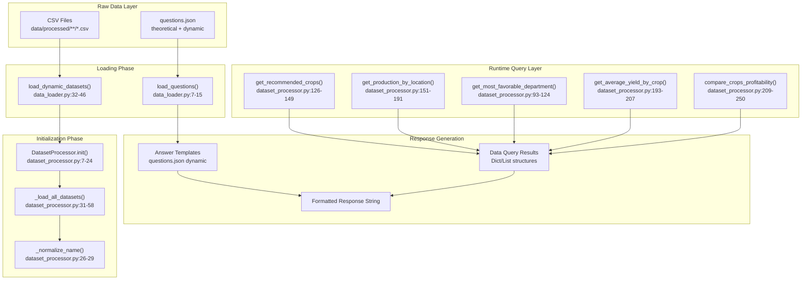
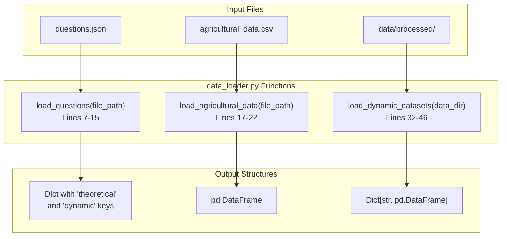
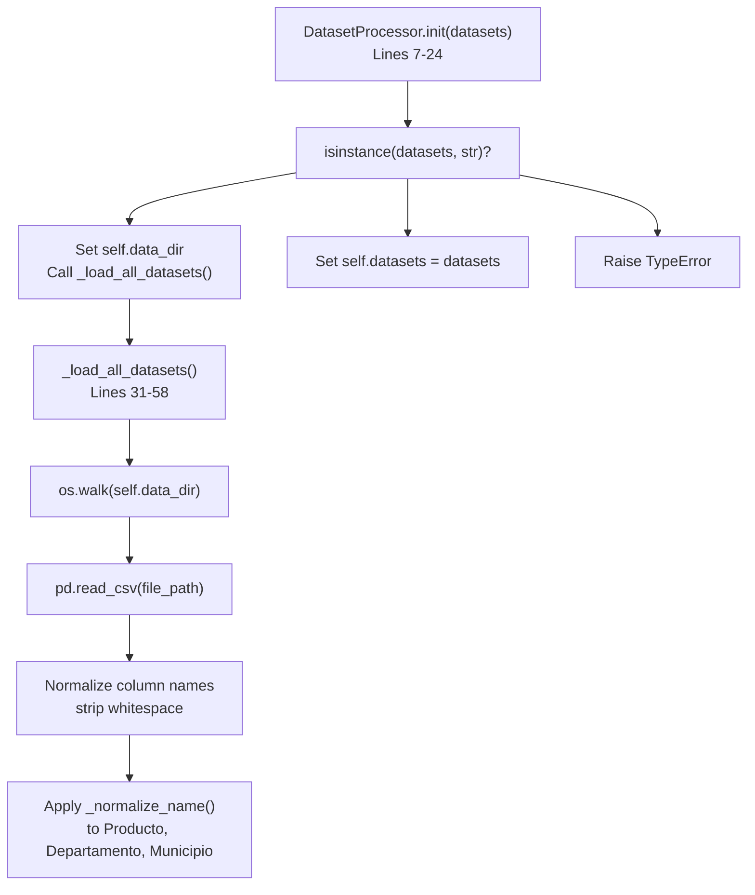
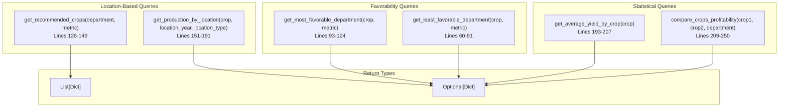
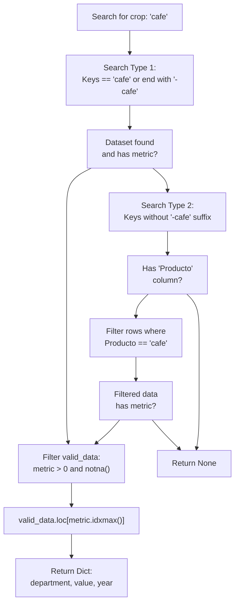
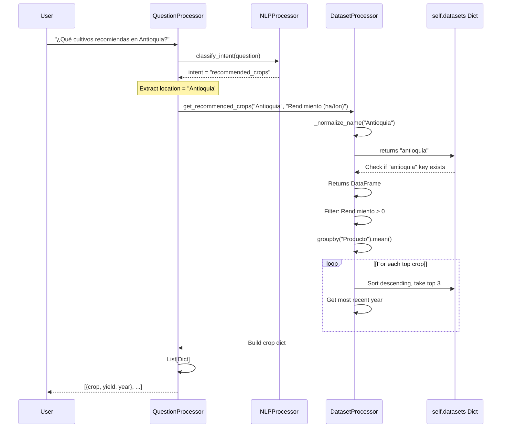

# Canal de procesamiento de datos

> **Archivos fuente relevantes**
> * [aplicación/chatbot/data_loader.py](https://github.com/axchisan/ProyectoAgroBot/blob/bc782fcf/app/chatbot/data_loader.py)
> * [aplicación/chatbot/procesador_de_conjunto_de_datos.py](https://github.com/axchisan/ProyectoAgroBot/blob/bc782fcf/app/chatbot/dataset_processor.py)
> * [datos/preguntas.json](https://github.com/axchisan/ProyectoAgroBot/blob/bc782fcf/data/questions.json)

Este documento describe cómo Agrobot procesa datos de archivos CSV sin procesar y bases de conocimiento JSON para generar respuestas en tiempo de ejecución. Abarca todo el proceso, desde la carga de datos hasta la generación de respuestas, pasando por el procesamiento de consultas.

Para obtener información sobre las estructuras y esquemas de datos específicos, consulte [Estructura de datos agrícolas](/axchisan/ProyectoAgroBot/5.4-agricultural-data-structure) . Para obtener más información sobre la organización de la base de conocimientos, consulte [Base de conocimientos](/axchisan/ProyectoAgroBot/5.1-knowledge-base) . Para conocer el contexto general de la arquitectura del sistema, consulte [Arquitectura del sistema](/axchisan/ProyectoAgroBot/3-system-architecture) .

## Descripción general

El proceso de procesamiento de datos transforma conjuntos de datos agrícolas estáticos y bases de conocimiento en respuestas dinámicas y contextuales. El proceso opera en tres fases principales:

1. **Carga de datos** : los archivos CSV y JSON sin procesar se cargan en las estructuras de memoria
2. **Procesamiento de conjuntos de datos** : los datos cargados se normalizan, indexan y preparan para realizar consultas.
3. **Ejecución de consultas** : las preguntas del usuario desencadenan consultas de datos que generan respuestas

El pipeline está diseñado para manejar múltiples tipos de datos: conocimiento teórico (preguntas y respuestas estáticas), estadísticas agrícolas (conjuntos de datos CSV) y consultas dinámicas que requieren agregación de datos.

**Fuentes** :[dataset_processor.py L1-L250](https://github.com/axchisan/ProyectoAgroBot/blob/bc782fcf/app/chatbot/dataset_processor.py#L1-L250)

 [data_loader.py L1-L46](https://github.com/axchisan/ProyectoAgroBot/blob/bc782fcf/app/chatbot/data_loader.py#L1-L46)

 [questions.json L1-L244](https://github.com/axchisan/ProyectoAgroBot/blob/bc782fcf/data/questions.json#L1-L244)

## Arquitectura de tuberías



**Fuentes** :[dataset_processor.py L7-L58](https://github.com/axchisan/ProyectoAgroBot/blob/bc782fcf/app/chatbot/dataset_processor.py#L7-L58)

 [data_loader.py L7-L46](https://github.com/axchisan/ProyectoAgroBot/blob/bc782fcf/app/chatbot/data_loader.py#L7-L46)

## Fuentes y tipos de datos

### Datos agrícolas CSV

El pipeline procesa archivos CSV que contienen estadísticas agrícolas organizadas en múltiples formatos:

| Tipo de conjunto de datos | Estructura | Archivo de ejemplo | Columnas clave |
| --- | --- | --- | --- |
| Departamental | Agregado por departamento | `antioquia.csv` | Departamento, Producto, Año, Producción (ton), Rendimiento (ha/ton) |
| Específico del cultivo | Datos municipales por cultivo | `antioquia-cafe.csv` | Municipio, Año, Producción (ton), Área (ha), Rendimiento (ha/ton) |
| Nacional | Interdepartamental | Varios archivos regionales | Producto, Departamento, múltiples métricas |

Los archivos CSV se cargan desde `data/processed/`y sus subdirectorios. El proceso de carga recorre el árbol de directorios y carga todos `.csv`los archivos dinámicamente.

**Fuentes** :[dataset_processor.py L31-L58](https://github.com/axchisan/ProyectoAgroBot/blob/bc782fcf/app/chatbot/dataset_processor.py#L31-L58)

 [data_loader.py L32-L46](https://github.com/axchisan/ProyectoAgroBot/blob/bc782fcf/app/chatbot/data_loader.py#L32-L46)

### Base de conocimientos (preguntas.json)

La base de conocimientos contiene dos tipos de preguntas:

1. **Preguntas teóricas** : Conocimiento agrícola estático con respuestas preescritas * Estructura:`{"question": str, "answer": str}` * Ejemplo: "¿Qué es la agricultura sostenible?"
2. **Preguntas dinámicas** : patrones de consulta con plantillas de respuesta que requieren datos de tiempo de ejecución * Estructura:`{"question": str, "type": str, "answer_template": str}` * Variables de plantilla: `{city}`, `{department}`, `{crop}`, `{yield_value}`, etc. * Ejemplo: "En {departamento}, te recomiendo sembrar {crop} con un rendimiento promedio de {yield_value} toneladas/ha."

**Fuentes** :[questions.json L1-L244](https://github.com/axchisan/ProyectoAgroBot/blob/bc782fcf/data/questions.json#L1-L244)

## Etapa de carga de datos

### Funciones de carga

El `data_loader`módulo proporciona tres funciones de carga principales:



#### cargar_preguntas()

Carga el archivo JSON de preguntas y devuelve un diccionario con dos claves: `theoretical`y `dynamic`. Devuelve una estructura vacía `{"theoretical": [], "dynamic": []}`si no se encuentra el archivo.

**Fuentes** :[data_loader.py L7-L15](https://github.com/axchisan/ProyectoAgroBot/blob/bc782fcf/app/chatbot/data_loader.py#L7-L15)

#### cargar_conjuntos_de_datos_dinámicos()

Walks through the `data/processed/` directory recursively, loading all CSV files into a dictionary. The key is the filename (without `.csv`) converted to lowercase. For example, `antioquia.csv` becomes key `"antioquia"` and `antioquia-cafe.csv` becomes `"antioquia-cafe"`.

**Sources**: [app/chatbot/data_loader.py L32-L46](https://github.com/axchisan/ProyectoAgroBot/blob/bc782fcf/app/chatbot/data_loader.py#L32-L46)

## Dataset Processing Stage

### DatasetProcessor Initialization

The `DatasetProcessor` class is initialized in two ways:

1. **From directory path** (string): Automatically loads all CSV files from the specified directory
2. **From pre-loaded datasets** (dictionary): Uses already-loaded DataFrames



**Sources**: [app/chatbot/dataset_processor.py L7-L58](https://github.com/axchisan/ProyectoAgroBot/blob/bc782fcf/app/chatbot/dataset_processor.py#L7-L58)

### Data Normalization

The `_normalize_name()` method ensures consistent data matching by:

1. Converting to lowercase
2. Removing accents with `unidecode`
3. Stripping whitespace
4. Applying crop name mappings

| Original | Normalized |
| --- | --- |
| "Maíz" | "maíz" |
| "Café" | "café" |
| "Guayaba Manzana" | "guayaba" |
| "Caña Azucarera" | "caña de azúcar" |

This normalization is applied to:

* User input (crop names, department names)
* CSV data columns: `Producto`, `Departamento`, `Municipio`

**Sources**: [app/chatbot/dataset_processor.py L26-L29](https://github.com/axchisan/ProyectoAgroBot/blob/bc782fcf/app/chatbot/dataset_processor.py#L26-L29)

 [app/chatbot/dataset_processor.py L14-L17](https://github.com/axchisan/ProyectoAgroBot/blob/bc782fcf/app/chatbot/dataset_processor.py#L14-L17)

## Query Processing Methods

### Method Categories

The `DatasetProcessor` provides five categories of query methods:



**Sources**: [app/chatbot/dataset_processor.py L60-L250](https://github.com/axchisan/ProyectoAgroBot/blob/bc782fcf/app/chatbot/dataset_processor.py#L60-L250)

### Dataset Search Strategy

Methods search through datasets using a two-tier strategy:

1. **Crop-specific datasets**: Search datasets with keys matching the crop name or ending with `-{crop}`
2. **Regional datasets**: Search departmental datasets containing `Producto` column for multiple crops

Example for `get_most_favorable_department("cafe", "Rendimiento (ha/ton)")`:



**Sources**: [app/chatbot/dataset_processor.py L93-L124](https://github.com/axchisan/ProyectoAgroBot/blob/bc782fcf/app/chatbot/dataset_processor.py#L93-L124)

 [app/chatbot/dataset_processor.py L60-L91](https://github.com/axchisan/ProyectoAgroBot/blob/bc782fcf/app/chatbot/dataset_processor.py#L60-L91)

## Data Transformation Examples

### get_recommended_crops()

This method finds the top 3 crops for a department based on average yield:

**Process Flow**:

1. Normalize department name: `"Antioquia"` → `"antioquia"`
2. Check if `"antioquia"` key exists in `self.datasets`
3. Group by `Producto` column and calculate mean of metric (default: `"Rendimiento (ha/ton)"`)
4. Filter valid data: `metric > 0` and not NaN
5. Sort by metric descending and take top 3
6. For each crop, get the most recent year from the data
7. Return list of dicts: `[{"crop": str, "yield": float, "year": int}, ...]`

**Return Structure**:

```json
[
    {"crop": "Cafe", "yield": 1.85, "year": 2020},
    {"crop": "Platano", "yield": 12.3, "year": 2019},
    {"crop": "Maiz", "yield": 3.2, "year": 2020}
]
```

**Sources**: [app/chatbot/dataset_processor.py L126-L149](https://github.com/axchisan/ProyectoAgroBot/blob/bc782fcf/app/chatbot/dataset_processor.py#L126-L149)

### get_production_by_location()

Queries production data for a specific crop, location, and year. Supports both department-level and municipal-level queries through the `location_type` parameter.

**Department Query Flow**:

1. Normalize crop and location
2. Look up `self.datasets[location]` (e.g., `"antioquia"`)
3. Filter: `Producto == crop` AND `Año == year` AND `Produccion (ton) > 0`
4. Return first matching row data

**Municipal Query Flow**:

1. Search datasets with keys ending in `-{crop}` (e.g., `"antioquia-cafe"`)
2. Filter: `Municipio == location` AND `Año == year` AND `Produccion (ton) > 0`
3. Return first matching row data

**Return Structure**:

```json
{
    "crop": "Cafe",
    "location": "Antioquia",
    "location_type": "department",
    "production_ton": 125000.5,
    "year": 2020
}
```

**Sources**: [app/chatbot/dataset_processor.py L151-L191](https://github.com/axchisan/ProyectoAgroBot/blob/bc782fcf/app/chatbot/dataset_processor.py#L151-L191)

### compare_crops_profitability()

Compares two crops based on average yield, either at the department level or nationally.

**Department-level Comparison**:

1. Get department dataset
2. Filter data for each crop: `Producto == crop` AND `Rendimiento (ha/ton) > 0`
3. Calcular el rendimiento medio para cada
4. Determinar qué cultivo tiene mayor rendimiento

**Comparación nacional** :

1. Llamada `get_average_yield_by_crop()`para cada cultivo
2. Comparar resultados

**Estructura de retorno** :

```css
{
    "crop1": "Maiz",
    "yield1": 3.5,
    "crop2": "Cafe",
    "yield2": 1.8,
    "department": "Antioquia",  # or "nacional"
    "best": "maiz"
}
```

**Fuentes** :[dataset_processor.py L209-L250](https://github.com/axchisan/ProyectoAgroBot/blob/bc782fcf/app/chatbot/dataset_processor.py#L209-L250)

## Flujo de datos de extremo a extremo

### Ejemplo de canalización completa

El siguiente diagrama muestra cómo fluye una consulta de usuario a través del proceso de procesamiento de datos:



**Fuentes** :[dataset_processor.py L126-L149](https://github.com/axchisan/ProyectoAgroBot/blob/bc782fcf/app/chatbot/dataset_processor.py#L126-L149)

 [data_loader.py L7-L15](https://github.com/axchisan/ProyectoAgroBot/blob/bc782fcf/app/chatbot/data_loader.py#L7-L15)

 [questions.json L183-L187](https://github.com/axchisan/ProyectoAgroBot/blob/bc782fcf/data/questions.json#L183-L187)

## Filtrado y validación de datos

Todos los métodos de consulta implementan una validación de datos consistente:

### Patrón de filtro de datos válido

```
valid_data = crop_data[
    (crop_data[metric] > 0) & 
    (crop_data[metric].notna())
]
```

Este patrón asegura:

* Los valores métricos son positivos (producción, rendimiento, área > 0)
* No se incluyen valores NaN ni nulos
* Los DataFrames vacíos generan `None`devoluciones en lugar de errores

**Fuentes** :[dataset_processor.py L68-L69](https://github.com/axchisan/ProyectoAgroBot/blob/bc782fcf/app/chatbot/dataset_processor.py#L68-L69)

 [dataset_processor.py L101-L102](https://github.com/axchisan/ProyectoAgroBot/blob/bc782fcf/app/chatbot/dataset_processor.py#L101-L102)

 [dataset_processor.py L134-L135](https://github.com/axchisan/ProyectoAgroBot/blob/bc782fcf/app/chatbot/dataset_processor.py#L134-L135)

## Características de rendimiento

### Almacenamiento de conjuntos de datos

| Componente | Tipo de almacenamiento | Patrón de acceso |
| --- | --- | --- |
| `self.datasets` | `Dict[str, pd.DataFrame]` | Búsqueda de clave O(1) |
| Columnas del marco de datos | Índice de pandas | Acceso a la columna O(1) |
| Filtrado de filas | Indexación booleana | O(n) donde n = filas |
| Operaciones de agrupación | pandas Agrupar por | O(n log n) típicamente |

### Estrategias de optimización de consultas

1. **Búsqueda de claves en el diccionario** : acceso rápido O(1) a conjuntos de datos por departamento o nombre de cultivo
2. **Filtrado temprano** : aplique filtros antes de operaciones costosas como groupby
3. **Carga diferida** : los conjuntos de datos se cargan una vez en la inicialización y se almacenan en caché en la memoria.
4. **Claves normalizadas** : los nombres prenormalizados evitan el procesamiento repetido de cadenas

**Fuentes** :[dataset_processor.py L7-L58](https://github.com/axchisan/ProyectoAgroBot/blob/bc782fcf/app/chatbot/dataset_processor.py#L7-L58)

## Manejo de errores

La tubería implementa el manejo defensivo de errores en cada etapa:

| Escenario | Tipo de error | Estrategia de manejo |
| --- | --- | --- |
| Carga de archivos | `FileNotFoundError` | Devuelve una estructura vacía y registra el error |
| Análisis de CSV | `Exception` | Omitir archivo, registrar error, continuar |
| Búsqueda de conjuntos de datos | Llave faltante | Comprobar existencia antes del acceso |
| Filtrado de datos | Resultados vacíos | Retorno `None`para métodos opcionales |
| Validación de tipos | `TypeError` | Levantar con un mensaje claro |

**Fuentes** :[data_loader.py L10-L15](https://github.com/axchisan/ProyectoAgroBot/blob/bc782fcf/app/chatbot/data_loader.py#L10-L15)

 [data_loader.py L42-L45](https://github.com/axchisan/ProyectoAgroBot/blob/bc782fcf/app/chatbot/data_loader.py#L42-L45)

 [dataset_processor.py L21-L24](https://github.com/axchisan/ProyectoAgroBot/blob/bc782fcf/app/chatbot/dataset_processor.py#L21-L24)

 [dataset_processor.py L56-L57](https://github.com/axchisan/ProyectoAgroBot/blob/bc782fcf/app/chatbot/dataset_processor.py#L56-L57)