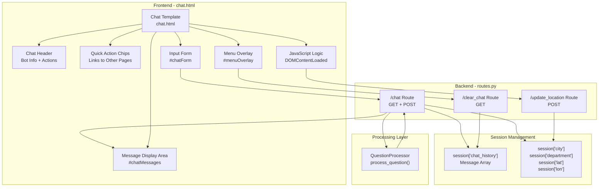
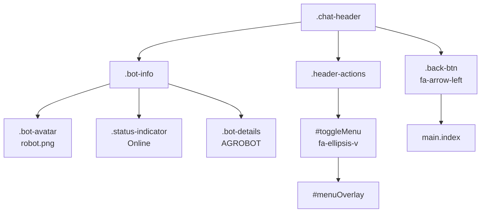
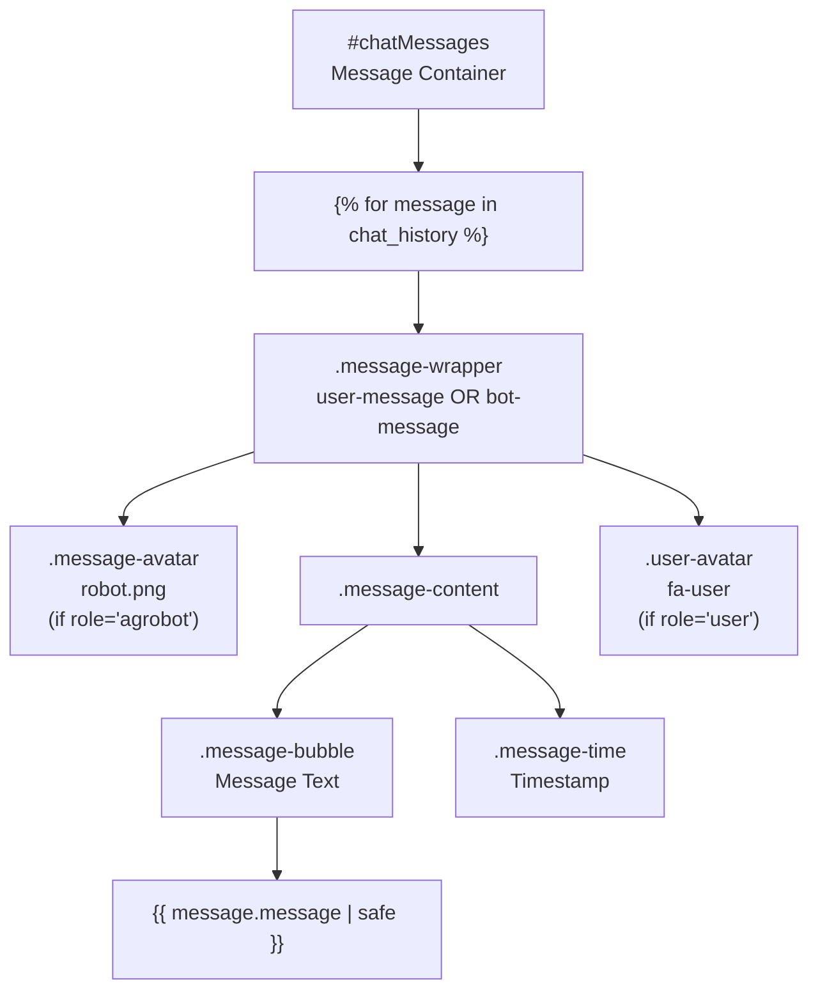
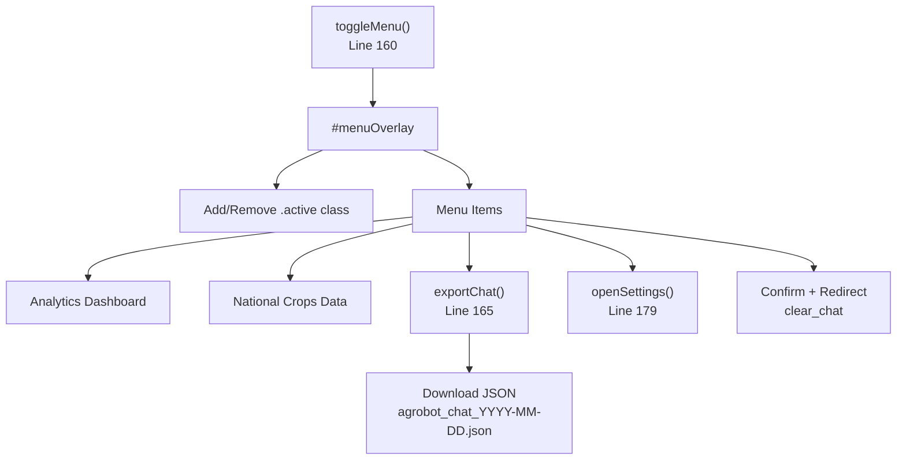
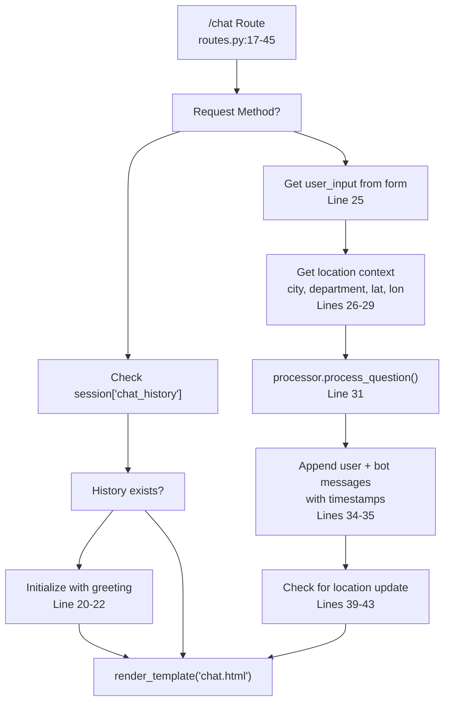
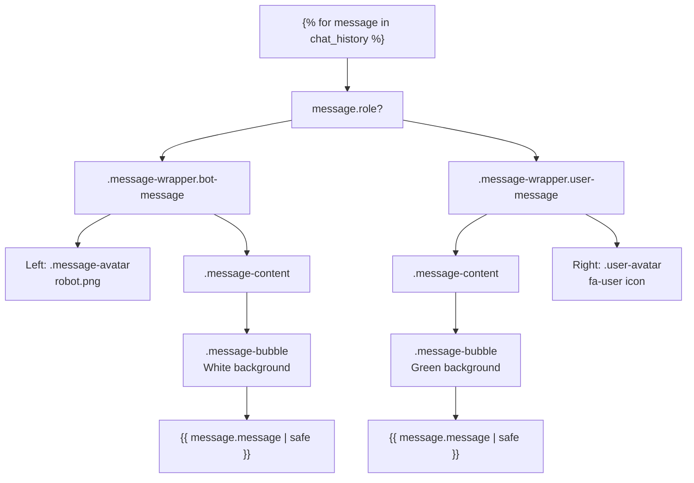
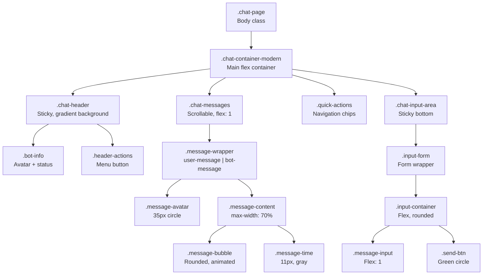
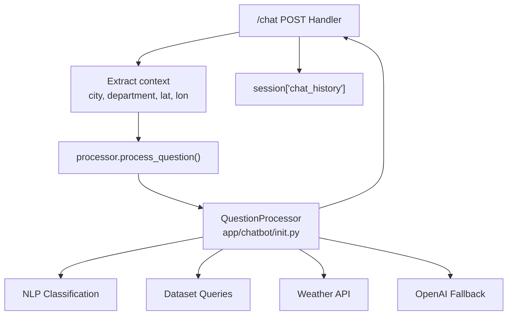

# Chat Interface

> **Relevant source files**
> * [app/chatbot/training_utils.py](https://github.com/axchisan/ProyectoAgroBot/blob/bc782fcf/app/chatbot/training_utils.py)
> * [app/routes/routes.py](https://github.com/axchisan/ProyectoAgroBot/blob/bc782fcf/app/routes/routes.py)
> * [app/static/css/style.css](https://github.com/axchisan/ProyectoAgroBot/blob/bc782fcf/app/static/css/style.css)
> * [app/templates/chat.html](https://github.com/axchisan/ProyectoAgroBot/blob/bc782fcf/app/templates/chat.html)

## Purpose and Scope

The Chat Interface is the primary user interaction component of Agrobot, providing a real-time conversational interface where Colombian farmers can ask agricultural questions and receive AI-powered responses. This document covers the frontend template structure, JavaScript interactions, backend routes, and session management for the chat functionality.

For information about how user questions are processed and routed to handlers, see [Question Processing](/axchisan/ProyectoAgroBot/4.2-question-processing). For details about the chatbot initialization and core components, see [Chatbot Initialization](/axchisan/ProyectoAgroBot/4.1-chatbot-initialization). For the main routes blueprint structure, see [Main Routes](/axchisan/ProyectoAgroBot/7.2-main-routes).

---

## Architecture Overview

The Chat Interface follows a client-server architecture with session-based state management and AJAX-style form submissions for real-time interaction.



**Sources:** [app/templates/chat.html L1-L248](https://github.com/axchisan/ProyectoAgroBot/blob/bc782fcf/app/templates/chat.html#L1-L248)

 [app/routes/routes.py L17-L53](https://github.com/axchisan/ProyectoAgroBot/blob/bc782fcf/app/routes/routes.py#L17-L53)

---

## Template Structure

The `chat.html` template is organized into distinct sections that form the complete chat interface:

| Section | Element ID/Class | Purpose |
| --- | --- | --- |
| Header | `.chat-header` | Displays bot information, status indicator, and action buttons |
| Messages Area | `#chatMessages` | Scrollable container for chat history |
| Typing Indicator | `#typingIndicator` | Shows animated dots when bot is processing |
| Quick Actions | `.quick-actions` | Navigation chips to other system pages |
| Input Area | `#chatForm` | Text input and send button |
| Menu Overlay | `#menuOverlay` | Dropdown menu with export, settings, and clear options |

**Sources:** [app/templates/chat.html L13-L155](https://github.com/axchisan/ProyectoAgroBot/blob/bc782fcf/app/templates/chat.html#L13-L155)

---

## User Interaction Flow

```mermaid
sequenceDiagram
  participant User
  participant Browser
  participant /chat Route
  participant Session
  participant QuestionProcessor
  participant chat.html

  User->>Browser: Navigate to /chat
  Browser->>/chat Route: GET /chat
  /chat Route->>Session: Check chat_history
  loop [No history exists]
    /chat Route->>Session: Initialize chat_history with greeting
  end
  /chat Route->>chat.html: Render with chat_history
  chat.html-->>Browser: Display chat interface
  Browser->>Browser: Request geolocation
  Browser->>/chat Route: POST /update_location {lat, lon}
  /chat Route->>Session: Store coordinates and city
  User->>Browser: Type question + Submit
  Browser->>Browser: Show typing indicator
  Browser->>/chat Route: POST /chat {user_input}
  /chat Route->>Session: Get location context (city, department)
  /chat Route->>QuestionProcessor: process_question(input, city, department, lat, lon)
  QuestionProcessor-->>/chat Route: Generated response
  /chat Route->>Session: Append user message
  /chat Route->>Session: Append bot response
  /chat Route->>chat.html: Render with updated history
  chat.html-->>Browser: Display new messages
  Browser->>Browser: Auto-scroll to bottom
```

**Sources:** [app/routes/routes.py L17-L45](https://github.com/axchisan/ProyectoAgroBot/blob/bc782fcf/app/routes/routes.py#L17-L45)

 [app/templates/chat.html L184-L245](https://github.com/axchisan/ProyectoAgroBot/blob/bc782fcf/app/templates/chat.html#L184-L245)

---

## Frontend Components

### Header Component

The chat header displays bot identity and provides navigation:



**Sources:** [app/templates/chat.html L15-L36](https://github.com/axchisan/ProyectoAgroBot/blob/bc782fcf/app/templates/chat.html#L15-L36)

### Message Display

Messages are rendered with role-based styling using a Jinja2 loop:



The message rendering logic handles two distinct message types based on the `role` field:

* **Bot messages**: Left-aligned with robot avatar on the left
* **User messages**: Right-aligned with user icon on the right

**Sources:** [app/templates/chat.html L39-L61](https://github.com/axchisan/ProyectoAgroBot/blob/bc782fcf/app/templates/chat.html#L39-L61)

### Quick Action Chips

Quick actions provide navigation to other system features:

| Chip | Icon | Route | Description |
| --- | --- | --- | --- |
| Analytics | `fa-chart-pie` | `analytics.dashboard` | Navigate to analytics dashboard |
| Clima | `fa-cloud-sun` | `main.weather` | View weather information |
| Siembra | `fa-seedling` | `main.recommend` | Get crop recommendations |
| Estado | `fa-chart-bar` | `main.crop_status` | Check crop status |
| Soporte | `fa-headset` | `main.support` | Access support resources |

**Sources:** [app/templates/chat.html L75-L97](https://github.com/axchisan/ProyectoAgroBot/blob/bc782fcf/app/templates/chat.html#L75-L97)

---

## JavaScript Functionality

### Form Submission and Typing Indicator

The chat form implements a visual feedback mechanism for message processing:

```javascript
// Form submission handler at lines 193-198
form.addEventListener('submit', (e) => {
    typingIndicator.classList.remove('d-none');
    setTimeout(() => {
        typingIndicator.classList.add('d-none');
    }, 2000);
});
```

**Sources:** [app/templates/chat.html L192-L198](https://github.com/axchisan/ProyectoAgroBot/blob/bc782fcf/app/templates/chat.html#L192-L198)

### Menu Toggle System

The menu overlay provides additional actions through a toggle mechanism:



**Sources:** [app/templates/chat.html L160-L182](https://github.com/axchisan/ProyectoAgroBot/blob/bc782fcf/app/templates/chat.html#L160-L182)

### Chat Export Functionality

The `exportChat()` function serializes the chat history to JSON:

```javascript
// Export logic at lines 165-177
function exportChat() {
    const chatHistory = {{ chat_history | tojson }};
    const dataStr = "data:text/json;charset=utf-8," + 
                    encodeURIComponent(JSON.stringify(chatHistory, null, 2));
    const downloadAnchorNode = document.createElement('a');
    downloadAnchorNode.setAttribute("href", dataStr);
    downloadAnchorNode.setAttribute("download", 
                                   "agrobot_chat_" + new Date().toISOString().split('T')[0] + ".json");
    document.body.appendChild(downloadAnchorNode);
    downloadAnchorNode.click();
    downloadAnchorNode.remove();
}
```

**Sources:** [app/templates/chat.html L165-L177](https://github.com/axchisan/ProyectoAgroBot/blob/bc782fcf/app/templates/chat.html#L165-L177)

### Geolocation Integration

The interface automatically requests user location on page load to provide location-aware responses:

```mermaid
sequenceDiagram
  participant DOMContentLoaded
  participant navigator.geolocation
  participant /update_location
  participant Flask Session

  DOMContentLoaded->>navigator.geolocation: getCurrentPosition()
  loop [Success]
    navigator.geolocation->>DOMContentLoaded: position {lat, lon}
    DOMContentLoaded->>/update_location: POST {lat, lon}
    /update_location->>Flask Session: Reverse geocode to city/department
    /update_location->>Flask Session: Store lat, lon, city, department
    /update_location-->>DOMContentLoaded: {success: true}
    navigator.geolocation->>DOMContentLoaded: Error
    DOMContentLoaded->>DOMContentLoaded: alert("Indica tu ciudad manualmente")
    DOMContentLoaded->>DOMContentLoaded: alert("Navegador no soporta geolocalización")
  end
```

**Sources:** [app/templates/chat.html L207-L244](https://github.com/axchisan/ProyectoAgroBot/blob/bc782fcf/app/templates/chat.html#L207-L244)

---

## Backend Routes

### Main Chat Route

The `/chat` route handles both GET (initial load) and POST (message submission) requests:



**Key Route Implementation:**

| Route | Method | Parameters | Session Keys Modified |
| --- | --- | --- | --- |
| `/chat` | GET | None | `chat_history` (if new) |
| `/chat` | POST | `user_input` (form) | `chat_history`, possibly `city`/`department` |

**Sources:** [app/routes/routes.py L17-L45](https://github.com/axchisan/ProyectoAgroBot/blob/bc782fcf/app/routes/routes.py#L17-L45)

### Clear Chat Route

Resets the conversation by reinitializing the chat history:

```python
# routes.py:47-53
@bp.route('/clear_chat', methods=['GET'])
def clear_chat():
    session['chat_history'] = [
        {"role": "agrobot", "message": "Hola, soy AGROBOT 🌱. ¿Cómo puedo ayudarte hoy?", 
         "timestamp": datetime.now().strftime('%H:%M')}
    ]
    session.modified = True
    return redirect(url_for('main.chat'))
```

**Sources:** [app/routes/routes.py L47-L53](https://github.com/axchisan/ProyectoAgroBot/blob/bc782fcf/app/routes/routes.py#L47-L53)

### Update Location Route

Handles geolocation updates from the browser:

```python
# routes.py:154-168
@bp.route('/update_location', methods=['POST'])
def update_location():
    data = request.get_json()
    lat = data.get('lat')
    lon = data.get('lon')
    if lat is not None and lon is not None:
        session['lat'] = float(lat)
        session['lon'] = float(lon)
        location = get_location_from_coords(lat, lon)  # Reverse geocoding
        if location:
            session['city'] = location.get('city', 'Guavatá')
            session['department'] = location.get('department', 'Santander')
        session.modified = True
        return jsonify({"success": True})
    return jsonify({"error": "No se proporcionaron coordenadas válidas."}), 400
```

**Sources:** [app/routes/routes.py L154-L168](https://github.com/axchisan/ProyectoAgroBot/blob/bc782fcf/app/routes/routes.py#L154-L168)

---

## Session Management

### Chat History Structure

The chat history is stored in Flask's server-side session as an array of message objects:

```css
# Message structure
{
    "role": "user" | "agrobot",
    "message": "Message text content",
    "timestamp": "HH:MM"  # Format: strftime('%H:%M')
}
```

**Session Keys:**

| Key | Type | Purpose | Default Value |
| --- | --- | --- | --- |
| `chat_history` | `list[dict]` | Stores all conversation messages | `[greeting_message]` |
| `city` | `str` | User's current city | `'Guavatá'` |
| `department` | `str` | User's department | `'Santander'` |
| `lat` | `float` | User's latitude | `None` |
| `lon` | `float` | User's longitude | `None` |

**Sources:** [app/routes/routes.py L19-L35](https://github.com/axchisan/ProyectoAgroBot/blob/bc782fcf/app/routes/routes.py#L19-L35)

### Message Timestamp Formatting

All messages include a timestamp generated at creation:

```css
# routes.py:34-35
session['chat_history'].append({
    "role": "user", 
    "message": user_input, 
    "timestamp": datetime.now().strftime('%H:%M')
})
```

**Sources:** [app/routes/routes.py L34-L35](https://github.com/axchisan/ProyectoAgroBot/blob/bc782fcf/app/routes/routes.py#L34-L35)

---

## Message Rendering

### Jinja2 Template Logic

The template iterates over `chat_history` to render messages with conditional styling:



**Sources:** [app/templates/chat.html L40-L60](https://github.com/axchisan/ProyectoAgroBot/blob/bc782fcf/app/templates/chat.html#L40-L60)

### Message Filtering

The template applies filters to message content:

1. **`replace('**', '')`** - Removes Markdown bold markers
2. **`replace('', '')`** - Removes empty strings
3. **`safe`** - Allows HTML rendering (for formatted responses)

**Sources:** [app/templates/chat.html L49](https://github.com/axchisan/ProyectoAgroBot/blob/bc782fcf/app/templates/chat.html#L49-L49)

---

## Styling and Responsiveness

### CSS Class Structure

The chat interface uses a comprehensive CSS class system defined in `style.css`:



**Sources:** [app/static/css/style.css L221-L566](https://github.com/axchisan/ProyectoAgroBot/blob/bc782fcf/app/static/css/style.css#L221-L566)

### Responsive Breakpoints

The interface adapts to different screen sizes:

| Breakpoint | Max Width | Key Changes |
| --- | --- | --- |
| Mobile | 575px | Full-height container, smaller padding, nowrap chips |
| Small | 767px | Reduced font sizes, single column layout |
| Medium | 991px | Two-column grids, adjusted message width |
| Large | 1199px | Centered container with max-width |
| XL | 1400px+ | Wider container (1000px), enhanced shadows |

**Sources:** [app/static/css/style.css L2314-L2526](https://github.com/axchisan/ProyectoAgroBot/blob/bc782fcf/app/static/css/style.css#L2314-L2526)

### Animation Effects

The interface includes several CSS animations:

| Animation | Class | Purpose |
| --- | --- | --- |
| `messageSlide` | `.message-bubble` | Smooth message appearance |
| `typing` | `.typing-dots span` | Animated typing indicator |
| `float` | `.robot-avatar` | Floating robot icon |
| `fadeInImage` | `.robot-image` | Smooth image loading |

**Sources:** [app/static/css/style.css L1998-L2027](https://github.com/axchisan/ProyectoAgroBot/blob/bc782fcf/app/static/css/style.css#L1998-L2027)

 [app/static/css/style.css L3259-L3273](https://github.com/axchisan/ProyectoAgroBot/blob/bc782fcf/app/static/css/style.css#L3259-L3273)

---

## Integration with Question Processing

The chat interface delegates all question processing to the `QuestionProcessor`:



The processor is initialized once at application startup:

```markdown
# routes.py:11
processor = init_chatbot(weather_api_key=os.getenv("OPENWEATHERMAP_API_KEY"))
```

**Sources:** [app/routes/routes.py L11](https://github.com/axchisan/ProyectoAgroBot/blob/bc782fcf/app/routes/routes.py#L11-L11)

 [app/routes/routes.py L31](https://github.com/axchisan/ProyectoAgroBot/blob/bc782fcf/app/routes/routes.py#L31-L31)

---

## Auto-Scroll Behavior

The interface automatically scrolls to the latest message:

```javascript
// chat.html:189-190
const chatMessages = document.getElementById('chatMessages');
chatMessages.scrollTop = chatMessages.scrollHeight;
```

This ensures users always see the most recent bot response without manual scrolling.

**Sources:** [app/templates/chat.html L189-L190](https://github.com/axchisan/ProyectoAgroBot/blob/bc782fcf/app/templates/chat.html#L189-L190)

---

## Summary

The Chat Interface is built on a three-tier architecture:

1. **Frontend Layer**: `chat.html` template with embedded JavaScript for interactivity
2. **Backend Layer**: Flask routes (`/chat`, `/clear_chat`, `/update_location`) handling requests
3. **State Layer**: Server-side Flask sessions maintaining chat history and location context

Key features include:

* Real-time message exchange with typing indicators
* Automatic geolocation for location-aware responses
* Session-based conversation persistence
* Export functionality for chat history
* Responsive design adapting to mobile and desktop
* Integration with `QuestionProcessor` for intelligent responses

The interface maintains a clean separation between presentation (`chat.html` + `style.css`), interaction logic (embedded JavaScript), and business logic (Flask routes + `QuestionProcessor`).