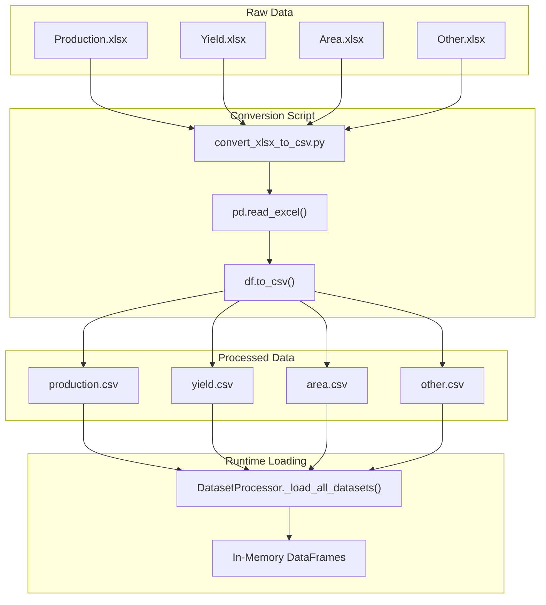
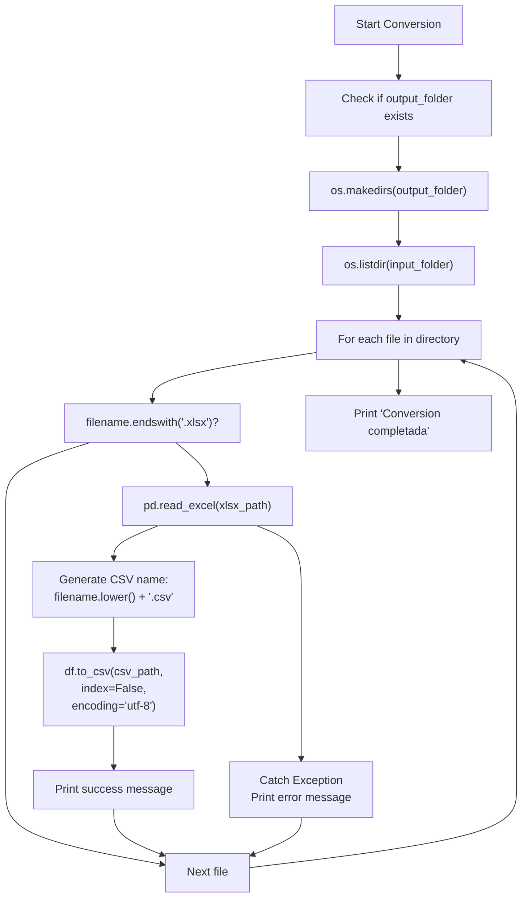
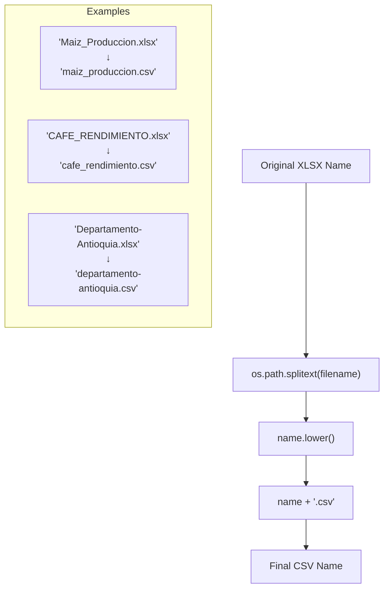
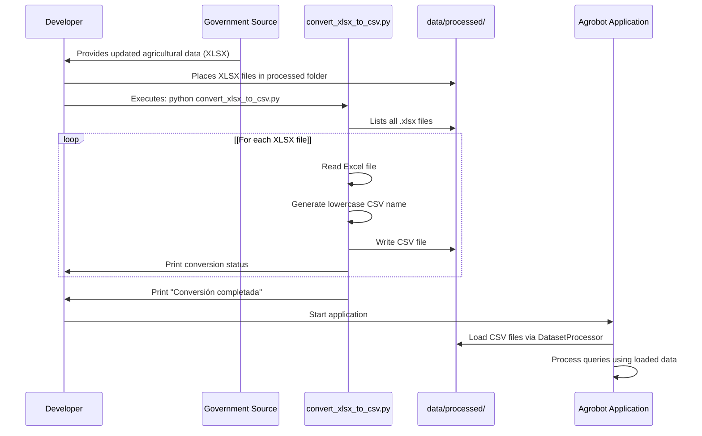
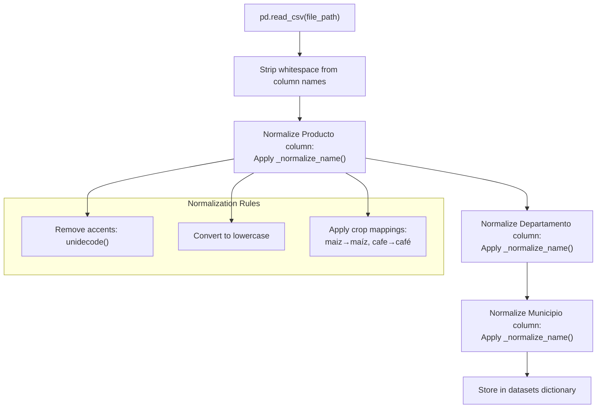
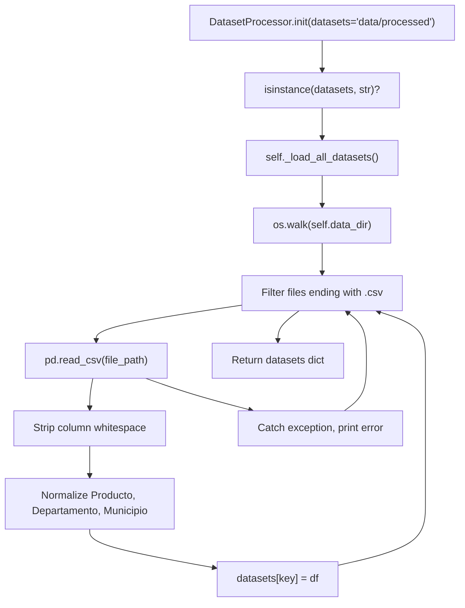

# Data Conversion Utilities

> **Relevant source files**
> * [app/chatbot/dataset_processor.py](https://github.com/axchisan/ProyectoAgroBot/blob/bc782fcf/app/chatbot/dataset_processor.py)
> * [data/processed/Area_Produccion_y_Rendimiento_Nacional_por_Cultivo/convert_xlsx_to_csv.py](https://github.com/axchisan/ProyectoAgroBot/blob/bc782fcf/data/processed/Area_Produccion_y_Rendimiento_Nacional_por_Cultivo/convert_xlsx_to_csv.py)

## Purpose and Scope

This document describes the data conversion utilities used to transform raw agricultural data from Excel format (XLSX) into CSV format for processing by Agrobot. These utilities are preprocessing scripts that prepare external datasets before they are loaded into the system at runtime.

For information about how the converted CSV files are loaded and accessed by the application, see [Data Loading](/axchisan/ProyectoAgroBot/5.2-data-loading). For details on how the loaded data is queried and processed, see [Dataset Processing](/axchisan/ProyectoAgroBot/5.3-dataset-processing).

**Sources:** [data/processed/Area_Produccion_y_Rendimiento_Nacional_por_Cultivo/convert_xlsx_to_csv.py L1-L32](https://github.com/axchisan/ProyectoAgroBot/blob/bc782fcf/data/processed/Area_Produccion_y_Rendimiento_Nacional_por_Cultivo/convert_xlsx_to_csv.py#L1-L32)

---

## Overview

The data conversion utilities consist of standalone Python scripts that convert Excel workbooks containing Colombian agricultural statistics into CSV format. The primary conversion script is located at [data/processed/Area_Produccion_y_Rendimiento_Nacional_por_Cultivo/convert_xlsx_to_csv.py L1-L32](https://github.com/axchisan/ProyectoAgroBot/blob/bc782fcf/data/processed/Area_Produccion_y_Rendimiento_Nacional_por_Cultivo/convert_xlsx_to_csv.py#L1-L32)

 This script processes government-provided agricultural datasets that include production volumes, yields, and cultivated areas by region and crop.

### Conversion Flow



**Sources:** [data/processed/Area_Produccion_y_Rendimiento_Nacional_por_Cultivo/convert_xlsx_to_csv.py L1-L32](https://github.com/axchisan/ProyectoAgroBot/blob/bc782fcf/data/processed/Area_Produccion_y_Rendimiento_Nacional_por_Cultivo/convert_xlsx_to_csv.py#L1-L32)

 [app/chatbot/dataset_processor.py L31-L58](https://github.com/axchisan/ProyectoAgroBot/blob/bc782fcf/app/chatbot/dataset_processor.py#L31-L58)

---

## XLSX to CSV Conversion Script

The conversion script is a simple, standalone utility that processes all XLSX files in a specified directory.

### Script Configuration

The script is configured via two path variables at [data/processed/Area_Produccion_y_Rendimiento_Nacional_por_Cultivo/convert_xlsx_to_csv.py L4-L6](https://github.com/axchisan/ProyectoAgroBot/blob/bc782fcf/data/processed/Area_Produccion_y_Rendimiento_Nacional_por_Cultivo/convert_xlsx_to_csv.py#L4-L6)

:

| Variable | Default Value | Purpose |
| --- | --- | --- |
| `input_folder` | `"./"` | Directory containing source XLSX files |
| `output_folder` | `"./"` | Directory where CSV files will be saved |

Both default to the current directory, meaning the script is typically run in-place within the data directory.

### Conversion Logic

The script implements a straightforward batch conversion process at [data/processed/Area_Produccion_y_Rendimiento_Nacional_por_Cultivo/convert_xlsx_to_csv.py L12-L30](https://github.com/axchisan/ProyectoAgroBot/blob/bc782fcf/data/processed/Area_Produccion_y_Rendimiento_Nacional_por_Cultivo/convert_xlsx_to_csv.py#L12-L30)

:



**Key operations:**

1. **Output directory creation** [data/processed/Area_Produccion_y_Rendimiento_Nacional_por_Cultivo/convert_xlsx_to_csv.py L8-L10](https://github.com/axchisan/ProyectoAgroBot/blob/bc782fcf/data/processed/Area_Produccion_y_Rendimiento_Nacional_por_Cultivo/convert_xlsx_to_csv.py#L8-L10) : Creates the output directory if it doesn't exist
2. **File filtering** [data/processed/Area_Produccion_y_Rendimiento_Nacional_por_Cultivo/convert_xlsx_to_csv.py L14](https://github.com/axchisan/ProyectoAgroBot/blob/bc782fcf/data/processed/Area_Produccion_y_Rendimiento_Nacional_por_Cultivo/convert_xlsx_to_csv.py#L14-L14) : Only processes files with `.xlsx` extension
3. **Reading XLSX** [data/processed/Area_Produccion_y_Rendimiento_Nacional_por_Cultivo/convert_xlsx_to_csv.py L20](https://github.com/axchisan/ProyectoAgroBot/blob/bc782fcf/data/processed/Area_Produccion_y_Rendimiento_Nacional_por_Cultivo/convert_xlsx_to_csv.py#L20-L20) : Uses `pd.read_excel()` to parse Excel workbooks
4. **Name normalization** [data/processed/Area_Produccion_y_Rendimiento_Nacional_por_Cultivo/convert_xlsx_to_csv.py L23](https://github.com/axchisan/ProyectoAgroBot/blob/bc782fcf/data/processed/Area_Produccion_y_Rendimiento_Nacional_por_Cultivo/convert_xlsx_to_csv.py#L23-L23) : Converts filenames to lowercase for consistency
5. **CSV export** [data/processed/Area_Produccion_y_Rendimiento_Nacional_por_Cultivo/convert_xlsx_to_csv.py L27](https://github.com/axchisan/ProyectoAgroBot/blob/bc782fcf/data/processed/Area_Produccion_y_Rendimiento_Nacional_por_Cultivo/convert_xlsx_to_csv.py#L27-L27) : Saves with UTF-8 encoding and no index column
6. **Error handling** [data/processed/Area_Produccion_y_Rendimiento_Nacional_por_Cultivo/convert_xlsx_to_csv.py L29-L30](https://github.com/axchisan/ProyectoAgroBot/blob/bc782fcf/data/processed/Area_Produccion_y_Rendimiento_Nacional_por_Cultivo/convert_xlsx_to_csv.py#L29-L30) : Catches and reports individual file errors without stopping the batch

**Sources:** [data/processed/Area_Produccion_y_Rendimiento_Nacional_por_Cultivo/convert_xlsx_to_csv.py L8-L31](https://github.com/axchisan/ProyectoAgroBot/blob/bc782fcf/data/processed/Area_Produccion_y_Rendimiento_Nacional_por_Cultivo/convert_xlsx_to_csv.py#L8-L31)

---

## File Naming Convention

The script enforces a specific naming convention during conversion:

### Name Transformation



This lowercase normalization at [data/processed/Area_Produccion_y_Rendimiento_Nacional_por_Cultivo/convert_xlsx_to_csv.py L23](https://github.com/axchisan/ProyectoAgroBot/blob/bc782fcf/data/processed/Area_Produccion_y_Rendimiento_Nacional_por_Cultivo/convert_xlsx_to_csv.py#L23-L23)

 is critical because the `DatasetProcessor` uses lowercase keys when storing datasets in its dictionary at [app/chatbot/dataset_processor.py L43](https://github.com/axchisan/ProyectoAgroBot/blob/bc782fcf/app/chatbot/dataset_processor.py#L43-L43)

**Sources:** [data/processed/Area_Produccion_y_Rendimiento_Nacional_por_Cultivo/convert_xlsx_to_csv.py L22-L24](https://github.com/axchisan/ProyectoAgroBot/blob/bc782fcf/data/processed/Area_Produccion_y_Rendimiento_Nacional_por_Cultivo/convert_xlsx_to_csv.py#L22-L24)

 [app/chatbot/dataset_processor.py L39-L58](https://github.com/axchisan/ProyectoAgroBot/blob/bc782fcf/app/chatbot/dataset_processor.py#L39-L58)

---

## Data Structure Preservation

The conversion script preserves the entire structure of the source Excel files:

### Structure Mapping

| Excel Component | CSV Equivalent | Preserved |
| --- | --- | --- |
| Worksheet data | CSV rows | ✓ |
| Column headers | CSV header row | ✓ |
| Data types | String representation | ✓ |
| Cell values | Comma-separated values | ✓ |
| Row order | Sequential rows | ✓ |
| Formulas | Calculated values | ✓ |
| Formatting | None | ✗ |
| Charts | None | ✗ |
| Multiple sheets | First sheet only | Partial |

**Note:** The script reads only the first (default) worksheet from multi-sheet Excel files at [data/processed/Area_Produccion_y_Rendimiento_Nacional_por_Cultivo/convert_xlsx_to_csv.py L20](https://github.com/axchisan/ProyectoAgroBot/blob/bc782fcf/data/processed/Area_Produccion_y_Rendimiento_Nacional_por_Cultivo/convert_xlsx_to_csv.py#L20-L20)

 If the source data contains multiple sheets, each sheet should be saved as a separate XLSX file before conversion.

**Sources:** [data/processed/Area_Produccion_y_Rendimiento_Nacional_por_Cultivo/convert_xlsx_to_csv.py L20](https://github.com/axchisan/ProyectoAgroBot/blob/bc782fcf/data/processed/Area_Produccion_y_Rendimiento_Nacional_por_Cultivo/convert_xlsx_to_csv.py#L20-L20)

 [data/processed/Area_Produccion_y_Rendimiento_Nacional_por_Cultivo/convert_xlsx_to_csv.py L27](https://github.com/axchisan/ProyectoAgroBot/blob/bc782fcf/data/processed/Area_Produccion_y_Rendimiento_Nacional_por_Cultivo/convert_xlsx_to_csv.py#L27-L27)

---

## Usage Workflow

The conversion script is intended to be run manually as a preprocessing step before deploying or running the Agrobot application.

### Typical Workflow



### Execution Steps

1. **Navigate to data directory:** ``` cd data/processed/Area_Produccion_y_Rendimiento_Nacional_por_Cultivo/ ```
2. **Run conversion script:** ``` python convert_xlsx_to_csv.py ```
3. **Verify output:** * Check console for success/error messages * Confirm CSV files exist in output folder * Validate CSV content if needed
4. **Start application:** The converted CSV files are now ready to be loaded by `DatasetProcessor`

**Sources:** [data/processed/Area_Produccion_y_Rendimiento_Nacional_por_Cultivo/convert_xlsx_to_csv.py L1-L32](https://github.com/axchisan/ProyectoAgroBot/blob/bc782fcf/data/processed/Area_Produccion_y_Rendimiento_Nacional_por_Cultivo/convert_xlsx_to_csv.py#L1-L32)

---

## Expected CSV Output Structure

After conversion, the CSV files contain agricultural data with a standardized column structure that the `DatasetProcessor` expects.

### Common Column Schema

While exact columns vary by dataset type, most agricultural CSV files follow this general structure:

| Column Name | Data Type | Example Value | Purpose |
| --- | --- | --- | --- |
| `Departamento` | String | `"Antioquia"` | Colombian department name |
| `Municipio` | String | `"Medellín"` | Municipality name (if present) |
| `Producto` | String | `"Café"` | Crop or product name |
| `Año` | Integer | `2021` | Year of data collection |
| `Area Sembrada (ha)` | Float | `1250.5` | Planted area in hectares |
| `Produccion (ton)` | Float | `3500.0` | Production volume in tons |
| `Rendimiento (ha/ton)` | Float | `2.8` | Yield per hectare |

### Column Normalization

After CSV files are loaded, the `DatasetProcessor` normalizes them at [app/chatbot/dataset_processor.py L46-L54](https://github.com/axchisan/ProyectoAgroBot/blob/bc782fcf/app/chatbot/dataset_processor.py#L46-L54)

:



This normalization at [app/chatbot/dataset_processor.py L26-L29](https://github.com/axchisan/ProyectoAgroBot/blob/bc782fcf/app/chatbot/dataset_processor.py#L26-L29)

 ensures that user queries like "maiz" match data entries like "maíz" despite accent differences.

**Sources:** [app/chatbot/dataset_processor.py L31-L58](https://github.com/axchisan/ProyectoAgroBot/blob/bc782fcf/app/chatbot/dataset_processor.py#L31-L58)

 [app/chatbot/dataset_processor.py L26-L29](https://github.com/axchisan/ProyectoAgroBot/blob/bc782fcf/app/chatbot/dataset_processor.py#L26-L29)

---

## Integration with DatasetProcessor

The converted CSV files are loaded automatically when `DatasetProcessor` is initialized with a data directory path.

### Loading Process



The loading process at [app/chatbot/dataset_processor.py L31-L58](https://github.com/axchisan/ProyectoAgroBot/blob/bc782fcf/app/chatbot/dataset_processor.py#L31-L58)

 recursively scans the data directory, reading all CSV files and storing them in a dictionary with keys derived from filenames (without `.csv` extension, lowercase).

### Dictionary Keys

The conversion from filename to dictionary key:

| CSV Filename | Dictionary Key | Access Pattern |
| --- | --- | --- |
| `antioquia.csv` | `"antioquia"` | Department-level data |
| `cafe.csv` | `"cafe"` | Crop-level data (national) |
| `produccion-maiz.csv` | `"produccion-maiz"` | Production data for specific crop |
| `antioquia-cafe.csv` | `"antioquia-cafe"` | Municipal data for department-crop |

This naming pattern is used throughout the `DatasetProcessor` methods to locate appropriate datasets for queries at [app/chatbot/dataset_processor.py L64-L149](https://github.com/axchisan/ProyectoAgroBot/blob/bc782fcf/app/chatbot/dataset_processor.py#L64-L149)

**Sources:** [app/chatbot/dataset_processor.py L7-L58](https://github.com/axchisan/ProyectoAgroBot/blob/bc782fcf/app/chatbot/dataset_processor.py#L7-L58)

 [app/chatbot/dataset_processor.py L126-L149](https://github.com/axchisan/ProyectoAgroBot/blob/bc782fcf/app/chatbot/dataset_processor.py#L126-L149)

---

## Error Handling

The conversion script includes basic error handling to ensure batch processing continues even if individual files fail.

### Error Handling Strategy

At [data/processed/Area_Produccion_y_Rendimiento_Nacional_por_Cultivo/convert_xlsx_to_csv.py L19-L30](https://github.com/axchisan/ProyectoAgroBot/blob/bc782fcf/data/processed/Area_Produccion_y_Rendimiento_Nacional_por_Cultivo/convert_xlsx_to_csv.py#L19-L30)

 the script:

1. **Wraps conversion in try-except block**
2. **Catches all exceptions** using generic `Exception` handler
3. **Prints error message** with filename and exception details
4. **Continues processing** remaining files

Example error output:

```
Error al procesar Corrupted_File.xlsx: 'utf-8' codec can't decode byte 0xff in position 0: invalid start byte
```

### Common Error Scenarios

| Error Type | Cause | Resolution |
| --- | --- | --- |
| File not found | XLSX file moved/deleted during scan | Remove from directory |
| Invalid format | File is not actually an XLSX | Verify file integrity |
| Permission denied | Insufficient read/write permissions | Check file permissions |
| Encoding issues | Non-UTF-8 characters in Excel | Re-save Excel file with UTF-8 |
| Memory error | XLSX file too large | Process separately or increase memory |

**Sources:** [data/processed/Area_Produccion_y_Rendimiento_Nacional_por_Cultivo/convert_xlsx_to_csv.py L19-L30](https://github.com/axchisan/ProyectoAgroBot/blob/bc782fcf/data/processed/Area_Produccion_y_Rendimiento_Nacional_por_Cultivo/convert_xlsx_to_csv.py#L19-L30)

---

## Limitations and Considerations

### Current Limitations

1. **Single sheet only**: Only the first worksheet of multi-sheet Excel files is converted
2. **No schema validation**: The script does not validate that converted CSV files contain expected columns
3. **No data type enforcement**: All values are converted as-is without type checking
4. **No incremental updates**: Full batch conversion required for any changes
5. **No backup mechanism**: Overwrites existing CSV files without confirmation

### Data Quality Considerations

The conversion script operates on a "garbage in, garbage out" principle. Data quality issues in source XLSX files will be preserved in CSV output:

* **Missing values** in Excel cells become empty strings or NaN in CSV
* **Inconsistent formatting** (e.g., "2021" vs "2021.0") is preserved
* **Spelling variations** (e.g., "Maíz" vs "maiz") must be handled by `DatasetProcessor` normalization

The `DatasetProcessor` handles some of these issues through normalization at [app/chatbot/dataset_processor.py L26-L29](https://github.com/axchisan/ProyectoAgroBot/blob/bc782fcf/app/chatbot/dataset_processor.py#L26-L29)

 but source data quality is still important.

**Sources:** [data/processed/Area_Produccion_y_Rendimiento_Nacional_por_Cultivo/convert_xlsx_to_csv.py L20](https://github.com/axchisan/ProyectoAgroBot/blob/bc782fcf/data/processed/Area_Produccion_y_Rendimiento_Nacional_por_Cultivo/convert_xlsx_to_csv.py#L20-L20)

 [app/chatbot/dataset_processor.py L26-L29](https://github.com/axchisan/ProyectoAgroBot/blob/bc782fcf/app/chatbot/dataset_processor.py#L26-L29)

---

## Best Practices

When working with the conversion utilities:

### Before Conversion

1. **Validate source data**: Ensure XLSX files contain expected structure
2. **Backup original files**: Keep copies of source XLSX files
3. **Check filenames**: Use descriptive, lowercase names with underscores
4. **Verify encoding**: Ensure Excel files use UTF-8 compatible characters

### During Conversion

1. **Run in correct directory**: Execute script from the data directory or adjust paths
2. **Monitor console output**: Check for error messages during batch processing
3. **Verify completion**: Wait for "Conversión completada" message

### After Conversion

1. **Inspect CSV files**: Open sample CSV files to verify structure
2. **Check file sizes**: Ensure CSV files are not empty or corrupted
3. **Test loading**: Run `DatasetProcessor` to verify CSVs load correctly
4. **Version control**: Commit updated CSV files to repository

**Sources:** [data/processed/Area_Produccion_y_Rendimiento_Nacional_por_Cultivo/convert_xlsx_to_csv.py L1-L32](https://github.com/axchisan/ProyectoAgroBot/blob/bc782fcf/data/processed/Area_Produccion_y_Rendimiento_Nacional_por_Cultivo/convert_xlsx_to_csv.py#L1-L32)

---

## Summary

The data conversion utilities provide a simple but essential preprocessing step in the Agrobot data pipeline. The `convert_xlsx_to_csv.py` script transforms government-provided agricultural data from Excel format into CSV files that can be efficiently loaded and queried by the `DatasetProcessor` at runtime. While basic in functionality, this conversion layer enables the application to work with standardized, text-based data files that are easier to version control, load, and process than binary Excel formats.

**Sources:** [data/processed/Area_Produccion_y_Rendimiento_Nacional_por_Cultivo/convert_xlsx_to_csv.py L1-L32](https://github.com/axchisan/ProyectoAgroBot/blob/bc782fcf/data/processed/Area_Produccion_y_Rendimiento_Nacional_por_Cultivo/convert_xlsx_to_csv.py#L1-L32)

 [app/chatbot/dataset_processor.py L31-L58](https://github.com/axchisan/ProyectoAgroBot/blob/bc782fcf/app/chatbot/dataset_processor.py#L31-L58)