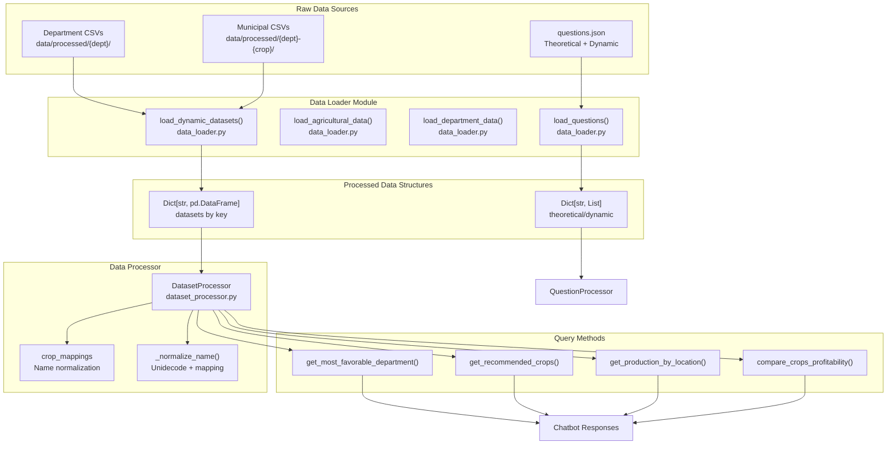
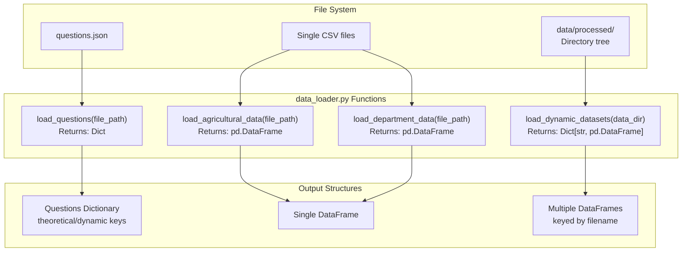
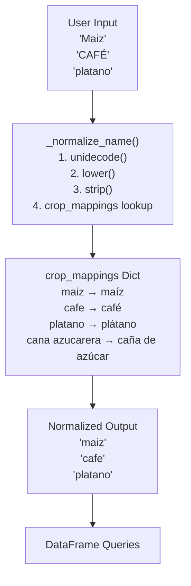
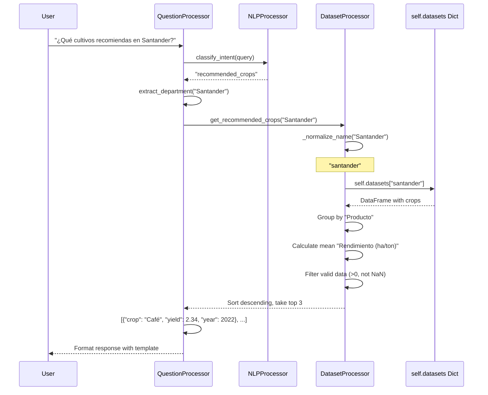
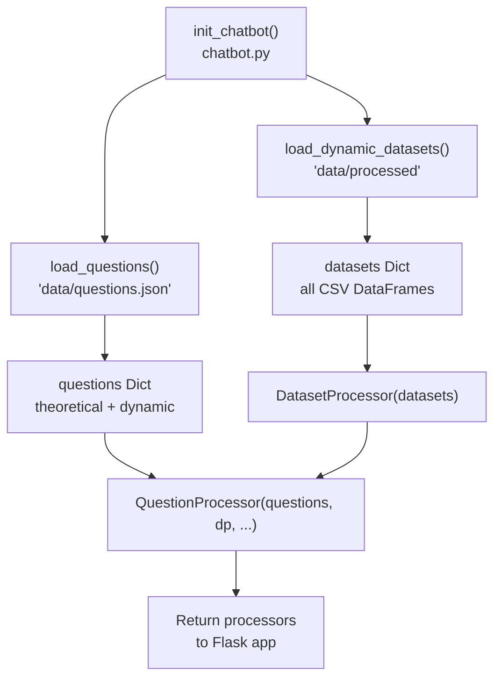

# Data Management

> **Relevant source files**
> * [app/chatbot/data_loader.py](https://github.com/axchisan/ProyectoAgroBot/blob/bc782fcf/app/chatbot/data_loader.py)
> * [app/chatbot/dataset_processor.py](https://github.com/axchisan/ProyectoAgroBot/blob/bc782fcf/app/chatbot/dataset_processor.py)
> * [data/questions.json](https://github.com/axchisan/ProyectoAgroBot/blob/bc782fcf/data/questions.json)

## Purpose and Scope

This document provides a comprehensive guide to Agrobot's data management system, covering how the application loads, processes, and queries agricultural and knowledge base data. The data management layer serves as the foundation for the chatbot's ability to provide accurate, data-driven agricultural recommendations to Colombian farmers.

The system manages two primary data categories:

1. **Knowledge Base**: Static question-answer pairs and dynamic response templates stored in JSON format
2. **Agricultural Datasets**: CSV files containing production, yield, and area data for Colombian crops organized by department and municipality

For information about how this data is integrated into chatbot responses, see [Chatbot Core System](/axchisan/ProyectoAgroBot/4-chatbot-core-system). For details on the ML training data pipeline, see [Machine Learning Pipeline](/axchisan/ProyectoAgroBot/8-machine-learning-pipeline).

**Sources:** [app/chatbot/data_loader.py L1-L46](https://github.com/axchisan/ProyectoAgroBot/blob/bc782fcf/app/chatbot/data_loader.py#L1-L46)

 [app/chatbot/dataset_processor.py L1-L250](https://github.com/axchisan/ProyectoAgroBot/blob/bc782fcf/app/chatbot/dataset_processor.py#L1-L250)

 [data/questions.json L1-L244](https://github.com/axchisan/ProyectoAgroBot/blob/bc782fcf/data/questions.json#L1-L244)

---

## Data Architecture Overview

The data management system follows a layered architecture where raw data sources are loaded through dedicated loaders, processed by specialized processors, and queried by the chatbot core components.



**Sources:** [app/chatbot/data_loader.py L7-L46](https://github.com/axchisan/ProyectoAgroBot/blob/bc782fcf/app/chatbot/data_loader.py#L7-L46)

 [app/chatbot/dataset_processor.py L6-L250](https://github.com/axchisan/ProyectoAgroBot/blob/bc782fcf/app/chatbot/dataset_processor.py#L6-L250)

---

## Knowledge Base Structure

The knowledge base is stored in `data/questions.json` and contains two distinct question types:

### Theoretical Questions

Static question-answer pairs covering agricultural concepts, practices, and general chatbot information. Each entry has:

* `question`: The user query pattern
* `answer`: A complete, contextualized response in Spanish

**Example theoretical question structure:**

```json
{
  "question": "¿Qué es la agricultura sostenible?",
  "answer": "La agricultura sostenible busca producir alimentos de manera..."
}
```

### Dynamic Questions

Template-based questions that require runtime data to complete the response. Each entry has:

* `question`: The user query pattern
* `type`: Intent classification type (e.g., `weather`, `crop_profitability`, `production_query`)
* `answer_template`: String template with placeholders like `{department}`, `{crop}`, `{yield_value}`

**Example dynamic question structure:**

```json
{
  "question": "¿Qué cultivos recomiendas en Santander?",
  "type": "recommended_crops",
  "answer_template": "En {department}, te recomiendo los siguientes cultivos:\n{crop_list}"
}
```

The knowledge base contains 150 theoretical questions and 20+ dynamic question templates covering intent types such as:

| Intent Type | Description | Example Template Variables |
| --- | --- | --- |
| `weather` | Current weather queries | `{city}`, `{description}`, `{temp}` |
| `location_based_recommendation` | Crop recommendations by region | `{department}`, `{crop}`, `{yield_value}` |
| `crop_profitability` | Most/least profitable departments | `{crop}`, `{department}`, `{yield_value}` |
| `production_query` | Historical production data | `{location}`, `{crop}`, `{production_ton}`, `{year}` |
| `crop_timing` | Planting schedules | `{crop}`, `{month}` |

**Sources:** [data/questions.json L1-L244](https://github.com/axchisan/ProyectoAgroBot/blob/bc782fcf/data/questions.json#L1-L244)

---

## Data Loading System

The `data_loader` module provides functions for loading data from various sources into Python data structures.

### Loading Functions



### load_questions()

Loads the knowledge base from JSON and returns a dictionary with `theoretical` and `dynamic` keys.

**Function signature:** [app/chatbot/data_loader.py L7-L15](https://github.com/axchisan/ProyectoAgroBot/blob/bc782fcf/app/chatbot/data_loader.py#L7-L15)

```python
def load_questions(file_path: str) -> Dict
```

**Error handling:** Returns `{"theoretical": [], "dynamic": []}` if file not found.

### load_dynamic_datasets()

Recursively walks the `data/processed` directory tree and loads all CSV files into a dictionary where:

* **Key**: Filename without `.csv` extension, lowercased (e.g., `"santander"`, `"antioquia-cafe"`)
* **Value**: pandas DataFrame with the CSV contents

**Function signature:** [app/chatbot/data_loader.py L32-L46](https://github.com/axchisan/ProyectoAgroBot/blob/bc782fcf/app/chatbot/data_loader.py#L32-L46)

```python
def load_dynamic_datasets(data_dir: str = "data/processed") -> Dict[str, pd.DataFrame]
```

**Directory structure it handles:**

```
data/processed/
├── santander.csv          → key: "santander"
├── antioquia.csv          → key: "antioquia"
├── santander-cafe.csv     → key: "santander-cafe"
└── valle_del_cauca.csv    → key: "valle_del_cauca"
```

**Sources:** [app/chatbot/data_loader.py L7-L46](https://github.com/axchisan/ProyectoAgroBot/blob/bc782fcf/app/chatbot/data_loader.py#L7-L46)

---

## DatasetProcessor Class

The `DatasetProcessor` class provides high-level query methods for agricultural data. It handles data normalization, dataset selection, and complex queries across multiple CSV files.

### Initialization

```
DatasetProcessor(datasets: Union[str, Dict[str, pd.DataFrame]] = "data/processed")
```

The constructor accepts either:

1. **String path**: Directory path to CSV files (triggers automatic loading via `_load_all_datasets()`)
2. **Dictionary**: Pre-loaded DataFrames (for testing or custom initialization)

**Sources:** [app/chatbot/dataset_processor.py L7-L24](https://github.com/axchisan/ProyectoAgroBot/blob/bc782fcf/app/chatbot/dataset_processor.py#L7-L24)

### Data Normalization System

The processor normalizes crop and department names to handle user input variations (typos, accents, capitalization).



**Key normalization mappings:** [app/chatbot/dataset_processor.py L14-L17](https://github.com/axchisan/ProyectoAgroBot/blob/bc782fcf/app/chatbot/dataset_processor.py#L14-L17)

```
self.crop_mappings = {
    "maiz": "maíz", 
    "cafe": "café", 
    "platano": "plátano", 
    "guayaba manzana": "guayaba",
    "guayaba pera": "guayaba", 
    "cana azucarera": "caña de azúcar", 
    "cana panelera": "caña de azúcar"
}
```

The `_normalize_name()` method [app/chatbot/dataset_processor.py L26-L29](https://github.com/axchisan/ProyectoAgroBot/blob/bc782fcf/app/chatbot/dataset_processor.py#L26-L29)

 applies `unidecode()` to remove accents, converts to lowercase, and maps through the crop mappings dictionary.

**Sources:** [app/chatbot/dataset_processor.py L14-L29](https://github.com/axchisan/ProyectoAgroBot/blob/bc782fcf/app/chatbot/dataset_processor.py#L14-L29)

### Dataset Organization

The processor works with three dataset types:

| Dataset Type | Naming Pattern | Columns | Use Case |
| --- | --- | --- | --- |
| **Type 1: Departmental** | `{department}.csv` | Departamento, Producto, Año, Produccion (ton), Rendimiento (ha/ton), Area Sembrada (ha) | Crop recommendations by department |
| **Type 2: Multi-department** | Generic names | Departamento, Producto, Año, Produccion (ton), Rendimiento (ha/ton) | Cross-department comparisons |
| **Type 3: Municipal** | `{department}-{crop}.csv` | Departamento, Municipio, Producto, Año, Produccion (ton), Rendimiento (ha/ton) | Municipality-level production queries |

**Loading process:** [app/chatbot/dataset_processor.py L31-L58](https://github.com/axchisan/ProyectoAgroBot/blob/bc782fcf/app/chatbot/dataset_processor.py#L31-L58)

1. Walks directory tree recursively
2. Loads each CSV into a DataFrame
3. Normalizes column names (strips whitespace)
4. Applies `_normalize_name()` to Producto, Departamento, and Municipio columns
5. Stores in `self.datasets` dictionary

**Sources:** [app/chatbot/dataset_processor.py L6-L58](https://github.com/axchisan/ProyectoAgroBot/blob/bc782fcf/app/chatbot/dataset_processor.py#L6-L58)

---

## Query Methods

The `DatasetProcessor` provides specialized methods for common agricultural queries.

### get_recommended_crops()

Returns top 3 crops for a department sorted by yield.

**Signature:** [app/chatbot/dataset_processor.py L126-L149](https://github.com/axchisan/ProyectoAgroBot/blob/bc782fcf/app/chatbot/dataset_processor.py#L126-L149)

```python
def get_recommended_crops(self, department: str, metric: str = "Rendimiento (ha/ton)") -> List[Dict]
```

**Algorithm:**

1. Normalizes department name
2. Looks up department key in `self.datasets`
3. Groups by `Producto` and calculates mean of metric
4. Filters valid data (metric > 0 and not NaN)
5. Sorts descending and takes top 3
6. Returns list of dicts with `crop`, `yield`, and `year` keys

**Output format:**

```json
[
  {"crop": "Café", "yield": 2.34, "year": 2022},
  {"crop": "Plátano", "yield": 8.12, "year": 2022},
  {"crop": "Maíz", "yield": 3.45, "year": 2021}
]
```

### get_most_favorable_department() / get_least_favorable_department()

Finds the department with highest/lowest metric value for a crop.

**Signature:** [app/chatbot/dataset_processor.py L60-L124](https://github.com/axchisan/ProyectoAgroBot/blob/bc782fcf/app/chatbot/dataset_processor.py#L60-L124)

```python
def get_most_favorable_department(self, crop: str, metric: str = "Rendimiento (ha/ton)") -> Optional[Dict]
def get_least_favorable_department(self, crop: str, metric: str = "Rendimiento (ha/ton)") -> Optional[Dict]
```

**Search strategy:**

1. **First pass**: Search Type 1 and Type 3 datasets (crop-specific files) * Keys matching `{crop}` or ending with `-{crop}`
2. **Second pass**: Search Type 2 datasets (multi-department files) * Filter by `Producto == crop`
3. Returns first match with department, value, and year

**Output format:**

```json
{
  "department": "Antioquia",
  "value": 12.45,
  "year": 2022
}
```

### get_production_by_location()

Retrieves production data for a specific crop, location, and year.

**Signature:** [app/chatbot/dataset_processor.py L151-L191](https://github.com/axchisan/ProyectoAgroBot/blob/bc782fcf/app/chatbot/dataset_processor.py#L151-L191)

```python
def get_production_by_location(
    self, 
    crop: str, 
    location: str, 
    year: int, 
    location_type: str = "department"
) -> Optional[Dict]
```

**Location type handling:**

* **department**: Queries departmental datasets
* **municipality**: Searches municipal datasets (files ending with `-{crop}`)

**Filter conditions:**

* `Producto == crop`
* `Año == year`
* `Produccion (ton) > 0`

### compare_crops_profitability()

Compares yield between two crops in a department or nationally.

**Signature:** [app/chatbot/dataset_processor.py L209-L250](https://github.com/axchisan/ProyectoAgroBot/blob/bc782fcf/app/chatbot/dataset_processor.py#L209-L250)

```python
def compare_crops_profitability(
    self, 
    crop1: str, 
    crop2: str, 
    department: Optional[str] = None
) -> Optional[Dict]
```

**Comparison modes:**

1. **Department-level**: If department provided, filters dataset by department
2. **National-level**: If department is None, calls `get_average_yield_by_crop()` for both crops

**Output format:**

```json
{
  "crop1": "Café",
  "yield1": 2.34,
  "crop2": "Maíz",
  "yield2": 3.45,
  "department": "Santander",
  "best": "Maíz"
}
```

**Sources:** [app/chatbot/dataset_processor.py L60-L250](https://github.com/axchisan/ProyectoAgroBot/blob/bc782fcf/app/chatbot/dataset_processor.py#L60-L250)

---

## Data Flow: Query to Response

This diagram illustrates how a user query flows through the data management system to produce a response.



**Sources:** [app/chatbot/dataset_processor.py L126-L149](https://github.com/axchisan/ProyectoAgroBot/blob/bc782fcf/app/chatbot/dataset_processor.py#L126-L149)

 [app/chatbot/data_loader.py L32-L46](https://github.com/axchisan/ProyectoAgroBot/blob/bc782fcf/app/chatbot/data_loader.py#L32-L46)

---

## Data Validation and Error Handling

The data management system implements multiple layers of validation:

### File Loading Validation

| Function | Error Condition | Handling |
| --- | --- | --- |
| `load_questions()` | File not found | Returns empty dict with default keys [app/chatbot/data_loader.py L14-L15](https://github.com/axchisan/ProyectoAgroBot/blob/bc782fcf/app/chatbot/data_loader.py#L14-L15) |
| `load_agricultural_data()` | File not found | Returns empty DataFrame [app/chatbot/data_loader.py L22](https://github.com/axchisan/ProyectoAgroBot/blob/bc782fcf/app/chatbot/data_loader.py#L22-L22) |
| `load_dynamic_datasets()` | Individual CSV error | Prints error, continues loading other files [app/chatbot/data_loader.py L44-L45](https://github.com/axchisan/ProyectoAgroBot/blob/bc782fcf/app/chatbot/data_loader.py#L44-L45) |

### Dataset Processing Validation

**Valid data filters applied:** [app/chatbot/dataset_processor.py L68-L69](https://github.com/axchisan/ProyectoAgroBot/blob/bc782fcf/app/chatbot/dataset_processor.py#L68-L69)

 [app/chatbot/dataset_processor.py L133-L134](https://github.com/axchisan/ProyectoAgroBot/blob/bc782fcf/app/chatbot/dataset_processor.py#L133-L134)

```
valid_data = crop_data[(crop_data[metric] > 0) & (crop_data[metric].notna())]
```

**Common validation checks:**

1. Metric value > 0 (excludes zero or negative production)
2. Metric not NaN (handles missing data)
3. DataFrame not empty before querying
4. Column exists in DataFrame before accessing

### Query Result Handling

All query methods return `Optional[Dict]` or `List[Dict]`:

* **Success**: Returns data structure with results
* **No data found**: Returns `None` (for single results) or empty list `[]` (for multiple results)
* **Error during query**: Returns `None` after error logging

**Sources:** [app/chatbot/data_loader.py L7-L46](https://github.com/axchisan/ProyectoAgroBot/blob/bc782fcf/app/chatbot/data_loader.py#L7-L46)

 [app/chatbot/dataset_processor.py L60-L250](https://github.com/axchisan/ProyectoAgroBot/blob/bc782fcf/app/chatbot/dataset_processor.py#L60-L250)

---

## Integration with Chatbot Core

The data management system integrates with the chatbot through initialization and query interfaces:

### Initialization Flow



**Key initialization code pattern:**

```markdown
# Load data sources
questions = load_questions("data/questions.json")
datasets = load_dynamic_datasets("data/processed")

# Initialize processors
dataset_processor = DatasetProcessor(datasets)
question_processor = QuestionProcessor(questions, dataset_processor, ...)
```

### Query Interface

The `QuestionProcessor` calls `DatasetProcessor` methods based on classified intent:

| Intent Type | DatasetProcessor Method | Template Variables |
| --- | --- | --- |
| `recommended_crops` | `get_recommended_crops(department)` | `{department}`, `{crop_list}` |
| `crop_profitability` | `get_most_favorable_department(crop)` | `{crop}`, `{department}`, `{yield_value}` |
| `least_favorable_department` | `get_least_favorable_department(crop)` | `{crop}`, `{department}`, `{value}`, `{year}` |
| `production_query` | `get_production_by_location(crop, location, year)` | `{crop}`, `{location}`, `{production_ton}`, `{year}` |
| `compare_profitability` | `compare_crops_profitability(crop1, crop2, dept)` | `{crop1}`, `{yield1}`, `{crop2}`, `{yield2}`, `{best}` |

**Sources:** [app/chatbot/dataset_processor.py L6-L250](https://github.com/axchisan/ProyectoAgroBot/blob/bc782fcf/app/chatbot/dataset_processor.py#L6-L250)

 [app/chatbot/data_loader.py L1-L46](https://github.com/axchisan/ProyectoAgroBot/blob/bc782fcf/app/chatbot/data_loader.py#L1-L46)

---

## Performance Considerations

### Memory Footprint

All datasets are loaded into memory at application startup:

* **Typical dataset size**: 10-50 MB per department CSV
* **Total memory usage**: ~200-500 MB for complete Colombian agricultural data
* **Tradeoff**: High memory usage for fast query response times (no disk I/O during queries)

### Query Performance

| Method | Time Complexity | Notes |
| --- | --- | --- |
| `get_recommended_crops()` | O(n log n) | Groups data, sorts by yield |
| `get_most_favorable_department()` | O(d × m) | Iterates datasets, filters by metric |
| `get_production_by_location()` | O(r) | Single DataFrame filter operation |
| `compare_crops_profitability()` | O(r) | Two filter operations per crop |

Where:

* **n**: Number of unique crops in department
* **d**: Number of datasets to search
* **m**: Number of rows per dataset
* **r**: Number of rows in specific dataset

### Optimization Strategies

1. **Lazy loading not implemented**: All data loaded at startup (appropriate for small-scale deployment)
2. **No caching**: Query results not cached (queries are fast enough without it)
3. **Normalization at load time**: Column and data normalization happens once during `_load_all_datasets()` [app/chatbot/dataset_processor.py L46-L54](https://github.com/axchisan/ProyectoAgroBot/blob/bc782fcf/app/chatbot/dataset_processor.py#L46-L54)
4. **Early filtering**: Filters applied before expensive operations like grouping and sorting

**Sources:** [app/chatbot/dataset_processor.py L31-L58](https://github.com/axchisan/ProyectoAgroBot/blob/bc782fcf/app/chatbot/dataset_processor.py#L31-L58)

 [app/chatbot/dataset_processor.py L126-L250](https://github.com/axchisan/ProyectoAgroBot/blob/bc782fcf/app/chatbot/dataset_processor.py#L126-L250)

---

## Summary

The data management system provides a robust foundation for Agrobot's agricultural intelligence:

**Key Components:**

* `data_loader.py`: Simple, functional interface for loading JSON and CSV data
* `dataset_processor.py`: Object-oriented query interface with normalization and validation
* `questions.json`: Structured knowledge base with theoretical and dynamic content

**Design Principles:**

* **Separation of concerns**: Loading, processing, and querying are distinct layers
* **Normalization**: Handles user input variations through `_normalize_name()` and `crop_mappings`
* **Error resilience**: Graceful handling of missing files, invalid data, and empty results
* **Type safety**: Returns `Optional[Dict]` to signal success or failure clearly

**Data Flow:**

```
CSV files → load_dynamic_datasets() → Dict[str, DataFrame] → DatasetProcessor.datasets
                                                                         ↓
User query → NLPProcessor → Intent → QuestionProcessor → DatasetProcessor methods
                                                                         ↓
                                                         Normalized query results
                                                                         ↓
                                            Template population → Spanish response
```

For implementation details on specific data types, see:

* Knowledge base structure: [Knowledge Base](/axchisan/ProyectoAgroBot/5.1-knowledge-base)
* Data loading functions: [Data Loading](/axchisan/ProyectoAgroBot/5.2-data-loading)
* Query methods: [Dataset Processing](/axchisan/ProyectoAgroBot/5.3-dataset-processing)
* CSV schemas: [Agricultural Data Structure](/axchisan/ProyectoAgroBot/5.4-agricultural-data-structure)

**Sources:** [app/chatbot/data_loader.py L1-L46](https://github.com/axchisan/ProyectoAgroBot/blob/bc782fcf/app/chatbot/data_loader.py#L1-L46)

 [app/chatbot/dataset_processor.py L1-L250](https://github.com/axchisan/ProyectoAgroBot/blob/bc782fcf/app/chatbot/dataset_processor.py#L1-L250)

 [data/questions.json L1-L244](https://github.com/axchisan/ProyectoAgroBot/blob/bc782fcf/data/questions.json#L1-L244)