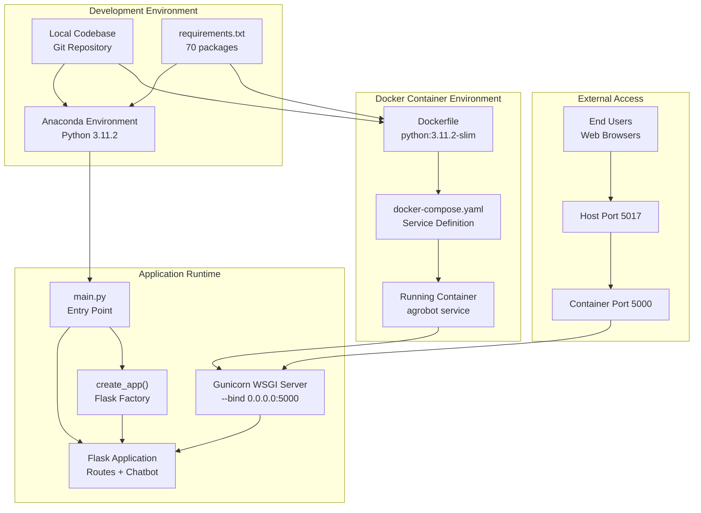
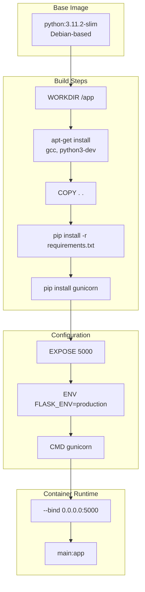
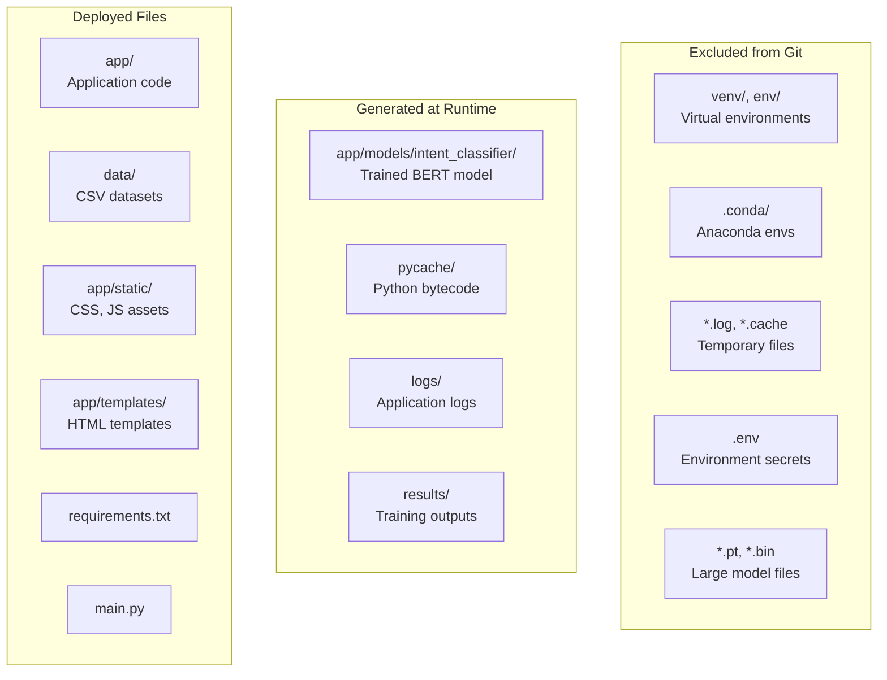
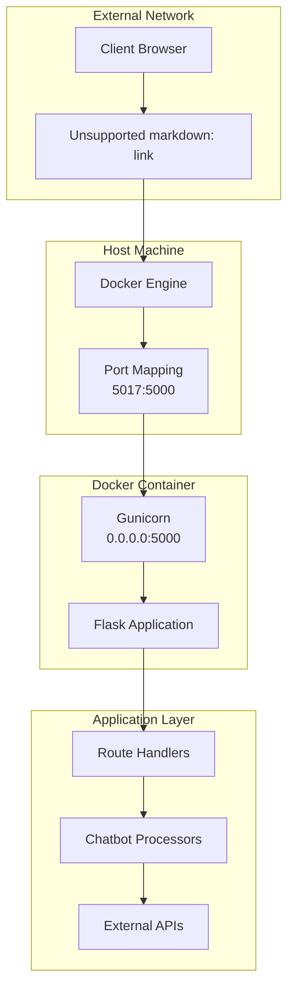

# Despliegue y operaciones

> **Archivos fuente relevantes**
> * [.gitignore](https://github.com/axchisan/ProyectoAgroBot/blob/bc782fcf/.gitignore)
> * [Archivo Docker](https://github.com/axchisan/ProyectoAgroBot/blob/bc782fcf/Dockerfile)
> * [docker-compose.yaml](https://github.com/axchisan/ProyectoAgroBot/blob/bc782fcf/docker-compose.yaml)
> * [principal.py](https://github.com/axchisan/ProyectoAgroBot/blob/bc782fcf/main.py)
> * [requisitos.txt](https://github.com/axchisan/ProyectoAgroBot/blob/bc782fcf/requirements.txt)

Este documento proporciona una guía completa para la implementación y el funcionamiento del sistema Agrobot en diversos entornos, desde el desarrollo local hasta la producción. Abarca la contenedorización de Docker, la configuración del entorno, la gestión de dependencias y las mejores prácticas operativas.

Para obtener información detallada sobre la configuración de contenedores e imágenes de Docker, consulte [Configuración de Docker](/axchisan/ProyectoAgroBot/9.1-docker-configuration) . Para la gestión de variables de entorno y la configuración de claves API, consulte [Variables de entorno](/axchisan/ProyectoAgroBot/9.2-environment-variables) . Para estrategias de implementación y supervisión específicas para producción, consulte [Implementación en producción](/axchisan/ProyectoAgroBot/9.3-production-deployment) .

## Propósito y alcance

Esta página documenta la arquitectura de implementación, los requisitos de configuración y los procedimientos operativos para ejecutar Agrobot. Abarca:

* Opciones de implementación (desarrollo local vs. contenedorización de Docker)
* Gestión de dependencias y requisitos del sistema
* Archivos de configuración y sus propósitos
* Mapeo de puertos y configuración de red
* Organización del sistema de archivos para la implementación
* Consideraciones operativas para entornos de producción

## Descripción general de la arquitectura de implementación

El sistema Agrobot admite dos modos de implementación principales: desarrollo local con Python directamente e implementación en contenedores con Docker. El siguiente diagrama ilustra el proceso de implementación completo:



**Fuentes:** [Dockerfile L1-L28](https://github.com/axchisan/ProyectoAgroBot/blob/bc782fcf/Dockerfile#L1-L28)

 [docker-compose.yaml L1-L14](https://github.com/axchisan/ProyectoAgroBot/blob/bc782fcf/docker-compose.yaml#L1-L14)

 [main.py L1-L6](https://github.com/axchisan/ProyectoAgroBot/blob/bc782fcf/main.py#L1-L6)

## Gestión de dependencias

Agrobot requiere 70 paquetes de Python especificados en [nombre del archivo] `requirements.txt`. La pila de dependencias está organizada en varias categorías funcionales:

| Categoría | Paquetes de claves | Objetivo |
| --- | --- | --- |
| **Marco web** | Matraz==3.1.1, Werkzeug==3.1.3, Jinja2==3.1.6 | Servidor de aplicaciones web y plantillas |
| **Aprendizaje automático** | antorcha==2.7.0, transformadores==4.52.3, acelerar==1.7.0 | Infraestructura de PyTorch y Hugging Face |
| **Núcleo de PNL** | tokenizadores==0.21.1, nltk==3.9.1, expresiones regulares==2024.11.6 | Procesamiento del lenguaje natural |
| **Proceso de datos** | pandas==2.2.3, numpy==2.2.6, scikit-learn==1.6.1 | Manipulación y análisis de datos |
| **NVIDIA CUDA** | nvidia-cuda-runtime-cu12, nvidia-cudnn-cu12, nvidia-cublas-cu12 | Aceleración de GPU (opcional) |
| **Visualización** | matplotlib==3.10.3, contourpy==1.3.2 | Generación de gráficos |
| **Configuración** | python-dotenv==1.0.1, PyYAML==6.0.2 | Gestión del entorno y la configuración |
| **Clientes HTTP** | solicitudes==2.32.3, urllib3==2.4.0 | Comunicación API externa |

### Dependencias de CUDA

El sistema incluye paquetes NVIDIA CUDA 12.x para la aceleración por GPU de los modelos de PyTorch. Estas dependencias son opcionales; el sistema se ejecutará en entornos de solo CPU, aunque la inferencia de modelos será más lenta.

**Fuentes:** [requirements.txt L1-L70](https://github.com/axchisan/ProyectoAgroBot/blob/bc782fcf/requirements.txt#L1-L70)

## Despliegue de desarrollo local

Para el desarrollo local, Agrobot se ejecuta directamente en el equipo host mediante Anaconda o entornos Python estándar. El punto de entrada es `main.py`:

```javascript
# main.py structure
from app import create_app

app = create_app()

if __name__ == "__main__":
    app.run(debug=True)
```

La `create_app()`función de fábrica inicializa la aplicación Flask, registra los planos y configura el sistema de chatbot. Al ejecutarse, `python main.py`se inicia el servidor de desarrollo de Flask con el modo de depuración habilitado.

### Development Server Configuration

| Configuration | Value | Description |
| --- | --- | --- |
| **Debug Mode** | `True` | Enables auto-reload and detailed error pages |
| **Host** | `127.0.0.1` (default) | Localhost only |
| **Port** | `5000` (default) | Standard Flask port |
| **Threaded** | `True` (default) | Multiple concurrent requests |
| **Reloader** | Enabled in debug | Auto-restarts on code changes |

**Sources:** [main.py L1-L6](https://github.com/axchisan/ProyectoAgroBot/blob/bc782fcf/main.py#L1-L6)

## Docker Containerization

The Dockerfile defines a production-ready container image based on `python:3.11.2-slim`. The build process follows a multi-stage pattern optimized for size and security:



### Dockerfile Structure

The [Dockerfile L1-L28](https://github.com/axchisan/ProyectoAgroBot/blob/bc782fcf/Dockerfile#L1-L28)

 implements the following build pattern:

1. **Base Image Selection** [Dockerfile L1](https://github.com/axchisan/ProyectoAgroBot/blob/bc782fcf/Dockerfile#L1-L1) : Uses `python:3.11.2-slim` for minimal footprint
2. **Working Directory** [Dockerfile L4](https://github.com/axchisan/ProyectoAgroBot/blob/bc782fcf/Dockerfile#L4-L4) : Sets `/app` as the container working directory
3. **System Dependencies** [Dockerfile L7-L10](https://github.com/axchisan/ProyectoAgroBot/blob/bc782fcf/Dockerfile#L7-L10) : Installs `gcc` and `python3-dev` for compiling Python packages
4. **Code Copy** [Dockerfile L13](https://github.com/axchisan/ProyectoAgroBot/blob/bc782fcf/Dockerfile#L13-L13) : Copies entire project directory to `/app`
5. **Python Dependencies** [Dockerfile L16](https://github.com/axchisan/ProyectoAgroBot/blob/bc782fcf/Dockerfile#L16-L16) : Installs packages from `requirements.txt` with `--no-cache-dir` flag
6. **WSGI Server** [Dockerfile L19](https://github.com/axchisan/ProyectoAgroBot/blob/bc782fcf/Dockerfile#L19-L19) : Installs `gunicorn` for production serving
7. **Port Exposure** [Dockerfile L22](https://github.com/axchisan/ProyectoAgroBot/blob/bc782fcf/Dockerfile#L22-L22) : Exposes port 5000 for HTTP traffic
8. **Environment Configuration** [Dockerfile L25](https://github.com/axchisan/ProyectoAgroBot/blob/bc782fcf/Dockerfile#L25-L25) : Sets `FLASK_ENV=production`
9. **Startup Command** [Dockerfile L28](https://github.com/axchisan/ProyectoAgroBot/blob/bc782fcf/Dockerfile#L28-L28) : Launches Gunicorn bound to all interfaces

**Sources:** [Dockerfile L1-L28](https://github.com/axchisan/ProyectoAgroBot/blob/bc782fcf/Dockerfile#L1-L28)

## Docker Compose Configuration

The `docker-compose.yaml` file defines a single-service deployment with volume mounting for development and port mapping for external access:

```yaml
version: '3.8'

services:
  agrobot:
    build:
      context: .
      dockerfile: Dockerfile
    ports:
      - "5017:5000"
    environment:
      - FLASK_ENV=production
    restart: unless-stopped
    volumes:
      - .:/app
```

### Service Configuration Details

| Parameter | Value | Purpose |
| --- | --- | --- |
| **Service Name** | `agrobot` | Docker Compose service identifier |
| **Build Context** | `.` (current directory) | Root directory for build |
| **Port Mapping** | `5017:5000` | Maps host port 5017 to container port 5000 |
| **Environment** | `FLASK_ENV=production` | Sets Flask to production mode |
| **Restart Policy** | `unless-stopped` | Auto-restart on failures |
| **Volume Mount** | `.:/app` | Mounts codebase for hot-reloading |

The volume mount enables development workflows where code changes are reflected without rebuilding the image. For production deployments, this volume mount should be removed to ensure immutability.

**Sources:** [docker-compose.yaml L1-L14](https://github.com/axchisan/ProyectoAgroBot/blob/bc782fcf/docker-compose.yaml#L1-L14)

## Gunicorn WSGI Server

In containerized deployments, Gunicorn replaces Flask's development server. The command specified in [Dockerfile L28](https://github.com/axchisan/ProyectoAgroBot/blob/bc782fcf/Dockerfile#L28-L28)

 is:

```
gunicorn --bind 0.0.0.0:5000 main:app
```

### Gunicorn Configuration

| Parameter | Value | Description |
| --- | --- | --- |
| **Bind Address** | `0.0.0.0:5000` | Listen on all network interfaces |
| **Application** | `main:app` | References the `app` object in `main.py` |
| **Workers** | 1 (default) | Number of worker processes |
| **Worker Class** | `sync` (default) | Synchronous workers |
| **Timeout** | 30 seconds (default) | Worker timeout for long requests |

For production deployments with higher traffic, additional Gunicorn options should be configured:

* `--workers N`: Set to `2 * CPU_cores + 1` for optimal performance
* `--worker-class gevent`: Use async workers for I/O-bound operations
* `--timeout 120`: Increase timeout for ML inference operations
* `--access-logfile -`: Enable access logging to stdout
* `--error-logfile -`: Enable error logging to stderr

**Sources:** [Dockerfile L28](https://github.com/axchisan/ProyectoAgroBot/blob/bc782fcf/Dockerfile#L28-L28)

## File System Organization

The deployment environment organizes files according to the following structure, with certain paths excluded from version control via `.gitignore`:



### Gitignore Configuration

The [.gitignore L1-L54](https://github.com/axchisan/ProyectoAgroBot/blob/bc782fcf/.gitignore#L1-L54)

 file excludes the following categories:

1. **Virtual Environments** [.gitignore L1-L24](https://github.com/axchisan/ProyectoAgroBot/blob/bc782fcf/.gitignore#L1-L24) : Python virtual environments (`venv/`, `env/`, `agrobot/`, Anaconda directories)
2. **Generated Files** [.gitignore L5-L18](https://github.com/axchisan/ProyectoAgroBot/blob/bc782fcf/.gitignore#L5-L18) : Bytecode (`__pycache__/`, `*.pyc`), logs, cache files
3. **Training Artifacts** [.gitignore L26-L30](https://github.com/axchisan/ProyectoAgroBot/blob/bc782fcf/.gitignore#L26-L30) : `results/` directory and `logs/` directory
4. **Trained Models** [.gitignore L32-L33](https://github.com/axchisan/ProyectoAgroBot/blob/bc782fcf/.gitignore#L32-L33) : `app/models/intent_classifier/` directory containing BERT model
5. **Secrets** [.gitignore L40](https://github.com/axchisan/ProyectoAgroBot/blob/bc782fcf/.gitignore#L40-L40) : `.env` file containing API keys
6. **Model Checkpoints** [.gitignore L52-L54](https://github.com/axchisan/ProyectoAgroBot/blob/bc782fcf/.gitignore#L52-L54) : `*.pt` and `*.bin` PyTorch model files

This configuration ensures that sensitive credentials, large binary files, and environment-specific artifacts are not committed to version control.

**Sources:** [.gitignore L1-L54](https://github.com/axchisan/ProyectoAgroBot/blob/bc782fcf/.gitignore#L1-L54)

## Network and Port Configuration

The system uses a multi-layer port mapping strategy to expose the application to external users:



### Port Configuration Table

| Layer | Port | Bind Address | Purpose |
| --- | --- | --- | --- |
| **Host** | 5017 | External interface | User-facing port for browser access |
| **Docker Mapping** | 5017 → 5000 | N/A | Port forwarding from host to container |
| **Container** | 5000 | 0.0.0.0 (all interfaces) | Gunicorn listener port |
| **Flask Dev** | 5000 (default) | 127.0.0.1 (localhost) | Development server port |

The choice of port 5017 on the host allows running multiple containerized applications without port conflicts, while the container internally uses the standard port 5000.

**Sources:** [docker-compose.yaml L8-L9](https://github.com/axchisan/ProyectoAgroBot/blob/bc782fcf/docker-compose.yaml#L8-L9)

 [Dockerfile L22](https://github.com/axchisan/ProyectoAgroBot/blob/bc782fcf/Dockerfile#L22-L22)

## Build and Deployment Commands

### Local Development

```sql
# Create Anaconda environment
conda create -n agrobot python=3.11.2

# Activate environment
conda activate agrobot

# Install dependencies
pip install -r requirements.txt

# Train intent classifier (required before first run)
python app/ml/train_intent_classifier.py

# Run development server
python main.py
```

### Docker Deployment

```yaml
# Build Docker image
docker build -t agrobot:latest .

# Run container directly
docker run -p 5017:5000 \
  -e FLASK_ENV=production \
  -v $(pwd):/app \
  agrobot:latest

# Using Docker Compose (recommended)
docker-compose up --build

# Run in detached mode
docker-compose up -d

# View logs
docker-compose logs -f

# Stop services
docker-compose down
```

### Container Management

```markdown
# List running containers
docker ps

# Execute commands in running container
docker-compose exec agrobot bash

# Inspect container logs
docker logs agrobot

# Restart service
docker-compose restart agrobot

# Rebuild without cache
docker-compose build --no-cache
```

**Sources:** [Dockerfile L1-L28](https://github.com/axchisan/ProyectoAgroBot/blob/bc782fcf/Dockerfile#L1-L28)

 [docker-compose.yaml L1-L14](https://github.com/axchisan/ProyectoAgroBot/blob/bc782fcf/docker-compose.yaml#L1-L14)

## Environment Variables and Configuration

While not explicitly defined in the provided files, Agrobot requires several environment variables for external service integration. These should be configured via a `.env` file (excluded from Git):

| Variable | Required | Purpose | Default |
| --- | --- | --- | --- |
| `OPENWEATHER_API_KEY` | Yes | OpenWeatherMap API authentication | None |
| `OPENAI_API_KEY` | Optional | OpenAI fallback responses | None |
| `FLASK_ENV` | No | Flask environment mode | `development` |
| `FLASK_DEBUG` | No | Debug mode toggle | `False` in production |
| `SECRET_KEY` | Yes | Flask session encryption | Must be set in production |

The `.env` file should be created at the project root and loaded by the application using `python-dotenv`:

```markdown
# Example .env file
OPENWEATHER_API_KEY=your_api_key_here
OPENAI_API_KEY=your_openai_key_here
FLASK_ENV=production
SECRET_KEY=random_secret_key_for_sessions
```

**Sources:** [requirements.txt L69](https://github.com/axchisan/ProyectoAgroBot/blob/bc782fcf/requirements.txt#L69-L69)

 [.gitignore L40](https://github.com/axchisan/ProyectoAgroBot/blob/bc782fcf/.gitignore#L40-L40)

 [docker-compose.yaml L10-L11](https://github.com/axchisan/ProyectoAgroBot/blob/bc782fcf/docker-compose.yaml#L10-L11)

## Pre-Deployment Checklist

Before deploying Agrobot to production, ensure the following prerequisites are met:

### Data Requirements

* CSV agricultural datasets present in `data/processed/`
* `questions.json` knowledge base loaded
* Department and municipal data available

### Model Requirements

* Intent classifier trained and saved to `app/models/intent_classifier/`
* `label_map.pkl` file present in model directory
* Model loading tested successfully

### Configuration Requirements

* `.env` file created with all required API keys
* `FLASK_ENV` set to `production`
* Secret key configured for session management

### Infrastructure Requirements

* Docker and Docker Compose installed (for containerized deployment)
* Port 5017 available on host machine (or alternative configured)
* Sufficient disk space for model files (~500MB for BERT model)
* Sufficient memory (minimum 2GB RAM, 4GB recommended)

### Security Requirements

* `.env` file excluded from version control
* API keys rotated and secured
* HTTPS/TLS configured if exposed to internet (outside scope of this deployment)

**Sources:** [.gitignore L32-L54](https://github.com/axchisan/ProyectoAgroBot/blob/bc782fcf/.gitignore#L32-L54)

 [docker-compose.yaml L1-L14](https://github.com/axchisan/ProyectoAgroBot/blob/bc782fcf/docker-compose.yaml#L1-L14)

## Resource Requirements

### Minimum System Requirements

| Component | Minimum | Recommended | Notes |
| --- | --- | --- | --- |
| **CPU** | 2 cores | 4+ cores | Model inference is CPU-intensive |
| **RAM** | 2 GB | 4-8 GB | BERT model requires ~1.5GB |
| **Disk Space** | 2 GB | 5+ GB | Includes model, dependencies, logs |
| **Python Version** | 3.11.2 | 3.11.2 | Versión exacta para mayor coherencia |
| **Estibador** | 20.10+ | Último estable | Para implementación en contenedores |

### Desglose del espacio en disco

* Imagen base de Python: ~150 MB
* Paquetes de Python: ~1,5 GB
* Modelo BERT: ~500 MB
* Conjuntos de datos agrícolas: ~50 MB
* Código de aplicación: ~10 MB
* Registros y caché: Variable

**Fuentes:** [Dockerfile L1](https://github.com/axchisan/ProyectoAgroBot/blob/bc782fcf/Dockerfile#L1-L1)

 [requirements.txt L1-L70](https://github.com/axchisan/ProyectoAgroBot/blob/bc782fcf/requirements.txt#L1-L70)

## Consideraciones operativas

### Políticas de reinicio

La configuración de Docker Compose especifica`restart: unless-stopped` [docker-compose.yaml L12](https://github.com/axchisan/ProyectoAgroBot/blob/bc782fcf/docker-compose.yaml#L12-L12)

lo que significa:

* El contenedor se reinicia automáticamente después de fallas
* El contenedor se reinicia después de reiniciar el sistema
* El contenedor no se reinicia si se detiene manualmente con`docker-compose stop`

Para entornos de producción, considere `restart: always`la máxima disponibilidad.

### Monitoreo de la salud

El sistema no incluye puntos finales de comprobación de estado integrados. Para implementaciones de producción, implemente:

1. **Punto final de salud de Flask** : agregue una `/health`ruta que devuelva 200 OK
2. **Comprobación del estado de Docker** : añadir `HEALTHCHECK`directiva a Dockerfile
3. **Monitoreo externo** : utilice herramientas como Prometheus, Grafana o monitoreo de proveedores de la nube

### Gestión de registros

Los registros se escriben en stdout/stderr y son capturados por Docker:

```markdown
# View real-time logs
docker-compose logs -f agrobot

# View last 100 lines
docker-compose logs --tail=100 agrobot

# Export logs to file
docker-compose logs > agrobot_logs.txt
```

**Fuentes:** [docker-compose.yaml L12](https://github.com/axchisan/ProyectoAgroBot/blob/bc782fcf/docker-compose.yaml#L12-L12)

## Solución de problemas comunes

### El contenedor no se inicia

**Síntoma** : El contenedor sale inmediatamente después de iniciarse

**Diagnóstico** :

```markdown
# Check container logs
docker-compose logs agrobot

# Check build logs
docker-compose build
```

**Causas comunes** :

* Dependencias faltantes en`requirements.txt`
* Errores de sintaxis de Python en `main.py`o`app/`
* Faltan archivos del modelo entrenado
* Puerto 5000 ya en uso dentro del contenedor

### Puerto ya en uso

**Síntoma** : Error al vincular el puerto 5017

**Solución** : Modificar la asignación de puertos en[docker-compose.yaml L9](https://github.com/axchisan/ProyectoAgroBot/blob/bc782fcf/docker-compose.yaml#L9-L9)

:

```yaml
ports:
  - "5018:5000"  # Use alternative host port
```

### Modelo no encontrado

**Síntoma** : `FileNotFoundError`para el modelo clasificador de intenciones

**Solución** : Entrene el modelo antes de la implementación:

```
python app/ml/train_intent_classifier.py
```

O copie el modelo pre-entrenado a`app/models/intent_classifier/`

### Sin memoria

**Síntoma** : Contenedor destruido por un asesino OOM

**Solución** : Aumentar el límite de memoria de Docker:

```yaml
# docker-compose.yaml
services:
  agrobot:
    mem_limit: 4g
```

**Fuentes:** [docker-compose.yaml L1-L14](https://github.com/axchisan/ProyectoAgroBot/blob/bc782fcf/docker-compose.yaml#L1-L14)

 [Dockerfile L1-L28](https://github.com/axchisan/ProyectoAgroBot/blob/bc782fcf/Dockerfile#L1-L28)