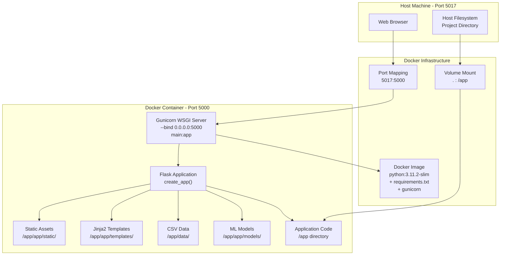
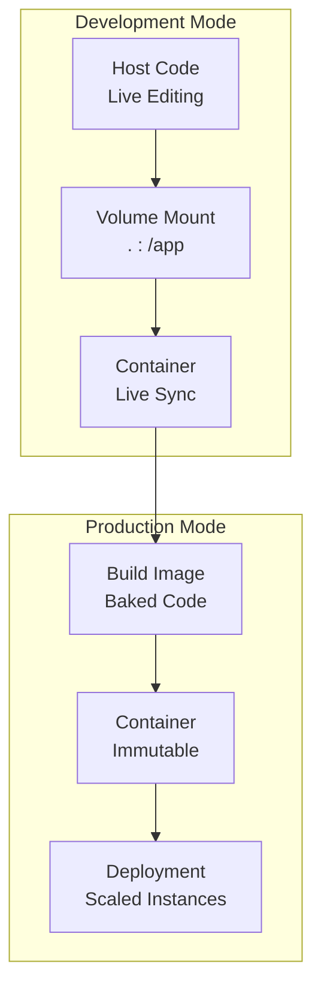
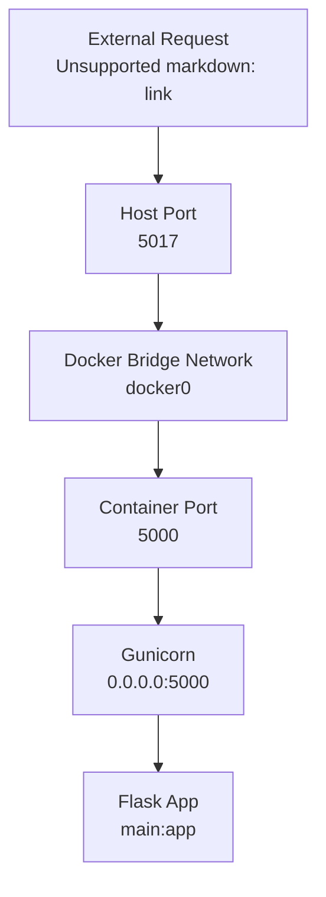

# Docker Configuration

> **Relevant source files**
> * [Dockerfile](https://github.com/axchisan/ProyectoAgroBot/blob/bc782fcf/Dockerfile)
> * [docker-compose.yaml](https://github.com/axchisan/ProyectoAgroBot/blob/bc782fcf/docker-compose.yaml)
> * [main.py](https://github.com/axchisan/ProyectoAgroBot/blob/bc782fcf/main.py)

## Purpose and Scope

This document explains the Docker containerization configuration for the Agrobot system. It covers the `Dockerfile` for image building, `docker-compose.yaml` for container orchestration, and the deployment architecture. For information about environment variables used in Docker, see [Environment Variables](/axchisan/ProyectoAgroBot/9.2-environment-variables). For production deployment best practices and Gunicorn configuration, see [Production Deployment](/axchisan/ProyectoAgroBot/9.3-production-deployment).

## Dockerfile Structure

The Agrobot Docker image is defined in the root `Dockerfile` and uses a multi-stage approach to create a production-ready container.

### Base Image

The image uses `python:3.11.2-slim` as the base [Dockerfile L1](https://github.com/axchisan/ProyectoAgroBot/blob/bc782fcf/Dockerfile#L1-L1)

 which provides Python 3.11.2 with a minimal Debian-based environment. This slim variant reduces image size while maintaining necessary functionality.

### System Dependencies

System-level dependencies are installed to support Python package compilation:

| Package | Purpose |
| --- | --- |
| `gcc` | C compiler for building native extensions |
| `python3-dev` | Python development headers |

These packages are required for installing ML/NLP dependencies like PyTorch and transformers. The package cache is removed after installation to reduce image size [Dockerfile L7-L10](https://github.com/axchisan/ProyectoAgroBot/blob/bc782fcf/Dockerfile#L7-L10)

### Application Setup

The build process follows these steps:

1. **Working Directory**: Set to `/app` [Dockerfile L4](https://github.com/axchisan/ProyectoAgroBot/blob/bc782fcf/Dockerfile#L4-L4)
2. **Copy Files**: All project files copied to the container [Dockerfile L13](https://github.com/axchisan/ProyectoAgroBot/blob/bc782fcf/Dockerfile#L13-L13)
3. **Python Dependencies**: Installed from `requirements.txt` using pip with `--no-cache-dir` flag [Dockerfile L16](https://github.com/axchisan/ProyectoAgroBot/blob/bc782fcf/Dockerfile#L16-L16)
4. **Production Server**: Gunicorn installed as the WSGI server [Dockerfile L19](https://github.com/axchisan/ProyectoAgroBot/blob/bc782fcf/Dockerfile#L19-L19)

### Runtime Configuration

The container is configured with the following runtime settings:

* **Port Exposure**: Port 5000 exposed for HTTP traffic [Dockerfile L22](https://github.com/axchisan/ProyectoAgroBot/blob/bc782fcf/Dockerfile#L22-L22)
* **Environment**: `FLASK_ENV=production` set for production mode [Dockerfile L25](https://github.com/axchisan/ProyectoAgroBot/blob/bc782fcf/Dockerfile#L25-L25)
* **Entry Point**: Gunicorn binds to `0.0.0.0:5000` serving the `main:app` application [Dockerfile L28](https://github.com/axchisan/ProyectoAgroBot/blob/bc782fcf/Dockerfile#L28-L28)

**Sources:** [Dockerfile L1-L28](https://github.com/axchisan/ProyectoAgroBot/blob/bc782fcf/Dockerfile#L1-L28)

## Container Build Process

```

```

**Docker Image Build Pipeline**: This diagram shows the sequential build steps defined in the Dockerfile, from base image selection through final entry point configuration.

**Sources:** [Dockerfile L1-L28](https://github.com/axchisan/ProyectoAgroBot/blob/bc782fcf/Dockerfile#L1-L28)

## Docker Compose Configuration

The `docker-compose.yaml` file provides container orchestration for the Agrobot service.

### Service Definition

The compose file defines a single service named `agrobot`:

```

```

The build context is set to the current directory, using the `Dockerfile` in the root [docker-compose.yaml L5-L7](https://github.com/axchisan/ProyectoAgroBot/blob/bc782fcf/docker-compose.yaml#L5-L7)

### Port Mapping

The container's internal port 5000 is mapped to host port 5017:

```yaml
ports:
  - "5017:5000"
```

This mapping allows external access to the Flask application at `http://localhost:5017` [docker-compose.yaml L8-L9](https://github.com/axchisan/ProyectoAgroBot/blob/bc782fcf/docker-compose.yaml#L8-L9)

### Environment Variables

The compose file sets `FLASK_ENV=production` to ensure the application runs in production mode [docker-compose.yaml L10-L11](https://github.com/axchisan/ProyectoAgroBot/blob/bc782fcf/docker-compose.yaml#L10-L11)

 Additional environment variables can be added here or loaded from a `.env` file (see [Environment Variables](/axchisan/ProyectoAgroBot/9.2-environment-variables)).

### Volume Mounts

A volume mount binds the current directory to `/app` in the container:

```

```

This enables:

* **Development Mode**: Code changes on the host are immediately reflected in the container
* **Hot Reloading**: Flask can reload the application when files change
* **Data Persistence**: Model files and data remain accessible between container restarts

[docker-compose.yaml L13-L14](https://github.com/axchisan/ProyectoAgroBot/blob/bc782fcf/docker-compose.yaml#L13-L14)

### Restart Policy

The service is configured with `restart: unless-stopped`, ensuring the container automatically restarts if it crashes but does not restart if manually stopped [docker-compose.yaml L12](https://github.com/axchisan/ProyectoAgroBot/blob/bc782fcf/docker-compose.yaml#L12-L12)

**Sources:** [docker-compose.yaml L1-L14](https://github.com/axchisan/ProyectoAgroBot/blob/bc782fcf/docker-compose.yaml#L1-L14)

## Building and Running Containers

### Building the Image

To build the Docker image:

```

```

This command:

1. Reads `docker-compose.yaml`
2. Executes the Dockerfile build process
3. Tags the resulting image as `agrobot_agrobot`

### Running the Container

To start the Agrobot service:

```

```

For detached mode (background execution):

```

```

The application becomes accessible at `http://localhost:5017`.

### Stopping the Container

To stop the running service:

```

```

### Viewing Logs

To monitor container logs:

```

```

**Sources:** [docker-compose.yaml L1-L14](https://github.com/axchisan/ProyectoAgroBot/blob/bc782fcf/docker-compose.yaml#L1-L14)

## Container Runtime Architecture



**Container Runtime Architecture**: This diagram illustrates how the Docker container interfaces with the host system, showing port mapping (5017:5000), volume mounts for code synchronization, and the internal application structure served by Gunicorn.

**Sources:** [Dockerfile L1-L28](https://github.com/axchisan/ProyectoAgroBot/blob/bc782fcf/Dockerfile#L1-L28)

 [docker-compose.yaml L1-L14](https://github.com/axchisan/ProyectoAgroBot/blob/bc782fcf/docker-compose.yaml#L1-L14)

 [main.py L1-L6](https://github.com/axchisan/ProyectoAgroBot/blob/bc782fcf/main.py#L1-L6)

## Development vs Production Configuration

The Docker setup supports both development and production workflows:

| Aspect | Development | Production |
| --- | --- | --- |
| **Volume Mount** | Enabled (`.:/app`) | Optional (can be disabled) |
| **Hot Reload** | Enabled via Flask | Disabled (Gunicorn workers) |
| **Environment** | `FLASK_ENV=production`* | `FLASK_ENV=production` |
| **Entry Point** | Gunicorn | Gunicorn |
| **Port Access** | `localhost:5017` | `localhost:5017` or via proxy |
| **Log Level** | Debug via compose logs | Configured in Gunicorn |

* Note: Even in development, the Docker compose file sets production mode. For full development mode, run Flask directly on the host using `python main.py` (see [Running the Application](/axchisan/ProyectoAgroBot/2.3-running-the-application)).

### Development Workflow

For development with Docker:

1. Start the container: `docker-compose up`
2. Edit files on the host machine
3. Changes sync to container via volume mount
4. Restart container if needed: `docker-compose restart`

### Production Considerations

For production deployment:

* Remove or disable volume mounts to use baked-in code
* Configure Gunicorn workers and threads (see [Production Deployment](/axchisan/ProyectoAgroBot/9.3-production-deployment))
* Set appropriate environment variables (see [Environment Variables](/axchisan/ProyectoAgroBot/9.2-environment-variables))
* Use a reverse proxy (nginx) in front of Gunicorn
* Implement proper logging and monitoring



**Development vs Production Modes**: This diagram contrasts the development workflow with live code synchronization against the production deployment with immutable, baked-in code.

**Sources:** [docker-compose.yaml L1-L14](https://github.com/axchisan/ProyectoAgroBot/blob/bc782fcf/docker-compose.yaml#L1-L14)

 [Dockerfile L1-L28](https://github.com/axchisan/ProyectoAgroBot/blob/bc782fcf/Dockerfile#L1-L28)

## Gunicorn WSGI Server Configuration

The container uses Gunicorn as the production WSGI server [Dockerfile L28](https://github.com/axchisan/ProyectoAgroBot/blob/bc782fcf/Dockerfile#L28-L28)

:

```
gunicorn --bind 0.0.0.0:5000 main:app
```

### Command Breakdown

| Component | Purpose |
| --- | --- |
| `--bind 0.0.0.0:5000` | Bind to all interfaces on port 5000 |
| `main:app` | Load `app` object from `main.py` module |

The `main.py` file creates the Flask application instance using `create_app()` from the `app` package [main.py L1-L3](https://github.com/axchisan/ProyectoAgroBot/blob/bc782fcf/main.py#L1-L3)

### Default Configuration

Gunicorn uses default settings:

* **Workers**: 1 (single worker process)
* **Worker Class**: `sync` (synchronous workers)
* **Timeout**: 30 seconds
* **Keep-Alive**: 2 seconds

For production tuning, see [Production Deployment](/axchisan/ProyectoAgroBot/9.3-production-deployment) for recommended Gunicorn configurations based on workload.

**Sources:** [Dockerfile L28](https://github.com/axchisan/ProyectoAgroBot/blob/bc782fcf/Dockerfile#L28-L28)

 [main.py L1-L6](https://github.com/axchisan/ProyectoAgroBot/blob/bc782fcf/main.py#L1-L6)

## Image Size Optimization

The Docker configuration includes several optimizations to reduce image size:

1. **Slim Base Image**: Uses `python:3.11.2-slim` instead of full Python image [Dockerfile L1](https://github.com/axchisan/ProyectoAgroBot/blob/bc782fcf/Dockerfile#L1-L1)
2. **No Cache**: `--no-cache-dir` flag prevents pip from caching packages [Dockerfile L16](https://github.com/axchisan/ProyectoAgroBot/blob/bc782fcf/Dockerfile#L16-L16)
3. **Cleanup**: APT cache removed after system package installation [Dockerfile L10](https://github.com/axchisan/ProyectoAgroBot/blob/bc782fcf/Dockerfile#L10-L10)
4. **Minimal Dependencies**: Only required packages installed from `requirements.txt`

### Typical Image Sizes

| Component | Approximate Size |
| --- | --- |
| Base Python slim image | ~120 MB |
| System dependencies | ~50 MB |
| Python packages | ~1.5 GB (PyTorch, transformers) |
| Application code | ~10 MB |
| **Total** | **~1.7 GB** |

The large size is primarily due to ML/NLP dependencies (PyTorch, transformers, BERT models). Further optimization would require multi-stage builds or pre-trained model caching strategies.

**Sources:** [Dockerfile L1-L28](https://github.com/axchisan/ProyectoAgroBot/blob/bc782fcf/Dockerfile#L1-L28)

## Container Networking

The Docker container uses bridge networking by default, with port forwarding configured in the compose file.

### Network Flow



**Network Flow**: This diagram shows how external HTTP requests flow through Docker's port mapping into the Gunicorn server running inside the container.

**Sources:** [docker-compose.yaml L8-L9](https://github.com/axchisan/ProyectoAgroBot/blob/bc782fcf/docker-compose.yaml#L8-L9)

 [Dockerfile L22-L28](https://github.com/axchisan/ProyectoAgroBot/blob/bc782fcf/Dockerfile#L22-L28)

## Troubleshooting

### Common Issues

**Port Already in Use**

```

```

**Permission Denied on Volume Mount**

```

```

**Application Not Starting**

```

```

**Large Image Build Time**

```

```

**Sources:** [docker-compose.yaml L1-L14](https://github.com/axchisan/ProyectoAgroBot/blob/bc782fcf/docker-compose.yaml#L1-L14)

 [Dockerfile L1-L28](https://github.com/axchisan/ProyectoAgroBot/blob/bc782fcf/Dockerfile#L1-L28)