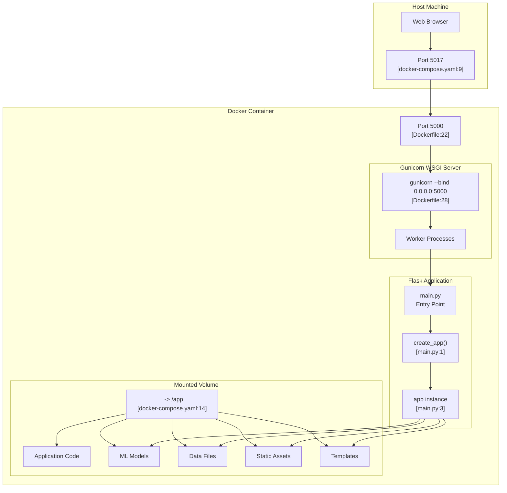

# Docker Deployment

> **Relevant source files**
> * [Dockerfile](https://github.com/axchisan/ProyectoAgroBot/blob/bc782fcf/Dockerfile)
> * [docker-compose.yaml](https://github.com/axchisan/ProyectoAgroBot/blob/bc782fcf/docker-compose.yaml)
> * [main.py](https://github.com/axchisan/ProyectoAgroBot/blob/bc782fcf/main.py)

## Purpose and Scope

This document explains how to deploy the Agrobot application using Docker and Docker Compose. Docker containerization provides a consistent, production-ready deployment environment with all dependencies packaged together. This approach eliminates environment-specific issues and simplifies deployment across different servers.

For local development without Docker, see [Installation and Setup](/axchisan/ProyectoAgroBot/2.1-installation-and-setup). For information about running the application in development mode, see [Running the Application](/axchisan/ProyectoAgroBot/2.3-running-the-application). For production deployment best practices and environment configuration, see [Production Deployment](/axchisan/ProyectoAgroBot/9.3-production-deployment).

## Docker Configuration Files

The Agrobot project includes two Docker configuration files that define the container image and orchestration:

### Dockerfile

The `Dockerfile` defines the container image using a multi-stage build process. It uses `python:3.11.2-slim` as the base image to minimize container size while maintaining compatibility with the development environment.

**Base Image and Working Directory**

[Dockerfile L1-L4](https://github.com/axchisan/ProyectoAgroBot/blob/bc782fcf/Dockerfile#L1-L4)

 establishes the Python 3.11.2 slim base image and sets `/app` as the working directory for all subsequent operations.

**System Dependencies**

[Dockerfile L6-L10](https://github.com/axchisan/ProyectoAgroBot/blob/bc782fcf/Dockerfile#L6-L10)

 installs essential system packages:

* `gcc` - Required for compiling Python packages with C extensions
* `python3-dev` - Python development headers needed for building certain dependencies

The apt cache is cleaned immediately after installation to reduce image size.

**Application Files and Python Dependencies**

[Dockerfile L12-L19](https://github.com/axchisan/ProyectoAgroBot/blob/bc782fcf/Dockerfile#L12-L19)

 copies the entire project directory into the container and installs all Python dependencies from `requirements.txt`. The `gunicorn` WSGI server is installed separately as the production application server.

**Container Configuration**

[Dockerfile L21-L28](https://github.com/axchisan/ProyectoAgroBot/blob/bc782fcf/Dockerfile#L21-L28)

 configures the container runtime:

* Exposes port 5000 for HTTP traffic
* Sets `FLASK_ENV=production` environment variable
* Defines the startup command: `gunicorn --bind 0.0.0.0:5000 main:app`

The Gunicorn command binds to all network interfaces (`0.0.0.0`) on port 5000 and loads the Flask application from [main.py L1-L6](https://github.com/axchisan/ProyectoAgroBot/blob/bc782fcf/main.py#L1-L6)

**Sources:** [Dockerfile L1-L28](https://github.com/axchisan/ProyectoAgroBot/blob/bc782fcf/Dockerfile#L1-L28)

 [main.py L1-L6](https://github.com/axchisan/ProyectoAgroBot/blob/bc782fcf/main.py#L1-L6)

### docker-compose.yaml

The `docker-compose.yaml` file orchestrates the Agrobot service, defining how the container should be built and run.

[docker-compose.yaml L1-L14](https://github.com/axchisan/ProyectoAgroBot/blob/bc782fcf/docker-compose.yaml#L1-L14)

 defines a single service named `agrobot` with the following configuration:

| Configuration | Value | Purpose |
| --- | --- | --- |
| **build.context** | `.` | Uses current directory as build context |
| **build.dockerfile** | `Dockerfile` | Specifies which Dockerfile to use |
| **ports** | `5017:5000` | Maps host port 5017 to container port 5000 |
| **environment** | `FLASK_ENV=production` | Sets Flask to production mode |
| **restart** | `unless-stopped` | Automatically restarts on failure |
| **volumes** | `.:/app` | Mounts project directory for live updates |

The volume mount [docker-compose.yaml L13-L14](https://github.com/axchisan/ProyectoAgroBot/blob/bc782fcf/docker-compose.yaml#L13-L14)

 enables hot-reloading during development, allowing code changes to be reflected without rebuilding the image.

**Sources:** [docker-compose.yaml L1-L14](https://github.com/axchisan/ProyectoAgroBot/blob/bc782fcf/docker-compose.yaml#L1-L14)

## Building and Running

### Building the Docker Image

To build the Docker image, navigate to the project root directory (where `Dockerfile` is located) and execute:

```

```

This command:

1. Reads the build configuration from [docker-compose.yaml L5-L7](https://github.com/axchisan/ProyectoAgroBot/blob/bc782fcf/docker-compose.yaml#L5-L7)
2. Executes each instruction in the [Dockerfile L1-L28](https://github.com/axchisan/ProyectoAgroBot/blob/bc782fcf/Dockerfile#L1-L28)
3. Installs system dependencies [Dockerfile L7-L9](https://github.com/axchisan/ProyectoAgroBot/blob/bc782fcf/Dockerfile#L7-L9)
4. Installs Python packages from `requirements.txt` [Dockerfile L16](https://github.com/axchisan/ProyectoAgroBot/blob/bc782fcf/Dockerfile#L16-L16)
5. Installs Gunicorn WSGI server [Dockerfile L19](https://github.com/axchisan/ProyectoAgroBot/blob/bc782fcf/Dockerfile#L19-L19)
6. Tags the resulting image for the `agrobot` service

The build process typically takes 5-10 minutes on the first run, depending on network speed and system resources.

### Running with Docker Compose

To start the Agrobot application:

```

```

Add the `-d` flag to run in detached mode (background):

```

```

The application will be accessible at `http://localhost:5017` as specified by the port mapping in [docker-compose.yaml L8-L9](https://github.com/axchisan/ProyectoAgroBot/blob/bc782fcf/docker-compose.yaml#L8-L9)

To view logs from the running container:

```

```

### Stopping and Cleanup

To stop the running containers:

```

```

To stop and remove all volumes (this will not affect the mounted project directory):

```

```

To rebuild the image from scratch (useful after dependency changes):

```

```

**Sources:** [docker-compose.yaml L1-L14](https://github.com/axchisan/ProyectoAgroBot/blob/bc782fcf/docker-compose.yaml#L1-L14)

 [Dockerfile L1-L28](https://github.com/axchisan/ProyectoAgroBot/blob/bc782fcf/Dockerfile#L1-L28)

## Container Architecture

The following diagram illustrates the Docker container's internal structure and how it maps to the Dockerfile instructions:

**Diagram: Docker Container Layer Architecture**

```

```

Each layer is cached by Docker, enabling fast rebuilds when only later layers change. The system dependencies layer [Dockerfile L6-L10](https://github.com/axchisan/ProyectoAgroBot/blob/bc782fcf/Dockerfile#L6-L10)

 changes infrequently, while the application layer [Dockerfile L12-L19](https://github.com/axchisan/ProyectoAgroBot/blob/bc782fcf/Dockerfile#L12-L19)

 rebuilds whenever code or dependencies change.

**Sources:** [Dockerfile L1-L28](https://github.com/axchisan/ProyectoAgroBot/blob/bc782fcf/Dockerfile#L1-L28)

## Runtime Architecture

The following diagram shows the runtime structure when the container is running:

**Diagram: Docker Container Runtime Components**



The container runs Gunicorn [Dockerfile L28](https://github.com/axchisan/ProyectoAgroBot/blob/bc782fcf/Dockerfile#L28-L28)

 as the primary process, which manages worker processes that handle HTTP requests. The Flask application is imported from [main.py L3](https://github.com/axchisan/ProyectoAgroBot/blob/bc782fcf/main.py#L3-L3)

 which instantiates the app using the factory pattern from `app/__init__.py`.

**Sources:** [Dockerfile L22-L28](https://github.com/axchisan/ProyectoAgroBot/blob/bc782fcf/Dockerfile#L22-L28)

 [docker-compose.yaml L8-L14](https://github.com/axchisan/ProyectoAgroBot/blob/bc782fcf/docker-compose.yaml#L8-L14)

 [main.py L1-L6](https://github.com/axchisan/ProyectoAgroBot/blob/bc782fcf/main.py#L1-L6)

## Port Mapping and Networking

The Docker configuration implements a port mapping strategy for external access:

| Port | Location | Configuration | Purpose |
| --- | --- | --- | --- |
| **5000** | Container Internal | [Dockerfile L22](https://github.com/axchisan/ProyectoAgroBot/blob/bc782fcf/Dockerfile#L22-L22) | Gunicorn binds to this port inside container |
| **5000** | Container Exposed | [docker-compose.yaml L9](https://github.com/axchisan/ProyectoAgroBot/blob/bc782fcf/docker-compose.yaml#L9-L9) | Docker exposes this port from container |
| **5017** | Host Machine | [docker-compose.yaml L9](https://github.com/axchisan/ProyectoAgroBot/blob/bc782fcf/docker-compose.yaml#L9-L9) | External access point on host |

The port mapping `5017:5000` in [docker-compose.yaml L9](https://github.com/axchisan/ProyectoAgroBot/blob/bc782fcf/docker-compose.yaml#L9-L9)

 means:

* Requests to `http://localhost:5017` on the host are forwarded to port 5000 in the container
* The Gunicorn server listening on `0.0.0.0:5000` [Dockerfile L28](https://github.com/axchisan/ProyectoAgroBot/blob/bc782fcf/Dockerfile#L28-L28)  receives these requests
* Responses flow back through the same port mapping

This configuration allows multiple containerized applications to run on the same host without port conflicts, as each can expose a different host port (5017, 5018, etc.) while all using port 5000 internally.

**Sources:** [Dockerfile L22](https://github.com/axchisan/ProyectoAgroBot/blob/bc782fcf/Dockerfile#L22-L22)

 [docker-compose.yaml L8-L9](https://github.com/axchisan/ProyectoAgroBot/blob/bc782fcf/docker-compose.yaml#L8-L9)

## Volume Mounting

The volume mount configuration [docker-compose.yaml L13-L14](https://github.com/axchisan/ProyectoAgroBot/blob/bc782fcf/docker-compose.yaml#L13-L14)

 creates a bidirectional binding between the host filesystem and container:

```

```

This mount has the following characteristics:

**Development Benefits**

* Code changes on the host are immediately visible in the container
* No need to rebuild the image for code modifications
* Logs and generated files are accessible on the host
* ML model training outputs persist on the host

**Container Access**

* The container's `/app` directory (set as WORKDIR in [Dockerfile L4](https://github.com/axchisan/ProyectoAgroBot/blob/bc782fcf/Dockerfile#L4-L4) ) mirrors the project root
* All application code, data files, and templates are available at runtime
* The volume takes precedence over files copied during image build [Dockerfile L13](https://github.com/axchisan/ProyectoAgroBot/blob/bc782fcf/Dockerfile#L13-L13)

**Caveats**

* Dependency changes in `requirements.txt` still require image rebuild
* Volume mounts slightly reduce I/O performance compared to container-local storage
* For production, consider using named volumes or removing the mount for better isolation

**Sources:** [docker-compose.yaml L13-L14](https://github.com/axchisan/ProyectoAgroBot/blob/bc782fcf/docker-compose.yaml#L13-L14)

 [Dockerfile L4](https://github.com/axchisan/ProyectoAgroBot/blob/bc782fcf/Dockerfile#L4-L4)

 [Dockerfile L13](https://github.com/axchisan/ProyectoAgroBot/blob/bc782fcf/Dockerfile#L13-L13)

## Environment Variables

The Docker configuration sets environment variables at both build and runtime:

**Build-Time Environment Variables**

[Dockerfile L25](https://github.com/axchisan/ProyectoAgroBot/blob/bc782fcf/Dockerfile#L25-L25)

 sets:

```

```

This configures Flask to run in production mode, which:

* Disables the interactive debugger
* Disables automatic reloading
* Uses optimized settings for performance

**Runtime Environment Variables**

[docker-compose.yaml L10-L11](https://github.com/axchisan/ProyectoAgroBot/blob/bc782fcf/docker-compose.yaml#L10-L11)

 reinforces the production environment:

```

```

**Additional Required Variables**

The application requires API keys that should be provided at runtime. These are not included in the Docker configuration files for security reasons. To provide them, create a `.env` file in the project root:

```

```

Then modify [docker-compose.yaml L10-L11](https://github.com/axchisan/ProyectoAgroBot/blob/bc782fcf/docker-compose.yaml#L10-L11)

 to include:

```

```

For comprehensive environment variable documentation, see [Environment Variables](/axchisan/ProyectoAgroBot/9.2-environment-variables).

**Sources:** [Dockerfile L25](https://github.com/axchisan/ProyectoAgroBot/blob/bc782fcf/Dockerfile#L25-L25)

 [docker-compose.yaml L10-L11](https://github.com/axchisan/ProyectoAgroBot/blob/bc782fcf/docker-compose.yaml#L10-L11)

## Production Considerations

When deploying Agrobot using Docker in production environments, consider the following modifications:

**Remove Volume Mount**

The volume mount [docker-compose.yaml L13-L14](https://github.com/axchisan/ProyectoAgroBot/blob/bc782fcf/docker-compose.yaml#L13-L14)

 is useful for development but should be removed in production. Instead, rely on the files copied during image build [Dockerfile L13](https://github.com/axchisan/ProyectoAgroBot/blob/bc782fcf/Dockerfile#L13-L13)

**Gunicorn Worker Configuration**

The default Gunicorn command [Dockerfile L28](https://github.com/axchisan/ProyectoAgroBot/blob/bc782fcf/Dockerfile#L28-L28)

 uses a single worker. For production, specify more workers:

```

```

The number of workers should be `(2 × CPU_cores) + 1` for optimal performance.

**Container Restart Policy**

The `unless-stopped` restart policy [docker-compose.yaml L12](https://github.com/axchisan/ProyectoAgroBot/blob/bc782fcf/docker-compose.yaml#L12-L12)

 ensures the container restarts after failures but not after manual stops. For production, consider `always` or integrate with an orchestration platform like Kubernetes.

**Resource Limits**

Add resource constraints to prevent container resource exhaustion:

```

```

**Security Considerations**

* Run the container as a non-root user
* Use Docker secrets for API keys instead of environment variables
* Scan the image for vulnerabilities using `docker scan`
* Keep the base image updated to receive security patches

For detailed production deployment guidance, including Gunicorn configuration, monitoring, and scaling strategies, see [Production Deployment](/axchisan/ProyectoAgroBot/9.3-production-deployment).

**Sources:** [docker-compose.yaml L1-L14](https://github.com/axchisan/ProyectoAgroBot/blob/bc782fcf/docker-compose.yaml#L1-L14)

 [Dockerfile L28](https://github.com/axchisan/ProyectoAgroBot/blob/bc782fcf/Dockerfile#L28-L28)

## Quick Reference Commands

| Command | Purpose |
| --- | --- |
| `docker-compose build` | Build the Docker image |
| `docker-compose up` | Start the container (foreground) |
| `docker-compose up -d` | Start the container (background) |
| `docker-compose down` | Stop and remove the container |
| `docker-compose logs -f agrobot` | View container logs |
| `docker-compose restart` | Restart the container |
| `docker-compose exec agrobot bash` | Open shell in running container |
| `docker-compose build --no-cache` | Rebuild without using cache |

**Sources:** [docker-compose.yaml L1-L14](https://github.com/axchisan/ProyectoAgroBot/blob/bc782fcf/docker-compose.yaml#L1-L14)