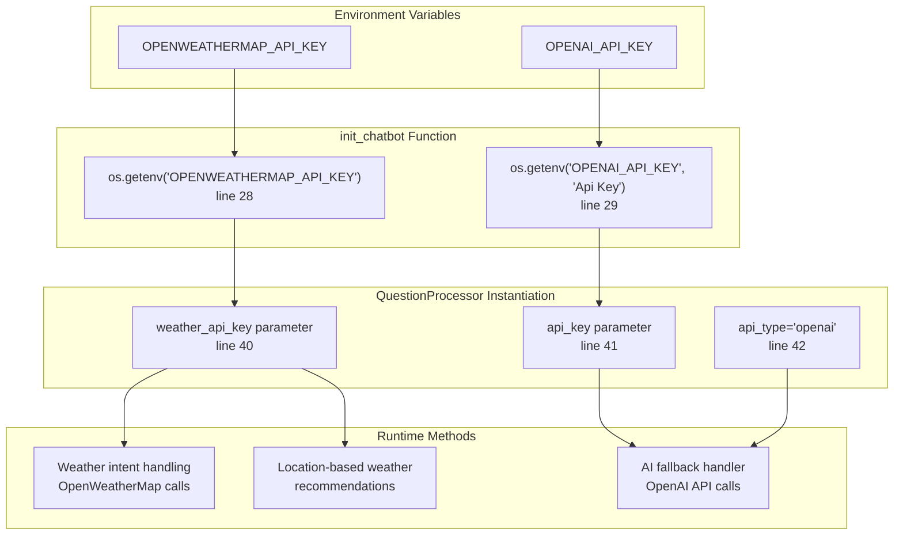
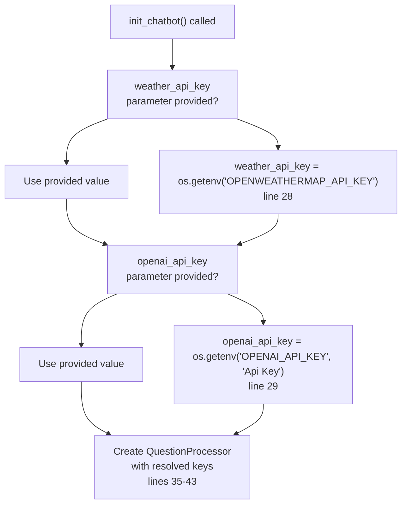

# Environment Variables

> **Relevant source files**
> * [.gitignore](https://github.com/axchisan/ProyectoAgroBot/blob/bc782fcf/.gitignore)
> * [app/chatbot/__init__.py](https://github.com/axchisan/ProyectoAgroBot/blob/bc782fcf/app/chatbot/__init__.py)
> * [requirements.txt](https://github.com/axchisan/ProyectoAgroBot/blob/bc782fcf/requirements.txt)

## Purpose and Scope

This document describes all environment variables required and used by the Agrobot system. Environment variables provide runtime configuration for external service integrations, API credentials, and deployment settings. This includes configuration for weather services, AI capabilities, and application behavior.

For information about the broader deployment configuration, see [Docker Configuration](/axchisan/ProyectoAgroBot/9.1-docker-configuration). For production deployment practices, see [Production Deployment](/axchisan/ProyectoAgroBot/9.3-production-deployment).

---

## Overview

The Agrobot system uses environment variables to manage sensitive credentials and runtime configuration without hardcoding values in the source code. The primary use cases are:

* **External API Authentication**: API keys for OpenWeatherMap, OpenAI, and Nominatim services
* **Application Configuration**: Flask settings and deployment parameters
* **Security Management**: Keeping sensitive credentials out of version control

The system loads environment variables using the `python-dotenv` library, which reads from a `.env` file in the project root during development.

**Sources:** [app/chatbot/__init__.py L1-L44](https://github.com/axchisan/ProyectoAgroBot/blob/bc782fcf/app/chatbot/__init__.py#L1-L44)

 [requirements.txt L69](https://github.com/axchisan/ProyectoAgroBot/blob/bc782fcf/requirements.txt#L69-L69)

 [.gitignore L40](https://github.com/axchisan/ProyectoAgroBot/blob/bc782fcf/.gitignore#L40-L40)

---

## Environment Variable Loading Flow

```

```

**Sources:** [app/chatbot/__init__.py L27-L29](https://github.com/axchisan/ProyectoAgroBot/blob/bc782fcf/app/chatbot/__init__.py#L27-L29)

 [requirements.txt L69](https://github.com/axchisan/ProyectoAgroBot/blob/bc782fcf/requirements.txt#L69-L69)

---

## Required Environment Variables

The following environment variables must be configured for full system functionality:

| Variable Name | Purpose | Used By | Default Value | Required |
| --- | --- | --- | --- | --- |
| `OPENWEATHERMAP_API_KEY` | API key for OpenWeatherMap service | Weather queries, forecasts | None | Yes (for weather) |
| `OPENAI_API_KEY` | API key for OpenAI GPT service | Fallback responses for complex queries | `"Api Key"` | No (has fallback) |

**Sources:** [app/chatbot/__init__.py L28-L29](https://github.com/axchisan/ProyectoAgroBot/blob/bc782fcf/app/chatbot/__init__.py#L28-L29)

---

## Variable Details

### OPENWEATHERMAP_API_KEY

**Purpose**: Authenticates requests to the OpenWeatherMap API for retrieving current weather conditions, forecasts, and agricultural weather advisories.

**Format**: String (32-character hexadecimal key)

**Example**: `a1b2c3d4e5f6g7h8i9j0k1l2m3n4o5p6`

**Code Usage**:

* Loaded in [app/chatbot/__init__.py L28](https://github.com/axchisan/ProyectoAgroBot/blob/bc782fcf/app/chatbot/__init__.py#L28-L28)
* Passed to `QuestionProcessor` as `weather_api_key` parameter [app/chatbot/__init__.py L40](https://github.com/axchisan/ProyectoAgroBot/blob/bc782fcf/app/chatbot/__init__.py#L40-L40)
* Used for weather-related intents in the chatbot

**Obtaining**: Register at [openweathermap.org/api](https://openweathermap.org/api) to obtain a free or paid API key.

**Sources:** [app/chatbot/__init__.py L28-L40](https://github.com/axchisan/ProyectoAgroBot/blob/bc782fcf/app/chatbot/__init__.py#L28-L40)

---

### OPENAI_API_KEY

**Purpose**: Authenticates requests to OpenAI's API for generating responses to complex agricultural queries that don't match predefined patterns.

**Format**: String (starts with `sk-`)

**Example**: `sk-proj-abcdefghijklmnopqrstuvwxyz123456789`

**Code Usage**:

* Loaded in [app/chatbot/__init__.py L29](https://github.com/axchisan/ProyectoAgroBot/blob/bc782fcf/app/chatbot/__init__.py#L29-L29)  with default value `"Api Key"`
* Passed to `QuestionProcessor` as `api_key` parameter [app/chatbot/__init__.py L41](https://github.com/axchisan/ProyectoAgroBot/blob/bc782fcf/app/chatbot/__init__.py#L41-L41)
* Used when no pattern match is found for user queries

**Default Behavior**: If not set, the system uses the default value `"Api Key"`, which will cause API calls to fail. The chatbot will still function for predefined questions but cannot handle complex fallback scenarios.

**Obtaining**: Register at [platform.openai.com](https://platform.openai.com) and generate an API key from the dashboard.

**Sources:** [app/chatbot/__init__.py L29-L41](https://github.com/axchisan/ProyectoAgroBot/blob/bc782fcf/app/chatbot/__init__.py#L29-L41)

---

## Environment Variable Consumption Map



**Sources:** [app/chatbot/__init__.py L28-L42](https://github.com/axchisan/ProyectoAgroBot/blob/bc782fcf/app/chatbot/__init__.py#L28-L42)

---

## Setting Up Environment Variables

### Development Setup (.env file)

For local development, create a `.env` file in the project root directory:

```
OPENWEATHERMAP_API_KEY=your_openweathermap_api_key_here
OPENAI_API_KEY=your_openai_api_key_here
```

The `.env` file is automatically loaded by the `python-dotenv` library when the application starts. This file is excluded from version control via [.gitignore L40](https://github.com/axchisan/ProyectoAgroBot/blob/bc782fcf/.gitignore#L40-L40)

**Important**: Never commit the `.env` file to version control. It contains sensitive credentials.

**Sources:** [.gitignore L40](https://github.com/axchisan/ProyectoAgroBot/blob/bc782fcf/.gitignore#L40-L40)

 [requirements.txt L69](https://github.com/axchisan/ProyectoAgroBot/blob/bc782fcf/requirements.txt#L69-L69)

---

### Production Setup (System Environment)

For Docker and production deployments, set environment variables through the container runtime:

**Docker Compose** (`docker-compose.yml`):

```

```

**Docker Run**:

```

```

**System Environment** (Linux/Mac):

```

```

**Sources:** [app/chatbot/__init__.py L28-L29](https://github.com/axchisan/ProyectoAgroBot/blob/bc782fcf/app/chatbot/__init__.py#L28-L29)

---

## Initialization Logic

The `init_chatbot` function implements the following priority for loading API keys:

1. **Function Parameters**: If explicitly passed to `init_chatbot(weather_api_key=..., openai_api_key=...)`
2. **Environment Variables**: If not passed as parameters, retrieved via `os.getenv()`
3. **Default Values**: For `OPENAI_API_KEY`, uses `"Api Key"` if not found



**Sources:** [app/chatbot/__init__.py L6-L44](https://github.com/axchisan/ProyectoAgroBot/blob/bc782fcf/app/chatbot/__init__.py#L6-L44)

---

## Security Best Practices

### Git Exclusion

The `.env` file must never be committed to version control. The [.gitignore L40](https://github.com/axchisan/ProyectoAgroBot/blob/bc782fcf/.gitignore#L40-L40)

 file ensures this:

```
.env
```

This prevents accidental exposure of API keys in the repository.

---

### Key Rotation

When rotating API keys:

1. Generate new keys from the respective service providers
2. Update the `.env` file or system environment variables
3. Restart the application to load new values
4. Revoke old keys from the service provider

---

### Minimal Permissions

Use API keys with minimal required permissions:

* **OpenWeatherMap**: Only requires read access to weather data
* **OpenAI**: Use keys with rate limits appropriate for expected usage

---

### Environment-Specific Keys

Use different API keys for development and production environments:

* Development: Keys with lower rate limits for testing
* Production: Keys with appropriate rate limits for user traffic

**Sources:** [.gitignore L40](https://github.com/axchisan/ProyectoAgroBot/blob/bc782fcf/.gitignore#L40-L40)

---

## Verification

To verify environment variables are loaded correctly:

1. Check that the `.env` file exists in the project root
2. Ensure `python-dotenv` is installed ([requirements.txt L69](https://github.com/axchisan/ProyectoAgroBot/blob/bc782fcf/requirements.txt#L69-L69) )
3. Run the application and observe logs for API authentication errors
4. Test weather functionality to confirm `OPENWEATHERMAP_API_KEY` is working
5. Test complex queries to confirm `OPENAI_API_KEY` is working (if configured)

**Sources:** [requirements.txt L69](https://github.com/axchisan/ProyectoAgroBot/blob/bc782fcf/requirements.txt#L69-L69)

 [app/chatbot/__init__.py L28-L29](https://github.com/axchisan/ProyectoAgroBot/blob/bc782fcf/app/chatbot/__init__.py#L28-L29)

---

## Troubleshooting

### Weather API Not Working

**Symptom**: Weather queries fail or return errors

**Possible Causes**:

* `OPENWEATHERMAP_API_KEY` not set
* Invalid API key
* API key rate limit exceeded

**Solution**: Verify the key in `.env` file and check OpenWeatherMap dashboard for usage limits

---

### AI Fallback Not Working

**Symptom**: Complex queries receive generic error messages instead of AI-generated responses

**Possible Causes**:

* `OPENAI_API_KEY` not set or using default value `"Api Key"`
* Invalid API key
* Insufficient API credits

**Solution**: Set a valid OpenAI API key in `.env` file and ensure the account has available credits

---

### Environment Variables Not Loaded

**Symptom**: All API integrations fail even with correct `.env` file

**Possible Causes**:

* `.env` file in wrong directory
* `python-dotenv` not installed
* Typo in variable names

**Solution**:

* Ensure `.env` is in project root
* Verify `python-dotenv==1.0.1` in [requirements.txt L69](https://github.com/axchisan/ProyectoAgroBot/blob/bc782fcf/requirements.txt#L69-L69)
* Check variable names match exactly: `OPENWEATHERMAP_API_KEY` and `OPENAI_API_KEY`

**Sources:** [app/chatbot/__init__.py L28-L29](https://github.com/axchisan/ProyectoAgroBot/blob/bc782fcf/app/chatbot/__init__.py#L28-L29)

 [requirements.txt L69](https://github.com/axchisan/ProyectoAgroBot/blob/bc782fcf/requirements.txt#L69-L69)