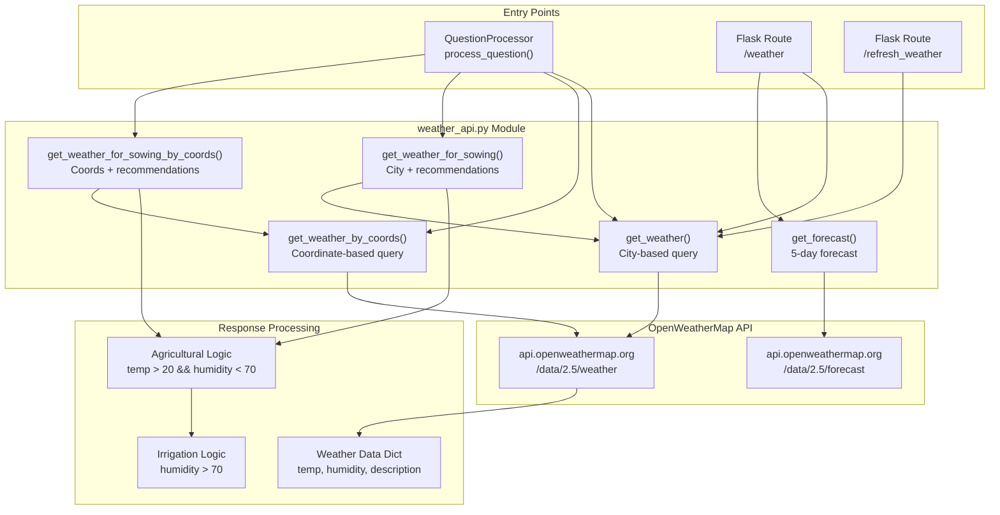
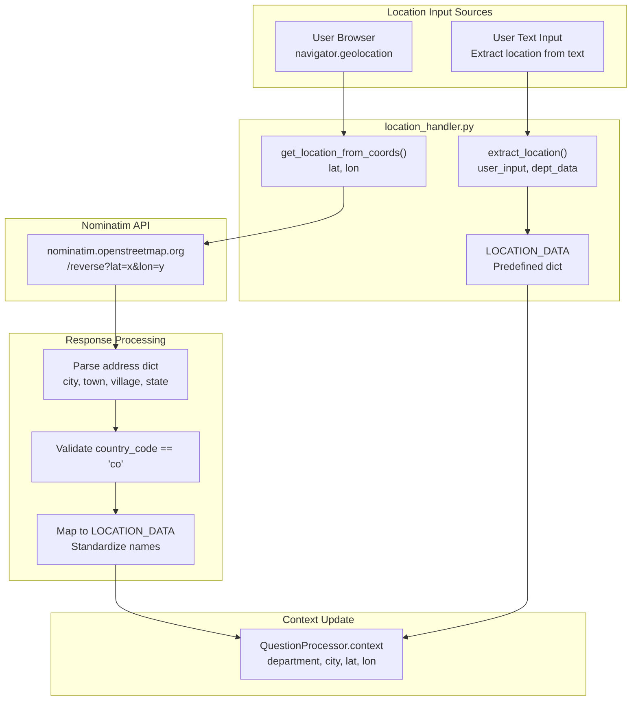
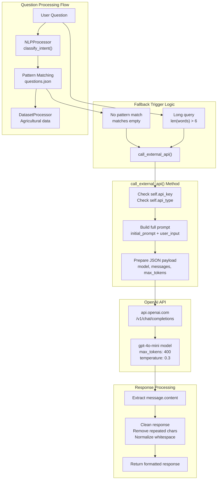
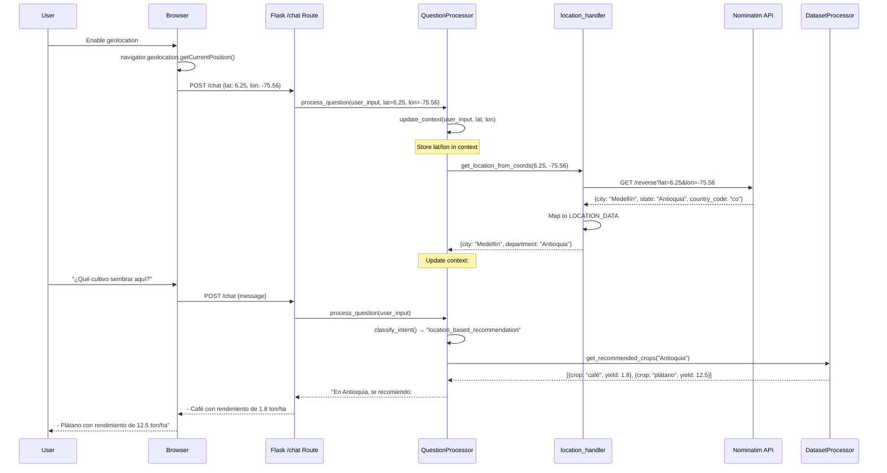
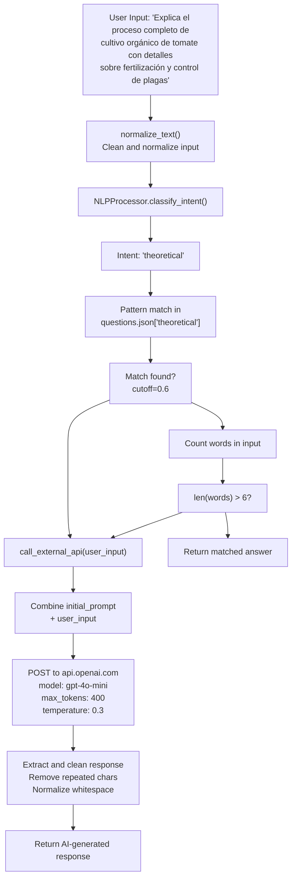

# Integraciones externas

> **Archivos fuente relevantes**
> * [aplicación/__init__.py](https://github.com/axchisan/ProyectoAgroBot/blob/bc782fcf/app/__init__.py)
> * [aplicación/chatbot/location_handler.py](https://github.com/axchisan/ProyectoAgroBot/blob/bc782fcf/app/chatbot/location_handler.py)
> * [aplicación/chatbot/procesador_de_preguntas.py](https://github.com/axchisan/ProyectoAgroBot/blob/bc782fcf/app/chatbot/question_processor.py)
> * [aplicación/chatbot/weather_api.py](https://github.com/axchisan/ProyectoAgroBot/blob/bc782fcf/app/chatbot/weather_api.py)
> * [aplicación/plantillas/clima.html](https://github.com/axchisan/ProyectoAgroBot/blob/bc782fcf/app/templates/weather.html)

Este documento describe cómo Agrobot se integra con API externas de terceros para ofrecer una funcionalidad mejorada que va más allá de su base de conocimiento interna. El sistema se basa en tres servicios externos principales: OpenWeatherMap para datos meteorológicos, Nominatim para servicios de geocodificación y OpenAI para respuestas de respaldo basadas en IA.

Para obtener información sobre cómo se utilizan estas integraciones en la lógica de procesamiento de preguntas del chatbot, consulte [el Sistema principal del chatbot](/axchisan/ProyectoAgroBot/4-chatbot-core-system) . Para obtener más información sobre la configuración e implementación de la clave API, consulte [Variables de entorno](/axchisan/ProyectoAgroBot/9.2-environment-variables) .

---

## Descripción general de las dependencias externas

Las integraciones externas de Agrobot habilitan tres capacidades críticas que no se pueden satisfacer solo con datos estáticos:

| Servicio | Proveedor | Objetivo | Uso principal |
| --- | --- | --- | --- |
| API meteorológica | Mapa meteorológico abierto | Datos meteorológicos en tiempo real | Clima actual, pronósticos, recomendaciones agrícolas |
| API de geocodificación | Nominatim (OpenStreetMap) | Resolución de ubicación | Convertir coordenadas en nombres de ciudades/departamentos |
| API de respaldo de IA | OpenAI | Respuestas de propósito general | Gestionar consultas agrícolas complejas sin respuestas predefinidas |

Todas las integraciones de API externas están diseñadas con una degradación elegante: si una API no está disponible o está mal configurada, el sistema devuelve mensajes de error informativos en lugar de bloquearse.

**Fuentes:** [question_processor.py L1-L344](https://github.com/axchisan/ProyectoAgroBot/blob/bc782fcf/app/chatbot/question_processor.py#L1-L344)

 [__init__.py L1-L21](https://github.com/axchisan/ProyectoAgroBot/blob/bc782fcf/app/__init__.py#L1-L21)

---

## Integración de servicios meteorológicos

### Arquitectura de la API de OpenWeatherMap

La integración meteorológica proporciona datos meteorológicos en tiempo real y recomendaciones agrícolas a través del `weather_api`módulo. El sistema admite consultas basadas tanto en ciudades como en coordenadas.



**Funciones de la API meteorológica y su uso**

**Fuentes:** [weather_api.py L1-L193](https://github.com/axchisan/ProyectoAgroBot/blob/bc782fcf/app/chatbot/weather_api.py#L1-L193)

 [question_processor.py L7-L8](https://github.com/axchisan/ProyectoAgroBot/blob/bc782fcf/app/chatbot/question_processor.py#L7-L8)

### Funciones meteorológicas básicas

El `weather_api`módulo expone cinco funciones principales:

| Función | Firma | Objetivo | Tipo de retorno |
| --- | --- | --- | --- |
| `get_weather()` | `(city: str, api_key: str) -> Optional[Dict]` | Clima actual por nombre de ciudad | Datos meteorológicos dict o Ninguno |
| `get_weather_by_coords()` | `(lat: float, lon: float, api_key: str) -> Optional[Dict]` | Clima actual por coordenadas | Datos meteorológicos dict o Ninguno |
| `get_forecast()` | `(city: str, api_key: str) -> Optional[List[Dict]]` | Pronóstico de 5 días agregado por día | Lista de dicts de pronóstico o Ninguno |
| `get_weather_for_sowing()` | `(city: str, api_key: str) -> Optional[Dict]` | Clima + recomendación agrícola | Dictamen meteorológico mejorado o Ninguno |
| `get_weather_for_sowing_by_coords()` | `(lat: float, lon: float, api_key: str) -> Optional[Dict]` | Clima + recomendación por coordenadas | Dictamen meteorológico mejorado o Ninguno |

**Fuentes:** [weather_api.py L9-L193](https://github.com/axchisan/ProyectoAgroBot/blob/bc782fcf/app/chatbot/weather_api.py#L9-L193)

### Estructura de datos meteorológicos

Las funciones `get_weather()`y `get_weather_by_coords()`devuelven respuestas sin procesar de la API de OpenWeatherMap en formato JSON. Los campos clave incluyen:

```json
{
    "name": "city_name",
    "main": {
        "temp": 23.5,
        "feels_like": 24.1,
        "humidity": 65,
        "pressure": 1013
    },
    "weather": [
        {
            "description": "lluvia ligera",
            "icon": "10d"
        }
    ],
    "wind": {
        "speed": 3.5
    },
    "visibility": 10000
}
```

**Fuentes:** [weather_api.py L9-L37](https://github.com/axchisan/ProyectoAgroBot/blob/bc782fcf/app/chatbot/weather_api.py#L9-L37)

 [weather_api.py L39-L69](https://github.com/axchisan/ProyectoAgroBot/blob/bc782fcf/app/chatbot/weather_api.py#L39-L69)

### Lógica de las recomendaciones agrícolas

Las funciones `get_weather_for_sowing()`y `get_weather_for_sowing_by_coords()`mejoran los datos meteorológicos con asesoramiento agrícola utilizando una lógica simple basada en reglas:

**Lógica de recomendación de siembra** ([weather_api.py L150-L154](https://github.com/axchisan/ProyectoAgroBot/blob/bc782fcf/app/chatbot/weather_api.py#L150-L154)

):

* **Condiciones favorables** : Temperatura > 20°C Y humedad < 70% * Mensaje: "Es un buen momento para sembrar, pero asegúrese de regar adecuadamente."
* **Condiciones desfavorables** : De lo contrario * Mensaje: "Las condiciones no son ideales para sembrar ahora. Considere esperar a que mejore el clima."

**Lógica de recomendación de riego** ([question_processor.py L210-L226](https://github.com/axchisan/ProyectoAgroBot/blob/bc782fcf/app/chatbot/question_processor.py#L210-L226)

):

* **High humidity** (> 70%): "Evita regar en exceso, ya que la humedad es alta."
* **Low humidity** (≤ 70%): "Riega tus cultivos, ya que la humedad es baja."

**Sources:** [app/chatbot/weather_api.py L134-L193](https://github.com/axchisan/ProyectoAgroBot/blob/bc782fcf/app/chatbot/weather_api.py#L134-L193)

 [app/chatbot/question_processor.py L206-L231](https://github.com/axchisan/ProyectoAgroBot/blob/bc782fcf/app/chatbot/question_processor.py#L206-L231)

### Forecast Data Processing

The `get_forecast()` function processes OpenWeatherMap's 3-hourly forecast data into daily aggregates:

1. Fetches 5-day forecast from `/data/2.5/forecast` endpoint
2. Groups entries by date using `datetime.fromtimestamp(entry["dt"]).date()`
3. Calculates daily `temp_max` and `temp_min` from all 3-hour intervals
4. Returns first 5 days with date, temp range, description, and icon

**Sources:** [app/chatbot/weather_api.py L71-L132](https://github.com/axchisan/ProyectoAgroBot/blob/bc782fcf/app/chatbot/weather_api.py#L71-L132)

### Integration with Question Processor

The `QuestionProcessor` class uses weather functions in several intent-based flows:

**Intent: `weather`** ([app/chatbot/question_processor.py L157-L174](https://github.com/axchisan/ProyectoAgroBot/blob/bc782fcf/app/chatbot/question_processor.py#L157-L174)

):

* Checks for coordinates in context (`self.context["lat"]` and `self.context["lon"]`)
* If coordinates available: calls `get_weather_by_coords()`
* Otherwise: calls `get_weather()` with `target_city`
* Formats response using answer template with city, description, and temperature

**Intent: `weather_sowing_advice`** ([app/chatbot/question_processor.py L185-L205](https://github.com/axchisan/ProyectoAgroBot/blob/bc782fcf/app/chatbot/question_processor.py#L185-L205)

):

* Similar coordinate/city logic
* Calls `get_weather_for_sowing_by_coords()` or `get_weather_for_sowing()`
* Returns recommendation with temperature, humidity, and agricultural advice

**Intent: `irrigation_advice`** ([app/chatbot/question_processor.py L206-L231](https://github.com/axchisan/ProyectoAgroBot/blob/bc782fcf/app/chatbot/question_processor.py#L206-L231)

):

* Fetches weather data with agricultural logic
* Applies humidity-based irrigation rules
* Returns context-specific irrigation recommendations

**Sources:** [app/chatbot/question_processor.py L157-L231](https://github.com/axchisan/ProyectoAgroBot/blob/bc782fcf/app/chatbot/question_processor.py#L157-L231)

### API Configuration

Weather API keys are loaded from environment variables:

* Primary key source: `OPENWEATHER_API_KEY` environment variable
* Function parameter fallback: `api_key` parameter in each function
* Base URLs defined as module constants: * `WEATHER_API_URL = "http://api.openweathermap.org/data/2.5/weather"` * `FORECAST_API_URL = "http://api.openweathermap.org/data/2.5/forecast"`

All requests include:

* `units=metric` for Celsius temperatures
* `lang=es` for Spanish-language weather descriptions

**Sources:** [app/chatbot/weather_api.py L1-L8](https://github.com/axchisan/ProyectoAgroBot/blob/bc782fcf/app/chatbot/weather_api.py#L1-L8)

 [app/chatbot/weather_api.py L20-L29](https://github.com/axchisan/ProyectoAgroBot/blob/bc782fcf/app/chatbot/weather_api.py#L20-L29)

---

## Location Services Integration

### Nominatim Reverse Geocoding

The location handler uses Nominatim (OpenStreetMap's geocoding service) to convert GPS coordinates into human-readable city and department names. This enables the chatbot to provide location-specific agricultural recommendations when users share their coordinates.



**Sources:** [app/chatbot/location_handler.py L1-L270](https://github.com/axchisan/ProyectoAgroBot/blob/bc782fcf/app/chatbot/location_handler.py#L1-L270)

 [app/chatbot/question_processor.py L77-L95](https://github.com/axchisan/ProyectoAgroBot/blob/bc782fcf/app/chatbot/question_processor.py#L77-L95)

### Predefined Location Dictionary

The `LOCATION_DATA` dictionary ([app/chatbot/location_handler.py L6-L26](https://github.com/axchisan/ProyectoAgroBot/blob/bc782fcf/app/chatbot/location_handler.py#L6-L26)

) provides a mapping of Colombian cities and departments with standardized names:

```css
LOCATION_DATA = {
    "bogotá": {"city": "Bogotá", "department": "Cundinamarca"},
    "medellín": {"city": "Medellín", "department": "Antioquia"},
    "cali": {"city": "Cali", "department": "Valle del Cauca"},
    # ... 20+ entries
}
```

This dictionary serves two purposes:

1. **Direct text extraction**: Used by `extract_location()` to identify locations in user input without API calls
2. **Response standardization**: Maps Nominatim's varying location names to consistent Colombian geography

**Sources:** [app/chatbot/location_handler.py L5-L26](https://github.com/axchisan/ProyectoAgroBot/blob/bc782fcf/app/chatbot/location_handler.py#L5-L26)

### Reverse Geocoding Function

The `get_location_from_coords()` function ([app/chatbot/location_handler.py L29-L108](https://github.com/axchisan/ProyectoAgroBot/blob/bc782fcf/app/chatbot/location_handler.py#L29-L108)

) converts GPS coordinates to location names:

**Request Parameters:**

* `lat`: Latitude (float)
* `lon`: Longitude (float)
* `format=json`: Response format
* `addressdetails=1`: Include detailed address components

**Required Header:**

* `User-Agent: "Agrobot/1.0 (contacto@agrobot.com)"` - Nominatim requires identification per usage policy

**Response Processing Flow:**

1. **Parse address components** ([app/chatbot/location_handler.py L49-L51](https://github.com/axchisan/ProyectoAgroBot/blob/bc782fcf/app/chatbot/location_handler.py#L49-L51) ): * City: `address.get("city")` or `address.get("town")` or `address.get("village")` * Department: `address.get("state")`
2. **Validate Colombian location** ([app/chatbot/location_handler.py L59-L64](https://github.com/axchisan/ProyectoAgroBot/blob/bc782fcf/app/chatbot/location_handler.py#L59-L64) ): * Check `address.get("country_code") == "co"` * Return `None` if location is outside Colombia
3. **Map to standard names** ([app/chatbot/location_handler.py L67-L94](https://github.com/axchisan/ProyectoAgroBot/blob/bc782fcf/app/chatbot/location_handler.py#L67-L94) ): * Search `LOCATION_DATA` by department name (case-insensitive) * Fallback to city name search * If no match found, return capitalized Nominatim response

**Sources:** [app/chatbot/location_handler.py L29-L108](https://github.com/axchisan/ProyectoAgroBot/blob/bc782fcf/app/chatbot/location_handler.py#L29-L108)

### Location Extraction from Text

The `extract_location()` function ([app/chatbot/location_handler.py L110-L131](https://github.com/axchisan/ProyectoAgroBot/blob/bc782fcf/app/chatbot/location_handler.py#L110-L131)

) identifies locations mentioned in user text:

**Algorithm:**

1. Normalize user input to lowercase
2. Iterate through `LOCATION_DATA` keys
3. Check if any key appears as substring in user input
4. Return corresponding city/department dictionary

**Fallback with Department Data:**
If no match in `LOCATION_DATA`, searches the `department_data` DataFrame:

* Checks `department_data["departamento"]` column
* Returns department without city if found

**Sources:** [app/chatbot/location_handler.py L110-L131](https://github.com/axchisan/ProyectoAgroBot/blob/bc782fcf/app/chatbot/location_handler.py#L110-L131)

### Context Management Integration

The `QuestionProcessor.update_context()` method ([app/chatbot/question_processor.py L77-L95](https://github.com/axchisan/ProyectoAgroBot/blob/bc782fcf/app/chatbot/question_processor.py#L77-L95)

) manages location state:

**Coordinate-based update:**

```
if lat is not None and lon is not None:
    self.context["lat"] = lat
    self.context["lon"] = lon
    location = get_location_from_coords(lat, lon)
    if location:
        self.context["city"] = location.get("city")
        self.context["department"] = location.get("department")
```

**Text-based update:**

```
location = extract_location(user_input, self.department_data)
if location:
    if location.get("department"):
        self.context["department"] = location["department"]
    if location.get("city"):
        self.context["city"] = location["city"]
```

The context persists throughout the conversation session, allowing subsequent queries to use the same location without re-specification.

**Sources:** [app/chatbot/question_processor.py L77-L95](https://github.com/axchisan/ProyectoAgroBot/blob/bc782fcf/app/chatbot/question_processor.py#L77-L95)

### Location-Based Agricultural Functions

The `location_handler` module provides several agricultural data functions that use location information:

| Function | Purpose | Usage in QuestionProcessor |
| --- | --- | --- |
| `recommend_crop_by_location()` | Find most profitable crop for department | Legacy function, superseded by `DatasetProcessor` |
| `get_production_data()` | Get production stats for crop+department | Legacy function, superseded by `DatasetProcessor` |
| `get_crop_profitability()` | Find best department for crop | Legacy function, superseded by `DatasetProcessor` |
| `get_department_with_min_production()` | Identify lowest production department | Legacy function, superseded by `DatasetProcessor` |
| `get_department_with_max_production()` | Identify highest production department | Legacy function, superseded by `DatasetProcessor` |

**Note:** These functions are defined but not actively used in the current system. The `DatasetProcessor` class provides equivalent functionality with more comprehensive data access (see [Dataset Processing](/axchisan/ProyectoAgroBot/5.3-dataset-processing)).

**Sources:** [app/chatbot/location_handler.py L134-L269](https://github.com/axchisan/ProyectoAgroBot/blob/bc782fcf/app/chatbot/location_handler.py#L134-L269)

---

## AI Fallback Service

### OpenAI API Integration

When the chatbot cannot answer a query using pattern matching or structured data, it falls back to OpenAI's GPT-4o-mini model for general-purpose agricultural advice. This ensures users always receive helpful responses even for novel or complex questions.



**Sources:** [app/chatbot/question_processor.py L96-L131](https://github.com/axchisan/ProyectoAgroBot/blob/bc782fcf/app/chatbot/question_processor.py#L96-L131)

 [app/chatbot/question_processor.py L340-L342](https://github.com/axchisan/ProyectoAgroBot/blob/bc782fcf/app/chatbot/question_processor.py#L340-L342)

### Fallback Trigger Conditions

The `QuestionProcessor.process_question()` method triggers the AI fallback under two conditions ([app/chatbot/question_processor.py L340-L342](https://github.com/axchisan/ProyectoAgroBot/blob/bc782fcf/app/chatbot/question_processor.py#L340-L342)

):

1. **No pattern match found**: `if not matches` - No close match in `questions.json`
2. **Long/complex query**: `len(words) > 6` - Query exceeds 6 words, suggesting complexity

**Explicit condition:**

```
if not matches or len(words) > 6:
    return sentiment_prefix + self.call_external_api(user_input)
```

This strategy ensures:

* Simple questions get fast, deterministic answers from the knowledge base
* Complex agricultural questions receive comprehensive AI-generated responses
* Multi-part or detailed queries bypass pattern matching entirely

**Sources:** [app/chatbot/question_processor.py L340-L342](https://github.com/axchisan/ProyectoAgroBot/blob/bc782fcf/app/chatbot/question_processor.py#L340-L342)

### System Prompt Configuration

The `initial_prompt` attribute ([app/chatbot/question_processor.py L35-L43](https://github.com/axchisan/ProyectoAgroBot/blob/bc782fcf/app/chatbot/question_processor.py#L35-L43)

) defines the AI's behavior:

**Key Directives:**

* **Role definition**: "complemento para el desarrollo de Agrobot" - Assistant to Agrobot chatbot
* **Target audience**: "pequeños agricultores" - Colombian small farmers
* **Content scope**: Agricultural concepts, advice on crops, sustainable agriculture, pest management
* **Response format**: * Always in Spanish * Clear and practical language * Adapted to Colombian context * Simple language for farmers with basic knowledge * **Strict limit: 400 words maximum** * Minimum 150 words to ensure completeness * No spelling or typographical errors
* **Technique responses**: For agricultural techniques (pruning, planting, harvesting, pest management), provide: * Specific steps * Enumerated reasons or benefits * Practical utility for farmers

**Sources:** [app/chatbot/question_processor.py L35-L43](https://github.com/axchisan/ProyectoAgroBot/blob/bc782fcf/app/chatbot/question_processor.py#L35-L43)

### API Request Configuration

The `call_external_api()` method ([app/chatbot/question_processor.py L96-L131](https://github.com/axchisan/ProyectoAgroBot/blob/bc782fcf/app/chatbot/question_processor.py#L96-L131)

) constructs OpenAI API requests:

**Request Structure:**

* **Endpoint**: `https://api.openai.com/v1/chat/completions`
* **Authentication**: `Bearer {self.api_key}` in Authorization header
* **Model**: `gpt-4o-mini`
* **Store**: `True` - Allows OpenAI to store for training (configurable)

**Message Format:**

```
"messages": [
    {"role": "system", "content": self.initial_prompt},
    {"role": "user", "content": user_input}
]
```

**Generation Parameters:**

* `max_tokens: 400` - Enforces word limit (approximately 400 words)
* `temperature: 0.3` - Low temperature for consistent, factual responses

**Sources:** [app/chatbot/question_processor.py L101-L118](https://github.com/axchisan/ProyectoAgroBot/blob/bc782fcf/app/chatbot/question_processor.py#L101-L118)

### Response Processing

After receiving the API response, the method performs cleanup ([app/chatbot/question_processor.py L119-L122](https://github.com/axchisan/ProyectoAgroBot/blob/bc782fcf/app/chatbot/question_processor.py#L119-L122)

):

**Step 1: Extract content**

```
raw_response = response.json()["choices"][0]["message"]["content"].strip()
```

**Step 2: Remove repeated characters**

```
raw_response = re.sub(r'\b(\w+)(\w)\2+\b', r'\1\2', raw_response)
```

* Pattern: `\b(\w+)(\w)\2+\b` captures words with repeated final characters
* Example: "cosecchaaa" → "cosecha"

**Step 3: Normalize whitespace**

```
raw_response = re.sub(r'\s+', ' ', raw_response)
```

* Replaces multiple consecutive spaces with single space
* Cleans up formatting artifacts

**Sources:** [app/chatbot/question_processor.py L119-L122](https://github.com/axchisan/ProyectoAgroBot/blob/bc782fcf/app/chatbot/question_processor.py#L119-L122)

### Error Handling

The method implements comprehensive error handling:

| Exception Type | Handler | Error Message |
| --- | --- | --- |
| No API key | Check `self.api_key` | "No tengo acceso a una API externa. Configura una clave API para respuestas avanzadas." |
| Unsupported API type | Check `self.api_type` | "Tipo de API no soportado. Usa 'openai'." |
| `requests.exceptions.HTTPError` | Catch HTTP errors | "Error al consultar la API externa: {error}." |
| `requests.exceptions.RequestException` | Catch connection errors | "Error de conexión con la API externa: {error}." |
| `KeyError` | Catch malformed response | "Error al procesar la respuesta de la API: {error}." |

All error messages are returned to the user in Spanish, maintaining the conversational flow.

**Sources:** [app/chatbot/question_processor.py L97-L130](https://github.com/axchisan/ProyectoAgroBot/blob/bc782fcf/app/chatbot/question_processor.py#L97-L130)

### API Type Extensibility

The `QuestionProcessor` constructor accepts an `api_type` parameter ([app/chatbot/question_processor.py L13-L21](https://github.com/axchisan/ProyectoAgroBot/blob/bc782fcf/app/chatbot/question_processor.py#L13-L21)

):

```python
def __init__(self, ..., api_key: str = None, api_type: str = "openai"):
    ...
    self.api_type = api_type.lower()
```

This design allows future integration with alternative AI providers (e.g., Anthropic Claude, Google Gemini) by:

1. Adding new `if self.api_type == "provider_name"` branches in `call_external_api()`
2. Implementing provider-specific request formatting
3. Handling provider-specific response structures

Currently, only `"openai"` is implemented.

**Sources:** [app/chatbot/question_processor.py L13-L21](https://github.com/axchisan/ProyectoAgroBot/blob/bc782fcf/app/chatbot/question_processor.py#L13-L21)

 [app/chatbot/question_processor.py L101-L124](https://github.com/axchisan/ProyectoAgroBot/blob/bc782fcf/app/chatbot/question_processor.py#L101-L124)

---

## Configuration and Environment Variables

### Required API Keys

All three external integrations require API keys configured via environment variables:

| Environment Variable | Service | Required For | How to Obtain |
| --- | --- | --- | --- |
| `OPENWEATHER_API_KEY` | OpenWeatherMap | Weather queries, agricultural recommendations | [https://openweathermap.org/api](https://openweathermap.org/api) |
| `OPENAI_API_KEY` | OpenAI | AI fallback responses | [https://platform.openai.com/api-keys](https://platform.openai.com/api-keys) |
| N/A (Nominatim) | OpenStreetMap | Geocoding (free, no key required) | Public service |

**Loading Mechanism:**

Las variables de entorno se cargan a través `dotenv`de la fábrica de aplicaciones Flask ([__init__.py L7](https://github.com/axchisan/ProyectoAgroBot/blob/bc782fcf/app/__init__.py#L7-L7)

):

```
load_dotenv()
```

Los módulos individuales acceden a las claves mediante:

* `os.getenv("OPENWEATHER_API_KEY")`en`weather_api.py`
* Parámetros del constructor en`QuestionProcessor.__init__()`

**Fuentes:** [__init__.py L1-L21](https://github.com/axchisan/ProyectoAgroBot/blob/bc782fcf/app/__init__.py#L1-L21)

 [weather_api.py L20-L23](https://github.com/axchisan/ProyectoAgroBot/blob/bc782fcf/app/chatbot/weather_api.py#L20-L23)

 [question_processor.py L13-L21](https://github.com/axchisan/ProyectoAgroBot/blob/bc782fcf/app/chatbot/question_processor.py#L13-L21)

### Estrategia de respaldo de variables de entorno

Cada integración implementa una resolución de clave de dos niveles:

**Nivel 1: Parámetro de función/constructor**

```python
def get_weather(city: str, api_key: str = None):
    api_key = api_key or os.getenv("OPENWEATHER_API_KEY")
```

**Nivel 2: Variable de entorno**

* Permite anular la clave en tiempo de ejecución
* Permite realizar pruebas con diferentes claves API
* Admite implementaciones de múltiples inquilinos

**Fuentes:** [weather_api.py L20-L23](https://github.com/axchisan/ProyectoAgroBot/blob/bc782fcf/app/chatbot/weather_api.py#L20-L23)

### Cumplimiento de la política de uso de Nominatim

Nominatim requiere un encabezado de agente de usuario descriptivo para cumplir con su política de uso ([location_handler.py L42-L44](https://github.com/axchisan/ProyectoAgroBot/blob/bc782fcf/app/chatbot/location_handler.py#L42-L44)

):

```
headers = {
    "User-Agent": "Agrobot/1.0 (contacto@agrobot.com)"
}
```

**Requisitos de la política de uso:**

* Identificar el nombre y la versión de la aplicación
* Proporcionar información de contacto
* No más de 1 solicitud por segundo (no está impuesto en el código, pero debe monitorearse)

**Fuentes:** [location_handler.py L42-L44](https://github.com/axchisan/ProyectoAgroBot/blob/bc782fcf/app/chatbot/location_handler.py#L42-L44)

---

## Manejo de errores y estrategias de respaldo

### Manejo de errores de la API meteorológica

El `weather_api`módulo implementa un manejo de errores consistente en todas las funciones:

**Detección de errores:**

```python
try:
    response = requests.get(WEATHER_API_URL, params=params)
    response.raise_for_status()
    return response.json()
except requests.RequestException as e:
    print(f"Error al consultar la API de clima: {e}")
    return None
```

**Degradación elegante en QuestionProcessor:**

Cuando la API meteorológica regresa `None`, el sistema proporciona mensajes informativos ([question_processor.py L166-L174](https://github.com/axchisan/ProyectoAgroBot/blob/bc782fcf/app/chatbot/question_processor.py#L166-L174)

):

```
weather_data = get_weather(target_city, self.weather_api_key)
if weather_data and weather_data.get("main"):
    return sentiment_prefix + q["answer_template"].format(...)
return sentiment_prefix + "No sé tu ubicación exacta. Dime tu ciudad o permite el acceso a tu ubicación."
```

**Fuentes:** [weather_api.py L31-L37](https://github.com/axchisan/ProyectoAgroBot/blob/bc782fcf/app/chatbot/weather_api.py#L31-L37)

 [question_processor.py L166-L174](https://github.com/axchisan/ProyectoAgroBot/blob/bc782fcf/app/chatbot/question_processor.py#L166-L174)

### Manejo de errores de la API de ubicación

La `get_location_from_coords()`función maneja varios escenarios de falla:

**Errores de red:**

```python
except requests.RequestException as e:
    print(f"Error al consultar Nominatim: {e}")
    return None
```

**Ubicaciones no válidas:**

* Devoluciones `None`si el país no es Colombia
* Devuelve `None`si no se puede determinar ni la ciudad ni el departamento
* Registra información detallada para la depuración

**Actualización de respaldo en contexto:**

El `update_context()`método comprueba las `None`respuestas:

```sql
location = get_location_from_coords(lat, lon)
if location:  # Only update if valid response
    self.context["city"] = location.get("city")
    self.context["department"] = location.get("department")
```

**Fuentes:** [location_handler.py L105-L107](https://github.com/axchisan/ProyectoAgroBot/blob/bc782fcf/app/chatbot/location_handler.py#L105-L107)

 [question_processor.py L83-L86](https://github.com/axchisan/ProyectoAgroBot/blob/bc782fcf/app/chatbot/question_processor.py#L83-L86)

### Manejo de errores de respaldo de IA

El `call_external_api()`método implementa el manejo de errores de tres niveles:

**Nivel 1: Comprobación de configuración**

```go
if not self.api_key and self.api_type == "openai":
    return "No tengo acceso a una API externa..."
```

**Nivel 2: Manejo de errores HTTP**

```
except requests.exceptions.HTTPError as e:
    return f"Error al consultar la API externa: {str(e)}."
```

**Nivel 3: Análisis de respuestas**

```
except KeyError as e:
    return f"Error al procesar la respuesta de la API: {str(e)}."
```

Todos los errores devuelven mensajes en español que mantienen la continuidad de la conversación en lugar de exponer errores técnicos a los usuarios.

**Fuentes:** [question_processor.py L96-L130](https://github.com/axchisan/ProyectoAgroBot/blob/bc782fcf/app/chatbot/question_processor.py#L96-L130)

---

## Ejemplos de flujo de integración

### Flujo completo de consultas meteorológicas

Este diagrama muestra cómo fluye una consulta meteorológica desde la entrada del usuario a través de la integración de API externa hasta la respuesta:

```mermaid
sequenceDiagram
  participant User
  participant Browser
  participant Flask /chat Route
  participant QuestionProcessor
  participant NLPProcessor
  participant weather_api.get_weather()
  participant OpenWeatherMap API

  User->>Browser: "¿Cómo está el clima en Medellín?"
  Browser->>Flask /chat Route: POST /chat {message}
  Flask /chat Route->>QuestionProcessor: process_question(user_input)
  QuestionProcessor->>QuestionProcessor: update_context(user_input)
  note over QuestionProcessor: Extracts "Medellín" from text
  QuestionProcessor->>NLPProcessor: classify_intent(user_input)
  NLPProcessor-->>QuestionProcessor: "weather"
  QuestionProcessor->>QuestionProcessor: Pattern match in questions.json
  note over QuestionProcessor: Finds match for weather question
  QuestionProcessor->>weather_api.get_weather(): get_weather("Medellín", api_key)
  weather_api.get_weather()->>OpenWeatherMap API: GET /data/2.5/weather?q=Medellín
  OpenWeatherMap API-->>weather_api.get_weather(): {temp: 22, description: "lluvia ligera", ...}
  weather_api.get_weather()-->>QuestionProcessor: weather_data dict
  QuestionProcessor->>QuestionProcessor: Format response with template
  note over QuestionProcessor: answer_template.format(
  QuestionProcessor-->>Flask /chat Route: "En Medellín, el clima actual es lluvia ligera con 22°C."
  Flask /chat Route-->>Browser: JSON response
  Browser-->>User: Display message in chat
```

**Fuentes:** [question_processor.py L132-L174](https://github.com/axchisan/ProyectoAgroBot/blob/bc782fcf/app/chatbot/question_processor.py#L132-L174)

 [weather_api.py L9-L37](https://github.com/axchisan/ProyectoAgroBot/blob/bc782fcf/app/chatbot/weather_api.py#L9-L37)

### Recomendación basada en la ubicación con geocodificación

Este diagrama ilustra el flujo de coordenadas a recomendación:



**Fuentes:** [question_processor.py L77-L95](https://github.com/axchisan/ProyectoAgroBot/blob/bc782fcf/app/chatbot/question_processor.py#L77-L95)

 [location_handler.py L29-L108](https://github.com/axchisan/ProyectoAgroBot/blob/bc782fcf/app/chatbot/location_handler.py#L29-L108)

 [question_processor.py L241-L248](https://github.com/axchisan/ProyectoAgroBot/blob/bc782fcf/app/chatbot/question_processor.py#L241-L248)

### Flujo de activación de respaldo de IA

Este diagrama muestra cuándo y cómo se activa la reserva de IA:



**Fuentes:** [question_processor.py L132-L150](https://github.com/axchisan/ProyectoAgroBot/blob/bc782fcf/app/chatbot/question_processor.py#L132-L150)

 [question_processor.py L340-L342](https://github.com/axchisan/ProyectoAgroBot/blob/bc782fcf/app/chatbot/question_processor.py#L340-L342)

 [question_processor.py L96-L131](https://github.com/axchisan/ProyectoAgroBot/blob/bc782fcf/app/chatbot/question_processor.py#L96-L131)

---

## Tabla de resumen: Uso de API externas

| API | Módulo | Funciones clave | Intenciones primarias | Estrategia de respaldo |
| --- | --- | --- | --- | --- |
| **Mapa meteorológico abierto** | `weather_api.py` | `get_weather()``get_weather_by_coords()``get_forecast()``get_weather_for_sowing()` | `weather``weather_forecast``weather_sowing_advice``irrigation_advice` | Regresar `None`, mostrar solicitud de ubicación al usuario |
| **Nominatim** | `location_handler.py` | `get_location_from_coords()` | Todas las intenciones basadas en la ubicación | Regresar `None`, utilizar la ciudad/departamento predeterminado de los parámetros de ruta |
| **OpenAI** | `question_processor.py` | `call_external_api()` | (Sin intención específica) Se activa en caso de fallo de coincidencia | Mostrar mensaje de error de configuración de la clave API |

**Fuentes:** [weather_api.py L1-L193](https://github.com/axchisan/ProyectoAgroBot/blob/bc782fcf/app/chatbot/weather_api.py#L1-L193)

 [location_handler.py L1-L270](https://github.com/axchisan/ProyectoAgroBot/blob/bc782fcf/app/chatbot/location_handler.py#L1-L270)

 [question_processor.py L96-L131](https://github.com/axchisan/ProyectoAgroBot/blob/bc782fcf/app/chatbot/question_processor.py#L96-L131)