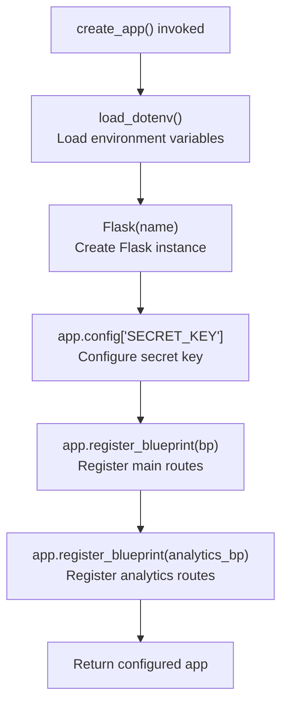
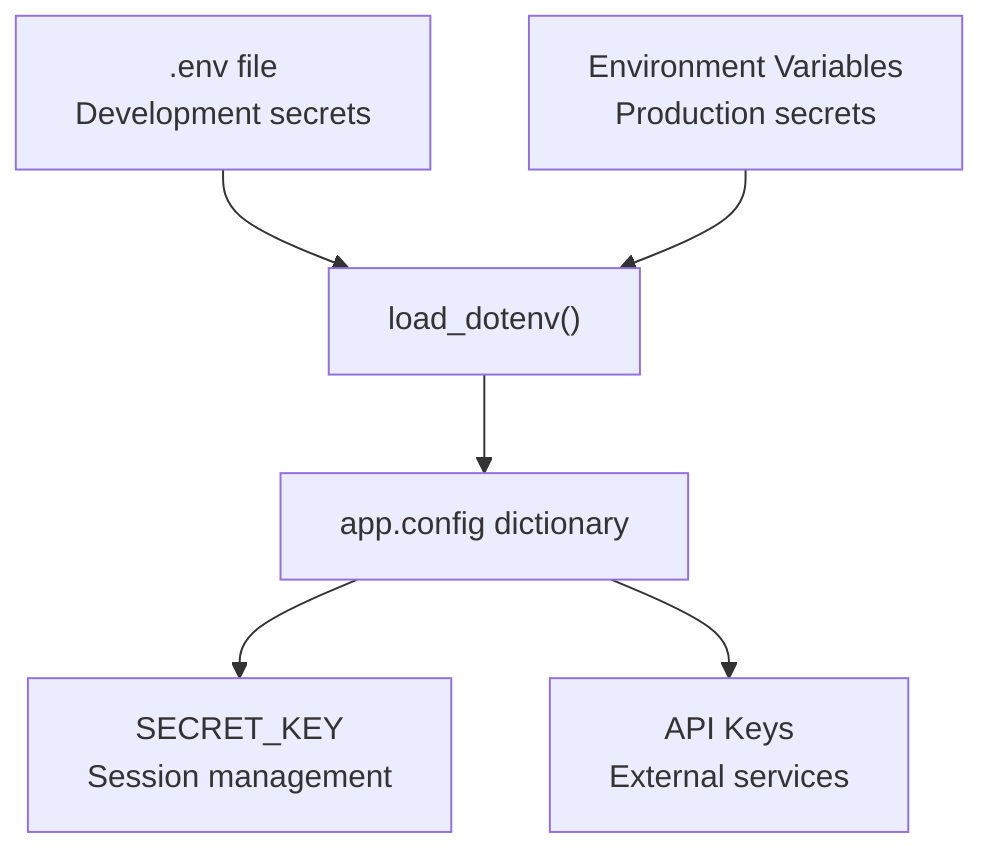
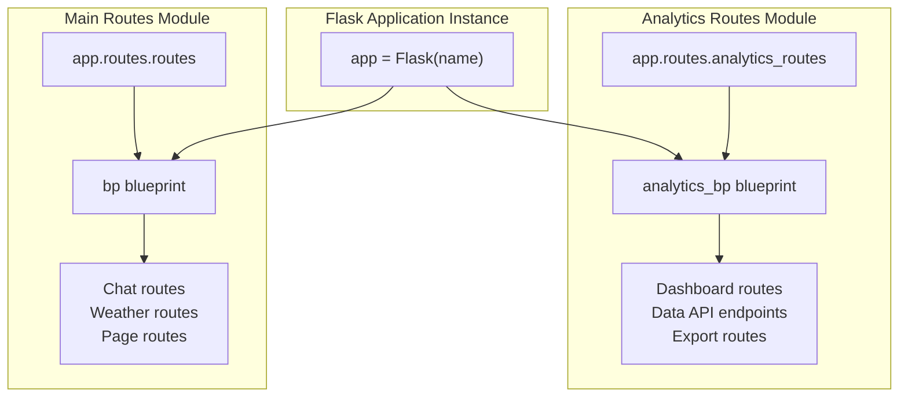
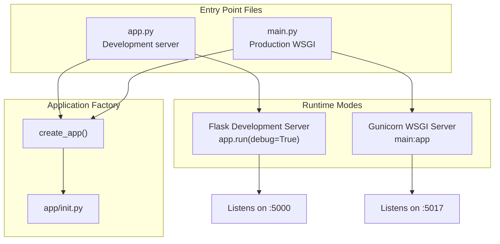
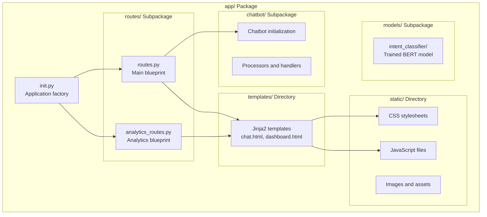
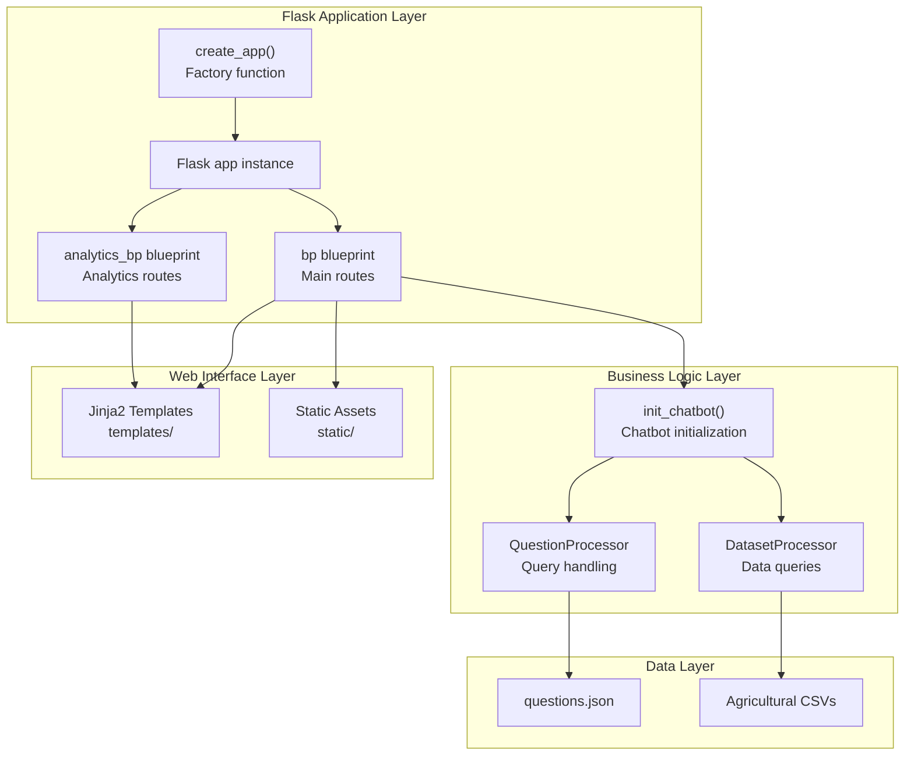

# Flask Application Structure

> **Relevant source files**
> * [app/__init__.py](https://github.com/axchisan/ProyectoAgroBot/blob/bc782fcf/app/__init__.py)
> * [app/chatbot/location_handler.py](https://github.com/axchisan/ProyectoAgroBot/blob/bc782fcf/app/chatbot/location_handler.py)
> * [docs/README.md](https://github.com/axchisan/ProyectoAgroBot/blob/bc782fcf/docs/README.md)

## Purpose and Scope

This document explains the Flask application structure for Agrobot, covering the application factory pattern, configuration management, blueprint registration, and initialization process. For details about specific route handlers, see [Main Routes](/axchisan/ProyectoAgroBot/7.2-main-routes) and [Analytics Dashboard](/axchisan/ProyectoAgroBot/7.3-analytics-dashboard). For deployment configuration, see [Docker Configuration](/axchisan/ProyectoAgroBot/9.1-docker-configuration).

The Flask application serves as the entry point for the web interface, coordinating between the user-facing templates and the underlying chatbot core system.

---

## Application Factory Pattern

Agrobot uses the Flask application factory pattern to create and configure the Flask application instance. This pattern provides flexibility for testing and deployment configurations.

### Factory Function: create_app()

The `create_app()` function in [app/__init__.py L5-L21](https://github.com/axchisan/ProyectoAgroBot/blob/bc782fcf/app/__init__.py#L5-L21)

 initializes and configures the Flask application:

**Initialization Flow**



**Sources:** [app/__init__.py L5-L21](https://github.com/axchisan/ProyectoAgroBot/blob/bc782fcf/app/__init__.py#L5-L21)

---

## Configuration Management

### Environment Variables

The application uses the `python-dotenv` library to load configuration from environment variables. Configuration is loaded at the beginning of the factory function [app/__init__.py L7](https://github.com/axchisan/ProyectoAgroBot/blob/bc782fcf/app/__init__.py#L7-L7)

| Configuration Key | Purpose | Default Value | Source |
| --- | --- | --- | --- |
| `SECRET_KEY` | Flask session encryption key | `'a1b2c3d4e5f6g7h8i9j0k1l2m3n4o5p6'` | [app/__init__.py L11](https://github.com/axchisan/ProyectoAgroBot/blob/bc782fcf/app/__init__.py#L11-L11) |
| `OPENAI_API_KEY` | OpenAI API authentication | None (required) | Environment |
| `OPENWEATHER_API_KEY` | Weather API authentication | None (required) | Environment |

### Configuration Pattern



The pattern `os.getenv('SECRET_KEY', 'default_value')` [app/__init__.py L11](https://github.com/axchisan/ProyectoAgroBot/blob/bc782fcf/app/__init__.py#L11-L11)

 ensures the application can run with defaults in development while requiring explicit configuration in production.

**Sources:** [app/__init__.py L1-L11](https://github.com/axchisan/ProyectoAgroBot/blob/bc782fcf/app/__init__.py#L1-L11)

---

## Blueprint Architecture

Agrobot organizes routes using Flask blueprints, providing modular separation of concerns.

### Registered Blueprints

**Blueprint Registration Mapping**



| Blueprint | Variable Name | Import Source | Registration Line | Purpose |
| --- | --- | --- | --- | --- |
| Main Routes | `bp` | `app.routes.routes` | [app/__init__.py L14-L15](https://github.com/axchisan/ProyectoAgroBot/blob/bc782fcf/app/__init__.py#L14-L15) | Chat interface, weather, recommendations |
| Analytics | `analytics_bp` | `app.routes.analytics_routes` | [app/__init__.py L18-L19](https://github.com/axchisan/ProyectoAgroBot/blob/bc782fcf/app/__init__.py#L18-L19) | Data analytics dashboard and APIs |

**Sources:** [app/__init__.py L14-L19](https://github.com/axchisan/ProyectoAgroBot/blob/bc782fcf/app/__init__.py#L14-L19)

---

## Application Entry Points

Agrobot provides multiple entry points for different deployment scenarios.

### Code Entity Mapping



### Development Entry Point

The development entry point typically located at `app.py` (referenced in [docs/README.md L138](https://github.com/axchisan/ProyectoAgroBot/blob/bc782fcf/docs/README.md#L138-L138)

) runs the Flask development server:

```javascript
# Pattern for app.py (development)
from app import create_app

app = create_app()

if __name__ == '__main__':
    app.run(debug=True, host='0.0.0.0', port=5000)
```

### Production Entry Point

The production entry point `main.py` exports the application instance for WSGI servers like Gunicorn:

```javascript
# Pattern for main.py (production)
from app import create_app

app = create_app()
```

This allows Gunicorn to import the application as `main:app` without executing additional code.

**Sources:** [docs/README.md L138-L142](https://github.com/axchisan/ProyectoAgroBot/blob/bc782fcf/docs/README.md#L138-L142)

---

## Application Module Structure

The Flask application is organized as a Python package under the `app/` directory.

### Directory Layout



### Package Import Structure

The factory pattern enables clean imports throughout the application:

| Import Statement | Purpose | Used By |
| --- | --- | --- |
| `from app import create_app` | Import factory function | Entry points (`app.py`, `main.py`) |
| `from .routes.routes import bp` | Import main blueprint | [app/__init__.py L14](https://github.com/axchisan/ProyectoAgroBot/blob/bc782fcf/app/__init__.py#L14-L14) |
| `from .routes.analytics_routes import analytics_bp` | Import analytics blueprint | [app/__init__.py L18](https://github.com/axchisan/ProyectoAgroBot/blob/bc782fcf/app/__init__.py#L18-L18) |

**Sources:** [app/__init__.py L1-L4](https://github.com/axchisan/ProyectoAgroBot/blob/bc782fcf/app/__init__.py#L1-L4)

 [app/__init__.py L14-L19](https://github.com/axchisan/ProyectoAgroBot/blob/bc782fcf/app/__init__.py#L14-L19)

---

## Initialization Sequence

The complete initialization sequence when starting the application:

```mermaid
sequenceDiagram
  participant Entry Point
  participant (app.py/main.py)
  participant create_app()
  participant load_dotenv()
  participant Flask Instance
  participant Main Blueprint (bp)
  participant Analytics Blueprint (analytics_bp)

  Entry Point->>create_app(): Call create_app()
  create_app()->>load_dotenv(): Load .env file
  load_dotenv()-->>create_app(): Environment variables loaded
  create_app()->>Flask Instance: Flask(__name__)
  Flask Instance-->>create_app(): Flask instance created
  create_app()->>Flask Instance: Set app.config['SECRET_KEY']
  create_app()->>Main Blueprint (bp): Import from .routes.routes
  create_app()->>Flask Instance: app.register_blueprint(bp)
  create_app()->>Analytics Blueprint (analytics_bp): Import from .routes.analytics_routes
  create_app()->>Flask Instance: app.register_blueprint(analytics_bp)
  create_app()-->>Entry Point: Return configured app
  loop [Development Mode]
    Entry Point->>Flask Instance: app.run(debug=True)
    Entry Point->>Flask Instance: Export as WSGI app
  end
```

### Initialization Steps

1. **Environment Loading** [app/__init__.py L7](https://github.com/axchisan/ProyectoAgroBot/blob/bc782fcf/app/__init__.py#L7-L7) : The `load_dotenv()` function loads configuration from `.env` file
2. **Flask Instance Creation** [app/__init__.py L9](https://github.com/axchisan/ProyectoAgroBot/blob/bc782fcf/app/__init__.py#L9-L9) : Creates the Flask application object
3. **Configuration** [app/__init__.py L11](https://github.com/axchisan/ProyectoAgroBot/blob/bc782fcf/app/__init__.py#L11-L11) : Sets the `SECRET_KEY` from environment or default
4. **Blueprint Registration** [app/__init__.py L14-L19](https://github.com/axchisan/ProyectoAgroBot/blob/bc782fcf/app/__init__.py#L14-L19) : Registers main and analytics blueprints in order
5. **Application Return** [app/__init__.py L21](https://github.com/axchisan/ProyectoAgroBot/blob/bc782fcf/app/__init__.py#L21-L21) : Returns the fully configured application instance

**Sources:** [app/__init__.py L5-L21](https://github.com/axchisan/ProyectoAgroBot/blob/bc782fcf/app/__init__.py#L5-L21)

---

## Configuration Best Practices

### Secret Key Management

The `SECRET_KEY` configuration demonstrates proper secret management:

* **Development**: Uses default value from [app/__init__.py L11](https://github.com/axchisan/ProyectoAgroBot/blob/bc782fcf/app/__init__.py#L11-L11)
* **Production**: Should be set via environment variable (see [Environment Variables](/axchisan/ProyectoAgroBot/9.2-environment-variables))
* **Purpose**: Encrypts Flask session cookies and CSRF tokens

### API Key Handling

External service API keys should be loaded from environment variables:

* `OPENAI_API_KEY`: Required for AI fallback responses
* `OPENWEATHER_API_KEY`: Required for weather queries

These are loaded by individual route handlers and processors rather than at application initialization, allowing for lazy loading and better error handling.

**Sources:** [app/__init__.py L11](https://github.com/axchisan/ProyectoAgroBot/blob/bc782fcf/app/__init__.py#L11-L11)

 [docs/README.md L42](https://github.com/axchisan/ProyectoAgroBot/blob/bc782fcf/docs/README.md#L42-L42)

---

## Integration with Application Layers

The Flask application structure connects the web interface layer with the underlying system components:



The Flask application acts as the coordinator between HTTP requests from users and the specialized processors that handle agricultural queries and data analysis.

**Sources:** [app/__init__.py L1-L21](https://github.com/axchisan/ProyectoAgroBot/blob/bc782fcf/app/__init__.py#L1-L21)

---

## Summary

The Agrobot Flask application structure follows these key patterns:

| Pattern | Implementation | Benefit |
| --- | --- | --- |
| **Application Factory** | `create_app()` function | Testability, multiple configurations |
| **Blueprint Organization** | Separate `bp` and `analytics_bp` | Modular route organization |
| **Environment Configuration** | `load_dotenv()` + `os.getenv()` | Secure secret management |
| **Package Structure** | `app/` as Python package | Clean imports, clear hierarchy |
| **Dual Entry Points** | `app.py` and `main.py` | Support for dev and production |

The structure provides a clean separation between web application concerns (routing, templates, HTTP) and business logic (chatbot processing, data analysis), enabling independent development and testing of each layer.

**Sources:** [app/__init__.py L1-L21](https://github.com/axchisan/ProyectoAgroBot/blob/bc782fcf/app/__init__.py#L1-L21)

 [docs/README.md L1-L173](https://github.com/axchisan/ProyectoAgroBot/blob/bc782fcf/docs/README.md#L1-L173)