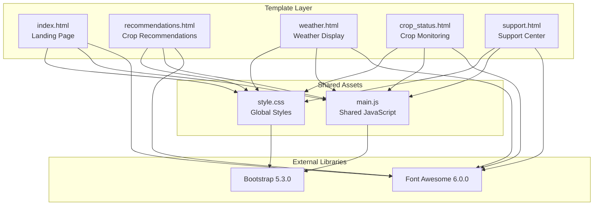
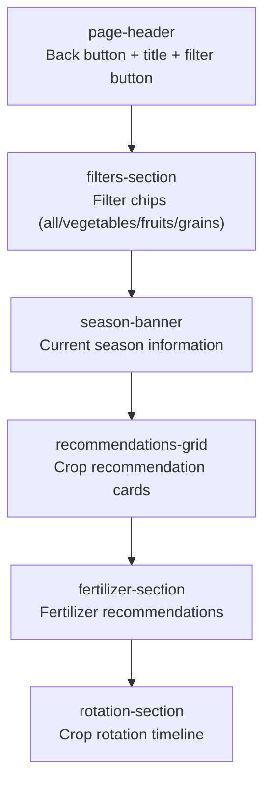
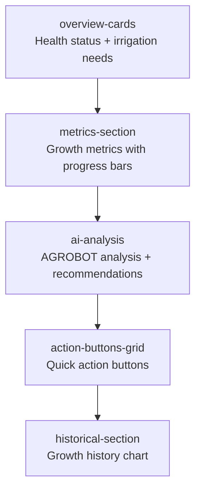
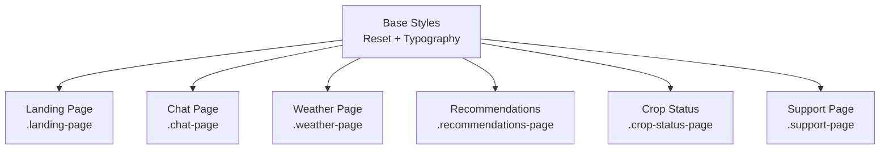
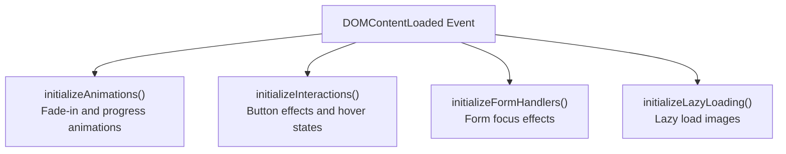

# Componentes de interfaz

> **Archivos fuente relevantes**
> * [aplicación/chatbot/training_utils.py](https://github.com/axchisan/ProyectoAgroBot/blob/bc782fcf/app/chatbot/training_utils.py)
> * [aplicación/estática/css/estilo.css](https://github.com/axchisan/ProyectoAgroBot/blob/bc782fcf/app/static/css/style.css)
> * [aplicación/estática/js/main.js](https://github.com/axchisan/ProyectoAgroBot/blob/bc782fcf/app/static/js/main.js)
> * [aplicación/plantillas/chat.html](https://github.com/axchisan/ProyectoAgroBot/blob/bc782fcf/app/templates/chat.html)
> * [aplicación/plantillas/estado_del_cultivo.html](https://github.com/axchisan/ProyectoAgroBot/blob/bc782fcf/app/templates/crop_status.html)
> * [aplicación/plantillas/index.html](https://github.com/axchisan/ProyectoAgroBot/blob/bc782fcf/app/templates/index.html)
> * [aplicación/plantillas/recomendaciones.html](https://github.com/axchisan/ProyectoAgroBot/blob/bc782fcf/app/templates/recommendations.html)
> * [aplicación/plantillas/soporte.html](https://github.com/axchisan/ProyectoAgroBot/blob/bc782fcf/app/templates/support.html)

Esta página documenta los componentes de la interfaz de usuario de la aplicación web Agrobot, excluyendo la interfaz de chat. Abarca la página de inicio, el sistema de recomendaciones, la visualización del clima, el monitoreo del estado del cultivo, el centro de soporte y los recursos CSS/JavaScript compartidos. Para obtener documentación específica sobre la interfaz de chat, consulte [Interfaz de chat](/axchisan/ProyectoAgroBot/7.4-chat-interface) . Para obtener información sobre las rutas de Flask que renderizan estas plantillas, consulte [Rutas principales](/axchisan/ProyectoAgroBot/7.2-main-routes) .

## Descripción general

La interfaz de Agrobot consta de cinco plantillas HTML principales, una hoja de estilos CSS completa y un módulo JavaScript compartido. Todas las plantillas utilizan el framework Bootstrap 5 para diseños adaptables y Font Awesome 6 para la iconografía. El diseño sigue un lenguaje visual consistente con una paleta de colores inspirada en la naturaleza, centrada en tonos verdes.

### Estructura de la plantilla



**Fuentes:** [index.html L1-L61](https://github.com/axchisan/ProyectoAgroBot/blob/bc782fcf/app/templates/index.html#L1-L61)

 [recommendations.html L1-L245](https://github.com/axchisan/ProyectoAgroBot/blob/bc782fcf/app/templates/recommendations.html#L1-L245)

 [crop_status.html L1-L222](https://github.com/axchisan/ProyectoAgroBot/blob/bc782fcf/app/templates/crop_status.html#L1-L222)

 [support.html L1-L229](https://github.com/axchisan/ProyectoAgroBot/blob/bc782fcf/app/templates/support.html#L1-L229)

 [style.css L1-L100](https://github.com/axchisan/ProyectoAgroBot/blob/bc782fcf/app/static/css/style.css#L1-L100)

## Página de destino

La página de destino ( `index.html`) sirve como punto de entrada a la aplicación. Incluye una sección principal con elementos flotantes animados y un botón de llamada a la acción que dirige a los usuarios a la interfaz de chat.

### Estructura y diseño

La página de destino utiliza la clase `landing-page`para el elemento del cuerpo y consta de:

| Componente | Clase | Objetivo |
| --- | --- | --- |
| Recipiente | `landing-container` | Centra el contenido con restricción de ancho máximo |
| Sección de héroes | `hero-section` | Tarjeta de contenido principal con desenfoque de fondo |
| Avatar robot | `robot-avatar` | Icono de robot animado con animación flotante. |
| Botón CTA | `btn-primary-custom` | Botón de acción principal para `/chat`enrutar |
| Elementos destacados | `feature-item` | Tres funciones de vista previa con íconos |
| Elementos flotantes | `floating-elements` | Nubes decorativas y sol con paralaje. |

El avatar del robot se carga desde[aplicación/estática/imágenes/robot.png](https://github.com/axchisan/ProyectoAgroBot/blob/bc782fcf/app/static/images/robot.png)

y se muestra con una animación flotante definida en CSS[style.css L94](https://github.com/axchisan/ProyectoAgroBot/blob/bc782fcf/app/static/css/style.css#L94-L94)

### Sección de vista previa de funciones

La página de destino muestra tres características clave utilizando un diseño de caja flexible[index.html L32-L45](https://github.com/axchisan/ProyectoAgroBot/blob/bc782fcf/app/templates/index.html#L32-L45)

:

1. **Clima en tiempo real** - Icono de nube y sol (Font Awesome `fa-cloud-sun`)
2. **Recomendaciones personalizadas** - Icono de plántula ( `fa-seedling`)
3. **Análisis de cultivos** - Icono de línea de gráfico ( `fa-chart-line`)

### Animaciones

Los elementos flotantes utilizan animaciones de fotogramas clave CSS:

* **Animación flotante** : se aplica al avatar del robot y a elementos decorativos.[style.css L94](https://github.com/axchisan/ProyectoAgroBot/blob/bc782fcf/app/static/css/style.css#L94-L94)
* **Efecto de paralaje** : el movimiento del ratón activa cambios de posicionamiento mediante JavaScript[main.js L88-L105](https://github.com/axchisan/ProyectoAgroBot/blob/bc782fcf/app/static/js/main.js#L88-L105)

**Fuentes:** [index.html L1-L61](https://github.com/axchisan/ProyectoAgroBot/blob/bc782fcf/app/templates/index.html#L1-L61)

 [style.css L52-L219](https://github.com/axchisan/ProyectoAgroBot/blob/bc782fcf/app/static/css/style.css#L52-L219)

 [main.js L88-L105](https://github.com/axchisan/ProyectoAgroBot/blob/bc782fcf/app/static/js/main.js#L88-L105)

## Página de recomendaciones

La página de recomendaciones ( `recommendations.html`) muestra sugerencias para la siembra de cultivos, recomendaciones de fertilizantes y orientación sobre la rotación de cultivos. La `/recommend`ruta la genera.

### Estructura de la página



**Fuentes:** [recommendations.html L1-L245](https://github.com/axchisan/ProyectoAgroBot/blob/bc782fcf/app/templates/recommendations.html#L1-L245)

### Tarjetas de recomendación de cultivos

Cada tarjeta de recomendación contiene[recommendations.html L53-L80](https://github.com/axchisan/ProyectoAgroBot/blob/bc782fcf/app/templates/recommendations.html#L53-L80)

:

| Elemento | Clase | Contenido |
| --- | --- | --- |
| Encabezamiento | `card-header` | Icono de recorte (emoji) e insignia de prioridad opcional |
| Título | `card-content h3` | Nombre del cultivo |
| Descripción | `crop-description` | Texto de descripción breve |
| Detalles | `crop-details` | Planting date, temperature, harvest time |
| Actions | `card-actions` | "Ver detalles" and "Aplicar" buttons |

Featured cards use the `featured` class modifier for special styling with an orange border [app/static/css/style.css L829-L832](https://github.com/axchisan/ProyectoAgroBot/blob/bc782fcf/app/static/css/style.css#L829-L832)

### Filtering System

The filtering system uses JavaScript to show/hide cards based on `data-category` attributes [app/templates/recommendations.html L220-L242](https://github.com/axchisan/ProyectoAgroBot/blob/bc782fcf/app/templates/recommendations.html#L220-L242)

:

```javascript
// Filter chips toggle active state and filter cards
document.querySelectorAll('.filter-chip').forEach(chip => {
    chip.addEventListener('click', () => {
        // Update active chip
        document.querySelectorAll('.filter-chip').forEach(c => c.classList.remove('active'));
        chip.classList.add('active');
        
        // Filter cards by data-category
        const filter = chip.dataset.filter;
        const cards = document.querySelectorAll('.recommendation-card');
        
        cards.forEach(card => {
            if (filter === 'all' || card.dataset.category === filter) {
                card.style.display = 'block';
            } else {
                card.style.display = 'none';
            }
        });
    });
});
```

### Fertilizer Recommendations

The fertilizer section displays recommended fertilizers with:

* Fertilizer icon in a circular badge (`fertilizer-icon`)
* Fertilizer name and description (`fertilizer-info`)
* Application rate (`application-rate`)

**Sources:** [app/templates/recommendations.html L155-L181](https://github.com/axchisan/ProyectoAgroBot/blob/bc782fcf/app/templates/recommendations.html#L155-L181)

### Crop Rotation Timeline

The rotation timeline visualizes a three-step crop rotation sequence [app/templates/recommendations.html L184-L213](https://github.com/axchisan/ProyectoAgroBot/blob/bc782fcf/app/templates/recommendations.html#L184-L213)

:

1. **Step 1**: Leguminosas (beans, peas) - nitrogen fixation
2. **Step 2**: Hortalizas de hoja (lettuce, spinach) - nitrogen utilization
3. **Step 3**: Cultivos de raíz (carrot, radish) - soil improvement

Steps are connected with arrow elements (`rotation-arrow`) showing the flow direction.

**Sources:** [app/templates/recommendations.html L1-L245](https://github.com/axchisan/ProyectoAgroBot/blob/bc782fcf/app/templates/recommendations.html#L1-L245)

 [app/static/css/style.css L918-L1201](https://github.com/axchisan/ProyectoAgroBot/blob/bc782fcf/app/static/css/style.css#L918-L1201)

## Crop Status Page

The crop status page (`crop_status.html`) provides monitoring and analysis of crop health metrics. It is rendered by the `/crop_status` route.

### Component Hierarchy



**Sources:** [app/templates/crop_status.html L1-L222](https://github.com/axchisan/ProyectoAgroBot/blob/bc782fcf/app/templates/crop_status.html#L1-L222)

### Overview Cards

Two overview cards display high-level status [app/templates/crop_status.html L30-L57](https://github.com/axchisan/ProyectoAgroBot/blob/bc782fcf/app/templates/crop_status.html#L30-L57)

:

| Card | Class Modifier | Icon | Status Indicator |
| --- | --- | --- | --- |
| Healthy Status | `healthy` | `fa-seedling` | Green check circle |
| Irrigation Warning | `warning` | `fa-tint` | Orange exclamation triangle |

The `healthy` and `warning` modifiers apply color-coded left borders [app/static/css/style.css L1232-L1238](https://github.com/axchisan/ProyectoAgroBot/blob/bc782fcf/app/static/css/style.css#L1232-L1238)

### Progress Metrics

Four metrics are displayed with progress bars [app/templates/crop_status.html L59-L136](https://github.com/axchisan/ProyectoAgroBot/blob/bc782fcf/app/templates/crop_status.html#L59-L136)

:

1. **Growth Level** (70%) - `data-color="success"` - green gradient
2. **Irrigation Need** (90%) - `data-color="danger"` - red gradient
3. **Pest Detection** (10%) - `data-color="warning"` - yellow gradient
4. **Environmental Conditions** (85%) - `data-color="success"` - green gradient

Progress bars use the `progress-fill` class with `transform: scaleX()` animation triggered on page load [app/templates/crop_status.html L210-L218](https://github.com/axchisan/ProyectoAgroBot/blob/bc782fcf/app/templates/crop_status.html#L210-L218)

:

```javascript
document.addEventListener('DOMContentLoaded', () => {
    const progressBars = document.querySelectorAll('.progress-fill');
    progressBars.forEach((bar, index) => {
        setTimeout(() => {
            bar.style.transform = 'scaleX(1)';
        }, index * 200);
    });
});
```

### AI Analysis Component

The AI analysis section features [app/templates/crop_status.html L138-L157](https://github.com/axchisan/ProyectoAgroBot/blob/bc782fcf/app/templates/crop_status.html#L138-L157)

:

* `ai-avatar` with robot icon
* Analysis content paragraph
* Bulleted recommendations list

This component provides actionable insights based on the displayed metrics.

### Historical Growth Chart

A simple bar chart visualizes 7 weeks of growth data [app/templates/crop_status.html L180-L202](https://github.com/axchisan/ProyectoAgroBot/blob/bc782fcf/app/templates/crop_status.html#L180-L202)

:

```html
<div class="chart-bars">
    <div class="bar" style="height: 40%"></div>
    <div class="bar" style="height: 60%"></div>
    <div class="bar" style="height: 70%"></div>
    <!-- ... more bars ... -->
</div>
<div class="chart-labels">
    <span>Sem 1</span>
    <span>Sem 2</span>
    <!-- ... more labels ... -->
</div>
```

Bars animate on page load using the `initializeAnimations()` function from `main.js`.

**Sources:** [app/templates/crop_status.html L1-L222](https://github.com/axchisan/ProyectoAgroBot/blob/bc782fcf/app/templates/crop_status.html#L1-L222)

 [app/static/css/style.css L1203-L1491](https://github.com/axchisan/ProyectoAgroBot/blob/bc782fcf/app/static/css/style.css#L1203-L1491)

 [app/static/js/main.js L14-L54](https://github.com/axchisan/ProyectoAgroBot/blob/bc782fcf/app/static/js/main.js#L14-L54)

## Support Page

The support page (`support.html`) provides help resources, FAQs, contact methods, and feedback mechanisms. It is rendered by the `/support` route.

### Page Sections

| Section | Class | Purpose |
| --- | --- | --- |
| Quick Help | `quick-help-section` | Four help option cards |
| FAQs | `faq-section` | Expandable FAQ items |
| Contact Methods | `contact-methods` | Phone, email, WhatsApp |
| Emergency Support | `emergency-support` | Critical issue contact |
| Feedback | `feedback-section` | Star rating and text feedback |

### Quick Help Options

Four help options are displayed as clickable cards [app/templates/support.html L30-L86](https://github.com/axchisan/ProyectoAgroBot/blob/bc782fcf/app/templates/support.html#L30-L86)

:

1. **Hablar con un asesor** - `fa-user-tie` icon
2. **Preguntas frecuentes** - `fa-question-circle` icon
3. **Enviar una solicitud** - `fa-envelope` icon
4. **Tutoriales en video** - `fa-video` icon

Each card uses the `help-option` class with hover effects defined in CSS.

### FAQ Accordion

The FAQ section implements an accordion pattern using the `toggleFAQ()` JavaScript function [app/templates/support.html L197-L211](https://github.com/axchisan/ProyectoAgroBot/blob/bc782fcf/app/templates/support.html#L197-L211)

:

```javascript
function toggleFAQ(element) {
    const faqItem = element.parentElement;
    const answer = faqItem.querySelector('.faq-answer');
    const icon = element.querySelector('i');
    
    faqItem.classList.toggle('active');
    
    if (faqItem.classList.contains('active')) {
        answer.style.maxHeight = answer.scrollHeight + 'px';
        icon.style.transform = 'rotate(180deg)';
    } else {
        answer.style.maxHeight = '0';
        icon.style.transform = 'rotate(0deg)';
    }
}
```

The function toggles the `active` class, animates the answer's max-height, and rotates the chevron icon.

### Contact Information

Contact methods display phone, email, and WhatsApp with availability times [app/templates/support.html L124-L161](https://github.com/axchisan/ProyectoAgroBot/blob/bc782fcf/app/templates/support.html#L124-L161)

:

* **Phone**: +573183038190 (Mon-Fri: 8AM-6PM)
* **Email**: [soporte@agrobot.com](mailto:soporte@agrobot.com) (24h response)
* **WhatsApp**: +573183038190 (24/7 available)

### Feedback Rating System

Star rating interaction is implemented with click handlers [app/templates/support.html L213-L225](https://github.com/axchisan/ProyectoAgroBot/blob/bc782fcf/app/templates/support.html#L213-L225)

:

```javascript
document.querySelectorAll('.rating-stars i').forEach((star, index) => {
    star.addEventListener('click', () => {
        const rating = index + 1;
        document.querySelectorAll('.rating-stars i').forEach((s, i) => {
            if (i < rating) {
                s.classList.add('active');
            } else {
                s.classList.remove('active');
            }
        });
    });
});
```

Stars up to the selected rating receive the `active` class, which applies the orange accent color.

**Sources:** [app/templates/support.html L1-L229](https://github.com/axchisan/ProyectoAgroBot/blob/bc782fcf/app/templates/support.html#L1-L229)

 [app/static/css/style.css L1493-L1807](https://github.com/axchisan/ProyectoAgroBot/blob/bc782fcf/app/static/css/style.css#L1493-L1807)

## CSS Architecture

The stylesheet (`style.css`) defines a comprehensive design system with CSS custom properties, responsive utilities, and component-specific styles.

### CSS Custom Properties

Global design tokens are defined in the `:root` selector [app/static/css/style.css L5-L28](https://github.com/axchisan/ProyectoAgroBot/blob/bc782fcf/app/static/css/style.css#L5-L28)

:

| Variable | Value | Usage |
| --- | --- | --- |
| `--primary-green` | `#4a7c59` | Primary brand color |
| `--secondary-green` | `#6b9b7a` | Secondary accent |
| `--light-green` | `#a8d5ba` | Light backgrounds |
| `--accent-orange` | `#f4a261` | Highlights and CTAs |
| `--text-dark` | `#2d3436` | Primary text |
| `--text-light` | `#636e72` | Secondary text |
| `--border-radius` | `16px` | Card border radius |
| `--transition` | `all 0.3s cubic-bezier(0.4, 0, 0.2, 1)` | Smooth transitions |

### Responsive Grid System

The stylesheet provides responsive grid classes [app/static/css/style.css L633-L650](https://github.com/axchisan/ProyectoAgroBot/blob/bc782fcf/app/static/css/style.css#L633-L650)

:

```
.grid-responsive {
  display: grid;
  gap: 20px;
  margin-bottom: 30px;
}

.grid-1 { grid-template-columns: 1fr; }
.grid-2 { grid-template-columns: repeat(2, 1fr); }
.grid-3 { grid-template-columns: repeat(3, 1fr); }
.grid-4 { grid-template-columns: repeat(4, 1fr); }
```

These classes adapt to mobile screens through media queries (implied but not shown in the provided excerpt).

### Component Style Organization



Each page has a dedicated section in the stylesheet with scoped class names:

* Landing page styles: [app/static/css/style.css L52-L219](https://github.com/axchisan/ProyectoAgroBot/blob/bc782fcf/app/static/css/style.css#L52-L219)
* Weather page styles: [app/static/css/style.css L667-L917](https://github.com/axchisan/ProyectoAgroBot/blob/bc782fcf/app/static/css/style.css#L667-L917)
* Recommendations page styles: [app/static/css/style.css L918-L1201](https://github.com/axchisan/ProyectoAgroBot/blob/bc782fcf/app/static/css/style.css#L918-L1201)
* Crop status page styles: [app/static/css/style.css L1203-L1491](https://github.com/axchisan/ProyectoAgroBot/blob/bc782fcf/app/static/css/style.css#L1203-L1491)
* Support page styles: [app/static/css/style.css L1493-L1807](https://github.com/axchisan/ProyectoAgroBot/blob/bc782fcf/app/static/css/style.css#L1493-L1807)

### Card Component Pattern

A reusable card pattern is defined [app/static/css/style.css L652-L665](https://github.com/axchisan/ProyectoAgroBot/blob/bc782fcf/app/static/css/style.css#L652-L665)

:

```css
.card-responsive {
  background: rgba(255, 255, 255, 0.95);
  border-radius: var(--border-radius);
  padding: 20px;
  box-shadow: var(--shadow-light);
  transition: var(--transition);
  height: fit-content;
}

.card-responsive:hover {
  transform: translateY(-2px);
  box-shadow: var(--shadow-medium);
}
```

This pattern is used consistently across all pages for content cards.

**Sources:** [app/static/css/style.css L1-L2900](https://github.com/axchisan/ProyectoAgroBot/blob/bc782fcf/app/static/css/style.css#L1-L2900)

## Shared JavaScript

The `main.js` file provides shared functionality across all frontend pages through initialization functions, event handlers, and utility methods.

### Initialization Flow



**Sources:** [app/static/js/main.js L1-L12](https://github.com/axchisan/ProyectoAgroBot/blob/bc782fcf/app/static/js/main.js#L1-L12)

### Animation System

The `initializeAnimations()` function handles three types of animations [app/static/js/main.js L15-L54](https://github.com/axchisan/ProyectoAgroBot/blob/bc782fcf/app/static/js/main.js#L15-L54)

:

1. **Card Fade-In**: Animates recommendation cards, weather cards, metric items, and help options with staggered delays
2. **Progress Bar Animation**: Animates progress fills using `scaleX()` transform
3. **Chart Bar Animation**: Animates chart bars from 0% height to their target values

### Interaction Enhancements

The `initializeInteractions()` function adds [app/static/js/main.js L57-L106](https://github.com/axchisan/ProyectoAgroBot/blob/bc782fcf/app/static/js/main.js#L57-L106)

:

* **Ripple Effect**: Creates a ripple animation on button clicks using `createRippleEffect()`
* **Animación de escala** : reduce temporalmente el tamaño de los botones al hacer clic para brindar respuesta táctil
* **Card Hover** : Traduce las tarjetas 5 px hacia arriba al pasar el cursor
* **Efecto de paralaje** : mueve elementos flotantes según la posición del mouse (solo escritorio)

### Funciones globales

Varias funciones se exportan al `window`objeto global para los controladores de eventos en línea[main.js L361-L365](https://github.com/axchisan/ProyectoAgroBot/blob/bc782fcf/app/static/js/main.js#L361-L365)

:

| Función | Objetivo | Uso |
| --- | --- | --- |
| `toggleMenu()` | Alterna la superposición del menú | Botón de menú de la página de chat |
| `toggleFilters()` | Muestra/oculta la sección de filtros | Botón de filtro de recomendaciones |
| `toggleFAQ(element)` | Expande/contrae elemento de preguntas frecuentes | Preguntas frecuentes de la página de soporte del acordeón |
| `refreshWeather()` | Actualiza los datos meteorológicos | Botón de actualización de la página del tiempo |
| `showNotification(message, type)` | Muestra una notificación de brindis | Varias acciones del usuario |

### Sistema de notificación

La `showNotification()`función crea notificaciones temporales[main.js L231-L277](https://github.com/axchisan/ProyectoAgroBot/blob/bc782fcf/app/static/js/main.js#L231-L277)

:

```typescript
function showNotification(message, type = "info") {
  const notification = document.createElement("div")
  notification.className = `notification notification-${type}`
  notification.textContent = message
  
  // Inline styles for positioning and animation
  notification.style.position = "fixed"
  notification.style.top = "20px"
  notification.style.right = "20px"
  // ... more styles ...
  
  // Color based on type (success, warning, error, info)
  switch (type) {
    case "success": notification.style.background = "#00b894"; break;
    case "warning": notification.style.background = "#fdcb6e"; break;
    case "error": notification.style.background = "#e17055"; break;
    default: notification.style.background = "#4a7c59";
  }
  
  // Animate in, wait 3 seconds, animate out
  document.body.appendChild(notification)
  setTimeout(() => notification.style.transform = "translateX(0)", 100)
  setTimeout(() => {
    notification.style.transform = "translateX(100%)"
    setTimeout(() => notification.remove(), 300)
  }, 3000)
}
```

### Funciones de utilidad

Los servicios públicos adicionales incluyen[main.js L280-L319](https://github.com/axchisan/ProyectoAgroBot/blob/bc782fcf/app/static/js/main.js#L280-L319)

:

* **`formatDate(date)`**:Formatea marcas de tiempo para la configuración regional en español
* **`debounce(func, wait)`**:Rebota las llamadas de función para mejorar el rendimiento
* **`initializeLazyLoading()`**:Implementa el observador de intersecciones para la carga diferida de imágenes

### Registro de trabajadores de servicios

La compatibilidad con Progressive Web App se inicia al registrar un trabajador de servicio[main.js L322-L333](https://github.com/axchisan/ProyectoAgroBot/blob/bc782fcf/app/static/js/main.js#L322-L333)

:

```javascript
if ("serviceWorker" in navigator) {
  window.addEventListener("load", () => {
    navigator.serviceWorker
      .register("/sw.js")
      .then((registration) => {
        console.log("SW registered: ", registration)
      })
      .catch((registrationError) => {
        console.log("SW registration failed: ", registrationError)
      })
  })
}
```

**Fuentes:** [main.js L1-L366](https://github.com/axchisan/ProyectoAgroBot/blob/bc782fcf/app/static/js/main.js#L1-L366)

## Mapeo de rutas de plantillas

La siguiente tabla asigna cada plantilla de interfaz a su ruta Flask correspondiente:

| Plantilla | Función de ruta | Ruta URL | Definición de ruta |
| --- | --- | --- | --- |
| `index.html` | `main.index` | `/` | [aplicación/rutas.py](https://github.com/axchisan/ProyectoAgroBot/blob/bc782fcf/app/routes.py) |
| `recommendations.html` | `main.recommend` | `/recommend` | [aplicación/rutas.py](https://github.com/axchisan/ProyectoAgroBot/blob/bc782fcf/app/routes.py) |
| `weather.html` | `main.weather` | `/weather` | [aplicación/rutas.py](https://github.com/axchisan/ProyectoAgroBot/blob/bc782fcf/app/routes.py) |
| `crop_status.html` | `main.crop_status` | `/crop_status` | [aplicación/rutas.py](https://github.com/axchisan/ProyectoAgroBot/blob/bc782fcf/app/routes.py) |
| `support.html` | `main.support` | `/support` | [aplicación/rutas.py](https://github.com/axchisan/ProyectoAgroBot/blob/bc782fcf/app/routes.py) |

Todas las plantillas heredan el contexto de renderizado de la plantilla base de Flask y tienen acceso a la `url_for()`función para generar URL. La navegación entre páginas se implementa mediante hipervínculos con `url_for('main.route_name')`la sintaxis de Flask.

**Fuentes:** [index.html L26](https://github.com/axchisan/ProyectoAgroBot/blob/bc782fcf/app/templates/index.html#L26-L26)

 [recommendations.html L17](https://github.com/axchisan/ProyectoAgroBot/blob/bc782fcf/app/templates/recommendations.html#L17-L17)

 [crop_status.html L17](https://github.com/axchisan/ProyectoAgroBot/blob/bc782fcf/app/templates/crop_status.html#L17-L17)

 [support.html L17](https://github.com/axchisan/ProyectoAgroBot/blob/bc782fcf/app/templates/support.html#L17-L17)

## Diseño responsivo

Todas las plantillas implementan un diseño responsivo a través de:

1. **Etiqueta meta de ventana gráfica** : `<meta name="viewport" content="width=device-width, initial-scale=1.0">`en todas las plantillas
2. **Bootstrap Grid** : el sistema de cuadrícula adaptable de Bootstrap 5 para diseño
3. **Utilidades de CSS Grid** : `.grid-responsive`clases con puntos de interrupción móviles
4. **Tipografía adaptable** : el tamaño de las fuentes se ajusta con la ventana gráfica
5. **Visualización condicional** : `.d-none`, `.d-sm-inline`, `.d-md-flex`clases para variaciones móviles/de escritorio

Las funciones específicas para dispositivos móviles incluyen:

* Menús de hamburguesa para la navegación
* Diseños de cuadrícula apilados en pantallas pequeñas
* Elementos decorativos ocultos por debajo de 768 px de ancho
* Tamaños de botones optimizados para el tacto (mínimo 40 x 40 px)

**Fuentes:** [style.css L24-L28](https://github.com/axchisan/ProyectoAgroBot/blob/bc782fcf/app/static/css/style.css#L24-L28)

 [chat.html L79-L96](https://github.com/axchisan/ProyectoAgroBot/blob/bc782fcf/app/templates/chat.html#L79-L96)

 [main.js L88-L105](https://github.com/axchisan/ProyectoAgroBot/blob/bc782fcf/app/static/js/main.js#L88-L105)