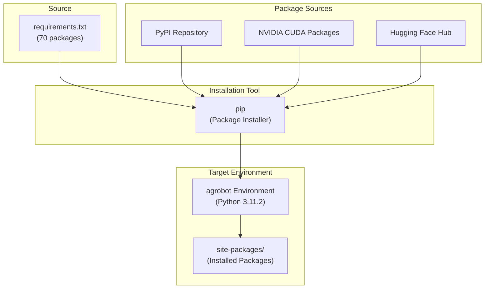
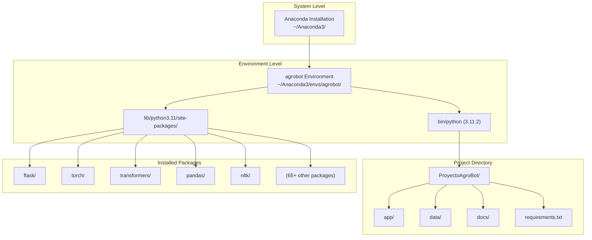

# Installation and Setup

> **Relevant source files**
> * [.gitignore](https://github.com/axchisan/ProyectoAgroBot/blob/bc782fcf/.gitignore)
> * [docs/README.md](https://github.com/axchisan/ProyectoAgroBot/blob/bc782fcf/docs/README.md)
> * [requirements.txt](https://github.com/axchisan/ProyectoAgroBot/blob/bc782fcf/requirements.txt)

This document provides step-by-step instructions for installing prerequisites, creating the development environment, and installing dependencies required to run Agrobot locally. This covers the initial setup only; for training the intent classification model, see [Training the Intent Classifier](/axchisan/ProyectoAgroBot/2.2-training-the-intent-classifier). For instructions on starting the application, see [Running the Application](/axchisan/ProyectoAgroBot/2.3-running-the-application). For production deployment using Docker, see [Docker Deployment](/axchisan/ProyectoAgroBot/2.4-docker-deployment).

## Overview

Agrobot uses Anaconda for Python environment management and requires Python 3.11.2 specifically. The installation process involves installing Anaconda, creating an isolated virtual environment, and installing Python dependencies from `requirements.txt`. The setup creates a reproducible development environment that isolates project dependencies from the system Python installation.

## System Requirements

The following table lists the minimum requirements for running Agrobot:

| Component | Requirement | Notes |
| --- | --- | --- |
| Operating System | Windows (64-bit), macOS, or Linux | Windows 64-bit recommended |
| Anaconda | Version 24.9.2 or higher | Individual Edition |
| Python | 3.11.2 (exact version) | Managed by Anaconda |
| RAM | 4 GB minimum, 8 GB recommended | For model training |
| Disk Space | 5 GB minimum | For environment and dependencies |
| Internet Connection | Required | For downloading dependencies |
| Web Browser | Modern browser | Chrome, Firefox, Edge, or Safari |

**Sources:** [docs/README.md L34-L40](https://github.com/axchisan/ProyectoAgroBot/blob/bc782fcf/docs/README.md#L34-L40)

## Installation Process Overview

The following diagram illustrates the complete installation workflow:

```

```

**Diagram: Complete Installation Workflow**

**Sources:** [docs/README.md L42-L143](https://github.com/axchisan/ProyectoAgroBot/blob/bc782fcf/docs/README.md#L42-L143)

## Step 1: Install Anaconda

Anaconda provides the Python distribution and environment management tools required for Agrobot.

### Download Anaconda

1. Visit the official Anaconda download page: `https://www.anaconda.com/download`
2. Select the **Individual Edition** for your operating system
3. For Windows users: download the 64-bit installer (e.g., `Anaconda3-2023.XX-Windows-x86_64.exe`)
4. Ensure you download version 24.9.2 or higher

### Execute the Installer

1. Run the downloaded installer executable
2. Accept the license terms
3. Choose installation type: * **"Just Me"**: Personal installation (recommended for most users) * **"All Users"**: System-wide installation (requires administrator privileges)
4. Select installation directory (default: `C:\Users\<Username>\Anaconda3` on Windows)
5. **Important**: Check the option to add Anaconda to the system PATH environment variable
6. Complete the installation and wait for all components to install

### Verify Installation

Open **Anaconda Prompt** (Windows) or a terminal (macOS/Linux) and execute:

```

```

Expected output: `conda 23.7.4` or similar (version may vary)

**Sources:** [docs/README.md L46-L67](https://github.com/axchisan/ProyectoAgroBot/blob/bc782fcf/docs/README.md#L46-L67)

## Step 2: Create Virtual Environment

Agrobot uses an isolated Conda environment named `agrobot` to manage its dependencies separately from the system Python installation.

### Environment Creation

1. Open **Anaconda Prompt** (Windows) or terminal (macOS/Linux)
2. Create the environment with the specific Python version:

```

```

1. Confirm the installation when prompted by typing `y` and pressing Enter
2. Wait for Conda to resolve dependencies and create the environment

### Activate the Environment

Activate the newly created environment:

```

```

The command prompt should now display `(agrobot)` at the beginning of the line, indicating the environment is active.

### Verify Python Version

Confirm the correct Python version is installed:

```

```

Expected output: `Python 3.11.2` (exact version match required)

### Environment Management Commands

The following table lists useful environment management commands:

| Command | Purpose |
| --- | --- |
| `conda activate agrobot` | Activate the Agrobot environment |
| `conda deactivate` | Deactivate the current environment |
| `conda env list` | List all available environments |
| `conda env remove -n agrobot` | Delete the Agrobot environment |
| `conda info --envs` | Show detailed environment information |

**Sources:** [docs/README.md L69-L103](https://github.com/axchisan/ProyectoAgroBot/blob/bc782fcf/docs/README.md#L69-L103)

## Step 3: Install Project Dependencies

With the virtual environment activated, install all required Python packages from the project's dependency specification.

### Dependency Installation Process

The following diagram shows how dependencies are installed and managed:



**Diagram: Dependency Installation Flow**

### Installation Command

Ensure the `agrobot` environment is activated, then execute:

```

```

This command installs all dependencies specified in [requirements.txt L1-L69](https://github.com/axchisan/ProyectoAgroBot/blob/bc782fcf/requirements.txt#L1-L69)

 The installation process may take 10-15 minutes depending on network speed and system performance.

**Sources:** [docs/README.md L105-L116](https://github.com/axchisan/ProyectoAgroBot/blob/bc782fcf/docs/README.md#L105-L116)

 [requirements.txt L1-L69](https://github.com/axchisan/ProyectoAgroBot/blob/bc782fcf/requirements.txt#L1-L69)

## Key Dependencies

The following table categorizes the major dependencies installed from `requirements.txt`:

| Category | Packages | Purpose |
| --- | --- | --- |
| **Web Framework** | Flask (3.1.1), Werkzeug (3.1.3), Jinja2 (3.1.6) | Web application server and templating |
| **Machine Learning** | torch (2.7.0), transformers (4.52.3), huggingface-hub (0.32.0) | PyTorch framework and Transformers library for NLP |
| **NLP Processing** | nltk (3.9.1), tokenizers (0.21.1), regex (2024.11.6) | Text processing and tokenization |
| **Data Processing** | pandas (2.2.3), numpy (2.2.6), openpyxl (3.1.5) | DataFrame operations and Excel file handling |
| **Scientific Computing** | scikit-learn (1.6.1), scipy (1.15.3), sympy (1.14.0) | Machine learning utilities and mathematical operations |
| **Visualization** | matplotlib (3.10.3) | Data visualization and charts |
| **NVIDIA CUDA** | nvidia-cuda-runtime-cu12, nvidia-cudnn-cu12, etc. | GPU acceleration support (optional) |
| **Utilities** | requests (2.32.3), python-dotenv (1.0.1), PyYAML (6.0.2) | HTTP requests, environment variables, configuration |
| **Model Acceleration** | accelerate (1.7.0), safetensors (0.5.3) | Model loading and training optimization |

**Sources:** [requirements.txt L1-L69](https://github.com/axchisan/ProyectoAgroBot/blob/bc782fcf/requirements.txt#L1-L69)

## Post-Installation Environment Structure

After successful installation, the following environment structure is created:



**Diagram: Post-Installation Environment Structure**

**Sources:** [docs/README.md L144-L153](https://github.com/axchisan/ProyectoAgroBot/blob/bc782fcf/docs/README.md#L144-L153)

## Project Directory Structure

After cloning or downloading the repository, the project directory contains the following structure:

| Directory/File | Description |
| --- | --- |
| `app/` | Flask application code, including routes, chatbot core, and processors |
| `data/` | Agricultural datasets in CSV format and knowledge base JSON files |
| `docs/` | Project documentation including README and guides |
| `requirements.txt` | Python package dependencies specification |
| `.gitignore` | Git ignore rules for excluded files and directories |
| `train_intent_classifier.py` | Model training script (run in next step) |
| `app.py` / `main.py` | Flask application entry points |

**Sources:** [docs/README.md L144-L153](https://github.com/axchisan/ProyectoAgroBot/blob/bc782fcf/docs/README.md#L144-L153)

## Excluded Files and Directories

The `.gitignore` file specifies which files and directories are excluded from version control. These are typically generated during setup, training, or runtime:

| Pattern | Reason for Exclusion |
| --- | --- |
| `__pycache__/`, `*.pyc`, `*.pyo` | Python bytecode cache files |
| `venv/`, `env/`, `agrobot/` | Virtual environment directories |
| `results/` | Training checkpoint directory (generated during model training) |
| `app/models/intent_classifier/` | Trained model artifacts (must be generated locally) |
| `*.log`, `logs/` | Application log files |
| `.env` | Environment variables and API keys (sensitive data) |

These directories and files are created during the setup process in [Training the Intent Classifier](/axchisan/ProyectoAgroBot/2.2-training-the-intent-classifier) and [Running the Application](/axchisan/ProyectoAgroBot/2.3-running-the-application).

**Sources:** [.gitignore L1-L54](https://github.com/axchisan/ProyectoAgroBot/blob/bc782fcf/.gitignore#L1-L54)

## Verification Steps

After completing the installation, verify the setup with the following checks:

### 1. Verify Environment Activation

```

```

Expected: Prompt displays `(agrobot)` prefix

### 2. Verify Python Version

```

```

Expected output: `Python 3.11.2`

### 3. Verify Core Packages

```

```

Expected output should include:

* `Flask 3.1.1`
* `torch 2.7.0`
* `transformers 4.52.3`

### 4. Verify Project Structure

Check that the project directory contains:

* `app/` directory
* `data/` directory
* `requirements.txt` file
* `train_intent_classifier.py` file

### 5. Test Python Import

```

```

Expected output: `All core packages imported successfully`

**Sources:** [docs/README.md L61-L93](https://github.com/axchisan/ProyectoAgroBot/blob/bc782fcf/docs/README.md#L61-L93)

## Troubleshooting Common Issues

| Issue | Possible Cause | Solution |
| --- | --- | --- |
| `conda: command not found` | Anaconda not added to PATH | Add Anaconda to PATH or use Anaconda Prompt |
| `Python version mismatch` | Wrong environment activated | Ensure `conda activate agrobot` was executed |
| `pip install fails` | Network issues or package conflicts | Check internet connection; try `pip install --upgrade pip` |
| `CUDA packages fail` | No NVIDIA GPU | Acceptable; CPU-only mode will be used |
| `Permission denied` | Insufficient privileges | Run as administrator or use `--user` flag |
| `Package version conflicts` | Incompatible dependency versions | Use exact requirements.txt versions |

## Next Steps

With the environment successfully configured and dependencies installed, proceed to:

1. **[Training the Intent Classifier](/axchisan/ProyectoAgroBot/2.2-training-the-intent-classifier)**: Train the BERT-based Spanish intent classification model using `train_intent_classifier.py`
2. **[Running the Application](/axchisan/ProyectoAgroBot/2.3-running-the-application)**: Start the Flask development server and access the web interface
3. **[Docker Deployment](/axchisan/ProyectoAgroBot/2.4-docker-deployment)**: Alternative deployment using Docker containers (optional)

The trained model artifacts created in step 2.2 are required before the application can process natural language queries.

**Sources:** [docs/README.md L118-L143](https://github.com/axchisan/ProyectoAgroBot/blob/bc782fcf/docs/README.md#L118-L143)