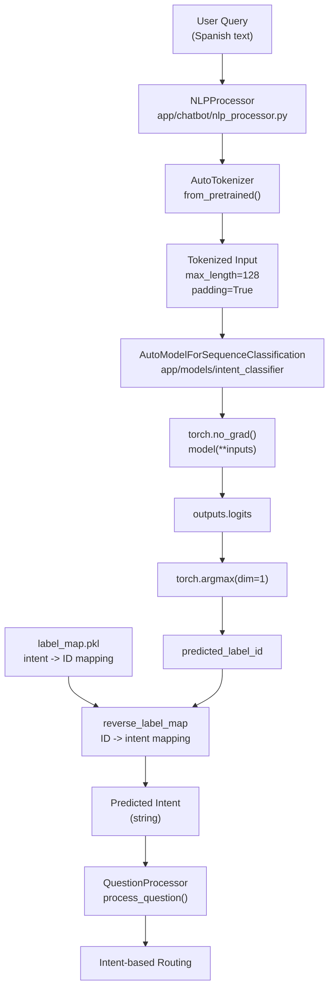
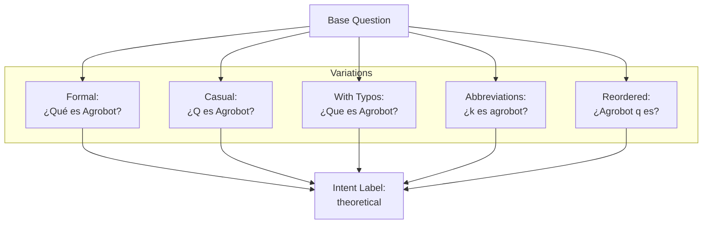
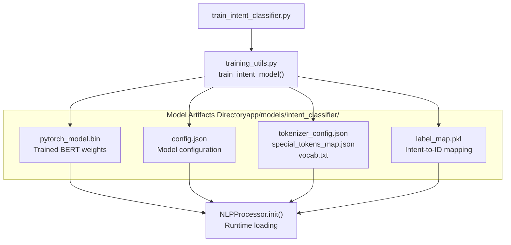
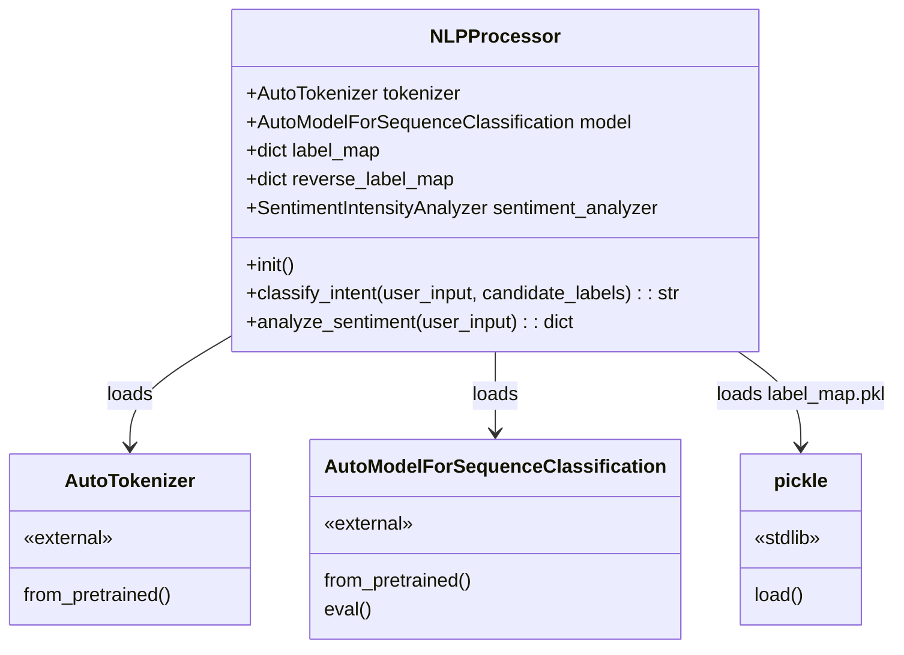
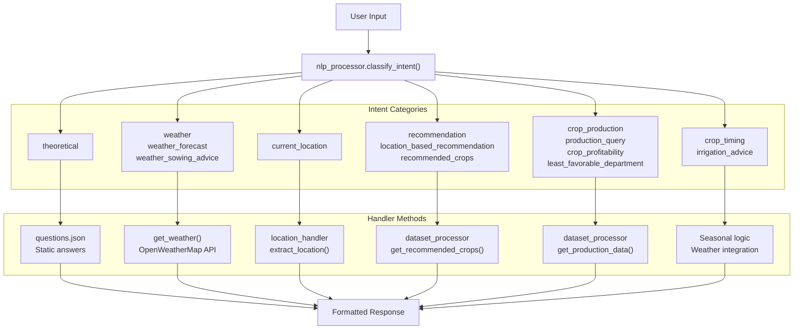

# Intent Classification Model

> **Relevant source files**
> * [app/chatbot/nlp_processor.py](https://github.com/axchisan/ProyectoAgroBot/blob/bc782fcf/app/chatbot/nlp_processor.py)
> * [train_intent_classifier.py](https://github.com/axchisan/ProyectoAgroBot/blob/bc782fcf/train_intent_classifier.py)

## Purpose and Scope

This document describes the BERT-based intent classification model that powers Agrobot's natural language understanding capabilities. The model analyzes user queries in Spanish and classifies them into one of 14 intent categories, enabling the chatbot to route questions to appropriate specialized handlers.

For information about the training process and pipeline, see [Model Training Pipeline](/axchisan/ProyectoAgroBot/8.3-model-training-pipeline). For details on how training data is structured and augmented, see [Training Data and Process](/axchisan/ProyectoAgroBot/8.2-training-data-and-process). For runtime integration and inference, see [Model Deployment and Inference](/axchisan/ProyectoAgroBot/8.4-model-deployment-and-inference). For the broader chatbot architecture, see [Chatbot Core System](/axchisan/ProyectoAgroBot/4-chatbot-core-system).

**Sources:** [train_intent_classifier.py L1-L289](https://github.com/axchisan/ProyectoAgroBot/blob/bc782fcf/train_intent_classifier.py#L1-L289)

 [app/chatbot/nlp_processor.py L1-L28](https://github.com/axchisan/ProyectoAgroBot/blob/bc782fcf/app/chatbot/nlp_processor.py#L1-L28)

---

## Model Architecture

The intent classification model is based on **dccuchile/bert-base-spanish**, a Spanish BERT model fine-tuned for sequence classification. The model architecture consists of:

| Component | Description |
| --- | --- |
| **Base Model** | `dccuchile/bert-base-spanish` - Pre-trained BERT for Spanish language |
| **Task Head** | Sequence classification layer with 14 output classes |
| **Tokenizer** | Spanish BERT tokenizer with max length 128 tokens |
| **Output** | Softmax probability distribution over 14 intent classes |

The model is trained using Hugging Face's `AutoModelForSequenceClassification` and stored in `app/models/intent_classifier/` directory after training.

**Sources:** [app/chatbot/nlp_processor.py L11-L12](https://github.com/axchisan/ProyectoAgroBot/blob/bc782fcf/app/chatbot/nlp_processor.py#L11-L12)

---

## Intent Classification Flow



**Sources:** [app/chatbot/nlp_processor.py L19-L25](https://github.com/axchisan/ProyectoAgroBot/blob/bc782fcf/app/chatbot/nlp_processor.py#L19-L25)

---

## Intent Categories

The model classifies user queries into 14 distinct intent types, organized into five functional categories:

### Agricultural Knowledge

| Intent | Purpose | Example Queries |
| --- | --- | --- |
| `theoretical` | General agricultural concepts and theory | "¿Qué es agroecología?", "¿Cómo funciona agricultura sostenible?" |

### Weather and Climate

| Intent | Purpose | Example Queries |
| --- | --- | --- |
| `weather` | Current weather conditions | "¿Cuál es clima Bogotá?", "¿Está lloviendo Medellín?" |
| `weather_forecast` | Future weather predictions | "¿Clima mañana Bogotá?", "¿Pronóstico Medellín?" |
| `weather_sowing_advice` | Weather-based planting advice | "¿Clima para sembrar Bogotá?", "¿Bueno sembrar clima frio?" |

### Location Context

| Intent | Purpose | Example Queries |
| --- | --- | --- |
| `current_location` | User location identification | "¿Dónde estoy?", "¿Estoy Antioquia?" |

### Crop Recommendations

| Intent | Purpose | Example Queries |
| --- | --- | --- |
| `recommendation` | General crop recommendations | "¿Qué siembro región?", "¿Cultivos departamento?" |
| `location_based_recommendation` | Department-specific recommendations | "¿Cultivo Antioquia?", "¿Qué sembrar en Cundinamarca?" |
| `recommended_crops` | Explicit crop recommendation requests | "¿Qué cultivos recomiendas Santander?", "¿Mejores cultivos Antioquia?" |

### Agricultural Data Queries

| Intent | Purpose | Example Queries |
| --- | --- | --- |
| `crop_profitability` | Crop profitability and economics | "¿Cultivo rentable Antioquia?", "¿Es más rentable maíz o yuca?" |
| `crop_production` | Production volume questions | "¿Donde producen más café?", "¿Producción tomate Cundinamarca?" |
| `production_query` | Specific production data with year/location | "¿Cuánto maíz Manizales 2020?", "¿Producción café Caldas 2019?" |
| `least_favorable_department` | Where crops perform poorly | "¿Dónde es menos favorable maíz?", "¿Dónde no sembrar café?" |

### Agricultural Timing

| Intent | Purpose | Example Queries |
| --- | --- | --- |
| `crop_timing` | When to plant specific crops | "¿Cuando siembro maíz?", "¿Q mes papa?" |
| `irrigation_advice` | Irrigation optimization and timing | "¿Cómo optimizo riego?", "¿Buen momento regar Bogotá?" |

**Sources:** [train_intent_classifier.py L4-L286](https://github.com/axchisan/ProyectoAgroBot/blob/bc782fcf/train_intent_classifier.py#L4-L286)

---

## Training Data Structure

The training dataset in [train_intent_classifier.py L4-L286](https://github.com/axchisan/ProyectoAgroBot/blob/bc782fcf/train_intent_classifier.py#L4-L286)

 contains 400+ question-intent pairs with intentional variations to improve robustness:

### Data Augmentation Strategies



### Example Training Patterns

| Pattern Type | Examples | Count |
| --- | --- | --- |
| **Theoretical questions** | Agrobot definition, agricultural concepts, techniques | 77 variations |
| **Weather queries** | Multiple cities, current/forecast, sowing advice | 35 variations |
| **Location questions** | Current location, department identification | 16 variations |
| **Crop recommendations** | General, location-based, explicit recommendations | 42 variations |
| **Profitability queries** | By department, by crop, comparative questions | 37 variations |
| **Production queries** | Current production, historical data, regional statistics | 35 variations |
| **Timing questions** | Planting schedules, irrigation timing | 25 variations |

The augmentation includes:

* **Formal vs. casual language**: "¿Qué" vs "¿Q" vs "¿k"
* **Spelling variations**: "Que" vs "Qué", "agricutura" vs "agricultura"
* **Word order variations**: "¿Qué es X?" vs "¿X q es?"
* **Context-specific terms**: Multiple city names, crop types, departments

**Sources:** [train_intent_classifier.py L4-L286](https://github.com/axchisan/ProyectoAgroBot/blob/bc782fcf/train_intent_classifier.py#L4-L286)

---

## Model Artifacts

After training, the model produces three essential artifacts stored in `app/models/intent_classifier/`:

### Artifact Structure



| Artifact | Purpose | Usage |
| --- | --- | --- |
| **pytorch_model.bin** | Trained model weights | Loaded by `AutoModelForSequenceClassification.from_pretrained()` |
| **config.json** | Model configuration (layers, hidden size, etc.) | Automatically loaded with model |
| **Tokenizer files** | Vocabulary and tokenization rules | Loaded by `AutoTokenizer.from_pretrained()` |
| **label_map.pkl** | Maps intent strings to numeric IDs | Used for reverse mapping during inference |

**Sources:** [app/chatbot/nlp_processor.py L11-L16](https://github.com/axchisan/ProyectoAgroBot/blob/bc782fcf/app/chatbot/nlp_processor.py#L11-L16)

---

## NLPProcessor Class

The `NLPProcessor` class [app/chatbot/nlp_processor.py L9-L28](https://github.com/axchisan/ProyectoAgroBot/blob/bc782fcf/app/chatbot/nlp_processor.py#L9-L28)

 encapsulates model loading and inference:

### Initialization



### Key Methods

#### classify_intent()

The `classify_intent` method [app/chatbot/nlp_processor.py L19-L25](https://github.com/axchisan/ProyectoAgroBot/blob/bc782fcf/app/chatbot/nlp_processor.py#L19-L25)

 performs inference:

1. **Tokenization**: Converts input text to token IDs with padding and truncation
2. **Inference**: Runs forward pass through BERT model (no gradient computation)
3. **Prediction**: Applies argmax to logits to get predicted class ID
4. **Mapping**: Converts numeric ID back to intent string using reverse label map

```markdown
# Inference process (conceptual representation)
inputs = tokenizer(user_input, return_tensors="pt", padding=True, truncation=True, max_length=128)
outputs = model(**inputs)
predicted_label_id = torch.argmax(outputs.logits, dim=1).item()
predicted_label = reverse_label_map[predicted_label_id]
```

The method signature includes `candidate_labels` parameter (currently unused) for potential future zero-shot classification enhancements.

**Sources:** [app/chatbot/nlp_processor.py L9-L28](https://github.com/axchisan/ProyectoAgroBot/blob/bc782fcf/app/chatbot/nlp_processor.py#L9-L28)

---

## Intent-to-Handler Routing

Once an intent is classified, the `QuestionProcessor` routes it to specialized handlers:



### Handler Mapping

| Intent Pattern | Handler Component | Data Source |
| --- | --- | --- |
| `theoretical` | Static knowledge base | [questions.json](https://github.com/axchisan/ProyectoAgroBot/blob/bc782fcf/questions.json) <br>  theoretical section |
| `weather*` | Weather API integration | OpenWeatherMap + location context |
| `current_location` | Location extraction | Nominatim API + context analysis |
| `*recommendation*` | Agricultural datasets | CSV data via DatasetProcessor |
| `*production*`, `*profitability*` | Production statistics | CSV data queries with aggregation |
| `crop_timing`, `irrigation_advice` | Timing logic + weather | Seasonal rules + current weather |

**Sources:** [train_intent_classifier.py L4-L286](https://github.com/axchisan/ProyectoAgroBot/blob/bc782fcf/train_intent_classifier.py#L4-L286)

 [app/chatbot/nlp_processor.py L19-L25](https://github.com/axchisan/ProyectoAgroBot/blob/bc782fcf/app/chatbot/nlp_processor.py#L19-L25)

---

## Model Performance Characteristics

### Input Requirements

| Parameter | Value | Purpose |
| --- | --- | --- |
| **Language** | Spanish | Matches Colombian farmer target audience |
| **Max Length** | 128 tokens | Sufficient for typical questions, optimizes memory |
| **Padding** | Dynamic | Enables batch processing if needed |
| **Truncation** | Enabled | Handles edge cases with long inputs |

### Runtime Behavior

The model operates in evaluation mode (`model.eval()`) with gradient computation disabled (`torch.no_grad()`) for optimal inference performance. The label mapping uses pickle serialization for fast loading at initialization.

**Key Design Decisions:**

* **Spanish BERT base**: Optimized for Colombian Spanish dialect and agricultural terminology
* **14 intents**: Balanced between specificity and generalization to avoid class confusion
* **Data augmentation**: Handles informal language, typos, and variations common in chat interfaces
* **Static model**: Pre-trained rather than continually learning to ensure consistent behavior

**Sources:** [app/chatbot/nlp_processor.py L11-L25](https://github.com/axchisan/ProyectoAgroBot/blob/bc782fcf/app/chatbot/nlp_processor.py#L11-L25)