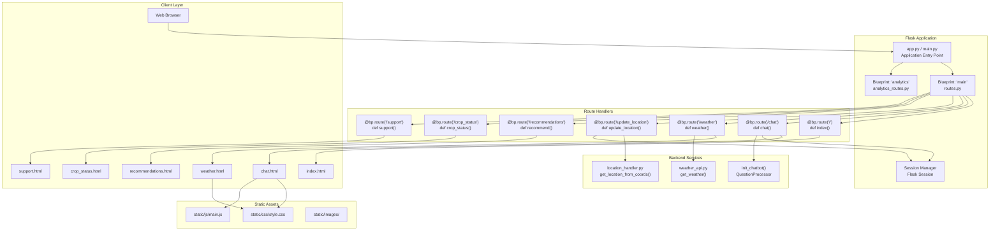
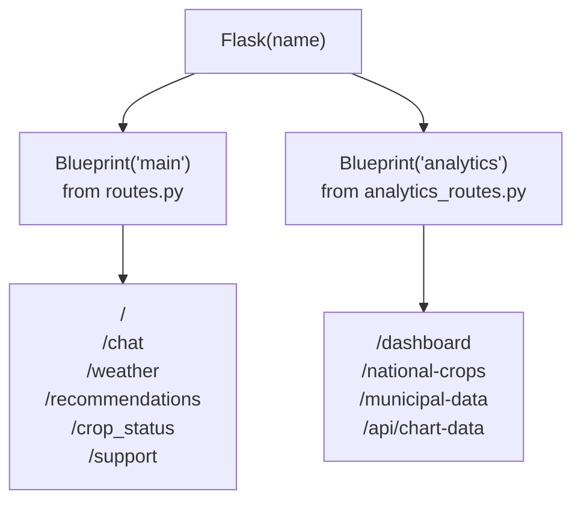
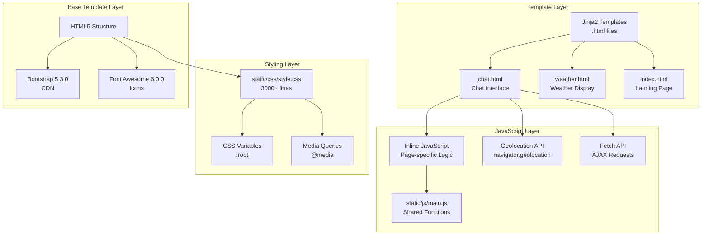
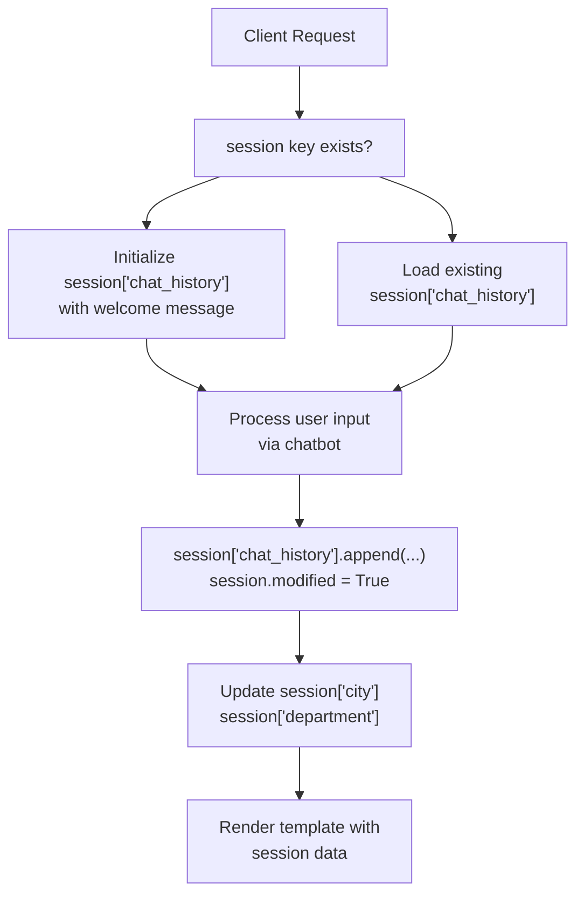
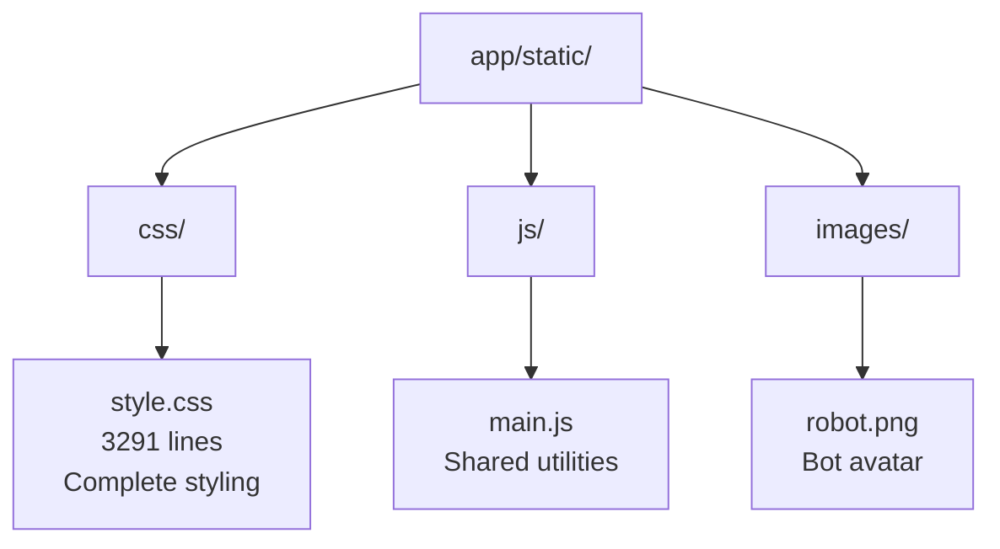
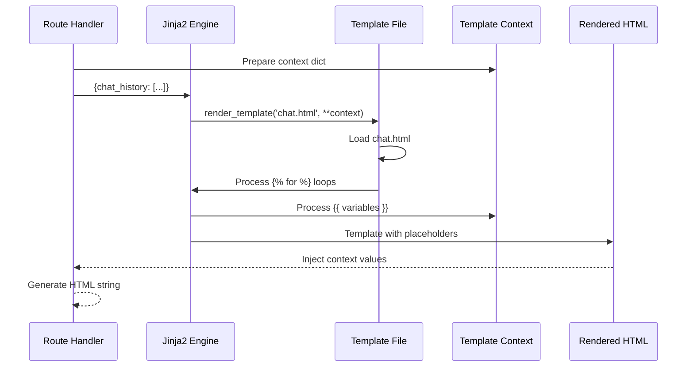

# Interfaz web

> **Archivos fuente relevantes**
> * [aplicación/chatbot/training_utils.py](https://github.com/axchisan/ProyectoAgroBot/blob/bc782fcf/app/chatbot/training_utils.py)
> * [aplicación/rutas/rutas.py](https://github.com/axchisan/ProyectoAgroBot/blob/bc782fcf/app/routes/routes.py)
> * [aplicación/estática/css/estilo.css](https://github.com/axchisan/ProyectoAgroBot/blob/bc782fcf/app/static/css/style.css)
> * [aplicación/plantillas/chat.html](https://github.com/axchisan/ProyectoAgroBot/blob/bc782fcf/app/templates/chat.html)
> * [docs/README.md](https://github.com/axchisan/ProyectoAgroBot/blob/bc782fcf/docs/README.md)

Este documento proporciona documentación técnica completa de la interfaz web de Agrobot, incluyendo la estructura de la aplicación Flask, los controladores de rutas, las plantillas frontend y las interacciones del lado del cliente. La interfaz web funciona como la capa principal de interacción del usuario, conectando a los agricultores con el sistema de chatbot agrícola y el panel de análisis.

Para obtener información sobre la inicialización y configuración de la aplicación Flask, consulte [Estructura de la aplicación Flask](/axchisan/ProyectoAgroBot/7.1-flask-application-structure) . Para obtener más información sobre la implementación de rutas individuales, consulte [Rutas principales](/axchisan/ProyectoAgroBot/7.2-main-routes) y [Panel de análisis](/axchisan/ProyectoAgroBot/7.3-analytics-dashboard) . Para consultar la documentación de la plantilla frontend, consulte [Interfaz de chat](/axchisan/ProyectoAgroBot/7.4-chat-interface) y [Componentes frontend](/axchisan/ProyectoAgroBot/7.5-frontend-components) .

## Descripción general de la arquitectura

La interfaz web sigue un patrón tradicional Modelo-Vista-Controlador (MVC) implementado con Flask. La aplicación utiliza renderizado del lado del servidor con plantillas Jinja2, optimizadas con JavaScript del lado del cliente para interacciones dinámicas.



**Fuentes:** [routes.py L1-L191](https://github.com/axchisan/ProyectoAgroBot/blob/bc782fcf/app/routes/routes.py#L1-L191)

 [chat.html L1-L248](https://github.com/axchisan/ProyectoAgroBot/blob/bc782fcf/app/templates/chat.html#L1-L248)

 [docs/README.md L1-L173](https://github.com/axchisan/ProyectoAgroBot/blob/bc782fcf/docs/README.md#L1-L173)

## Estructura de la aplicación Flask

La aplicación Flask se organiza utilizando el patrón Blueprint para lograr modularidad. El punto de entrada de la aplicación inicializa la instancia de Flask, registra los blueprints y configura el sistema de gestión de sesiones.

### Inicialización de la aplicación

El archivo principal de la aplicación ([aplicación/principal.py](https://github.com/axchisan/ProyectoAgroBot/blob/bc782fcf/app/main.py)

o[aplicación.py](https://github.com/axchisan/ProyectoAgroBot/blob/bc782fcf/app.py)

) crea la instancia de la aplicación Flask y registra dos planos principales:

* **`main`Plano** : gestiona las principales rutas de cara al usuario (chat, clima, recomendaciones)
* **`analytics`Blueprint** : gestiona las rutas de visualización y generación de informes de datos.

### Registro de planos



El plano en[routes.py L8](https://github.com/axchisan/ProyectoAgroBot/blob/bc782fcf/app/routes/routes.py#L8-L8)

se inicializa con `bp = Blueprint('main', __name__)`, mientras que el plan de análisis se define en un módulo separado para la separación de preocupaciones.

**Fuentes:** [routes.py L8](https://github.com/axchisan/ProyectoAgroBot/blob/bc782fcf/app/routes/routes.py#L8-L8)

 [docs/README.md L147-L153](https://github.com/axchisan/ProyectoAgroBot/blob/bc782fcf/docs/README.md#L147-L153)

## Flujo de solicitud/respuesta

El siguiente diagrama ilustra cómo fluye una solicitud HTTP a través de las capas de aplicación, desde el navegador hasta los servicios backend y viceversa.

```mermaid
sequenceDiagram
  participant Browser
  participant Flask App
  participant main.py
  participant Route Handler
  participant routes.py
  participant Flask Session
  participant Jinja2 Template
  participant init_chatbot()
  participant processor
  participant weather_api.py

  Browser->>Flask App: POST /chat
  Flask App->>Route Handler: @bp.route('/chat', methods=['POST'])
  Route Handler->>Flask Session: session.get('chat_history')
  Flask Session-->>Route Handler: chat_history list
  Route Handler->>Route Handler: user_input = request.form.get('user_input')
  Route Handler->>Flask Session: city = session.get('city', 'Guavatá')
  Route Handler->>Flask Session: department = session.get('department')
  Route Handler->>init_chatbot(): processor.process_question(user_input, city, department)
  init_chatbot()-->>Route Handler: response string
  Route Handler->>Flask Session: session['chat_history'].append(...)
  Route Handler->>Flask Session: session.modified = True
  Route Handler->>Jinja2 Template: render_template('chat.html', chat_history)
  Jinja2 Template-->>Route Handler: HTML response
  Route Handler-->>Flask App: HTML
  Flask App-->>Browser: HTTP 200 with HTML
  Browser->>Browser: JavaScript: chatMessages.scrollTop = scrollHeight
```

**Fuentes:** [routes.py L17-L45](https://github.com/axchisan/ProyectoAgroBot/blob/bc782fcf/app/routes/routes.py#L17-L45)

 [chat.html L184-L246](https://github.com/axchisan/ProyectoAgroBot/blob/bc782fcf/app/templates/chat.html#L184-L246)

## Organización de rutas

Las rutas de aplicación se organizan en grupos funcionales según su propósito.

### Rutas principales

| Ruta | Método | Función del controlador | Plantilla | Objetivo |
| --- | --- | --- | --- | --- |
| `/` | CONSEGUIR | `index()` | `index.html` | Página de destino |
| `/chat` | OBTENER, PUBLICAR | `chat()` | `chat.html` | Interfaz de chat con chatbot |
| `/clear_chat` | CONSEGUIR | `clear_chat()` | Redirigir | Restablecer el historial de conversaciones |
| `/weather` | CONSEGUIR | `weather()` | `weather.html` | Visualización de información meteorológica |
| `/refresh_weather` | CONSEGUIR | `refresh_weather()` | JSON | Punto final AJAX para actualizaciones meteorológicas |
| `/update_location` | CORREO | `update_location()` | JSON | Actualizar la ubicación del usuario a partir de las coordenadas |
| `/recommendations` | CONSEGUIR | `recommend()` | `recommendations.html` | Recomendaciones de cultivos |
| `/crop_status` | CONSEGUIR | `crop_status()` | `crop_status.html` | Estado de salud de los cultivos |
| `/support` | CONSEGUIR | `support()` | `support.html` | Ayuda y soporte |

### Detalles de implementación de la ruta

**Ruta del índice** [routes.py L13-L15](https://github.com/axchisan/ProyectoAgroBot/blob/bc782fcf/app/routes/routes.py#L13-L15)

```python
@bp.route('/')
def index():
    return render_template('index.html')
```

Página de destino sencilla que presenta Agrobot y proporciona navegación a la interfaz de chat.

**Ruta de chat** [routes.py L17-L45](https://github.com/axchisan/ProyectoAgroBot/blob/bc782fcf/app/routes/routes.py#L17-L45)

La ruta de chat maneja solicitudes GET y POST:

* **OBTENER** : Representa la interfaz de chat con el historial de conversaciones existente
* **POST** : Procesa la entrada del usuario a través del chatbot y actualiza la sesión.

Gestión de sesiones en[routes.py L19-L22](https://github.com/axchisan/ProyectoAgroBot/blob/bc782fcf/app/routes/routes.py#L19-L22)

:

```
if 'chat_history' not in session:
    session['chat_history'] = [
        {"role": "agrobot", "message": "Hola, soy AGROBOT 🌱. ¿Cómo puedo ayudarte hoy?", "timestamp": datetime.now().strftime('%H:%M')}
    ]
```

**Ruta meteorológica** [routes.py L56-L103](https://github.com/axchisan/ProyectoAgroBot/blob/bc782fcf/app/routes/routes.py#L56-L103)

Fetches current weather data and 7-day forecast from OpenWeatherMap API. The route aggregates multiple data sources:

* Current weather conditions
* Sowing recommendations based on weather
* Irrigation advice based on humidity
* 7-day forecast data

**Update Location Route** [app/routes/routes.py L154-L168](https://github.com/axchisan/ProyectoAgroBot/blob/bc782fcf/app/routes/routes.py#L154-L168)

Handles geolocation updates from client-side JavaScript. Receives latitude/longitude coordinates, uses Nominatim API to reverse geocode to city/department names, and stores in session.

**Sources:** [app/routes/routes.py L1-L191](https://github.com/axchisan/ProyectoAgroBot/blob/bc782fcf/app/routes/routes.py#L1-L191)

## Frontend Architecture

The frontend uses server-side rendered templates with progressive enhancement via JavaScript. The architecture follows a responsive design pattern with mobile-first considerations.



**Sources:** [app/templates/chat.html L1-L248](https://github.com/axchisan/ProyectoAgroBot/blob/bc782fcf/app/templates/chat.html#L1-L248)

 [app/static/css/style.css L1-L3291](https://github.com/axchisan/ProyectoAgroBot/blob/bc782fcf/app/static/css/style.css#L1-L3291)

### CSS Architecture

The stylesheet is organized hierarchically with CSS custom properties for theming:

**CSS Variables** [app/static/css/style.css L5-L28](https://github.com/axchisan/ProyectoAgroBot/blob/bc782fcf/app/static/css/style.css#L5-L28)

```css
:root {
  --primary-green: #4a7c59;
  --secondary-green: #6b9b7a;
  --accent-orange: #f4a261;
  --warm-beige: #f4f1e8;
  --shadow-light: 0 2px 10px rgba(0, 0, 0, 0.1);
  --border-radius: 16px;
  --transition: all 0.3s cubic-bezier(0.4, 0, 0.2, 1);
  --container-max-width: 1200px;
}
```

**Responsive Breakpoints** [app/static/css/style.css L2029-L2526](https://github.com/axchisan/ProyectoAgroBot/blob/bc782fcf/app/static/css/style.css#L2029-L2526)

* Extra Large: ≥1400px
* Large: 1200px - 1399px
* Medium: 992px - 1199px
* Small: 768px - 991px
* Extra Small: 576px - 767px
* Mobile: <575px

### Chat Interface Components

The chat interface is implemented in [app/templates/chat.html L1-L248](https://github.com/axchisan/ProyectoAgroBot/blob/bc782fcf/app/templates/chat.html#L1-L248)

 with several key components:

**Header Component** [app/templates/chat.html L15-L36](https://github.com/axchisan/ProyectoAgroBot/blob/bc782fcf/app/templates/chat.html#L15-L36)

* Back button to return to landing page
* Bot avatar with online status indicator
* Bot name and status display
* Menu toggle button

**Messages Container** [app/templates/chat.html L39-L72](https://github.com/axchisan/ProyectoAgroBot/blob/bc782fcf/app/templates/chat.html#L39-L72)

```html
<div class="chat-messages" id="chatMessages">
    
        <div class="message-wrapper {{ 'user-message' if message.role == 'user' else 'bot-message' }}">
            <!-- Message content -->
        </div>
    
</div>
```

**Quick Actions** [app/templates/chat.html L75-L98](https://github.com/axchisan/ProyectoAgroBot/blob/bc782fcf/app/templates/chat.html#L75-L98)

Horizontal scrollable chips for quick access to:

* Analytics Dashboard (`/analytics/dashboard`)
* Weather (`/weather`)
* Recommendations (`/recommend`)
* Crop Status (`/crop_status`)
* Support (`/support`)

**Input Area** [app/templates/chat.html L101-L127](https://github.com/axchisan/ProyectoAgroBot/blob/bc782fcf/app/templates/chat.html#L101-L127)

* Form with POST method to `/chat` route
* Text input field with placeholder
* Send button with paper plane icon
* Optional voice and clear buttons

**Sources:** [app/templates/chat.html L1-L248](https://github.com/axchisan/ProyectoAgroBot/blob/bc782fcf/app/templates/chat.html#L1-L248)

 [app/static/css/style.css L220-L567](https://github.com/axchisan/ProyectoAgroBot/blob/bc782fcf/app/static/css/style.css#L220-L567)

## Session Management

Flask session is used to maintain stateful information across requests. The session stores conversation history and user location context.



### Session Keys

| Key | Type | Purpose | Example Value |
| --- | --- | --- | --- |
| `chat_history` | List[Dict] | Conversation messages | `[{"role": "agrobot", "message": "...", "timestamp": "12:00"}]` |
| `city` | String | User's city location | `"Guavatá"` |
| `department` | String | User's department/state | `"Santander"` |
| `lat` | Float | Latitude coordinate | `6.3645` |
| `lon` | Float | Longitude coordinate | `-73.6824` |

### Session Lifecycle

**Initialization** [app/routes/routes.py L19-L22](https://github.com/axchisan/ProyectoAgroBot/blob/bc782fcf/app/routes/routes.py#L19-L22)

```
if 'chat_history' not in session:
    session['chat_history'] = [
        {"role": "agrobot", "message": "Hola, soy AGROBOT 🌱. ¿Cómo puedo ayudarte hoy?", 
         "timestamp": datetime.now().strftime('%H:%M')}
    ]
```

**Update** [app/routes/routes.py L34-L36](https://github.com/axchisan/ProyectoAgroBot/blob/bc782fcf/app/routes/routes.py#L34-L36)

```
session['chat_history'].append({"role": "user", "message": user_input, "timestamp": datetime.now().strftime('%H:%M')})
session['chat_history'].append({"role": "agrobot", "message": response, "timestamp": datetime.now().strftime('%H:%M')})
session.modified = True
```

**Clear** [app/routes/routes.py L47-L53](https://github.com/axchisan/ProyectoAgroBot/blob/bc782fcf/app/routes/routes.py#L47-L53)

```python
@bp.route('/clear_chat', methods=['GET'])
def clear_chat():
    session['chat_history'] = [
        {"role": "agrobot", "message": "Hola, soy AGROBOT 🌱. ¿Cómo puedo ayudarte hoy?", 
         "timestamp": datetime.now().strftime('%H:%M')}
    ]
    session.modified = True
    return redirect(url_for('main.chat'))
```

**Sources:** [app/routes/routes.py L17-L53](https://github.com/axchisan/ProyectoAgroBot/blob/bc782fcf/app/routes/routes.py#L17-L53)

## Client-Side JavaScript Interactions

The chat interface uses vanilla JavaScript for dynamic functionality. The implementation focuses on user experience enhancements without requiring a heavy frontend framework.

### Geolocation Integration

The chat page automatically requests the user's location on load [app/templates/chat.html L208-L244](https://github.com/axchisan/ProyectoAgroBot/blob/bc782fcf/app/templates/chat.html#L208-L244)

:

```mermaid
sequenceDiagram
  participant Browser
  participant navigator.geolocation
  participant /update_location
  participant Flask Session

  Browser->>navigator.geolocation: getCurrentPosition()
  navigator.geolocation-->>Browser: position.coords (lat, lon)
  Browser->>Browser: console.log(coordinates)
  Browser->>/update_location: POST /update_location
  /update_location->>/update_location: { lat: ..., lon: ... }
  /update_location->>Flask Session: get_location_from_coords(lat, lon)
  /update_location->>Flask Session: session['city'] = city
  /update_location-->>Browser: session['department'] = department
  loop [Error Case]
    navigator.geolocation-->>Browser: { success: true }
    Browser->>Browser: error.message
  end
```

**JavaScript Implementation** [app/templates/chat.html L208-L244](https://github.com/axchisan/ProyectoAgroBot/blob/bc782fcf/app/templates/chat.html#L208-L244)

```javascript
if (navigator.geolocation) {
    navigator.geolocation.getCurrentPosition(
        function(position) {
            const lat = position.coords.latitude;
            const lon = position.coords.longitude;
            fetch('/update_location', {
                method: 'POST',
                headers: {'Content-Type': 'application/json'},
                body: JSON.stringify({lat: lat, lon: lon})
            })
            .then(response => response.json())
            .then(data => {
                if (data.success) {
                    console.log('Ubicación actualizada correctamente.');
                }
            })
        },
        function(error) {
            alert('No se pudo obtener tu ubicación. Por favor, indica tu ciudad manualmente.');
        }
    );
}
```

### Menu Overlay

The menu overlay provides access to additional features [app/templates/chat.html L130-L154](https://github.com/axchisan/ProyectoAgroBot/blob/bc782fcf/app/templates/chat.html#L130-L154)

:

**Toggle Function** [app/templates/chat.html L160-L163](https://github.com/axchisan/ProyectoAgroBot/blob/bc782fcf/app/templates/chat.html#L160-L163)

```javascript
function toggleMenu() {
    const overlay = document.getElementById('menuOverlay');
    overlay.classList.toggle('active');
}
```

**Menu Items:**

* Dashboard Analytics
* Datos de Cultivos
* Exportar chat (downloads JSON)
* Configuración
* Limpiar chat

### Chat Export Functionality

Users can export their conversation history as JSON [app/templates/chat.html L165-L177](https://github.com/axchisan/ProyectoAgroBot/blob/bc782fcf/app/templates/chat.html#L165-L177)

:

```javascript
function exportChat() {
    const chatHistory = {{ chat_history | tojson }};
    const dataStr = "data:text/json;charset=utf-8," + 
                    encodeURIComponent(JSON.stringify(chatHistory, null, 2));
    const downloadAnchorNode = document.createElement('a');
    downloadAnchorNode.setAttribute("href", dataStr);
    downloadAnchorNode.setAttribute("download", 
                                    "agrobot_chat_" + new Date().toISOString().split('T')[0] + ".json");
    document.body.appendChild(downloadAnchorNode);
    downloadAnchorNode.click();
    downloadAnchorNode.remove();
}
```

### Form Submission Handler

The chat form uses a submit handler to show typing indicator [app/templates/chat.html L192-L198](https://github.com/axchisan/ProyectoAgroBot/blob/bc782fcf/app/templates/chat.html#L192-L198)

:

```javascript
form.addEventListener('submit', (e) => {
    typingIndicator.classList.remove('d-none');
    setTimeout(() => {
        typingIndicator.classList.add('d-none');
    }, 2000);
});
```

**Sources:** [app/templates/chat.html L159-L246](https://github.com/axchisan/ProyectoAgroBot/blob/bc782fcf/app/templates/chat.html#L159-L246)

## Static Assets Organization

Static files are organized in the `app/static/` directory following Flask conventions.



### CSS File Structure

The [app/static/css/style.css](https://github.com/axchisan/ProyectoAgroBot/blob/bc782fcf/app/static/css/style.css)

 file is organized into logical sections:

| Lines | Section | Purpose |
| --- | --- | --- |
| 1-28 | CSS Variables | Colores del tema, espaciado, sombras |
| 30-43 | Reiniciar | Restablecimientos globales y estilos base |
| 52-218 | Página de destino | Sección de héroe, vista previa de características |
| 220-567 | Página de chat | Componentes de la interfaz de chat |
| 568-631 | Diseños de página | Estructura de página adaptable |
| 632-665 | Sistema de cuadrícula | Clases de cuadrícula responsivas |
| 667-917 | Página del tiempo | Componentes de la pantalla meteorológica |
| 918-1201 | Recomendaciones | Interfaz de usuario con recomendaciones de cultivos |
| 1202-1491 | Estado del cultivo | Interfaz de monitorización de estado |
| 1492-1789 | Página de soporte | Secciones de ayuda y preguntas frecuentes |
| 1808-1922 | Botones de acción | Componentes de botones reutilizables |
| 1923-1976 | Superposición de menú | Estilos del menú desplegable |
| 1977-2028 | Animaciones | Animaciones de fotogramas clave |
| 2029-2526 | Consultas de medios | Puntos de interrupción responsivos |
| 2628-2872 | Clases de utilidad | Clases de ayuda |

### Flujo de renderizado de plantillas



### Generación de URL

Las plantillas utilizan la función de Flask `url_for()`para la generación de URL dinámicas:

```
<a href="{{ url_for('main.index') }}" class="back-btn">
<a href="{{ url_for('analytics.dashboard') }}" class="chip">
<a href="{{ url_for('main.weather') }}" class="chip">
<form method="POST" action="{{ url_for('main.chat') }}">

```

Esto garantiza que las URL permanezcan correctas incluso si las rutas cambian.

**Fuentes:** [chat.html L17-L158](https://github.com/axchisan/ProyectoAgroBot/blob/bc782fcf/app/templates/chat.html#L17-L158)

 [style.css L1-L3291](https://github.com/axchisan/ProyectoAgroBot/blob/bc782fcf/app/static/css/style.css#L1-L3291)

## Manejo de errores y casos extremos

La interfaz web incluye varios mecanismos de manejo de errores:

### API meteorológica de respaldo

Cuando los datos meteorológicos no están disponibles[routes.py L103](https://github.com/axchisan/ProyectoAgroBot/blob/bc782fcf/app/routes/routes.py#L103-L103)

:

```
return render_template('weather.html', 
                      weather_data={"error": "No se pudo obtener el clima para " + city})
```

### Manejo de errores de geolocalización

Fallos de geolocalización del lado del cliente[chat.html L235-L239](https://github.com/axchisan/ProyectoAgroBot/blob/bc782fcf/app/templates/chat.html#L235-L239)

:

```
function(error) {
    console.error('Error al obtener la geolocalización:', error.message);
    alert('No se pudo obtener tu ubicación. Por favor, indica tu ciudad manualmente en el chat.');
}
```

### Valores predeterminados de la sesión

Valores de ubicación predeterminados cuando la sesión está vacía[routes.py L28-L29](https://github.com/axchisan/ProyectoAgroBot/blob/bc782fcf/app/routes/routes.py#L28-L29)

:

```
city = session.get('city', 'Guavatá')
department = session.get('department', 'Santander')
```

### Compatibilidad del navegador

La aplicación comprueba la compatibilidad con la geolocalización.[chat.html L208](https://github.com/axchisan/ProyectoAgroBot/blob/bc782fcf/app/templates/chat.html#L208-L208)

:

```javascript
if (navigator.geolocation) {
    // Use geolocation
} else {
    console.log('La geolocalización no está soportada en este navegador.');
    alert('Tu navegador no soporta geolocalización.');
}
```

**Fuentes:** [routes.py L24-L168](https://github.com/axchisan/ProyectoAgroBot/blob/bc782fcf/app/routes/routes.py#L24-L168)

 [chat.html L208-L244](https://github.com/axchisan/ProyectoAgroBot/blob/bc782fcf/app/templates/chat.html#L208-L244)

## Consideraciones de rendimiento

### Almacenamiento de sesiones

El historial de chat se almacena en la sesión de Flask, que utiliza cookies firmadas por defecto. En conversaciones largas, esto puede aumentar el tamaño de la solicitud/respuesta. La implementación actual no limita la longitud del historial, lo que podría ser problemático en sesiones prolongadas.

### Entrega de activos estáticos

Flask proporciona CSS y JavaScript directamente durante el desarrollo. Para la implementación en producción, se recomienda utilizar un proxy inverso (nginx) o una CDN para un mejor rendimiento.

### Almacenamiento en caché de plantillas

Las plantillas Jinja2 son compiladas y almacenadas en caché por Flask, lo que reduce la sobrecarga de representación en solicitudes posteriores.

### Imágenes responsivas

La imagen del avatar del robot[chat.html L22-L44](https://github.com/axchisan/ProyectoAgroBot/blob/bc782fcf/app/templates/chat.html#L22-L44)

Se carga varias veces en la página. Los navegadores modernos lo almacenan en caché, pero la plantilla podría optimizarse para usar una sola imagen con clases CSS.

**Fuentes:** [chat.html L1-L248](https://github.com/axchisan/ProyectoAgroBot/blob/bc782fcf/app/templates/chat.html#L1-L248)

 [routes.py L1-L191](https://github.com/axchisan/ProyectoAgroBot/blob/bc782fcf/app/routes/routes.py#L1-L191)