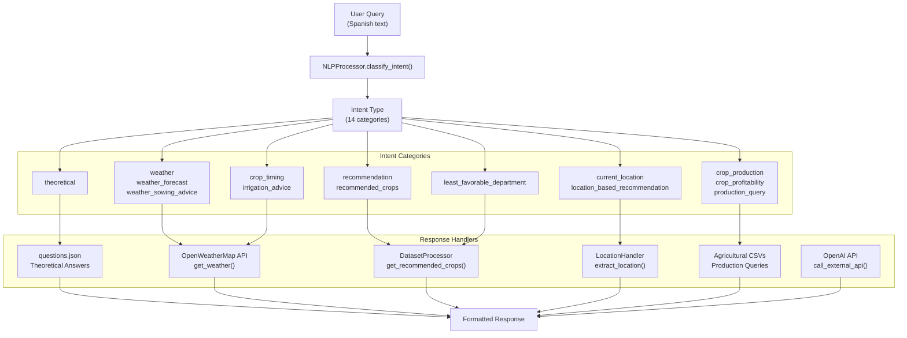
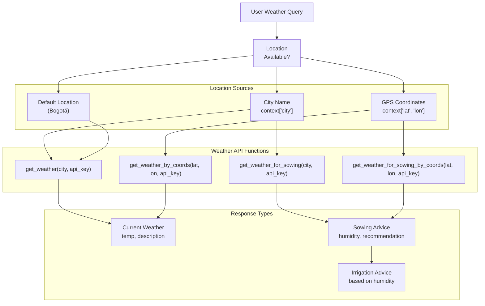
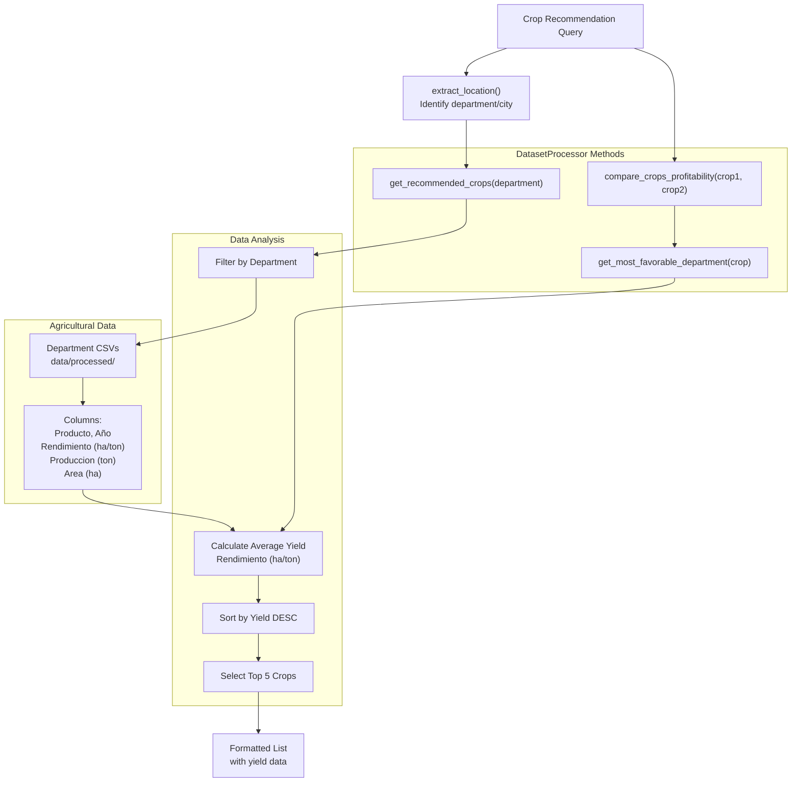
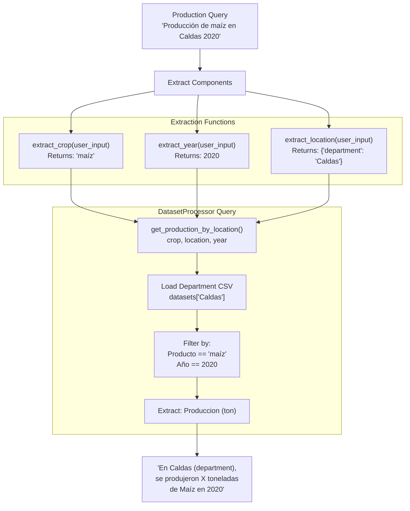
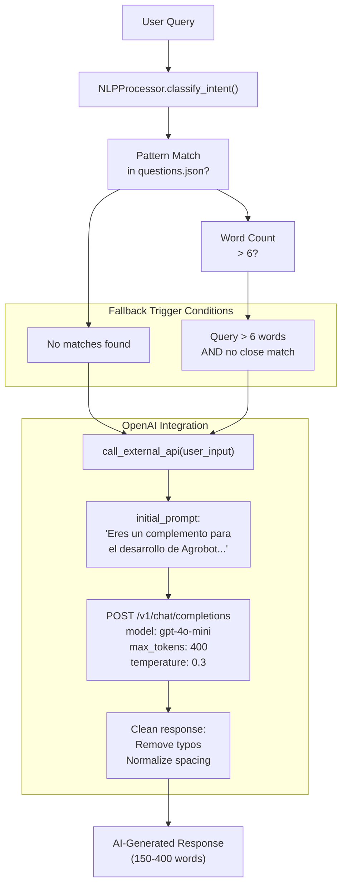
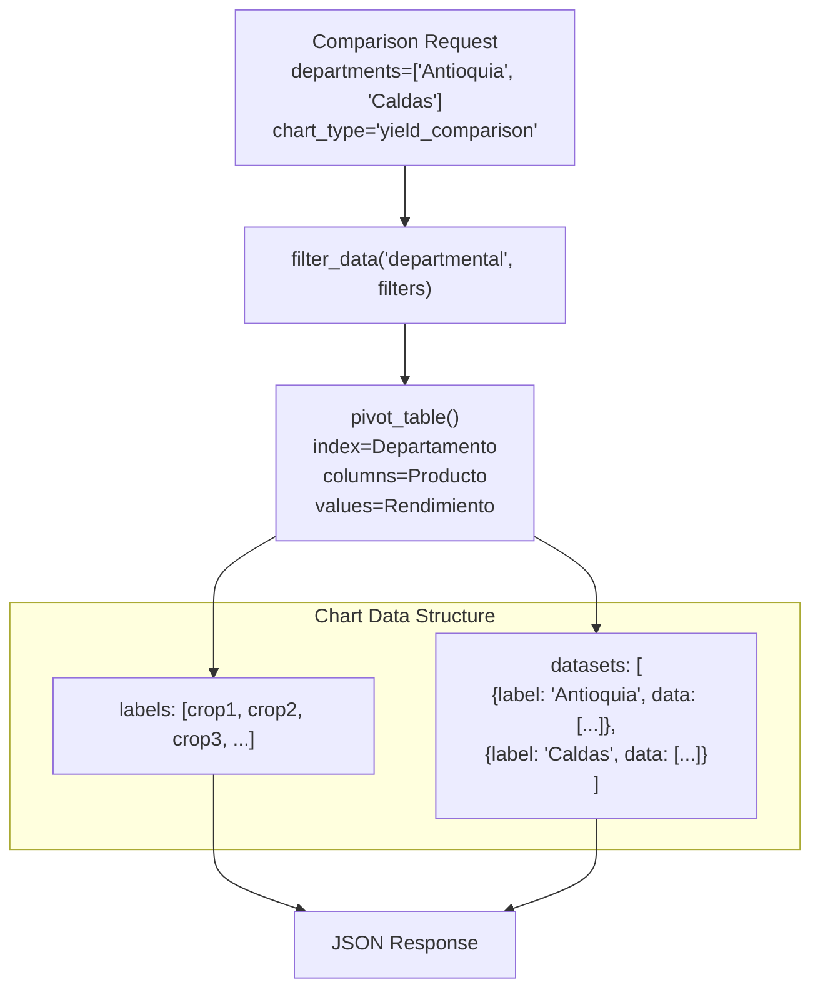
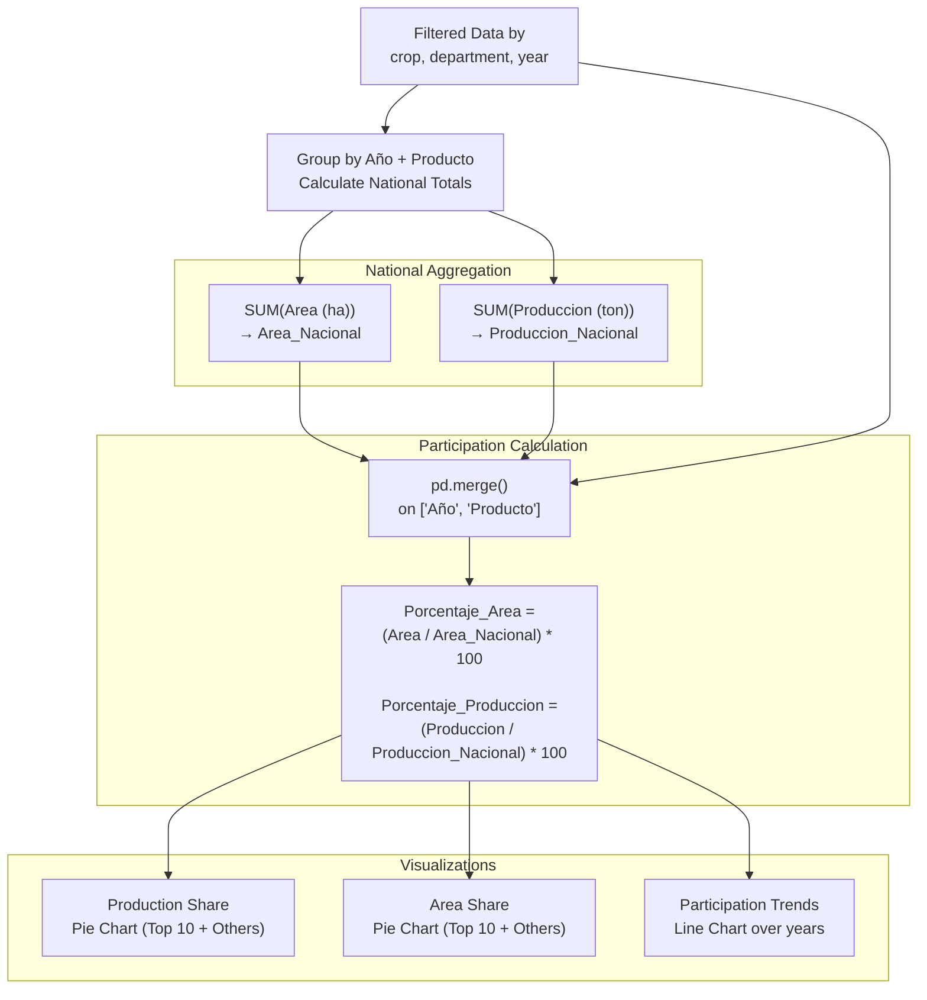
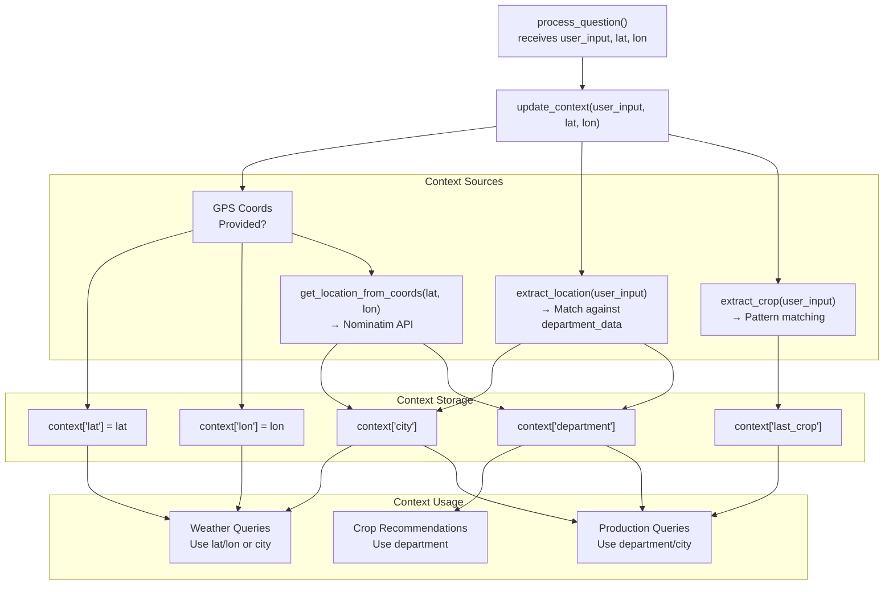

# Key Features

> **Relevant source files**
> * [app/chatbot/question_processor.py](https://github.com/axchisan/ProyectoAgroBot/blob/bc782fcf/app/chatbot/question_processor.py)
> * [app/routes/analytics_routes.py](https://github.com/axchisan/ProyectoAgroBot/blob/bc782fcf/app/routes/analytics_routes.py)
> * [app/templates/analytics/dashboard.html](https://github.com/axchisan/ProyectoAgroBot/blob/bc782fcf/app/templates/analytics/dashboard.html)
> * [docs/README.md](https://github.com/axchisan/ProyectoAgroBot/blob/bc782fcf/docs/README.md)

## Purpose and Scope

This document describes the main functional capabilities of the Agrobot system. It covers both the conversational AI features that power the chatbot interface and the data analytics features that provide agricultural insights. For information about the underlying system architecture, see [System Architecture](/axchisan/ProyectoAgroBot/3-system-architecture). For details about the machine learning pipeline that enables intent classification, see [Machine Learning Pipeline](/axchisan/ProyectoAgroBot/8-machine-learning-pipeline).

---

## Conversational AI Features

### Intent-Based Query Processing

Agrobot uses a BERT-based Spanish language model to classify user queries into 14 distinct intent types, enabling context-appropriate responses. The `NLPProcessor` class performs intent classification, while the `QuestionProcessor` class routes intents to specialized handlers.

**Intent Classification Flow:**



**Sources:** [app/chatbot/question_processor.py L13-L43](https://github.com/axchisan/ProyectoAgroBot/blob/bc782fcf/app/chatbot/question_processor.py#L13-L43)

 [app/chatbot/question_processor.py L132-L343](https://github.com/axchisan/ProyectoAgroBot/blob/bc782fcf/app/chatbot/question_processor.py#L132-L343)

 [app/chatbot/nlp_processor.py](https://github.com/axchisan/ProyectoAgroBot/blob/bc782fcf/app/chatbot/nlp_processor.py)

#### Supported Intent Types

| Intent Type | Description | Handler Method | Example Query |
| --- | --- | --- | --- |
| `theoretical` | Agricultural knowledge questions | Pattern matching against `questions.json` | "¿Qué es la poda?" |
| `weather` | Current weather queries | `get_weather()` or `get_weather_by_coords()` | "¿Cómo está el clima?" |
| `weather_forecast` | Weather forecast requests | Returns forecast template | "¿Qué clima habrá mañana?" |
| `weather_sowing_advice` | Weather-based sowing recommendations | `get_weather_for_sowing()` | "¿Es buen momento para sembrar?" |
| `current_location` | User location queries | Context retrieval | "¿Dónde estoy?" |
| `recommendation` | General crop recommendations | `get_recommended_crops()` | "¿Qué cultivo sembrar?" |
| `location_based_recommendation` | Location-specific crop advice | `get_recommended_crops(department)` | "¿Qué sembrar en Antioquia?" |
| `crop_profitability` | Profitability comparisons | `get_most_favorable_department()` | "¿Es rentable el maíz?" |
| `crop_production` | Production statistics | `get_production_by_location()` | "Producción de café en Caldas" |
| `crop_timing` | Planting timing advice | Agricultural data lookup | "¿Cuándo sembrar papa?" |
| `irrigation_advice` | Irrigation recommendations | Weather-based humidity analysis | "¿Debo regar hoy?" |
| `least_favorable_department` | Least favorable regions | `get_least_favorable_department()` | "¿Dónde no sembrar tomate?" |
| `recommended_crops` | Department-specific crops | `get_recommended_crops()` | "Mejores cultivos en Boyacá" |
| `production_query` | Historical production data | `get_production_by_location()` | "Maíz en Manizales 2020" |

**Sources:** [app/chatbot/question_processor.py L22-L27](https://github.com/axchisan/ProyectoAgroBot/blob/bc782fcf/app/chatbot/question_processor.py#L22-L27)

 [app/chatbot/question_processor.py L142-L338](https://github.com/axchisan/ProyectoAgroBot/blob/bc782fcf/app/chatbot/question_processor.py#L142-L338)

---

### Weather Information & Agricultural Advice

The system integrates with the OpenWeatherMap API to provide real-time weather data with agricultural context. Weather features support both city-based queries and GPS coordinate-based queries.

**Weather Integration Architecture:**



**Sources:** [app/chatbot/weather_api.py](https://github.com/axchisan/ProyectoAgroBot/blob/bc782fcf/app/chatbot/weather_api.py)

 [app/chatbot/question_processor.py L157-L231](https://github.com/axchisan/ProyectoAgroBot/blob/bc782fcf/app/chatbot/question_processor.py#L157-L231)

#### Weather Feature Capabilities

1. **Current Weather Queries**: Returns temperature, conditions, and description * Uses `get_weather()` for city-based queries * Uses `get_weather_by_coords()` for GPS-based queries * Format: `{city}: {description}, temperatura {temp}°C`
2. **Sowing Advice**: Provides weather-based planting recommendations * Analyzes humidity levels (>70% = high humidity) * Returns temperature, humidity, and recommendation * Implemented in [app/chatbot/question_processor.py L184-L205](https://github.com/axchisan/ProyectoAgroBot/blob/bc782fcf/app/chatbot/question_processor.py#L184-L205)
3. **Irrigation Advice**: Smart watering recommendations * High humidity (>70%): "Evita regar en exceso" * Low humidity (≤70%): "Riega tus cultivos" * Implemented in [app/chatbot/question_processor.py L206-L231](https://github.com/axchisan/ProyectoAgroBot/blob/bc782fcf/app/chatbot/question_processor.py#L206-L231)

**Sources:** [app/chatbot/weather_api.py](https://github.com/axchisan/ProyectoAgroBot/blob/bc782fcf/app/chatbot/weather_api.py)

 [app/chatbot/question_processor.py L157-L231](https://github.com/axchisan/ProyectoAgroBot/blob/bc782fcf/app/chatbot/question_processor.py#L157-L231)

---

### Crop Recommendations

The system provides intelligent crop recommendations based on geographic location, historical yield data, and production statistics. The `DatasetProcessor` class analyzes agricultural CSV data to generate recommendations.

**Crop Recommendation Logic:**



**Sources:** [app/chatbot/dataset_processor.py](https://github.com/axchisan/ProyectoAgroBot/blob/bc782fcf/app/chatbot/dataset_processor.py)

 [app/chatbot/question_processor.py L232-L268](https://github.com/axchisan/ProyectoAgroBot/blob/bc782fcf/app/chatbot/question_processor.py#L232-L268)

 [app/chatbot/location_handler.py](https://github.com/axchisan/ProyectoAgroBot/blob/bc782fcf/app/chatbot/location_handler.py)

#### Recommendation Features

1. **Location-Based Recommendations**: Suggests top crops for a specific department * Method: `DatasetProcessor.get_recommended_crops(department)` * Returns: Top 5 crops with yield and year data * Example response: "En Antioquia, te recomiendo los siguientes cultivos: Café con un rendimiento de 1.2 ton/ha (año 2020)" * Implemented in [app/chatbot/question_processor.py L232-L248](https://github.com/axchisan/ProyectoAgroBot/blob/bc782fcf/app/chatbot/question_processor.py#L232-L248)
2. **Crop Profitability Analysis**: Identifies most favorable department for a crop * Method: `DatasetProcessor.get_most_favorable_department(crop, metric="Rendimiento (ha/ton)")` * Analyzes historical yield data across all departments * Returns department with highest yield * Implemented in [app/chatbot/question_processor.py L249-L268](https://github.com/axchisan/ProyectoAgroBot/blob/bc782fcf/app/chatbot/question_processor.py#L249-L268)
3. **Crop Comparison**: Compares profitability between two crops * Method: `DatasetProcessor.compare_crops_profitability(crop1, crop2, department)` * Returns which crop has better yield in specified location * Implemented in [app/chatbot/question_processor.py L251-L259](https://github.com/axchisan/ProyectoAgroBot/blob/bc782fcf/app/chatbot/question_processor.py#L251-L259)

**Sources:** [app/chatbot/dataset_processor.py](https://github.com/axchisan/ProyectoAgroBot/blob/bc782fcf/app/chatbot/dataset_processor.py)

 [app/chatbot/question_processor.py L232-L268](https://github.com/axchisan/ProyectoAgroBot/blob/bc782fcf/app/chatbot/question_processor.py#L232-L268)

---

### Agricultural Data Queries

Users can query historical production data, yield statistics, and planting timing information. The system supports granular queries by crop, location, and year.

#### Production Data Queries

| Query Type | Method | Parameters | Data Source |
| --- | --- | --- | --- |
| Production by Location | `get_production_by_location()` | crop, location, year, location_type | Department/Municipal CSVs |
| Maximum Production | `get_most_favorable_department()` | crop, metric="Produccion (ton)" | Department CSVs |
| Minimum Production | `get_least_favorable_department()` | crop, metric="Produccion (ton)" | Department CSVs |
| Crop Timing | Pattern match in `agricultural_data` | crop | [data/processed/cultivos.csv](https://github.com/axchisan/ProyectoAgroBot/blob/bc782fcf/data/processed/cultivos.csv) |

**Production Query Processing:**



**Sources:** [app/chatbot/question_processor.py L58-L75](https://github.com/axchisan/ProyectoAgroBot/blob/bc782fcf/app/chatbot/question_processor.py#L58-L75)

 [app/chatbot/question_processor.py L269-L298](https://github.com/axchisan/ProyectoAgroBot/blob/bc782fcf/app/chatbot/question_processor.py#L269-L298)

 [app/chatbot/question_processor.py L327-L338](https://github.com/axchisan/ProyectoAgroBot/blob/bc782fcf/app/chatbot/question_processor.py#L327-L338)

 [app/chatbot/dataset_processor.py](https://github.com/axchisan/ProyectoAgroBot/blob/bc782fcf/app/chatbot/dataset_processor.py)

#### Crop Timing Information

The system provides planting timing advice based on the `agricultural_data` DataFrame, which contains crop-specific planting month information:

* Method: Pattern matching in [app/chatbot/question_processor.py L299-L307](https://github.com/axchisan/ProyectoAgroBot/blob/bc782fcf/app/chatbot/question_processor.py#L299-L307)
* Data columns: `cultivo`, `mes_siembra`
* Example: "El mejor momento para sembrar Maíz es en marzo"

**Sources:** [app/chatbot/question_processor.py L299-L307](https://github.com/axchisan/ProyectoAgroBot/blob/bc782fcf/app/chatbot/question_processor.py#L299-L307)

 [data/processed/cultivos.csv](https://github.com/axchisan/ProyectoAgroBot/blob/bc782fcf/data/processed/cultivos.csv)

---

### AI Fallback for Complex Questions

For queries that don't match predefined patterns or intents, the system falls back to the OpenAI API to generate comprehensive responses. This ensures the chatbot can handle unexpected or complex agricultural questions.

**Fallback Mechanism:**



**Sources:** [app/chatbot/question_processor.py L35-L43](https://github.com/axchisan/ProyectoAgroBot/blob/bc782fcf/app/chatbot/question_processor.py#L35-L43)

 [app/chatbot/question_processor.py L96-L131](https://github.com/axchisan/ProyectoAgroBot/blob/bc782fcf/app/chatbot/question_processor.py#L96-L131)

 [app/chatbot/question_processor.py L340-L342](https://github.com/axchisan/ProyectoAgroBot/blob/bc782fcf/app/chatbot/question_processor.py#L340-L342)

#### Fallback Configuration

* **API Type**: OpenAI (`api_type = "openai"`)
* **Model**: `gpt-4o-mini`
* **Max Tokens**: 400 words
* **Temperature**: 0.3 (focused responses)
* **System Prompt**: Specialized for Colombian agriculture with 150-400 word responses in Spanish
* **Response Cleaning**: Removes typo patterns and normalizes spacing

**Sources:** [app/chatbot/question_processor.py L96-L131](https://github.com/axchisan/ProyectoAgroBot/blob/bc782fcf/app/chatbot/question_processor.py#L96-L131)

---

## Data Analytics Features

The analytics subsystem provides comprehensive data visualization and exploration capabilities through a web-based dashboard. All analytics routes are registered under the `analytics_bp` Blueprint with URL prefix `/analytics`.

### Analytics Dashboard Overview

**Analytics Routes and Features:**

```mermaid
flowchart TD

Dashboard["/analytics/<br>dashboard()"]
NationalCrops["/analytics/national-crops<br>national_crops()"]
Municipal["/analytics/municipal-data<br>municipal_data()"]
DeptComp["/analytics/departmental-comparison<br>departmental_comparison()"]
DeptPart["/analytics/departmental-participation<br>departmental_participation()"]
ChartAPI["/analytics/api/chart-data<br>api_chart_data()"]
StatsAPI["/analytics/api/summary-stats<br>api_summary_stats()"]
ExportAPI["/analytics/export<br>export_data()"]
GetDatasets["get_available_datasets()"]
FilterData["filter_data(category, filters)"]
GetStats["get_summary_stats(category, filters)"]
GetCharts["get_chart_data(category, chart_type, filters)"]
GetCrops["get_crops_list()"]
GetDepts["get_departments_list()"]
GetYears["get_years_range()"]
NationalData["national_crops"]
MunicipalData["municipal"]
DepartmentalData["departmental"]
ComparativeData["comparative"]

Dashboard --> GetDatasets
Dashboard --> GetCrops
Dashboard --> GetDepts
Dashboard --> GetYears
NationalCrops --> FilterData
NationalCrops --> GetStats
NationalCrops --> GetCharts
Municipal --> FilterData
DeptComp --> FilterData
DeptPart --> FilterData
ChartAPI --> GetCharts
StatsAPI --> GetStats
ExportAPI --> FilterData
FilterData --> NationalData
FilterData --> MunicipalData
FilterData --> DepartmentalData

subgraph subGraph3 ["Data Categories"]
    NationalData
    MunicipalData
    DepartmentalData
    ComparativeData
end

subgraph subGraph2 ["data_processor Methods"]
    GetDatasets
    FilterData
    GetStats
    GetCharts
    GetCrops
    GetDepts
    GetYears
end

subgraph subGraph1 ["API Endpoints"]
    ChartAPI
    StatsAPI
    ExportAPI
end

subgraph subGraph0 ["Analytics Blueprint Routes"]
    Dashboard
    NationalCrops
    Municipal
    DeptComp
    DeptPart
end
```



**Sources:** [app/routes/analytics_routes.py L7-L28](https://github.com/axchisan/ProyectoAgroBot/blob/bc782fcf/app/routes/analytics_routes.py#L7-L28)

 [app/data_processor.py](https://github.com/axchisan/ProyectoAgroBot/blob/bc782fcf/app/data_processor.py)

---

### National Crop Analysis

Provides filtering, visualization, and analysis of national-level crop data by department and year.

**Features:**

* **Route**: `/analytics/national-crops`
* **Filters**: Crop type, department, year
* **Visualizations**: * Production by year (line chart via `get_chart_data('national_crops', 'production_by_year')`) * Area by department (bar chart via `get_chart_data('national_crops', 'area_by_department')`)
* **Summary Statistics**: Total production, area, yield calculated by `get_summary_stats('national_crops', filters)`
* **Data Display**: Top 100 filtered records displayed in table format

**Implementation:** [app/routes/analytics_routes.py L30-L69](https://github.com/axchisan/ProyectoAgroBot/blob/bc782fcf/app/routes/analytics_routes.py#L30-L69)

**Sources:** [app/routes/analytics_routes.py L30-L69](https://github.com/axchisan/ProyectoAgroBot/blob/bc782fcf/app/routes/analytics_routes.py#L30-L69)

 [app/templates/analytics/national_crops.html](https://github.com/axchisan/ProyectoAgroBot/blob/bc782fcf/app/templates/analytics/national_crops.html)

---

### Municipal Data Exploration

Enables granular analysis of municipal-level agricultural data with flexible filtering.

**Features:**

* **Route**: `/analytics/municipal-data`
* **Filters**: Dataset selection, year, municipality
* **Available Datasets**: Dynamically loaded from `data_processor.datasets.get('municipal', {})`
* **Summary Statistics**: Includes municipality count when data available
* **Data Structure**: Displays columns from municipal CSV files (Municipio, Producto, Año, Produccion, Area, Rendimiento)

**Implementation:** [app/routes/analytics_routes.py L71-L109](https://github.com/axchisan/ProyectoAgroBot/blob/bc782fcf/app/routes/analytics_routes.py#L71-L109)

**Chart Types for Municipal Data:**

| Chart Type | Function | Description |
| --- | --- | --- |
| `top_municipalities` | `get_top_municipalities_chart()` | Top 10 municipalities by production |
| `yield_comparison` | `get_yield_comparison_chart()` | Average yield comparison across municipalities |

**Sources:** [app/routes/analytics_routes.py L71-L109](https://github.com/axchisan/ProyectoAgroBot/blob/bc782fcf/app/routes/analytics_routes.py#L71-L109)

 [app/routes/analytics_routes.py L256-L296](https://github.com/axchisan/ProyectoAgroBot/blob/bc782fcf/app/routes/analytics_routes.py#L256-L296)

---

### Departmental Comparison

Allows side-by-side comparison of multiple departments across production, area, and yield metrics.

**Features:**

* **Route**: `/analytics/departmental-comparison`
* **Multi-Select Filters**: Multiple departments, crop, year
* **Comparison Types**: * Production comparison (bar chart) * Area comparison (bar chart) * Yield comparison (radar chart with multi-department overlay)
* **Dynamic Chart Generation**: `get_departmental_comparison_chart()` handles different chart types

**Radar Chart Implementation:**



**Sources:** [app/routes/analytics_routes.py L111-L146](https://github.com/axchisan/ProyectoAgroBot/blob/bc782fcf/app/routes/analytics_routes.py#L111-L146)

 [app/routes/analytics_routes.py L298-L367](https://github.com/axchisan/ProyectoAgroBot/blob/bc782fcf/app/routes/analytics_routes.py#L298-L367)

---

### Departmental Participation Analysis

Calculates and visualizes each department's percentage contribution to national agricultural totals.

**Participation Calculation:**



**Sources:** [app/routes/analytics_routes.py L148-L211](https://github.com/axchisan/ProyectoAgroBot/blob/bc782fcf/app/routes/analytics_routes.py#L148-L211)

 [app/routes/analytics_routes.py L369-L521](https://github.com/axchisan/ProyectoAgroBot/blob/bc782fcf/app/routes/analytics_routes.py#L369-L521)

#### Participation Chart Types

1. **Production Share** (`get_production_share_chart()`): * Calculates percentage of national production per department * Aggregates departments beyond top 10 as "Otros" * Implemented in [app/routes/analytics_routes.py L369-L406](https://github.com/axchisan/ProyectoAgroBot/blob/bc782fcf/app/routes/analytics_routes.py#L369-L406)
2. **Area Share** (`get_area_share_chart()`): * Calculates percentage of national area per department * Same aggregation logic as production share * Implemented in [app/routes/analytics_routes.py L408-L445](https://github.com/axchisan/ProyectoAgroBot/blob/bc782fcf/app/routes/analytics_routes.py#L408-L445)
3. **Participation Trends** (`get_participation_trends_chart()`): * Multi-year trend lines showing participation changes * Displays top 5 departments by default * Color-coded by department with consistent hashing * Implemented in [app/routes/analytics_routes.py L447-L521](https://github.com/axchisan/ProyectoAgroBot/blob/bc782fcf/app/routes/analytics_routes.py#L447-L521)

**Sources:** [app/routes/analytics_routes.py L369-L521](https://github.com/axchisan/ProyectoAgroBot/blob/bc782fcf/app/routes/analytics_routes.py#L369-L521)

---

### Data Export Functionality

Users can export filtered data in CSV or JSON format for external analysis.

**Export Features:**

* **Route**: `/analytics/export`
* **Supported Formats**: CSV (default), JSON
* **Filters**: Same as view pages (crop, department, year, dataset, municipality, departments list)
* **Participation Enrichment**: Automatically adds participation percentages for departmental data
* **CSV Headers**: Includes `Content-Disposition` header for automatic download
* **Implementation**: [app/routes/analytics_routes.py L539-L605](https://github.com/axchisan/ProyectoAgroBot/blob/bc782fcf/app/routes/analytics_routes.py#L539-L605)

**Export Query String Examples:**

* CSV: `/analytics/export?category=national_crops&crop=café&format=csv`
* JSON: `/analytics/export?category=municipal&dataset=Antioquia&year=2020&format=json`

**Sources:** [app/routes/analytics_routes.py L539-L605](https://github.com/axchisan/ProyectoAgroBot/blob/bc782fcf/app/routes/analytics_routes.py#L539-L605)

---

## Context & State Management

The chatbot maintains conversational context across multiple turns to provide coherent, location-aware responses.

**Context Storage Structure:**

```css
context = {
    "department": None,      # User's department (e.g., "Antioquia")
    "city": None,            # User's city (e.g., "Medellín")
    "last_crop": None,       # Most recently mentioned crop
    "lat": None,             # GPS latitude
    "lon": None              # GPS longitude
}
```

**Context Update Flow:**



**Sources:** [app/chatbot/question_processor.py L28-L34](https://github.com/axchisan/ProyectoAgroBot/blob/bc782fcf/app/chatbot/question_processor.py#L28-L34)

 [app/chatbot/question_processor.py L77-L94](https://github.com/axchisan/ProyectoAgroBot/blob/bc782fcf/app/chatbot/question_processor.py#L77-L94)

 [app/chatbot/question_processor.py L58-L69](https://github.com/axchisan/ProyectoAgroBot/blob/bc782fcf/app/chatbot/question_processor.py#L58-L69)

### Context Persistence Features

1. **Location Memory**: Once a user provides their location (via GPS or text), it's stored for subsequent queries
2. **Crop Memory**: The last mentioned crop is remembered via `extract_crop()`, enabling follow-up questions like "¿Es rentable?" without repeating the crop name
3. **Fallback Defaults**: When no context is available, defaults to "Bogotá" and "Cundinamarca"
4. **Context Priority**: GPS coordinates take precedence over text-based location extraction

**Sources:** [app/chatbot/question_processor.py L77-L94](https://github.com/axchisan/ProyectoAgroBot/blob/bc782fcf/app/chatbot/question_processor.py#L77-L94)

 [app/chatbot/question_processor.py L137-L140](https://github.com/axchisan/ProyectoAgroBot/blob/bc782fcf/app/chatbot/question_processor.py#L137-L140)

---

## Colombian Agricultural Context

The system is specifically designed for Colombian small farmers with localized features:

### Language and Normalization

**Text Normalization** ([app/chatbot/question_processor.py L45-L56](https://github.com/axchisan/ProyectoAgroBot/blob/bc782fcf/app/chatbot/question_processor.py#L45-L56)

):

* Handles common Spanish abbreviations: `q`/`k` → `que`, `depto`/`dept` → `departamento`
* Corrects common typos: `cultvio` → `cultivo`, `regn`/`regin` → `region`
* Removes diacritics using `unidecode` for fuzzy matching
* Case-insensitive processing

### Geographic Coverage

**Supported Regions:**

* 32+ Colombian departments with dedicated CSV datasets
* Municipal-level data for granular analysis
* City-level weather integration
* Geographic entity extraction via `department_data` DataFrame

**Sources:** [app/chatbot/question_processor.py L45-L56](https://github.com/axchisan/ProyectoAgroBot/blob/bc782fcf/app/chatbot/question_processor.py#L45-L56)

 [app/chatbot/location_handler.py](https://github.com/axchisan/ProyectoAgroBot/blob/bc782fcf/app/chatbot/location_handler.py)

 [data/processed/](https://github.com/axchisan/ProyectoAgroBot/blob/bc782fcf/data/processed/)

### Crop Database

The system includes data for 25+ major Colombian crops including:

* Traditional crops: maíz, papa, café, arroz, yuca, caña de azúcar
* Fruits: guayaba, plátano, piña, aguacate, mango, fresa, mora, guanábana
* Commercial crops: cacao, tomate, limón, naranja, mandarina

**Sources:** [app/chatbot/question_processor.py L59-L63](https://github.com/axchisan/ProyectoAgroBot/blob/bc782fcf/app/chatbot/question_processor.py#L59-L63)

 [data/processed/cultivos.csv](https://github.com/axchisan/ProyectoAgroBot/blob/bc782fcf/data/processed/cultivos.csv)

### Spanish Language Model

* **Model**: `dccuchile/bert-base-spanish-wwm-cased` (BERT variant trained on Spanish corpora)
* **Training Data**: 400+ questions in Colombian Spanish with variations (formal, casual, typos)
* **Intent Categories**: 14 agricultural-specific intents for Colombian context
* **System Prompts**: OpenAI fallback uses Colombian agricultural terminology

**Sources:** [app/chatbot/nlp_processor.py](https://github.com/axchisan/ProyectoAgroBot/blob/bc782fcf/app/chatbot/nlp_processor.py)

 [app/models/intent_classifier/](https://github.com/axchisan/ProyectoAgroBot/blob/bc782fcf/app/models/intent_classifier/)

 [training_data/](https://github.com/axchisan/ProyectoAgroBot/blob/bc782fcf/training_data/)