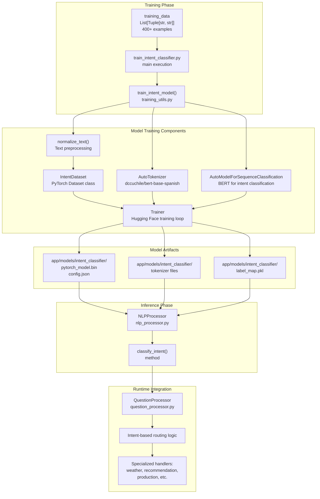
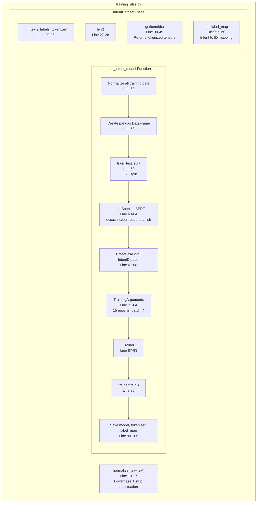
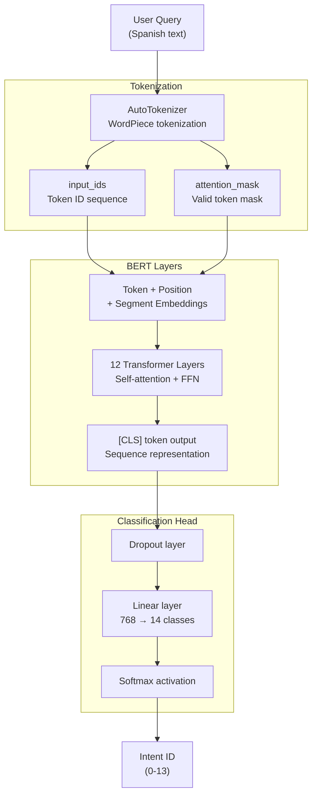
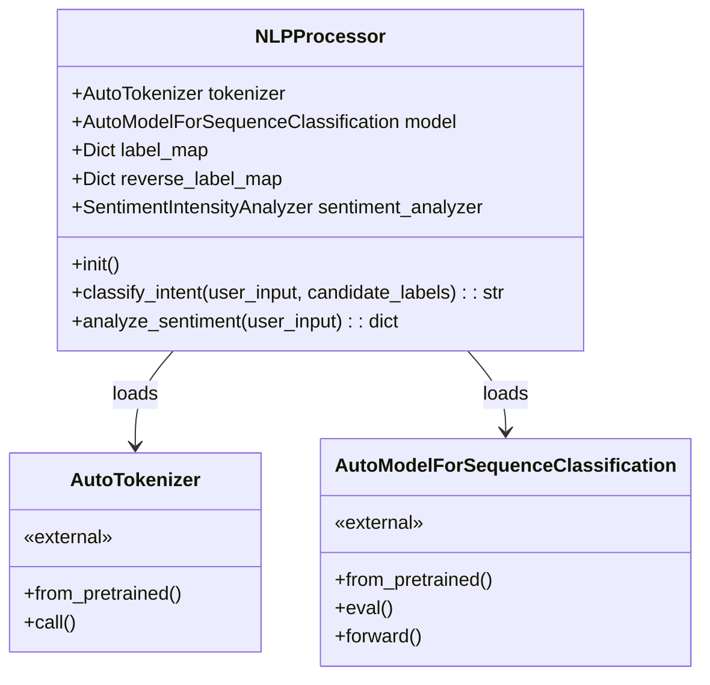
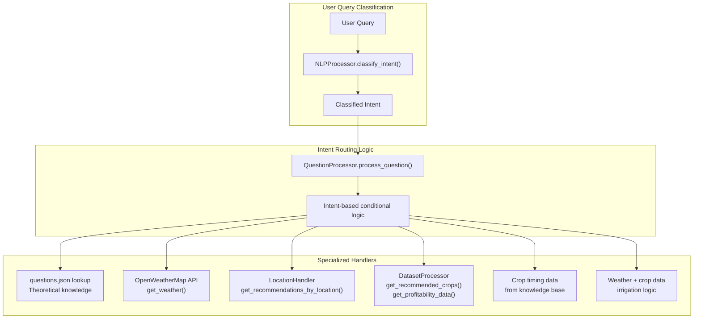
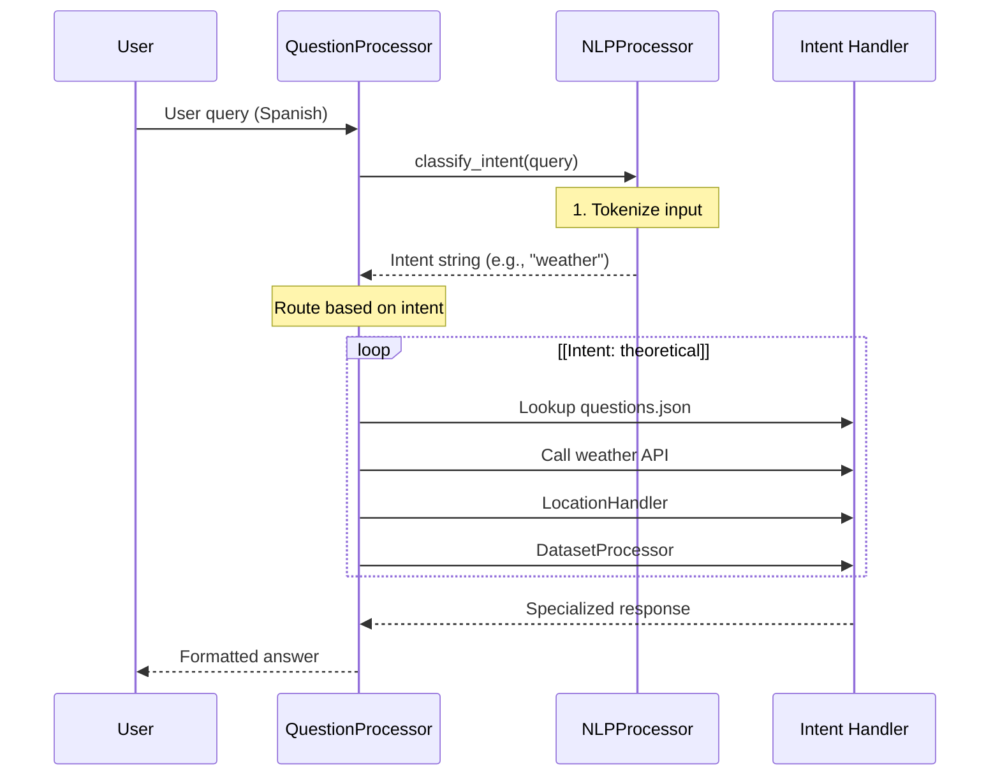

# Machine Learning Pipeline

> **Relevant source files**
> * [app/chatbot/nlp_processor.py](https://github.com/axchisan/ProyectoAgroBot/blob/bc782fcf/app/chatbot/nlp_processor.py)
> * [app/chatbot/training_utils.py](https://github.com/axchisan/ProyectoAgroBot/blob/bc782fcf/app/chatbot/training_utils.py)
> * [app/static/css/style.css](https://github.com/axchisan/ProyectoAgroBot/blob/bc782fcf/app/static/css/style.css)
> * [app/templates/chat.html](https://github.com/axchisan/ProyectoAgroBot/blob/bc782fcf/app/templates/chat.html)
> * [train_intent_classifier.py](https://github.com/axchisan/ProyectoAgroBot/blob/bc782fcf/train_intent_classifier.py)

## Purpose and Scope

This document provides a comprehensive overview of the machine learning pipeline in Agrobot, covering the entire lifecycle from training data preparation to model deployment and runtime inference. The ML pipeline powers the intent classification system that routes user queries to specialized handlers.

For detailed information about how classified intents are used during question processing, see [Question Processing](/axchisan/ProyectoAgroBot/4.2-question-processing). For information about the training dataset structure, see [Training Data and Process](/axchisan/ProyectoAgroBot/8.2-training-data-and-process). For deployment and runtime integration details, see [Model Deployment and Inference](/axchisan/ProyectoAgroBot/8.4-model-deployment-and-inference).

## Pipeline Overview

The Agrobot ML pipeline consists of three major phases: **Training**, **Model Persistence**, and **Inference**. The pipeline uses a fine-tuned Spanish BERT model to classify user queries into 14 distinct intent categories, enabling context-aware agricultural advice.

### End-to-End Pipeline Flow



**Sources:** [train_intent_classifier.py L1-L289](https://github.com/axchisan/ProyectoAgroBot/blob/bc782fcf/train_intent_classifier.py#L1-L289)

 [app/chatbot/training_utils.py L1-L107](https://github.com/axchisan/ProyectoAgroBot/blob/bc782fcf/app/chatbot/training_utils.py#L1-L107)

 [app/chatbot/nlp_processor.py L1-L28](https://github.com/axchisan/ProyectoAgroBot/blob/bc782fcf/app/chatbot/nlp_processor.py#L1-L28)

## Training Phase Components

The training phase transforms raw question-intent pairs into a production-ready classification model. This phase is executed offline before the application starts.

### Training Script Entry Point

The `train_intent_classifier.py` script serves as the entry point for model training. It contains:

| Component | Description | Location |
| --- | --- | --- |
| `training_data` | List of 400+ (question, intent) tuples with variations | [train_intent_classifier.py L4-L286](https://github.com/axchisan/ProyectoAgroBot/blob/bc782fcf/train_intent_classifier.py#L4-L286) |
| Main execution | Calls `train_intent_model()` with training data | [train_intent_classifier.py L288-L289](https://github.com/axchisan/ProyectoAgroBot/blob/bc782fcf/train_intent_classifier.py#L288-L289) |

The training data includes multiple variations per intent to improve robustness:

* Formal phrasing: "¿Qué es Agrobot?"
* Casual phrasing: "¿Q es Agrobot?"
* Common typos: "¿k es agrobot?"

### Training Utilities Module

The `training_utils.py` module contains the core training logic:



**Sources:** [app/chatbot/training_utils.py L13-L107](https://github.com/axchisan/ProyectoAgroBot/blob/bc782fcf/app/chatbot/training_utils.py#L13-L107)

### Key Training Parameters

The model is trained with carefully tuned hyperparameters:

| Parameter | Value | Purpose |
| --- | --- | --- |
| `num_train_epochs` | 15 | Sufficient iterations for convergence on small dataset |
| `per_device_train_batch_size` | 4 | Small batch size suitable for dataset size |
| `learning_rate` | 2e-5 | Standard fine-tuning rate for BERT |
| `warmup_steps` | 1000 | Gradual learning rate increase |
| `weight_decay` | 0.01 | L2 regularization |
| `max_length` | 128 | Token sequence length |
| `test_size` | 0.2 | 20% validation split |

**Sources:** [app/chatbot/training_utils.py L71-L84](https://github.com/axchisan/ProyectoAgroBot/blob/bc782fcf/app/chatbot/training_utils.py#L71-L84)

 [app/chatbot/training_utils.py L24](https://github.com/axchisan/ProyectoAgroBot/blob/bc782fcf/app/chatbot/training_utils.py#L24-L24)

 [app/chatbot/training_utils.py L60](https://github.com/axchisan/ProyectoAgroBot/blob/bc782fcf/app/chatbot/training_utils.py#L60-L60)

## Model Architecture

The intent classification system uses a Spanish BERT model fine-tuned for sequence classification.

### Base Model Selection

**Pretrained Model:** `dccuchile/bert-base-spanish-wwm-uncased`

This model was selected because:

* Pre-trained on Spanish text corpus
* Whole Word Masking (WWM) for better Spanish morphology handling
* Uncased to match normalized input text
* Optimized for Chilean Spanish, suitable for Colombian context

**Sources:** [app/chatbot/training_utils.py L63](https://github.com/axchisan/ProyectoAgroBot/blob/bc782fcf/app/chatbot/training_utils.py#L63-L63)

### Model Components



**Model Dimensions:**

* Hidden size: 768
* Number of attention heads: 12
* Number of hidden layers: 12
* Vocabulary size: ~31,000 tokens
* Output classes: 14 (number of unique intents)

**Sources:** [app/chatbot/training_utils.py L64](https://github.com/axchisan/ProyectoAgroBot/blob/bc782fcf/app/chatbot/training_utils.py#L64-L64)

 [app/chatbot/nlp_processor.py L11-L12](https://github.com/axchisan/ProyectoAgroBot/blob/bc782fcf/app/chatbot/nlp_processor.py#L11-L12)

## Inference Phase Components

At runtime, the trained model is loaded and used to classify incoming user queries.

### NLPProcessor Class

The `NLPProcessor` class encapsulates model loading and inference logic:



**Sources:** [app/chatbot/nlp_processor.py L9-L28](https://github.com/axchisan/ProyectoAgroBot/blob/bc782fcf/app/chatbot/nlp_processor.py#L9-L28)

### Initialization Process

When `NLPProcessor` is instantiated:

1. **Load tokenizer** from `app/models/intent_classifier/` ([nlp_processor.py L11](https://github.com/axchisan/ProyectoAgroBot/blob/bc782fcf/nlp_processor.py#L11-L11) )
2. **Load model** from `app/models/intent_classifier/` ([nlp_processor.py L12](https://github.com/axchisan/ProyectoAgroBot/blob/bc782fcf/nlp_processor.py#L12-L12) )
3. **Set to eval mode** to disable dropout ([nlp_processor.py L13](https://github.com/axchisan/ProyectoAgroBot/blob/bc782fcf/nlp_processor.py#L13-L13) )
4. **Load label map** from `label_map.pkl` ([nlp_processor.py L14-L15](https://github.com/axchisan/ProyectoAgroBot/blob/bc782fcf/nlp_processor.py#L14-L15) )
5. **Create reverse mapping** (ID → intent string) ([nlp_processor.py L16](https://github.com/axchisan/ProyectoAgroBot/blob/bc782fcf/nlp_processor.py#L16-L16) )
6. **Initialize sentiment analyzer** for additional NLP features ([nlp_processor.py L17](https://github.com/axchisan/ProyectoAgroBot/blob/bc782fcf/nlp_processor.py#L17-L17) )

### Intent Classification Method

The `classify_intent()` method performs inference:

```python
# Simplified inference flow
def classify_intent(self, user_input: str, candidate_labels: list) -> str:
    # 1. Tokenize input
    inputs = self.tokenizer(user_input, return_tensors="pt", 
                           padding=True, truncation=True, max_length=128)
    
    # 2. Run model inference (no gradient computation)
    with torch.no_grad():
        outputs = self.model(**inputs)
        predicted_label_id = torch.argmax(outputs.logits, dim=1).item()
    
    # 3. Map ID back to intent string
    predicted_label = self.reverse_label_map.get(predicted_label_id, "unknown")
    return predicted_label
```

**Note:** The `candidate_labels` parameter is currently unused but provided for future extension with zero-shot classification.

**Sources:** [app/chatbot/nlp_processor.py L19-L25](https://github.com/axchisan/ProyectoAgroBot/blob/bc782fcf/app/chatbot/nlp_processor.py#L19-L25)

## Intent Types and Routing

The model classifies user queries into 14 distinct intent categories, which are then routed to specialized handlers.

### Intent Category Taxonomy

| Intent Category | Example Queries | Handler Purpose |
| --- | --- | --- |
| `theoretical` | "¿Qué es agroecología?", "¿Cómo funciona rotación cultivos?" | Knowledge base lookup |
| `weather` | "¿Clima Bogotá?", "¿Está lloviendo Medellín?" | Current weather data |
| `weather_forecast` | "¿Clima mañana?", "¿Pronóstico semana?" | Weather predictions |
| `weather_sowing_advice` | "¿Clima para sembrar?", "¿Bueno cultivar Cali?" | Weather-based planting advice |
| `current_location` | "¿Dónde estoy?", "¿Estoy en Antioquia?" | Location detection |
| `recommendation` | "¿Qué siembro región?", "¿Cultivos para zona?" | General crop recommendations |
| `location_based_recommendation` | "¿Cultivo Antioquia?", "¿Qué sembrar Valle?" | Department-specific crops |
| `recommended_crops` | "¿Mejores cultivos Santander?" | Top crop suggestions |
| `crop_profitability` | "¿Cultivo rentable?", "¿Q gana maíz?" | Profitability analysis |
| `crop_production` | "¿Producción tomate?", "¿Más café departamento?" | Production statistics |
| `production_query` | "¿Cuánto maíz 2020?", "¿Producción café Caldas?" | Historical production data |
| `crop_timing` | "¿Cuando siembro papa?", "¿Mejor mes café?" | Planting schedules |
| `irrigation_advice` | "¿Cómo optimizo riego?", "¿Riego hoy?" | Irrigation recommendations |
| `least_favorable_department` | "¿Dónde menos favorable maíz?" | Low-yield regions |

**Sources:** [train_intent_classifier.py L4-L286](https://github.com/axchisan/ProyectoAgroBot/blob/bc782fcf/train_intent_classifier.py#L4-L286)

### Intent to Handler Mapping



**Sources:** [app/chatbot/nlp_processor.py L19-L25](https://github.com/axchisan/ProyectoAgroBot/blob/bc782fcf/app/chatbot/nlp_processor.py#L19-L25)

## Training Data Structure

The training data in `train_intent_classifier.py` is structured as a list of tuples with extensive variations to improve model robustness.

### Data Augmentation Strategy

Each conceptual query is represented with multiple variations:

**Example - "What is Agrobot?"**

```markdown
("¿Qué es Agrobot?", "theoretical"),      # Formal Spanish
("¿Q es Agrobot?", "theoretical"),        # Abbreviated "qué"
("¿Que es Agrobot?", "theoretical"),      # Missing accent
("¿k es agrobot?", "theoretical"),        # Extreme abbreviation
("¿Qué significa Agrobot?", "theoretical"), # Synonym variation
("¿Agrobot q es?", "theoretical"),        # Word order variation
```

This augmentation strategy accounts for:

* **Spelling variations**: accented vs. unaccented characters
* **Abbreviations**: "Q" for "Qué", "k" for "que"
* **Word order**: flexible phrasing common in conversational Spanish
* **Synonym variations**: different ways to ask the same question
* **Typos**: intentional misspellings users might make

**Sources:** [train_intent_classifier.py L6-L9](https://github.com/axchisan/ProyectoAgroBot/blob/bc782fcf/train_intent_classifier.py#L6-L9)

### Training Data Statistics

| Metric | Value |
| --- | --- |
| Total examples | 400+ |
| Unique intent types | 14 |
| Average examples per intent | ~29 |
| Variation types per concept | 3-6 |
| Languages supported | Spanish (Colombian context) |

**Sources:** [train_intent_classifier.py L4-L286](https://github.com/axchisan/ProyectoAgroBot/blob/bc782fcf/train_intent_classifier.py#L4-L286)

## File Organization

The ML pipeline components are organized across several files:

### Training Files

```python
train_intent_classifier.py          # Entry point script
├── training_data list              # 400+ (question, intent) pairs
└── Calls train_intent_model()

app/chatbot/training_utils.py       # Training logic module
├── normalize_text()                # Text preprocessing
├── IntentDataset class             # PyTorch Dataset wrapper
└── train_intent_model()            # Main training function
```

### Model Artifacts

```markdown
app/models/intent_classifier/       # Model storage directory
├── pytorch_model.bin               # Trained model weights
├── config.json                     # Model configuration
├── tokenizer_config.json           # Tokenizer settings
├── vocab.txt                       # Vocabulary mapping
├── special_tokens_map.json         # Special token definitions
└── label_map.pkl                   # Intent ID mapping
```

### Inference Files

```markdown
app/chatbot/nlp_processor.py        # Runtime inference module
└── NLPProcessor class
    ├── __init__()                  # Load model artifacts
    ├── classify_intent()           # Inference method
    └── analyze_sentiment()         # Sentiment analysis
```

**Sources:** [train_intent_classifier.py L1-L289](https://github.com/axchisan/ProyectoAgroBot/blob/bc782fcf/train_intent_classifier.py#L1-L289)

 [app/chatbot/training_utils.py L1-L107](https://github.com/axchisan/ProyectoAgroBot/blob/bc782fcf/app/chatbot/training_utils.py#L1-L107)

 [app/chatbot/nlp_processor.py L1-L28](https://github.com/axchisan/ProyectoAgroBot/blob/bc782fcf/app/chatbot/nlp_processor.py#L1-L28)

## Integration with Question Processing

The ML pipeline integrates with the broader chatbot system through the `QuestionProcessor`:



**Sources:** [app/chatbot/nlp_processor.py L19-L25](https://github.com/axchisan/ProyectoAgroBot/blob/bc782fcf/app/chatbot/nlp_processor.py#L19-L25)

## Training Execution

To train the intent classifier model:

```markdown
# Run training script
python train_intent_classifier.py
```

**Training process:**

1. Loads 400+ training examples from in-script data
2. Normalizes all text (lowercase, strip punctuation)
3. Splits into 80% train / 20% validation
4. Downloads Spanish BERT from Hugging Face Hub
5. Fine-tunes for 15 epochs with batch size 4
6. Saves model to `app/models/intent_classifier/`
7. Generates `label_map.pkl` for intent ID mapping

**Output artifacts:**

* Model weights: `pytorch_model.bin`
* Configuration: `config.json`
* Tokenizer files: `vocab.txt`, `tokenizer_config.json`
* Label mapping: `label_map.pkl`

**Training time:** Approximately 15-30 minutes on CPU, 5-10 minutes on GPU

**Sources:** [train_intent_classifier.py L288-L289](https://github.com/axchisan/ProyectoAgroBot/blob/bc782fcf/train_intent_classifier.py#L288-L289)

 [app/chatbot/training_utils.py L47-L107](https://github.com/axchisan/ProyectoAgroBot/blob/bc782fcf/app/chatbot/training_utils.py#L47-L107)