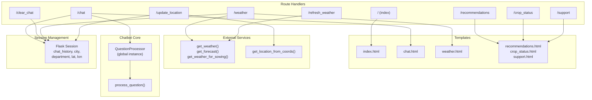
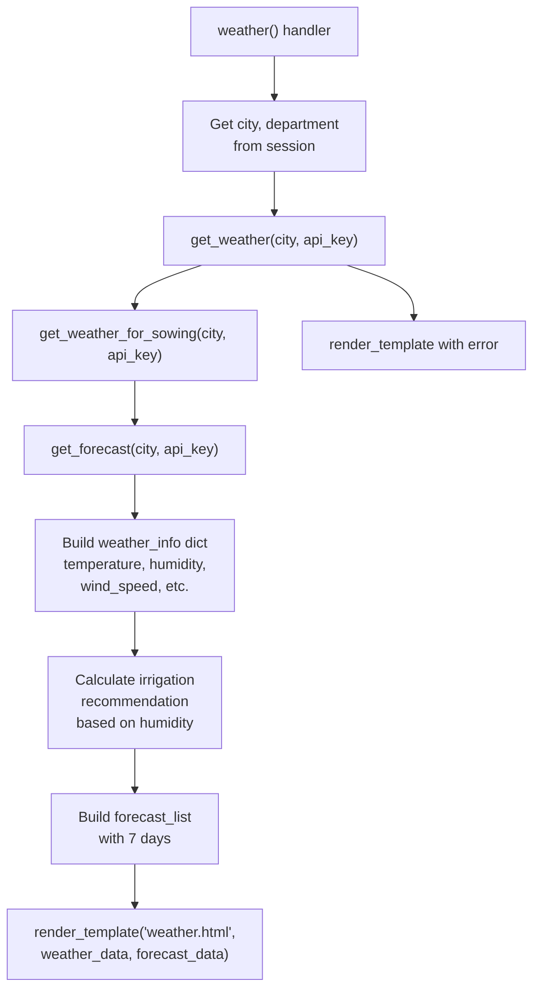
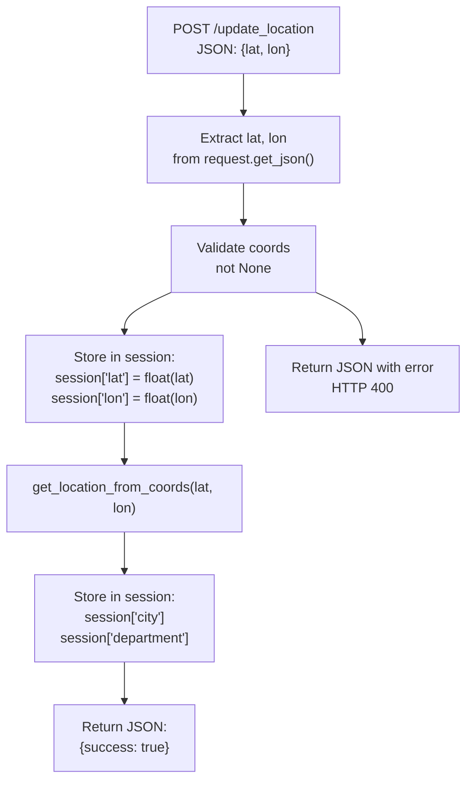
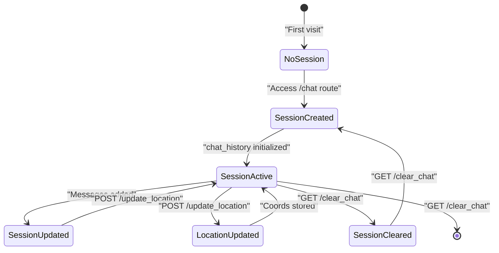

# Main Routes

> **Relevant source files**
> * [app/chatbot/question_processor.py](https://github.com/axchisan/ProyectoAgroBot/blob/bc782fcf/app/chatbot/question_processor.py)
> * [app/routes/routes.py](https://github.com/axchisan/ProyectoAgroBot/blob/bc782fcf/app/routes/routes.py)

## Purpose and Scope

This page documents the main route blueprint defined in `app/routes/routes.py`, which handles the core user-facing functionality of the Agrobot web application. This includes the chat interface, weather information, crop recommendations, and support pages. For analytics-related routes, see [Analytics Dashboard](/axchisan/ProyectoAgroBot/7.3-analytics-dashboard). For the overall Flask application structure and blueprint registration, see [Flask Application Structure](/axchisan/ProyectoAgroBot/7.1-flask-application-structure).

## Blueprint Overview

The main routes are organized as a Flask Blueprint named `main`, defined at [app/routes/routes.py L8](https://github.com/axchisan/ProyectoAgroBot/blob/bc782fcf/app/routes/routes.py#L8-L8)

 This blueprint is responsible for:

* Rendering user interface pages
* Processing chatbot interactions
* Providing weather information
* Managing session state (location, chat history)
* Handling AJAX requests for dynamic updates

The blueprint initializes a global `processor` instance at [app/routes/routes.py L11](https://github.com/axchisan/ProyectoAgroBot/blob/bc782fcf/app/routes/routes.py#L11-L11)

 by calling `init_chatbot()` with the OpenWeatherMap API key from environment variables. This processor is shared across all requests to handle question processing.

**Sources:** [app/routes/routes.py L1-L11](https://github.com/axchisan/ProyectoAgroBot/blob/bc782fcf/app/routes/routes.py#L1-L11)

## Route Mappings

The following table lists all routes defined in the main blueprint:

| Route | Methods | Purpose | Returns |
| --- | --- | --- | --- |
| `/` | GET | Landing page | Renders `index.html` |
| `/chat` | GET, POST | Chat interface and message processing | Renders `chat.html` with history |
| `/clear_chat` | GET | Clear chat session and restart | Redirect to `/chat` |
| `/weather` | GET | Weather information page | Renders `weather.html` with data |
| `/refresh_weather` | GET | AJAX endpoint for weather updates | JSON weather data |
| `/update_location` | POST | AJAX endpoint for geolocation | JSON success/error |
| `/recommendations` | GET | Crop recommendations page | Renders `recommendations.html` |
| `/crop_status` | GET | Crop growth status page | Renders `crop_status.html` |
| `/support` | GET | Support and help page | Renders `support.html` |

**Sources:** [app/routes/routes.py L13-L191](https://github.com/axchisan/ProyectoAgroBot/blob/bc782fcf/app/routes/routes.py#L13-L191)

## Route Architecture



**Sources:** [app/routes/routes.py L8-L191](https://github.com/axchisan/ProyectoAgroBot/blob/bc782fcf/app/routes/routes.py#L8-L191)

## Landing Page Route

**Route:** `/` (GET)
**Handler:** `index()` at [app/routes/routes.py L13-L15](https://github.com/axchisan/ProyectoAgroBot/blob/bc782fcf/app/routes/routes.py#L13-L15)

This simple route renders the landing page of the application. It requires no session state or data processing.

```python
@bp.route('/')
def index():
    return render_template('index.html')
```

**Sources:** [app/routes/routes.py L13-L15](https://github.com/axchisan/ProyectoAgroBot/blob/bc782fcf/app/routes/routes.py#L13-L15)

## Chat Interface Route

**Route:** `/chat` (GET, POST)
**Handler:** `chat()` at [app/routes/routes.py L17-L45](https://github.com/axchisan/ProyectoAgroBot/blob/bc782fcf/app/routes/routes.py#L17-L45)

The chat route is the core of the Agrobot system, handling both the display of the chat interface and processing of user messages.

### GET Request Flow

When accessed via GET, the route:

1. Initializes `chat_history` in session if not present [app/routes/routes.py L19-L22](https://github.com/axchisan/ProyectoAgroBot/blob/bc782fcf/app/routes/routes.py#L19-L22)
2. Sets initial greeting message with timestamp
3. Renders `chat.html` with the chat history

### POST Request Flow

```mermaid
sequenceDiagram
  participant Client
  participant /chat handler
  participant Session
  participant QuestionProcessor

  Client->>/chat handler: POST /chat
  /chat handler->>Session: form: user_input
  Session-->>/chat handler: Get lat, lon, city, department
  /chat handler->>QuestionProcessor: Location context
  QuestionProcessor-->>/chat handler: process_question(user_input, city, dept, lat, lon)
  /chat handler->>Session: Generated response
  /chat handler->>Session: Append user message + timestamp
  /chat handler->>Session: Append bot response + timestamp
  /chat handler->>/chat handler: Set modified flag
  /chat handler->>Session: Check if location update in user_input
  /chat handler->>Client: Update city/department if detected
```

**Sources:** [app/routes/routes.py L17-L45](https://github.com/axchisan/ProyectoAgroBot/blob/bc782fcf/app/routes/routes.py#L17-L45)

### Session State Management

The chat route manages the following session variables:

| Session Key | Type | Purpose |
| --- | --- | --- |
| `chat_history` | List[Dict] | Array of message objects with role, message, timestamp |
| `lat` | float | User's latitude coordinate |
| `lon` | float | User's longitude coordinate |
| `city` | str | Current city (default: "Guavatá") |
| `department` | str | Current department (default: "Santander") |

Each message in `chat_history` has the structure:

```css
{
    "role": "user" | "agrobot",
    "message": str,
    "timestamp": str  # Format: "HH:MM"
}
```

**Sources:** [app/routes/routes.py L19-L44](https://github.com/axchisan/ProyectoAgroBot/blob/bc782fcf/app/routes/routes.py#L19-L44)

### Chatbot Integration

At [app/routes/routes.py L31](https://github.com/axchisan/ProyectoAgroBot/blob/bc782fcf/app/routes/routes.py#L31-L31)

 the route calls `processor.process_question()` with:

* `user_input`: The user's message from the form
* `city`: From session or default
* `department`: From session or default
* `lat`: From session (may be None)
* `lon`: From session (may be None)

The processor returns a response string which is appended to the chat history at [app/routes/routes.py L35](https://github.com/axchisan/ProyectoAgroBot/blob/bc782fcf/app/routes/routes.py#L35-L35)

**Sources:** [app/routes/routes.py L24-L37](https://github.com/axchisan/ProyectoAgroBot/blob/bc782fcf/app/routes/routes.py#L24-L37)

 [app/chatbot/question_processor.py L132-L344](https://github.com/axchisan/ProyectoAgroBot/blob/bc782fcf/app/chatbot/question_processor.py#L132-L344)

## Clear Chat Route

**Route:** `/clear_chat` (GET)
**Handler:** `clear_chat()` at [app/routes/routes.py L47-L53](https://github.com/axchisan/ProyectoAgroBot/blob/bc782fcf/app/routes/routes.py#L47-L53)

This route resets the chat history to the initial state with only the greeting message. It sets `session.modified = True` to ensure the session is saved, then redirects to `/chat`.

**Sources:** [app/routes/routes.py L47-L53](https://github.com/axchisan/ProyectoAgroBot/blob/bc782fcf/app/routes/routes.py#L47-L53)

## Weather Information Route

**Route:** `/weather` (GET)
**Handler:** `weather()` at [app/routes/routes.py L56-L103](https://github.com/axchisan/ProyectoAgroBot/blob/bc782fcf/app/routes/routes.py#L56-L103)

This route provides comprehensive weather information for the user's current location.

### Data Retrieval Flow



**Sources:** [app/routes/routes.py L56-L103](https://github.com/axchisan/ProyectoAgroBot/blob/bc782fcf/app/routes/routes.py#L56-L103)

### Weather Data Structure

The route constructs a `weather_info` dictionary at [app/routes/routes.py L67-L84](https://github.com/axchisan/ProyectoAgroBot/blob/bc782fcf/app/routes/routes.py#L67-L84)

 with the following fields:

| Field | Source | Description |
| --- | --- | --- |
| `city` | Session | Current city name |
| `department` | Session | Current department name |
| `temperature` | `weather_data["main"]["temp"]` | Current temperature (rounded) |
| `feels_like` | `weather_data["main"]["feels_like"]` | Perceived temperature (rounded) |
| `humidity` | `weather_data["main"]["humidity"]` | Humidity percentage |
| `description` | `weather_data["weather"][0]["description"]` | Weather description (capitalized) |
| `wind_speed` | `weather_data["wind"]["speed"]` | Wind speed in km/h (converted from m/s) |
| `visibility` | `weather_data["visibility"]` | Visibility in km |
| `pressure` | `weather_data["main"]["pressure"]` | Atmospheric pressure |
| `icon_code` | `weather_data["weather"][0]["icon"]` | OpenWeatherMap icon code |
| `sowing_recommendation` | `sowing_data["recommendation"]` | Agricultural sowing advice |
| `irrigation_recommendation` | Calculated | Based on humidity threshold (70%) |

### Forecast Processing

The forecast data is processed at [app/routes/routes.py L86-L101](https://github.com/axchisan/ProyectoAgroBot/blob/bc782fcf/app/routes/routes.py#L86-L101)

:

1. Iterates through forecast data from API
2. Maps to day names (Hoy, Mañana, etc.)
3. Extracts max/min temperature, description, icon
4. Pads to 7 days by repeating the last entry if needed

**Sources:** [app/routes/routes.py L56-L103](https://github.com/axchisan/ProyectoAgroBot/blob/bc782fcf/app/routes/routes.py#L56-L103)

 [app/chatbot/weather_api.py L1-L100](https://github.com/axchisan/ProyectoAgroBot/blob/bc782fcf/app/chatbot/weather_api.py#L1-L100)

## Weather Refresh Route

**Route:** `/refresh_weather` (GET)
**Handler:** `refresh_weather()` at [app/routes/routes.py L105-L152](https://github.com/axchisan/ProyectoAgroBot/blob/bc782fcf/app/routes/routes.py#L105-L152)

This AJAX endpoint provides the same weather data as `/weather` but returns it as JSON instead of rendering a template. It is used by the frontend to update weather information without page reload.

### Response Format

Success response:

```
{
  "success": true,
  "weather": { /* weather_info object */ },
  "forecast": [ /* forecast_list array */ ]
}
```

Error response:

```json
{
  "success": false,
  "error": "No se pudo obtener el clima para [city]"
}
```

**Sources:** [app/routes/routes.py L105-L152](https://github.com/axchisan/ProyectoAgroBot/blob/bc782fcf/app/routes/routes.py#L105-L152)

## Location Update Route

**Route:** `/update_location` (POST)
**Handler:** `update_location()` at [app/routes/routes.py L154-L168](https://github.com/axchisan/ProyectoAgroBot/blob/bc782fcf/app/routes/routes.py#L154-L168)

This AJAX endpoint receives geolocation coordinates from the browser and updates the session state.

### Request Processing



**Sources:** [app/routes/routes.py L154-L168](https://github.com/axchisan/ProyectoAgroBot/blob/bc782fcf/app/routes/routes.py#L154-L168)

 [app/chatbot/location_handler.py L1-L150](https://github.com/axchisan/ProyectoAgroBot/blob/bc782fcf/app/chatbot/location_handler.py#L1-L150)

### Geocoding Integration

The route uses `get_location_from_coords()` from the location handler at [app/routes/routes.py L162](https://github.com/axchisan/ProyectoAgroBot/blob/bc782fcf/app/routes/routes.py#L162-L162)

 to reverse geocode the coordinates into city and department names. If geocoding succeeds, it updates the session with the new location information (defaulting to "Guavatá" and "Santander" if unavailable).

**Sources:** [app/routes/routes.py L154-L168](https://github.com/axchisan/ProyectoAgroBot/blob/bc782fcf/app/routes/routes.py#L154-L168)

## Recommendations Route

**Route:** `/recommendations` (GET)
**Handler:** `recommend()` at [app/routes/routes.py L170-L177](https://github.com/axchisan/ProyectoAgroBot/blob/bc782fcf/app/routes/routes.py#L170-L177)

This route displays agricultural recommendations. Currently, it uses static placeholder data defined at [app/routes/routes.py L172-L176](https://github.com/axchisan/ProyectoAgroBot/blob/bc782fcf/app/routes/routes.py#L172-L176)

:

```
recommendations_data = [
    {"icon": "corn", "text": "Mejor fecha de siembra"},
    {"icon": "wheat", "text": "Tipo de fertilizante"},
    {"icon": "sunflower", "text": "Rotación de cultivos"}
]
```

The data is passed to the `recommendations.html` template for rendering.

**Sources:** [app/routes/routes.py L170-L177](https://github.com/axchisan/ProyectoAgroBot/blob/bc782fcf/app/routes/routes.py#L170-L177)

## Crop Status Route

**Route:** `/crop_status` (GET)
**Handler:** `crop_status()` at [app/routes/routes.py L179-L187](https://github.com/axchisan/ProyectoAgroBot/blob/bc782fcf/app/routes/routes.py#L179-L187)

This route displays crop growth and health information. Like the recommendations route, it currently uses static placeholder data at [app/routes/routes.py L181-L186](https://github.com/axchisan/ProyectoAgroBot/blob/bc782fcf/app/routes/routes.py#L181-L186)

:

```
crop_data = {
    "growth_level": 70,
    "irrigation_needed": 90,
    "pests_detected": 10,
    "message": "El crecimiento de los cultivos es bueno..."
}
```

**Sources:** [app/routes/routes.py L179-L187](https://github.com/axchisan/ProyectoAgroBot/blob/bc782fcf/app/routes/routes.py#L179-L187)

## Support Route

**Route:** `/support` (GET)
**Handler:** `support()` at [app/routes/routes.py L189-L191](https://github.com/axchisan/ProyectoAgroBot/blob/bc782fcf/app/routes/routes.py#L189-L191)

This simple route renders the support and help page. It requires no data processing and directly renders the `support.html` template.

**Sources:** [app/routes/routes.py L189-L191](https://github.com/axchisan/ProyectoAgroBot/blob/bc782fcf/app/routes/routes.py#L189-L191)

## Session Management Pattern

The main routes blueprint relies heavily on Flask's session management for maintaining user context across requests. The following diagram illustrates the session lifecycle:



**Sources:** [app/routes/routes.py L17-L168](https://github.com/axchisan/ProyectoAgroBot/blob/bc782fcf/app/routes/routes.py#L17-L168)

## Integration with Chatbot Core

The main routes blueprint interacts with the chatbot system through the global `processor` instance initialized at [app/routes/routes.py L11](https://github.com/axchisan/ProyectoAgroBot/blob/bc782fcf/app/routes/routes.py#L11-L11)

 This integration follows a specific pattern:

### Initialization

```
processor = init_chatbot(weather_api_key=os.getenv("OPENWEATHERMAP_API_KEY"))
```

The `init_chatbot()` function (documented in [Chatbot Initialization](/axchisan/ProyectoAgroBot/4.1-chatbot-initialization)) returns a `QuestionProcessor` instance that is reused across all requests. This ensures efficient resource usage as the NLP model and data loaders are initialized only once.

### Request Processing

When handling a chat message at [app/routes/routes.py L31](https://github.com/axchisan/ProyectoAgroBot/blob/bc782fcf/app/routes/routes.py#L31-L31)

 the route calls:

```
response = processor.process_question(user_input, city=city, department=department, lat=lat, lon=lon)
```

The `process_question()` method (detailed in [Question Processing](/axchisan/ProyectoAgroBot/4.2-question-processing)) performs:

1. Text normalization
2. Context updates from user input and coordinates
3. Intent classification via NLPProcessor
4. Response generation based on intent
5. External API fallback for unmatched queries

**Sources:** [app/routes/routes.py L11](https://github.com/axchisan/ProyectoAgroBot/blob/bc782fcf/app/routes/routes.py#L11-L11)

 [app/routes/routes.py L24-L44](https://github.com/axchisan/ProyectoAgroBot/blob/bc782fcf/app/routes/routes.py#L24-L44)

 [app/chatbot/question_processor.py L132-L344](https://github.com/axchisan/ProyectoAgroBot/blob/bc782fcf/app/chatbot/question_processor.py#L132-L344)

## Error Handling

The routes implement error handling at different levels:

### Weather Routes

Weather routes at [app/routes/routes.py L56-L152](https://github.com/axchisan/ProyectoAgroBot/blob/bc782fcf/app/routes/routes.py#L56-L152)

 check for API response validity:

* If `weather_data` and `weather_data.get('main')` and `sowing_data` are all truthy, proceed with rendering
* Otherwise, render template with error message in `weather_data["error"]`

### Location Route

The location update route at [app/routes/routes.py L154-L168](https://github.com/axchisan/ProyectoAgroBot/blob/bc782fcf/app/routes/routes.py#L154-L168)

 validates coordinates:

* Returns HTTP 400 with error JSON if coordinates are None
* Returns success JSON if coordinates are valid

### Chat Route

The chat route implicitly handles errors through the `QuestionProcessor`:

* If no match is found, falls back to external API call
* If external API fails, returns error message
* Session state is always updated even if processing fails

**Sources:** [app/routes/routes.py L56-L168](https://github.com/axchisan/ProyectoAgroBot/blob/bc782fcf/app/routes/routes.py#L56-L168)

 [app/chatbot/question_processor.py L96-L131](https://github.com/axchisan/ProyectoAgroBot/blob/bc782fcf/app/chatbot/question_processor.py#L96-L131)