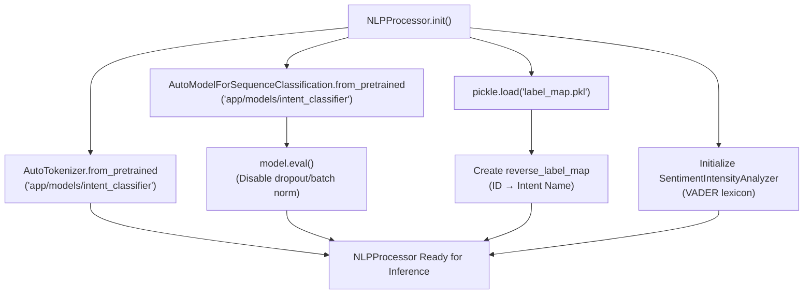
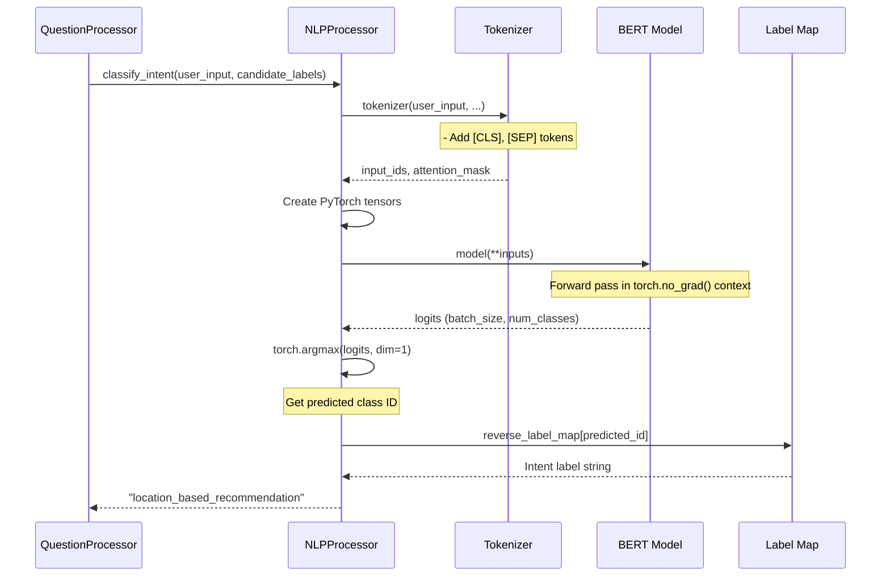
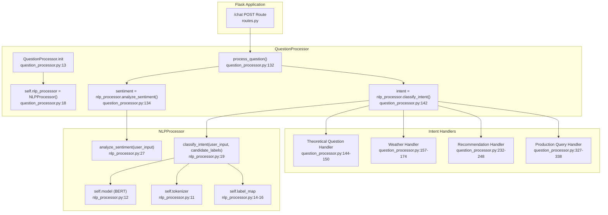
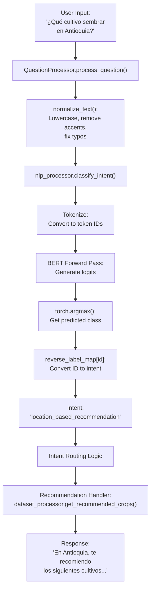
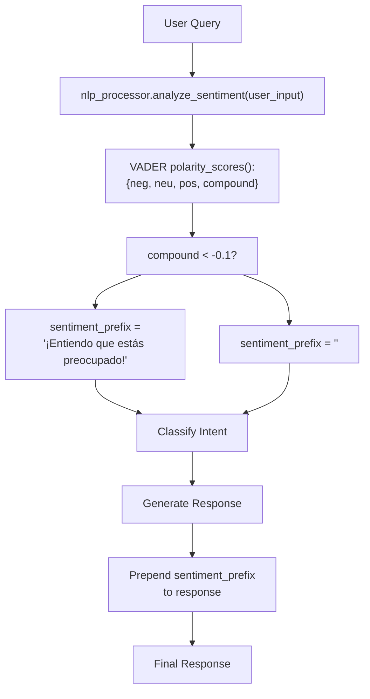

# Model Deployment and Inference

> **Relevant source files**
> * [app/chatbot/nlp_processor.py](https://github.com/axchisan/ProyectoAgroBot/blob/bc782fcf/app/chatbot/nlp_processor.py)
> * [app/chatbot/question_processor.py](https://github.com/axchisan/ProyectoAgroBot/blob/bc782fcf/app/chatbot/question_processor.py)

## Purpose and Scope

This document describes how trained intent classification models are deployed and used at runtime in the Agrobot system. It covers model artifact organization, the loading process through the `NLPProcessor` class, the inference pipeline for classifying user intents, and integration with the chatbot's question processing workflow.

For information about the model architecture and training process, see [Model Training Pipeline](/axchisan/ProyectoAgroBot/8.3-model-training-pipeline). For details on how classified intents are routed to response handlers, see [Question Processing](/axchisan/ProyectoAgroBot/4.2-question-processing).

---

## Model Artifact Organization

The trained intent classification model and its dependencies are stored in a dedicated directory structure that enables seamless loading at runtime. All model artifacts are saved during the training phase and persist as static files that the application loads during initialization.

### Artifact Location and Structure

| Artifact | Path | Purpose |
| --- | --- | --- |
| Model Weights | `app/models/intent_classifier/` | Pre-trained BERT model fine-tuned for Spanish agricultural intents |
| Tokenizer | `app/models/intent_classifier/` | Hugging Face tokenizer for text preprocessing |
| Label Map | `app/models/intent_classifier/label_map.pkl` | Bidirectional mapping between intent names and numeric IDs |
| Model Config | `app/models/intent_classifier/config.json` | Model architecture and configuration metadata |

The model directory follows the Hugging Face Transformers standard format, allowing the model to be loaded using `AutoModelForSequenceClassification.from_pretrained()`. This convention enables compatibility with the entire Hugging Face ecosystem and simplifies model versioning.

**Sources:** [app/chatbot/nlp_processor.py L11-L15](https://github.com/axchisan/ProyectoAgroBot/blob/bc782fcf/app/chatbot/nlp_processor.py#L11-L15)

---

## Model Loading Process

The `NLPProcessor` class encapsulates all model loading and inference logic. It initializes model components during instantiation, ensuring that the model is ready for inference when the chatbot processes its first request.

### NLPProcessor Initialization



**Initialization Sequence**

1. **Tokenizer Loading**: The Spanish BERT tokenizer is loaded from the saved model directory. This tokenizer performs vocabulary mapping and special token insertion (e.g., `[CLS]`, `[SEP]`).
2. **Model Loading**: The sequence classification model is loaded with all fine-tuned weights. The model is immediately set to evaluation mode via `model.eval()` to disable dropout and batch normalization layers.
3. **Label Map Loading**: The pickled label map provides bidirectional conversion: * `label_map`: Intent name (str) → Numeric ID (int) * `reverse_label_map`: Numeric ID (int) → Intent name (str)
4. **Sentiment Analyzer**: A VADER sentiment analyzer is initialized for auxiliary sentiment analysis, which helps the chatbot adjust response tone.

**Sources:** [app/chatbot/nlp_processor.py L9-L17](https://github.com/axchisan/ProyectoAgroBot/blob/bc782fcf/app/chatbot/nlp_processor.py#L9-L17)

---

## Inference Pipeline

The inference process transforms raw user input into a predicted intent label through tokenization, model forward pass, and label decoding.

### classify_intent Method



### Tokenization Configuration

The tokenizer applies the following transformations to user input:

| Parameter | Value | Purpose |
| --- | --- | --- |
| `return_tensors` | `"pt"` | Return PyTorch tensors |
| `padding` | `True` | Pad sequences to max_length |
| `truncation` | `True` | Truncate sequences exceeding max_length |
| `max_length` | `128` | Maximum sequence length (tokens) |

This configuration ensures that all inputs are normalized to a fixed shape compatible with the model's input layer, while efficiently handling variable-length user queries.

### Inference Optimization

The inference pipeline employs several optimizations:

1. **No Gradient Computation**: The `torch.no_grad()` context manager disables gradient calculation, reducing memory consumption and accelerating inference.
2. **Evaluation Mode**: The model is set to evaluation mode during initialization (`model.eval()`), ensuring consistent behavior across inference calls.
3. **Batch Processing Ready**: Although the chatbot processes single queries, the implementation supports batch processing through the tokenizer's padding mechanism.

**Sources:** [app/chatbot/nlp_processor.py L19-L25](https://github.com/axchisan/ProyectoAgroBot/blob/bc782fcf/app/chatbot/nlp_processor.py#L19-L25)

---

## Runtime Integration Architecture

The `NLPProcessor` is integrated into the chatbot's question processing workflow as a core component for intent-based routing. It provides the intelligence layer that determines how user queries should be handled.

### Component Integration



### Integration Points

The `NLPProcessor` integrates into the chatbot system at three key points:

1. **Initialization**: A single `NLPProcessor` instance is created when `QuestionProcessor` is instantiated, ensuring model loading occurs once rather than per-request.
2. **Intent Classification**: Every user query is classified to determine the appropriate response strategy. The predicted intent drives control flow in the `process_question` method.
3. **Sentiment Analysis**: User sentiment is analyzed to adjust response tone. Negative sentiment (`compound < -0.1`) triggers empathetic prefixes like "¡Entiendo que estás preocupado!".

**Sources:** [app/chatbot/question_processor.py L18](https://github.com/axchisan/ProyectoAgroBot/blob/bc782fcf/app/chatbot/question_processor.py#L18-L18)

 [app/chatbot/question_processor.py L134](https://github.com/axchisan/ProyectoAgroBot/blob/bc782fcf/app/chatbot/question_processor.py#L134-L134)

 [app/chatbot/question_processor.py L142](https://github.com/axchisan/ProyectoAgroBot/blob/bc782fcf/app/chatbot/question_processor.py#L142-L142)

---

## Intent Classification Workflow

The classification workflow demonstrates how the model integrates with the broader chatbot logic to route queries to specialized handlers.

### End-to-End Classification Flow



### Supported Intent Categories

The model classifies user queries into 14 distinct intent types, which are organized into 5 functional categories:

| Category | Intent Labels | Handler Location |
| --- | --- | --- |
| **Knowledge Base** | `theoretical` | [question_processor.py L144-L150](https://github.com/axchisan/ProyectoAgroBot/blob/bc782fcf/question_processor.py#L144-L150) |
| **Weather Services** | `weather`, `weather_forecast`, `weather_sowing_advice` | [question_processor.py L157-L205](https://github.com/axchisan/ProyectoAgroBot/blob/bc782fcf/question_processor.py#L157-L205) |
| **Location Context** | `current_location`, `location_based_recommendation` | [question_processor.py L177-L183](https://github.com/axchisan/ProyectoAgroBot/blob/bc782fcf/question_processor.py#L177-L183) <br>  [question_processor.py L241-L248](https://github.com/axchisan/ProyectoAgroBot/blob/bc782fcf/question_processor.py#L241-L248) |
| **Agricultural Data** | `recommendation`, `crop_profitability`, `crop_production`, `recommended_crops`, `production_query` | [question_processor.py L232-L338](https://github.com/axchisan/ProyectoAgroBot/blob/bc782fcf/question_processor.py#L232-L338) |
| **Timing & Advice** | `crop_timing`, `irrigation_advice`, `least_favorable_department` | [question_processor.py L299-L316](https://github.com/axchisan/ProyectoAgroBot/blob/bc782fcf/question_processor.py#L299-L316) |

Each intent is mapped to a specialized handler that generates context-appropriate responses using agricultural datasets, external APIs, or the knowledge base.

**Sources:** [app/chatbot/question_processor.py L22-L27](https://github.com/axchisan/ProyectoAgroBot/blob/bc782fcf/app/chatbot/question_processor.py#L22-L27)

 [app/chatbot/question_processor.py L142-L338](https://github.com/axchisan/ProyectoAgroBot/blob/bc782fcf/app/chatbot/question_processor.py#L142-L338)

---

## Sentiment Analysis Integration

The `NLPProcessor` provides auxiliary sentiment analysis using NLTK's VADER (Valence Aware Dictionary and sEntiment Reasoner) lexicon. This analysis complements intent classification by detecting user emotional state.

### Sentiment-Aware Response Adaptation



The sentiment analysis produces a dictionary with four scores:

* **neg**: Negative sentiment proportion
* **neu**: Neutral sentiment proportion
* **pos**: Positive sentiment proportion
* **compound**: Normalized aggregate score (-1 to +1)

When the compound score falls below -0.1, the chatbot prepends an empathetic acknowledgment to its response, improving perceived conversational quality for frustrated users.

**Sources:** [app/chatbot/nlp_processor.py L27-L28](https://github.com/axchisan/ProyectoAgroBot/blob/bc782fcf/app/chatbot/nlp_processor.py#L27-L28)

 [app/chatbot/question_processor.py L134-L135](https://github.com/axchisan/ProyectoAgroBot/blob/bc782fcf/app/chatbot/question_processor.py#L134-L135)

---

## Model Loading and Initialization Lifecycle

Understanding when and how the model loads is critical for deployment planning and performance optimization.

### Application Startup Sequence

```mermaid
sequenceDiagram
  participant Flask App
  participant init_chatbot()
  participant QuestionProcessor
  participant NLPProcessor
  participant File System

  note over Flask App: Application starts (app.py or main.py)
  Flask App->>init_chatbot(): Call init_chatbot()
  note over init_chatbot(): Load questions.json
  init_chatbot()->>QuestionProcessor: QuestionProcessor(...)
  note over QuestionProcessor: __init__ invoked
  QuestionProcessor->>NLPProcessor: self.nlp_processor = NLPProcessor()
  note over NLPProcessor: __init__ invoked
  NLPProcessor->>File System: Load tokenizer from app/models/intent_classifier/
  File System-->>NLPProcessor: Tokenizer object
  NLPProcessor->>File System: Load model from app/models/intent_classifier/
  File System-->>NLPProcessor: BERT model with trained weights
  NLPProcessor->>NLPProcessor: model.eval()
  NLPProcessor->>File System: Load label_map.pkl
  File System-->>NLPProcessor: Intent label mapping
  NLPProcessor->>NLPProcessor: Create reverse_label_map
  NLPProcessor-->>QuestionProcessor: NLPProcessor instance (ready)
  QuestionProcessor-->>init_chatbot(): QuestionProcessor instance
  init_chatbot()-->>Flask App: Chatbot components ready
  note over Flask App: Application ready to serve requests
```

### Lifecycle Characteristics

1. **Eager Loading**: The model loads during application startup, not on first request. This increases startup time but eliminates cold-start latency for users.
2. **Singleton Pattern**: A single `NLPProcessor` instance is created and reused across all requests. This shares model weights in memory and avoids redundant loading.
3. **Startup Time**: Model loading adds approximately 2-5 seconds to application startup, depending on hardware and model size.
4. **Memory Footprint**: The loaded BERT model consumes approximately 400-500 MB of RAM, which remains allocated throughout the application lifecycle.

**Sources:** [app/chatbot/nlp_processor.py L10-L17](https://github.com/axchisan/ProyectoAgroBot/blob/bc782fcf/app/chatbot/nlp_processor.py#L10-L17)

 [app/chatbot/question_processor.py L13-L18](https://github.com/axchisan/ProyectoAgroBot/blob/bc782fcf/app/chatbot/question_processor.py#L13-L18)

---

## Performance Considerations

The inference system is optimized for low-latency single-query processing while maintaining accuracy and resource efficiency.

### Inference Latency Profile

| Component | Typical Latency | Notes |
| --- | --- | --- |
| Tokenization | 1-2 ms | Vocabulary lookup and tensor creation |
| Model Forward Pass | 50-100 ms | CPU inference on BERT-base architecture |
| Label Decoding | <1 ms | Simple dictionary lookup |
| **Total** | **50-105 ms** | Per classification call |

### Optimization Strategies

1. **No Gradient Context**: Wrapping inference in `torch.no_grad()` prevents gradient tracking, reducing memory usage by approximately 30-40%.
2. **Evaluation Mode**: Setting `model.eval()` disables dropout, ensuring deterministic inference and eliminating unnecessary stochastic operations.
3. **Batch Size 1**: The implementation processes single queries without batching. While batching could improve throughput for concurrent requests, it would increase individual request latency.
4. **CPU Inference**: The model runs on CPU without GPU acceleration. For the model size and query volume, CPU inference provides sufficient performance without requiring GPU deployment infrastructure.

### Memory Management

The inference pipeline manages memory efficiently through several mechanisms:

* **Static Memory Allocation**: Model weights are loaded once and reused, avoiding per-request allocation overhead.
* **Automatic Garbage Collection**: PyTorch tensors are automatically freed after inference completes.
* **Fixed-Length Padding**: The `max_length=128` parameter ensures predictable memory consumption across variable-length inputs.

**Sources:** [app/chatbot/nlp_processor.py L19-L25](https://github.com/axchisan/ProyectoAgroBot/blob/bc782fcf/app/chatbot/nlp_processor.py#L19-L25)

---

## Error Handling and Fallback

The inference system includes basic error handling, with fallback mechanisms at the application level to ensure robustness.

### Classification Failure Scenarios

| Scenario | Detection | Fallback Behavior |
| --- | --- | --- |
| Unknown Intent | `predicted_label == "unknown"` | Application falls back to pattern matching or external API |
| Low Confidence | Not explicitly checked | System proceeds with predicted intent |
| Model Load Failure | Exception during initialization | Application fails to start (no graceful degradation) |

The current implementation assumes successful model loading and treats all predictions as valid. Low-confidence predictions are not filtered, meaning the chatbot relies on downstream logic to validate intent appropriateness.

### Integration with Fallback Strategy

When intent classification does not match any known pattern, the `QuestionProcessor` implements a multi-tier fallback:

1. **Pattern Matching**: Check dynamic questions in knowledge base
2. **Word Count Heuristic**: If query length exceeds 6 words and no pattern matches, invoke OpenAI API
3. **Default Response**: If all else fails, prompt user to reformulate

This strategy ensures that even if the intent classifier produces an irrelevant prediction, the user still receives a meaningful response.

**Sources:** [app/chatbot/question_processor.py L340-L343](https://github.com/axchisan/ProyectoAgroBot/blob/bc782fcf/app/chatbot/question_processor.py#L340-L343)

---

## Deployment Configurations

The model deployment architecture supports multiple deployment scenarios through environment-agnostic path resolution and containerization.

### Local Development Deployment

In local development, the model is loaded directly from the `app/models/intent_classifier/` directory. This enables rapid iteration without rebuilding containers or transferring artifacts.

### Docker Containerized Deployment

The Docker deployment includes model artifacts in the container image:

```python
docker-compose.yaml mounts app/models/ as a volume
    ↓
Container has access to app/models/intent_classifier/
    ↓
NLPProcessor loads model from mounted path
```

This approach balances convenience (model travels with code) with flexibility (volume mounts allow model updates without image rebuilds).

### Model Versioning Considerations

The current implementation lacks explicit model versioning. To support multiple model versions:

1. Create versioned subdirectories: `app/models/intent_classifier_v1/`, `app/models/intent_classifier_v2/`
2. Configure model path via environment variable
3. Modify `NLPProcessor.__init__()` to accept configurable model path

**Sources:** [app/chatbot/nlp_processor.py L11-L12](https://github.com/axchisan/ProyectoAgroBot/blob/bc782fcf/app/chatbot/nlp_processor.py#L11-L12)

---

## Summary

The model deployment and inference system centers on the `NLPProcessor` class, which encapsulates model loading, inference execution, and label decoding. Key characteristics include:

* **Eager Loading**: Models load at application startup for zero cold-start latency
* **Singleton Pattern**: Single shared instance reduces memory footprint
* **Optimized Inference**: `torch.no_grad()` and evaluation mode minimize overhead
* **Tight Integration**: Intent classification drives the entire chatbot routing logic
* **Production-Ready**: Containerized deployment with volume-mounted model artifacts

The inference pipeline achieves 50-105 ms latency per classification, enabling real-time conversational experiences while maintaining the accuracy benefits of fine-tuned BERT models.

**Sources:** [app/chatbot/nlp_processor.py L1-L28](https://github.com/axchisan/ProyectoAgroBot/blob/bc782fcf/app/chatbot/nlp_processor.py#L1-L28)

 [app/chatbot/question_processor.py L13-L343](https://github.com/axchisan/ProyectoAgroBot/blob/bc782fcf/app/chatbot/question_processor.py#L13-L343)