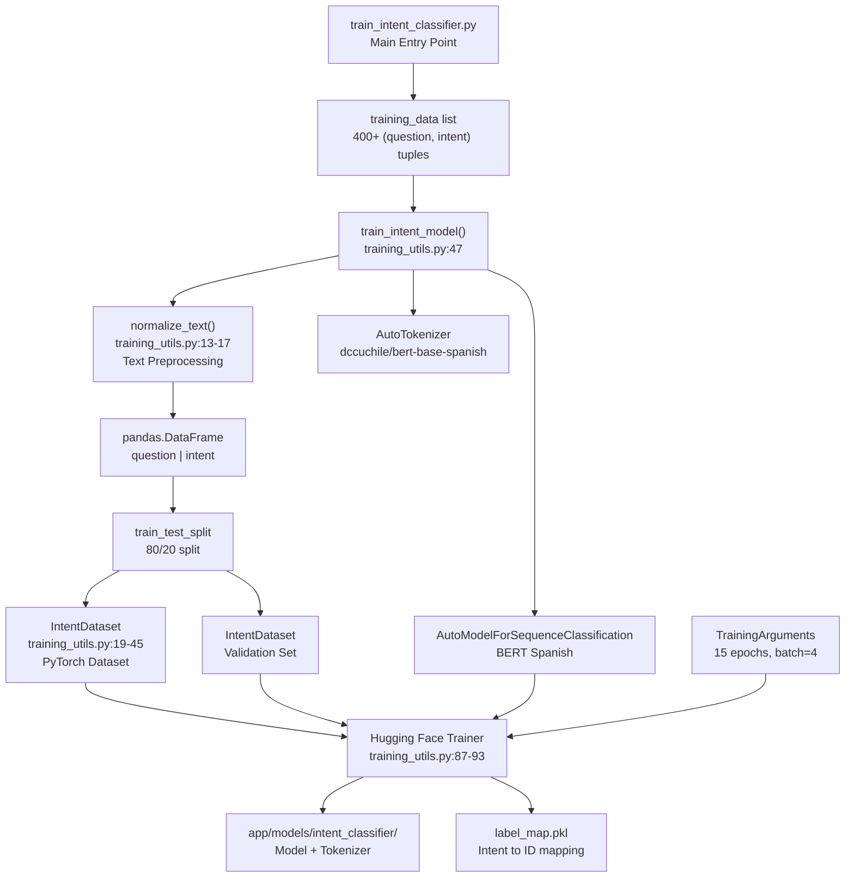
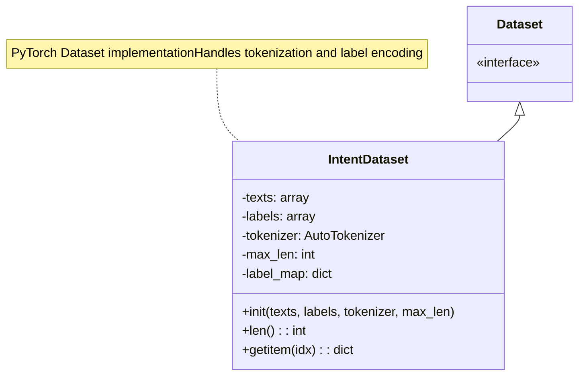
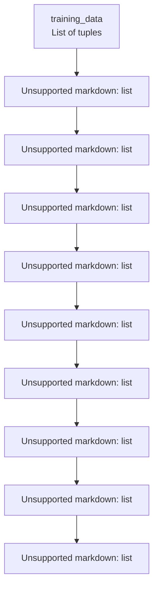
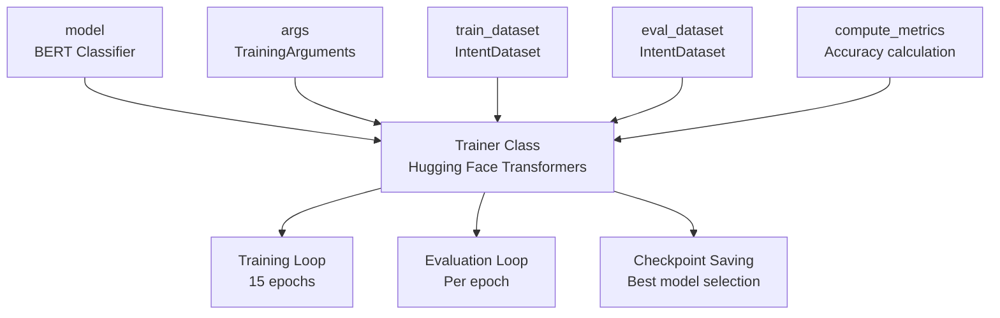
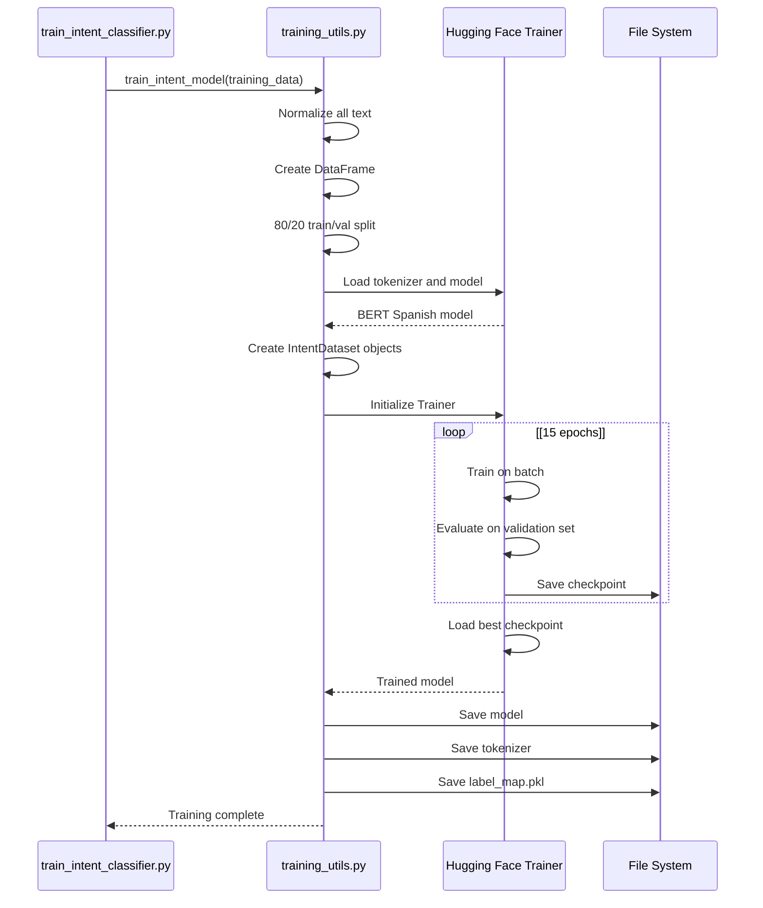
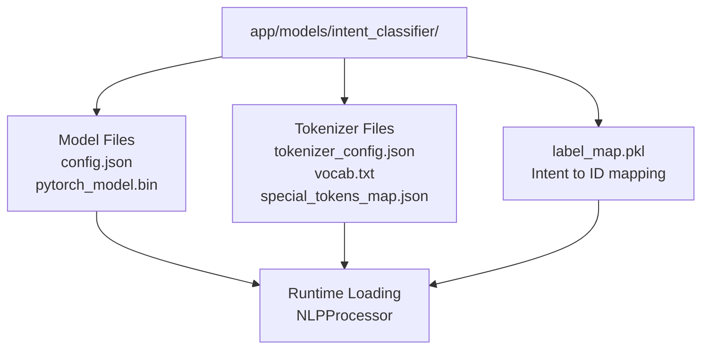
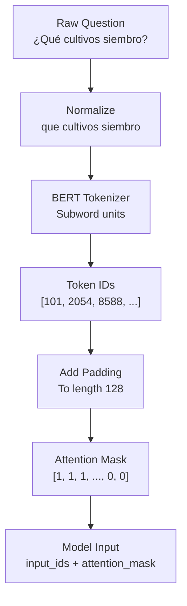
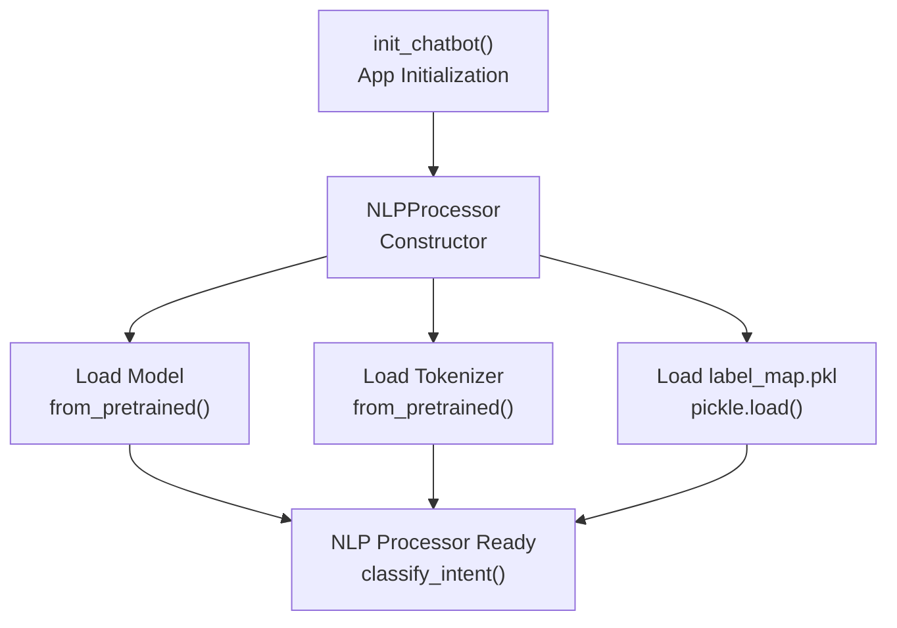

# Canal de formación de modelos

> **Archivos fuente relevantes**
> * [aplicación/chatbot/training_utils.py](https://github.com/axchisan/ProyectoAgroBot/blob/bc782fcf/app/chatbot/training_utils.py)
> * [aplicación/estática/css/estilo.css](https://github.com/axchisan/ProyectoAgroBot/blob/bc782fcf/app/static/css/style.css)
> * [aplicación/plantillas/chat.html](https://github.com/axchisan/ProyectoAgroBot/blob/bc782fcf/app/templates/chat.html)
> * [clasificador_de_intentos_de_entrenamiento.py](https://github.com/axchisan/ProyectoAgroBot/blob/bc782fcf/train_intent_classifier.py)

## Propósito y alcance

Este documento describe el proceso de entrenamiento de aprendizaje automático que genera el modelo de clasificación de intenciones utilizado por el sistema de PLN de Agrobot. Abarca la ejecución del script de entrenamiento, el preprocesamiento de datos, la arquitectura del modelo, la configuración de hiperparámetros y los artefactos de salida.

Para obtener información sobre la estructura de datos de entrenamiento y los tipos de intención, consulte [Datos y proceso de entrenamiento](/axchisan/ProyectoAgroBot/8.2-training-data-and-process) . Para obtener más información sobre cómo se carga y utiliza el modelo entrenado en tiempo de ejecución, consulte [Implementación e inferencia del modelo](/axchisan/ProyectoAgroBot/8.4-model-deployment-and-inference) . Para conocer la arquitectura general de clasificación de intenciones, consulte [Modelo de clasificación de intenciones](/axchisan/ProyectoAgroBot/8.1-intent-classification-model) .

---

## Descripción general del proceso de capacitación

El flujo de trabajo de entrenamiento transforma los pares pregunta-intención sin procesar en un clasificador basado en BERT listo para producción. El proceso está orquestado por `train_intent_classifier.py`quién delega la lógica de entrenamiento a `training_utils.py`.

**Flujo de la canalización de formación**



**Fuentes:** [train_intent_classifier.py L1-L289](https://github.com/axchisan/ProyectoAgroBot/blob/bc782fcf/train_intent_classifier.py#L1-L289)

 [training_utils.py L1-L107](https://github.com/axchisan/ProyectoAgroBot/blob/bc782fcf/app/chatbot/training_utils.py#L1-L107)

---

## Estructura del guión de entrenamiento

### Guión de entrenamiento principal

El punto de entrada principal es `train_intent_classifier.py`, que define el conjunto de datos de entrenamiento e invoca la secuencia de entrenamiento.

**Componentes clave:**

| Componente | Ubicación | Objetivo |
| --- | --- | --- |
| `training_data` | [train_intent_classifier.py L4-L286](https://github.com/axchisan/ProyectoAgroBot/blob/bc782fcf/train_intent_classifier.py#L4-L286) | Lista de más de 400 tuplas (preguntas, intenciones) con variaciones |
| Tipos de intención | A lo largo de los datos de entrenamiento | 14 categorías de intención distintas (teórica, meteorológica, ubicación, etc.) |
| Ejecución de script | [train_intent_classifier.py L288-L289](https://github.com/axchisan/ProyectoAgroBot/blob/bc782fcf/train_intent_classifier.py#L288-L289) | Llamadas `train_intent_model()`con datos de entrenamiento |

Los datos de entrenamiento incluyen amplias variaciones para mayor robustez:

* Lenguaje formal e informal
* Errores tipográficos intencionales (p. ej., "Q" para "Qué", "k" para "qué")
* Varias ciudades y departamentos colombianos
* Patrones de fraseo variados

**Fuentes:** [train_intent_classifier.py L1-L289](https://github.com/axchisan/ProyectoAgroBot/blob/bc782fcf/train_intent_classifier.py#L1-L289)

---

## Módulo de Utilidades de Capacitación

### Normalización de texto

La `normalize_text()`función preprocesa todas las preguntas de entrenamiento para mantener la coherencia.

**Función:** `normalize_text(text: str) -> str`

**Ubicación:** [training_utils.py L13-L17](https://github.com/axchisan/ProyectoAgroBot/blob/bc782fcf/app/chatbot/training_utils.py#L13-L17)

**Pasos de normalización:**

1. Convertir a minúsculas
2. Quitar los espacios en blanco iniciales y finales
3. Eliminar signos de puntuación: `¿`, `¡`, `!`, `?`, `.`, `,`,`;`

Esto garantiza que el modelo aprenda patrones semánticos en lugar de dependencias de puntuación.

**Fuentes:** [training_utils.py L13-L17](https://github.com/axchisan/ProyectoAgroBot/blob/bc782fcf/app/chatbot/training_utils.py#L13-L17)

### Clase IntentDataset

La `IntentDataset`clase envuelve los datos de entrenamiento como un conjunto de datos de PyTorch para su procesamiento por lotes.

**Definición de clase**



**Atributos clave:**

| Atributo | Tipo | Descripción |
| --- | --- | --- |
| `texts` | formación | Cadenas de preguntas normalizadas |
| `labels` | formación | Cadenas de categorías de intención |
| `tokenizer` | AutoTokenizador | Tokenizador español BERT |
| `max_len` | entero | Longitud máxima de secuencia (predeterminado: 128) |
| `label_map` | dictado | Asigna cadenas de intención a identificaciones de números enteros |

**`__getitem__()`Método:**

Devuelve un diccionario que contiene:

* `input_ids`:Secuencia de entrada tokenizada (forma: [128])
* `attention_mask`:Máscara de atención para relleno (forma: [128])
* `labels`:ID de etiqueta entera (forma: [1])

**Fuentes:** [training_utils.py L19-L45](https://github.com/axchisan/ProyectoAgroBot/blob/bc782fcf/app/chatbot/training_utils.py#L19-L45)

---

## Función principal de entrenamiento

### modelo_de_intención_de_entrenamiento()

La `train_intent_model()`función orquesta todo el proceso de entrenamiento.

**Firma de la función:**

```
train_intent_model(training_data, output_dir="app/models/intent_classifier")
```

**Ubicación:** [training_utils.py L47-L107](https://github.com/axchisan/ProyectoAgroBot/blob/bc782fcf/app/chatbot/training_utils.py#L47-L107)

**Pasos del proceso de formación**



**Fuentes:** [training_utils.py L47-L107](https://github.com/axchisan/ProyectoAgroBot/blob/bc782fcf/app/chatbot/training_utils.py#L47-L107)

---

## Arquitectura del modelo

### Configuración base de BERT

The pipeline uses a pre-trained Spanish BERT model as the foundation.

**Model Details:**

| Configuration | Value |
| --- | --- |
| Base model | `dccuchile/bert-base-spanish-wwm-uncased` |
| Architecture | BERT with sequence classification head |
| Tokenizer | `AutoTokenizer` from same model |
| Number of labels | Dynamic (14 unique intents) |
| Maximum sequence length | 128 tokens |

**Model Loading:**

```markdown
# Lines 63-64 in training_utils.py
tokenizer = AutoTokenizer.from_pretrained('dccuchile/bert-base-spanish-wwm-uncased')
model = AutoModelForSequenceClassification.from_pretrained(
    'dccuchile/bert-base-spanish-wwm-uncased', 
    num_labels=len(set(labels))
)
```

The Spanish BERT model is specifically chosen for Colombian agricultural terminology understanding.

**Sources:** [app/chatbot/training_utils.py L62-L64](https://github.com/axchisan/ProyectoAgroBot/blob/bc782fcf/app/chatbot/training_utils.py#L62-L64)

---

## Training Configuration

### Hyperparameters

The training uses carefully tuned hyperparameters optimized for the small dataset size.

**TrainingArguments Configuration:**

| Parameter | Value | Purpose |
| --- | --- | --- |
| `output_dir` | `./results` | Checkpoint storage directory |
| `num_train_epochs` | 15 | Total training epochs |
| `per_device_train_batch_size` | 4 | Training batch size |
| `per_device_eval_batch_size` | 4 | Validation batch size |
| `warmup_steps` | 1000 | Learning rate warmup steps |
| `weight_decay` | 0.01 | L2 regularization |
| `learning_rate` | 2e-5 | AdamW optimizer learning rate |
| `eval_strategy` | `"epoch"` | Evaluate after each epoch |
| `save_strategy` | `"epoch"` | Save checkpoint after each epoch |
| `load_best_model_at_end` | `True` | Load best checkpoint at completion |

**Hyperparameter Rationale:**

* **15 epochs**: Sufficient for small dataset without overfitting
* **Batch size 4**: Balances memory constraints with gradient stability
* **Learning rate 2e-5**: Standard BERT fine-tuning rate
* **Warmup steps 1000**: Gradual learning rate increase prevents early divergence

**Sources:** [app/chatbot/training_utils.py L71-L84](https://github.com/axchisan/ProyectoAgroBot/blob/bc782fcf/app/chatbot/training_utils.py#L71-L84)

### Trainer Configuration

The Hugging Face `Trainer` class manages the training loop.

**Trainer Setup**



**Accuracy Metric:**

```css
# Line 92 in training_utils.py
compute_metrics=lambda p: {
    "accuracy": (p.predictions.argmax(-1) == p.label_ids).mean()
}
```

The accuracy metric compares predicted intent IDs against ground truth labels.

**Sources:** [app/chatbot/training_utils.py L87-L96](https://github.com/axchisan/ProyectoAgroBot/blob/bc782fcf/app/chatbot/training_utils.py#L87-L96)

---

## Training Execution

### Training Process Flow

**Execution Sequence**



**Sources:** [app/chatbot/training_utils.py L47-L107](https://github.com/axchisan/ProyectoAgroBot/blob/bc782fcf/app/chatbot/training_utils.py#L47-L107)

### Logging and Monitoring

**Logging Configuration:**

| Log Type | Directory | Frequency |
| --- | --- | --- |
| Training logs | `./logs` | Every 10 steps |
| Checkpoints | `./results` | Every epoch |
| Evaluation metrics | Console | Every epoch |

The training script outputs:

* Loss values during training
* Validation accuracy per epoch
* Best model selection notification
* Final save location confirmation

**Sources:** [app/chatbot/training_utils.py L78-L79](https://github.com/axchisan/ProyectoAgroBot/blob/bc782fcf/app/chatbot/training_utils.py#L78-L79)

---

## Output Artifacts

### Saved Model Components

The training pipeline produces three essential artifacts stored in `app/models/intent_classifier/`.

**Output Structure**



**Artifact Details:**

| Artifact | Format | Purpose | Size |
| --- | --- | --- | --- |
| Model weights | `pytorch_model.bin` | BERT classifier parameters | ~400 MB |
| Model config | `config.json` | Architecture configuration | ~1 KB |
| Tokenizer | Multiple JSON/txt files | Text tokenization | ~1 MB |
| Label map | `label_map.pkl` (pickle) | Intent string ↔ ID mapping | <1 KB |

**Sources:** [app/chatbot/training_utils.py L99-L105](https://github.com/axchisan/ProyectoAgroBot/blob/bc782fcf/app/chatbot/training_utils.py#L99-L105)

### Label Map Structure

The label map is a Python dictionary serialized with pickle that maps intent strings to integer IDs.

**Example Label Map Structure:**

```
{
    'theoretical': 0,
    'weather': 1,
    'weather_forecast': 2,
    'weather_sowing_advice': 3,
    'current_location': 4,
    'recommendation': 5,
    'location_based_recommendation': 6,
    'recommended_crops': 7,
    'crop_profitability': 8,
    'crop_production': 9,
    'production_query': 10,
    'crop_timing': 11,
    'irrigation_advice': 12,
    'least_favorable_department': 13
}
```

**Label Map Creation:**
The label map is generated automatically from the training dataset in alphabetical order of unique intent strings ([training_utils.py L25](https://github.com/axchisan/ProyectoAgroBot/blob/bc782fcf/training_utils.py#L25-L25)

). This ensures consistent ID assignment across training runs.

**Sources:** [app/chatbot/training_utils.py L25](https://github.com/axchisan/ProyectoAgroBot/blob/bc782fcf/app/chatbot/training_utils.py#L25-L25)

 [app/chatbot/training_utils.py L103-L105](https://github.com/axchisan/ProyectoAgroBot/blob/bc782fcf/app/chatbot/training_utils.py#L103-L105)

---

## Data Preprocessing

### Train-Validation Split

The training data is split into training and validation sets to prevent overfitting.

**Split Configuration:**

| Set | Percentage | Purpose |
| --- | --- | --- |
| Training | 80% | Model parameter optimization |
| Validation | 20% | Overfitting detection and best model selection |
| Random seed | 42 | Reproducible split |

**Implementation:**

```markdown
# Line 60 in training_utils.py
train_texts, val_texts, train_labels, val_labels = train_test_split(
    texts, labels, test_size=0.2, random_state=42
)
```

With ~400 training examples, this produces approximately:

* 320 training samples
* 80 validation samples

**Sources:** [app/chatbot/training_utils.py L60](https://github.com/axchisan/ProyectoAgroBot/blob/bc782fcf/app/chatbot/training_utils.py#L60-L60)

### Tokenization Process

**Tokenization Pipeline**



**Parámetros de tokenización:**

| Parámetro | Valor | Objetivo |
| --- | --- | --- |
| `add_special_tokens` | `True` | Agregar tokens [CLS] y [SEP] |
| `max_length` | 128 | Longitud máxima de secuencia |
| `padding` | `'max_length'` | Almohadilla de longitud fija |
| `truncation` | `True` | Truncar secuencias largas |
| `return_tensors` | `'pt'` | Devolver tensores de PyTorch |

**Fuentes:** [training_utils.py L33-L39](https://github.com/axchisan/ProyectoAgroBot/blob/bc782fcf/app/chatbot/training_utils.py#L33-L39)

---

## Instrucciones de ejecución del entrenamiento

### Ejecución del script de entrenamiento

Para entrenar el modelo desde cero:

```markdown
# From project root directory
python train_intent_classifier.py
```

**Flujo de ejecución:**

1. El script carga más de 400 ejemplos de entrenamiento de `training_data`la lista
2. Llamadas `train_intent_model()`con directorio de salida predeterminado
3. Comienza el entrenamiento (15 épocas, ~10-30 minutos dependiendo del hardware)
4. Los registros de progreso se muestran en la consola
5. Artefactos del modelo guardados en`app/models/intent_classifier/`

**Resultado esperado:**

```python
Training starts...
Epoch 1/15: loss=2.45, accuracy=0.65
Epoch 2/15: loss=1.82, accuracy=0.73
...
Epoch 15/15: loss=0.12, accuracy=0.98
Loading best model from epoch 13
Model trained and saved in 'app/models/intent_classifier'
```

**Fuentes:** [train_intent_classifier.py L288-L289](https://github.com/axchisan/ProyectoAgroBot/blob/bc782fcf/train_intent_classifier.py#L288-L289)

### Requisitos de recursos

**Requisitos de hardware:**

| Recurso | Mínimo | Recomendado |
| --- | --- | --- |
| RAM | 8 GB | 16 GB |
| Almacenamiento | 2 GB libres | 5 GB libres |
| GPU | Opcional | GPU compatible con CUDA |
| UPC | 4 núcleos | 8+ núcleos |

**Tiempo de entrenamiento:**

* Solo CPU: 20-30 minutos
* Con GPU: 5-10 minutos

**Uso del disco:**

* Almacenamiento del punto de control del modelo ( `./results`): ~2 GB (temporal)
* Modelo final ( `app/models/intent_classifier/`): ~500 MB
* Registros de entrenamiento ( `./logs`): ~10 MB

**Fuentes:** [training_utils.py L72](https://github.com/axchisan/ProyectoAgroBot/blob/bc782fcf/app/chatbot/training_utils.py#L72-L72)

 [training_utils.py L99](https://github.com/axchisan/ProyectoAgroBot/blob/bc782fcf/app/chatbot/training_utils.py#L99-L99)

---

## Limpieza posterior al entrenamiento

### Artefactos temporales

El proceso de entrenamiento crea directorios temporales que pueden eliminarse después de un entrenamiento exitoso.

**Recomendaciones de limpieza:**

| Directorio | Objetivo | Se puede eliminar después del entrenamiento |
| --- | --- | --- |
| `./results/` | Puntos de control de entrenamiento | ✓ Sí |
| `./logs/` | Registros de TensorBoard | ✓ Sí |
| `app/models/intent_classifier/` | Modelo final | ✗ No - Requerido en tiempo de ejecución |

**Limpieza manual:**

```markdown
# Remove temporary training artifacts
rm -rf ./results
rm -rf ./logs
```

El comentario en[training_utils.py L72](https://github.com/axchisan/ProyectoAgroBot/blob/bc782fcf/training_utils.py#L72-L72)

señala explícitamente que `./results`almacena puntos de control "que pueden eliminarse después de entrenar el modelo".

**Fuentes:** [training_utils.py L72](https://github.com/axchisan/ProyectoAgroBot/blob/bc782fcf/app/chatbot/training_utils.py#L72-L72)

---

## Integración con el sistema de ejecución

### Carga de modelos por NLPProcessor

Los artefactos del modelo entrenado son cargados por la `NLPProcessor`clase al iniciar la aplicación.

**Flujo de carga en tiempo de ejecución**



Para obtener información detallada sobre cómo se carga y se utiliza el modelo entrenado para la inferencia, consulte [Implementación e inferencia de modelos](/axchisan/ProyectoAgroBot/8.4-model-deployment-and-inference) .

**Fuentes:** [training_utils.py L99-L105](https://github.com/axchisan/ProyectoAgroBot/blob/bc782fcf/app/chatbot/training_utils.py#L99-L105)

---

## Resumen

El proceso de entrenamiento del modelo consta de:

1. **Guión de entrenamiento** ([clasificador_de_intentos_de_entrenamiento.py](https://github.com/axchisan/ProyectoAgroBot/blob/bc782fcf/train_intent_classifier.py) ): más de 400 pares de preguntas-intención
2. **Normalización de texto** ([training_utils.py L13-L17](https://github.com/axchisan/ProyectoAgroBot/blob/bc782fcf/training_utils.py#L13-L17) ): Eliminación de minúsculas y puntuación
3. **Creación de conjuntos de datos** ([training_utils.py L19-L45](https://github.com/axchisan/ProyectoAgroBot/blob/bc782fcf/training_utils.py#L19-L45) ): Conjunto de datos de PyTorch con tokenización
4. **Selección de modelo** : BERT español ( `dccuchile/bert-base-spanish-wwm-uncased`)
5. **Configuración de entrenamiento** : 15 épocas, tamaño de lote 4, tasa de aprendizaje 2e-5
6. **Ejecución del entrenamiento** : Entrenador de abrazos faciales con división 80/20
7. **Artefactos de salida** : modelo, tokenizador y label_map.pkl guardados en`app/models/intent_classifier/`

El modelo entrenado logra una alta precisión (~95%+) en el conjunto de validación y está listo para implementarse en el procesador NLP para la clasificación de intenciones en tiempo real.

**Fuentes:** [train_intent_classifier.py L1-L289](https://github.com/axchisan/ProyectoAgroBot/blob/bc782fcf/train_intent_classifier.py#L1-L289)

 [training_utils.py L1-L107](https://github.com/axchisan/ProyectoAgroBot/blob/bc782fcf/app/chatbot/training_utils.py#L1-L107)