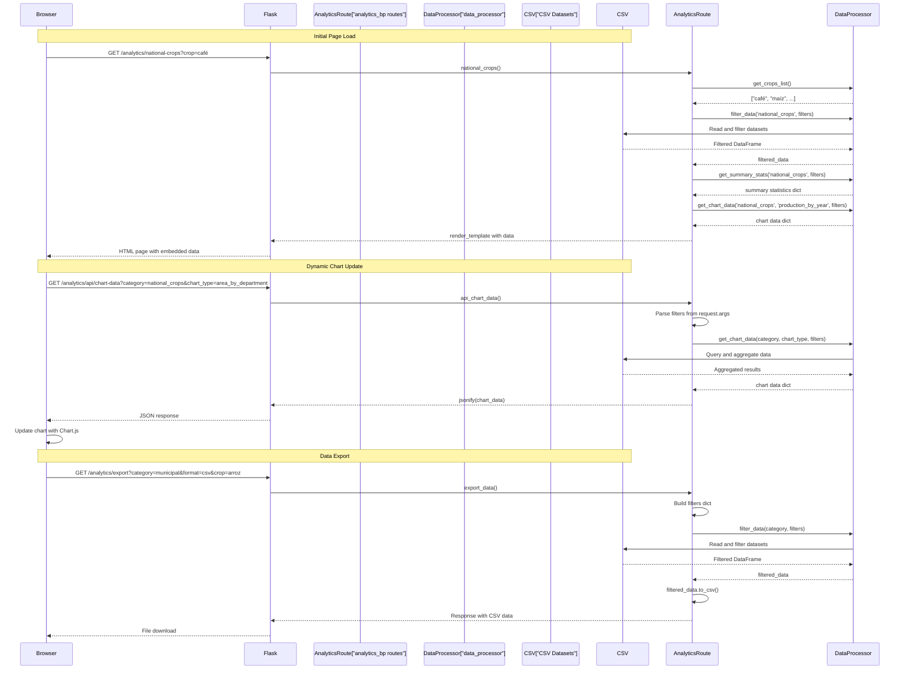
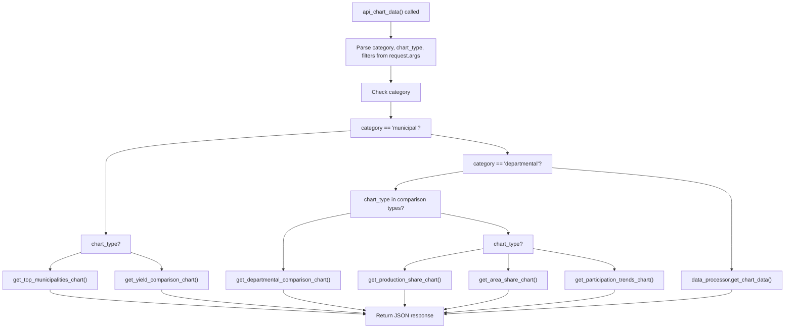

# Panel de análisis

> **Archivos fuente relevantes**
> * [aplicación/chatbot/procesador_de_conjunto_de_datos.py](https://github.com/axchisan/ProyectoAgroBot/blob/bc782fcf/app/chatbot/dataset_processor.py)
> * [aplicación/rutas/analytics_routes.py](https://github.com/axchisan/ProyectoAgroBot/blob/bc782fcf/app/routes/analytics_routes.py)
> * [aplicación/plantillas/análisis/panel.html](https://github.com/axchisan/ProyectoAgroBot/blob/bc782fcf/app/templates/analytics/dashboard.html)

Este documento describe el subsistema del Panel de Análisis de Agrobot, que ofrece funciones de visualización de datos y generación de informes para conjuntos de datos agrícolas. El módulo de análisis permite a los usuarios explorar datos nacionales de cultivos, estadísticas municipales, comparaciones departamentales y métricas de participación mediante interfaces web interactivas y puntos finales de API.

Para obtener información sobre la estructura de la aplicación Flask y el registro de blueprints, consulte [Estructura de la aplicación Flask](/axchisan/ProyectoAgroBot/7.1-flask-application-structure) . Para conocer las rutas principales del chatbot, consulte [Rutas principales](/axchisan/ProyectoAgroBot/7.2-main-routes) . Para obtener más información sobre cómo se cargan y procesan los datos agrícolas, consulte [Carga de datos](/axchisan/ProyectoAgroBot/5.2-data-loading) y [procesamiento de conjuntos de datos](/axchisan/ProyectoAgroBot/5.3-dataset-processing) .

## Descripción general del sistema

El panel de análisis se implementa como un Flask Blueprint ( `analytics_bp`) en[analytics_routes.py L7](https://github.com/axchisan/ProyectoAgroBot/blob/bc782fcf/app/routes/analytics_routes.py#L7-L7)

Proporciona cinco vistas principales para explorar datos agrícolas, además de puntos finales de API compatibles para la representación dinámica de gráficos y la funcionalidad de exportación de datos. El sistema utiliza el `data_processor`singleton de[aplicación/procesador_de_datos.py](https://github.com/axchisan/ProyectoAgroBot/blob/bc782fcf/app/data_processor.py)

para consultar y agregar conjuntos de datos agrícolas cargados desde archivos CSV.

**Fuentes:** [analytics_routes.py L1-L605](https://github.com/axchisan/ProyectoAgroBot/blob/bc782fcf/app/routes/analytics_routes.py#L1-L605)

## Arquitectura del modelo analítico

El siguiente diagrama muestra cómo el modelo de análisis se integra con Flask y se conecta a la capa de procesamiento de datos:

```mermaid
flowchart TD

FlaskApp["Flask App<br>(app.py)"]
MainBP["main blueprint<br>(routes.py)"]
AnalyticsBP["analytics_bp Blueprint<br>(analytics_routes.py)"]
DashboardRoute["/analytics/<br>dashboard()"]
NationalRoute["/analytics/national-crops<br>national_crops()"]
MunicipalRoute["/analytics/municipal-data<br>municipal_data()"]
ComparisonRoute["/analytics/departmental-comparison<br>departmental_comparison()"]
ParticipationRoute["/analytics/departmental-participation<br>departmental_participation()"]
ChartAPI["/analytics/api/chart-data<br>api_chart_data()"]
StatsAPI["/analytics/api/summary-stats<br>api_summary_stats()"]
ExportAPI["/analytics/export<br>export_data()"]
DataProcessor["data_processor<br>(singleton instance)"]
FilterData["filter_data()"]
GetStats["get_summary_stats()"]
GetCharts["get_chart_data()"]
GetMetadata["get_crops_list()<br>get_departments_list()<br>get_years_range()"]
TopMuni["get_top_municipalities_chart()"]
YieldComp["get_yield_comparison_chart()"]
DeptComp["get_departmental_comparison_chart()"]
ProdShare["get_production_share_chart()"]
AreaShare["get_area_share_chart()"]
PartTrends["get_participation_trends_chart()"]

AnalyticsBP --> DashboardRoute
AnalyticsBP --> NationalRoute
AnalyticsBP --> MunicipalRoute
AnalyticsBP --> ComparisonRoute
AnalyticsBP --> ParticipationRoute
AnalyticsBP --> ChartAPI
AnalyticsBP --> StatsAPI
AnalyticsBP --> ExportAPI
DashboardRoute --> GetMetadata
NationalRoute --> FilterData
NationalRoute --> GetStats
NationalRoute --> GetCharts
MunicipalRoute --> FilterData
MunicipalRoute --> GetStats
ComparisonRoute --> FilterData
ComparisonRoute --> GetStats
ParticipationRoute --> FilterData
ParticipationRoute --> GetStats
ChartAPI --> GetCharts
ChartAPI --> TopMuni
ChartAPI --> YieldComp
ChartAPI --> DeptComp
ChartAPI --> ProdShare
ChartAPI --> AreaShare
ChartAPI --> PartTrends
StatsAPI --> GetStats
ExportAPI --> FilterData

subgraph subGraph4 ["Helper Functions"]
    TopMuni
    YieldComp
    DeptComp
    ProdShare
    AreaShare
    PartTrends
end

subgraph subGraph3 ["Data Processing Layer"]
    DataProcessor
    FilterData
    GetStats
    GetCharts
    GetMetadata
    FilterData --> DataProcessor
    GetStats --> DataProcessor
    GetCharts --> DataProcessor
    GetMetadata --> DataProcessor
end

subgraph subGraph2 ["API Endpoints"]
    ChartAPI
    StatsAPI
    ExportAPI
end

subgraph subGraph1 ["Analytics Routes"]
    DashboardRoute
    NationalRoute
    MunicipalRoute
    ComparisonRoute
    ParticipationRoute
end

subgraph subGraph0 ["Flask Application"]
    FlaskApp
    MainBP
    AnalyticsBP
    FlaskApp --> MainBP
    FlaskApp --> AnalyticsBP
end
```



**Fuentes:** [analytics_routes.py L7-L605](https://github.com/axchisan/ProyectoAgroBot/blob/bc782fcf/app/routes/analytics_routes.py#L7-L605)

## Flujo de solicitudes y procesamiento de datos

Este diagrama ilustra cómo fluyen las solicitudes de los usuarios a través del sistema de análisis, desde el navegador, pasando por las rutas de Flask, hasta el procesamiento de datos y viceversa:



**Fuentes:** [analytics_routes.py L30-L605](https://github.com/axchisan/ProyectoAgroBot/blob/bc782fcf/app/routes/analytics_routes.py#L30-L605)

## Ver puntos finales

### Vista del panel

El panel proporciona una descripción general de todos los conjuntos de datos disponibles y sirve como punto de entrada a vistas de análisis especializadas.

**Ruta:** `/analytics/` (definida en[analytics_routes.py L9-L28](https://github.com/axchisan/ProyectoAgroBot/blob/bc782fcf/app/routes/analytics_routes.py#L9-L28)

)

**Función del controlador:** `dashboard()`

**Operaciones clave:**

| Operación | Método | Objetivo |
| --- | --- | --- |
| `get_available_datasets()` | Encargado del tratamiento de datos | Recuperar metadatos sobre todas las categorías de conjuntos de datos |
| `get_crops_list()` | Encargado del tratamiento de datos | Obtener lista de todos los cultivos disponibles |
| `get_departments_list()` | Encargado del tratamiento de datos | Obtener lista de todos los departamentos |
| `get_years_range()` | Encargado del tratamiento de datos | Obtener años mínimos y máximos en conjuntos de datos |
| `get_summary_stats(category)` | Encargado del tratamiento de datos | Calcular estadísticas para cada categoría |

**Plantilla:** [dashboard.html L1-L260](https://github.com/axchisan/ProyectoAgroBot/blob/bc782fcf/app/templates/analytics/dashboard.html#L1-L260)

El tablero muestra:

* Recuento total del conjunto de datos
* Número de cultivos disponibles
* Número de departamentos
* Años de datos disponibles
* Tarjetas de categoría con recuentos de conjuntos de datos y enlaces a vistas especializadas
* Cuadrícula de cultivos principales
* Botones de acción rápida (exportación, informes, análisis programado)

**Fuentes:** [analytics_routes.py L9-L28](https://github.com/axchisan/ProyectoAgroBot/blob/bc782fcf/app/routes/analytics_routes.py#L9-L28)

 [dashboard.html L1-L260](https://github.com/axchisan/ProyectoAgroBot/blob/bc782fcf/app/templates/analytics/dashboard.html#L1-L260)

### Visión Nacional de Cultivos

Proporciona un análisis detallado de la producción, el área y el rendimiento de los cultivos a nivel nacional y departamental.

**Ruta:** `/analytics/national-crops` (definida en[analytics_routes.py L30-L69](https://github.com/axchisan/ProyectoAgroBot/blob/bc782fcf/app/routes/analytics_routes.py#L30-L69)

)

**Función del controlador:** `national_crops()`

**Parámetros de consulta:**

| Parámetro | Tipo | Descripción |
| --- | --- | --- |
| `crop` | cadena | Filtrar por nombre de cultivo |
| `department` | cadena | Filtrar por departamento |
| `year` | entero | Filtrar por año específico |

**Flujo de procesamiento:**

1. Extraer parámetros de filtro de `request.args`([analytics_routes.py L38-L49](https://github.com/axchisan/ProyectoAgroBot/blob/bc782fcf/app/routes/analytics_routes.py#L38-L49) )
2. Crear un diccionario de filtros con valores no vacíos
3. Llamada `filter_data('national_crops', filters)`para obtener el DataFrame filtrado
4. Llamamiento `get_summary_stats('national_crops', filters)`a estadísticas agregadas
5. Llamar `get_chart_data()`dos veces para obtener gráficos de producción y área ([analytics_routes.py L56-L57](https://github.com/axchisan/ProyectoAgroBot/blob/bc782fcf/app/routes/analytics_routes.py#L56-L57) )
6. Render template with data (limited to first 100 rows for performance)

**Sources:** [app/routes/analytics_routes.py L30-L69](https://github.com/axchisan/ProyectoAgroBot/blob/bc782fcf/app/routes/analytics_routes.py#L30-L69)

### Municipal Data View

Explores agricultural data at the municipal granularity, showing production statistics for specific municipalities.

**Route:** `/analytics/municipal-data` (defined at [app/routes/analytics_routes.py L71-L109](https://github.com/axchisan/ProyectoAgroBot/blob/bc782fcf/app/routes/analytics_routes.py#L71-L109)

)

**Handler Function:** `municipal_data()`

**Query Parameters:**

| Parameter | Type | Description |
| --- | --- | --- |
| `dataset` | string | Select specific municipal dataset |
| `year` | integer | Filter by year |
| `municipality` | string | Filter by municipality name |

**Special Processing:**

* Retrieves available municipal datasets from `data_processor.datasets.get('municipal', {}).keys()` ([app/routes/analytics_routes.py L78](https://github.com/axchisan/ProyectoAgroBot/blob/bc782fcf/app/routes/analytics_routes.py#L78-L78) )
* Adds municipalities count to summary stats if data contains 'Municipio' column ([app/routes/analytics_routes.py L98-L99](https://github.com/axchisan/ProyectoAgroBot/blob/bc782fcf/app/routes/analytics_routes.py#L98-L99) )

**Sources:** [app/routes/analytics_routes.py L71-L109](https://github.com/axchisan/ProyectoAgroBot/blob/bc782fcf/app/routes/analytics_routes.py#L71-L109)

### Departmental Comparison View

Enables side-by-side comparison of agricultural metrics across multiple departments.

**Route:** `/analytics/departmental-comparison` (defined at [app/routes/analytics_routes.py L111-L146](https://github.com/axchisan/ProyectoAgroBot/blob/bc782fcf/app/routes/analytics_routes.py#L111-L146)

)

**Handler Function:** `departmental_comparison()`

**Query Parameters:**

| Parameter | Type | Description |
| --- | --- | --- |
| `departments` | list[string] | Multiple departments to compare (via `getlist()`) |
| `crop` | string | Filter by crop |
| `year` | integer | Filter by year |

**Processing Logic:**

1. Use `request.args.getlist('departments')` to get multiple department selections ([app/routes/analytics_routes.py L119](https://github.com/axchisan/ProyectoAgroBot/blob/bc782fcf/app/routes/analytics_routes.py#L119-L119) )
2. Filter data by category first, then by selected departments if provided ([app/routes/analytics_routes.py L133-L134](https://github.com/axchisan/ProyectoAgroBot/blob/bc782fcf/app/routes/analytics_routes.py#L133-L134) )
3. This allows comparisons across 2+ departments simultaneously

**Sources:** [app/routes/analytics_routes.py L111-L146](https://github.com/axchisan/ProyectoAgroBot/blob/bc782fcf/app/routes/analytics_routes.py#L111-L146)

### Departmental Participation View

Analyzes each department's contribution to national agricultural production and area.

**Route:** `/analytics/departmental-participation` (defined at [app/routes/analytics_routes.py L148-L211](https://github.com/axchisan/ProyectoAgroBot/blob/bc782fcf/app/routes/analytics_routes.py#L148-L211)

)

**Handler Function:** `departmental_participation()`

**Special Processing - Participation Calculation:**

The function enriches data with percentage calculations ([app/routes/analytics_routes.py L171-L199](https://github.com/axchisan/ProyectoAgroBot/blob/bc782fcf/app/routes/analytics_routes.py#L171-L199)

):

1. Group by year and product to get national totals
2. Merge national totals with departmental data
3. Calculate percentage participation: * `Porcentaje_Area = (Area (ha) / Area_Nacional) * 100` * `Porcentaje_Produccion = (Produccion (ton) / Produccion_Nacional) * 100`

This allows users to see what percentage of national production/area each department represents.

**Sources:** [app/routes/analytics_routes.py L148-L211](https://github.com/axchisan/ProyectoAgroBot/blob/bc782fcf/app/routes/analytics_routes.py#L148-L211)

## API Endpoints

### Chart Data API

**Route:** `/analytics/api/chart-data` (defined at [app/routes/analytics_routes.py L213-L254](https://github.com/axchisan/ProyectoAgroBot/blob/bc782fcf/app/routes/analytics_routes.py#L213-L254)

)

**Handler Function:** `api_chart_data()`

This endpoint dynamically generates chart data in JSON format for client-side rendering with Chart.js.

**Query Parameters:**

| Parameter | Type | Description |
| --- | --- | --- |
| `category` | string | Dataset category (national_crops, municipal, departmental) |
| `chart_type` | string | Type of chart to generate |
| `crop` | string | Optional crop filter |
| `department` | string | Optional department filter |
| `year` | integer | Optional year filter |
| `departments` | string | Comma-separated list for comparisons |

**Chart Type Routing Logic:**



The chart data API routes to specialized helper functions based on category and chart type ([app/routes/analytics_routes.py L236-L252](https://github.com/axchisan/ProyectoAgroBot/blob/bc782fcf/app/routes/analytics_routes.py#L236-L252)

):

* Municipal charts: `get_top_municipalities_chart()`, `get_yield_comparison_chart()`
* Departmental comparisons: `get_departmental_comparison_chart()`
* Departmental participation: `get_production_share_chart()`, `get_area_share_chart()`, `get_participation_trends_chart()`
* Standard charts: Falls back to `data_processor.get_chart_data()`

**Sources:** [app/routes/analytics_routes.py L213-L254](https://github.com/axchisan/ProyectoAgroBot/blob/bc782fcf/app/routes/analytics_routes.py#L213-L254)

### Summary Stats API

**Route:** `/analytics/api/summary-stats` (defined at [app/routes/analytics_routes.py L523-L537](https://github.com/axchisan/ProyectoAgroBot/blob/bc782fcf/app/routes/analytics_routes.py#L523-L537)

)

**Handler Function:** `api_summary_stats()`

Returns aggregated statistics in JSON format for a given category and filters.

**Query Parameters:**

| Parameter | Type | Description |
| --- | --- | --- |
| `category` | string | Dataset category |
| `crop` | string | Optional crop filter |
| `department` | string | Optional department filter |
| `year` | integer | Optional year filter |

**Response Format:** JSON object with statistics from `data_processor.get_summary_stats()`

**Sources:** [app/routes/analytics_routes.py L523-L537](https://github.com/axchisan/ProyectoAgroBot/blob/bc782fcf/app/routes/analytics_routes.py#L523-L537)

### Export Endpoint

**Route:** `/analytics/export` (defined at [app/routes/analytics_routes.py L539-L605](https://github.com/axchisan/ProyectoAgroBot/blob/bc782fcf/app/routes/analytics_routes.py#L539-L605)

)

**Handler Function:** `export_data()`

Exports filtered data in CSV or JSON format for download.

**Query Parameters:**

| Parameter | Type | Description |
| --- | --- | --- |
| `category` | string | Dataset category |
| `format` | string | Export format (csv or json, default: csv) |
| `crop` | string | Optional crop filter |
| `department` | string | Optional department filter |
| `year` | integer | Optional year filter |
| `dataset` | string | Optional dataset filter |
| `municipality` | string | Optional municipality filter |
| `departments` | list[string] | Multiple departments for comparison |

**Processing:**

1. Build filters dictionary from all possible parameters ([app/routes/analytics_routes.py L546-L556](https://github.com/axchisan/ProyectoAgroBot/blob/bc782fcf/app/routes/analytics_routes.py#L546-L556) )
2. Call `filter_data(category, filters)` to get filtered DataFrame
3. For departmental category, calculate participation percentages (same logic as participation view)
4. Return as JSON if `format=json`, otherwise return as CSV with appropriate headers ([app/routes/analytics_routes.py L595-L605](https://github.com/axchisan/ProyectoAgroBot/blob/bc782fcf/app/routes/analytics_routes.py#L595-L605) )

**CSV Response Headers:**

```
Content-Type: text/csv
Content-Disposition: attachment; filename={category}_data.csv
```

**Sources:** [app/routes/analytics_routes.py L539-L605](https://github.com/axchisan/ProyectoAgroBot/blob/bc782fcf/app/routes/analytics_routes.py#L539-L605)

## Chart Data Generation Functions

The analytics module includes six specialized helper functions for generating chart data with custom aggregations and formatting.

### Municipal Charts

#### Top Municipalities Chart

**Function:** `get_top_municipalities_chart(filters)` ([app/routes/analytics_routes.py L256-L275](https://github.com/axchisan/ProyectoAgroBot/blob/bc782fcf/app/routes/analytics_routes.py#L256-L275)

)

**Purpose:** Generate bar chart data for top 10 municipalities by production

**Logic:**

1. Filter municipal data using provided filters
2. Group by 'Municipio' and sum 'Produccion (ton)'
3. Sort descending and take top 10
4. Return Chart.js-compatible format with labels and datasets

**Return Format:**

```
{
    'labels': ['Municipality1', 'Municipality2', ...],
    'datasets': [{
        'label': 'Producción (ton)',
        'data': [value1, value2, ...],
        'backgroundColor': 'rgba(74, 124, 89, 0.8)',
        'borderColor': 'rgba(74, 124, 89, 1)'
    }]
}
```

**Sources:** [app/routes/analytics_routes.py L256-L275](https://github.com/axchisan/ProyectoAgroBot/blob/bc782fcf/app/routes/analytics_routes.py#L256-L275)

#### Yield Comparison Chart

**Function:** `get_yield_comparison_chart(filters)` ([app/routes/analytics_routes.py L277-L296](https://github.com/axchisan/ProyectoAgroBot/blob/bc782fcf/app/routes/analytics_routes.py#L277-L296)

)

**Purpose:** Compare average yield across municipalities

**Logic:**

1. Group by 'Municipio' and calculate mean 'Rendimiento (ha/ton)'
2. Sort by yield and take top 10
3. Return bar chart data

**Sources:** [app/routes/analytics_routes.py L277-L296](https://github.com/axchisan/ProyectoAgroBot/blob/bc782fcf/app/routes/analytics_routes.py#L277-L296)

### Departmental Comparison Charts

**Function:** `get_departmental_comparison_chart(chart_type, filters)` ([app/routes/analytics_routes.py L298-L367](https://github.com/axchisan/ProyectoAgroBot/blob/bc782fcf/app/routes/analytics_routes.py#L298-L367)

)

**Purpose:** Generate comparison charts for multiple departments

**Chart Types:**

| chart_type | Column Used | Visualization |
| --- | --- | --- |
| `production_comparison` | `Produccion (ton)` | Bar chart |
| `area_comparison` | `Area (ha)` | Bar chart |
| `yield_comparison` | `Rendimiento (ha/ton)` | Radar chart |

**Special Logic for Radar Charts:**

* Uses `pivot_table()` to create department × product matrix ([app/routes/analytics_routes.py L327-L332](https://github.com/axchisan/ProyectoAgroBot/blob/bc782fcf/app/routes/analytics_routes.py#L327-L332) )
* Returns multi-dataset format where each dataset represents one department
* Enables visual comparison of yield profiles across departments

**Sources:** [app/routes/analytics_routes.py L298-L367](https://github.com/axchisan/ProyectoAgroBot/blob/bc782fcf/app/routes/analytics_routes.py#L298-L367)

### Departmental Participation Charts

#### Production Share Chart

**Function:** `get_production_share_chart(filters)` ([app/routes/analytics_routes.py L369-L406](https://github.com/axchisan/ProyectoAgroBot/blob/bc782fcf/app/routes/analytics_routes.py#L369-L406)

)

**Purpose:** Show each department's share of total national production

**Logic:**

1. Group by department and sum production
2. Calculate percentage: `(dept_production / total_production) * 100`
3. Sort by percentage descending
4. Limit to top 10 departments, aggregate rest as "Otros" ([app/routes/analytics_routes.py L391-L398](https://github.com/axchisan/ProyectoAgroBot/blob/bc782fcf/app/routes/analytics_routes.py#L391-L398) )

**Sources:** [app/routes/analytics_routes.py L369-L406](https://github.com/axchisan/ProyectoAgroBot/blob/bc782fcf/app/routes/analytics_routes.py#L369-L406)

#### Area Share Chart

**Function:** `get_area_share_chart(filters)` ([app/routes/analytics_routes.py L408-L445](https://github.com/axchisan/ProyectoAgroBot/blob/bc782fcf/app/routes/analytics_routes.py#L408-L445)

)

**Purpose:** Show each department's share of total cultivated area

**Logic:** Similar to production share but uses 'Area (ha)' column

**Sources:** [app/routes/analytics_routes.py L408-L445](https://github.com/axchisan/ProyectoAgroBot/blob/bc782fcf/app/routes/analytics_routes.py#L408-L445)

#### Participation Trends Chart

**Function:** `get_participation_trends_chart(filters)` ([app/routes/analytics_routes.py L447-L521](https://github.com/axchisan/ProyectoAgroBot/blob/bc782fcf/app/routes/analytics_routes.py#L447-L521)

)

**Purpose:** Show how departmental participation changes over time

**Complex Multi-Step Logic:**

1. **Department Selection:** If no specific department filtered, select top 5 by total production ([app/routes/analytics_routes.py L472-L475](https://github.com/axchisan/ProyectoAgroBot/blob/bc782fcf/app/routes/analytics_routes.py#L472-L475) )
2. **Calculate Yearly Totals:** Group by year to get national totals ([app/routes/analytics_routes.py L481-L484](https://github.com/axchisan/ProyectoAgroBot/blob/bc782fcf/app/routes/analytics_routes.py#L481-L484) )
3. **Calculate Participation:** For each department and year, compute percentage ([app/routes/analytics_routes.py L489-L504](https://github.com/axchisan/ProyectoAgroBot/blob/bc782fcf/app/routes/analytics_routes.py#L489-L504) )
4. **Generate Colors:** Use department name as seed for consistent color generation ([app/routes/analytics_routes.py L507-L510](https://github.com/axchisan/ProyectoAgroBot/blob/bc782fcf/app/routes/analytics_routes.py#L507-L510) )
5. **Format as Line Chart:** Return multi-dataset line chart with one line per department

**Return Format:**

```css
{
    'labels': [2018, 2019, 2020, ...],  # Years
    'datasets': [
        {
            'label': 'Antioquia',
            'data': [15.2, 16.1, 14.8, ...],  # Percentage by year
            'borderColor': 'rgba(r, g, b, 1)',
            'fill': False,
            'tension': 0.1
        },
        # ... more departments
    ]
}
```

**Sources:** [app/routes/analytics_routes.py L447-L521](https://github.com/axchisan/ProyectoAgroBot/blob/bc782fcf/app/routes/analytics_routes.py#L447-L521)

## Frontend Integration

The analytics dashboard templates use several key JavaScript patterns for interactivity:

### Server-Side Rendering with Embedded Data

Initial page load embeds data directly in templates using Jinja2 ([app/templates/analytics/dashboard.html L23-L28](https://github.com/axchisan/ProyectoAgroBot/blob/bc782fcf/app/templates/analytics/dashboard.html#L23-L28)

):

```
datasets_info={{ datasets_info }}
crops_list={{ crops_list }}
general_stats={{ general_stats }}
```

For chart data, JSON is serialized and embedded ([app/routes/analytics_routes.py L68-L69](https://github.com/axchisan/ProyectoAgroBot/blob/bc782fcf/app/routes/analytics_routes.py#L68-L69)

):

```
production_chart=json.dumps(production_chart),
department_chart=json.dumps(department_chart)
```

### AJAX Updates

The dashboard makes AJAX requests to API endpoints for dynamic updates without full page reloads. Typical pattern:

1. User changes filter (dropdown, date selector)
2. JavaScript captures change event
3. Builds query string with filters
4. Makes GET request to `/analytics/api/chart-data`
5. Receives JSON response
6. Actualiza el gráfico Chart.js con nuevos datos

### Integración con Chart.js

Todos los gráficos se representan utilizando la biblioteca Chart.js, cargada a través de CDN en la plantilla del panel ([dashboard.html L12](https://github.com/axchisan/ProyectoAgroBot/blob/bc782fcf/app/templates/analytics/dashboard.html#L12-L12)

):

```xml
<script src="https://cdn.jsdelivr.net/npm/chart.js"></script>
```

Los datos del gráfico siguen las especificaciones de formato de Chart.js con matrices `labels`y .`datasets`

**Fuentes:** [dashboard.html L1-L260](https://github.com/axchisan/ProyectoAgroBot/blob/bc782fcf/app/templates/analytics/dashboard.html#L1-L260)

 [analytics_routes.py L68-L69](https://github.com/axchisan/ProyectoAgroBot/blob/bc782fcf/app/routes/analytics_routes.py#L68-L69)

## Integración de procesamiento de datos

Las rutas de análisis dependen en gran medida del `data_processor`singleton para todas las operaciones de datos:

### Uso de DatasetProcessor

| Método | Usado por | Objetivo |
| --- | --- | --- |
| `get_available_datasets()` | Panel | Recuperar metadatos del conjunto de datos |
| `get_crops_list()` | Todas las vistas | Completar los menús desplegables de filtros de cultivos |
| `get_departments_list()` | Todas las vistas | Completar los menús desplegables de filtros de departamento |
| `get_years_range()` | Todas las vistas | Completar los menús desplegables de filtros de año |
| `filter_data(category, filters)` | Todas las vistas, Exportar | Aplicar filtros a conjuntos de datos |
| `get_summary_stats(category, filters)` | Todas las vistas, API de estadísticas | Calcular estadísticas agregadas |
| `get_chart_data(category, chart_type, filters)` | API de gráficos | Generar datos de gráficos estándar |

### Formato de diccionario de filtros

Los filtros se pasan como diccionarios a los métodos del procesador de datos. Claves comunes:

```css
filters = {
    'crop': 'café',           # Crop name
    'department': 'antioquia', # Department name
    'year': 2020,             # Specific year (integer)
    'dataset': 'production',  # Dataset name (municipal only)
    'municipality': 'medellin', # Municipality name (municipal only)
    'departments': ['antioquia', 'valle']  # List for comparisons
}
```

El DatasetProcessor normaliza todos los nombres utilizando `_normalize_name()`([dataset_processor.py L26-L29](https://github.com/axchisan/ProyectoAgroBot/blob/bc782fcf/app/chatbot/dataset_processor.py#L26-L29)

) para manejar acentos y variaciones entre mayúsculas y minúsculas.

**Fuentes:** [analytics_routes.py L43-L49](https://github.com/axchisan/ProyectoAgroBot/blob/bc782fcf/app/routes/analytics_routes.py#L43-L49)

 [dataset_processor.py L26-L29](https://github.com/axchisan/ProyectoAgroBot/blob/bc782fcf/app/chatbot/dataset_processor.py#L26-L29)

## Resumen de la estructura de la URL

| Ruta | Método | Objetivo | Plantilla |
| --- | --- | --- | --- |
| `/analytics/` | CONSEGUIR | Descripción general del panel de control | `analytics/dashboard.html` |
| `/analytics/national-crops` | CONSEGUIR | Análisis de cultivos nacionales | `analytics/national_crops.html` |
| `/analytics/municipal-data` | CONSEGUIR | Datos a nivel municipal | `analytics/municipal_data.html` |
| `/analytics/departmental-comparison` | CONSEGUIR | Comparar departamentos | `analytics/departmental_comparison.html` |
| `/analytics/departmental-participation` | CONSEGUIR | Análisis de participación | `analytics/departmental_participation.html` |
| `/analytics/api/chart-data` | CONSEGUIR | Datos del gráfico JSON | N/A (respuesta JSON) |
| `/analytics/api/summary-stats` | CONSEGUIR | Estadísticas JSON | N/A (respuesta JSON) |
| `/analytics/export` | CONSEGUIR | Descargar datos | N/D (archivo CSV/JSON) |

Todas las rutas tienen como prefijo `/analytics`URL el prefijo via blueprint ([analytics_routes.py L7](https://github.com/axchisan/ProyectoAgroBot/blob/bc782fcf/app/routes/analytics_routes.py#L7-L7)

).

**Fuentes:** [analytics_routes.py L7-L605](https://github.com/axchisan/ProyectoAgroBot/blob/bc782fcf/app/routes/analytics_routes.py#L7-L605)