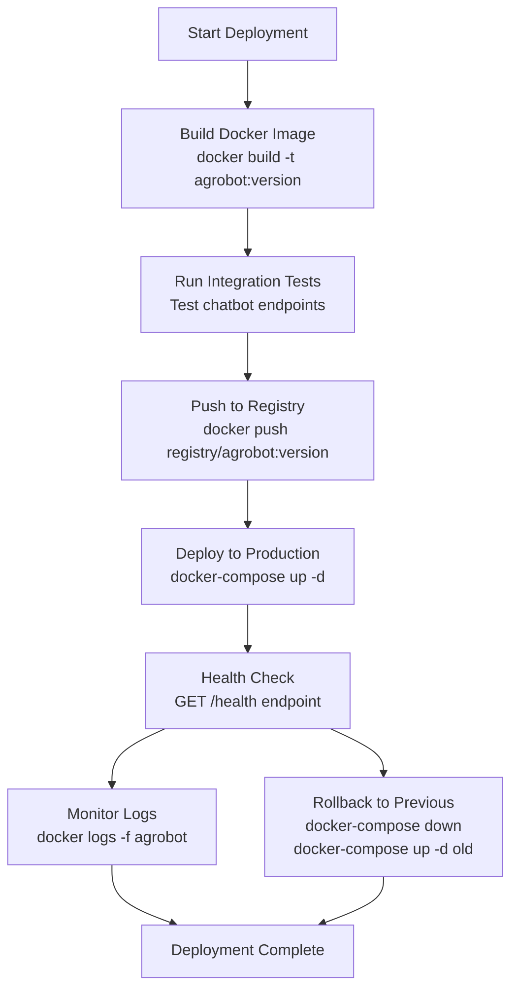

# Production Deployment

> **Relevant source files**
> * [Dockerfile](https://github.com/axchisan/ProyectoAgroBot/blob/bc782fcf/Dockerfile)
> * [docs/README.md](https://github.com/axchisan/ProyectoAgroBot/blob/bc782fcf/docs/README.md)
> * [main.py](https://github.com/axchisan/ProyectoAgroBot/blob/bc782fcf/main.py)

## Purpose and Scope

This document covers best practices and procedures for deploying Agrobot to a production environment. It focuses on WSGI server configuration, scaling strategies, monitoring, security hardening, and operational considerations for running Agrobot reliably in production.

For Docker container configuration and image building, see [Docker Configuration](/axchisan/ProyectoAgroBot/9.1-docker-configuration). For environment variable management and secrets configuration, see [Environment Variables](/axchisan/ProyectoAgroBot/9.2-environment-variables).

---

## Gunicorn WSGI Server

The production deployment uses Gunicorn (Green Unicorn) as the WSGI HTTP server instead of Flask's built-in development server. Gunicorn provides production-grade performance, process management, and concurrent request handling.

### Base Configuration

The Dockerfile configures Gunicorn as the production server:

```
CMD ["gunicorn", "--bind", "0.0.0.0:5000", "main:app"]
```

This command:

* Binds to all network interfaces (`0.0.0.0`) on port 5000
* Loads the Flask application from `main:app` [main.py L3](https://github.com/axchisan/ProyectoAgroBot/blob/bc782fcf/main.py#L3-L3)
* Uses default Gunicorn settings (synchronous workers)

### Recommended Production Configuration

For production deployment, the Gunicorn command should be enhanced with additional configuration options:

| Parameter | Recommended Value | Purpose |
| --- | --- | --- |
| `--workers` | `(2 × CPU cores) + 1` | Number of worker processes |
| `--threads` | `2-4` | Threads per worker for I/O-bound tasks |
| `--worker-class` | `gthread` | Use threaded workers for API calls |
| `--timeout` | `120` | Worker timeout in seconds (for ML inference) |
| `--keepalive` | `5` | Keep-alive connections in seconds |
| `--max-requests` | `1000` | Restart workers after N requests (memory management) |
| `--max-requests-jitter` | `100` | Add randomness to prevent simultaneous restarts |
| `--access-logfile` | `-` | Log access to stdout |
| `--error-logfile` | `-` | Log errors to stdout |
| `--log-level` | `info` | Logging verbosity |

**Example production command:**

```

```

### Worker Configuration Rationale

**Worker Count:** Agrobot performs CPU-intensive operations (BERT model inference) and I/O-bound operations (API calls to OpenWeatherMap, OpenAI, Nominatim). The formula `(2 × CPU cores) + 1` provides good throughput for mixed workloads.

**Threaded Workers:** The `gthread` worker class allows each worker to handle multiple concurrent requests using threads. This is beneficial for:

* External API calls [app/chatbot/location_handler.py L81-L94](https://github.com/axchisan/ProyectoAgroBot/blob/bc782fcf/app/chatbot/location_handler.py#L81-L94)
* Weather service requests [app/chatbot/question_processor.py L467-L503](https://github.com/axchisan/ProyectoAgroBot/blob/bc782fcf/app/chatbot/question_processor.py#L467-L503)
* OpenAI fallback queries [app/chatbot/question_processor.py L532-L561](https://github.com/axchisan/ProyectoAgroBot/blob/bc782fcf/app/chatbot/question_processor.py#L532-L561)

**Timeout:** Set to 120 seconds to accommodate:

* Intent classification inference [app/chatbot/nlp_processor.py L30-L52](https://github.com/axchisan/ProyectoAgroBot/blob/bc782fcf/app/chatbot/nlp_processor.py#L30-L52)
* Complex dataset queries [app/chatbot/dataset_processor.py L44-L91](https://github.com/axchisan/ProyectoAgroBot/blob/bc782fcf/app/chatbot/dataset_processor.py#L44-L91)
* External API response delays

### Dockerfile Integration

To implement production Gunicorn configuration in the Dockerfile, modify the CMD directive:

```

```

**Sources:** [Dockerfile L28](https://github.com/axchisan/ProyectoAgroBot/blob/bc782fcf/Dockerfile#L28-L28)

 [main.py L1-L6](https://github.com/axchisan/ProyectoAgroBot/blob/bc782fcf/main.py#L1-L6)

---

## Production Architecture

The production deployment stack consists of multiple layers providing isolation, scalability, and reliability.

### Production Stack Diagram

```

```

**Sources:** [Dockerfile L1-L28](https://github.com/axchisan/ProyectoAgroBot/blob/bc782fcf/Dockerfile#L1-L28)

 [main.py L1-L6](https://github.com/axchisan/ProyectoAgroBot/blob/bc782fcf/main.py#L1-L6)

---

## Deployment Workflow

### Pre-Deployment Checklist

Before deploying to production, ensure the following steps are completed:

| Step | Action | Verification |
| --- | --- | --- |
| 1 | Train intent classifier | `app/models/intent_classifier/` exists with model files |
| 2 | Set environment variables | All API keys configured (see [Environment Variables](/axchisan/ProyectoAgroBot/9.2-environment-variables)) |
| 3 | Build Docker image | `docker build -t agrobot:latest .` succeeds |
| 4 | Test container locally | `docker run -p 5017:5000 agrobot:latest` responds |
| 5 | Verify ML model loads | Check logs for "Intent classifier loaded successfully" |
| 6 | Test API integrations | Verify OpenWeatherMap, OpenAI, Nominatim connectivity |
| 7 | Review security settings | `FLASK_ENV=production`, debug mode disabled |

### Deployment Process



### Step-by-Step Deployment

**1. Build Production Image**

```

```

**2. Run Pre-Deployment Tests**

```

```

**3. Deploy to Production**

```

```

**4. Monitor Deployment**

```

```

**Sources:** [Dockerfile L1-L28](https://github.com/axchisan/ProyectoAgroBot/blob/bc782fcf/Dockerfile#L1-L28)

 [docs/README.md L133-L162](https://github.com/axchisan/ProyectoAgroBot/blob/bc782fcf/docs/README.md#L133-L162)

---

## Scaling Strategies

### Horizontal Scaling

Agrobot can be scaled horizontally by running multiple container instances behind a load balancer.

**Docker Compose Scaling:**

```

```

**Scale with Docker Compose:**

```

```

### Vertical Scaling

Increase resources available to each container based on workload:

| Resource | Minimum | Recommended | High Load |
| --- | --- | --- | --- |
| CPU | 1 core | 2 cores | 4 cores |
| Memory | 2 GB | 4 GB | 8 GB |
| Workers | 3 | 5 | 9 |
| Threads/Worker | 2 | 2 | 4 |

**Memory Considerations:**

* BERT model loading: ~500 MB per worker [app/chatbot/nlp_processor.py L20-L29](https://github.com/axchisan/ProyectoAgroBot/blob/bc782fcf/app/chatbot/nlp_processor.py#L20-L29)
* Agricultural datasets: ~200 MB [data/processed/](https://github.com/axchisan/ProyectoAgroBot/blob/bc782fcf/data/processed/)
* Flask application: ~100 MB base
* Total per worker: ~800 MB
* Formula: `Memory Required = (Workers × 800 MB) + 500 MB overhead`

### Load Balancing Configuration

**Nginx Configuration Example:**

```

```

**Sources:** [Dockerfile L1-L28](https://github.com/axchisan/ProyectoAgroBot/blob/bc782fcf/Dockerfile#L1-L28)

---

## Monitoring and Logging

### Application Logging

Gunicorn logs are sent to stdout/stderr and captured by Docker:

```

```

### Health Check Endpoint

Implement a health check endpoint in Flask:

```

```

Configure Docker health checks:

```

```

### Metrics to Monitor

| Metric | Tool | Alert Threshold |
| --- | --- | --- |
| Response time | Application logs | > 5 seconds |
| Error rate | Gunicorn logs | > 1% |
| Memory usage | `docker stats` | > 90% |
| CPU usage | `docker stats` | > 80% sustained |
| Worker restarts | Gunicorn logs | > 5 per hour |
| API failures | Application logs | > 5% |

### Log Aggregation

For production deployments with multiple containers, use centralized logging:

**Docker Logging Driver Configuration:**

```

```

**External Logging Services:**

* **Syslog:** Forward logs to centralized syslog server
* **JSON File:** Store logs in JSON format for parsing
* **Fluentd/Logstash:** Aggregate logs for analysis

**Sources:** [Dockerfile L28](https://github.com/axchisan/ProyectoAgroBot/blob/bc782fcf/Dockerfile#L28-L28)

---

## Security Hardening

### Environment Variable Security

Never commit sensitive credentials to version control:

```

```

Use Docker secrets or environment variable injection at runtime:

```

```

### Network Security

**Container Network Isolation:**

```

```

**Firewall Rules:**

* Only expose necessary ports (5017 for web access)
* Restrict direct access to port 5000 (internal Gunicorn)
* Use firewall rules to limit incoming connections

### Application Security

**Flask Configuration:**

```

```

This disables:

* Debug mode [main.py L6](https://github.com/axchisan/ProyectoAgroBot/blob/bc782fcf/main.py#L6-L6)
* Interactive debugger
* Automatic reloader
* Verbose error messages

**HTTPS/TLS:**

Always terminate TLS at the load balancer or reverse proxy level, not in the Flask application.

### Dependency Security

Regularly update dependencies:

```

```

**Sources:** [Dockerfile L24-L28](https://github.com/axchisan/ProyectoAgroBot/blob/bc782fcf/Dockerfile#L24-L28)

 [main.py L6](https://github.com/axchisan/ProyectoAgroBot/blob/bc782fcf/main.py#L6-L6)

---

## Performance Optimization

### Model Loading Optimization

The BERT intent classifier loads once per worker process:

* **Current:** Model loaded in `NLPProcessor.__init__()` [app/chatbot/nlp_processor.py L20-L29](https://github.com/axchisan/ProyectoAgroBot/blob/bc782fcf/app/chatbot/nlp_processor.py#L20-L29)
* **Impact:** ~500 MB memory per worker, 5-10 second startup time
* **Optimization:** Ensure workers are not restarted frequently (use `--max-requests` and `--max-requests-jitter`)

### Data Loading Optimization

Agricultural datasets are loaded at initialization:

* **Current:** CSV files loaded by `DatasetProcessor` [app/chatbot/dataset_processor.py L13-L42](https://github.com/axchisan/ProyectoAgroBot/blob/bc782fcf/app/chatbot/dataset_processor.py#L13-L42)
* **Impact:** ~200 MB memory, loaded once per worker
* **Optimization:** Consider caching frequently accessed data in Redis for multi-container deployments

### Request Optimization

**Caching Strategy:**

Implement caching for:

* Weather data (cache for 30 minutes)
* Crop recommendations by department (cache for 24 hours)
* Static Q&A responses (cache indefinitely)

**Example caching with Redis:**

```

```

### Static Asset Optimization

Serve static files (CSS, JS) through Nginx or CDN instead of Flask:

```

```

**Sources:** [app/chatbot/nlp_processor.py L20-L29](https://github.com/axchisan/ProyectoAgroBot/blob/bc782fcf/app/chatbot/nlp_processor.py#L20-L29)

 [app/chatbot/dataset_processor.py L13-L42](https://github.com/axchisan/ProyectoAgroBot/blob/bc782fcf/app/chatbot/dataset_processor.py#L13-L42)

---

## Production Deployment Checklist

### Pre-Deployment

* Intent classifier model trained and saved to `app/models/intent_classifier/`
* All API keys set in environment variables
* `FLASK_ENV=production` configured [Dockerfile L25](https://github.com/axchisan/ProyectoAgroBot/blob/bc782fcf/Dockerfile#L25-L25)
* Debug mode disabled [main.py L6](https://github.com/axchisan/ProyectoAgroBot/blob/bc782fcf/main.py#L6-L6)
* Gunicorn workers configured appropriately
* Docker image built successfully
* Container health checks working
* SSL/TLS certificates configured (if using HTTPS)
* Firewall rules configured
* Log aggregation setup (optional)
* Monitoring alerts configured (optional)

### During Deployment

* Build Docker image with version tag
* Run integration tests in test container
* Deploy to production environment
* Verify health check endpoint responds
* Monitor logs for errors during startup
* Test critical chatbot endpoints
* Verify external API connectivity (weather, OpenAI, geocoding)
* Check BERT model loads successfully
* Verify agricultural data loads correctly

### Post-Deployment

* Monitor response times (< 5 seconds for most queries)
* Check error rates (< 1%)
* Monitor memory usage (< 90% of allocated)
* Monitor CPU usage (< 80% sustained)
* Verify worker processes are stable
* Test chatbot functionality from user perspective
* Monitor external API success rates
* Review logs for warnings or errors
* Document deployment version and timestamp
* Update rollback plan with previous version

### Ongoing Operations

* Review logs daily for anomalies
* Monitor resource usage trends weekly
* Update dependencies monthly
* Rotate API keys quarterly
* Review and update security configurations quarterly
* Test disaster recovery procedures quarterly
* Update ML model as needed (retrain with new data)
* Review and optimize Gunicorn worker configuration based on load

**Sources:** [Dockerfile L1-L28](https://github.com/axchisan/ProyectoAgroBot/blob/bc782fcf/Dockerfile#L1-L28)

 [main.py L1-L6](https://github.com/axchisan/ProyectoAgroBot/blob/bc782fcf/main.py#L1-L6)

 [docs/README.md L118-L162](https://github.com/axchisan/ProyectoAgroBot/blob/bc782fcf/docs/README.md#L118-L162)