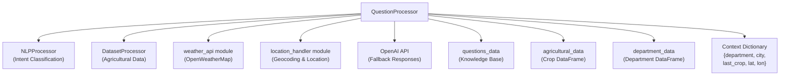
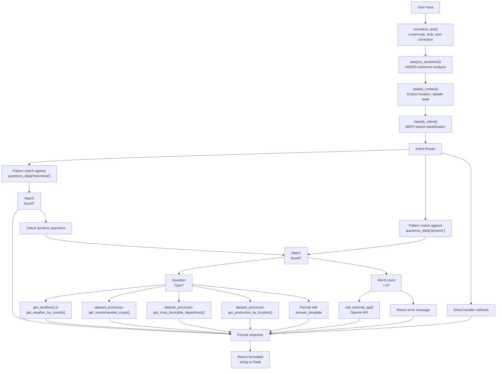
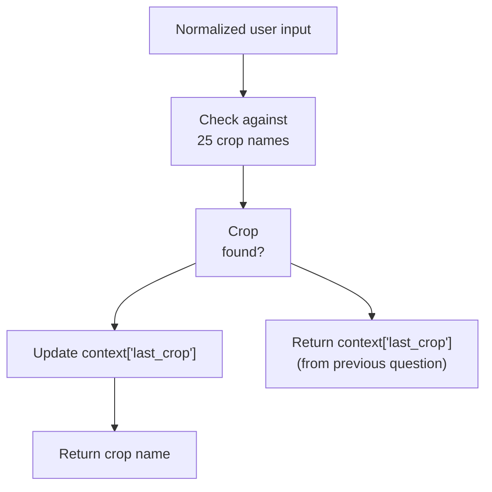
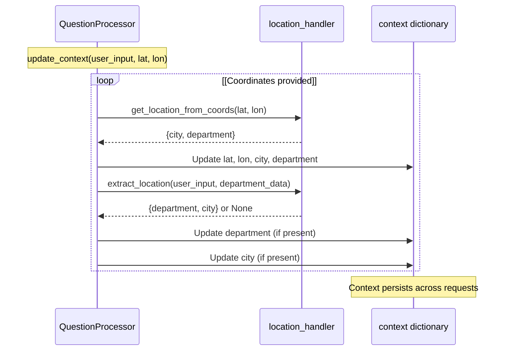
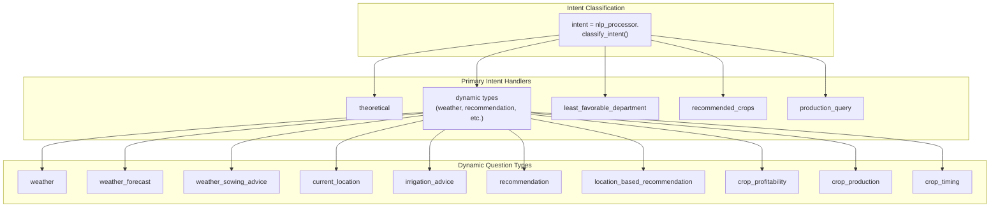
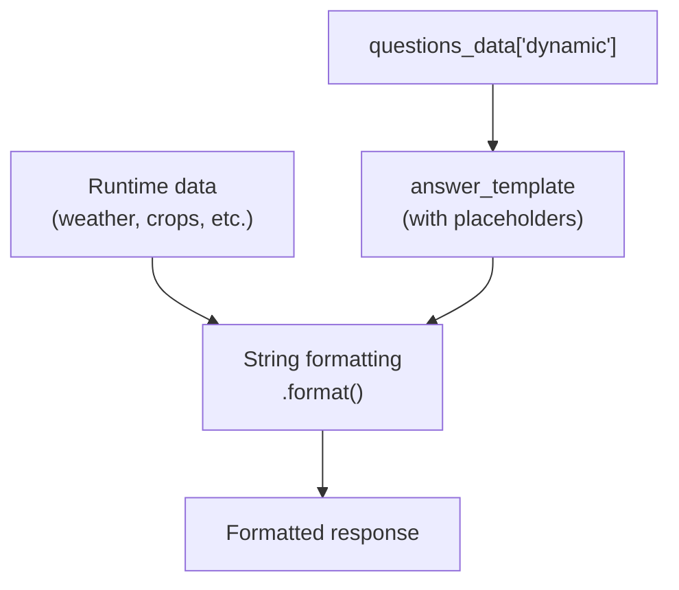
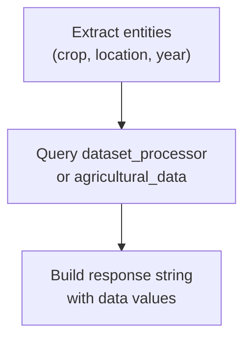
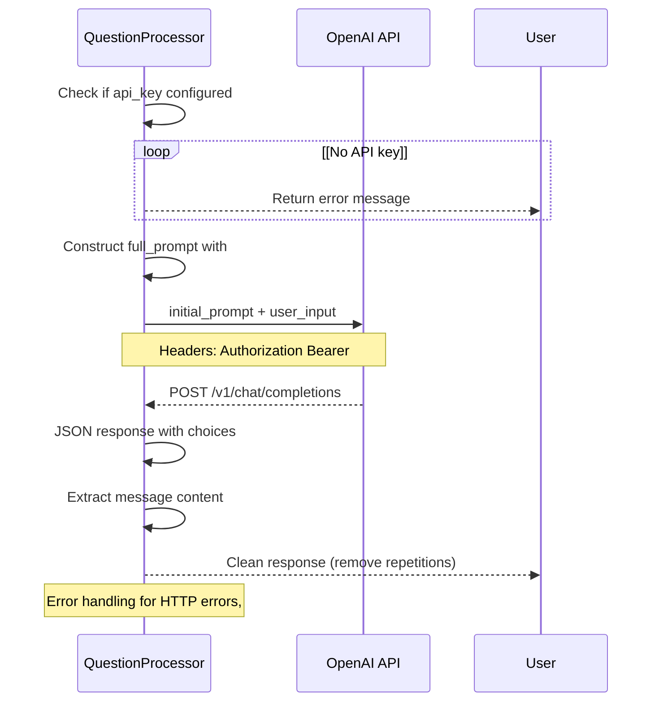
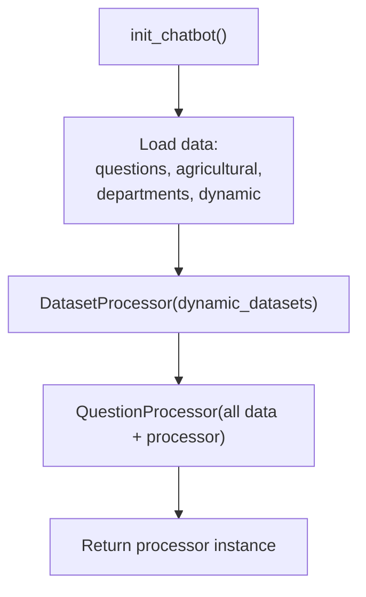

# Question Processing

> **Relevant source files**
> * [app/chatbot/__init__.py](https://github.com/axchisan/ProyectoAgroBot/blob/bc782fcf/app/chatbot/__init__.py)
> * [app/chatbot/question_processor.py](https://github.com/axchisan/ProyectoAgroBot/blob/bc782fcf/app/chatbot/question_processor.py)

## Purpose and Scope

This page documents the `QuestionProcessor` class, the central orchestrator of the Agrobot chatbot system. The `QuestionProcessor` receives user questions, classifies their intent, maintains conversation context, routes queries to specialized handlers, and generates appropriate responses. This class serves as the primary interface between the Flask routes and the underlying chatbot intelligence.

For information about how the chatbot is initialized and configured, see [Chatbot Initialization](/axchisan/ProyectoAgroBot/4.1-chatbot-initialization). For details on the NLP intent classification model itself, see [Intent Classification](/axchisan/ProyectoAgroBot/4.3-intent-classification). For the multi-tier response strategy and fallback mechanisms, see [Response Strategy](/axchisan/ProyectoAgroBot/4.4-response-strategy). For detailed context tracking patterns, see [Context Management](/axchisan/ProyectoAgroBot/4.5-context-management).

---

## QuestionProcessor Architecture

The `QuestionProcessor` class coordinates multiple specialized components to handle user queries. It maintains conversation state, delegates to processors for specific tasks, and orchestrates the response generation pipeline.

### Component Dependencies



**Sources:** [app/chatbot/question_processor.py L1-L10](https://github.com/axchisan/ProyectoAgroBot/blob/bc782fcf/app/chatbot/question_processor.py#L1-L10)

 [app/chatbot/question_processor.py L13-L21](https://github.com/axchisan/ProyectoAgroBot/blob/bc782fcf/app/chatbot/question_processor.py#L13-L21)

---

## Class Initialization

The `QuestionProcessor` is initialized with multiple data sources and API keys. The constructor sets up all dependencies and configures the processing pipeline.

### Constructor Parameters

| Parameter | Type | Description |
| --- | --- | --- |
| `questions_data` | `Dict` | Knowledge base with theoretical and dynamic questions |
| `agricultural_data` | `pd.DataFrame` | Crop data including planting months |
| `department_data` | `pd.DataFrame` | Colombian department/city information |
| `dataset_processor` | `DatasetProcessor` | Processor for agricultural dataset queries |
| `weather_api_key` | `str` | OpenWeatherMap API key (optional) |
| `api_key` | `str` | External AI API key (optional) |
| `api_type` | `str` | Type of external AI API (default: "openai") |

### Internal State

The `QuestionProcessor` maintains several key pieces of state:

**Intent Labels** [app/chatbot/question_processor.py L22-L27](https://github.com/axchisan/ProyectoAgroBot/blob/bc782fcf/app/chatbot/question_processor.py#L22-L27)

: Array of 14 supported intent types used for classification routing.

**Context Dictionary** [app/chatbot/question_processor.py L28-L34](https://github.com/axchisan/ProyectoAgroBot/blob/bc782fcf/app/chatbot/question_processor.py#L28-L34)

: Maintains conversation state across requests.

```css
{
    "department": None,      # Current Colombian department
    "city": None,           # Current city
    "last_crop": None,      # Last mentioned crop
    "lat": None,            # User latitude
    "lon": None             # User longitude
}
```

**Initial Prompt** [app/chatbot/question_processor.py L35-L43](https://github.com/axchisan/ProyectoAgroBot/blob/bc782fcf/app/chatbot/question_processor.py#L35-L43)

: System prompt sent to external AI API, defining the chatbot's role and response constraints (Spanish language, 150-400 words, Colombian agricultural context).

**Sources:** [app/chatbot/question_processor.py L12-L43](https://github.com/axchisan/ProyectoAgroBot/blob/bc782fcf/app/chatbot/question_processor.py#L12-L43)

---

## Question Processing Flow

The `process_question` method is the primary entry point for handling user queries. It orchestrates the complete pipeline from raw user input to formatted response.

### Processing Pipeline



**Sources:** [app/chatbot/question_processor.py L132-L343](https://github.com/axchisan/ProyectoAgroBot/blob/bc782fcf/app/chatbot/question_processor.py#L132-L343)

---

## Text Normalization and Extraction

The `QuestionProcessor` includes several utility methods for preprocessing user input and extracting structured information.

### Normalization Method

The `normalize_text` method [app/chatbot/question_processor.py L45-L56](https://github.com/axchisan/ProyectoAgroBot/blob/bc782fcf/app/chatbot/question_processor.py#L45-L56)

 standardizes user input for pattern matching:

| Transformation | Pattern | Replacement | Purpose |
| --- | --- | --- | --- |
| Typo correction | `\bq\b`, `\bk\b` | `que` | Common Spanish abbreviations |
| Typo correction | `\bcultvio\b` | `cultivo` | Common typo |
| Typo correction | `\bregn\b`, `\bregin\b` | `region` | Common typo |
| Abbreviations | `\bdepto\b`, `\bdept\b` | `departamento` | Department abbreviations |
| Accent removal | Unicode characters | ASCII equivalent | Via `unidecode` |
| Punctuation removal | `[¿¡!?,.;]` | Empty string | Normalize for matching |
| Case normalization | All characters | Lowercase | Case-insensitive matching |

### Crop Extraction

The `extract_crop` method [app/chatbot/question_processor.py L58-L69](https://github.com/axchisan/ProyectoAgroBot/blob/bc782fcf/app/chatbot/question_processor.py#L58-L69)

 identifies crop names mentioned in user input:



**Supported crops:** maíz/maiz, papa, café/cafe, tomate, arroz, guayaba, plátano/platano, cacao, yuca, caña (multiple variants), mora, piña, aguacate, mango, fresa, guanábana, limón, naranja, mandarina.

### Year Extraction

The `extract_year` method [app/chatbot/question_processor.py L71-L75](https://github.com/axchisan/ProyectoAgroBot/blob/bc782fcf/app/chatbot/question_processor.py#L71-L75)

 uses regex pattern `\b(20\d{2})\b` to extract years from 2000-2099.

**Sources:** [app/chatbot/question_processor.py L45-L75](https://github.com/axchisan/ProyectoAgroBot/blob/bc782fcf/app/chatbot/question_processor.py#L45-L75)

---

## Context Management

The `update_context` method [app/chatbot/question_processor.py L77-L94](https://github.com/axchisan/ProyectoAgroBot/blob/bc782fcf/app/chatbot/question_processor.py#L77-L94)

 maintains conversation state across requests.

### Context Update Flow



The context is updated in two ways:

1. **GPS coordinates** (if provided): Reverse geocoded to city/department using Nominatim API
2. **Text extraction**: Department and city names extracted from user input using pattern matching

**Sources:** [app/chatbot/question_processor.py L77-L94](https://github.com/axchisan/ProyectoAgroBot/blob/bc782fcf/app/chatbot/question_processor.py#L77-L94)

---

## Intent Routing Mechanism

After intent classification, the `process_question` method routes queries to appropriate handlers based on the classified intent.

### Intent to Handler Mapping



### Handler Implementation Details

| Intent/Type | Handler Location | Key Operations |
| --- | --- | --- |
| `theoretical` | [app/chatbot/question_processor.py L144-L150](https://github.com/axchisan/ProyectoAgroBot/blob/bc782fcf/app/chatbot/question_processor.py#L144-L150) | Pattern match against `questions_data["theoretical"]` |
| `weather` | [app/chatbot/question_processor.py L157-L174](https://github.com/axchisan/ProyectoAgroBot/blob/bc782fcf/app/chatbot/question_processor.py#L157-L174) | Call `get_weather()` or `get_weather_by_coords()` |
| `weather_sowing_advice` | [app/chatbot/question_processor.py L184-L205](https://github.com/axchisan/ProyectoAgroBot/blob/bc782fcf/app/chatbot/question_processor.py#L184-L205) | Call `get_weather_for_sowing()`, format with humidity/temp |
| `irrigation_advice` | [app/chatbot/question_processor.py L206-L231](https://github.com/axchisan/ProyectoAgroBot/blob/bc782fcf/app/chatbot/question_processor.py#L206-L231) | Weather-based irrigation recommendation (humidity > 70%) |
| `recommendation` | [app/chatbot/question_processor.py L232-L240](https://github.com/axchisan/ProyectoAgroBot/blob/bc782fcf/app/chatbot/question_processor.py#L232-L240) | Call `dataset_processor.get_recommended_crops()` |
| `location_based_recommendation` | [app/chatbot/question_processor.py L241-L248](https://github.com/axchisan/ProyectoAgroBot/blob/bc782fcf/app/chatbot/question_processor.py#L241-L248) | Same as recommendation but location-focused |
| `crop_profitability` | [app/chatbot/question_processor.py L249-L268](https://github.com/axchisan/ProyectoAgroBot/blob/bc782fcf/app/chatbot/question_processor.py#L249-L268) | Call `get_most_favorable_department()` or `compare_crops_profitability()` |
| `crop_production` | [app/chatbot/question_processor.py L269-L298](https://github.com/axchisan/ProyectoAgroBot/blob/bc782fcf/app/chatbot/question_processor.py#L269-L298) | Call various production methods based on "más"/"menos" keywords |
| `crop_timing` | [app/chatbot/question_processor.py L299-L307](https://github.com/axchisan/ProyectoAgroBot/blob/bc782fcf/app/chatbot/question_processor.py#L299-L307) | Query `agricultural_data` for planting month |
| `least_favorable_department` | [app/chatbot/question_processor.py L309-L316](https://github.com/axchisan/ProyectoAgroBot/blob/bc782fcf/app/chatbot/question_processor.py#L309-L316) | Call `get_least_favorable_department()` |
| `recommended_crops` | [app/chatbot/question_processor.py L318-L325](https://github.com/axchisan/ProyectoAgroBot/blob/bc782fcf/app/chatbot/question_processor.py#L318-L325) | Direct call to `get_recommended_crops()` |
| `production_query` | [app/chatbot/question_processor.py L327-L338](https://github.com/axchisan/ProyectoAgroBot/blob/bc782fcf/app/chatbot/question_processor.py#L327-L338) | Extract crop, year, location and query production data |

**Sources:** [app/chatbot/question_processor.py L144-L338](https://github.com/axchisan/ProyectoAgroBot/blob/bc782fcf/app/chatbot/question_processor.py#L144-L338)

---

## Response Generation Patterns

The `QuestionProcessor` uses multiple patterns for generating responses, depending on the query type and available data.

### Pattern Matching with Answer Templates

For questions in the knowledge base, the processor uses answer templates with placeholders:



Example template [app/chatbot/question_processor.py L161-L165](https://github.com/axchisan/ProyectoAgroBot/blob/bc782fcf/app/chatbot/question_processor.py#L161-L165)

:

```
"El clima en {city} es {description} con {temp}°C."
```

### Data-Driven Responses

For agricultural data queries, responses are constructed from DataFrame queries:



Example [app/chatbot/question_processor.py L234-L239](https://github.com/axchisan/ProyectoAgroBot/blob/bc782fcf/app/chatbot/question_processor.py#L234-L239)

:

```
recommendations = self.dataset_processor.get_recommended_crops(target_dept)
response = f"En {target_dept.capitalize()}, te recomiendo los siguientes cultivos:\n"
for rec in recommendations:
    response += f"- {rec['crop']} con un rendimiento de {rec['yield']} ton/ha (año {rec['year']})\n"
```

### External API Fallback

When no pattern matches and the query is complex (>6 words), the system falls back to OpenAI API [app/chatbot/question_processor.py L340-L342](https://github.com/axchisan/ProyectoAgroBot/blob/bc782fcf/app/chatbot/question_processor.py#L340-L342)

**Sources:** [app/chatbot/question_processor.py L152-L342](https://github.com/axchisan/ProyectoAgroBot/blob/bc782fcf/app/chatbot/question_processor.py#L152-L342)

---

## External API Integration

The `call_external_api` method [app/chatbot/question_processor.py L96-L130](https://github.com/axchisan/ProyectoAgroBot/blob/bc782fcf/app/chatbot/question_processor.py#L96-L130)

 handles fallback to OpenAI's GPT-4 model when predefined responses are insufficient.

### API Call Configuration

| Parameter | Value | Purpose |
| --- | --- | --- |
| Model | `gpt-4o-mini` | Cost-effective GPT-4 variant |
| Max Tokens | 400 | Enforce response length limit |
| Temperature | 0.3 | Lower randomness for consistent advice |
| System Prompt | [Lines 35-43](https://github.com/axchisan/ProyectoAgroBot/blob/bc782fcf/Lines 35-43) | Define chatbot role and constraints |

### Request Flow



### Response Cleaning

The method applies post-processing to API responses [app/chatbot/question_processor.py L120-L121](https://github.com/axchisan/ProyectoAgroBot/blob/bc782fcf/app/chatbot/question_processor.py#L120-L121)

:

1. Remove repeated character sequences: `\b(\w+)(\w)\2+\b` → `\1\2`
2. Normalize whitespace: `\s+` → single space

**Sources:** [app/chatbot/question_processor.py L96-L130](https://github.com/axchisan/ProyectoAgroBot/blob/bc782fcf/app/chatbot/question_processor.py#L96-L130)

---

## Sentiment-Aware Responses

The processor incorporates sentiment analysis to add empathetic prefixes to responses [app/chatbot/question_processor.py L134-L135](https://github.com/axchisan/ProyectoAgroBot/blob/bc782fcf/app/chatbot/question_processor.py#L134-L135)

:

```
sentiment = self.nlp_processor.analyze_sentiment(user_input)
sentiment_prefix = "¡Entiendo que estás preocupado! " if sentiment["compound"] < -0.1 else ""
```

All responses are prefixed with this sentiment-aware message when negative sentiment is detected (compound score < -0.1).

**Sources:** [app/chatbot/question_processor.py L134-L135](https://github.com/axchisan/ProyectoAgroBot/blob/bc782fcf/app/chatbot/question_processor.py#L134-L135)

---

## Integration Points

The `QuestionProcessor` is instantiated by the `init_chatbot` function and used by Flask routes.

### Initialization



**Sources:** [app/chatbot/__init__.py L6-L44](https://github.com/axchisan/ProyectoAgroBot/blob/bc782fcf/app/chatbot/__init__.py#L6-L44)

### Flask Route Usage

The processor is called by Flask routes (typically in `routes.py` or `main.py`):

```
response = processor.process_question(
    user_input=question,
    city=city,
    department=department,
    lat=latitude,
    lon=longitude
)
```

The method returns a string response that is sent back to the frontend chat interface.

**Sources:** [app/chatbot/question_processor.py L132](https://github.com/axchisan/ProyectoAgroBot/blob/bc782fcf/app/chatbot/question_processor.py#L132-L132)

---

## Error Handling

The `QuestionProcessor` implements defensive error handling throughout:

| Error Scenario | Handler Location | Response |
| --- | --- | --- |
| No weather API key | Throughout weather handlers | "No sé tu ubicación exacta..." |
| No OpenAI API key | [app/chatbot/question_processor.py L97-L98](https://github.com/axchisan/ProyectoAgroBot/blob/bc782fcf/app/chatbot/question_processor.py#L97-L98) | "No tengo acceso a una API externa..." |
| HTTP errors | [app/chatbot/question_processor.py L125-L126](https://github.com/axchisan/ProyectoAgroBot/blob/bc782fcf/app/chatbot/question_processor.py#L125-L126) | "Error al consultar la API externa: ..." |
| Connection errors | [app/chatbot/question_processor.py L127-L128](https://github.com/axchisan/ProyectoAgroBot/blob/bc782fcf/app/chatbot/question_processor.py#L127-L128) | "Error de conexión con la API externa: ..." |
| JSON parsing errors | [app/chatbot/question_processor.py L129-L130](https://github.com/axchisan/ProyectoAgroBot/blob/bc782fcf/app/chatbot/question_processor.py#L129-L130) | "Error al procesar la respuesta de la API: ..." |
| No data match | End of `process_question` | "No entendí tu pregunta. ¿Más detalles...?" |

**Sources:** [app/chatbot/question_processor.py L97-L130](https://github.com/axchisan/ProyectoAgroBot/blob/bc782fcf/app/chatbot/question_processor.py#L97-L130)

 [app/chatbot/question_processor.py L343](https://github.com/axchisan/ProyectoAgroBot/blob/bc782fcf/app/chatbot/question_processor.py#L343-L343)