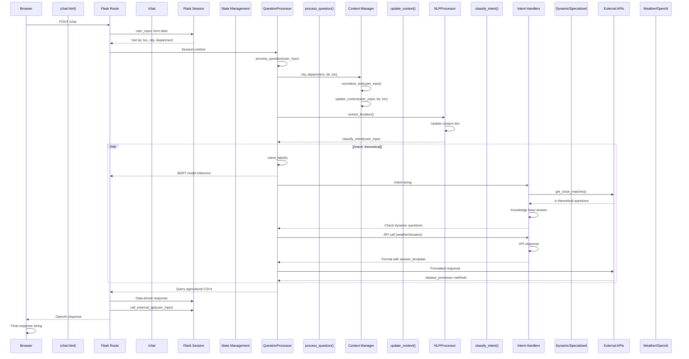
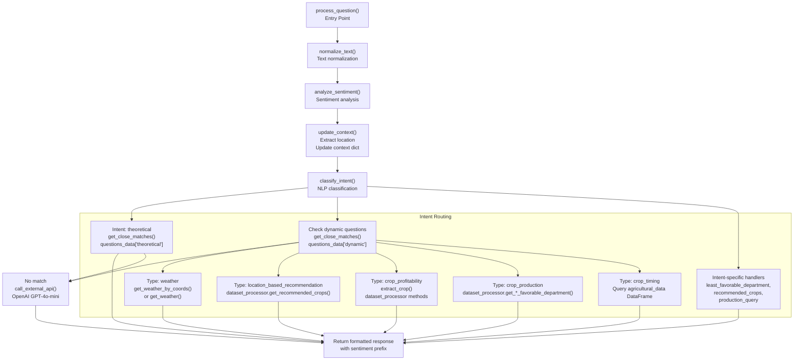
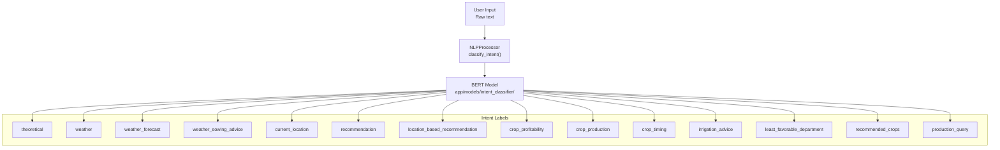
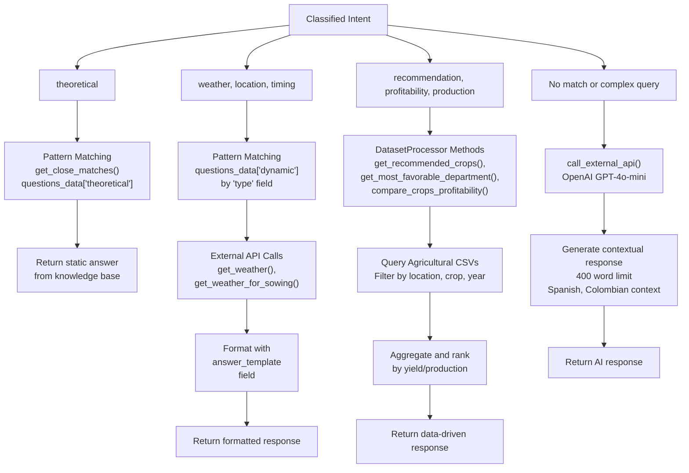

# Request Flow

> **Relevant source files**
> * [app/chatbot/__init__.py](https://github.com/axchisan/ProyectoAgroBot/blob/bc782fcf/app/chatbot/__init__.py)
> * [app/chatbot/question_processor.py](https://github.com/axchisan/ProyectoAgroBot/blob/bc782fcf/app/chatbot/question_processor.py)
> * [app/routes/routes.py](https://github.com/axchisan/ProyectoAgroBot/blob/bc782fcf/app/routes/routes.py)

This document traces the path of a user request through the Agrobot system, from initial HTTP request to final response delivery. It explains how Flask routes receive requests, delegate to the chatbot core, process user queries through intent classification and specialized handlers, and return formatted responses.

For architectural layer organization, see [Application Layers](/axchisan/ProyectoAgroBot/3.1-application-layers). For detailed question processing logic, see [Question Processing](/axchisan/ProyectoAgroBot/4.2-question-processing). For data transformation pipelines, see [Data Processing Pipeline](/axchisan/ProyectoAgroBot/3.3-data-processing-pipeline).

## Overview of Request Lifecycle

When a user interacts with Agrobot, their request follows a multi-stage pipeline through the Flask application layer, chatbot processing core, and back to the user interface. The system handles multiple request types including chat queries, weather requests, location updates, and analytics data fetches.

## HTTP Request Entry Points

The Flask application exposes several route endpoints that serve as entry points for user requests. All main routes are defined in [app/routes/routes.py](https://github.com/axchisan/ProyectoAgroBot/blob/bc782fcf/app/routes/routes.py)

 using the Flask Blueprint pattern.

### Primary Routes

| Route | Method | Purpose |
| --- | --- | --- |
| `/` | GET | Landing page |
| `/chat` | GET, POST | Chat interface and message processing |
| `/weather` | GET | Weather dashboard |
| `/update_location` | POST | Location update via GPS |
| `/clear_chat` | GET | Chat history reset |
| `/refresh_weather` | GET | Weather data refresh |

**Sources:** [app/routes/routes.py L8-L191](https://github.com/axchisan/ProyectoAgroBot/blob/bc782fcf/app/routes/routes.py#L8-L191)

### Chatbot Initialization at Application Startup

Before any requests are processed, the chatbot is initialized once at module load time:

```
processor = init_chatbot(weather_api_key=os.getenv("OPENWEATHERMAP_API_KEY"))
```

The `init_chatbot` function [app/chatbot/__init__.py L6-L44](https://github.com/axchisan/ProyectoAgroBot/blob/bc782fcf/app/chatbot/__init__.py#L6-L44)

 performs the following initialization sequence:

1. Loads knowledge base from `questions.json`
2. Loads agricultural data from CSV files
3. Loads department geographical data
4. Loads dynamic datasets from processed data directory
5. Initializes `DatasetProcessor` with dynamic datasets
6. Creates `QuestionProcessor` instance with all loaded data and API keys

This single `processor` instance is reused across all requests, maintaining loaded data in memory.

**Sources:** [app/routes/routes.py L10-L11](https://github.com/axchisan/ProyectoAgroBot/blob/bc782fcf/app/routes/routes.py#L10-L11)

 [app/chatbot/__init__.py L6-L44](https://github.com/axchisan/ProyectoAgroBot/blob/bc782fcf/app/chatbot/__init__.py#L6-L44)

## Chat Request Flow

The chat interaction represents the core request flow through the system. The following diagram illustrates the complete journey of a chat message from user input to response display.

### Chat Request Sequence



**Sources:** [app/routes/routes.py L17-L45](https://github.com/axchisan/ProyectoAgroBot/blob/bc782fcf/app/routes/routes.py#L17-L45)

 [app/chatbot/question_processor.py L132-L344](https://github.com/axchisan/ProyectoAgroBot/blob/bc782fcf/app/chatbot/question_processor.py#L132-L344)

### Route Handler Logic

The `/chat` route implements the following logic:

1. **Session Initialization** [app/routes/routes.py L19-L22](https://github.com/axchisan/ProyectoAgroBot/blob/bc782fcf/app/routes/routes.py#L19-L22) : If `chat_history` doesn't exist in session, initialize with welcome message
2. **Request Processing** [app/routes/routes.py L24-L31](https://github.com/axchisan/ProyectoAgroBot/blob/bc782fcf/app/routes/routes.py#L24-L31) : Extract `user_input` from form, retrieve location context from session
3. **Question Processing** [app/routes/routes.py L31](https://github.com/axchisan/ProyectoAgroBot/blob/bc782fcf/app/routes/routes.py#L31-L31) : Call `processor.process_question()` with input and context
4. **History Update** [app/routes/routes.py L34-L37](https://github.com/axchisan/ProyectoAgroBot/blob/bc782fcf/app/routes/routes.py#L34-L37) : Append both user message and bot response to `chat_history` with timestamps
5. **Session Persistence** [app/routes/routes.py L37](https://github.com/axchisan/ProyectoAgroBot/blob/bc782fcf/app/routes/routes.py#L37-L37) : Mark session as modified to ensure persistence
6. **Location Context Update** [app/routes/routes.py L39-L43](https://github.com/axchisan/ProyectoAgroBot/blob/bc782fcf/app/routes/routes.py#L39-L43) : If user mentions location, update session context
7. **Template Rendering** [app/routes/routes.py L45](https://github.com/axchisan/ProyectoAgroBot/blob/bc782fcf/app/routes/routes.py#L45-L45) : Return rendered `chat.html` with updated history

**Sources:** [app/routes/routes.py L17-L45](https://github.com/axchisan/ProyectoAgroBot/blob/bc782fcf/app/routes/routes.py#L17-L45)

## Question Processing Pipeline

The `QuestionProcessor.process_question()` method [app/chatbot/question_processor.py L132-L344](https://github.com/axchisan/ProyectoAgroBot/blob/bc782fcf/app/chatbot/question_processor.py#L132-L344)

 implements a sophisticated multi-stage pipeline for handling user queries.

### Processing Stages



**Sources:** [app/chatbot/question_processor.py L132-L344](https://github.com/axchisan/ProyectoAgroBot/blob/bc782fcf/app/chatbot/question_processor.py#L132-L344)

### Context Management During Processing

The `update_context()` method [app/chatbot/question_processor.py L77-L94](https://github.com/axchisan/ProyectoAgroBot/blob/bc782fcf/app/chatbot/question_processor.py#L77-L94)

 maintains conversation state throughout the request:

| Context Field | Source | Purpose |
| --- | --- | --- |
| `lat`, `lon` | Method parameters or GPS | Precise geolocation |
| `city` | Extracted from coordinates or text | City-level location |
| `department` | Extracted from coordinates or text | Department-level location |
| `last_crop` | Extracted from user input | Last mentioned crop |

Context updates follow this priority:

1. If coordinates provided, call `get_location_from_coords()` to resolve city/department
2. Call `extract_location()` on user input text
3. Merge extracted location into context dictionary
4. Subsequent handlers use `self.context` to access location information

**Sources:** [app/chatbot/question_processor.py L77-L94](https://github.com/axchisan/ProyectoAgroBot/blob/bc782fcf/app/chatbot/question_processor.py#L77-L94)

 [app/chatbot/question_processor.py L28-L34](https://github.com/axchisan/ProyectoAgroBot/blob/bc782fcf/app/chatbot/question_processor.py#L28-L34)

## Intent Classification and Routing

Intent classification is the mechanism that routes user queries to appropriate handlers. The system supports 14 distinct intent types.

### Intent Classification Process



The `intent_labels` list is defined in `QuestionProcessor.__init__()` [app/chatbot/question_processor.py L22-L27](https://github.com/axchisan/ProyectoAgroBot/blob/bc782fcf/app/chatbot/question_processor.py#L22-L27)

 and passed to the NLP processor for classification.

**Sources:** [app/chatbot/question_processor.py L22-L27](https://github.com/axchisan/ProyectoAgroBot/blob/bc782fcf/app/chatbot/question_processor.py#L22-L27)

 [app/chatbot/question_processor.py L142](https://github.com/axchisan/ProyectoAgroBot/blob/bc782fcf/app/chatbot/question_processor.py#L142-L142)

### Response Strategy by Intent

The system employs different response strategies based on the classified intent:



**Sources:** [app/chatbot/question_processor.py L144-L344](https://github.com/axchisan/ProyectoAgroBot/blob/bc782fcf/app/chatbot/question_processor.py#L144-L344)

## Response Generation Strategies

The system implements a multi-tier response generation approach, attempting progressively more sophisticated methods until a response is generated.

### Tier 1: Theoretical Knowledge Base

For `theoretical` intent [app/chatbot/question_processor.py L144-L150](https://github.com/axchisan/ProyectoAgroBot/blob/bc782fcf/app/chatbot/question_processor.py#L144-L150)

:

1. Normalize all theoretical questions from `questions_data["theoretical"]`
2. Use `get_close_matches()` with 0.6 cutoff to find similar questions
3. Return associated answer from matched question object

Example questions handled:

* Agricultural concepts
* Best practices
* Crop-specific theoretical knowledge

### Tier 2: Dynamic Questions with Templates

For dynamic questions [app/chatbot/question_processor.py L152-L308](https://github.com/axchisan/ProyectoAgroBot/blob/bc782fcf/app/chatbot/question_processor.py#L152-L308)

:

1. Pattern match against `questions_data["dynamic"]`
2. Identify question `type` field (weather, recommendation, profitability, etc.)
3. Execute type-specific logic: * **Weather types**: Call weather API with coordinates or city * **Recommendation types**: Query `DatasetProcessor` for crop recommendations * **Profitability types**: Extract crop, query profitability data * **Production types**: Query production statistics by location * **Timing types**: Query agricultural data for planting months
4. Format response using `answer_template` field with dynamic values

**Sources:** [app/chatbot/question_processor.py L152-L308](https://github.com/axchisan/ProyectoAgroBot/blob/bc782fcf/app/chatbot/question_processor.py#L152-L308)

### Tier 3: Intent-Specific Handlers

For specific intents without dynamic question match [app/chatbot/question_processor.py L309-L338](https://github.com/axchisan/ProyectoAgroBot/blob/bc782fcf/app/chatbot/question_processor.py#L309-L338)

:

* **least_favorable_department**: Extract crop, call `dataset_processor.get_least_favorable_department()`
* **recommended_crops**: Call `dataset_processor.get_recommended_crops()` with target department
* **production_query**: Extract crop, year, location, call `dataset_processor.get_production_by_location()`

### Tier 4: AI Fallback

When no pattern matches or query is complex [app/chatbot/question_processor.py L340-L342](https://github.com/axchisan/ProyectoAgroBot/blob/bc782fcf/app/chatbot/question_processor.py#L340-L342)

:

1. Check if query has no matches OR has more than 6 words
2. Call `call_external_api(user_input)` [app/chatbot/question_processor.py L96-L130](https://github.com/axchisan/ProyectoAgroBot/blob/bc782fcf/app/chatbot/question_processor.py#L96-L130)
3. OpenAI API generates contextual response using system prompt
4. System prompt configures GPT-4o-mini for: * Spanish language * Colombian agricultural context * 150-400 word responses * Clear, practical advice for small farmers

**Sources:** [app/chatbot/question_processor.py L96-L130](https://github.com/axchisan/ProyectoAgroBot/blob/bc782fcf/app/chatbot/question_processor.py#L96-L130)

 [app/chatbot/question_processor.py L340-L342](https://github.com/axchisan/ProyectoAgroBot/blob/bc782fcf/app/chatbot/question_processor.py#L340-L342)

 [app/chatbot/question_processor.py L35-L42](https://github.com/axchisan/ProyectoAgroBot/blob/bc782fcf/app/chatbot/question_processor.py#L35-L42)

## Location and Weather Request Flows

Location-aware features require specialized request flows that integrate with external services.

### Location Update Flow

When a user provides GPS coordinates through browser geolocation:

```mermaid
sequenceDiagram
  participant Browser
  participant JavaScript
  participant /update_location
  participant POST endpoint
  participant Flask Session
  participant location_handler
  participant get_location_from_coords()
  participant Nominatim API
  participant Reverse geocoding

  Browser->>Browser: navigator.geolocation
  Browser->>/update_location: getCurrentPosition()
  /update_location->>/update_location: POST /update_location
  /update_location->>Flask Session: {lat, lon}
  /update_location->>location_handler: request.get_json()
  location_handler->>Nominatim API: Store lat, lon as float
  Nominatim API-->>location_handler: get_location_from_coords(lat, lon)
  location_handler->>location_handler: Reverse geocode request
  location_handler-->>/update_location: Address components
  /update_location->>Flask Session: Extract city, department
  /update_location->>Flask Session: from address
  /update_location-->>Browser: {city, department}
```

**Sources:** [app/routes/routes.py L154-L168](https://github.com/axchisan/ProyectoAgroBot/blob/bc782fcf/app/routes/routes.py#L154-L168)

### Weather Page Request Flow

The weather dashboard follows a distinct flow optimized for real-time data display:

1. **Initial Load** [app/routes/routes.py L56-L103](https://github.com/axchisan/ProyectoAgroBot/blob/bc782fcf/app/routes/routes.py#L56-L103) : * Get city and department from session (default: Guavatá, Santander) * Call `get_weather()` for current conditions * Call `get_weather_for_sowing()` for agricultural advice * Call `get_forecast()` for 7-day forecast * Format all data into `weather_info` and `forecast_list` dictionaries * Render `weather.html` template with data
2. **AJAX Refresh** [app/routes/routes.py L105-L152](https://github.com/axchisan/ProyectoAgroBot/blob/bc782fcf/app/routes/routes.py#L105-L152) : * Same data fetching logic as initial load * Return JSON response instead of HTML rendering * Browser JavaScript updates page without reload

**Sources:** [app/routes/routes.py L56-L152](https://github.com/axchisan/ProyectoAgroBot/blob/bc782fcf/app/routes/routes.py#L56-L152)

## Session State Management

Flask session is used to maintain user context across requests. Session data persists in encrypted cookies.

### Session Data Structure

| Key | Type | Purpose | Updated By |
| --- | --- | --- | --- |
| `chat_history` | List[Dict] | Chat message history | `/chat` POST |
| `lat` | float | GPS latitude | `/update_location` |
| `lon` | float | GPS longitude | `/update_location` |
| `city` | str | Current city | `/update_location`, `/chat` |
| `department` | str | Current department | `/update_location`, `/chat` |

### Session Update Pattern

All routes that modify session follow this pattern:

```python
# 1. Read from session
value = session.get('key', default_value)

# 2. Modify data
new_value = process(value)

# 3. Write back to session
session['key'] = new_value

# 4. Mark session as modified (critical for persistence)
session.modified = True
```

Without `session.modified = True`, changes may not persist across requests.

**Sources:** [app/routes/routes.py L19-L37](https://github.com/axchisan/ProyectoAgroBot/blob/bc782fcf/app/routes/routes.py#L19-L37)

 [app/routes/routes.py L154-L168](https://github.com/axchisan/ProyectoAgroBot/blob/bc782fcf/app/routes/routes.py#L154-L168)

## Error Handling and Fallback Behavior

The request flow includes multiple fallback mechanisms to ensure graceful degradation.

### Location Fallback Chain

1. User-provided GPS coordinates (`lat`, `lon` in session)
2. Extracted city from user text input
3. Default location: Guavatá, Santander

### Response Fallback Chain

1. Theoretical knowledge base pattern matching
2. Dynamic question pattern matching with specialized handlers
3. Intent-specific direct handlers
4. OpenAI API generation
5. Generic "I don't understand" message

### API Failure Handling

* **Weather API failures**: Return error message in weather data dict
* **OpenAI API failures**: Return error message describing failure type (HTTP error, connection error, parsing error)
* **Nominatim failures**: Return `None`, system uses text-based location extraction

**Sources:** [app/chatbot/question_processor.py L96-L130](https://github.com/axchisan/ProyectoAgroBot/blob/bc782fcf/app/chatbot/question_processor.py#L96-L130)

 [app/routes/routes.py L103](https://github.com/axchisan/ProyectoAgroBot/blob/bc782fcf/app/routes/routes.py#L103-L103)

 [app/routes/routes.py L152](https://github.com/axchisan/ProyectoAgroBot/blob/bc782fcf/app/routes/routes.py#L152-L152)

## Performance Considerations

The request flow is optimized for response time and resource efficiency:

1. **One-time Initialization**: Chatbot processor initialized once at application startup, not per-request
2. **In-Memory Data**: Agricultural datasets loaded into memory, no disk I/O per request
3. **Session Caching**: Location context cached in session, reduces API calls
4. **Lazy External Calls**: OpenAI only called when pattern matching fails
5. **CSV Query Optimization**: Pandas DataFrames used for efficient filtering and aggregation

The typical request completes in:

* Pattern matched responses: 10-50ms
* Weather API responses: 100-300ms (external API latency)
* AI fallback responses: 1-3 seconds (OpenAI API latency)

**Sources:** [app/routes/routes.py L10-L11](https://github.com/axchisan/ProyectoAgroBot/blob/bc782fcf/app/routes/routes.py#L10-L11)

 [app/chatbot/__init__.py L6-L44](https://github.com/axchisan/ProyectoAgroBot/blob/bc782fcf/app/chatbot/__init__.py#L6-L44)