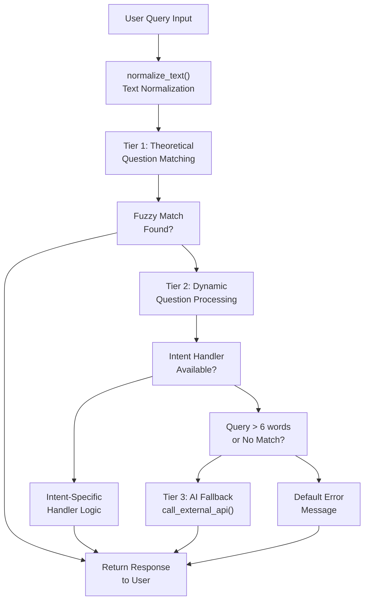
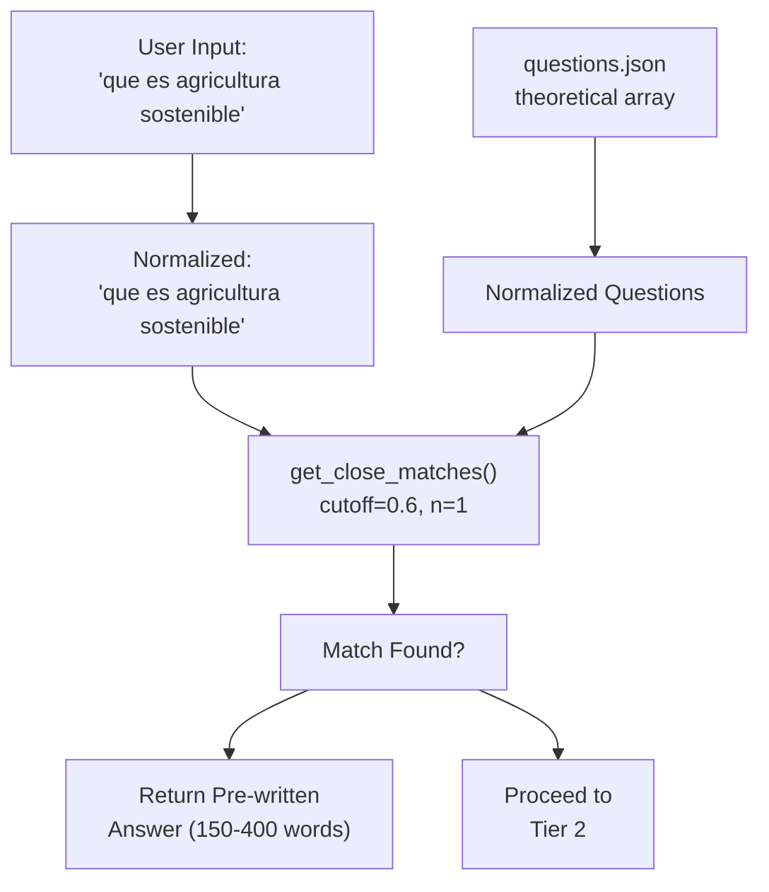
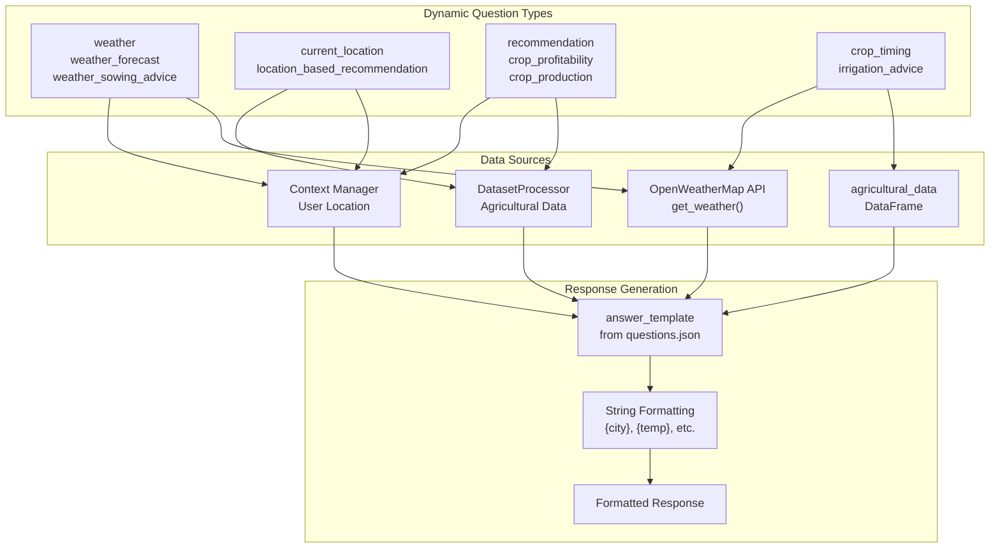
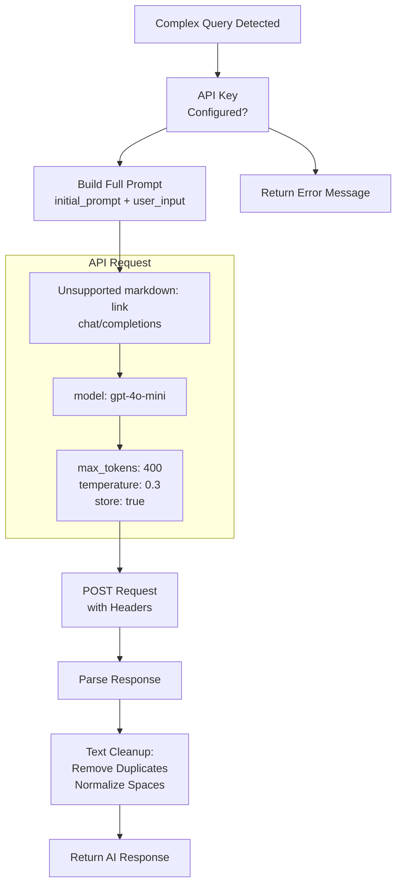
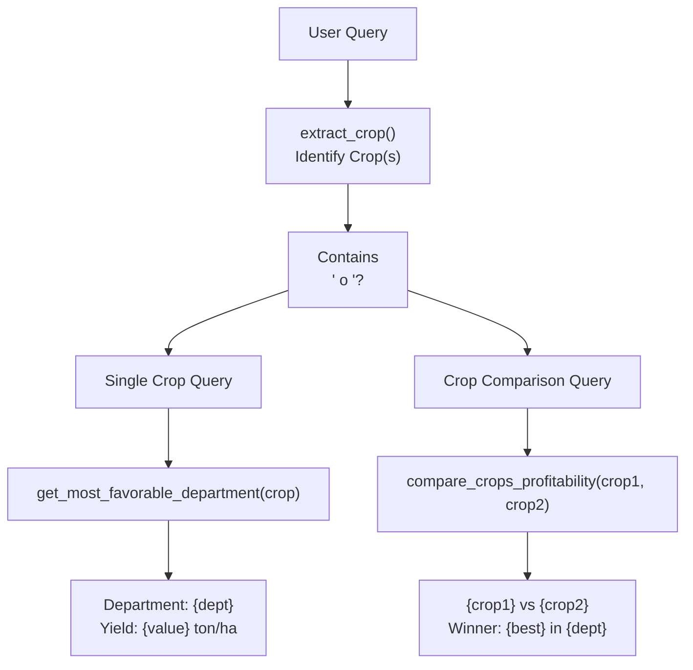
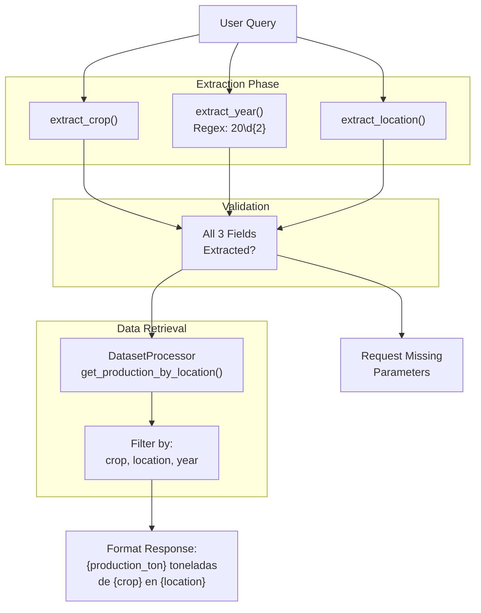
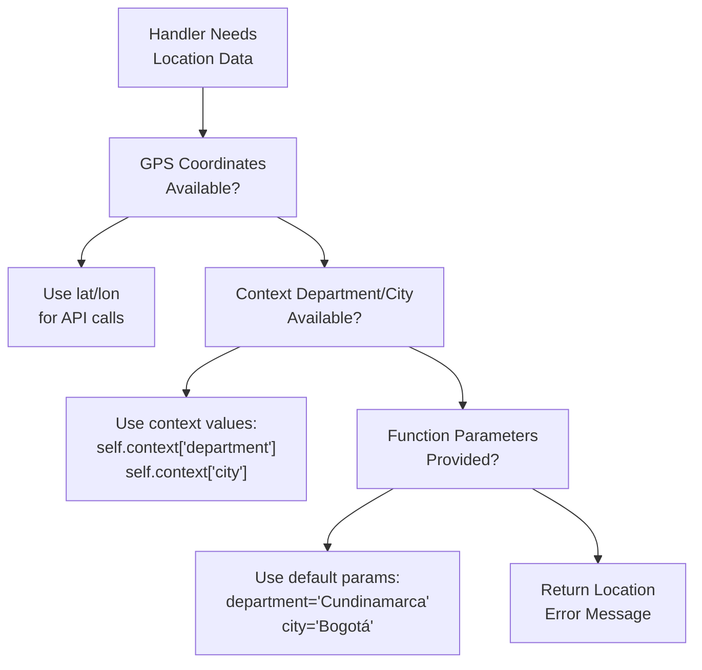
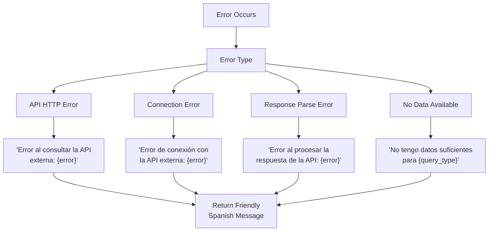
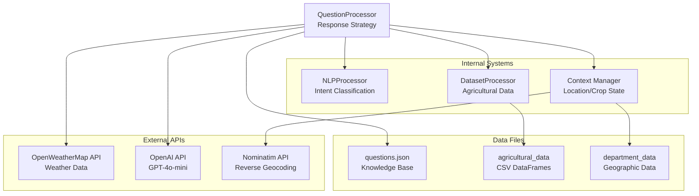

# Response Strategy

> **Relevant source files**
> * [app/chatbot/question_processor.py](https://github.com/axchisan/ProyectoAgroBot/blob/bc782fcf/app/chatbot/question_processor.py)
> * [data/questions.json](https://github.com/axchisan/ProyectoAgroBot/blob/bc782fcf/data/questions.json)

## Purpose and Scope

This document explains how Agrobot's chatbot determines the appropriate response to user queries through a multi-tier strategy. The system employs three progressively sophisticated levels: fuzzy pattern matching against a knowledge base, intent-driven dynamic responses with data integration, and AI-powered fallback for complex queries.

For information about how intents are classified from user input, see [Intent Classification](/axchisan/ProyectoAgroBot/4.3-intent-classification). For details on how the chatbot processes questions and manages conversation flow, see [Question Processing](/axchisan/ProyectoAgroBot/4.2-question-processing).

**Sources:** [app/chatbot/question_processor.py L1-L344](https://github.com/axchisan/ProyectoAgroBot/blob/bc782fcf/app/chatbot/question_processor.py#L1-L344)

---

## Multi-Tier Response Architecture

The `QuestionProcessor` class implements a three-tier strategy to provide increasingly sophisticated responses based on query complexity:



**Diagram: Three-Tier Response Strategy Flow**

The tiers are evaluated sequentially, with each tier handling progressively more complex or unstructured queries. Simpler queries are resolved quickly at Tier 1, while complex agricultural questions fall through to Tier 3.

**Sources:** [app/chatbot/question_processor.py L132-L344](https://github.com/axchisan/ProyectoAgroBot/blob/bc782fcf/app/chatbot/question_processor.py#L132-L344)

---

## Tier 1: Theoretical Question Matching

### Fuzzy Matching Against Knowledge Base

The first tier attempts to match user queries against a predefined set of theoretical questions using fuzzy string matching. This handles common agricultural knowledge questions with pre-written, detailed answers.

| Component | Implementation | Purpose |
| --- | --- | --- |
| Knowledge Base | `questions_data["theoretical"]` | Stores 30+ pre-written Q&A pairs |
| Matching Algorithm | `get_close_matches()` from `difflib` | Finds similar questions with cutoff 0.6 |
| Normalization | `normalize_text()` | Standardizes text for comparison |

### Normalization Process

The `normalize_text()` method at [app/chatbot/question_processor.py L45-L56](https://github.com/axchisan/ProyectoAgroBot/blob/bc782fcf/app/chatbot/question_processor.py#L45-L56)

 performs several transformations:

```markdown
# Common replacements handled:
"q" → "que"
"k" → "que"  
"cultvio" → "cultivo"
"depto"/"dept" → "departamento"
# Removes accents, punctuation
# Converts to lowercase
```

### Matching Logic



**Diagram: Theoretical Question Matching Flow**

The matching occurs at [app/chatbot/question_processor.py L144-L150](https://github.com/axchisan/ProyectoAgroBot/blob/bc782fcf/app/chatbot/question_processor.py#L144-L150)

 If a match is found with confidence ≥ 0.6, the corresponding answer from `questions.json` is returned immediately.

**Sources:** [app/chatbot/question_processor.py L45-L56](https://github.com/axchisan/ProyectoAgroBot/blob/bc782fcf/app/chatbot/question_processor.py#L45-L56)

 [app/chatbot/question_processor.py L144-L150](https://github.com/axchisan/ProyectoAgroBot/blob/bc782fcf/app/chatbot/question_processor.py#L144-L150)

 [data/questions.json L1-L151](https://github.com/axchisan/ProyectoAgroBot/blob/bc782fcf/data/questions.json#L1-L151)

---

## Tier 2: Dynamic Question Processing

### Template-Based Responses

When no theoretical match is found, the system checks dynamic questions that use answer templates. These templates are populated with real-time data from external services or agricultural datasets.



**Diagram: Dynamic Question Processing with Data Integration**

**Sources:** [app/chatbot/question_processor.py L152-L308](https://github.com/axchisan/ProyectoAgroBot/blob/bc782fcf/app/chatbot/question_processor.py#L152-L308)

 [data/questions.json L152-L243](https://github.com/axchisan/ProyectoAgroBot/blob/bc782fcf/data/questions.json#L152-L243)

### Intent-Specific Handler Routing

Each dynamic question type has specialized handler logic based on its intent classification:

| Intent Type | Handler Location | Data Sources | Response Format |
| --- | --- | --- | --- |
| `theoretical` | [question_processor.py L144-L150](https://github.com/axchisan/ProyectoAgroBot/blob/bc782fcf/question_processor.py#L144-L150) | `questions_data["theoretical"]` | Direct answer text |
| `weather` | [question_processor.py L157-L174](https://github.com/axchisan/ProyectoAgroBot/blob/bc782fcf/question_processor.py#L157-L174) | OpenWeatherMap API, coordinates | Template: city, description, temp |
| `weather_sowing_advice` | [question_processor.py L184-L205](https://github.com/axchisan/ProyectoAgroBot/blob/bc782fcf/question_processor.py#L184-L205) | Weather API + agricultural logic | Template: weather + recommendation |
| `irrigation_advice` | [question_processor.py L206-L231](https://github.com/axchisan/ProyectoAgroBot/blob/bc782fcf/question_processor.py#L206-L231) | Weather API (humidity) | Conditional recommendation |
| `recommendation` | [question_processor.py L232-L240](https://github.com/axchisan/ProyectoAgroBot/blob/bc782fcf/question_processor.py#L232-L240) | `DatasetProcessor.get_recommended_crops()` | List of crops with yields |
| `location_based_recommendation` | [question_processor.py L241-L248](https://github.com/axchisan/ProyectoAgroBot/blob/bc782fcf/question_processor.py#L241-L248) | Dataset + context department | Crops for specific region |
| `crop_profitability` | [question_processor.py L249-L268](https://github.com/axchisan/ProyectoAgroBot/blob/bc782fcf/question_processor.py#L249-L268) | `DatasetProcessor` profitability methods | Department ranking by yield |
| `crop_production` | [question_processor.py L269-L298](https://github.com/axchisan/ProyectoAgroBot/blob/bc782fcf/question_processor.py#L269-L298) | Production datasets | Production volume by location |
| `crop_timing` | [question_processor.py L299-L307](https://github.com/axchisan/ProyectoAgroBot/blob/bc782fcf/question_processor.py#L299-L307) | `agricultural_data` DataFrame | Optimal planting month |
| `least_favorable_department` | [question_processor.py L309-L316](https://github.com/axchisan/ProyectoAgroBot/blob/bc782fcf/question_processor.py#L309-L316) | `DatasetProcessor` analytics | Department with lowest yield |
| `recommended_crops` | [question_processor.py L318-L325](https://github.com/axchisan/ProyectoAgroBot/blob/bc782fcf/question_processor.py#L318-L325) | Regional crop data | Ranked crop list |
| `production_query` | [question_processor.py L327-L338](https://github.com/axchisan/ProyectoAgroBot/blob/bc782fcf/question_processor.py#L327-L338) | Historical production data | Specific year/location production |

### Weather Query Handler Example

```mermaid
sequenceDiagram
  participant User
  participant QuestionProcessor
  participant Context
  participant get_weather_by_coords()
  participant Template

  User->>QuestionProcessor: "¿Cómo está el clima?"
  QuestionProcessor->>Context: Check lat/lon context
  loop [Coordinates Available]
    Context-->>QuestionProcessor: lat: 4.7110, lon: -74.0721
    QuestionProcessor->>get_weather_by_coords(): get_weather_by_coords(lat, lon, api_key)
    get_weather_by_coords()-->>QuestionProcessor: {"temp": 18, "description": "nublado"}
    Context-->>QuestionProcessor: city: "Bogotá"
    QuestionProcessor->>get_weather_by_coords(): get_weather(city, api_key)
    get_weather_by_coords()-->>QuestionProcessor: {"temp": 18, "description": "nublado"}
  end
  QuestionProcessor->>Template: answer_template.format(city, description, temp)
  Template-->>QuestionProcessor: "El clima en Bogotá es nublado con 18°C."
  QuestionProcessor-->>User: Response
```

**Diagram: Weather Query Processing with Context**

The handler checks for GPS coordinates first [question_processor.py L158-L165](https://github.com/axchisan/ProyectoAgroBot/blob/bc782fcf/question_processor.py#L158-L165)

 falling back to city name [question_processor.py L166-L173](https://github.com/axchisan/ProyectoAgroBot/blob/bc782fcf/question_processor.py#L166-L173)

 demonstrating the context-aware approach.

**Sources:** [app/chatbot/question_processor.py L152-L308](https://github.com/axchisan/ProyectoAgroBot/blob/bc782fcf/app/chatbot/question_processor.py#L152-L308)

---

## Tier 3: AI Fallback System

### Triggering Conditions

The AI fallback is invoked when:

1. No fuzzy match found in theoretical questions
2. No fuzzy match found in dynamic questions
3. Query length exceeds 6 words (indicating complexity)

```markdown
# From question_processor.py:340-342
words = user_input.split()
if not matches or len(words) > 6:
    return sentiment_prefix + self.call_external_api(user_input)
```

### OpenAI Integration

The `call_external_api()` method at [app/chatbot/question_processor.py L96-L131](https://github.com/axchisan/ProyectoAgroBot/blob/bc782fcf/app/chatbot/question_processor.py#L96-L131)

 implements the fallback:



**Diagram: AI Fallback Processing Pipeline**

### System Prompt

The `initial_prompt` at [app/chatbot/question_processor.py L35-L43](https://github.com/axchisan/ProyectoAgroBot/blob/bc782fcf/app/chatbot/question_processor.py#L35-L43)

 sets the AI's context:

* **Role**: Complement to Agrobot for unanswerable questions
* **Target Audience**: Colombian small farmers
* **Response Format**: Spanish, 150-400 words
* **Content Focus**: Practical agricultural advice with step-by-step guidance
* **Language Style**: Simple, Colombian context, no jargon

### Response Cleanup

Post-processing at [question_processor.py L120-L121](https://github.com/axchisan/ProyectoAgroBot/blob/bc782fcf/question_processor.py#L120-L121)

:

```markdown
# Remove accidental character duplication
raw_response = re.sub(r'\b(\w+)(\w)\2+\b', r'\1\2', raw_response)
# Normalize whitespace
raw_response = re.sub(r'\s+', ' ', raw_response)
```

**Sources:** [app/chatbot/question_processor.py L96-L131](https://github.com/axchisan/ProyectoAgroBot/blob/bc782fcf/app/chatbot/question_processor.py#L96-L131)

 [app/chatbot/question_processor.py L35-L43](https://github.com/axchisan/ProyectoAgroBot/blob/bc782fcf/app/chatbot/question_processor.py#L35-L43)

---

## Specialized Handler Implementations

### Crop Profitability Comparison

The system handles both single-crop profitability queries and crop comparisons:



**Diagram: Crop Profitability Handler Logic**

Implementation at [question_processor.py L249-L268](https://github.com/axchisan/ProyectoAgroBot/blob/bc782fcf/question_processor.py#L249-L268)

 shows the dual-path logic for handling "¿Qué es más rentable, papa o maíz?" versus "¿Dónde es más rentable la papa?"

**Sources:** [app/chatbot/question_processor.py L249-L268](https://github.com/axchisan/ProyectoAgroBot/blob/bc782fcf/app/chatbot/question_processor.py#L249-L268)

### Production Query Handler



**Diagram: Production Query Parameter Extraction and Validation**

The handler at [question_processor.py L327-L338](https://github.com/axchisan/ProyectoAgroBot/blob/bc782fcf/question_processor.py#L327-L338)

 requires three parameters: crop, location, and year. If any are missing, it returns a helpful error message.

**Sources:** [app/chatbot/question_processor.py L327-L338](https://github.com/axchisan/ProyectoAgroBot/blob/bc782fcf/app/chatbot/question_processor.py#L327-L338)

 [app/chatbot/question_processor.py L58-L75](https://github.com/axchisan/ProyectoAgroBot/blob/bc782fcf/app/chatbot/question_processor.py#L58-L75)

---

## Context Integration in Response Generation

### Context-Aware Response Selection

The response strategy leverages conversation context stored in `self.context`:

```css
# Context structure at question_processor.py:28-34
self.context = {
    "department": None,    # User's department
    "city": None,          # User's city  
    "last_crop": None,     # Last mentioned crop
    "lat": None,           # GPS latitude
    "lon": None            # GPS longitude
}
```

### Priority System for Location Data



**Diagram: Location Data Priority in Response Generation**

This priority system is implemented at [question_processor.py L139-L140](https://github.com/axchisan/ProyectoAgroBot/blob/bc782fcf/question_processor.py#L139-L140)

:

```
target_dept = self.context["department"] if self.context["department"] else department
target_city = self.context["city"] if self.context["city"] else city
```

**Sources:** [app/chatbot/question_processor.py L28-L34](https://github.com/axchisan/ProyectoAgroBot/blob/bc782fcf/app/chatbot/question_processor.py#L28-L34)

 [app/chatbot/question_processor.py L132-L140](https://github.com/axchisan/ProyectoAgroBot/blob/bc782fcf/app/chatbot/question_processor.py#L132-L140)

---

## Sentiment-Aware Response Prefixing

### Sentiment Analysis Integration

The response strategy applies sentiment analysis to add empathetic prefixes:

```markdown
# At question_processor.py:134-135
sentiment = self.nlp_processor.analyze_sentiment(user_input)
sentiment_prefix = "¡Entiendo que estás preocupado! " if sentiment["compound"] < -0.1 else ""
```

All responses are prepended with `sentiment_prefix`, showing concern when the user's query has negative sentiment. This humanizes the chatbot for Colombian farmers who may be expressing distress about crop failures or weather concerns.

**Sources:** [app/chatbot/question_processor.py L134-L135](https://github.com/axchisan/ProyectoAgroBot/blob/bc782fcf/app/chatbot/question_processor.py#L134-L135)

---

## Response Strategy Decision Matrix

The following table summarizes the complete decision logic:

| Condition | Handler | Data Source | Response Type | Code Location |
| --- | --- | --- | --- | --- |
| Theoretical match (cutoff ≥ 0.6) | Direct answer lookup | `questions_data["theoretical"]` | Static text (150-400 words) | [question_processor.py L144-L150](https://github.com/axchisan/ProyectoAgroBot/blob/bc782fcf/question_processor.py#L144-L150) |
| Dynamic weather intent | Weather API call | OpenWeatherMap + coordinates | Template with current weather | [question_processor.py L157-L174](https://github.com/axchisan/ProyectoAgroBot/blob/bc782fcf/question_processor.py#L157-L174) |
| Dynamic sowing advice intent | Weather + logic | Weather API + humidity rules | Template with recommendation | [question_processor.py L184-L205](https://github.com/axchisan/ProyectoAgroBot/blob/bc782fcf/question_processor.py#L184-L205) |
| Dynamic irrigation intent | Weather-based logic | Humidity threshold (70%) | Conditional template | [question_processor.py L206-L231](https://github.com/axchisan/ProyectoAgroBot/blob/bc782fcf/question_processor.py#L206-L231) |
| Dynamic recommendation intent | Dataset query | `DatasetProcessor` yield data | List of crops with metrics | [question_processor.py L232-L240](https://github.com/axchisan/ProyectoAgroBot/blob/bc782fcf/question_processor.py#L232-L240) |
| Dynamic profitability intent | Dataset analytics | Yield comparison by department | Ranking with best department | [question_processor.py L249-L268](https://github.com/axchisan/ProyectoAgroBot/blob/bc782fcf/question_processor.py#L249-L268) |
| Dynamic production intent | Dataset query | Production volume by location | Historical production data | [question_processor.py L269-L298](https://github.com/axchisan/ProyectoAgroBot/blob/bc782fcf/question_processor.py#L269-L298) |
| Dynamic timing intent | Agricultural database | `agricultural_data` crop calendar | Optimal planting month | [question_processor.py L299-L307](https://github.com/axchisan/ProyectoAgroBot/blob/bc782fcf/question_processor.py#L299-L307) |
| No match + query > 6 words | AI fallback | OpenAI GPT-4o-mini | Generated response (150-400 words) | [question_processor.py L340-L342](https://github.com/axchisan/ProyectoAgroBot/blob/bc782fcf/question_processor.py#L340-L342) |
| No match + query ≤ 6 words | Error message | N/A | Request for clarification | [question_processor.py L344](https://github.com/axchisan/ProyectoAgroBot/blob/bc782fcf/question_processor.py#L344-L344) |

**Sources:** [app/chatbot/question_processor.py L132-L344](https://github.com/axchisan/ProyectoAgroBot/blob/bc782fcf/app/chatbot/question_processor.py#L132-L344)

---

## Response Quality Controls

### Answer Length Constraints

The system enforces response length consistency:

| Response Type | Minimum Words | Maximum Words | Enforcement |
| --- | --- | --- | --- |
| Theoretical answers | 150 | 400 | Pre-written in `questions.json` |
| Dynamic templates | Varies | ~100 | Template design |
| AI-generated responses | 150 | 400 | OpenAI `max_tokens: 400` parameter |

### Error Handling Strategy



**Diagram: Error Handling and User-Friendly Messages**

Error handling is implemented at [question_processor.py L125-L130](https://github.com/axchisan/ProyectoAgroBot/blob/bc782fcf/question_processor.py#L125-L130)

 for API errors and throughout the handler methods for data availability issues.

**Sources:** [app/chatbot/question_processor.py L125-L130](https://github.com/axchisan/ProyectoAgroBot/blob/bc782fcf/app/chatbot/question_processor.py#L125-L130)

---

## Response Optimization Techniques

### Text Normalization for Matching

The `normalize_text()` method implements several optimizations:

1. **Common abbreviation expansion**: "q" → "que", "k" → "que"
2. **Typo correction**: "cultvio" → "cultivo", "regn" → "region"
3. **Department name normalization**: "depto"/"dept" → "departamento"
4. **Accent removal**: Uses `unidecode()` to remove diacritics
5. **Punctuation stripping**: Removes ¿¡!?,.;
6. **Case normalization**: Converts to lowercase

This ensures maximum matching probability despite user input variations.

**Sources:** [app/chatbot/question_processor.py L45-L56](https://github.com/axchisan/ProyectoAgroBot/blob/bc782fcf/app/chatbot/question_processor.py#L45-L56)

### Crop Name Extraction

The `extract_crop()` method at [question_processor.py L58-L69](https://github.com/axchisan/ProyectoAgroBot/blob/bc782fcf/question_processor.py#L58-L69)

 maintains a hardcoded list of 25+ Colombian crops with variants:

```markdown
crops = [
    "maíz", "maiz",           # Handles accent variations
    "papa", 
    "café", "cafe",           # Accent-insensitive
    "caña de azúcar", "caña de azucar", "caña azucarera", "caña panelera",  # Multiple names
    # ... 20+ more crops
]
```

The method also updates `self.context["last_crop"]` to remember the last mentioned crop for follow-up queries.

**Sources:** [app/chatbot/question_processor.py L58-L69](https://github.com/axchisan/ProyectoAgroBot/blob/bc782fcf/app/chatbot/question_processor.py#L58-L69)

---

## Integration with External Systems

The response strategy coordinates with multiple external systems:



**Diagram: QuestionProcessor Integration Architecture**

Each tier of the response strategy may invoke different combinations of these systems depending on the query type and available context.

**Sources:** [app/chatbot/question_processor.py L13-L21](https://github.com/axchisan/ProyectoAgroBot/blob/bc782fcf/app/chatbot/question_processor.py#L13-L21)