# Running the Application

> **Relevant source files**
> * [Dockerfile](https://github.com/axchisan/ProyectoAgroBot/blob/bc782fcf/Dockerfile)
> * [docs/README.md](https://github.com/axchisan/ProyectoAgroBot/blob/bc782fcf/docs/README.md)
> * [main.py](https://github.com/axchisan/ProyectoAgroBot/blob/bc782fcf/main.py)

## Purpose and Scope

This document explains how to start the Agrobot Flask development server and access the web interface. It covers the startup process, available routes, and basic configuration options for local development.

**Prerequisites**: Before running the application, ensure you have completed the installation steps in [Installation and Setup](/axchisan/ProyectoAgroBot/2.1-installation-and-setup) and trained the intent classification model as described in [Training the Intent Classifier](/axchisan/ProyectoAgroBot/2.2-training-the-intent-classifier). For production deployment using Docker, see [Docker Deployment](/axchisan/ProyectoAgroBot/2.4-docker-deployment).

---

## Starting the Development Server

The application provides two entry points for starting the Flask development server:

### Using app.py

The primary entry point is `app.py` located in the project root:

```

```

**Sources**: [docs/README.md L138-L139](https://github.com/axchisan/ProyectoAgroBot/blob/bc782fcf/docs/README.md#L138-L139)

### Using main.py

Alternatively, you can use `main.py`, which provides the same functionality:

```

```

Both scripts initialize the Flask application using the `create_app()` factory pattern and start the development server with debug mode enabled [main.py L1-L6](https://github.com/axchisan/ProyectoAgroBot/blob/bc782fcf/main.py#L1-L6)

### Default Server Configuration

| Configuration | Value | Description |
| --- | --- | --- |
| **Host** | `127.0.0.1` (localhost) | Server binds to local interface only |
| **Port** | `5000` | Default Flask development port |
| **Debug Mode** | `True` | Enables auto-reload and detailed error messages |
| **Access URL** | [http://127.0.0.1:5000](http://127.0.0.1:5000) | Local web interface |

**Sources**: [docs/README.md L142](https://github.com/axchisan/ProyectoAgroBot/blob/bc782fcf/docs/README.md#L142-L142)

 [main.py L5-L6](https://github.com/axchisan/ProyectoAgroBot/blob/bc782fcf/main.py#L5-L6)

---

## Application Startup Process

The following diagram illustrates the initialization sequence when the Flask application starts:

```

```

**Application Initialization Components**:

1. **create_app()**: Factory function that creates and configures the Flask application instance
2. **init_chatbot()**: Initializes the chatbot system by loading data and instantiating processors
3. **Blueprint Registration**: Registers route handlers for main application and analytics
4. **Asset Loading**: Loads static files (CSS/JS) and Jinja2 templates for rendering

**Sources**: [main.py L1-L6](https://github.com/axchisan/ProyectoAgroBot/blob/bc782fcf/main.py#L1-L6)

 [docs/README.md L138-L142](https://github.com/axchisan/ProyectoAgroBot/blob/bc782fcf/docs/README.md#L138-L142)

---

## Accessing the Web Interface

Once the server starts, you will see output similar to:

```yaml
* Serving Flask app 'app'
 * Debug mode: on
WARNING: This is a development server. Do not use it in a production deployment.
 * Running on http://127.0.0.1:5000
Press CTRL+C to quit
 * Restarting with stat
 * Debugger is active!
```

Open a web browser and navigate to **[http://127.0.0.1:5000](http://127.0.0.1:5000)** to access the application landing page.

### Port Configuration

To run the server on a different port, modify the `app.run()` call:

```

```

Access the application at [http://127.0.0.1:8080](http://127.0.0.1:8080).

**Sources**: [docs/README.md L142](https://github.com/axchisan/ProyectoAgroBot/blob/bc782fcf/docs/README.md#L142-L142)

 [main.py L5-L6](https://github.com/axchisan/ProyectoAgroBot/blob/bc782fcf/main.py#L5-L6)

---

## Available Routes and Pages

The application exposes multiple route handlers through two Flask blueprints. The following diagram maps user-facing pages to their corresponding route handlers:

```mermaid
flowchart TD

Browser["Web Browser<br>Unsupported markdown: link"]
Root["/  → index()<br>Landing Page"]
Chat["/chat  → chat()<br>Chat Interface"]
Weather["/weather  → weather()<br>Weather Page"]
Recs["/recommendations  → recommendations()<br>Crop Recommendations"]
Status["/crop_status  → crop_status()<br>Crop Status"]
Support["/support  → support()<br>Support Page"]
ChatAPI["/chat POST → chat()<br>Message Handling"]
Dashboard["/dashboard  → dashboard()<br>Overview Dashboard"]
NationalCrops["/national-crops  → national_crops()<br>National Crop Data"]
Municipal["/municipal-data  → municipal_data()<br>Municipal Analysis"]
DeptComp["/departmental-comparison  → departmental_comparison()<br>Department Comparison"]
DeptPart["/departmental-participation  → departmental_participation()<br>Participation Analysis"]
ChartAPI["/api/chart-data  → chart_data()<br>Chart Data JSON"]
StatsAPI["/api/summary-stats  → summary_stats()<br>Statistics JSON"]
Export["/export  → export_data()<br>CSV/JSON Export"]

Browser --> Root
Browser --> Chat
Browser --> Weather
Browser --> Recs
Browser --> Status
Browser --> Support
Browser --> Dashboard
Browser --> NationalCrops
Browser --> Municipal
Browser --> DeptComp
Browser --> DeptPart

subgraph subGraph1 ["Analytics Blueprint - analytics_routes.py"]
    Dashboard
    NationalCrops
    Municipal
    DeptComp
    DeptPart
    ChartAPI
    StatsAPI
    Export
    NationalCrops --> ChartAPI
    NationalCrops --> StatsAPI
    Municipal --> ChartAPI
    DeptComp --> ChartAPI
end

subgraph subGraph0 ["Main Blueprint - routes.py"]
    Root
    Chat
    Weather
    Recs
    Status
    Support
    ChatAPI
    Chat --> ChatAPI
end
```



### Main Application Routes

| Route | Method | Handler | Purpose |
| --- | --- | --- | --- |
| `/` | GET | `index()` | Landing page with project overview |
| `/chat` | GET | `chat()` | Interactive chatbot interface |
| `/chat` | POST | `chat()` | Process user messages and return responses |
| `/weather` | GET | `weather()` | Weather information and forecasts |
| `/recommendations` | GET | `recommendations()` | Agricultural recommendations page |
| `/crop_status` | GET | `crop_status()` | Crop status monitoring |
| `/support` | GET | `support()` | Support and help resources |

### Analytics Routes

| Route | Method | Handler | Purpose |
| --- | --- | --- | --- |
| `/dashboard` | GET | `dashboard()` | Analytics overview dashboard |
| `/national-crops` | GET | `national_crops()` | National crop production data |
| `/municipal-data` | GET | `municipal_data()` | Municipal-level analysis |
| `/departmental-comparison` | GET | `departmental_comparison()` | Cross-department comparison |
| `/departmental-participation` | GET | `departmental_participation()` | Department contribution analysis |
| `/api/chart-data` | GET | `chart_data()` | JSON data for dynamic charts |
| `/api/summary-stats` | GET | `summary_stats()` | JSON summary statistics |
| `/export` | GET | `export_data()` | Export filtered data (CSV/JSON) |

**Sources**: High-level architecture diagrams

---

## Development Mode Features

When running with `debug=True`, the Flask development server provides:

### Auto-Reload

The server automatically restarts when code changes are detected in:

* Python source files (`.py`)
* Template files (`.html`)
* Configuration files

This enables rapid development without manual server restarts.

### Interactive Debugger

If an exception occurs, Flask displays an interactive debugger in the browser with:

* Full stack trace
* Variable inspection
* Interactive console at each frame

### Detailed Logging

Console output includes:

* Request logs with HTTP method, path, and status code
* Template rendering information
* Error messages with full tracebacks

**Sources**: [main.py L6](https://github.com/axchisan/ProyectoAgroBot/blob/bc782fcf/main.py#L6-L6)

---

## Configuration Options

The application can be configured through environment variables or direct code modification:

### Environment Variables

| Variable | Purpose | Default |
| --- | --- | --- |
| `FLASK_ENV` | Environment mode | `development` |
| `OPENAI_API_KEY` | OpenAI API authentication | Required for AI fallback |
| `WEATHER_API_KEY` | OpenWeatherMap API key | Required for weather features |

Set environment variables before starting the server:

**Linux/macOS**:

```

```

**Windows (Command Prompt)**:

```

```

**Windows (PowerShell)**:

```

```

**Sources**: [Dockerfile L25](https://github.com/axchisan/ProyectoAgroBot/blob/bc782fcf/Dockerfile#L25-L25)

---

## Stopping the Application

To stop the development server:

1. In the terminal where the server is running, press **CTRL+C**
2. Wait for the server to shut down gracefully
3. You will see output indicating the server has stopped

The server can be restarted at any time by running `python app.py` or `python main.py` again.

**Sources**: [docs/README.md L138-L142](https://github.com/axchisan/ProyectoAgroBot/blob/bc782fcf/docs/README.md#L138-L142)

---

## Troubleshooting

### Port Already in Use

**Problem**: Error message `Address already in use` when starting the server.

**Solution**: Another process is using port 5000. Either:

* Stop the other process using the port
* Change the port in the code: `app.run(debug=True, port=5001)`

### Model Not Found Error

**Problem**: Application fails to start with errors about missing intent classifier model.

**Solution**: Train the model first as described in [Training the Intent Classifier](/axchisan/ProyectoAgroBot/2.2-training-the-intent-classifier):

```

```

### Import Errors

**Problem**: `ModuleNotFoundError` when starting the application.

**Solution**: Ensure the conda environment is activated and dependencies are installed:

```

```

### Data Loading Errors

**Problem**: Errors about missing CSV files or `questions.json`.

**Solution**: Verify that the `data/` directory structure is intact and contains:

* `data/processed/` with agricultural CSV files
* `app/data/questions.json` for the knowledge base
* `app/data/training_questions/` for intent training data

### Browser Cannot Connect

**Problem**: Browser shows "Unable to connect" when accessing [http://127.0.0.1:5000](http://127.0.0.1:5000).

**Solution**:

* Verify the server is running (check terminal output)
* Ensure no firewall is blocking port 5000
* Try [http://localhost:5000](http://localhost:5000) instead
* Check if the correct IP and port are being used

**Sources**: [docs/README.md L138-L162](https://github.com/axchisan/ProyectoAgroBot/blob/bc782fcf/docs/README.md#L138-L162)

 [main.py L1-L6](https://github.com/axchisan/ProyectoAgroBot/blob/bc782fcf/main.py#L1-L6)

---

## Next Steps

Once the application is running successfully:

* **Interact with the chatbot** by navigating to `/chat` and asking agricultural questions
* **Explore analytics** by visiting `/dashboard` for data visualizations
* **Check weather information** at `/weather` for meteorological data
* **For production deployment**, see [Docker Deployment](/axchisan/ProyectoAgroBot/2.4-docker-deployment) for containerized deployment with Gunicorn

**Sources**: [docs/README.md L155-L162](https://github.com/axchisan/ProyectoAgroBot/blob/bc782fcf/docs/README.md#L155-L162)