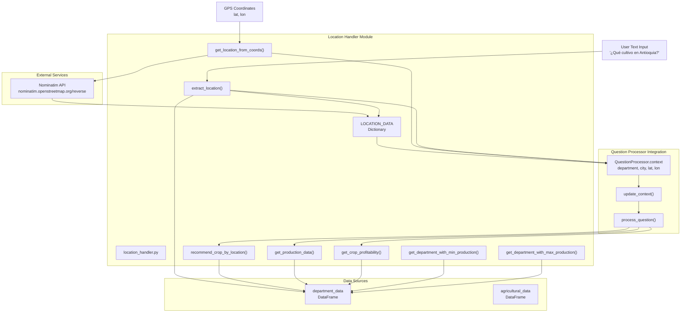
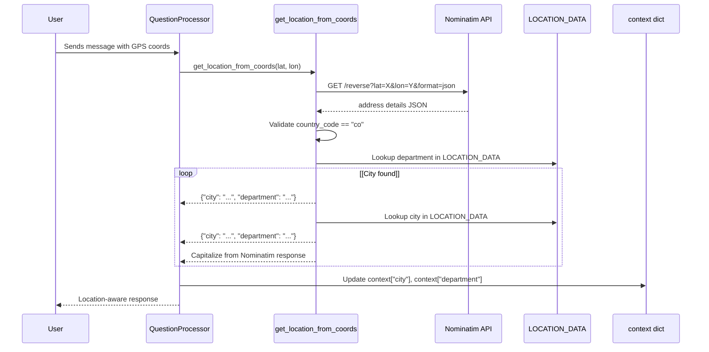
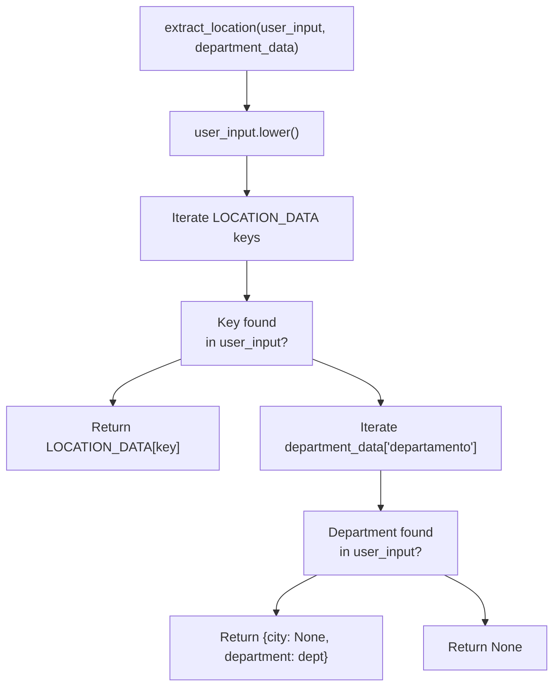
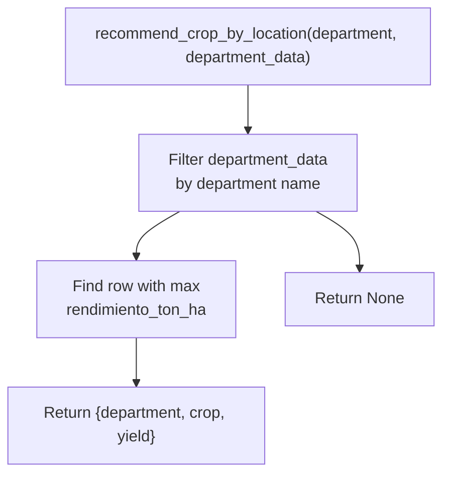
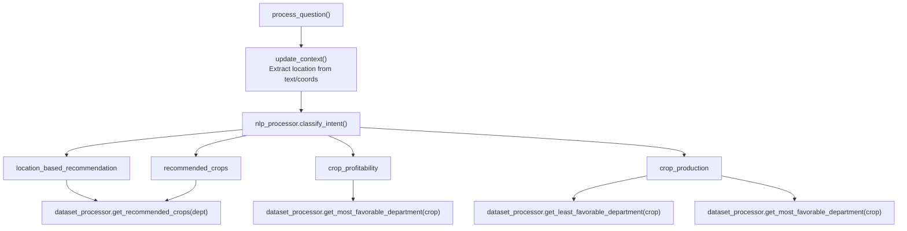

# Servicios de ubicación

> **Archivos fuente relevantes**
> * [aplicación/__init__.py](https://github.com/axchisan/ProyectoAgroBot/blob/bc782fcf/app/__init__.py)
> * [aplicación/chatbot/location_handler.py](https://github.com/axchisan/ProyectoAgroBot/blob/bc782fcf/app/chatbot/location_handler.py)
> * [aplicación/chatbot/procesador_de_preguntas.py](https://github.com/axchisan/ProyectoAgroBot/blob/bc782fcf/app/chatbot/question_processor.py)

## Propósito y alcance

El subsistema de Servicios de Ubicación gestiona todas las operaciones de contexto geográfico en Agrobot, lo que permite al chatbot ofrecer recomendaciones agrícolas específicas para la ubicación de los agricultores colombianos. Esto incluye la extracción de información de ubicación del texto ingresado por el usuario, la conversión de coordenadas GPS a ubicaciones legibles mediante geocodificación, el mantenimiento del contexto de ubicación durante las conversaciones y la consulta de conjuntos de datos agrícolas filtrados por regiones geográficas (departamentos y municipios).

Para obtener información sobre cómo se procesan y enrutan las consultas basadas en la ubicación a través del sistema de clasificación de intenciones, consulte [Clasificación de intenciones](/axchisan/ProyectoAgroBot/4.3-intent-classification) . Para obtener más información sobre los conjuntos de datos agrícolas consultados por ubicación, consulte [Procesamiento de conjuntos de datos](/axchisan/ProyectoAgroBot/5.3-dataset-processing) .

**Fuentes:** [location_handler.py L1-L270](https://github.com/axchisan/ProyectoAgroBot/blob/bc782fcf/app/chatbot/location_handler.py#L1-L270)

 [question_processor.py L1-L344](https://github.com/axchisan/ProyectoAgroBot/blob/bc782fcf/app/chatbot/question_processor.py#L1-L344)

---

## Descripción general de la arquitectura

### Diagrama de componentes de servicios de ubicación



**Fuentes:** [location_handler.py L1-L270](https://github.com/axchisan/ProyectoAgroBot/blob/bc782fcf/app/chatbot/location_handler.py#L1-L270)

 [question_processor.py L8-L9](https://github.com/axchisan/ProyectoAgroBot/blob/bc782fcf/app/chatbot/question_processor.py#L8-L9)

 [question_processor.py L28-L34](https://github.com/axchisan/ProyectoAgroBot/blob/bc782fcf/app/chatbot/question_processor.py#L28-L34)

 [question_processor.py L77-L94](https://github.com/axchisan/ProyectoAgroBot/blob/bc782fcf/app/chatbot/question_processor.py#L77-L94)

---

## Gestión de datos de ubicación

### Diccionario de ubicaciones predefinidas

El `LOCATION_DATA`diccionario `location_handler.py`sirve como un mapeo estático de ciudades y departamentos colombianos, proporcionando una búsqueda rápida de ubicaciones comunes sin requerir llamadas a API externas.

| Clave de ubicación | Ciudad | Departamento |
| --- | --- | --- |
| Bogotá | Bogotá | Cundinamarca |
| Medellín | Medellín | Antioquia |
| California | Cali | Valle del Cauca |
| Barranquilla | Barranquilla | Atlántico |
| Cartagena | Cartagena | Bolívar |
| Pereira | Pereira | Risaralda |
| Bucaramanga | Bucaramanga | Santander |
| Manizales | Manizales | Caldas |
| cúcuta | Cúcuta | Norte de Santander |

El diccionario también incluye entradas a nivel de departamento (por ejemplo, "antioquia", "cundinamarca") que corresponden a sus ciudades capitales como valores predeterminados.

**Estructura de datos:**

```
LOCATION_DATA = {
    "location_key": {"city": "City Name", "department": "Department Name"}
}
```

**Fuentes:** [location_handler.py L6-L26](https://github.com/axchisan/ProyectoAgroBot/blob/bc782fcf/app/chatbot/location_handler.py#L6-L26)

---

## Servicio de geocodificación

### Integración de API de Nominatim

La `get_location_from_coords()`función proporciona geocodificación inversa al convertir las coordenadas GPS en información de ubicación legible para humanos utilizando la API Nominatim de OpenStreetMap.



**Firma de la función:**

* **Aporte:** `lat: float, lon: float`
* **Salida:** `Optional[Dict]` con teclas `"city"`y`"department"`
* **Devoluciones:** `None` si falla la geocodificación o la ubicación está fuera de Colombia

**Punto final de API:** `https://nominatim.openstreetmap.org/reverse`

**Parámetros de la solicitud:**

* `lat`:Coordenada de latitud
* `lon`: Coordenada de longitud
* `format`:Establecer en`"json"`
* `addressdetails`:Establecer `1`para componentes de dirección detallados

**Encabezados obligatorios:**

* `User-Agent`: "Agrobot/1.0 ( [contacto@agrobot.com](mailto:contacto@agrobot.com) )" (requerido por la política de uso de Nominatim)

**Validación de ubicación:** 
La función valida que las coordenadas estén dentro de Colombia marcando `address["country_code"] == "co"`. Si la ubicación está fuera de Colombia, la función devuelve `None`.

**Estrategia de respaldo:**

1. Primeros intentos de hacer coincidir el departamento con la respuesta de Nominatim`LOCATION_DATA`
2. Si no hay coincidencia de departamento, intenta hacer coincidir la ciudad con`LOCATION_DATA`
3. Si no se encuentran coincidencias, se escribe en mayúsculas y se devuelve la respuesta de Nominatim sin procesar.
4. Devoluciones `None`si no se puede determinar la ciudad y el departamento

**Fuentes:** [location_handler.py L29-L107](https://github.com/axchisan/ProyectoAgroBot/blob/bc782fcf/app/chatbot/location_handler.py#L29-L107)

---

## Extracción de ubicación y contexto

### Extracción de ubicación basada en texto

The `extract_location()` function parses user text input to identify mentioned cities or departments using pattern matching against the `LOCATION_DATA` dictionary and the `department_data` DataFrame.

**Function Flow:**



**Examples:**

* Input: "¿Qué cultivo sembrar en **Antioquia**?" * Output: `{"city": "Medellín", "department": "Antioquia"}`
* Input: "¿Cómo está el clima en **Manizales**?" * Output: `{"city": "Manizales", "department": "Caldas"}`
* Input: "Vivo en **Valle del Cauca**" * Output: `{"city": "Cali", "department": "Valle del Cauca"}`

**Sources:** [app/chatbot/location_handler.py L110-L131](https://github.com/axchisan/ProyectoAgroBot/blob/bc782fcf/app/chatbot/location_handler.py#L110-L131)

### Context Management in QuestionProcessor

The `QuestionProcessor` class maintains a persistent `context` dictionary throughout the conversation to track the user's current location and previously mentioned crops.

**Context Structure:**

```css
self.context = {
    "department": None,    # Current department
    "city": None,          # Current city
    "last_crop": None,     # Last mentioned crop
    "lat": None,           # GPS latitude
    "lon": None            # GPS longitude
}
```

**Context Update Mechanism:**

The `update_context()` method is called at the beginning of each `process_question()` invocation to refresh location information from coordinates or text.

**Update Priority:**

1. **GPS Coordinates** (if provided): Calls `get_location_from_coords()` and updates `city`, `department`, `lat`, `lon`
2. **Text Extraction**: Calls `extract_location()` on user input and updates `city` and/or `department` if found

**Usage in Query Processing:**

```markdown
# From question_processor.py:138-140
target_dept = self.context["department"] if self.context["department"] else department
target_city = self.context["city"] if self.context["city"] else city
```

The chatbot uses `target_dept` and `target_city` throughout processing to provide location-specific recommendations, falling back to default values (Bogotá, Cundinamarca) if no location is identified.

**Sources:** [app/chatbot/question_processor.py L28-L34](https://github.com/axchisan/ProyectoAgroBot/blob/bc782fcf/app/chatbot/question_processor.py#L28-L34)

 [app/chatbot/question_processor.py L77-L94](https://github.com/axchisan/ProyectoAgroBot/blob/bc782fcf/app/chatbot/question_processor.py#L77-L94)

 [app/chatbot/question_processor.py L138-L140](https://github.com/axchisan/ProyectoAgroBot/blob/bc782fcf/app/chatbot/question_processor.py#L138-L140)

---

## Location-Based Agricultural Services

### Crop Recommendation by Location

The `recommend_crop_by_location()` function identifies the most profitable crop for a specific department based on yield data.

**Function Logic:**



**Return Value:**

```css
{
    "department": "Antioquia",
    "crop": "Café",
    "yield": 2.5  # ton/ha
}
```

**Sources:** [app/chatbot/location_handler.py L134-L158](https://github.com/axchisan/ProyectoAgroBot/blob/bc782fcf/app/chatbot/location_handler.py#L134-L158)

### Production Data Queries

The `get_production_data()` function retrieves production statistics for a specific crop in a given department.

**Query Parameters:**

* `crop`: Crop name (e.g., "maíz", "café")
* `department`: Department name (e.g., "Antioquia")
* `department_data`: DataFrame containing agricultural data

**Filter Criteria:**

```
data = department_data[
    (department_data["cultivo_destacado"].str.lower() == crop.lower()) &
    (department_data["departamento"].str.lower() == department.lower())
]
```

**Return Value:**

```css
{
    "crop": "Maíz",
    "department": "Antioquia",
    "production": 15000  # in tons
}
```

**Sources:** [app/chatbot/location_handler.py L161-L190](https://github.com/axchisan/ProyectoAgroBot/blob/bc782fcf/app/chatbot/location_handler.py#L161-L190)

### Crop Profitability Analysis

The `get_crop_profitability()` function determines the most profitable department for growing a specific crop by finding the location with the highest yield.

**Algorithm:**

1. Filter `department_data` for rows matching the specified crop
2. Identify row with maximum `rendimiento_ton_ha` (yield in tons per hectare)
3. Return department, crop name, and yield value

**Return Value:**

```css
{
    "crop": "Café",
    "department": "Quindío",
    "yield": 3.2  # ton/ha
}
```

**Sources:** [app/chatbot/location_handler.py L193-L215](https://github.com/axchisan/ProyectoAgroBot/blob/bc782fcf/app/chatbot/location_handler.py#L193-L215)

### Production Extremes Analysis

Two complementary functions identify departments with minimum and maximum production for a given crop:

#### Minimum Production

`get_department_with_min_production(crop, department_data)` finds the department with the lowest production output.

#### Maximum Production

`get_department_with_max_production(crop, department_data)` finds the department with the highest production output.

**Common Logic:**

```markdown
data = department_data[
    department_data["cultivo_destacado"].str.lower() == crop.lower()
]
# For min: data.loc[data["produccion_ton"].idxmin()]
# For max: data.loc[data["produccion_ton"].idxmax()]
```

**Return Format:**

```css
{
    "crop": "Arroz",
    "department": "Tolima",
    "production": 250000  # in tons
}
```

**Sources:** [app/chatbot/location_handler.py L218-L269](https://github.com/axchisan/ProyectoAgroBot/blob/bc782fcf/app/chatbot/location_handler.py#L218-L269)

---

## Integration with Question Processing

### Location-Aware Intent Handling

The `QuestionProcessor` uses location services to handle multiple intent types that require geographic context:



### Intent Type Mappings

| Intent Type | Location Service Usage | Example Query |
| --- | --- | --- |
| `location_based_recommendation` | Uses `context["department"]` to query `DatasetProcessor.get_recommended_crops()` | "¿Qué sembrar en Antioquia?" |
| `crop_profitability` | Calls `DatasetProcessor.get_most_favorable_department()` for the extracted crop | "¿Dónde es más rentable el café?" |
| `crop_production` | Uses `DatasetProcessor.get_least_favorable_department()` or `get_most_favorable_department()` based on keywords "menos"/"más" | "¿Qué departamento produce más maíz?" |
| `recommended_crops` | Uses `context["department"]` for location filtering | "Cultivos recomendados" (with location context) |
| `production_query` | Combines crop, year, and location extraction for precise queries | "Producción de arroz en Tolima en 2020" |

**Sources:** [app/chatbot/question_processor.py L142-L343](https://github.com/axchisan/ProyectoAgroBot/blob/bc782fcf/app/chatbot/question_processor.py#L142-L343)

### Dynamic Question Handling with Location

Several dynamic question types in `questions.json` utilize location services:

#### Weather Queries

Location context determines which city to query for weather data:

```markdown
# Lines 158-174
if self.context["lat"] is not None and self.context["lon"] is not None:
    weather_data = get_weather_by_coords(self.context["lat"], self.context["lon"], ...)
elif target_city:
    weather_data = get_weather(target_city, ...)
```

#### Current Location Query

Responds with stored context information:

```markdown
# Lines 177-183
if self.context["city"] or self.context["department"]:
    return q["answer_template"].format(
        city=self.context["city"] or "una ciudad desconocida",
        department=self.context["department"] or "un departamento desconocido"
    )
```

#### Location-Based Recommendations

Queries the dataset processor with the current department context:

```css
# Lines 241-247
recommendations = self.dataset_processor.get_recommended_crops(target_dept)
if recommendations:
    response = f"En {target_dept.capitalize()}, te recomiendo los siguientes cultivos:\n"
    for rec in recommendations:
        response += f"- {rec['crop']} con un rendimiento de {rec['yield']} ton/ha\n"
```

**Sources:** [app/chatbot/question_processor.py L157-L247](https://github.com/axchisan/ProyectoAgroBot/blob/bc782fcf/app/chatbot/question_processor.py#L157-L247)

---

## Location Service Call Flow

### End-to-End Location Processing

```mermaid
sequenceDiagram
  participant User
  participant Flask Route /chat
  participant QuestionProcessor
  participant update_context()
  participant extract_location()
  participant get_location_from_coords()
  participant Nominatim API
  participant LOCATION_DATA
  participant DatasetProcessor

  User->>Flask Route /chat: POST /chat with text + coords
  Flask Route /chat->>QuestionProcessor: process_question(input, city, dept, lat, lon)
  QuestionProcessor->>update_context(): update_context(input, lat, lon)
  loop [Coordinates provided]
    update_context()->>get_location_from_coords(): get_location_from_coords(lat, lon)
    get_location_from_coords()->>Nominatim API: Reverse geocode request
    Nominatim API-->>get_location_from_coords(): Address details
    get_location_from_coords()->>LOCATION_DATA: Lookup department/city
    LOCATION_DATA-->>get_location_from_coords(): Matched location
    get_location_from_coords()-->>update_context(): {"city": "...", "department": "..."}
    update_context()->>QuestionProcessor: Update context["city"], context["department"]
    update_context()->>extract_location(): extract_location(input, department_data)
    extract_location()->>LOCATION_DATA: Search for locations in text
    LOCATION_DATA-->>extract_location(): Matched location
    extract_location()-->>update_context(): {"city": "...", "department": "..."}
    update_context()->>QuestionProcessor: Update context (if not already set)
    QuestionProcessor->>QuestionProcessor: Classify intent
    QuestionProcessor->>DatasetProcessor: get_recommended_crops(context["department"])
    DatasetProcessor-->>QuestionProcessor: List of crops with yields
    QuestionProcessor->>QuestionProcessor: Format response
  end
  QuestionProcessor-->>Flask Route /chat: Response text
  Flask Route /chat-->>User: Display recommendation
```

**Sources:** [app/chatbot/question_processor.py L132-L343](https://github.com/axchisan/ProyectoAgroBot/blob/bc782fcf/app/chatbot/question_processor.py#L132-L343)

 [app/chatbot/location_handler.py L29-L131](https://github.com/axchisan/ProyectoAgroBot/blob/bc782fcf/app/chatbot/location_handler.py#L29-L131)

---

## Error Handling and Fallback Strategies

### Nominatim API Error Handling

The `get_location_from_coords()` function implements comprehensive error handling for external API failures:

| Error Type | Exception | Handling Strategy |
| --- | --- | --- |
| Network failure | `requests.RequestException` | Log error, return `None` |
| HTTP error (4xx, 5xx) | `response.raise_for_status()` | Log error, return `None` |
| Invalid country | `country_code != "co"` | Log warning, return `None` |
| Missing address data | KeyError on address components | Attempt alternate lookups, return what's available |

**Error Logging:**

```python
# Lines 53-64, 105-107
print(f"Nominatim response: lat={lat}, lon={lon}, city={city}, ...")
print("Ubicación fuera de Colombia, country_code:", address.get("country_code"))
except requests.RequestException as e:
    print(f"Error al consultar Nominatim: {e}")
```

**Sources:** [app/chatbot/location_handler.py L45-L107](https://github.com/axchisan/ProyectoAgroBot/blob/bc782fcf/app/chatbot/location_handler.py#L45-L107)

### Location Context Fallback

When location cannot be determined, the system uses cascading fallback values:

1. **Primary:** `context["department"]` or `context["city"]` from previous messages
2. **Secondary:** Function parameters `department` and `city` (defaults: "Cundinamarca", "Bogotá")
3. **Tertiary:** Prompt user to provide location explicitly

**Fallback Implementation:**

```markdown
# Lines 138-140
target_dept = self.context["department"] if self.context["department"] else department
target_city = self.context["city"] if self.context["city"] else city
```

**User Prompts for Missing Location:**

```markdown
# Lines 174, 183, 205, 231
return "No sé tu ubicación exacta. Dime tu ciudad o permite el acceso a tu ubicación."
return "No sé tu ubicación. Permite el acceso a tu ubicación o dime dónde estás."
```

**Sources:** [app/chatbot/question_processor.py L138-L140](https://github.com/axchisan/ProyectoAgroBot/blob/bc782fcf/app/chatbot/question_processor.py#L138-L140)

 [app/chatbot/question_processor.py L174-L231](https://github.com/axchisan/ProyectoAgroBot/blob/bc782fcf/app/chatbot/question_processor.py#L174-L231)

---

## Data Requirements

### Required DataFrame Schemas

The location services require properly structured DataFrames with specific column names:

#### department_data DataFrame

| Column Name | Data Type | Description |
| --- | --- | --- |
| `departamento` | string | Department name (e.g., "Antioquia") |
| `cultivo_destacado` | string | Primary crop for the department |
| `rendimiento_ton_ha` | float | Crop yield in tons per hectare |
| `produccion_ton` | float (optional) | Total production in tons |

#### agricultural_data DataFrame

Used by `QuestionProcessor` for crop timing queries:

| Column Name | Data Type | Description |
| --- | --- | --- |
| `cultivo` | string | Crop name |
| `mes_siembra` | string | Planting month |

**Sources:** [app/chatbot/location_handler.py L111-L269](https://github.com/axchisan/ProyectoAgroBot/blob/bc782fcf/app/chatbot/location_handler.py#L111-L269)

 [app/chatbot/question_processor.py L13-L16](https://github.com/axchisan/ProyectoAgroBot/blob/bc782fcf/app/chatbot/question_processor.py#L13-L16)

---

## Configuration and Initialization

### Location Services Setup

Location services are initialized as part of the chatbot initialization process:

**Initialization Flow:**

1. `data_loader.load_questions()` provides `questions_data` dictionary
2. `data_loader.load_departments()` loads `department_data` DataFrame
3. `QuestionProcessor.__init__()` receives these as constructor parameters
4. Location handler functions are imported as module-level functions (no class instantiation required)

**Import Statement:**

```javascript
# From question_processor.py:8
from .location_handler import (
    extract_location, 
    recommend_crop_by_location, 
    get_production_data, 
    get_crop_profitability, 
    get_department_with_min_production, 
    get_department_with_max_production, 
    get_location_from_coords
)
```

**No API Keys Required:**
The Nominatim API from OpenStreetMap is free and does not require authentication. The only requirement is providing a proper `User-Agent` header as per Nominatim's usage policy.

**Sources:** [app/chatbot/question_processor.py L8-L9](https://github.com/axchisan/ProyectoAgroBot/blob/bc782fcf/app/chatbot/question_processor.py#L8-L9)

 [app/chatbot/question_processor.py L13-L17](https://github.com/axchisan/ProyectoAgroBot/blob/bc782fcf/app/chatbot/question_processor.py#L13-L17)