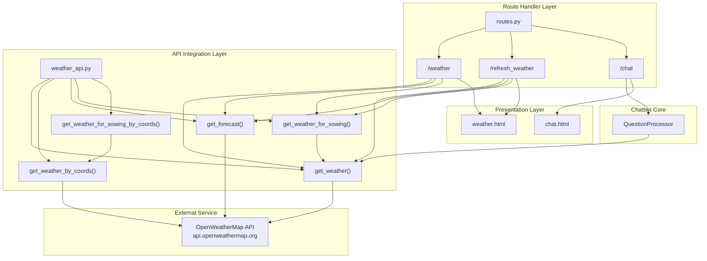
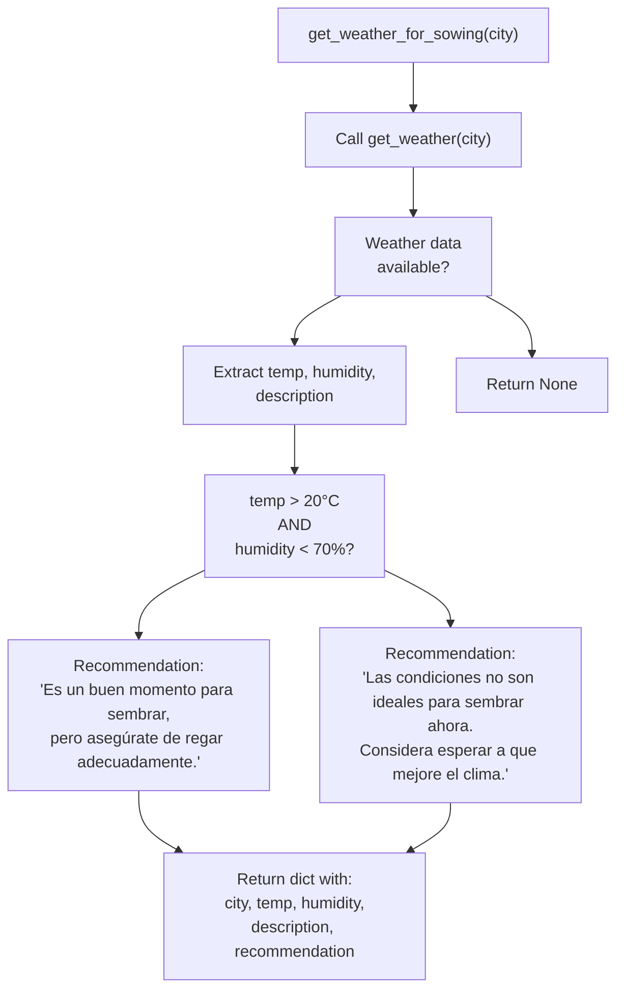
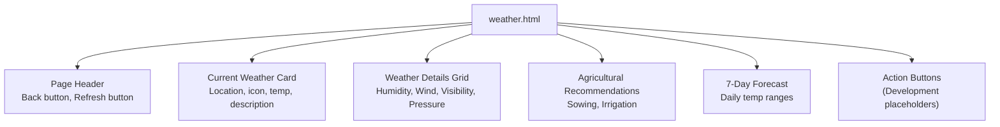
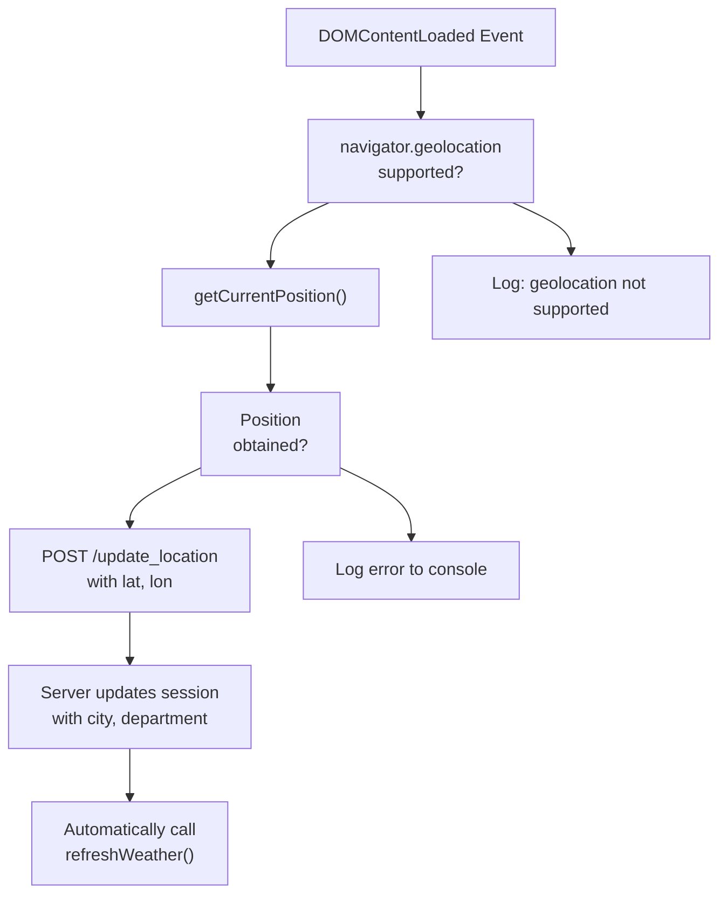

# Servicios meteorológicos

> **Archivos fuente relevantes**
> * [aplicación/chatbot/weather_api.py](https://github.com/axchisan/ProyectoAgroBot/blob/bc782fcf/app/chatbot/weather_api.py)
> * [aplicación/rutas/rutas.py](https://github.com/axchisan/ProyectoAgroBot/blob/bc782fcf/app/routes/routes.py)
> * [aplicación/plantillas/clima.html](https://github.com/axchisan/ProyectoAgroBot/blob/bc782fcf/app/templates/weather.html)

## Propósito y alcance

Este documento explica la integración de Agrobot con la API de OpenWeatherMap para proporcionar información meteorológica en tiempo real y recomendaciones agrícolas a los agricultores colombianos. El módulo de servicios meteorológicos recupera las condiciones meteorológicas actuales, pronósticos para los próximos 5 días y genera recomendaciones agrícolas contextualizadas para la toma de decisiones de siembra y riego.

Para obtener información sobre los servicios basados ​​en la ubicación y la geocodificación, consulte [Servicios de ubicación](/axchisan/ProyectoAgroBot/6.2-location-services) . Para la integración de chatbots con consultas meteorológicas, consulte [Procesamiento de preguntas](/axchisan/ProyectoAgroBot/4.2-question-processing) .

**Fuentes:** [weather_api.py L1-L193](https://github.com/axchisan/ProyectoAgroBot/blob/bc782fcf/app/chatbot/weather_api.py#L1-L193)

 [routes.py L1-L191](https://github.com/axchisan/ProyectoAgroBot/blob/bc782fcf/app/routes/routes.py#L1-L191)

---

## Descripción general de la arquitectura

El sistema de servicios meteorológicos consta de tres capas principales: la capa de integración de API, la capa de gestión de rutas y la capa de presentación. El siguiente diagrama ilustra cómo interactúan estos componentes:



**Fuentes:** [weather_api.py L1-L193](https://github.com/axchisan/ProyectoAgroBot/blob/bc782fcf/app/chatbot/weather_api.py#L1-L193)

 [routes.py L56-L152](https://github.com/axchisan/ProyectoAgroBot/blob/bc782fcf/app/routes/routes.py#L56-L152)

---

## Integración de la API de OpenWeatherMap

El `weather_api.py`módulo proporciona funciones de Python que encapsulan los puntos finales de la API de OpenWeatherMap. Todas las funciones admiten tanto la transferencia explícita de claves API como la recuperación automática de la `OPENWEATHER_API_KEY`variable de entorno.

### Puntos finales de API

El módulo interactúa con dos puntos finales principales de OpenWeatherMap:

| Punto final | Objetivo | Usado por |
| --- | --- | --- |
| `http://api.openweathermap.org/data/2.5/weather` | Datos meteorológicos actuales | `get_weather()`,`get_weather_by_coords()` |
| `http://api.openweathermap.org/data/2.5/forecast` | Pronóstico de 5 días (intervalos de 3 horas) | `get_forecast()` |

**Fuentes:** [weather_api.py L6-L7](https://github.com/axchisan/ProyectoAgroBot/blob/bc782fcf/app/chatbot/weather_api.py#L6-L7)

### Funciones meteorológicas básicas

#### obtener_tiempo()

Recupera las condiciones meteorológicas actuales para un nombre de ciudad específico.

**Firma de la función:** [weather_api.py L9-L37](https://github.com/axchisan/ProyectoAgroBot/blob/bc782fcf/app/chatbot/weather_api.py#L9-L37)

**Parámetros:**

* `city`(str): Nombre de la ciudad
* `api_key`(str, opcional): clave API de OpenWeatherMap

**Parámetros de la solicitud:**

* `q`: Nombre de la ciudad
* `appid`: Clave API
* `units`: "métrico" (Celsius)
* `lang`: "es" (español)

**Devuelve:** Diccionario que contiene datos meteorológicos o `None`en caso de fallo

**Fuentes:** [weather_api.py L9-L37](https://github.com/axchisan/ProyectoAgroBot/blob/bc782fcf/app/chatbot/weather_api.py#L9-L37)

#### obtener_el_clima_por_coords()

Recupera el clima actual utilizando coordenadas geográficas.

**Firma de la función:** [weather_api.py L39-L69](https://github.com/axchisan/ProyectoAgroBot/blob/bc782fcf/app/chatbot/weather_api.py#L39-L69)

**Parámetros:**

* `lat`(flotante): Latitud
* `lon`(flotante): Longitud
* `api_key`(str, opcional): clave API de OpenWeatherMap

**Parámetros de la solicitud:**

* `lat`:Coordenada de latitud
* `lon`: Coordenada de longitud
* `appid`: Clave API
* `units`: "métrico"
* `lang`: "es"

**Fuentes:** [weather_api.py L39-L69](https://github.com/axchisan/ProyectoAgroBot/blob/bc782fcf/app/chatbot/weather_api.py#L39-L69)

#### obtener_pronóstico()

Recupera un pronóstico meteorológico de 5 días y lo procesa en agregados diarios.

**Firma de la función:** [weather_api.py L71-L132](https://github.com/axchisan/ProyectoAgroBot/blob/bc782fcf/app/chatbot/weather_api.py#L71-L132)

**Lógica de procesamiento:**

1. Obtiene datos de pronóstico (intervalos de 3 horas)
2. Agrupa entradas por fecha usando`datetime.fromtimestamp(entry["dt"]).date()`
3. Calcula diariamente `temp_max`y `temp_min`a partir de todos los intervalos.
4. Devuelve una lista de 5 diccionarios de pronóstico diario

**Devuelve:** Lista de diccionarios con claves:

* `temp_max`:Temperatura máxima del día
* `temp_min`:Temperatura mínima del día
* `description`: Descripción de las condiciones meteorológicas
* `icon`: Código del icono del tiempo
* `date`:Objeto de fecha

**Fuentes:** [weather_api.py L71-L132](https://github.com/axchisan/ProyectoAgroBot/blob/bc782fcf/app/chatbot/weather_api.py#L71-L132)

---

## Funciones de recomendación agrícola

Dos funciones especializadas generan asesoramiento agrícola en función de las condiciones climáticas.

### obtener_clima_para_sembrar()

Analiza el clima actual para brindar recomendaciones de siembra.

**Firma de la función:** [weather_api.py L134-L162](https://github.com/axchisan/ProyectoAgroBot/blob/bc782fcf/app/chatbot/weather_api.py#L134-L162)

**Lógica:**



**Criterios de recomendación:**

* **Favorable:** Temperatura > 20°C Y humedad < 70%
* **Desfavorable:** De lo contrario

**Fuentes:** [weather_api.py L134-L162](https://github.com/axchisan/ProyectoAgroBot/blob/bc782fcf/app/chatbot/weather_api.py#L134-L162)

### obtener_el_clima_para_la_siembra_por_coords()

Lógica idéntica a `get_weather_for_sowing()`pero utiliza coordenadas geográficas en lugar del nombre de la ciudad.

**Firma de la función:** [weather_api.py L164-L193](https://github.com/axchisan/ProyectoAgroBot/blob/bc782fcf/app/chatbot/weather_api.py#L164-L193)

**Fuentes:** [weather_api.py L164-L193](https://github.com/axchisan/ProyectoAgroBot/blob/bc782fcf/app/chatbot/weather_api.py#L164-L193)

---

## Manipuladores de rutas

La aplicación Flask proporciona tres rutas para la funcionalidad relacionada con el clima.

### /weather Route

Renders the main weather page with current conditions, forecast, and agricultural recommendations.

**Route Definition:** [app/routes/routes.py L56-L103](https://github.com/axchisan/ProyectoAgroBot/blob/bc782fcf/app/routes/routes.py#L56-L103)

**Flow Diagram:**

```mermaid
sequenceDiagram
  participant User
  participant Browser
  participant /weather route
  participant Session
  participant weather_api.py
  participant OpenWeatherMap
  participant weather.html

  User->>Browser: Navigate to /weather
  Browser->>/weather route: GET /weather
  /weather route->>Session: Get city, department
  note over /weather route,Session: Default: 'Guavatá', 'Santander'
  /weather route->>weather_api.py: get_weather(city, api_key)
  weather_api.py->>OpenWeatherMap: Request current weather
  OpenWeatherMap-->>weather_api.py: Weather data
  weather_api.py-->>/weather route: Return weather dict
  /weather route->>weather_api.py: get_weather_for_sowing(city, api_key)
  weather_api.py-->>/weather route: Return sowing recommendation
  /weather route->>weather_api.py: get_forecast(city, api_key)
  weather_api.py->>OpenWeatherMap: Request 5-day forecast
  OpenWeatherMap-->>weather_api.py: Forecast data
  weather_api.py-->>/weather route: Return daily forecast list
  /weather route->>/weather route: Build weather_info dict
  /weather route->>/weather route: Process forecast_data
  /weather route->>weather.html: Render with weather_info, forecast_list
  weather.html-->>Browser: HTML response
  Browser-->>User: Display weather page
```

**Data Processing:** [app/routes/routes.py L66-L96](https://github.com/axchisan/ProyectoAgroBot/blob/bc782fcf/app/routes/routes.py#L66-L96)

The route constructs a `weather_info` dictionary containing:

| Field | Source | Processing |
| --- | --- | --- |
| `city` | Session | Direct from session |
| `department` | Session | Direct from session |
| `temperature` | `weather_data["main"]["temp"]` | Rounded to integer |
| `feels_like` | `weather_data["main"]["feels_like"]` | Rounded to integer |
| `humidity` | `weather_data["main"]["humidity"]` | Direct value |
| `description` | `weather_data["weather"][0]["description"]` | Capitalized |
| `wind_speed` | `weather_data["wind"]["speed"]` | Converted from m/s to km/h: `speed * 3.6` |
| `visibility` | `weather_data.get("visibility", 10000)` | Converted from meters to km: `/ 1000` |
| `pressure` | `weather_data["main"]["pressure"]` | Direct value in hPa |
| `icon_code` | `weather_data["weather"][0]["icon"]` | Direct value |
| `sowing_recommendation` | `sowing_data["recommendation"]` | From `get_weather_for_sowing()` |
| `irrigation_recommendation` | Derived from humidity | Logic below |

**Irrigation Recommendation Logic:** [app/routes/routes.py L79-L83](https://github.com/axchisan/ProyectoAgroBot/blob/bc782fcf/app/routes/routes.py#L79-L83)

* If humidity > 70%: "Evita regar en exceso, ya que la humedad es alta."
* Otherwise: "Riega tus cultivos, ya que la humedad es baja."

**Forecast Processing:** [app/routes/routes.py L86-L100](https://github.com/axchisan/ProyectoAgroBot/blob/bc782fcf/app/routes/routes.py#L86-L100)

The route creates a 7-day forecast by:

1. Processing the 5-day forecast from OpenWeatherMap
2. Mapping indices to day names (circular array)
3. Filling missing days by repeating the last forecast

**Sources:** [app/routes/routes.py L56-L103](https://github.com/axchisan/ProyectoAgroBot/blob/bc782fcf/app/routes/routes.py#L56-L103)

### /refresh_weather Route

AJAX endpoint that returns weather data as JSON for dynamic page updates without full reload.

**Route Definition:** [app/routes/routes.py L105-L152](https://github.com/axchisan/ProyectoAgroBot/blob/bc782fcf/app/routes/routes.py#L105-L152)

**Response Structure:**

```json
{
  "success": true,
  "weather": {
    "city": "string",
    "department": "string",
    "temperature": "number",
    "feels_like": "number",
    "humidity": "number",
    "description": "string",
    "wind_speed": "number",
    "visibility": "number",
    "pressure": "number",
    "icon_code": "string",
    "sowing_recommendation": "string",
    "irrigation_recommendation": "string"
  },
  "forecast": [
    {
      "day": "string",
      "temp_max": "number",
      "temp_min": "number",
      "description": "string",
      "icon_code": "string"
    }
  ]
}
```

The processing logic is identical to the `/weather` route but returns JSON instead of rendering HTML.

**Sources:** [app/routes/routes.py L105-L152](https://github.com/axchisan/ProyectoAgroBot/blob/bc782fcf/app/routes/routes.py#L105-L152)

### Chat Integration

The `/chat` route integrates weather data through the `QuestionProcessor`. When users ask weather-related questions, the processor calls weather API functions.

**Route Definition:** [app/routes/routes.py L17-L45](https://github.com/axchisan/ProyectoAgroBot/blob/bc782fcf/app/routes/routes.py#L17-L45)

**Weather Query Flow:**

1. User submits question via `/chat` POST
2. `processor.process_question()` is called with user input and location context
3. Question processor classifies intent (see [Intent Classification](/axchisan/ProyectoAgroBot/4.3-intent-classification))
4. If intent is "weather", processor internally calls weather API functions
5. Response includes formatted weather information

**Sources:** [app/routes/routes.py L17-L45](https://github.com/axchisan/ProyectoAgroBot/blob/bc782fcf/app/routes/routes.py#L17-L45)

 [app/routes/routes.py L31](https://github.com/axchisan/ProyectoAgroBot/blob/bc782fcf/app/routes/routes.py#L31-L31)

---

## Weather Page Frontend

The `weather.html` template provides a responsive interface for displaying weather information and agricultural recommendations.

### Page Structure



**Sources:** [app/templates/weather.html L1-L282](https://github.com/axchisan/ProyectoAgroBot/blob/bc782fcf/app/templates/weather.html#L1-L282)

### Dynamic Weather Refresh

JavaScript function `refreshWeather()` enables asynchronous weather updates:

**Function Location:** [app/templates/weather.html L168-L243](https://github.com/axchisan/ProyectoAgroBot/blob/bc782fcf/app/templates/weather.html#L168-L243)

**Refresh Flow:**

```mermaid
sequenceDiagram
  participant User
  participant Browser
  participant Refresh Button
  participant Fetch API
  participant /refresh_weather
  participant DOM Elements

  User->>Refresh Button: Click refresh
  Refresh Button->>Refresh Button: Start spin animation
  Refresh Button->>Fetch API: fetch('/refresh_weather')
  Fetch API->>/refresh_weather: GET request
  /refresh_weather->>/refresh_weather: Get weather data
  /refresh_weather-->>Fetch API: JSON response
  Fetch API->>Refresh Button: Stop animation
  Fetch API->>DOM Elements: Update temperature
  Fetch API->>DOM Elements: Update humidity
  Fetch API->>DOM Elements: Update wind speed
  Fetch API->>DOM Elements: Update visibility
  Fetch API->>DOM Elements: Update pressure
  Fetch API->>DOM Elements: Update weather icon
  Fetch API->>DOM Elements: Update recommendations
  Fetch API->>DOM Elements: Rebuild forecast list
  DOM Elements-->>Browser: Display updated data
  Browser-->>User: Show refreshed weather
```

**DOM Updates Performed:** [app/templates/weather.html L177-L234](https://github.com/axchisan/ProyectoAgroBot/blob/bc782fcf/app/templates/weather.html#L177-L234)

* Current weather metrics (temperature, humidity, wind, etc.)
* Weather icon based on `icon_code`
* Sowing recommendation with conditional styling (positive/warning)
* Irrigation recommendation with conditional icon (fa-tint/fa-tint-slash)
* Complete forecast list rebuild

**Sources:** [app/templates/weather.html L168-L243](https://github.com/axchisan/ProyectoAgroBot/blob/bc782fcf/app/templates/weather.html#L168-L243)

### Automatic Geolocation

The page attempts to obtain the user's location on load using the browser's Geolocation API:

**Implementation:** [app/templates/weather.html L246-L279](https://github.com/axchisan/ProyectoAgroBot/blob/bc782fcf/app/templates/weather.html#L246-L279)

**Geolocation Flow:**



**Sources:** [app/templates/weather.html L246-L279](https://github.com/axchisan/ProyectoAgroBot/blob/bc782fcf/app/templates/weather.html#L246-L279)

---

## Weather Data Structure

### OpenWeatherMap Response Format

The OpenWeatherMap API returns weather data in the following structure:

**Current Weather Response:**

| Field Path | Type | Description |
| --- | --- | --- |
| `main.temp` | float | Temperature in Celsius |
| `main.feels_like` | float | Perceived temperature |
| `main.humidity` | int | Humidity percentage |
| `main.pressure` | int | Atmospheric pressure in hPa |
| `weather[0].description` | string | Weather condition description |
| `weather[0].icon` | string | Icon code (e.g., "01d") |
| `wind.speed` | float | Wind speed in m/s |
| `visibility` | int | Visibility in meters |
| `name` | string | City name |

**Forecast Response:**

| Field Path | Type | Description |
| --- | --- | --- |
| `list` | array | Array of forecast entries (3-hour intervals) |
| `list[].dt` | int | Unix timestamp |
| `list[].main.temp` | float | Temperature |
| `list[].weather[0].description` | string | Condition description |
| `list[].weather[0].icon` | string | Icon code |

**Sources:** [app/chatbot/weather_api.py L32-L34](https://github.com/axchisan/ProyectoAgroBot/blob/bc782fcf/app/chatbot/weather_api.py#L32-L34)

 [app/chatbot/weather_api.py L94-L111](https://github.com/axchisan/ProyectoAgroBot/blob/bc782fcf/app/chatbot/weather_api.py#L94-L111)

### Processed Data Structure

La aplicación procesa respuestas de API sin procesar en diccionarios estructurados para la representación de plantillas:

**Diccionario de información meteorológica:**

```css
{
    "city": str,                        # Session-stored city name
    "department": str,                  # Session-stored department
    "temperature": int,                 # Rounded temp in °C
    "feels_like": int,                  # Rounded perceived temp
    "humidity": int,                    # Humidity %
    "description": str,                 # Capitalized description
    "wind_speed": float,                # Speed in km/h (converted)
    "visibility": float,                # Visibility in km (converted)
    "pressure": int,                    # Pressure in hPa
    "icon_code": str,                   # Icon identifier
    "sowing_recommendation": str,       # Agricultural advice
    "irrigation_recommendation": str    # Watering advice
}
```

**Diccionario de elementos de pronóstico:**

```css
{
    "day": str,                         # Day name (e.g., "Lunes")
    "temp_max": int,                    # Max temp (rounded)
    "temp_min": int,                    # Min temp (rounded)
    "description": str,                 # Capitalized description
    "icon_code": str                    # Icon identifier
}
```

**Fuentes:** [routes.py L67-L84](https://github.com/axchisan/ProyectoAgroBot/blob/bc782fcf/app/routes/routes.py#L67-L84)

 [routes.py L90-L96](https://github.com/axchisan/ProyectoAgroBot/blob/bc782fcf/app/routes/routes.py#L90-L96)

---

## Manejo de errores

Los servicios meteorológicos implementan un manejo defensivo de errores en múltiples niveles.

### Manejo de errores a nivel de API

**Manejo de excepciones de solicitud:** [weather_api.py L31-L36](https://github.com/axchisan/ProyectoAgroBot/blob/bc782fcf/app/chatbot/weather_api.py#L31-L36)

```python
try:
    response = requests.get(WEATHER_API_URL, params=params)
    response.raise_for_status()
    return response.json()
except requests.RequestException as e:
    print(f"Error al consultar la API de clima: {e}")
    return None
```

Todas las funciones de la API meteorológica regresan `None`en caso de falla, lo que permite que el código de llamada gestione los datos faltantes de manera elegante.

### Manejo de errores a nivel de ruta

**Validación de datos meteorológicos:** [routes.py L66-L103](https://github.com/axchisan/ProyectoAgroBot/blob/bc782fcf/app/routes/routes.py#L66-L103)

```css
if weather_data and weather_data.get('main') and sowing_data:
    # Process and render data
    return render_template('weather.html', weather_data=weather_info, ...)
return render_template('weather.html', weather_data={"error": "No se pudo obtener el clima para " + city})
```

La ruta comprueba la validez de los datos antes del procesamiento. Si falta algún dato necesario, se muestra un mensaje de error.

### Manejo de errores de frontend

**Manejo de errores AJAX:** [weather.html L239-L242](https://github.com/axchisan/ProyectoAgroBot/blob/bc782fcf/app/templates/weather.html#L239-L242)

```javascript
.catch(error => {
    refreshBtn.style.animation = '';
    alert('Error al actualizar el clima: ' + error);
});
```

**Manejo de errores de geolocalización:** [weather.html L272-L274](https://github.com/axchisan/ProyectoAgroBot/blob/bc782fcf/app/templates/weather.html#L272-L274)

```
function(error) {
    console.error('Error al obtener la geolocalización:', error.message);
}
```

**Fuentes:** [weather_api.py L31-L37](https://github.com/axchisan/ProyectoAgroBot/blob/bc782fcf/app/chatbot/weather_api.py#L31-L37)

 [routes.py L66-L103](https://github.com/axchisan/ProyectoAgroBot/blob/bc782fcf/app/routes/routes.py#L66-L103)

 [weather.html L239-L274](https://github.com/axchisan/ProyectoAgroBot/blob/bc782fcf/app/templates/weather.html#L239-L274)

---

## Configuración

Los servicios meteorológicos requieren que la clave API de OpenWeatherMap se configure como una variable de entorno.

### Variable de entorno

**Nombre de la variable:** `OPENWEATHERMAP_API_KEY`

**Ubicaciones de uso:**

* [routes.py L11](https://github.com/axchisan/ProyectoAgroBot/blob/bc782fcf/app/routes/routes.py#L11-L11) - Inicialización del chatbot
* [routes.py L61](https://github.com/axchisan/ProyectoAgroBot/blob/bc782fcf/app/routes/routes.py#L61-L61) - `/weather`ruta
* [routes.py L62](https://github.com/axchisan/ProyectoAgroBot/blob/bc782fcf/app/routes/routes.py#L62-L62) - Llamada de datos de siembra
* [routes.py L64](https://github.com/axchisan/ProyectoAgroBot/blob/bc782fcf/app/routes/routes.py#L64-L64) - Llamada de pronóstico
* [routes.py L110-L113](https://github.com/axchisan/ProyectoAgroBot/blob/bc782fcf/app/routes/routes.py#L110-L113) - `/refresh_weather`ruta

**Mecanismo de respaldo:** [weather_api.py L20](https://github.com/axchisan/ProyectoAgroBot/blob/bc782fcf/app/chatbot/weather_api.py#L20-L20)

```python
api_key = api_key or os.getenv("OPENWEATHER_API_KEY")
if not api_key:
    print("Error: No se proporcionó una clave API para OpenWeatherMap.")
    return None
```

Las funciones aceptan un `api_key`parámetro explícito pero, de forma predeterminada, utilizan la variable de entorno si no se proporciona.

**Fuentes:** [routes.py L11](https://github.com/axchisan/ProyectoAgroBot/blob/bc782fcf/app/routes/routes.py#L11-L11)

 [weather_api.py L20-L23](https://github.com/axchisan/ProyectoAgroBot/blob/bc782fcf/app/chatbot/weather_api.py#L20-L23)

---

## Puntos de integración

Los servicios meteorológicos se integran con múltiples componentes del sistema:

### Gestión de sesiones

Las rutas meteorológicas leen y escriben datos de ubicación en sesiones de Flask:

**Claves de sesión:**

* `city`- Nombre actual de la ciudad (predeterminado: "Guavatá")
* `department`- Nombre actual del departamento (predeterminado: "Santander")
* `lat`- Latitud del usuario (según geolocalización)
* `lon`- Longitud del usuario (según geolocalización)

**Fuentes:** [routes.py L26-L29](https://github.com/axchisan/ProyectoAgroBot/blob/bc782fcf/app/routes/routes.py#L26-L29)

 [routes.py L58-L59](https://github.com/axchisan/ProyectoAgroBot/blob/bc782fcf/app/routes/routes.py#L58-L59)

 [routes.py L160-L166](https://github.com/axchisan/ProyectoAgroBot/blob/bc782fcf/app/routes/routes.py#L160-L166)

### Procesador de preguntas de chatbot

La `QuestionProcessor`clase llama a funciones meteorológicas cuando maneja consultas relacionadas con el clima clasificadas por el modelo de intención NLP.

**Punto de integración:** [routes.py L31](https://github.com/axchisan/ProyectoAgroBot/blob/bc782fcf/app/routes/routes.py#L31-L31)

Para obtener detalles sobre la clasificación y el enrutamiento de intenciones, consulte [Clasificación de intenciones](/axchisan/ProyectoAgroBot/4.3-intent-classification) y [procesamiento de preguntas](/axchisan/ProyectoAgroBot/4.2-question-processing) .

**Fuentes:** [routes.py L24-L31](https://github.com/axchisan/ProyectoAgroBot/blob/bc782fcf/app/routes/routes.py#L24-L31)

### Controlador de ubicación

La `/update_location`ruta se integra con el controlador de ubicación para convertir las coordenadas en nombres de ciudades y departamentos:

**Flujo de actualización de ubicación:** [routes.py L154-L168](https://github.com/axchisan/ProyectoAgroBot/blob/bc782fcf/app/routes/routes.py#L154-L168)

```mermaid
sequenceDiagram
  participant Browser
  participant /update_location
  participant Session
  participant LocationHandler
  participant Nominatim

  Browser->>/update_location: POST with lat, lon
  /update_location->>Session: Store lat, lon
  /update_location->>LocationHandler: get_location_from_coords(lat, lon)
  LocationHandler->>Nominatim: Reverse geocode
  Nominatim-->>LocationHandler: Address data
  LocationHandler-->>/update_location: {city, department}
  /update_location->>Session: Update city, department
  /update_location-->>Browser: {"success": true}
```

Para obtener detalles sobre los servicios de ubicación, consulte [Servicios de ubicación](/axchisan/ProyectoAgroBot/6.2-location-services) .

**Fuentes:** [routes.py L154-L168](https://github.com/axchisan/ProyectoAgroBot/blob/bc782fcf/app/routes/routes.py#L154-L168)

 [routes.py L5](https://github.com/axchisan/ProyectoAgroBot/blob/bc782fcf/app/routes/routes.py#L5-L5)