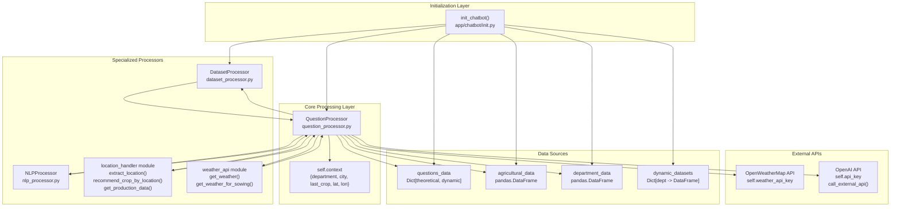
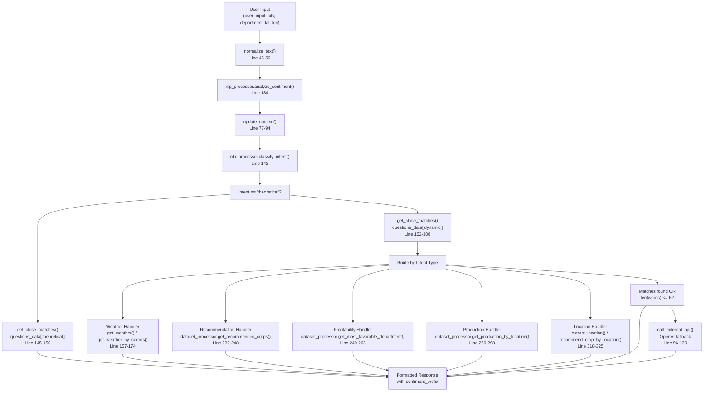
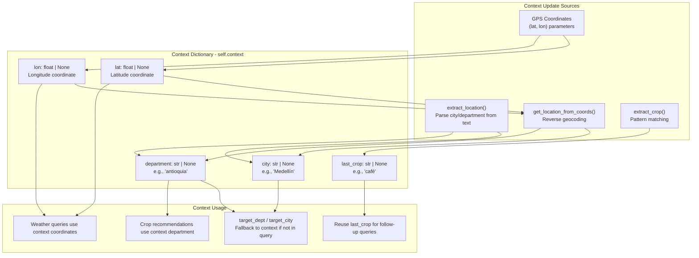
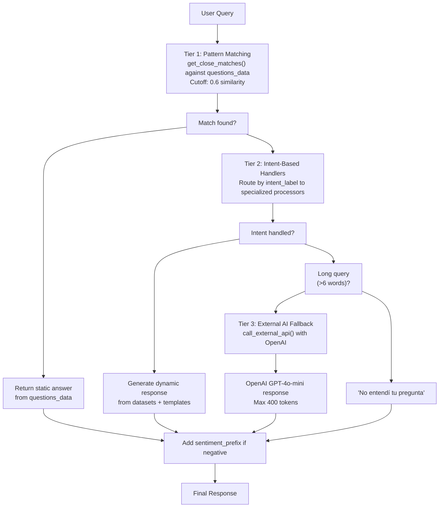
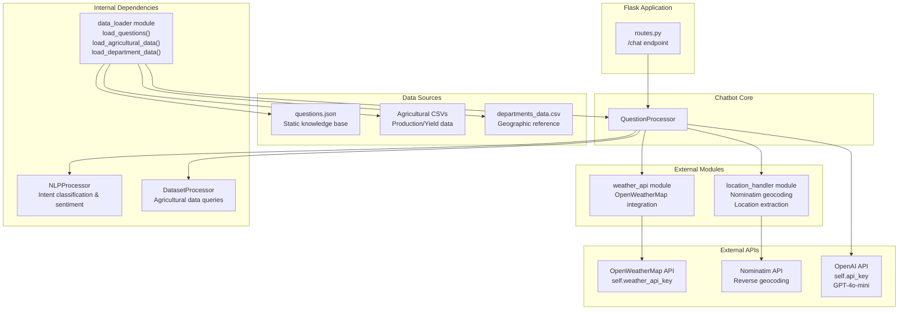

# Chatbot Core System

> **Relevant source files**
> * [app/chatbot/__init__.py](https://github.com/axchisan/ProyectoAgroBot/blob/bc782fcf/app/chatbot/__init__.py)
> * [app/chatbot/question_processor.py](https://github.com/axchisan/ProyectoAgroBot/blob/bc782fcf/app/chatbot/question_processor.py)

## Purpose and Scope

The Chatbot Core System is the central intelligence layer of Agrobot responsible for processing user queries, classifying intents, managing conversation context, and generating responses. This document provides a comprehensive overview of the core chatbot components, their interactions, and processing logic.

For detailed information about specific subsystems, see:

* Chatbot initialization and configuration: [Chatbot Initialization](/axchisan/ProyectoAgroBot/4.1-chatbot-initialization)
* Query handling and response generation: [Question Processing](/axchisan/ProyectoAgroBot/4.2-question-processing)
* Intent detection and NLP: [Intent Classification](/axchisan/ProyectoAgroBot/4.3-intent-classification)
* Response selection strategies: [Response Strategy](/axchisan/ProyectoAgroBot/4.4-response-strategy)
* Conversation state management: [Context Management](/axchisan/ProyectoAgroBot/4.5-context-management)

For data management aspects, see [Data Management](/axchisan/ProyectoAgroBot/5-data-management). For external service integrations, see [External Integrations](/axchisan/ProyectoAgroBot/6-external-integrations).

---

## System Overview

The Chatbot Core System consists of five primary components working together to understand and respond to agricultural queries from Colombian farmers:

| Component | Primary Class | Responsibility |
| --- | --- | --- |
| **Initialization** | `init_chatbot` function | Bootstraps the chatbot system, loads data, and wires dependencies |
| **Question Processing** | `QuestionProcessor` | Orchestrates query handling, intent routing, and response generation |
| **NLP Processing** | `NLPProcessor` | Classifies user intents and analyzes sentiment using BERT models |
| **Dataset Processing** | `DatasetProcessor` | Queries agricultural datasets for data-driven recommendations |
| **Location Handling** | `LocationHandler` module | Extracts and resolves geographic context from queries |

The system follows a pipeline architecture where user input flows through intent classification, specialized handlers, and response formatting before being returned to the user.

Sources: [app/chatbot/__init__.py L1-L44](https://github.com/axchisan/ProyectoAgroBot/blob/bc782fcf/app/chatbot/__init__.py#L1-L44)

 [app/chatbot/question_processor.py L1-L344](https://github.com/axchisan/ProyectoAgroBot/blob/bc782fcf/app/chatbot/question_processor.py#L1-L344)

---

## Component Architecture

The following diagram shows the internal structure of the Chatbot Core System with actual code entities:



**Key Architectural Characteristics:**

1. **Dependency Injection**: The `init_chatbot()` function loads all data sources and instantiates processors, injecting them into `QuestionProcessor`
2. **Centralized Orchestration**: `QuestionProcessor` acts as the main controller, delegating to specialized processors
3. **Stateful Context**: The system maintains conversation state in `self.context` for multi-turn interactions
4. **Fallback Chain**: Responses follow a hierarchy: pattern matching → specialized handlers → external AI

Sources: [app/chatbot/__init__.py L6-L44](https://github.com/axchisan/ProyectoAgroBot/blob/bc782fcf/app/chatbot/__init__.py#L6-L44)

 [app/chatbot/question_processor.py L12-L43](https://github.com/axchisan/ProyectoAgroBot/blob/bc782fcf/app/chatbot/question_processor.py#L12-L43)

---

## Initialization Flow

The chatbot initialization process establishes all required dependencies and configurations:

```python
"NLPProcessor""QuestionProcessor""DatasetProcessor""data_loader module""init_chatbot()""Flask App""NLPProcessor""QuestionProcessor""DatasetProcessor""data_loader module""init_chatbot()""Flask App"#mermaid-k8v1gc1erjp{font-family:ui-sans-serif,-apple-system,system-ui,Segoe UI,Helvetica;font-size:16px;fill:#333;}@keyframes edge-animation-frame{from{stroke-dashoffset:0;}}@keyframes dash{to{stroke-dashoffset:0;}}#mermaid-k8v1gc1erjp .edge-animation-slow{stroke-dasharray:9,5!important;stroke-dashoffset:900;animation:dash 50s linear infinite;stroke-linecap:round;}#mermaid-k8v1gc1erjp .edge-animation-fast{stroke-dasharray:9,5!important;stroke-dashoffset:900;animation:dash 20s linear infinite;stroke-linecap:round;}#mermaid-k8v1gc1erjp .error-icon{fill:#dddddd;}#mermaid-k8v1gc1erjp .error-text{fill:#222222;stroke:#222222;}#mermaid-k8v1gc1erjp .edge-thickness-normal{stroke-width:1px;}#mermaid-k8v1gc1erjp .edge-thickness-thick{stroke-width:3.5px;}#mermaid-k8v1gc1erjp .edge-pattern-solid{stroke-dasharray:0;}#mermaid-k8v1gc1erjp .edge-thickness-invisible{stroke-width:0;fill:none;}#mermaid-k8v1gc1erjp .edge-pattern-dashed{stroke-dasharray:3;}#mermaid-k8v1gc1erjp .edge-pattern-dotted{stroke-dasharray:2;}#mermaid-k8v1gc1erjp .marker{fill:#999;stroke:#999;}#mermaid-k8v1gc1erjp .marker.cross{stroke:#999;}#mermaid-k8v1gc1erjp svg{font-family:ui-sans-serif,-apple-system,system-ui,Segoe UI,Helvetica;font-size:16px;}#mermaid-k8v1gc1erjp p{margin:0;}#mermaid-k8v1gc1erjp .actor{stroke:#cccccc;fill:#ffffff;}#mermaid-k8v1gc1erjp text.actor>tspan{fill:#333;stroke:none;}#mermaid-k8v1gc1erjp .actor-line{stroke:#cccccc;}#mermaid-k8v1gc1erjp .messageLine0{stroke-width:1.5;stroke-dasharray:none;stroke:#999999;}#mermaid-k8v1gc1erjp .messageLine1{stroke-width:1.5;stroke-dasharray:2,2;stroke:#999999;}#mermaid-k8v1gc1erjp #arrowhead path{fill:#999999;stroke:#999999;}#mermaid-k8v1gc1erjp .sequenceNumber{fill:#666666;}#mermaid-k8v1gc1erjp #sequencenumber{fill:#999999;}#mermaid-k8v1gc1erjp #crosshead path{fill:#999999;stroke:#999999;}#mermaid-k8v1gc1erjp .messageText{fill:#333333;stroke:none;}#mermaid-k8v1gc1erjp .labelBox{stroke:#dddddd;fill:#ffffff;}#mermaid-k8v1gc1erjp .labelText,#mermaid-k8v1gc1erjp .labelText>tspan{fill:#333;stroke:none;}#mermaid-k8v1gc1erjp .loopText,#mermaid-k8v1gc1erjp .loopText>tspan{fill:#333;stroke:none;}#mermaid-k8v1gc1erjp .loopLine{stroke-width:2px;stroke-dasharray:2,2;stroke:#dddddd;fill:#dddddd;}#mermaid-k8v1gc1erjp .note{stroke:#e6d280;fill:#fff5ad;}#mermaid-k8v1gc1erjp .noteText,#mermaid-k8v1gc1erjp .noteText>tspan{fill:#333;stroke:none;}#mermaid-k8v1gc1erjp .activation0{fill:hsl(-120, 0%, 91.7647058824%);stroke:hsl(-120, 0%, 81.7647058824%);}#mermaid-k8v1gc1erjp .activation1{fill:hsl(-120, 0%, 91.7647058824%);stroke:hsl(-120, 0%, 81.7647058824%);}#mermaid-k8v1gc1erjp .activation2{fill:hsl(-120, 0%, 91.7647058824%);stroke:hsl(-120, 0%, 81.7647058824%);}#mermaid-k8v1gc1erjp .actorPopupMenu{position:absolute;}#mermaid-k8v1gc1erjp .actorPopupMenuPanel{position:absolute;fill:#ffffff;box-shadow:0px 8px 16px 0px rgba(0,0,0,0.2);filter:drop-shadow(3px 5px 2px rgb(0 0 0 / 0.4));}#mermaid-k8v1gc1erjp .actor-man line{stroke:#cccccc;fill:#ffffff;}#mermaid-k8v1gc1erjp .actor-man circle,#mermaid-k8v1gc1erjp line{stroke:#cccccc;fill:#ffffff;stroke-width:2px;}#mermaid-k8v1gc1erjp :root{--mermaid-font-family:"trebuchet ms",verdana,arial,sans-serif;}"os.getenv('OPENWEATHERMAP_API_KEY')os.getenv('OPENAI_API_KEY')""{department: None,city: None,last_crop: None,lat: None,lon: None}""init_chatbot(weather_api_key, openai_api_key)""load_questions(questions_file)""questions_data Dict""load_agricultural_data(agricultural_file)""agricultural_data DataFrame""load_department_data(department_file)""department_data DataFrame""load_dynamic_datasets(dynamic_data_dir)""dynamic_datasets Dict""Retrieve API keys from env vars""DatasetProcessor(dynamic_datasets)""dataset_processor instance""QuestionProcessor(questions_data,agricultural_data,department_data,dataset_processor,weather_api_key,api_key)""NLPProcessor()""nlp_processor instance""Initialize self.context""QuestionProcessor instance""processor (ready for queries)"
```

**Initialization Parameters:**

| Parameter | Type | Default | Source |
| --- | --- | --- | --- |
| `weather_api_key` | str | `os.getenv("OPENWEATHERMAP_API_KEY")` | Environment variable |
| `openai_api_key` | str | `os.getenv("OPENAI_API_KEY", "Api Key")` | Environment variable |
| `questions_file` | str | `"data/questions.json"` | Knowledge base path |
| `agricultural_file` | str | `"data/processed/.../Cafe.csv"` | Sample agricultural data |
| `department_file` | str | `"data/raw/departments_data.csv"` | Geographic reference data |
| `dynamic_data_dir` | str | `"data/processed"` | Directory with departmental datasets |

Sources: [app/chatbot/__init__.py L6-L44](https://github.com/axchisan/ProyectoAgroBot/blob/bc782fcf/app/chatbot/__init__.py#L6-L44)

---

## Request Processing Flow

When a user submits a query, the system processes it through multiple stages:



**Processing Stages:**

1. **Text Normalization** (lines 45-56): Converts input to lowercase, removes accents, corrects common typos (q→que, k→que, cultvio→cultivo)
2. **Sentiment Analysis** (line 134): Detects negative sentiment to add empathetic prefixes
3. **Context Update** (lines 77-94): Extracts location from coordinates or text, updates conversation state
4. **Intent Classification** (line 142): Uses BERT model to classify query into 14 intent types
5. **Pattern Matching**: Attempts fuzzy matching against theoretical and dynamic questions
6. **Intent Routing**: Routes to specialized handlers based on classified intent
7. **Response Generation**: Formats response with sentiment prefix and relevant data

Sources: [app/chatbot/question_processor.py L45-L344](https://github.com/axchisan/ProyectoAgroBot/blob/bc782fcf/app/chatbot/question_processor.py#L45-L344)

---

## Core Classes and Methods

### QuestionProcessor Class

**Location**: [app/chatbot/question_processor.py L12-L344](https://github.com/axchisan/ProyectoAgroBot/blob/bc782fcf/app/chatbot/question_processor.py#L12-L344)

**Initialization Signature**:

```yaml
QuestionProcessor(
    questions_data: Dict,
    agricultural_data: pd.DataFrame,
    department_data: pd.DataFrame,
    dataset_processor: DatasetProcessor,
    weather_api_key: str = None,
    api_key: str = None,
    api_type: str = "openai"
)
```

**Key Attributes**:

| Attribute | Type | Description |
| --- | --- | --- |
| `self.questions_data` | Dict | Loaded from `questions.json`, contains theoretical and dynamic Q&A |
| `self.agricultural_data` | pd.DataFrame | Sample agricultural dataset (e.g., Cafe.csv) |
| `self.department_data` | pd.DataFrame | Geographic reference data for location extraction |
| `self.dataset_processor` | DatasetProcessor | Handler for querying dynamic agricultural datasets |
| `self.nlp_processor` | NLPProcessor | BERT-based intent classifier and sentiment analyzer |
| `self.context` | Dict | Conversation state: `{department, city, last_crop, lat, lon}` |
| `self.intent_labels` | List[str] | 14 supported intent types for classification |
| `self.initial_prompt` | str | System prompt for OpenAI API fallback |

**Key Methods**:

| Method | Signature | Purpose |
| --- | --- | --- |
| `process_question()` | `(user_input, city, department, lat, lon) -> str` | Main entry point for query processing |
| `normalize_text()` | `(text) -> str` | Text preprocessing and normalization |
| `extract_crop()` | `(user_input) -> Optional[str]` | Identifies crop mentioned in query |
| `extract_year()` | `(user_input) -> Optional[int]` | Extracts year from query (format: 20XX) |
| `update_context()` | `(user_input, lat, lon) -> None` | Updates conversation context from input |
| `call_external_api()` | `(user_input) -> str` | Fallback to OpenAI API for complex queries |

Sources: [app/chatbot/question_processor.py L12-L344](https://github.com/axchisan/ProyectoAgroBot/blob/bc782fcf/app/chatbot/question_processor.py#L12-L344)

---

## Intent Classification System

The chatbot supports 14 distinct intent types organized into functional categories:

```mermaid
flowchart TD

Theory["theoretical<br>General agricultural knowledge"]
W1["weather<br>Current weather"]
W2["weather_forecast<br>Future weather"]
W3["weather_sowing_advice<br>Planting conditions"]
L1["current_location<br>User location query"]
L2["location_based_recommendation<br>Regional crop advice"]
C1["recommendation<br>General crop suggestions"]
C2["recommended_crops<br>Department-specific crops"]
C3["crop_profitability<br>Most profitable departments"]
C4["crop_production<br>Production statistics"]
C5["production_query<br>Specific location/year production"]
T1["crop_timing<br>Planting schedules"]
T2["irrigation_advice<br>Watering recommendations"]
CM1["least_favorable_department<br>Lowest yield regions"]
NLP["NLPProcessor.classify_intent()<br>BERT Spanish Model"]

NLP --> Theory
NLP --> W1
NLP --> W2
NLP --> W3
NLP --> L1
NLP --> L2
NLP --> C1
NLP --> C2
NLP --> C3
NLP --> C4
NLP --> C5
NLP --> T1
NLP --> T2
NLP --> CM1

subgraph subGraph5 ["Intent Types - self.intent_labels"]
    Theory

subgraph subGraph4 ["Comparison Intents"]
    CM1
end

subgraph subGraph3 ["Timing & Management"]
    T1
    T2
end

subgraph subGraph2 ["Crop Analysis Intents"]
    C1
    C2
    C3
    C4
    C5
end

subgraph subGraph1 ["Location Intents"]
    L1
    L2
end

subgraph subGraph0 ["Weather Intents"]
    W1
    W2
    W3
end
end
```



**Intent Routing Logic** (lines 144-338):

Each intent triggers specific processing paths:

* **theoretical** → Fuzzy match against `questions_data["theoretical"]` (line 144-150)
* **weather*** → Call `get_weather()` or `get_weather_by_coords()`, format with `answer_template` (line 157-174)
* **recommendation/location_based_recommendation** → `dataset_processor.get_recommended_crops(department)` (line 232-248)
* **crop_profitability** → `dataset_processor.get_most_favorable_department(crop)` or `compare_crops_profitability()` (line 249-268)
* **crop_production** → `dataset_processor.get_production_by_location()` with min/max logic (line 269-298)
* **production_query** → Extract crop, year, location; query specific production data (line 327-338)

Sources: [app/chatbot/question_processor.py L22-L27](https://github.com/axchisan/ProyectoAgroBot/blob/bc782fcf/app/chatbot/question_processor.py#L22-L27)

 [app/chatbot/question_processor.py L144-L338](https://github.com/axchisan/ProyectoAgroBot/blob/bc782fcf/app/chatbot/question_processor.py#L144-L338)

---

## Context Management

The chatbot maintains stateful context across conversation turns to provide personalized responses:



**Context Update Logic** (lines 77-94):

1. **GPS Priority**: If `lat` and `lon` are provided, update coordinates and reverse geocode to get location
2. **Text Extraction**: Call `extract_location(user_input, department_data)` to parse city/department from text
3. **Context Persistence**: Values persist across queries until explicitly updated
4. **Fallback Strategy**: Use context values when query doesn't specify location

**Context Resolution** (lines 139-140):

```
target_dept = self.context["department"] if self.context["department"] else department
target_city = self.context["city"] if self.context["city"] else city
```

Sources: [app/chatbot/question_processor.py L28-L34](https://github.com/axchisan/ProyectoAgroBot/blob/bc782fcf/app/chatbot/question_processor.py#L28-L34)

 [app/chatbot/question_processor.py L77-L94](https://github.com/axchisan/ProyectoAgroBot/blob/bc782fcf/app/chatbot/question_processor.py#L77-L94)

 [app/chatbot/question_processor.py L139-L140](https://github.com/axchisan/ProyectoAgroBot/blob/bc782fcf/app/chatbot/question_processor.py#L139-L140)

---

## Response Generation Strategy

The chatbot employs a multi-tier response strategy with progressively broader fallbacks:



**Response Tier Details**:

| Tier | Strategy | Conditions | Success Rate |
| --- | --- | --- | --- |
| **Tier 1** | Pattern matching theoretical questions | Similarity ≥ 0.6 to `questions_data["theoretical"]` | High for known questions |
| **Tier 2** | Intent-routed dynamic handlers | Intent classified, data available for query | High for data-driven queries |
| **Tier 3** | OpenAI API fallback | No match AND query length > 6 words | Variable (depends on API) |
| **Default** | Error message | No match AND short query | N/A (failure case) |

**Answer Templates** (line 161-306):

Dynamic questions use `answer_template` with placeholders:

* Weather: `{city}`, `{description}`, `{temp}`, `{humidity}`, `{recommendation}`
* Crops: `{crop}`, `{department}`, `{yield_value}`, `{production}`
* Timing: `{crop}`, `{month}`

**Sentiment Enhancement** (lines 134-135):

```
sentiment = self.nlp_processor.analyze_sentiment(user_input)
sentiment_prefix = "¡Entiendo que estás preocupado! " if sentiment["compound"] < -0.1 else ""
```

Sources: [app/chatbot/question_processor.py L134-L344](https://github.com/axchisan/ProyectoAgroBot/blob/bc782fcf/app/chatbot/question_processor.py#L134-L344)

---

## Integration Points

The Chatbot Core System integrates with multiple external components:



**Key Integration Patterns**:

1. **Initialization-Time Loading**: Data sources loaded once via `data_loader` during `init_chatbot()`
2. **Runtime Service Calls**: Weather and AI APIs called on-demand during query processing
3. **Processor Delegation**: `QuestionProcessor` delegates to specialized processors without direct coupling
4. **Context Sharing**: Location context shared between processors via `self.context`

**API Key Management** (lines 28-29):

```
weather_api_key = weather_api_key or os.getenv("OPENWEATHERMAP_API_KEY")
openai_api_key = openai_api_key or os.getenv("OPENAI_API_KEY", "Api Key")
```

Sources: [app/chatbot/__init__.py L1-L44](https://github.com/axchisan/ProyectoAgroBot/blob/bc782fcf/app/chatbot/__init__.py#L1-L44)

 [app/chatbot/question_processor.py L1-L11](https://github.com/axchisan/ProyectoAgroBot/blob/bc782fcf/app/chatbot/question_processor.py#L1-L11)

 [app/chatbot/question_processor.py L96-L130](https://github.com/axchisan/ProyectoAgroBot/blob/bc782fcf/app/chatbot/question_processor.py#L96-L130)

---

## Text Normalization and Extraction

The system includes robust text processing utilities to handle varied user input:

**Normalization Pipeline** (lines 45-56):

| Operation | Pattern | Replacement | Purpose |
| --- | --- | --- | --- |
| Lowercase | All text | lowercase | Case-insensitive matching |
| Common abbreviations | `\bq\b`, `\bk\b` | `"que"` | Handle informal Spanish |
| Typo correction | `\bcultvio\b` | `"cultivo"` | Fix common misspellings |
| Regional terms | `\bdepto\b`, `\bdept\b` | `"departamento"` | Standardize location terms |
| Accent removal | All accented chars | ASCII equivalent | Simplify matching |
| Punctuation removal | `[¿¡!?,.;]` | Empty string | Clean text for comparison |

**Crop Extraction** (lines 58-69):

Maintains a hardcoded list of 25+ common Colombian crops and uses normalized text matching. Updates `self.context["last_crop"]` when detected for follow-up queries.

**Year Extraction** (lines 71-75):

Regex pattern `\b(20\d{2})\b` extracts years in format 2000-2099 for temporal queries.

Sources: [app/chatbot/question_processor.py L45-L75](https://github.com/axchisan/ProyectoAgroBot/blob/bc782fcf/app/chatbot/question_processor.py#L45-L75)

---

## Error Handling and Fallbacks

The system implements graceful degradation through multiple fallback mechanisms:

**API Error Handling** (lines 125-130):

```
except requests.exceptions.HTTPError as e:
    return f"Error al consultar la API externa: {str(e)}."
except requests.exceptions.RequestException as e:
    return f"Error de conexión con la API externa: {str(e)}."
except KeyError as e:
    return f"Error al procesar la respuesta de la API: {str(e)}."
```

**Missing Context Fallbacks**:

* **No location**: Returns `"No sé tu ubicación. Permite el acceso a tu ubicación o dime dónde estás."` (line 183)
* **Sin datos meteorológicos** : solicita acceso a la ciudad o GPS (línea 174)
* **No hay coincidencia de conjunto de datos** : devuelve `"No tengo datos suficientes"`variantes (líneas 259, 298, 315, 325)
* **Sin clave API** : Devuelve `"No tengo acceso a una API externa"`(línea 98)

**Respuesta predeterminada** (línea 344):

```
return sentiment_prefix + "No entendí tu pregunta. ¿Más detalles o reformúlala?"
```

Fuentes:[question_processor.py L96-L130](https://github.com/axchisan/ProyectoAgroBot/blob/bc782fcf/app/chatbot/question_processor.py#L96-L130)

 [question_processor.py L174-L344](https://github.com/axchisan/ProyectoAgroBot/blob/bc782fcf/app/chatbot/question_processor.py#L174-L344)