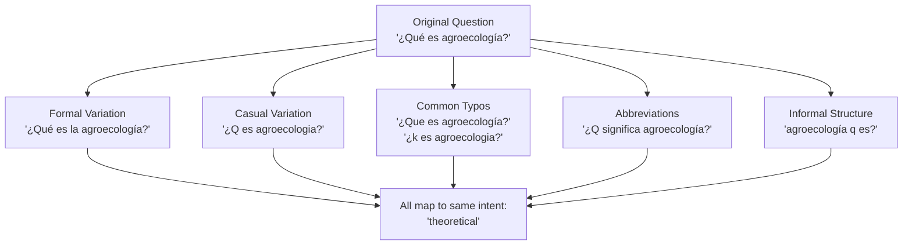
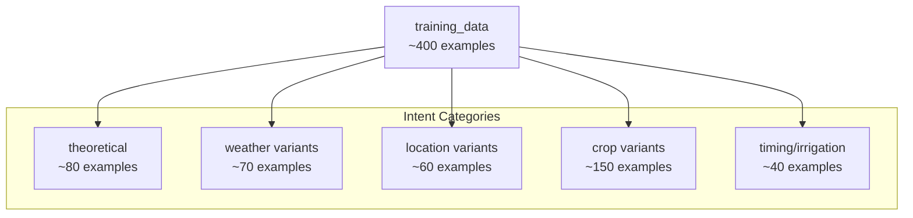
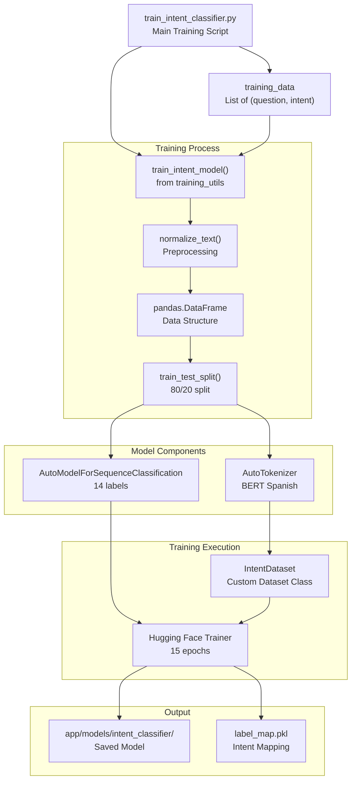
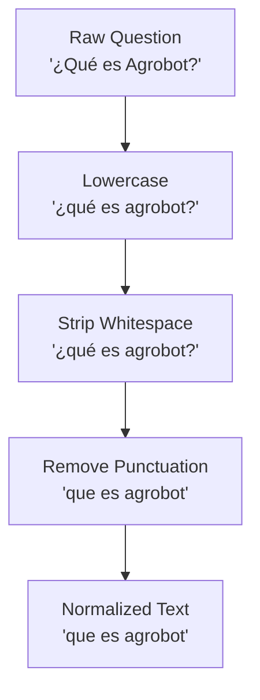
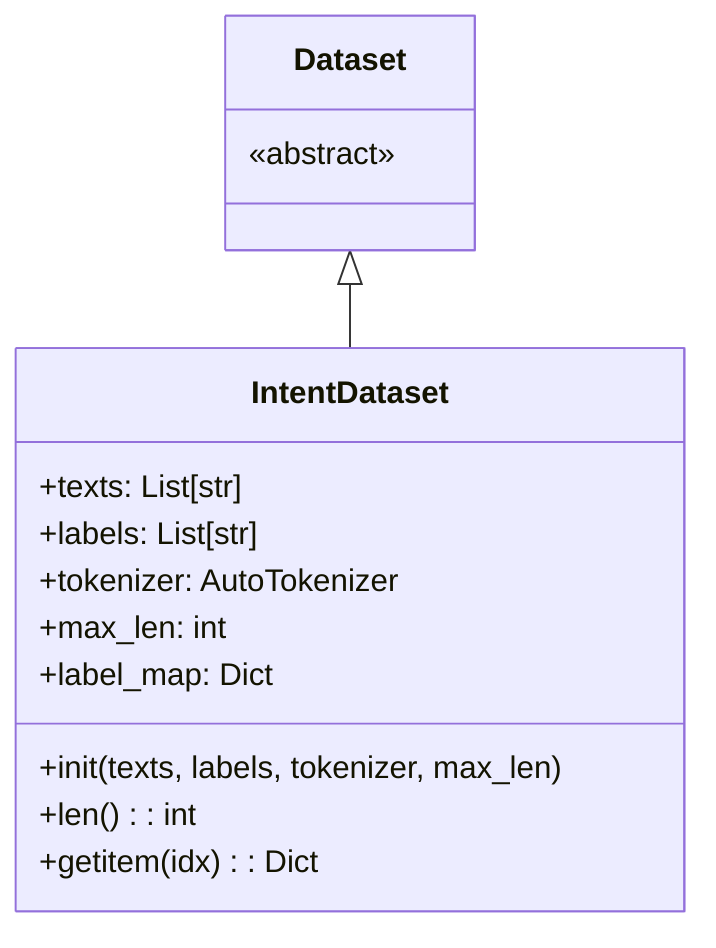
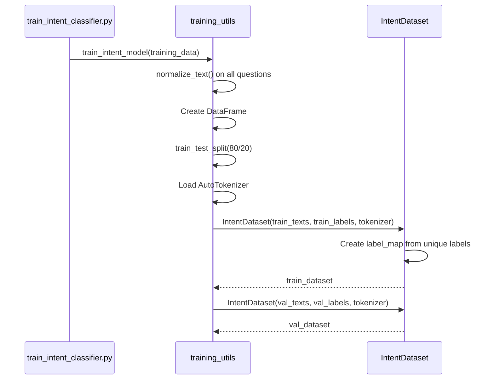
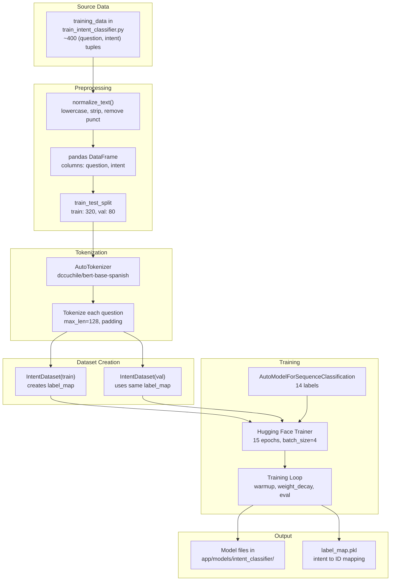
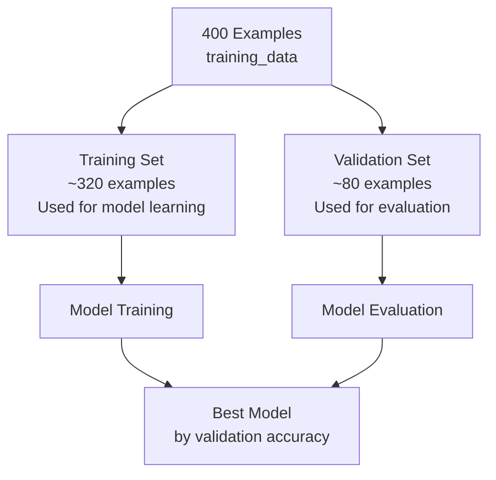
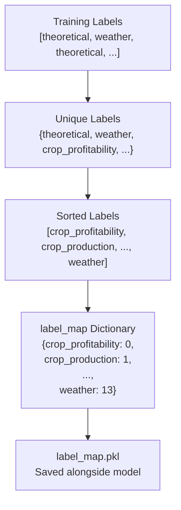

# Datos y procesos de entrenamiento

> **Archivos fuente relevantes**
> * [aplicación/chatbot/training_utils.py](https://github.com/axchisan/ProyectoAgroBot/blob/bc782fcf/app/chatbot/training_utils.py)
> * [aplicación/estática/css/estilo.css](https://github.com/axchisan/ProyectoAgroBot/blob/bc782fcf/app/static/css/style.css)
> * [aplicación/plantillas/chat.html](https://github.com/axchisan/ProyectoAgroBot/blob/bc782fcf/app/templates/chat.html)
> * [clasificador_de_intentos_de_entrenamiento.py](https://github.com/axchisan/ProyectoAgroBot/blob/bc782fcf/train_intent_classifier.py)

Este documento describe el conjunto de datos de entrenamiento utilizado para entrenar el modelo de clasificación de intenciones y el proceso de entrenamiento. Los datos de entrenamiento constan de más de 400 preguntas en español, anotadas con etiquetas de intención, diseñadas para gestionar las consultas agrícolas de los pequeños agricultores colombianos.

Para obtener información sobre la arquitectura del modelo y la inferencia, consulte [el Modelo de clasificación de intenciones](/axchisan/ProyectoAgroBot/8.1-intent-classification-model) . Para obtener más información sobre la implementación de la canalización de entrenamiento, consulte [la Canalización de entrenamiento del modelo](/axchisan/ProyectoAgroBot/8.3-model-training-pipeline) .

---

## Descripción general

El sistema Agrobot utiliza un enfoque de aprendizaje supervisado para clasificar las intenciones de los usuarios. El conjunto de datos de entrenamiento se selecciona manualmente e incluye un amplio análisis de datos para gestionar las variaciones en la forma en que los agricultores formulan sus preguntas, incluyendo errores tipográficos, lenguaje informal y diferentes expresiones regionales.

**Fuentes:** [train_intent_classifier.py L1-L286](https://github.com/axchisan/ProyectoAgroBot/blob/bc782fcf/train_intent_classifier.py#L1-L286)

---

## Estructura de datos de entrenamiento

### Formato de datos

Los datos de entrenamiento se almacenan directamente en el `train_intent_classifier.py`script como una lista de tuplas de Python. Cada tupla contiene:

* **Pregunta (str)** : Una consulta en español
* **Intención (str)** : La etiqueta de clasificación para esa consulta

```markdown
training_data = [
    ("¿Qué es Agrobot?", "theoretical"),
    ("¿Clima Bogotá?", "weather"),
    ("¿Cultivo Antioquia?", "location_based_recommendation"),
    # ... 400+ more examples
]
```

**Fuentes:** [train_intent_classifier.py L4-L286](https://github.com/axchisan/ProyectoAgroBot/blob/bc782fcf/train_intent_classifier.py#L4-L286)

---

## Categorías de intención

El conjunto de datos de entrenamiento cubre 14 tipos de intenciones distintos organizados en 5 categorías funcionales:

### Tabla de categorías de intención

| Etiqueta de intención | Categoría | Descripción | Consultas de ejemplo |
| --- | --- | --- | --- |
| `theoretical` | Conocimiento | Conocimientos agrícolas generales y definiciones | "¿Qué es agroecología?", "¿Cómo funciona la rotación de cultivos?" |
| `weather` | Clima | Condiciones meteorológicas actuales | "¿Clima Bogotá?", "¿Está lloviendo Medellín?" |
| `weather_forecast` | Clima | Predicciones meteorológicas futuras | "¿Clima mañana Bogotá?", "¿Pronóstico semana?" |
| `weather_sowing_advice` | Clima | Consejos de plantación basados ​​en el clima | "¿Clima para sembrar Bogotá?", "¿Bueno cultivar clima cálido?" |
| `current_location` | Ubicación | Consultas de ubicación del usuario | "¿Dónde estoy?", "¿Estoy en Antioquia?" |
| `recommendation` | Cultivos | Recomendaciones generales de cultivos | "¿Qué cultivos región?", "¿Mejores cultivos zona?" |
| `location_based_recommendation` | Cultivos | Recomendaciones de cultivos específicas para cada departamento | "¿Cultivo Antioquia?", "¿Qué siembro Cundinamarca?" |
| `recommended_crops` | Cultivos | Solicitudes explícitas de recomendaciones de cultivos | "¿Qué cultivos recomiendas Santander?" |
| `crop_profitability` | Cultivos | Consultas de rentabilidad y rendimiento | "¿Cultivo rentable Antioquia?", "¿Mejor maíz?" |
| `crop_production` | Cultivos | Consultas de volumen de producción | "¿Donde producen más café?", "¿Producción tomate?" |
| `production_query` | Cultivos | Consultas de datos de producción específicos | "¿Cuánto maíz Manizales 2020?" |
| `crop_timing` | Momento | Preguntas sobre el cronograma de siembra | "¿Cuando siembro maíz?", "¿Mejor mes papá?" |
| `irrigation_advice` | Momento | Optimización del riego | "¿Cómo optimizo riego?", "¿Riego adecuado Bogotá?" |
| `least_favorable_department` | Cultivos | Consultas sobre ubicaciones desfavorables | "¿Dónde sembrar maíz?" |

**Fuentes:** [train_intent_classifier.py L4-L286](https://github.com/axchisan/ProyectoAgroBot/blob/bc782fcf/train_intent_classifier.py#L4-L286)

---

## Estrategia de aumento de datos

Los datos de entrenamiento emplean un aumento extensivo para mejorar la robustez del modelo:

### Augmentation Techniques



### Examples of Augmentation by Category

| Original Question | Augmented Variations | Intent |
| --- | --- | --- |
| "¿Qué es Agrobot?" | "¿Q es Agrobot?", "¿Que es Agrobot?", "¿k es agrobot?", "¿Agrobot q es?" | `theoretical` |
| "¿Clima Bogotá?" | "¿Q clima Bogotá?", "¿Cómo está tiempo Bogotá?" | `weather` |
| "¿Cultivo Antioquia?" | "¿Q siembro Antioquia?", "¿Que sembrar en Antioquia?", "¿k siembro Antioquia?" | `location_based_recommendation` |
| "¿Cuando siembro maíz?" | "¿Q mes maíz?", "¿Cundo siembro maiz?", "¿Mejor maíz?" | `crop_timing` |

**Sources:** [train_intent_classifier.py L6-L286](https://github.com/axchisan/ProyectoAgroBot/blob/bc782fcf/train_intent_classifier.py#L6-L286)

---

## Training Data Distribution

### Distribution Diagram



### Geographical Coverage

The training data includes questions about major Colombian departments:

| Department | Example Questions | Coverage |
| --- | --- | --- |
| Antioquia | "¿Cultivo Antioquia?", "¿Mejor rentabilidad Antioquia?" | High |
| Cundinamarca | "¿Estoy Cundinamarca?", "¿Q siembro Cundinamarca?" | High |
| Valle del Cauca | "¿Cultivo Valle?", "¿Rentable Valle?" | High |
| Santander | "¿Qué cultivos recomiendas Santander?", "¿Mejor Santander?" | High |
| Tolima | "¿Cultivo Tolima?", "¿Producción guayaba Tolima?" | Medium |
| Nariño | "¿Estoy Nariño?", "¿Cultivo Nariño?" | Medium |
| Huila | "¿Qué siembro Huila?", "¿Rentable Huila?" | Medium |
| Boyacá | "¿Cultivo Boyacá?", "¿Producción papa Boyacá?" | Medium |

**Sources:** [train_intent_classifier.py L105-L286](https://github.com/axchisan/ProyectoAgroBot/blob/bc782fcf/train_intent_classifier.py#L105-L286)

---

## Training Script Architecture



### Entry Point

The script is executed directly to train the model:

```python
if __name__ == "__main__":
    train_intent_model(training_data)
```

This calls the `train_intent_model()` function from `app/chatbot/training_utils.py`, passing the entire training dataset.

**Sources:** [train_intent_classifier.py L288-L289](https://github.com/axchisan/ProyectoAgroBot/blob/bc782fcf/train_intent_classifier.py#L288-L289)

 [app/chatbot/training_utils.py L47-L107](https://github.com/axchisan/ProyectoAgroBot/blob/bc782fcf/app/chatbot/training_utils.py#L47-L107)

---

## Data Preprocessing

### Text Normalization

Before training, all questions are normalized to ensure consistency:



The `normalize_text()` function implements this:

```python
def normalize_text(text: str) -> str:
    text = text.lower().strip()
    text = re.sub(r'[¿¡!?,.;]', '', text)
    return text
```

This normalization is applied to all training examples before creating the DataFrame.

**Sources:** [app/chatbot/training_utils.py L13-L17](https://github.com/axchisan/ProyectoAgroBot/blob/bc782fcf/app/chatbot/training_utils.py#L13-L17)

 [app/chatbot/training_utils.py L50](https://github.com/axchisan/ProyectoAgroBot/blob/bc782fcf/app/chatbot/training_utils.py#L50-L50)

---

## IntentDataset Class

### Custom Dataset Implementation

The `IntentDataset` class wraps the training data for PyTorch:



### Dataset Construction Process



### Label Mapping

The `IntentDataset` automatically creates a label map on initialization:

```
self.label_map = {label: idx for idx, label in enumerate(sorted(set(labels)))}
```

This creates a deterministic mapping from intent strings to integer IDs, sorted alphabetically to ensure consistency across training runs.

**Sources:** [app/chatbot/training_utils.py L19-L45](https://github.com/axchisan/ProyectoAgroBot/blob/bc782fcf/app/chatbot/training_utils.py#L19-L45)

 [app/chatbot/training_utils.py L60-L68](https://github.com/axchisan/ProyectoAgroBot/blob/bc782fcf/app/chatbot/training_utils.py#L60-L68)

---

## Training Data to Model Pipeline



**Sources:** [train_intent_classifier.py L1-L289](https://github.com/axchisan/ProyectoAgroBot/blob/bc782fcf/train_intent_classifier.py#L1-L289)

 [app/chatbot/training_utils.py L47-L107](https://github.com/axchisan/ProyectoAgroBot/blob/bc782fcf/app/chatbot/training_utils.py#L47-L107)

---

## Training Data Characteristics

### Key Features

1. **Language**: Spanish (Colombian dialect considerations)
2. **Size**: ~400 examples covering 14 intent classes
3. **Augmentation Ratio**: ~3-5 variations per unique question
4. **Class Balance**: Relatively balanced across major categories
5. **Complexity**: Ranges from short queries ("¿Clima?") to multi-part questions

### Data Quality Considerations

| Aspect | Implementation | Purpose |
| --- | --- | --- |
| **Typo Variations** | "¿Que es?" vs "¿Qué es?" | Handle missing accents |
| **Abbreviations** | "¿Q es?" vs "¿Qué es?" | Handle informal text |
| **Spelling Errors** | ¿Cuándo? vs ¿Cuándo? | Manejar errores comunes |
| **Orden de palabras** | "¿Agrobot q es?" vs "¿Q es Agrobot?" | Manejar gramática flexible |
| **Términos regionales** | Varios nombres de departamentos | Cobertura de la geografía colombiana |

**Fuentes:** [train_intent_classifier.py L6-L286](https://github.com/axchisan/ProyectoAgroBot/blob/bc782fcf/train_intent_classifier.py#L6-L286)

---

## Ejemplo de entradas de datos de entrenamiento

### Ejemplos de intención teórica

```
[
    ("¿Qué es Agrobot?", "theoretical"),
    ("¿Q es Agrobot?", "theoretical"),
    ("¿Que es Agrobot?", "theoretical"),
    ("¿k es agrobot?", "theoretical"),
    ("¿Qué significa Agrobot?", "theoretical"),
    ("¿Agrobot q es?", "theoretical"),
    ("¿Cómo funciona Agrobot?", "theoretical"),
    ("¿Para qué sirve Agrobot?", "theoretical"),
]
```

### Ejemplos de recomendaciones basadas en la ubicación

```
[
    ("¿Cultivo Antioquia?", "location_based_recommendation"),
    ("¿Q siembro Antioquia?", "location_based_recommendation"),
    ("¿Que sembrar en Antioquia?", "location_based_recommendation"),
    ("¿k siembro Antioquia?", "location_based_recommendation"),
    ("¿Mejor cultivo Antioquia?", "location_based_recommendation"),
]
```

### Ejemplos de intención de rentabilidad

```
[
    ("¿Cultivo rentable Antioquia?", "crop_profitability"),
    ("¿Q gana Antioquia?", "crop_profitability"),
    ("¿Que cultvio rentable Antioquia?", "crop_profitability"),
    ("¿k gana Antioquia?", "crop_profitability"),
    ("¿Mejor rentabilidad Antioquia?", "crop_profitability"),
]
```

### Ejemplos de consultas complejas

```
[
    ("¿Cuál es el clima ideal para sembrar cacao y en qué departamento es mejor?", "weather_sowing_advice"),
    ("¿Conviene más sembrar maíz o arroz en Santander?", "crop_profitability"),
    ("¿Qué departamento produce más arroz y es rentable?", "crop_production"),
    ("¿Cuánto maíz Manizales 2020?", "production_query"),
]
```

**Fuentes:** [train_intent_classifier.py L6-L232](https://github.com/axchisan/ProyectoAgroBot/blob/bc782fcf/train_intent_classifier.py#L6-L232)

---

## Validación de datos de entrenamiento

### División de entrenamiento y prueba

El proceso de entrenamiento utiliza una división 80/20:



La división se realiza con `random_state=42`para reproducibilidad:

```
train_texts, val_texts, train_labels, val_labels = train_test_split(
    texts, labels, test_size=0.2, random_state=42
)
```

**Fuentes:** [training_utils.py L60](https://github.com/axchisan/ProyectoAgroBot/blob/bc782fcf/app/chatbot/training_utils.py#L60-L60)

---

## Generación de mapas de etiquetas

### Mapeo automático de etiquetas

La `IntentDataset`clase crea automáticamente un mapa de etiquetas a partir de los datos de entrenamiento:



Esta asignación es fundamental para la inferencia, ya que permite `NLPProcessor`convertir los índices de salida del modelo nuevamente en cadenas de intención.

**Fuentes:** [training_utils.py L25](https://github.com/axchisan/ProyectoAgroBot/blob/bc782fcf/app/chatbot/training_utils.py#L25-L25)

 [training_utils.py L103-L105](https://github.com/axchisan/ProyectoAgroBot/blob/bc782fcf/app/chatbot/training_utils.py#L103-L105)

---

## Ejecución del entrenamiento

### Ejecución del script de entrenamiento

Para entrenar el modelo, ejecute:

```
python train_intent_classifier.py
```

Este guión:

1. Define la `training_data`lista completa
2. Llamadas `train_intent_model(training_data)`de`training_utils`
3. Guarda el modelo entrenado en`app/models/intent_classifier/`

### Archivos de salida de entrenamiento

Una vez completado el entrenamiento, se generan los siguientes archivos:

| Archivo | Descripción | Uso |
| --- | --- | --- |
| `config.json` | Configuración del modelo | Cargando modelo de cara abrazada |
| `pytorch_model.bin` | Pesos del modelo entrenado | Inferencia |
| `tokenizer_config.json` | Configuración del tokenizador | Preprocesamiento de texto |
| `vocab.txt` | Archivo de vocabulario | Tokenización |
| `label_map.pkl` | Mapeo de intención de identificación | Recuperación del nombre de intención |

**Fuentes:** [train_intent_classifier.py L288-L289](https://github.com/axchisan/ProyectoAgroBot/blob/bc782fcf/train_intent_classifier.py#L288-L289)

 [training_utils.py L99-L107](https://github.com/axchisan/ProyectoAgroBot/blob/bc782fcf/app/chatbot/training_utils.py#L99-L107)

---

## Resumen

Los datos de entrenamiento para el clasificador de intenciones de Agrobot están cuidadosamente seleccionados con:

* **~400 ejemplos** que cubren 14 intenciones distintas
* **Amplia ampliación** con errores tipográficos, abreviaturas y variaciones informales.
* **Cobertura geográfica** de los principales departamentos colombianos
* **Distribución equilibrada** entre categorías teóricas, climáticas, de ubicación, de cultivo y de momento
* **Preprocesamiento normalizado** para una entrada de modelo consistente
* **División reproducible** con una relación de entrenamiento/validación de 80/20

Este enfoque de entrenamiento permite que el modelo maneje las diversas formas en que los agricultores colombianos formulan preguntas agrícolas y al mismo tiempo mantiene una alta precisión en todas las categorías de intención.

**Fuentes:** [train_intent_classifier.py L1-L289](https://github.com/axchisan/ProyectoAgroBot/blob/bc782fcf/train_intent_classifier.py#L1-L289)

 [training_utils.py L1-L107](https://github.com/axchisan/ProyectoAgroBot/blob/bc782fcf/app/chatbot/training_utils.py#L1-L107)