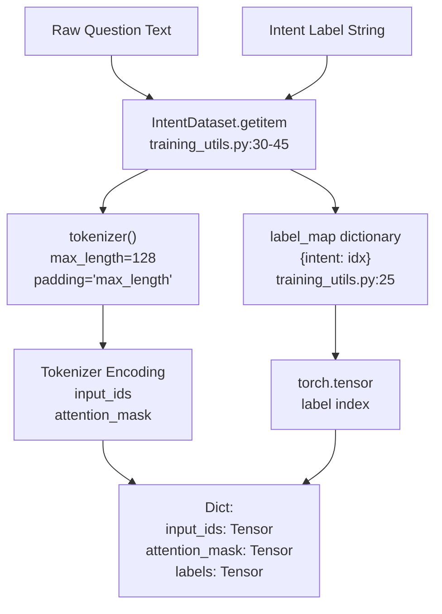
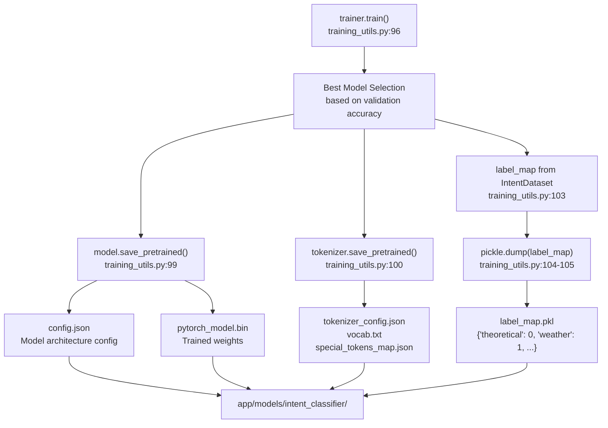

# Training the Intent Classifier

> **Relevant source files**
> * [app/chatbot/training_utils.py](https://github.com/axchisan/ProyectoAgroBot/blob/bc782fcf/app/chatbot/training_utils.py)
> * [app/static/css/style.css](https://github.com/axchisan/ProyectoAgroBot/blob/bc782fcf/app/static/css/style.css)
> * [app/templates/chat.html](https://github.com/axchisan/ProyectoAgroBot/blob/bc782fcf/app/templates/chat.html)
> * [train_intent_classifier.py](https://github.com/axchisan/ProyectoAgroBot/blob/bc782fcf/train_intent_classifier.py)

This document provides instructions for training the NLP intent classification model used by Agrobot. The intent classifier is a BERT-based model fine-tuned on Spanish agricultural queries to categorize user questions into 14 distinct intent types.

**Scope**: This page covers the training data structure, the training pipeline, execution steps, and configuration parameters for the intent classifier. For information about how the trained model is deployed and used during inference, see [Model Deployment and Inference](/axchisan/ProyectoAgroBot/8.4-model-deployment-and-inference). For details about the complete ML pipeline architecture, see [Machine Learning Pipeline](/axchisan/ProyectoAgroBot/8-machine-learning-pipeline).

---

## Overview

The intent classification system enables Agrobot to understand user queries by categorizing them into predefined intent types. The classifier is built using a pre-trained Spanish BERT model (`dccuchile/bert-base-spanish-wwm-uncased`) and fine-tuned on agricultural domain data.

**Key Components:**

* **Training Script**: `train_intent_classifier.py` - Entry point with training data definitions
* **Training Utilities**: `app/chatbot/training_utils.py` - Core training logic and dataset handling
* **Pre-trained Base Model**: BERT Spanish (dccuchile/bert-base-spanish-wwm-uncased)
* **Training Framework**: Hugging Face Transformers with PyTorch backend

**Training Pipeline Flow**

```

```

Sources: [train_intent_classifier.py L1-L289](https://github.com/axchisan/ProyectoAgroBot/blob/bc782fcf/train_intent_classifier.py#L1-L289)

 [app/chatbot/training_utils.py L1-L107](https://github.com/axchisan/ProyectoAgroBot/blob/bc782fcf/app/chatbot/training_utils.py#L1-L107)

---

## Training Data Structure

The training data is defined as a Python list of tuples in `train_intent_classifier.py`. Each tuple contains a question string and its corresponding intent label.

### Intent Types

The system supports 14 distinct intent types covering agricultural questions:

| Intent Type | Description | Example Query |
| --- | --- | --- |
| `theoretical` | General agricultural knowledge | "¿Qué es agroecología?" |
| `weather` | Current weather queries | "¿Cuál es clima Bogotá?" |
| `weather_forecast` | Weather predictions | "¿Clima mañana Medellín?" |
| `weather_sowing_advice` | Climate-based sowing advice | "¿Clima para sembrar Bogotá?" |
| `current_location` | Location identification | "¿Dónde estoy?" |
| `recommendation` | General crop recommendations | "¿Qué cultivos región?" |
| `location_based_recommendation` | Department-specific recommendations | "¿Cultivo Antioquia?" |
| `recommended_crops` | Explicit crop suggestions | "¿Qué cultivos recomiendas Santander?" |
| `crop_profitability` | Profitability analysis | "¿Cultivo rentable Antioquia?" |
| `crop_production` | Production statistics | "¿Donde producen más café?" |
| `production_query` | Historical production data | "¿Cuánto maíz Manizales 2020?" |
| `crop_timing` | Planting schedules | "¿Cuando siembro maíz?" |
| `irrigation_advice` | Irrigation optimization | "¿Cómo optimizo riego?" |
| `least_favorable_department` | Negative recommendations | "¿Dónde es menos favorable maíz?" |

Sources: [train_intent_classifier.py L4-L286](https://github.com/axchisan/ProyectoAgroBot/blob/bc782fcf/train_intent_classifier.py#L4-L286)

### Data Augmentation Strategy

The training data includes multiple variations for each question type to improve model robustness:

* **Formal variations**: Standard Spanish grammar
* **Casual variations**: Abbreviated forms ("Q" instead of "Qué")
* **Typo variations**: Common misspellings ("Cundo" instead of "Cuando", "k" instead of "que")
* **Regional variations**: Different phrasing styles used by Colombian farmers

**Example variations for a single intent:**

```

```

Sources: [train_intent_classifier.py L5-L12](https://github.com/axchisan/ProyectoAgroBot/blob/bc782fcf/train_intent_classifier.py#L5-L12)

### Dataset Statistics

| Metric | Value |
| --- | --- |
| Total training examples | ~400+ |
| Number of intents | 14 |
| Average examples per intent | ~29 |
| Train/validation split | 80/20 |

Sources: [train_intent_classifier.py L4-L286](https://github.com/axchisan/ProyectoAgroBot/blob/bc782fcf/train_intent_classifier.py#L4-L286)

 [app/chatbot/training_utils.py L60](https://github.com/axchisan/ProyectoAgroBot/blob/bc782fcf/app/chatbot/training_utils.py#L60-L60)

---

## Training Pipeline Components

### Text Normalization

The `normalize_text()` function preprocesses all training data before model training:

**Normalization steps:**

1. Convert to lowercase
2. Strip whitespace
3. Remove punctuation marks (¿¡!?,.;)

```

```

Sources: [app/chatbot/training_utils.py L13-L17](https://github.com/axchisan/ProyectoAgroBot/blob/bc782fcf/app/chatbot/training_utils.py#L13-L17)

### IntentDataset Class

The `IntentDataset` class implements PyTorch's `Dataset` interface for batch processing during training.

**Key responsibilities:**

* Tokenize input text using BERT tokenizer
* Convert intent labels to numeric indices via `label_map`
* Handle padding and truncation (max_length=128)
* Return tensors compatible with Hugging Face Trainer

**Architecture Diagram**



Sources: [app/chatbot/training_utils.py L19-L45](https://github.com/axchisan/ProyectoAgroBot/blob/bc782fcf/app/chatbot/training_utils.py#L19-L45)

### Train/Validation Split

The data is split using scikit-learn's `train_test_split`:

* **Training set**: 80% of data
* **Validation set**: 20% of data
* **Random seed**: 42 (for reproducibility)

Sources: [app/chatbot/training_utils.py L60](https://github.com/axchisan/ProyectoAgroBot/blob/bc782fcf/app/chatbot/training_utils.py#L60-L60)

### Model Architecture

The system uses a pre-trained BERT model from the Chilean Center for Semantic Research (dccuchile):

**Model**: `dccuchile/bert-base-spanish-wwm-uncased`

* **Type**: BERT with Whole Word Masking
* **Language**: Spanish (uncased)
* **Architecture**: `AutoModelForSequenceClassification`
* **Output layers**: 14 (one per intent type)

Sources: [app/chatbot/training_utils.py L63-L64](https://github.com/axchisan/ProyectoAgroBot/blob/bc782fcf/app/chatbot/training_utils.py#L63-L64)

---

## Running the Training Script

### Prerequisites

Before training, ensure the following are installed:

```

```

Sources: [app/chatbot/training_utils.py L1-L6](https://github.com/axchisan/ProyectoAgroBot/blob/bc782fcf/app/chatbot/training_utils.py#L1-L6)

### Execution Steps

**1. Navigate to the project root directory:**

```

```

**2. Execute the training script:**

```

```

The script will:

1. Load and normalize 400+ training examples
2. Split data into train/validation sets
3. Download pre-trained Spanish BERT model (if not cached)
4. Fine-tune model for 15 epochs
5. Save trained model and artifacts to `app/models/intent_classifier/`

**Expected console output:**

```yaml
Downloading model...
Training: [Epoch 1/15] ...
Evaluating: ...
Training: [Epoch 2/15] ...
...
Best model loaded
Modelo entrenado y guardado en 'app/models/intent_classifier'
```

Sources: [train_intent_classifier.py L288-L289](https://github.com/axchisan/ProyectoAgroBot/blob/bc782fcf/train_intent_classifier.py#L288-L289)

 [app/chatbot/training_utils.py L47-L107](https://github.com/axchisan/ProyectoAgroBot/blob/bc782fcf/app/chatbot/training_utils.py#L47-L107)

### Training Time

**Approximate training duration:**

* **With GPU**: 10-20 minutes
* **With CPU**: 1-2 hours

Training time varies based on hardware. GPU acceleration is recommended for faster training.

---

## Training Configuration

### Hyperparameters

The training configuration is defined in `TrainingArguments`:

| Parameter | Value | Description |
| --- | --- | --- |
| `output_dir` | `./results` | Checkpoint directory (can be deleted after training) |
| `num_train_epochs` | 15 | Number of complete passes through training data |
| `per_device_train_batch_size` | 4 | Samples per GPU/CPU during training |
| `per_device_eval_batch_size` | 4 | Samples per GPU/CPU during evaluation |
| `warmup_steps` | 1000 | Linear warmup steps for learning rate |
| `weight_decay` | 0.01 | L2 regularization coefficient |
| `learning_rate` | 2e-5 | Initial learning rate |
| `eval_strategy` | `"epoch"` | Evaluate at end of each epoch |
| `save_strategy` | `"epoch"` | Save checkpoint at end of each epoch |
| `load_best_model_at_end` | `True` | Load best checkpoint after training |

Sources: [app/chatbot/training_utils.py L71-L84](https://github.com/axchisan/ProyectoAgroBot/blob/bc782fcf/app/chatbot/training_utils.py#L71-L84)

### Optimizer Configuration

The Trainer uses AdamW optimizer with the following implicit settings:

* **Optimizer**: AdamW (default in Hugging Face)
* **Learning rate schedule**: Linear with warmup
* **Gradient clipping**: Applied automatically

### Evaluation Metric

The model is evaluated using accuracy:

```

```

Sources: [app/chatbot/training_utils.py L92](https://github.com/axchisan/ProyectoAgroBot/blob/bc782fcf/app/chatbot/training_utils.py#L92-L92)

---

## Training Outputs

### Output Directory Structure

After successful training, the following files are generated in `app/models/intent_classifier/`:

```markdown
app/models/intent_classifier/
├── config.json              # Model configuration
├── pytorch_model.bin        # Trained weights
├── tokenizer_config.json    # Tokenizer settings
├── vocab.txt                # BERT vocabulary
├── special_tokens_map.json  # Special tokens (CLS, SEP, etc.)
└── label_map.pkl            # Intent to ID mapping
```

**File Output Process**



Sources: [app/chatbot/training_utils.py L96-L107](https://github.com/axchisan/ProyectoAgroBot/blob/bc782fcf/app/chatbot/training_utils.py#L96-L107)

### label_map.pkl Structure

The `label_map.pkl` file contains a Python dictionary mapping intent strings to integer IDs:

```

```

This mapping is created from sorted unique labels in the training data and is essential for inference.

Sources: [app/chatbot/training_utils.py L25](https://github.com/axchisan/ProyectoAgroBot/blob/bc782fcf/app/chatbot/training_utils.py#L25-L25)

 [app/chatbot/training_utils.py L102-L105](https://github.com/axchisan/ProyectoAgroBot/blob/bc782fcf/app/chatbot/training_utils.py#L102-L105)

### Intermediate Files (Cleanup)

During training, intermediate files are created in `./results/` and `./logs/`:

* **./results/**: Checkpoints for each epoch
* **./logs/**: TensorBoard logs

**These directories can be safely deleted after training completes** since the final model is saved to `app/models/intent_classifier/`.

Sources: [app/chatbot/training_utils.py L72](https://github.com/axchisan/ProyectoAgroBot/blob/bc782fcf/app/chatbot/training_utils.py#L72-L72)

 [app/chatbot/training_utils.py L78](https://github.com/axchisan/ProyectoAgroBot/blob/bc782fcf/app/chatbot/training_utils.py#L78-L78)

---

## Modifying Training Data

### Adding New Intents

To add a new intent type:

1. **Add training examples** to `training_data` list in `train_intent_classifier.py`:

```

```

1. **Re-run training script**:

```

```

The new intent will automatically be included in the `label_map` and model will output `num_labels = 15` (or more).

Sources: [train_intent_classifier.py L4-L286](https://github.com/axchisan/ProyectoAgroBot/blob/bc782fcf/train_intent_classifier.py#L4-L286)

### Adding Examples to Existing Intents

To improve accuracy for an existing intent:

1. **Locate the intent section** in `train_intent_classifier.py`
2. **Add new question variations** following the existing pattern: * Formal variations * Casual/abbreviated forms * Common typos * Regional phrasings
3. **Re-train the model** to incorporate new examples

Sources: [train_intent_classifier.py L4-L286](https://github.com/axchisan/ProyectoAgroBot/blob/bc782fcf/train_intent_classifier.py#L4-L286)

---

## Troubleshooting

### Common Issues

**Issue**: Out of memory during training

**Solution**: Reduce batch size in `TrainingArguments`:

```

```

Sources: [app/chatbot/training_utils.py L74-L75](https://github.com/axchisan/ProyectoAgroBot/blob/bc782fcf/app/chatbot/training_utils.py#L74-L75)

---

**Issue**: Training takes too long on CPU

**Solution**:

* Enable GPU acceleration if available
* Reduce number of epochs to 5-10 for faster iteration during development
* Consider using a smaller dataset for initial testing

Sources: [app/chatbot/training_utils.py L73](https://github.com/axchisan/ProyectoAgroBot/blob/bc782fcf/app/chatbot/training_utils.py#L73-L73)

---

**Issue**: Model not loading after training

**Solution**: Ensure `output_dir` path is correct and all files are present:

* `config.json`
* `pytorch_model.bin`
* `label_map.pkl`

Sources: [app/chatbot/training_utils.py L47](https://github.com/axchisan/ProyectoAgroBot/blob/bc782fcf/app/chatbot/training_utils.py#L47-L47)

---

## Next Steps

After training the intent classifier:

1. **Verify model outputs**: Test the trained model with sample queries
2. **Integrate with NLPProcessor**: See [Model Deployment and Inference](/axchisan/ProyectoAgroBot/8.4-model-deployment-and-inference)
3. **Run the application**: See [Running the Application](/axchisan/ProyectoAgroBot/2.3-running-the-application)
4. **Evaluate performance**: Monitor accuracy on real user queries

Sources: [train_intent_classifier.py L1-L289](https://github.com/axchisan/ProyectoAgroBot/blob/bc782fcf/train_intent_classifier.py#L1-L289)

 [app/chatbot/training_utils.py L1-L107](https://github.com/axchisan/ProyectoAgroBot/blob/bc782fcf/app/chatbot/training_utils.py#L1-L107)