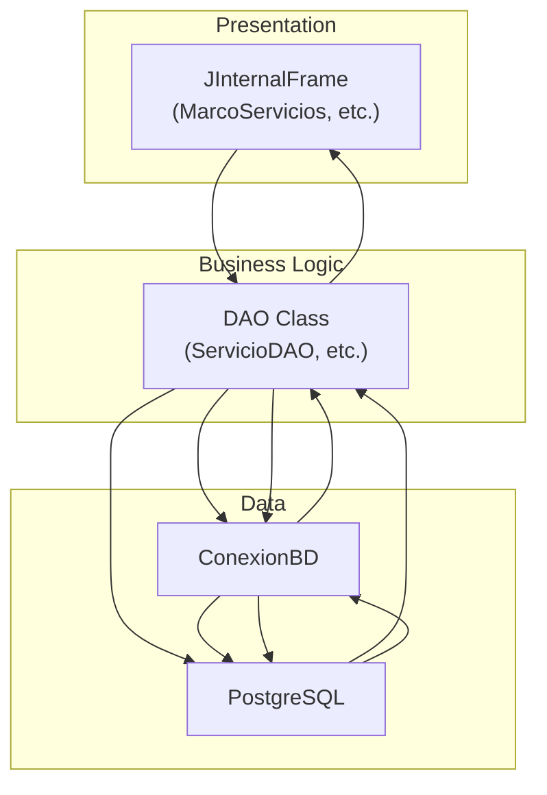
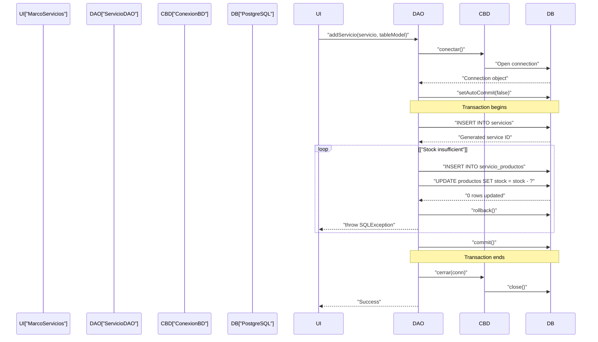

# Application Architecture

> **Relevant source files**
> * [libs/jcalendar-1.4.jar](https://github.com/BrayanTirado/Servicio-Mec-nico/blob/b80161f0/libs/jcalendar-1.4.jar)
> * [src/main/java/com/adso/el_taller_de_adso/AplicacionPrincipal.form](https://github.com/BrayanTirado/Servicio-Mec-nico/blob/b80161f0/src/main/java/com/adso/el_taller_de_adso/AplicacionPrincipal.form)
> * [src/main/java/com/adso/el_taller_de_adso/AplicacionPrincipal.java](https://github.com/BrayanTirado/Servicio-Mec-nico/blob/b80161f0/src/main/java/com/adso/el_taller_de_adso/AplicacionPrincipal.java)
> * [src/main/java/com/adso/el_taller_de_adso/ConexionBD.java](https://github.com/BrayanTirado/Servicio-Mec-nico/blob/b80161f0/src/main/java/com/adso/el_taller_de_adso/ConexionBD.java)
> * [src/main/java/com/adso/el_taller_de_adso/servicios/Servicio.java](https://github.com/BrayanTirado/Servicio-Mec-nico/blob/b80161f0/src/main/java/com/adso/el_taller_de_adso/servicios/Servicio.java)
> * [src/main/java/com/adso/el_taller_de_adso/servicios/ServicioDAO.java](https://github.com/BrayanTirado/Servicio-Mec-nico/blob/b80161f0/src/main/java/com/adso/el_taller_de_adso/servicios/ServicioDAO.java)

## Purpose and Scope

This document describes the overall architectural design of the El Taller de ADSO mechanical workshop management system. It covers the Multi-Document Interface (MDI) pattern, the three-tier layered architecture, and the Data Access Object (DAO) pattern used throughout the application. For specific implementation details of individual modules, see their respective documentation sections: [Main Application Window](/BrayanTirado/Servicio-Mec-nico/3.1-main-application-window), [Database Layer](/BrayanTirado/Servicio-Mec-nico/3.2-database-layer), and the functional modules ([Service Management](/BrayanTirado/Servicio-Mec-nico/4-service-management-module), [Inventory Management](/BrayanTirado/Servicio-Mec-nico/5-inventory-management-module), [Vehicle Management](/BrayanTirado/Servicio-Mec-nico/6-vehicle-management-module), [Client Management](/BrayanTirado/Servicio-Mec-nico/7-client-management-module)).

---

## Architectural Overview

El Taller de ADSO implements a traditional desktop application architecture with clear separation of concerns across three primary layers:

| Layer | Responsibility | Key Components |
| --- | --- | --- |
| **Presentation** | User interface and user interaction | `AplicacionPrincipal`, `JInternalFrame` subclasses |
| **Business Logic** | Data access and business rules | DAO classes (`ServicioDAO`, `ClienteDAO`, `VehiculoDAO`, `ProductoDAO`) |
| **Data** | Persistent storage | PostgreSQL database via JDBC |

The application follows the Multi-Document Interface (MDI) pattern, where a single main window (`AplicacionPrincipal`) serves as a container for multiple child windows (internal frames) that can be opened simultaneously.

**Three-Tier Architecture Diagram**

```

```

Sources: [src/main/java/com/adso/el_taller_de_adso/AplicacionPrincipal.java L1-L405](https://github.com/BrayanTirado/Servicio-Mec-nico/blob/b80161f0/src/main/java/com/adso/el_taller_de_adso/AplicacionPrincipal.java#L1-L405)

 [src/main/java/com/adso/el_taller_de_adso/ConexionBD.java L1-L42](https://github.com/BrayanTirado/Servicio-Mec-nico/blob/b80161f0/src/main/java/com/adso/el_taller_de_adso/ConexionBD.java#L1-L42)

 [src/main/java/com/adso/el_taller_de_adso/servicios/ServicioDAO.java L1-L300](https://github.com/BrayanTirado/Servicio-Mec-nico/blob/b80161f0/src/main/java/com/adso/el_taller_de_adso/servicios/ServicioDAO.java#L1-L300)

---

## Multi-Document Interface (MDI) Pattern

The application implements the MDI pattern through the `AplicacionPrincipal` class, which extends `JFrame` and contains a `JDesktopPane` as its central workspace. The MDI pattern allows multiple document windows (internal frames) to coexist within a single parent window.

### Main Container Structure

The `AplicacionPrincipal` class [src/main/java/com/adso/el_taller_de_adso/AplicacionPrincipal.java L27-L36](https://github.com/BrayanTirado/Servicio-Mec-nico/blob/b80161f0/src/main/java/com/adso/el_taller_de_adso/AplicacionPrincipal.java#L27-L36)

 is structured as follows:

* **JFrame**: The top-level window container
* **JMenuBar**: Navigation menu with five domain-specific menus [src/main/java/com/adso/el_taller_de_adso/AplicacionPrincipal.form L25-L184](https://github.com/BrayanTirado/Servicio-Mec-nico/blob/b80161f0/src/main/java/com/adso/el_taller_de_adso/AplicacionPrincipal.form#L25-L184)
* **JDesktopPane**: The workspace where internal frames are displayed [src/main/java/com/adso/el_taller_de_adso/AplicacionPrincipal.form L220-L238](https://github.com/BrayanTirado/Servicio-Mec-nico/blob/b80161f0/src/main/java/com/adso/el_taller_de_adso/AplicacionPrincipal.form#L220-L238)

### Menu Structure and Frame Instantiation

The menu bar organizes functionality into five primary menus:

| Menu | Menu Items | Instantiated Frame Class |
| --- | --- | --- |
| **Vehículos** | Gestión de VehículosConsulta del vehiculo | `MarcoVehiculo``ConsultaVehiculo` |
| **Servicios** | Gestion de serviciosHistorial de servicios | `MarcoServicios``HistorialServicios` |
| **Clientes** | Registrar clientesGestionar clientes | `MarcoClientes``MarcoGestionClientes` |
| **Reportes** | 4 report types | Various report frames |
| **Inventarios** | 5 inventory functions | `FormularioProducto`, `BuscarProducto`, etc. |

Internal frames are instantiated **on-demand** when a menu item is clicked, not during application initialization. For example:

```java
// Pattern used in all menu item handlers
private void menuItemVehiculosActionPerformed(java.awt.event.ActionEvent evt) {
    MarcoVehiculo marcoVehiculo = new MarcoVehiculo();
    desktopPane.add(marcoVehiculo);
    marcoVehiculo.setVisible(true);
}
```

This pattern is repeated for all menu items [src/main/java/com/adso/el_taller_de_adso/AplicacionPrincipal.java L259-L366](https://github.com/BrayanTirado/Servicio-Mec-nico/blob/b80161f0/src/main/java/com/adso/el_taller_de_adso/AplicacionPrincipal.java#L259-L366)

**MDI Navigation Flow Diagram**

```

```

Sources: [src/main/java/com/adso/el_taller_de_adso/AplicacionPrincipal.java L259-L366](https://github.com/BrayanTirado/Servicio-Mec-nico/blob/b80161f0/src/main/java/com/adso/el_taller_de_adso/AplicacionPrincipal.java#L259-L366)

 [src/main/java/com/adso/el_taller_de_adso/AplicacionPrincipal.form L25-L184](https://github.com/BrayanTirado/Servicio-Mec-nico/blob/b80161f0/src/main/java/com/adso/el_taller_de_adso/AplicacionPrincipal.form#L25-L184)

---

## Layered Architecture Design

The application enforces strict layering where each layer only communicates with its adjacent layer. Presentation components never directly access the database; they must go through the business logic layer.

### Layer Responsibilities

**Presentation Layer**

* Extends `JInternalFrame` for MDI compatibility
* Handles user input and validation
* Displays data in Swing components (`JTable`, `JTextField`, `JComboBox`)
* Delegates all data operations to DAO classes
* No direct database connections

**Business Logic Layer (DAO Classes)**

* Implements the Data Access Object pattern
* Encapsulates all SQL queries and database operations
* Manages data transformation between database records and domain objects
* Handles transaction management for complex operations
* Uses `ConexionBD` for all database connections

**Data Layer**

* PostgreSQL database with JDBC driver
* `ConexionBD` provides static `conectar()` and `cerrar()` methods [src/main/java/com/adso/el_taller_de_adso/ConexionBD.java L16-L41](https://github.com/BrayanTirado/Servicio-Mec-nico/blob/b80161f0/src/main/java/com/adso/el_taller_de_adso/ConexionBD.java#L16-L41)
* No connection pooling (creates new connection per operation)
* Explicit transaction management when needed

**Component Interaction Pattern Diagram**



Sources: [src/main/java/com/adso/el_taller_de_adso/servicios/ServicioDAO.java L18-L20](https://github.com/BrayanTirado/Servicio-Mec-nico/blob/b80161f0/src/main/java/com/adso/el_taller_de_adso/servicios/ServicioDAO.java#L18-L20)

 [src/main/java/com/adso/el_taller_de_adso/ConexionBD.java L16-L41](https://github.com/BrayanTirado/Servicio-Mec-nico/blob/b80161f0/src/main/java/com/adso/el_taller_de_adso/ConexionBD.java#L16-L41)

---

## Data Access Object (DAO) Pattern

The application implements the DAO pattern to abstract and encapsulate all database access. Each major domain entity has a corresponding DAO class.

### DAO Class Structure

Each DAO class follows a consistent structure:

1. **Private connection getter**: `getConnection()` method that delegates to `ConexionBD.conectar()` [src/main/java/com/adso/el_taller_de_adso/servicios/ServicioDAO.java L18-L20](https://github.com/BrayanTirado/Servicio-Mec-nico/blob/b80161f0/src/main/java/com/adso/el_taller_de_adso/servicios/ServicioDAO.java#L18-L20)
2. **CRUD operations**: Methods for Create, Read, Update, Delete
3. **Query methods**: Specialized retrieval methods (e.g., `getAllClientes()`, `getClienteId()`)
4. **Transaction handling**: Explicit transaction management for complex operations

### DAO Method Categories

The `ServicioDAO` class demonstrates the typical DAO method patterns:

| Method Category | Example Methods | Purpose |
| --- | --- | --- |
| **List Retrievers** | `getAllClientes()`, `getAllVehiculos()`, `getAllProductos()` | Populate combo boxes and selection lists |
| **ID Resolvers** | `getClienteId(String)`, `getVehiculoId(String)`, `getProductoId(String)` | Translate user-friendly identifiers to database IDs |
| **Attribute Getters** | `getPrecioProducto(String)`, `getProductoStock(String)`, `getProductoDescription(String)` | Retrieve specific attributes for display or calculation |
| **Entity Retrievers** | `getServiciosByVehiculo(int)` | Fetch collections of domain objects |
| **Mutators** | `addServicio(Servicio, DefaultTableModel)` | Insert, update, or delete operations |

### Transaction Management Example

Complex operations that affect multiple tables use explicit transaction management. The `addServicio` method [src/main/java/com/adso/el_taller_de_adso/servicios/ServicioDAO.java L205-L264](https://github.com/BrayanTirado/Servicio-Mec-nico/blob/b80161f0/src/main/java/com/adso/el_taller_de_adso/servicios/ServicioDAO.java#L205-L264)

 demonstrates this pattern:

```sql
public void addServicio(Servicio servicio, DefaultTableModel tableModel) throws SQLException {
    Connection conn = getConnection();
    try {
        conn.setAutoCommit(false); // Start transaction
        
        // 1. Insert service record
        // 2. Get generated service ID
        // 3. Insert service-product associations
        // 4. Update product stock
        
        conn.commit(); // Commit if all succeed
    } catch (SQLException e) {
        conn.rollback(); // Rollback on any failure
        throw e;
    } finally {
        conn.setAutoCommit(true);
        ConexionBD.cerrar(conn);
    }
}
```

This ensures atomicity: either all operations succeed, or none do.

**DAO Transaction Flow Diagram**



Sources: [src/main/java/com/adso/el_taller_de_adso/servicios/ServicioDAO.java L205-L264](https://github.com/BrayanTirado/Servicio-Mec-nico/blob/b80161f0/src/main/java/com/adso/el_taller_de_adso/servicios/ServicioDAO.java#L205-L264)

 [src/main/java/com/adso/el_taller_de_adso/servicios/ServicioDAO.java L285-L299](https://github.com/BrayanTirado/Servicio-Mec-nico/blob/b80161f0/src/main/java/com/adso/el_taller_de_adso/servicios/ServicioDAO.java#L285-L299)

---

## Connection Management

The `ConexionBD` class provides centralized connection management through two static methods:

### ConexionBD API

```
public static Connection conectar()  // Returns new connection or null on error
public static void cerrar(Connection conn)  // Closes connection safely
```

**Connection Configuration** [src/main/java/com/adso/el_taller_de_adso/ConexionBD.java L12-L14](https://github.com/BrayanTirado/Servicio-Mec-nico/blob/b80161f0/src/main/java/com/adso/el_taller_de_adso/ConexionBD.java#L12-L14)

:

* **URL**: `jdbc:postgresql://setviciomecanico-leftyrancuentabot-144a.g.aivencloud.com:14583/tallermecanico`
* **Driver**: `org.postgresql.Driver` (loaded via `Class.forName()`)
* **User**: `avnadmin`
* **Password**: Hardcoded (security consideration)

### Connection Lifecycle Pattern

All DAO methods follow this pattern:

1. Declare `Connection conn = null` outside try block
2. Call `conn = getConnection()` (which calls `ConexionBD.conectar()`)
3. Execute database operations
4. Handle exceptions
5. Always close connection in `finally` block: `ConexionBD.cerrar(conn)`

Example from `ServicioDAO.getAllClientes()` [src/main/java/com/adso/el_taller_de_adso/servicios/ServicioDAO.java L46-L64](https://github.com/BrayanTirado/Servicio-Mec-nico/blob/b80161f0/src/main/java/com/adso/el_taller_de_adso/servicios/ServicioDAO.java#L46-L64)

:

```sql
List<String> clientes = new ArrayList<>();
Connection conn = null;
try {
    conn = getConnection();
    Statement stmt = conn.createStatement();
    ResultSet rs = stmt.executeQuery("SELECT nombre FROM clientes");
    while (rs.next()) {
        clientes.add(rs.getString("nombre"));
    }
    rs.close();
    stmt.close();
} catch (SQLException e) {
    e.printStackTrace();
} finally {
    ConexionBD.cerrar(conn); // Always executed
}
return clientes;
```

**Architectural Limitations**:

* **No connection pooling**: Each operation creates a new connection, which may become a performance bottleneck under high load
* **No connection reuse**: Connections are not reused across operations
* **Synchronous blocking**: All database operations block the UI thread

Sources: [src/main/java/com/adso/el_taller_de_adso/ConexionBD.java L1-L42](https://github.com/BrayanTirado/Servicio-Mec-nico/blob/b80161f0/src/main/java/com/adso/el_taller_de_adso/ConexionBD.java#L1-L42)

 [src/main/java/com/adso/el_taller_de_adso/servicios/ServicioDAO.java L46-L64](https://github.com/BrayanTirado/Servicio-Mec-nico/blob/b80161f0/src/main/java/com/adso/el_taller_de_adso/servicios/ServicioDAO.java#L46-L64)

---

## Domain Model Objects

The application uses Plain Old Java Objects (POJOs) to represent domain entities. These objects serve as data transfer objects between the DAO layer and presentation layer.

### Servicio Domain Model

The `Servicio` class [src/main/java/com/adso/el_taller_de_adso/servicios/Servicio.java L9-L74](https://github.com/BrayanTirado/Servicio-Mec-nico/blob/b80161f0/src/main/java/com/adso/el_taller_de_adso/servicios/Servicio.java#L9-L74)

 represents a service record:

| Attribute | Type | Purpose |
| --- | --- | --- |
| `id` | `int` | Primary key |
| `fecha` | `java.sql.Date` | Service date |
| `tipo` | `String` | Service type (e.g., "Mantenimiento", "Reparación") |
| `costo` | `double` | Total service cost |
| `pagado` | `boolean` | Payment status |
| `vehiculoId` | `int` | Foreign key to vehiculos table |
| `clienteId` | `int` | Foreign key to clientes table |

All attributes have standard getter and setter methods. The class contains no business logic—it is purely a data container.

### Domain Object Usage Pattern

DAOs construct domain objects from `ResultSet` data:

```
Servicio servicio = new Servicio();
servicio.setId(rs.getInt("id"));
servicio.setFecha(rs.getDate("fecha"));
servicio.setTipo(rs.getString("tipo"));
servicio.setCosto(rs.getDouble("costo"));
servicios.add(servicio);
```

[src/main/java/com/adso/el_taller_de_adso/servicios/ServicioDAO.java L33-L38](https://github.com/BrayanTirado/Servicio-Mec-nico/blob/b80161f0/src/main/java/com/adso/el_taller_de_adso/servicios/ServicioDAO.java#L33-L38)

UI components then access these objects via getters to display data or pass them back to DAOs for persistence.

Sources: [src/main/java/com/adso/el_taller_de_adso/servicios/Servicio.java L1-L74](https://github.com/BrayanTirado/Servicio-Mec-nico/blob/b80161f0/src/main/java/com/adso/el_taller_de_adso/servicios/Servicio.java#L1-L74)

 [src/main/java/com/adso/el_taller_de_adso/servicios/ServicioDAO.java L22-L45](https://github.com/BrayanTirado/Servicio-Mec-nico/blob/b80161f0/src/main/java/com/adso/el_taller_de_adso/servicios/ServicioDAO.java#L22-L45)

---

## Module Organization

The codebase is organized by functional domain, with each module typically containing:

* One or more `JInternalFrame` subclasses for UI
* A DAO class for data access
* A domain model POJO (if applicable)

### Package Structure

```markdown
com.adso.el_taller_de_adso/
├── AplicacionPrincipal.java         # Main MDI frame
├── ConexionBD.java                  # Connection manager
├── servicios/                       # Service management module
│   ├── MarcoServicios.java
│   ├── HistorialServicios.java
│   ├── ServicioDAO.java
│   └── Servicio.java
├── vehiculos/                       # Vehicle management module
│   ├── MarcoVehiculo.java
│   ├── ConsultaVehiculo.java
│   ├── VehiculoDAO.java
│   └── Vehiculo.java
├── clientes/                        # Client management module
│   ├── MarcoClientes.java
│   ├── MarcoGestionClientes.java
│   ├── ClienteDAO.java
│   └── Cliente.java
├── inventario/                      # Inventory management module
│   ├── FormularioProducto.java
│   ├── BuscarProducto.java
│   ├── EditarProducto.java
│   ├── StockBajo.java
│   ├── FacturacionProductos.java
│   ├── ProductoDAO.java
│   └── Producto.java
└── reportes/                        # Reporting module
    ├── reporte_cliente.java
    ├── reporte_vehiculo.java
    ├── reporte_fecha.java
    └── ingresos_generados.java
```

Each module is self-contained with its UI and data access components, promoting modularity and maintainability. Shared infrastructure (`AplicacionPrincipal`, `ConexionBD`) resides at the package root.

For detailed information about specific modules, see:

* [Main Application Window](/BrayanTirado/Servicio-Mec-nico/3.1-main-application-window) - Details about `AplicacionPrincipal`
* [Database Layer](/BrayanTirado/Servicio-Mec-nico/3.2-database-layer) - In-depth coverage of `ConexionBD` and DAO patterns
* [Service Management Module](/BrayanTirado/Servicio-Mec-nico/4-service-management-module) - Service creation and history
* [Inventory Management Module](/BrayanTirado/Servicio-Mec-nico/5-inventory-management-module) - Product management
* [Vehicle Management Module](/BrayanTirado/Servicio-Mec-nico/6-vehicle-management-module) - Vehicle CRUD operations
* [Client Management Module](/BrayanTirado/Servicio-Mec-nico/7-client-management-module) - Customer management

Sources: [src/main/java/com/adso/el_taller_de_adso/AplicacionPrincipal.java L5-L26](https://github.com/BrayanTirado/Servicio-Mec-nico/blob/b80161f0/src/main/java/com/adso/el_taller_de_adso/AplicacionPrincipal.java#L5-L26)

 [src/main/java/com/adso/el_taller_de_adso/servicios/ServicioDAO.java L1-L15](https://github.com/BrayanTirado/Servicio-Mec-nico/blob/b80161f0/src/main/java/com/adso/el_taller_de_adso/servicios/ServicioDAO.java#L1-L15)

---

## Architectural Characteristics

### Strengths

* **Clear separation of concerns**: Presentation, business logic, and data layers are well-defined
* **Modular design**: Each functional area is isolated in its own package
* **Consistent patterns**: All modules follow the same DAO and UI patterns
* **Transaction support**: Critical operations use explicit transaction management
* **Type safety**: Strong typing with domain model objects

### Limitations

* **No connection pooling**: Performance impact under concurrent usage
* **UI thread blocking**: Synchronous database calls can freeze the interface
* **Multiple frame instances**: No prevention of duplicate internal frames
* **Hardcoded credentials**: Database credentials in source code [src/main/java/com/adso/el_taller_de_adso/ConexionBD.java L12-L14](https://github.com/BrayanTirado/Servicio-Mec-nico/blob/b80161f0/src/main/java/com/adso/el_taller_de_adso/ConexionBD.java#L12-L14)
* **No dependency injection**: Tight coupling between UI and specific DAO implementations
* **Limited error handling**: Many methods print stack traces instead of propagating errors meaningfully

### Technology Dependencies

* **Java Swing**: All UI components
* **JDBC**: Direct database access without ORM abstraction
* **PostgreSQL**: Specific database implementation
* **NetBeans Form Editor**: GUI forms designed with NetBeans visual tools [src/main/java/com/adso/el_taller_de_adso/AplicacionPrincipal.form L3](https://github.com/BrayanTirado/Servicio-Mec-nico/blob/b80161f0/src/main/java/com/adso/el_taller_de_adso/AplicacionPrincipal.form#L3-L3)

Sources: [src/main/java/com/adso/el_taller_de_adso/ConexionBD.java L1-L42](https://github.com/BrayanTirado/Servicio-Mec-nico/blob/b80161f0/src/main/java/com/adso/el_taller_de_adso/ConexionBD.java#L1-L42)

 [src/main/java/com/adso/el_taller_de_adso/AplicacionPrincipal.java L27-L405](https://github.com/BrayanTirado/Servicio-Mec-nico/blob/b80161f0/src/main/java/com/adso/el_taller_de_adso/AplicacionPrincipal.java#L27-L405)