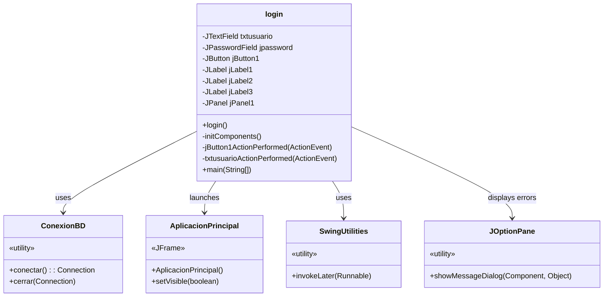
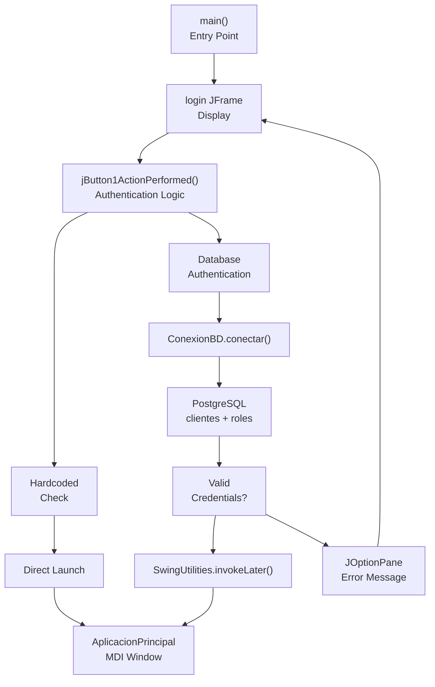

# Authentication System

> **Relevant source files**
> * [src/main/java/com/adso/el_taller_de_adso/login/login.form](https://github.com/BrayanTirado/Servicio-Mec-nico/blob/b80161f0/src/main/java/com/adso/el_taller_de_adso/login/login.form)
> * [src/main/java/com/adso/el_taller_de_adso/login/login.java](https://github.com/BrayanTirado/Servicio-Mec-nico/blob/b80161f0/src/main/java/com/adso/el_taller_de_adso/login/login.java)

## Purpose and Scope

This document describes the authentication mechanism that controls access to El Taller de ADSO application. The authentication system is implemented in the `login` class and serves as the entry point for all users. Upon successful authentication, the system launches the main MDI application interface.

For information about the main application window that opens after authentication, see [Main Application Window](/BrayanTirado/Servicio-Mec-nico/3.1-main-application-window). For details about database connection management used during authentication, see [Database Layer](/BrayanTirado/Servicio-Mec-nico/3.2-database-layer).

---

## User Interface Components

The login screen is a standalone `JFrame` that displays before any other application windows. It uses the NetBeans GUI Builder (AbsoluteLayout) for visual design.

| Component | Variable Name | Type | Purpose |
| --- | --- | --- | --- |
| Username Field | `txtusuario` | `JTextField` | Accepts email address or "Admin" |
| Password Field | `jpassword` | `JPasswordField` | Accepts password in masked format |
| Login Button | `jButton1` | `JButton` | Triggers authentication process |
| Title Label | `jLabel3` | `JLabel` | Displays "El Taller Mécanico de ADSO" |

The form uses Comic Sans MS font throughout and has a light purple background (`#CCCCFF`). The window is set to be always on top and centers itself on the screen at launch [src/main/java/com/adso/el_taller_de_adso/login/login.java L50-L137](https://github.com/BrayanTirado/Servicio-Mec-nico/blob/b80161f0/src/main/java/com/adso/el_taller_de_adso/login/login.java#L50-L137)

**Sources:** [src/main/java/com/adso/el_taller_de_adso/login/login.java L38-L138](https://github.com/BrayanTirado/Servicio-Mec-nico/blob/b80161f0/src/main/java/com/adso/el_taller_de_adso/login/login.java#L38-L138)

 [src/main/java/com/adso/el_taller_de_adso/login/login.form L1-L181](https://github.com/BrayanTirado/Servicio-Mec-nico/blob/b80161f0/src/main/java/com/adso/el_taller_de_adso/login/login.form#L1-L181)

---

## Authentication Flow

```

```

**Diagram: Complete Authentication Flow**

The authentication process begins when the user clicks the "Ingresar" button, which triggers the `jButton1ActionPerformed` event handler [src/main/java/com/adso/el_taller_de_adso/login/login.java L144-L203](https://github.com/BrayanTirado/Servicio-Mec-nico/blob/b80161f0/src/main/java/com/adso/el_taller_de_adso/login/login.java#L144-L203)

 The system follows a two-tier authentication strategy: first checking for hardcoded Super Admin credentials, then falling back to database authentication for regular users.

**Sources:** [src/main/java/com/adso/el_taller_de_adso/login/login.java L144-L203](https://github.com/BrayanTirado/Servicio-Mec-nico/blob/b80161f0/src/main/java/com/adso/el_taller_de_adso/login/login.java#L144-L203)

---

## Super Admin Access

The system includes a hardcoded administrative account that bypasses database authentication entirely. This Super Admin access is checked before any database queries are executed.

### Hardcoded Credentials

```yaml
Username: Admin
Password: super123
```

The Super Admin check is implemented as a simple string comparison [src/main/java/com/adso/el_taller_de_adso/login/login.java L154-L160](https://github.com/BrayanTirado/Servicio-Mec-nico/blob/b80161f0/src/main/java/com/adso/el_taller_de_adso/login/login.java#L154-L160)

:

```

```

When Super Admin credentials are detected, the system:

1. Immediately disposes the login window
2. Instantiates `AplicacionPrincipal` directly
3. Makes it visible
4. Returns early, skipping all database operations

This approach provides emergency access to the system even if the database is unavailable, but presents security risks as the credentials are visible in the source code.

**Sources:** [src/main/java/com/adso/el_taller_de_adso/login/login.java L154-L160](https://github.com/BrayanTirado/Servicio-Mec-nico/blob/b80161f0/src/main/java/com/adso/el_taller_de_adso/login/login.java#L154-L160)

---

## Database Authentication

For non-Super Admin users, the system authenticates against the `clientes` and `roles` tables in the PostgreSQL database.

### Authentication Query

```css
#mermaid-fsofsw0iwvb{font-family:ui-sans-serif,-apple-system,system-ui,Segoe UI,Helvetica;font-size:16px;fill:#333;}@keyframes edge-animation-frame{from{stroke-dashoffset:0;}}@keyframes dash{to{stroke-dashoffset:0;}}#mermaid-fsofsw0iwvb .edge-animation-slow{stroke-dasharray:9,5!important;stroke-dashoffset:900;animation:dash 50s linear infinite;stroke-linecap:round;}#mermaid-fsofsw0iwvb .edge-animation-fast{stroke-dasharray:9,5!important;stroke-dashoffset:900;animation:dash 20s linear infinite;stroke-linecap:round;}#mermaid-fsofsw0iwvb .error-icon{fill:#dddddd;}#mermaid-fsofsw0iwvb .error-text{fill:#222222;stroke:#222222;}#mermaid-fsofsw0iwvb .edge-thickness-normal{stroke-width:1px;}#mermaid-fsofsw0iwvb .edge-thickness-thick{stroke-width:3.5px;}#mermaid-fsofsw0iwvb .edge-pattern-solid{stroke-dasharray:0;}#mermaid-fsofsw0iwvb .edge-thickness-invisible{stroke-width:0;fill:none;}#mermaid-fsofsw0iwvb .edge-pattern-dashed{stroke-dasharray:3;}#mermaid-fsofsw0iwvb .edge-pattern-dotted{stroke-dasharray:2;}#mermaid-fsofsw0iwvb .marker{fill:#999;stroke:#999;}#mermaid-fsofsw0iwvb .marker.cross{stroke:#999;}#mermaid-fsofsw0iwvb svg{font-family:ui-sans-serif,-apple-system,system-ui,Segoe UI,Helvetica;font-size:16px;}#mermaid-fsofsw0iwvb p{margin:0;}#mermaid-fsofsw0iwvb .entityBox{fill:#ffffff;stroke:#dddddd;}#mermaid-fsofsw0iwvb .relationshipLabelBox{fill:#dddddd;opacity:0.7;background-color:#dddddd;}#mermaid-fsofsw0iwvb .relationshipLabelBox rect{opacity:0.5;}#mermaid-fsofsw0iwvb .labelBkg{background-color:rgba(221, 221, 221, 0.5);}#mermaid-fsofsw0iwvb .edgeLabel .label{fill:#dddddd;font-size:14px;}#mermaid-fsofsw0iwvb .label{font-family:ui-sans-serif,-apple-system,system-ui,Segoe UI,Helvetica;color:#333;}#mermaid-fsofsw0iwvb .edge-pattern-dashed{stroke-dasharray:8,8;}#mermaid-fsofsw0iwvb .node rect,#mermaid-fsofsw0iwvb .node circle,#mermaid-fsofsw0iwvb .node ellipse,#mermaid-fsofsw0iwvb .node polygon{fill:#ffffff;stroke:#dddddd;stroke-width:1px;}#mermaid-fsofsw0iwvb .relationshipLine{stroke:#999;stroke-width:1;fill:none;}#mermaid-fsofsw0iwvb .marker{fill:none!important;stroke:#999!important;stroke-width:1;}#mermaid-fsofsw0iwvb :root{--mermaid-font-family:"trebuchet ms",verdana,arial,sans-serif;}hasclientesintidPKstringcorreoUsed for loginstringpasswordPlain textintrolFKstringnombrerolesintidPKstringnombreRole name
```

**Diagram: Database Tables Used in Authentication**

The authentication query joins `clientes` and `roles` tables to retrieve both user information and role assignment [src/main/java/com/adso/el_taller_de_adso/login/login.java L166-L169](https://github.com/BrayanTirado/Servicio-Mec-nico/blob/b80161f0/src/main/java/com/adso/el_taller_de_adso/login/login.java#L166-L169)

:

```

```

### Query Execution Process

The database authentication follows these steps:

1. **Connection Establishment**: Obtains a connection via `ConexionBD.conectar()` [src/main/java/com/adso/el_taller_de_adso/login/login.java L163-L164](https://github.com/BrayanTirado/Servicio-Mec-nico/blob/b80161f0/src/main/java/com/adso/el_taller_de_adso/login/login.java#L163-L164)
2. **Prepared Statement**: Creates a `PreparedStatement` with parameterized query [src/main/java/com/adso/el_taller_de_adso/login/login.java L171-L173](https://github.com/BrayanTirado/Servicio-Mec-nico/blob/b80161f0/src/main/java/com/adso/el_taller_de_adso/login/login.java#L171-L173)
3. **Parameter Binding**: Sets email and password as query parameters
4. **Result Processing**: Executes query and checks for matching records [src/main/java/com/adso/el_taller_de_adso/login/login.java L175-L192](https://github.com/BrayanTirado/Servicio-Mec-nico/blob/b80161f0/src/main/java/com/adso/el_taller_de_adso/login/login.java#L175-L192)

### Successful Authentication

When authentication succeeds (ResultSet contains a row), the system:

* Extracts the user's `nombre` and `rol` from the result set [src/main/java/com/adso/el_taller_de_adso/login/login.java L177-L179](https://github.com/BrayanTirado/Servicio-Mec-nico/blob/b80161f0/src/main/java/com/adso/el_taller_de_adso/login/login.java#L177-L179)
* Disposes the login window [src/main/java/com/adso/el_taller_de_adso/login/login.java L182](https://github.com/BrayanTirado/Servicio-Mec-nico/blob/b80161f0/src/main/java/com/adso/el_taller_de_adso/login/login.java#L182-L182)
* Launches `AplicacionPrincipal` on the Event Dispatch Thread using `SwingUtilities.invokeLater` [src/main/java/com/adso/el_taller_de_adso/login/login.java L185-L189](https://github.com/BrayanTirado/Servicio-Mec-nico/blob/b80161f0/src/main/java/com/adso/el_taller_de_adso/login/login.java#L185-L189)
* Closes database resources (ResultSet, PreparedStatement, Connection) [src/main/java/com/adso/el_taller_de_adso/login/login.java L194-L196](https://github.com/BrayanTirado/Servicio-Mec-nico/blob/b80161f0/src/main/java/com/adso/el_taller_de_adso/login/login.java#L194-L196)

### Failed Authentication

When credentials don't match any database record:

* Displays `JOptionPane` with message "Usuario o contraseña incorrectos" [src/main/java/com/adso/el_taller_de_adso/login/login.java L191](https://github.com/BrayanTirado/Servicio-Mec-nico/blob/b80161f0/src/main/java/com/adso/el_taller_de_adso/login/login.java#L191-L191)
* Closes all database resources
* Remains on the login screen for retry

**Sources:** [src/main/java/com/adso/el_taller_de_adso/login/login.java L162-L202](https://github.com/BrayanTirado/Servicio-Mec-nico/blob/b80161f0/src/main/java/com/adso/el_taller_de_adso/login/login.java#L162-L202)

---

## Security Considerations

The current authentication implementation has several security limitations:

### Plain Text Password Storage

Passwords are stored in plain text in the `clientes.password` column and compared directly in SQL queries [src/main/java/com/adso/el_taller_de_adso/login/login.java L169](https://github.com/BrayanTirado/Servicio-Mec-nico/blob/b80161f0/src/main/java/com/adso/el_taller_de_adso/login/login.java#L169-L169)

 The system does not use:

* Password hashing (e.g., bcrypt, PBKDF2)
* Salt values
* Any encryption mechanism

### Hardcoded Credentials

The Super Admin credentials are embedded in source code [src/main/java/com/adso/el_taller_de_adso/login/login.java L155](https://github.com/BrayanTirado/Servicio-Mec-nico/blob/b80161f0/src/main/java/com/adso/el_taller_de_adso/login/login.java#L155-L155)

 making them visible to anyone with repository access. These credentials cannot be changed without recompiling the application.

### No Session Management

After successful authentication, the system:

* Does not maintain session state
* Does not track the authenticated user identity in subsequent operations
* Does not implement logout functionality
* Does not enforce session timeouts

The retrieved `nombre` and `rol` values are not stored or passed to `AplicacionPrincipal` [src/main/java/com/adso/el_taller_de_adso/login/login.java L186-L188](https://github.com/BrayanTirado/Servicio-Mec-nico/blob/b80161f0/src/main/java/com/adso/el_taller_de_adso/login/login.java#L186-L188)

 meaning the application does not enforce role-based access control.

### Input Validation

Input validation is minimal:

* Only checks for empty fields [src/main/java/com/adso/el_taller_de_adso/login/login.java L149-L152](https://github.com/BrayanTirado/Servicio-Mec-nico/blob/b80161f0/src/main/java/com/adso/el_taller_de_adso/login/login.java#L149-L152)
* No email format validation
* No password complexity requirements
* No protection against SQL injection (mitigated by using PreparedStatement)

### Error Information Disclosure

Failed login attempts display a generic error message [src/main/java/com/adso/el_taller_de_adso/login/login.java L191](https://github.com/BrayanTirado/Servicio-Mec-nico/blob/b80161f0/src/main/java/com/adso/el_taller_de_adso/login/login.java#L191-L191)

 which is good practice. However, database errors are displayed with full exception details [src/main/java/com/adso/el_taller_de_adso/login/login.java L199](https://github.com/BrayanTirado/Servicio-Mec-nico/blob/b80161f0/src/main/java/com/adso/el_taller_de_adso/login/login.java#L199-L199)

 potentially revealing database structure information.

### No Account Lockout

The system does not implement:

* Failed login attempt tracking
* Account lockout after multiple failures
* CAPTCHA or rate limiting
* Brute force protection

**Sources:** [src/main/java/com/adso/el_taller_de_adso/login/login.java L144-L203](https://github.com/BrayanTirado/Servicio-Mec-nico/blob/b80161f0/src/main/java/com/adso/el_taller_de_adso/login/login.java#L144-L203)

---

## Code Structure



**Diagram: Login Class Dependencies**

### Class: login

The `login` class extends `javax.swing.JFrame` and serves as the application entry point [src/main/java/com/adso/el_taller_de_adso/login/login.java L23](https://github.com/BrayanTirado/Servicio-Mec-nico/blob/b80161f0/src/main/java/com/adso/el_taller_de_adso/login/login.java#L23-L23)

**Key Methods:**

| Method | Lines | Purpose |
| --- | --- | --- |
| `login()` | 28-30 | Constructor that calls `initComponents()` |
| `initComponents()` | 39-138 | NetBeans-generated UI initialization code |
| `jButton1ActionPerformed(ActionEvent)` | 144-203 | Main authentication logic triggered by login button |
| `txtusuarioActionPerformed(ActionEvent)` | 140-142 | Empty handler (placeholder for Enter key in username field) |
| `main(String[])` | 208-238 | Application entry point that sets Nimbus look-and-feel |

### Main Method

The `main` method configures the Nimbus look-and-feel if available [src/main/java/com/adso/el_taller_de_adso/login/login.java L214-L229](https://github.com/BrayanTirado/Servicio-Mec-nico/blob/b80161f0/src/main/java/com/adso/el_taller_de_adso/login/login.java#L214-L229)

 and launches the login window on the Event Dispatch Thread [src/main/java/com/adso/el_taller_de_adso/login/login.java L233-L237](https://github.com/BrayanTirado/Servicio-Mec-nico/blob/b80161f0/src/main/java/com/adso/el_taller_de_adso/login/login.java#L233-L237)

### UI Components Initialization

The `initComponents()` method is auto-generated by NetBeans GUI Builder and should not be manually modified [src/main/java/com/adso/el_taller_de_adso/login/login.java L33-L36](https://github.com/BrayanTirado/Servicio-Mec-nico/blob/b80161f0/src/main/java/com/adso/el_taller_de_adso/login/login.java#L33-L36)

 It sets up:

* Form layout using GroupLayout
* Component properties (fonts, colors, borders)
* Event handlers for button clicks
* Window properties (size, position, close operation)

**Sources:** [src/main/java/com/adso/el_taller_de_adso/login/login.java L23-L250](https://github.com/BrayanTirado/Servicio-Mec-nico/blob/b80161f0/src/main/java/com/adso/el_taller_de_adso/login/login.java#L23-L250)

---

## Integration Points



**Diagram: Authentication System Integration**

The authentication system integrates with three main external components:

1. **ConexionBD**: Provides database connection management [src/main/java/com/adso/el_taller_de_adso/login/login.java L8](https://github.com/BrayanTirado/Servicio-Mec-nico/blob/b80161f0/src/main/java/com/adso/el_taller_de_adso/login/login.java#L8-L8)
2. **AplicacionPrincipal**: The main MDI application window launched on success [src/main/java/com/adso/el_taller_de_adso/login/login.java L7](https://github.com/BrayanTirado/Servicio-Mec-nico/blob/b80161f0/src/main/java/com/adso/el_taller_de_adso/login/login.java#L7-L7)
3. **PostgreSQL Database**: Stores user credentials in `clientes` table with role associations

The login window is completely independent and has no parent frame. It terminates itself via `dispose()` upon successful authentication, with no mechanism to return to the login screen without restarting the application.

**Sources:** [src/main/java/com/adso/el_taller_de_adso/login/login.java L5-L16](https://github.com/BrayanTirado/Servicio-Mec-nico/blob/b80161f0/src/main/java/com/adso/el_taller_de_adso/login/login.java#L5-L16)

 [src/main/java/com/adso/el_taller_de_adso/login/login.java L144-L203](https://github.com/BrayanTirado/Servicio-Mec-nico/blob/b80161f0/src/main/java/com/adso/el_taller_de_adso/login/login.java#L144-L203)