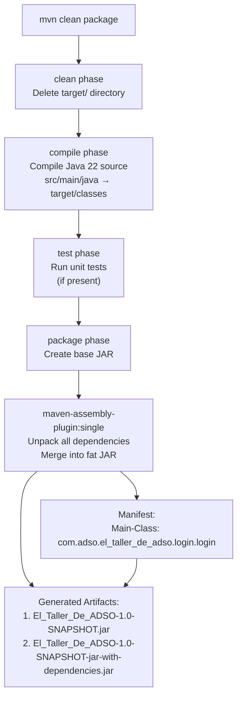
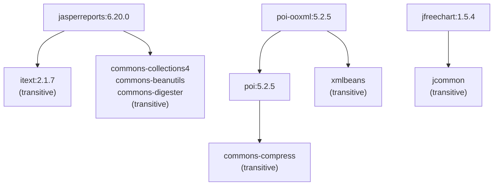

# Build Configuration and Dependencies

> **Relevant source files**
> * [pom.xml](https://github.com/BrayanTirado/Servicio-Mec-nico/blob/b80161f0/pom.xml)

This page documents the Maven build configuration, Java platform requirements, and third-party library dependencies for El Taller de ADSO. It covers the build process for generating executable JAR artifacts and explains the purpose of each dependency in the technology stack.

For information about database configuration and connection management, see [Database Layer](/BrayanTirado/Servicio-Mec-nico/3.2-database-layer).

---

## Build System Overview

El Taller de ADSO uses **Maven** as its build automation tool with the following project coordinates:

| Property | Value |
| --- | --- |
| **GroupId** | `com.adso` |
| **ArtifactId** | `El_Taller_De_ADSO` |
| **Version** | `1.0-SNAPSHOT` |
| **Packaging** | `jar` |
| **Main Class** | `com.adso.el_taller_de_adso.login.login` |

The build configuration is defined in [pom.xml L1-L95](https://github.com/BrayanTirado/Servicio-Mec-nico/blob/b80161f0/pom.xml#L1-L95)

 and uses the `maven-assembly-plugin` to create a self-contained executable JAR with all dependencies bundled.

**Sources:** [pom.xml L1-L95](https://github.com/BrayanTirado/Servicio-Mec-nico/blob/b80161f0/pom.xml#L1-L95)

---

## Java Platform Requirements

The application targets **Java 22** as both source and target compatibility level:

```

```

This configuration is set in [pom.xml L16-L17](https://github.com/BrayanTirado/Servicio-Mec-nico/blob/b80161f0/pom.xml#L16-L17)

 and requires a Java 22 (or later) JDK for compilation. The runtime environment must also have Java 22 or later installed.

**Character Encoding:** UTF-8 is specified as the project source encoding in [pom.xml L15](https://github.com/BrayanTirado/Servicio-Mec-nico/blob/b80161f0/pom.xml#L15-L15)

**Sources:** [pom.xml L14-L19](https://github.com/BrayanTirado/Servicio-Mec-nico/blob/b80161f0/pom.xml#L14-L19)

---

## Dependency Architecture

The following diagram illustrates how dependencies are organized by functional domain and their relationships to application layers:

### Dependency Domain Mapping

```

```

**Sources:** [pom.xml L21-L67](https://github.com/BrayanTirado/Servicio-Mec-nico/blob/b80161f0/pom.xml#L21-L67)

---

## Core Dependencies

### Database Connectivity

#### PostgreSQL JDBC Driver (42.7.1)

```

```

**Declared at:** [pom.xml L22-L26](https://github.com/BrayanTirado/Servicio-Mec-nico/blob/b80161f0/pom.xml#L22-L26)

**Purpose:** Provides JDBC connectivity to PostgreSQL databases. Used by `ConexionBD` class for establishing database connections and by all DAO classes for executing SQL queries.

**Usage Pattern:** Direct JDBC (no ORM framework). All database operations use raw `Connection`, `PreparedStatement`, and `ResultSet` objects.

**Sources:** [pom.xml L22-L26](https://github.com/BrayanTirado/Servicio-Mec-nico/blob/b80161f0/pom.xml#L22-L26)

---

### User Interface Libraries

#### JCalendar (1.4)

```

```

**Declared at:** [pom.xml L27-L31](https://github.com/BrayanTirado/Servicio-Mec-nico/blob/b80161f0/pom.xml#L27-L31)

**Purpose:** Provides `JDateChooser` component for date selection in Swing forms. Used extensively in service management forms where date entry is required (e.g., service creation date, service history queries).

**Key Component:** `com.toedter.calendar.JDateChooser`

**Sources:** [pom.xml L27-L31](https://github.com/BrayanTirado/Servicio-Mec-nico/blob/b80161f0/pom.xml#L27-L31)

---

#### AbsoluteLayout (RELEASE260)

```

```

**Declared at:** [pom.xml L32-L36](https://github.com/BrayanTirado/Servicio-Mec-nico/blob/b80161f0/pom.xml#L32-L36)

**Purpose:** Layout manager used by NetBeans GUI Builder (Matisse) for visual form design. Allows absolute pixel positioning of components, which is the default layout generated by NetBeans visual editor.

**Note:** This dependency indicates the UI forms were designed using NetBeans IDE's visual form designer.

**Sources:** [pom.xml L32-L36](https://github.com/BrayanTirado/Servicio-Mec-nico/blob/b80161f0/pom.xml#L32-L36)

---

### Reporting and Document Generation

The application includes a comprehensive reporting stack for generating business reports in multiple formats.

#### JasperReports (6.20.0)

```

```

**Declared at:** [pom.xml L37-L41](https://github.com/BrayanTirado/Servicio-Mec-nico/blob/b80161f0/pom.xml#L37-L41)

**Purpose:** Enterprise reporting engine for designing and generating reports. Supports report templates defined in JRXML format, data source integration, and export to multiple formats (PDF, Excel, HTML).

**Typical Usage:** Report generation from database queries with parameterized templates.

**Sources:** [pom.xml L37-L41](https://github.com/BrayanTirado/Servicio-Mec-nico/blob/b80161f0/pom.xml#L37-L41)

---

#### JasperReports Functions (6.20.0)

```

```

**Declared at:** [pom.xml L42-L46](https://github.com/BrayanTirado/Servicio-Mec-nico/blob/b80161f0/pom.xml#L42-L46)

**Purpose:** Extension library providing additional formula and calculation functions for use within JasperReports expressions (e.g., statistical functions, date/time operations, text manipulation).

**Sources:** [pom.xml L42-L46](https://github.com/BrayanTirado/Servicio-Mec-nico/blob/b80161f0/pom.xml#L42-L46)

---

#### iText (2.1.7)

```

```

**Declared at:** [pom.xml L47-L51](https://github.com/BrayanTirado/Servicio-Mec-nico/blob/b80161f0/pom.xml#L47-L51)

**Purpose:** PDF generation library. This is a transitive dependency required by JasperReports for PDF export functionality. While JasperReports can use newer iText versions, version 2.1.7 is used here as it's the last version under LGPL/MPL license (later versions use AGPL).

**Note:** Primarily used indirectly through JasperReports rather than direct API calls.

**Sources:** [pom.xml L47-L51](https://github.com/BrayanTirado/Servicio-Mec-nico/blob/b80161f0/pom.xml#L47-L51)

---

### Data Export Dependencies

#### Apache POI (5.2.5)

```

```

**Declared at:** [pom.xml L52-L56](https://github.com/BrayanTirado/Servicio-Mec-nico/blob/b80161f0/pom.xml#L52-L56)

**Purpose:** Core library for reading and writing Microsoft Office binary formats (.xls, .doc). Provides API for creating and manipulating Excel 97-2003 workbooks.

**Sources:** [pom.xml L52-L56](https://github.com/BrayanTirado/Servicio-Mec-nico/blob/b80161f0/pom.xml#L52-L56)

---

#### Apache POI OOXML (5.2.5)

```

```

**Declared at:** [pom.xml L57-L61](https://github.com/BrayanTirado/Servicio-Mec-nico/blob/b80161f0/pom.xml#L57-L61)

**Purpose:** Extension of Apache POI for Office Open XML formats (.xlsx, .docx). Enables export of inventory reports and service data to modern Excel format.

**Dependency Chain:** Requires `poi` as base library.

**Sources:** [pom.xml L57-L61](https://github.com/BrayanTirado/Servicio-Mec-nico/blob/b80161f0/pom.xml#L57-L61)

---

### Data Visualization

#### JFreeChart (1.5.4)

```

```

**Declared at:** [pom.xml L62-L66](https://github.com/BrayanTirado/Servicio-Mec-nico/blob/b80161f0/pom.xml#L62-L66)

**Purpose:** Comprehensive charting library for creating 2D charts in Java applications. Supports multiple chart types including bar charts, pie charts, line charts, and time series visualizations.

**Usage Context:** Likely used in reporting modules for visualizing service statistics, inventory levels, or revenue trends.

**Sources:** [pom.xml L62-L66](https://github.com/BrayanTirado/Servicio-Mec-nico/blob/b80161f0/pom.xml#L62-L66)

---

## Build Configuration

### Maven Assembly Plugin

The build process uses `maven-assembly-plugin` to create a fat JAR (JAR with all dependencies included):

```

```

**Declared at:** [pom.xml L69-L93](https://github.com/BrayanTirado/Servicio-Mec-nico/blob/b80161f0/pom.xml#L69-L93)

**Configuration Details:**

| Configuration Element | Value | Purpose |
| --- | --- | --- |
| **Phase** | `package` | Plugin executes during Maven package phase |
| **Goal** | `single` | Creates a single assembled artifact |
| **Descriptor** | `jar-with-dependencies` | Bundles all dependencies into JAR |
| **Main Class** | `com.adso.el_taller_de_adso.login.login` | Entry point for executable JAR |

**Output Artifact:** `El_Taller_De_ADSO-1.0-SNAPSHOT-jar-with-dependencies.jar`

**Sources:** [pom.xml L69-L93](https://github.com/BrayanTirado/Servicio-Mec-nico/blob/b80161f0/pom.xml#L69-L93)

---

## Build Process Flow

The following diagram illustrates the Maven build lifecycle and artifact generation:

### Maven Build Lifecycle



**Build Commands:**

```

```

**Sources:** [pom.xml L69-L93](https://github.com/BrayanTirado/Servicio-Mec-nico/blob/b80161f0/pom.xml#L69-L93)

---

## Dependency Summary Table

The following table provides a quick reference for all dependencies:

| Dependency | Version | Category | Size Impact | Primary Use Case |
| --- | --- | --- | --- | --- |
| `postgresql` | 42.7.1 | Database | ~1.5 MB | JDBC connectivity to PostgreSQL |
| `jcalendar` | 1.4 | UI Component | ~200 KB | Date picker widgets in forms |
| `AbsoluteLayout` | RELEASE260 | UI Layout | ~20 KB | NetBeans GUI Builder support |
| `jasperreports` | 6.20.0 | Reporting | ~10 MB | Report generation engine |
| `jasperreports-functions` | 6.20.0 | Reporting | ~500 KB | Extended report functions |
| `itext` | 2.1.7 | Document | ~1.5 MB | PDF generation (via JasperReports) |
| `poi` | 5.2.5 | Data Export | ~5 MB | Excel binary format support |
| `poi-ooxml` | 5.2.5 | Data Export | ~8 MB | Excel OpenXML format support |
| `jfreechart` | 1.5.4 | Visualization | ~2 MB | Chart generation |

**Total Approximate JAR Size:** ~35-40 MB (including transitive dependencies)

**Sources:** [pom.xml L21-L67](https://github.com/BrayanTirado/Servicio-Mec-nico/blob/b80161f0/pom.xml#L21-L67)

---

## Version Compatibility Notes

### Java Version Requirement

The application **requires Java 22** due to the compiler source/target configuration in [pom.xml L16-L17](https://github.com/BrayanTirado/Servicio-Mec-nico/blob/b80161f0/pom.xml#L16-L17)

 Using an older Java version will result in compilation errors or runtime incompatibilities.

### PostgreSQL Driver Compatibility

PostgreSQL JDBC driver 42.7.1 supports:

* PostgreSQL server versions 11 and later
* JDBC 4.2 specification
* Java 8 and later (compatible with Java 22)

### Third-Party Library Maturity

All dependencies use stable release versions:

* **JasperReports 6.20.0:** Released in 2022, stable enterprise reporting platform
* **Apache POI 5.2.5:** Released in 2023, mature Office document library
* **JFreeChart 1.5.4:** Released in 2022, long-standing visualization library
* **iText 2.1.7:** Legacy version (2009) used for licensing compatibility

**Sources:** [pom.xml L21-L67](https://github.com/BrayanTirado/Servicio-Mec-nico/blob/b80161f0/pom.xml#L21-L67)

---

## Transitive Dependencies

Maven automatically resolves transitive dependencies (dependencies of dependencies). Key transitive dependency chains include:



**Note:** Maven handles transitive dependency resolution automatically. The `pom.xml` only declares direct dependencies.

**Sources:** [pom.xml L21-L67](https://github.com/BrayanTirado/Servicio-Mec-nico/blob/b80161f0/pom.xml#L21-L67)

---

## Building From Source

### Prerequisites

1. **Java Development Kit 22** or later installed
2. **Maven 3.6+** installed and available on PATH
3. **Git** for cloning the repository

### Build Steps

```

```

### Execution

```

```

The application will launch with the login screen defined by the `com.adso.el_taller_de_adso.login.login` main class (see [pom.xml L18](https://github.com/BrayanTirado/Servicio-Mec-nico/blob/b80161f0/pom.xml#L18-L18)

 and [pom.xml L83](https://github.com/BrayanTirado/Servicio-Mec-nico/blob/b80161f0/pom.xml#L83-L83)

).

**Sources:** [pom.xml L1-L95](https://github.com/BrayanTirado/Servicio-Mec-nico/blob/b80161f0/pom.xml#L1-L95)

---

## Development Environment Integration

### NetBeans Integration

The presence of `AbsoluteLayout` dependency indicates the project was developed using **NetBeans IDE**. To open in NetBeans:

1. Open NetBeans IDE
2. File → Open Project
3. Select the project root directory
4. NetBeans will recognize it as a Maven project

### IntelliJ IDEA / Eclipse

Both IDEs support Maven projects natively:

* IntelliJ IDEA: File → Open → Select `pom.xml`
* Eclipse: File → Import → Maven → Existing Maven Projects

Maven will automatically download all dependencies on first project import.

**Sources:** [pom.xml L32-L36](https://github.com/BrayanTirado/Servicio-Mec-nico/blob/b80161f0/pom.xml#L32-L36)