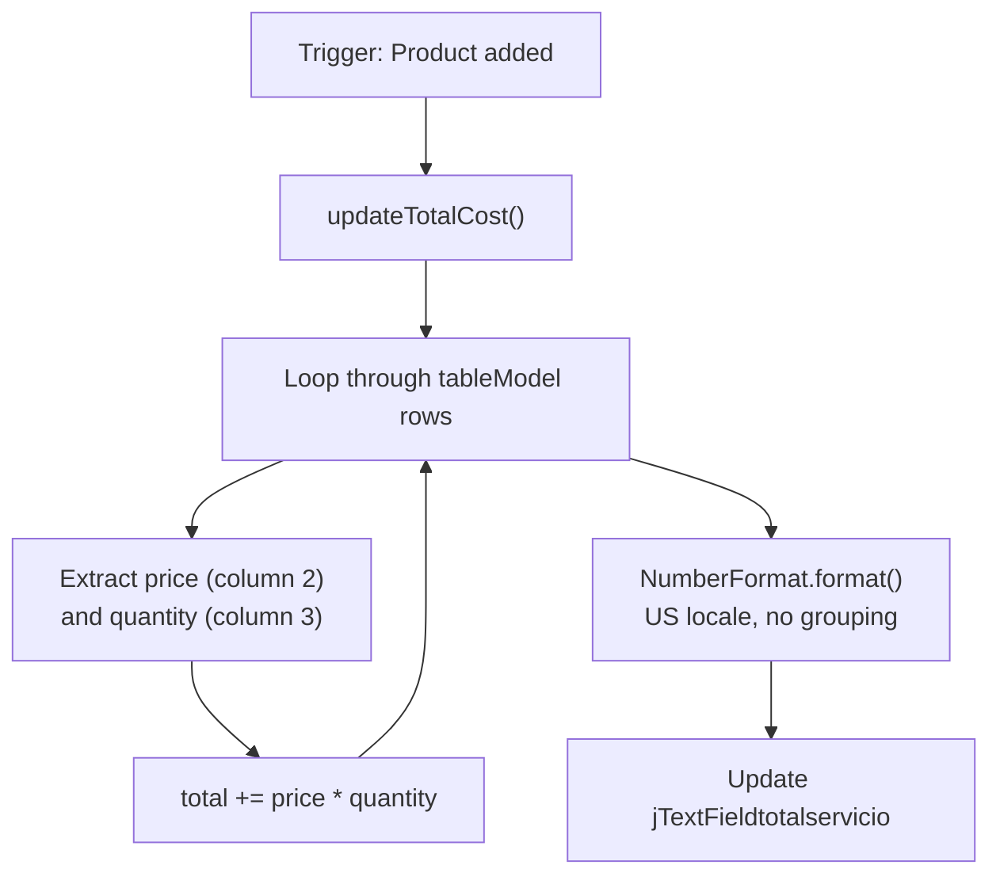
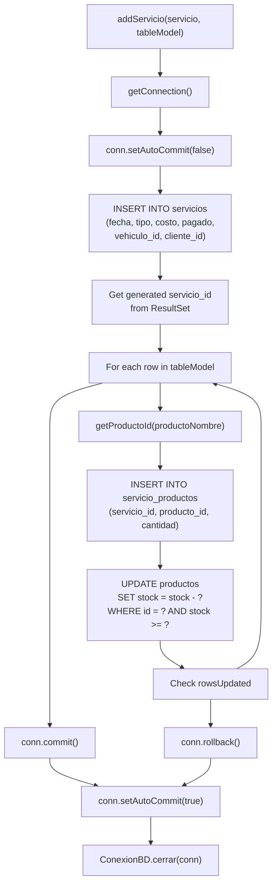

# Creating Services

> **Relevant source files**
> * [libs/jcalendar-1.4.jar](https://github.com/BrayanTirado/Servicio-Mec-nico/blob/b80161f0/libs/jcalendar-1.4.jar)
> * [src/main/java/com/adso/el_taller_de_adso/ConexionBD.java](https://github.com/BrayanTirado/Servicio-Mec-nico/blob/b80161f0/src/main/java/com/adso/el_taller_de_adso/ConexionBD.java)
> * [src/main/java/com/adso/el_taller_de_adso/servicios/MarcoServicios.form](https://github.com/BrayanTirado/Servicio-Mec-nico/blob/b80161f0/src/main/java/com/adso/el_taller_de_adso/servicios/MarcoServicios.form)
> * [src/main/java/com/adso/el_taller_de_adso/servicios/MarcoServicios.java](https://github.com/BrayanTirado/Servicio-Mec-nico/blob/b80161f0/src/main/java/com/adso/el_taller_de_adso/servicios/MarcoServicios.java)
> * [src/main/java/com/adso/el_taller_de_adso/servicios/Servicio.java](https://github.com/BrayanTirado/Servicio-Mec-nico/blob/b80161f0/src/main/java/com/adso/el_taller_de_adso/servicios/Servicio.java)
> * [src/main/java/com/adso/el_taller_de_adso/servicios/ServicioDAO.java](https://github.com/BrayanTirado/Servicio-Mec-nico/blob/b80161f0/src/main/java/com/adso/el_taller_de_adso/servicios/ServicioDAO.java)

## Purpose and Scope

This document describes the service creation workflow implemented in the `MarcoServicios` JInternalFrame. This interface allows users to register new mechanic services by associating a service date, service type, client, and vehicle with one or more products/parts used during the service. The system enforces stock validation, calculates total costs, and persists data transactionally to ensure data integrity.

For information about viewing service history, see [Service History Viewer](/BrayanTirado/Servicio-Mec-nico/4.2-service-history-viewer). For product/inventory management capabilities, see [Inventory Management Module](/BrayanTirado/Servicio-Mec-nico/5-inventory-management-module).

---

## Service Creation Interface Components

The `MarcoServicios` class is the primary UI component for creating services. It extends `JInternalFrame` and is launched from the Servicios menu in the main MDI application.

**Sources:** [src/main/java/com/adso/el_taller_de_adso/servicios/MarcoServicios.java L19-L30](https://github.com/BrayanTirado/Servicio-Mec-nico/blob/b80161f0/src/main/java/com/adso/el_taller_de_adso/servicios/MarcoServicios.java#L19-L30)

### Form Fields

The service creation form consists of the following input components:

| Component | Variable Name | Type | Purpose |
| --- | --- | --- | --- |
| Service Date | `jDateChooserfechadelservicio` | `JDateChooser` | Captures the date when the service was performed |
| Service Type | `jComboBoxtipodeservicio` | `JComboBox<String>` | Dropdown with predefined service types |
| Client Selection | `jComboBoxseleccioncliente` | `JComboBox<String>` | Dropdown populated with client names from database |
| Vehicle Selection | `jComboBoxseleccionvehiculo` | `JComboBox<String>` | Dropdown populated with vehicle license plates from database |
| Selected Products | `jTableproductosseleccionados` | `JTable` | Table displaying selected products with columns: Nombre, Descripción, Precio unitario, Cantidad disponible |
| Total Cost | `jTextFieldtotalservicio` | `JTextField` | Read-only field displaying the calculated total service cost |

**Sources:** [src/main/java/com/adso/el_taller_de_adso/servicios/MarcoServicios.java L343-L362](https://github.com/BrayanTirado/Servicio-Mec-nico/blob/b80161f0/src/main/java/com/adso/el_taller_de_adso/servicios/MarcoServicios.java#L343-L362)

 [src/main/java/com/adso/el_taller_de_adso/servicios/MarcoServicios.form L169-L349](https://github.com/BrayanTirado/Servicio-Mec-nico/blob/b80161f0/src/main/java/com/adso/el_taller_de_adso/servicios/MarcoServicios.form#L169-L349)

### Form Initialization

The `initializeComponents()` method is called during construction to populate combo boxes with database data and configure UI components:

```

```

**Diagram 1: Form Initialization Sequence**

The service types are hardcoded as: `"cambio de aceite"`, `"lavado"`, `"mantenimiento general"`.

**Sources:** [src/main/java/com/adso/el_taller_de_adso/servicios/MarcoServicios.java L32-L41](https://github.com/BrayanTirado/Servicio-Mec-nico/blob/b80161f0/src/main/java/com/adso/el_taller_de_adso/servicios/MarcoServicios.java#L32-L41)

 [src/main/java/com/adso/el_taller_de_adso/servicios/ServicioDAO.java L46-L84](https://github.com/BrayanTirado/Servicio-Mec-nico/blob/b80161f0/src/main/java/com/adso/el_taller_de_adso/servicios/ServicioDAO.java#L46-L84)

---

## Product Selection Workflow

The product addition process is triggered by the "Agregar repuestos" button and follows a multi-step interactive workflow:

```mermaid
sequenceDiagram
  participant jButtonagregarrepuestos
  participant jButtonagregarrepuestosActionPerformed()
  participant ServicioDAO
  participant JOptionPane
  participant jTableproductosseleccionados
  participant updateTotalCost()

  jButtonagregarrepuestos->>jButtonagregarrepuestos: Click "Agregar repuestos"
  jButtonagregarrepuestos->>jButtonagregarrepuestosActionPerformed(): actionPerformed event
  jButtonagregarrepuestosActionPerformed()->>ServicioDAO: getAllProductos()
  ServicioDAO-->>jButtonagregarrepuestosActionPerformed(): List<String> product names
  jButtonagregarrepuestosActionPerformed()->>JOptionPane: showInputDialog()
  JOptionPane-->>jButtonagregarrepuestos: with product list
  jButtonagregarrepuestos->>JOptionPane: Display product selection
  JOptionPane-->>jButtonagregarrepuestosActionPerformed(): Select product
  jButtonagregarrepuestosActionPerformed()->>JOptionPane: selectedProduct (String)
  JOptionPane-->>jButtonagregarrepuestos: showInputDialog()
  jButtonagregarrepuestos->>JOptionPane: "Ingresa la cantidad"
  JOptionPane-->>jButtonagregarrepuestosActionPerformed(): Quantity input prompt
  jButtonagregarrepuestosActionPerformed()->>jButtonagregarrepuestosActionPerformed(): Enter quantity (int)
  loop [quantity <= availableStock]
    jButtonagregarrepuestosActionPerformed()->>ServicioDAO: quantity as String
    ServicioDAO-->>jButtonagregarrepuestosActionPerformed(): Parse Integer.parseInt()
    jButtonagregarrepuestosActionPerformed()->>ServicioDAO: getProductoStock(selectedProduct)
    ServicioDAO-->>jButtonagregarrepuestosActionPerformed(): availableStock (int)
    jButtonagregarrepuestosActionPerformed()->>ServicioDAO: getPrecioProducto(selectedProduct)
    ServicioDAO-->>jButtonagregarrepuestosActionPerformed(): price (double)
    jButtonagregarrepuestosActionPerformed()->>jTableproductosseleccionados: getProductoDescription(selectedProduct)
    jTableproductosseleccionados-->>jButtonagregarrepuestosActionPerformed(): description (String)
    jButtonagregarrepuestosActionPerformed()->>updateTotalCost(): tableModel.addRow()
    updateTotalCost()-->>jButtonagregarrepuestos: Row added
    jButtonagregarrepuestosActionPerformed()->>JOptionPane: updateTotalCost()
    jButtonagregarrepuestosActionPerformed()->>JOptionPane: Update jTextFieldtotalservicio
  end
```

**Diagram 2: Product Selection and Addition Workflow**

**Sources:** [src/main/java/com/adso/el_taller_de_adso/servicios/MarcoServicios.java L279-L307](https://github.com/BrayanTirado/Servicio-Mec-nico/blob/b80161f0/src/main/java/com/adso/el_taller_de_adso/servicios/MarcoServicios.java#L279-L307)

### Stock Validation Logic

Stock validation occurs in two phases:

1. **Pre-Addition Validation**: When adding a product to the table, the system checks if the requested quantity is available using `getProductoStock()` [src/main/java/com/adso/el_taller_de_adso/servicios/ServicioDAO.java L265-L283](https://github.com/BrayanTirado/Servicio-Mec-nico/blob/b80161f0/src/main/java/com/adso/el_taller_de_adso/servicios/ServicioDAO.java#L265-L283)  If insufficient stock exists, the user is notified via error dialog [src/main/java/com/adso/el_taller_de_adso/servicios/MarcoServicios.java L298](https://github.com/BrayanTirado/Servicio-Mec-nico/blob/b80161f0/src/main/java/com/adso/el_taller_de_adso/servicios/MarcoServicios.java#L298-L298)
2. **Transaction-Time Validation**: During the save operation, `updateStock()` uses a conditional UPDATE statement that only succeeds if sufficient stock remains [src/main/java/com/adso/el_taller_de_adso/servicios/ServicioDAO.java L285-L299](https://github.com/BrayanTirado/Servicio-Mec-nico/blob/b80161f0/src/main/java/com/adso/el_taller_de_adso/servicios/ServicioDAO.java#L285-L299)

**Sources:** [src/main/java/com/adso/el_taller_de_adso/servicios/MarcoServicios.java L290-L299](https://github.com/BrayanTirado/Servicio-Mec-nico/blob/b80161f0/src/main/java/com/adso/el_taller_de_adso/servicios/MarcoServicios.java#L290-L299)

 [src/main/java/com/adso/el_taller_de_adso/servicios/ServicioDAO.java L265-L299](https://github.com/BrayanTirado/Servicio-Mec-nico/blob/b80161f0/src/main/java/com/adso/el_taller_de_adso/servicios/ServicioDAO.java#L265-L299)

---

## Cost Calculation Mechanism

The `updateTotalCost()` method recalculates the total service cost whenever products are added to the table:



**Diagram 3: Cost Calculation Flow**

The method iterates through all rows in the `DefaultTableModel`, extracting the price from column 2 and quantity from column 3. It safely handles `Number` type casting and uses `NumberFormat` to ensure consistent decimal formatting without thousand separators.

**Sources:** [src/main/java/com/adso/el_taller_de_adso/servicios/MarcoServicios.java L315-L332](https://github.com/BrayanTirado/Servicio-Mec-nico/blob/b80161f0/src/main/java/com/adso/el_taller_de_adso/servicios/MarcoServicios.java#L315-L332)

---

## Transactional Save Operation

The save operation is initiated by the "Guardar Servicio" button and follows a comprehensive validation and persistence workflow:

### Pre-Save Validation

Before attempting to save, the system validates:

| Validation | Check | Error Message |
| --- | --- | --- |
| Date Selection | `jDateChooserfechadelservicio.getDate() == null` | "Por favor, selecciona una fecha." |
| Products Exist | `tableModel.getRowCount() == 0` | "Por favor, agrega al menos un repuesto antes de guardar." |

**Sources:** [src/main/java/com/adso/el_taller_de_adso/servicios/MarcoServicios.java L250-L258](https://github.com/BrayanTirado/Servicio-Mec-nico/blob/b80161f0/src/main/java/com/adso/el_taller_de_adso/servicios/MarcoServicios.java#L250-L258)

### Service Object Construction

A `Servicio` domain object is populated with form data:

* **fecha**: Converted from `java.util.Date` to `java.sql.Date` [src/main/java/com/adso/el_taller_de_adso/servicios/MarcoServicios.java L261](https://github.com/BrayanTirado/Servicio-Mec-nico/blob/b80161f0/src/main/java/com/adso/el_taller_de_adso/servicios/MarcoServicios.java#L261-L261)
* **tipo**: Selected from `jComboBoxtipodeservicio` [src/main/java/com/adso/el_taller_de_adso/servicios/MarcoServicios.java L262](https://github.com/BrayanTirado/Servicio-Mec-nico/blob/b80161f0/src/main/java/com/adso/el_taller_de_adso/servicios/MarcoServicios.java#L262-L262)
* **costo**: Parsed from `jTextFieldtotalservicio` after replacing commas with dots [src/main/java/com/adso/el_taller_de_adso/servicios/MarcoServicios.java L264-L265](https://github.com/BrayanTirado/Servicio-Mec-nico/blob/b80161f0/src/main/java/com/adso/el_taller_de_adso/servicios/MarcoServicios.java#L264-L265)
* **pagado**: Defaulted to `false` [src/main/java/com/adso/el_taller_de_adso/servicios/MarcoServicios.java L266](https://github.com/BrayanTirado/Servicio-Mec-nico/blob/b80161f0/src/main/java/com/adso/el_taller_de_adso/servicios/MarcoServicios.java#L266-L266)
* **vehiculoId**: Resolved by calling `getVehiculoId()` with selected license plate [src/main/java/com/adso/el_taller_de_adso/servicios/MarcoServicios.java L267](https://github.com/BrayanTirado/Servicio-Mec-nico/blob/b80161f0/src/main/java/com/adso/el_taller_de_adso/servicios/MarcoServicios.java#L267-L267)
* **clienteId**: Resolved by calling `getClienteId()` with selected client name [src/main/java/com/adso/el_taller_de_adso/servicios/MarcoServicios.java L268](https://github.com/BrayanTirado/Servicio-Mec-nico/blob/b80161f0/src/main/java/com/adso/el_taller_de_adso/servicios/MarcoServicios.java#L268-L268)

**Sources:** [src/main/java/com/adso/el_taller_de_adso/servicios/MarcoServicios.java L260-L268](https://github.com/BrayanTirado/Servicio-Mec-nico/blob/b80161f0/src/main/java/com/adso/el_taller_de_adso/servicios/MarcoServicios.java#L260-L268)

 [src/main/java/com/adso/el_taller_de_adso/servicios/Servicio.java L9-L74](https://github.com/BrayanTirado/Servicio-Mec-nico/blob/b80161f0/src/main/java/com/adso/el_taller_de_adso/servicios/Servicio.java#L9-L74)

### Database Transaction

The `ServicioDAO.addServicio()` method executes a multi-step transactional operation:



**Diagram 4: Database Transaction Flow for Service Creation**

**Transaction Details:**

1. **Begin Transaction**: Sets `autoCommit(false)` to start a manual transaction [src/main/java/com/adso/el_taller_de_adso/servicios/ServicioDAO.java L208](https://github.com/BrayanTirado/Servicio-Mec-nico/blob/b80161f0/src/main/java/com/adso/el_taller_de_adso/servicios/ServicioDAO.java#L208-L208)
2. **Insert Service Record**: Inserts into `servicios` table and retrieves the generated `servicio_id` [src/main/java/com/adso/el_taller_de_adso/servicios/ServicioDAO.java L211-L228](https://github.com/BrayanTirado/Servicio-Mec-nico/blob/b80161f0/src/main/java/com/adso/el_taller_de_adso/servicios/ServicioDAO.java#L211-L228)
3. **Insert Product Associations**: For each product in the table model: * Resolves product name to `producto_id` [src/main/java/com/adso/el_taller_de_adso/servicios/ServicioDAO.java L239](https://github.com/BrayanTirado/Servicio-Mec-nico/blob/b80161f0/src/main/java/com/adso/el_taller_de_adso/servicios/ServicioDAO.java#L239-L239) * Inserts into `servicio_productos` junction table [src/main/java/com/adso/el_taller_de_adso/servicios/ServicioDAO.java L231-L244](https://github.com/BrayanTirado/Servicio-Mec-nico/blob/b80161f0/src/main/java/com/adso/el_taller_de_adso/servicios/ServicioDAO.java#L231-L244) * Updates product stock using `updateStock()` [src/main/java/com/adso/el_taller_de_adso/servicios/ServicioDAO.java L247](https://github.com/BrayanTirado/Servicio-Mec-nico/blob/b80161f0/src/main/java/com/adso/el_taller_de_adso/servicios/ServicioDAO.java#L247-L247)
4. **Stock Update Validation**: The `updateStock()` method uses `UPDATE ... WHERE stock >= ?` to ensure sufficient inventory. If the update affects 0 rows, it throws `SQLException` to trigger rollback [src/main/java/com/adso/el_taller_de_adso/servicios/ServicioDAO.java L286-L295](https://github.com/BrayanTirado/Servicio-Mec-nico/blob/b80161f0/src/main/java/com/adso/el_taller_de_adso/servicios/ServicioDAO.java#L286-L295)
5. **Commit or Rollback**: On success, commits the transaction; on any exception, rolls back [src/main/java/com/adso/el_taller_de_adso/servicios/ServicioDAO.java L254-L259](https://github.com/BrayanTirado/Servicio-Mec-nico/blob/b80161f0/src/main/java/com/adso/el_taller_de_adso/servicios/ServicioDAO.java#L254-L259)

**Sources:** [src/main/java/com/adso/el_taller_de_adso/servicios/ServicioDAO.java L205-L264](https://github.com/BrayanTirado/Servicio-Mec-nico/blob/b80161f0/src/main/java/com/adso/el_taller_de_adso/servicios/ServicioDAO.java#L205-L264)

 [src/main/java/com/adso/el_taller_de_adso/servicios/ServicioDAO.java L285-L299](https://github.com/BrayanTirado/Servicio-Mec-nico/blob/b80161f0/src/main/java/com/adso/el_taller_de_adso/servicios/ServicioDAO.java#L285-L299)

---

## Post-Save Operations

Upon successful save, the system performs two actions:

1. **Success Notification**: Displays `JOptionPane` with message "Servicio guardado exitosamente." [src/main/java/com/adso/el_taller_de_adso/servicios/MarcoServicios.java L272](https://github.com/BrayanTirado/Servicio-Mec-nico/blob/b80161f0/src/main/java/com/adso/el_taller_de_adso/servicios/MarcoServicios.java#L272-L272)
2. **Form Clearing**: Calls `clearForm()` to reset all inputs [src/main/java/com/adso/el_taller_de_adso/servicios/MarcoServicios.java L273](https://github.com/BrayanTirado/Servicio-Mec-nico/blob/b80161f0/src/main/java/com/adso/el_taller_de_adso/servicios/MarcoServicios.java#L273-L273)

### Form Clearing Logic

The `clearForm()` method resets the interface to its initial state:

* Sets `jDateChooserfechadelservicio` to `null` [src/main/java/com/adso/el_taller_de_adso/servicios/MarcoServicios.java L335](https://github.com/BrayanTirado/Servicio-Mec-nico/blob/b80161f0/src/main/java/com/adso/el_taller_de_adso/servicios/MarcoServicios.java#L335-L335)
* Resets combo boxes to index 0 [src/main/java/com/adso/el_taller_de_adso/servicios/MarcoServicios.java L336-L338](https://github.com/BrayanTirado/Servicio-Mec-nico/blob/b80161f0/src/main/java/com/adso/el_taller_de_adso/servicios/MarcoServicios.java#L336-L338)
* Removes all rows from table model [src/main/java/com/adso/el_taller_de_adso/servicios/MarcoServicios.java L339](https://github.com/BrayanTirado/Servicio-Mec-nico/blob/b80161f0/src/main/java/com/adso/el_taller_de_adso/servicios/MarcoServicios.java#L339-L339)
* Sets total cost field to "0" [src/main/java/com/adso/el_taller_de_adso/servicios/MarcoServicios.java L340](https://github.com/BrayanTirado/Servicio-Mec-nico/blob/b80161f0/src/main/java/com/adso/el_taller_de_adso/servicios/MarcoServicios.java#L340-L340)

**Sources:** [src/main/java/com/adso/el_taller_de_adso/servicios/MarcoServicios.java L334-L341](https://github.com/BrayanTirado/Servicio-Mec-nico/blob/b80161f0/src/main/java/com/adso/el_taller_de_adso/servicios/MarcoServicios.java#L334-L341)

---

## Error Handling

The service creation workflow implements multiple error handling mechanisms:

### User Input Errors

| Error Type | Detection Point | Handler |
| --- | --- | --- |
| Missing date | Save button handler | `JOptionPane.showMessageDialog()` with ERROR_MESSAGE [src/main/java/com/adso/el_taller_de_adso/servicios/MarcoServicios.java L250-L253](https://github.com/BrayanTirado/Servicio-Mec-nico/blob/b80161f0/src/main/java/com/adso/el_taller_de_adso/servicios/MarcoServicios.java#L250-L253) |
| No products added | Save button handler | `JOptionPane.showMessageDialog()` with ERROR_MESSAGE [src/main/java/com/adso/el_taller_de_adso/servicios/MarcoServicios.java L255-L258](https://github.com/BrayanTirado/Servicio-Mec-nico/blob/b80161f0/src/main/java/com/adso/el_taller_de_adso/servicios/MarcoServicios.java#L255-L258) |
| Invalid quantity format | Product addition handler | Try-catch for `NumberFormatException` [src/main/java/com/adso/el_taller_de_adso/servicios/MarcoServicios.java L303-L305](https://github.com/BrayanTirado/Servicio-Mec-nico/blob/b80161f0/src/main/java/com/adso/el_taller_de_adso/servicios/MarcoServicios.java#L303-L305) |
| Zero/negative quantity | Product addition handler | Quantity validation [src/main/java/com/adso/el_taller_de_adso/servicios/MarcoServicios.java L289-L302](https://github.com/BrayanTirado/Servicio-Mec-nico/blob/b80161f0/src/main/java/com/adso/el_taller_de_adso/servicios/MarcoServicios.java#L289-L302) |
| Insufficient stock | Product addition handler | Stock comparison check [src/main/java/com/adso/el_taller_de_adso/servicios/MarcoServicios.java L290-L299](https://github.com/BrayanTirado/Servicio-Mec-nico/blob/b80161f0/src/main/java/com/adso/el_taller_de_adso/servicios/MarcoServicios.java#L290-L299) |

### Database Errors

Database exceptions during the save operation are caught and displayed to the user with the exception message [src/main/java/com/adso/el_taller_de_adso/servicios/MarcoServicios.java L274-L276](https://github.com/BrayanTirado/Servicio-Mec-nico/blob/b80161f0/src/main/java/com/adso/el_taller_de_adso/servicios/MarcoServicios.java#L274-L276)

 The transaction rollback in `ServicioDAO.addServicio()` ensures partial saves cannot occur [src/main/java/com/adso/el_taller_de_adso/servicios/ServicioDAO.java L257](https://github.com/BrayanTirado/Servicio-Mec-nico/blob/b80161f0/src/main/java/com/adso/el_taller_de_adso/servicios/ServicioDAO.java#L257-L257)

**Sources:** [src/main/java/com/adso/el_taller_de_adso/servicios/MarcoServicios.java L248-L307](https://github.com/BrayanTirado/Servicio-Mec-nico/blob/b80161f0/src/main/java/com/adso/el_taller_de_adso/servicios/MarcoServicios.java#L248-L307)

 [src/main/java/com/adso/el_taller_de_adso/servicios/ServicioDAO.java L205-L264](https://github.com/BrayanTirado/Servicio-Mec-nico/blob/b80161f0/src/main/java/com/adso/el_taller_de_adso/servicios/ServicioDAO.java#L205-L264)

---

## Database Schema Interaction

The service creation process interacts with multiple database tables:

```css
#mermaid-bstekpc1juc{font-family:ui-sans-serif,-apple-system,system-ui,Segoe UI,Helvetica;font-size:16px;fill:#333;}@keyframes edge-animation-frame{from{stroke-dashoffset:0;}}@keyframes dash{to{stroke-dashoffset:0;}}#mermaid-bstekpc1juc .edge-animation-slow{stroke-dasharray:9,5!important;stroke-dashoffset:900;animation:dash 50s linear infinite;stroke-linecap:round;}#mermaid-bstekpc1juc .edge-animation-fast{stroke-dasharray:9,5!important;stroke-dashoffset:900;animation:dash 20s linear infinite;stroke-linecap:round;}#mermaid-bstekpc1juc .error-icon{fill:#dddddd;}#mermaid-bstekpc1juc .error-text{fill:#222222;stroke:#222222;}#mermaid-bstekpc1juc .edge-thickness-normal{stroke-width:1px;}#mermaid-bstekpc1juc .edge-thickness-thick{stroke-width:3.5px;}#mermaid-bstekpc1juc .edge-pattern-solid{stroke-dasharray:0;}#mermaid-bstekpc1juc .edge-thickness-invisible{stroke-width:0;fill:none;}#mermaid-bstekpc1juc .edge-pattern-dashed{stroke-dasharray:3;}#mermaid-bstekpc1juc .edge-pattern-dotted{stroke-dasharray:2;}#mermaid-bstekpc1juc .marker{fill:#999;stroke:#999;}#mermaid-bstekpc1juc .marker.cross{stroke:#999;}#mermaid-bstekpc1juc svg{font-family:ui-sans-serif,-apple-system,system-ui,Segoe UI,Helvetica;font-size:16px;}#mermaid-bstekpc1juc p{margin:0;}#mermaid-bstekpc1juc .entityBox{fill:#ffffff;stroke:#dddddd;}#mermaid-bstekpc1juc .relationshipLabelBox{fill:#dddddd;opacity:0.7;background-color:#dddddd;}#mermaid-bstekpc1juc .relationshipLabelBox rect{opacity:0.5;}#mermaid-bstekpc1juc .labelBkg{background-color:rgba(221, 221, 221, 0.5);}#mermaid-bstekpc1juc .edgeLabel .label{fill:#dddddd;font-size:14px;}#mermaid-bstekpc1juc .label{font-family:ui-sans-serif,-apple-system,system-ui,Segoe UI,Helvetica;color:#333;}#mermaid-bstekpc1juc .edge-pattern-dashed{stroke-dasharray:8,8;}#mermaid-bstekpc1juc .node rect,#mermaid-bstekpc1juc .node circle,#mermaid-bstekpc1juc .node ellipse,#mermaid-bstekpc1juc .node polygon{fill:#ffffff;stroke:#dddddd;stroke-width:1px;}#mermaid-bstekpc1juc .relationshipLine{stroke:#999;stroke-width:1;fill:none;}#mermaid-bstekpc1juc .marker{fill:none!important;stroke:#999!important;stroke-width:1;}#mermaid-bstekpc1juc :root{--mermaid-font-family:"trebuchet ms",verdana,arial,sans-serif;}containsbelongs toperformed onreferencesserviciosintidPKdatefechastringtipodoublecostobooleanpagadointvehiculo_idFKintcliente_idFKservicio_productosintservicio_idFKintproducto_idFKintcantidadclientesintidPKstringnombrestringdocumentostringtelefonostringcorreovehiculosintidPKstringplacastringmarcastringmodelointanioproductosintidPKstringnombrestringdescripciondoublepreciointstock
```

**Diagram 5: Database Schema for Service Creation**

The `MarcoServicios` interface reads from `clientes`, `vehiculos`, and `productos` tables to populate dropdown selections, then writes to `servicios` and `servicio_productos` while updating the `stock` column in `productos`.

**Sources:** [src/main/java/com/adso/el_taller_de_adso/servicios/ServicioDAO.java L22-L299](https://github.com/BrayanTirado/Servicio-Mec-nico/blob/b80161f0/src/main/java/com/adso/el_taller_de_adso/servicios/ServicioDAO.java#L22-L299)

 [src/main/java/com/adso/el_taller_de_adso/ConexionBD.java L11-L14](https://github.com/BrayanTirado/Servicio-Mec-nico/blob/b80161f0/src/main/java/com/adso/el_taller_de_adso/ConexionBD.java#L11-L14)

---

## Key Classes and Methods Reference

### MarcoServicios

| Method | Purpose | Line Reference |
| --- | --- | --- |
| `initializeComponents()` | Populate combo boxes and configure UI | [27-41](https://github.com/BrayanTirado/Servicio-Mec-nico/blob/b80161f0/27-41) |
| `jButtonagregarrepuestosActionPerformed()` | Handle product addition workflow | [279-307](https://github.com/BrayanTirado/Servicio-Mec-nico/blob/b80161f0/279-307) |
| `jButtonguardarservicioActionPerformed()` | Validate and save service | [248-277](https://github.com/BrayanTirado/Servicio-Mec-nico/blob/b80161f0/248-277) |
| `updateTotalCost()` | Recalculate total service cost | [315-332](https://github.com/BrayanTirado/Servicio-Mec-nico/blob/b80161f0/315-332) |
| `clearForm()` | Reset form to initial state | [334-341](https://github.com/BrayanTirado/Servicio-Mec-nico/blob/b80161f0/334-341) |

### ServicioDAO

| Method | Purpose | Line Reference |
| --- | --- | --- |
| `getAllClientes()` | Retrieve all client names | [46-64](https://github.com/BrayanTirado/Servicio-Mec-nico/blob/b80161f0/46-64) |
| `getAllVehiculos()` | Retrieve all vehicle license plates | [66-84](https://github.com/BrayanTirado/Servicio-Mec-nico/blob/b80161f0/66-84) |
| `getAllProductos()` | Retrieve all product names | [86-104](https://github.com/BrayanTirado/Servicio-Mec-nico/blob/b80161f0/86-104) |
| `getProductoStock()` | Get current stock for a product | [265-283](https://github.com/BrayanTirado/Servicio-Mec-nico/blob/b80161f0/265-283) |
| `getPrecioProducto()` | Get price for a product | [106-124](https://github.com/BrayanTirado/Servicio-Mec-nico/blob/b80161f0/106-124) |
| `getProductoDescription()` | Get description for a product | [125-143](https://github.com/BrayanTirado/Servicio-Mec-nico/blob/b80161f0/125-143) |
| `getClienteId()` | Resolve client name to ID | [145-163](https://github.com/BrayanTirado/Servicio-Mec-nico/blob/b80161f0/145-163) |
| `getVehiculoId()` | Resolve vehicle placa to ID | [165-183](https://github.com/BrayanTirado/Servicio-Mec-nico/blob/b80161f0/165-183) |
| `getProductoId()` | Resolve product name to ID | [185-203](https://github.com/BrayanTirado/Servicio-Mec-nico/blob/b80161f0/185-203) |
| `addServicio()` | Execute transactional save | [205-264](https://github.com/BrayanTirado/Servicio-Mec-nico/blob/b80161f0/205-264) |
| `updateStock()` | Atomically decrement product stock | [285-299](https://github.com/BrayanTirado/Servicio-Mec-nico/blob/b80161f0/285-299) |

**Sources:** [src/main/java/com/adso/el_taller_de_adso/servicios/MarcoServicios.java L1-L363](https://github.com/BrayanTirado/Servicio-Mec-nico/blob/b80161f0/src/main/java/com/adso/el_taller_de_adso/servicios/MarcoServicios.java#L1-L363)

 [src/main/java/com/adso/el_taller_de_adso/servicios/ServicioDAO.java L1-L300](https://github.com/BrayanTirado/Servicio-Mec-nico/blob/b80161f0/src/main/java/com/adso/el_taller_de_adso/servicios/ServicioDAO.java#L1-L300)