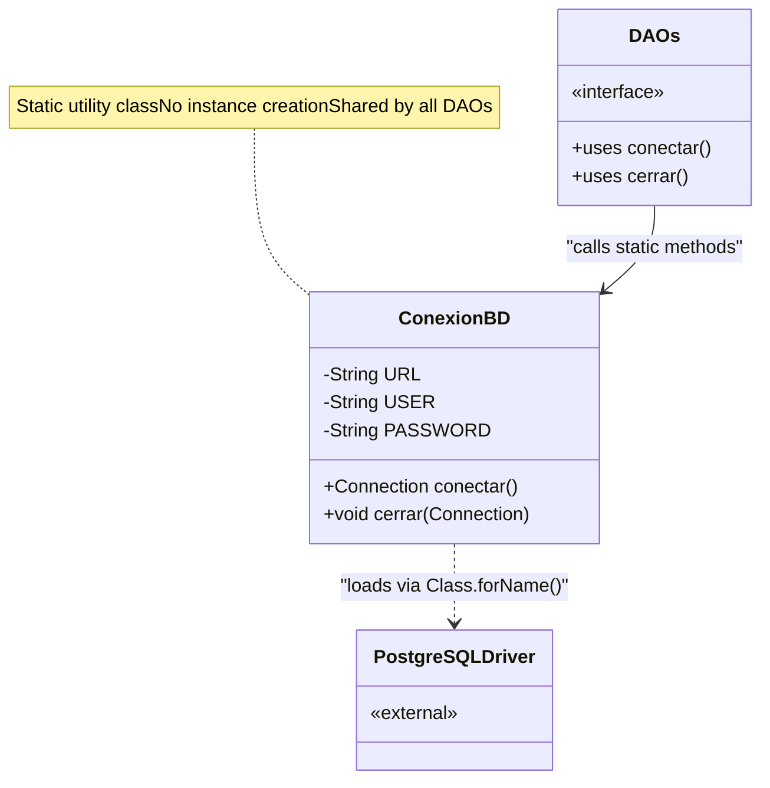
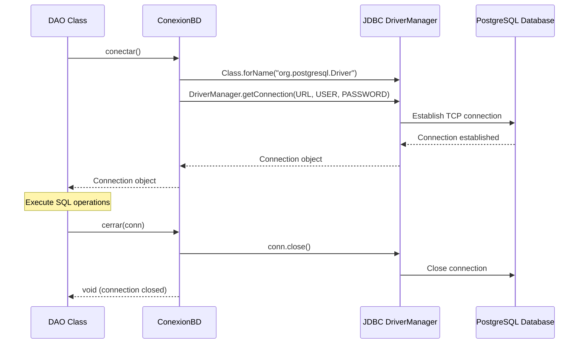
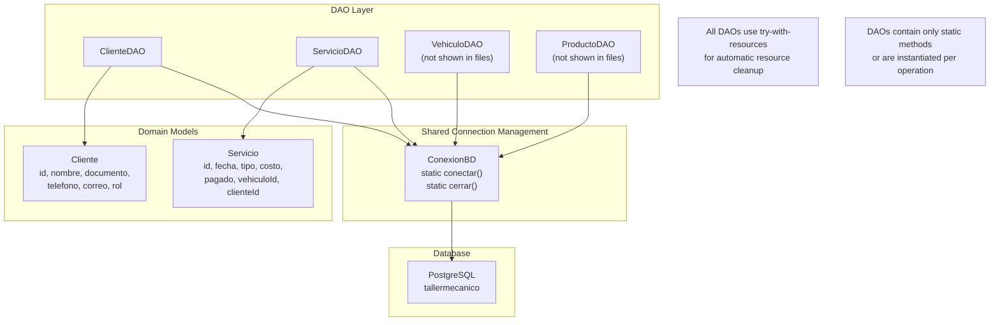
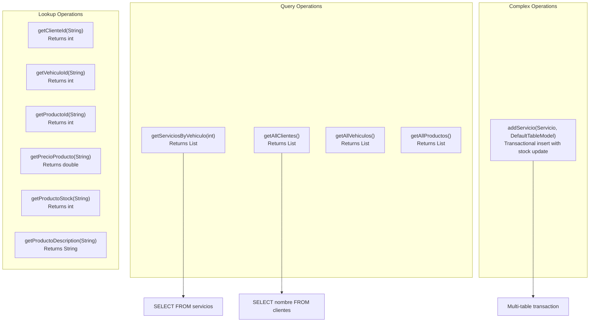
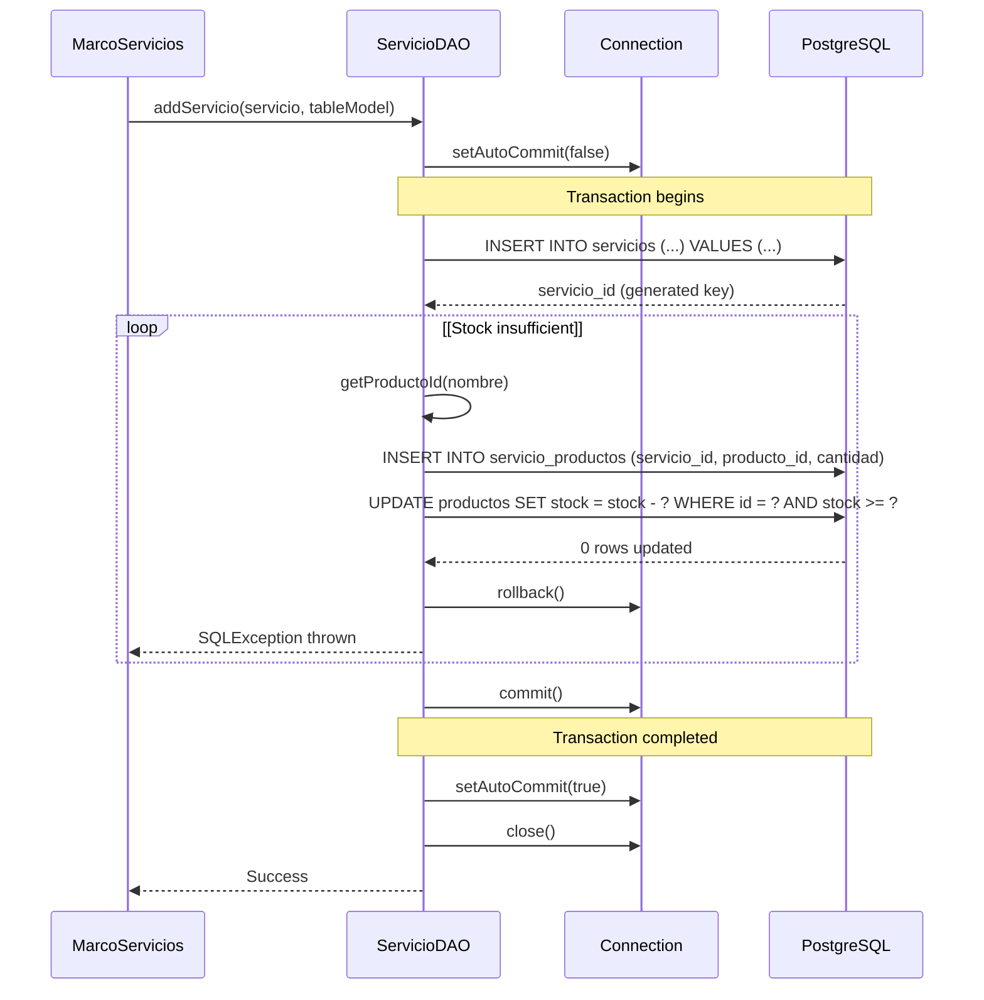
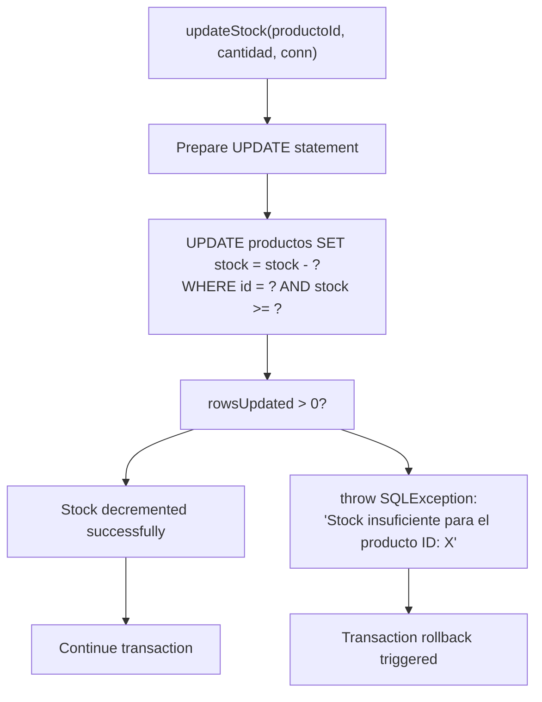
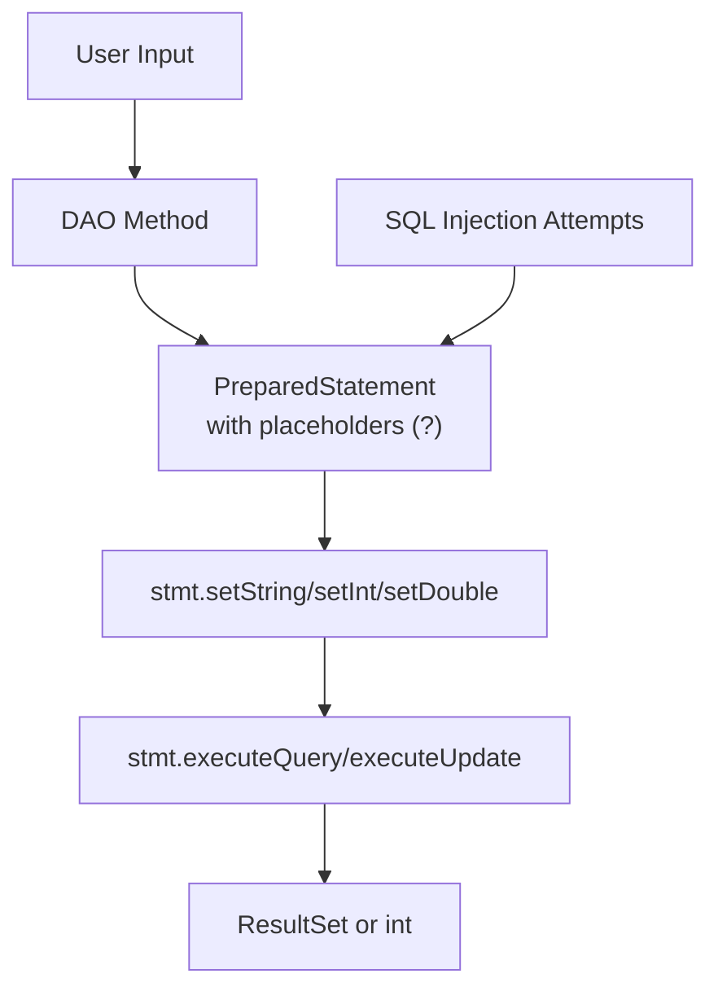
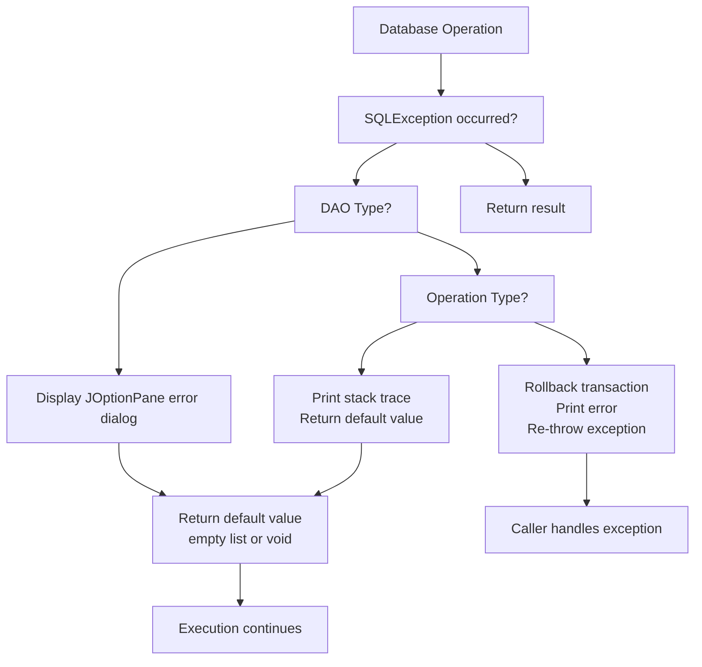

# Database Layer

> **Relevant source files**
> * [libs/jcalendar-1.4.jar](https://github.com/BrayanTirado/Servicio-Mec-nico/blob/b80161f0/libs/jcalendar-1.4.jar)
> * [src/main/java/com/adso/el_taller_de_adso/ConexionBD.java](https://github.com/BrayanTirado/Servicio-Mec-nico/blob/b80161f0/src/main/java/com/adso/el_taller_de_adso/ConexionBD.java)
> * [src/main/java/com/adso/el_taller_de_adso/clientes/Cliente.java](https://github.com/BrayanTirado/Servicio-Mec-nico/blob/b80161f0/src/main/java/com/adso/el_taller_de_adso/clientes/Cliente.java)
> * [src/main/java/com/adso/el_taller_de_adso/clientes/ClienteDAO.java](https://github.com/BrayanTirado/Servicio-Mec-nico/blob/b80161f0/src/main/java/com/adso/el_taller_de_adso/clientes/ClienteDAO.java)
> * [src/main/java/com/adso/el_taller_de_adso/servicios/Servicio.java](https://github.com/BrayanTirado/Servicio-Mec-nico/blob/b80161f0/src/main/java/com/adso/el_taller_de_adso/servicios/Servicio.java)
> * [src/main/java/com/adso/el_taller_de_adso/servicios/ServicioDAO.java](https://github.com/BrayanTirado/Servicio-Mec-nico/blob/b80161f0/src/main/java/com/adso/el_taller_de_adso/servicios/ServicioDAO.java)

## Purpose and Scope

This document describes the database layer of El Taller de ADSO, which provides centralized connection management and implements the Data Access Object (DAO) pattern for database operations. The database layer uses JDBC to interact with a PostgreSQL database and handles all CRUD operations for the application's domain entities.

For information about the domain model classes that the DAOs return (e.g., `Servicio`, `Cliente`, `Vehiculo`, `Producto`), see [Data Models and Domain Objects](/BrayanTirado/Servicio-Mec-nico/8-data-models-and-domain-objects). For information about how UI components interact with DAOs, see [Main Application Window](/BrayanTirado/Servicio-Mec-nico/3.1-main-application-window).

---

## Connection Management

The `ConexionBD` class provides static utility methods for obtaining and closing database connections. It serves as the single point of configuration for all database connectivity in the application.

### ConexionBD Class Structure

The connection manager maintains hardcoded database credentials and connection parameters:



**Sources:** [src/main/java/com/adso/el_taller_de_adso/ConexionBD.java L11-L42](https://github.com/BrayanTirado/Servicio-Mec-nico/blob/b80161f0/src/main/java/com/adso/el_taller_de_adso/ConexionBD.java#L11-L42)

### Connection Lifecycle

| Method | Purpose | Behavior |
| --- | --- | --- |
| `conectar()` | Creates new database connection | Returns `Connection` object or `null` on failure |
| `cerrar(Connection)` | Closes existing connection | Checks for null before closing; logs success/failure |

The `conectar()` method performs the following steps:

1. Loads the PostgreSQL JDBC driver via `Class.forName("org.postgresql.Driver")` [src/main/java/com/adso/el_taller_de_adso/ConexionBD.java L19](https://github.com/BrayanTirado/Servicio-Mec-nico/blob/b80161f0/src/main/java/com/adso/el_taller_de_adso/ConexionBD.java#L19-L19)
2. Establishes connection using `DriverManager.getConnection()` with hardcoded credentials [src/main/java/com/adso/el_taller_de_adso/ConexionBD.java L20](https://github.com/BrayanTirado/Servicio-Mec-nico/blob/b80161f0/src/main/java/com/adso/el_taller_de_adso/ConexionBD.java#L20-L20)
3. Returns the connection or `null` if an exception occurs [src/main/java/com/adso/el_taller_de_adso/ConexionBD.java L28](https://github.com/BrayanTirado/Servicio-Mec-nico/blob/b80161f0/src/main/java/com/adso/el_taller_de_adso/ConexionBD.java#L28-L28)

**Database Configuration:**

* **URL:** `jdbc:postgresql://setviciomecanico-leftyrancuentabot-144a.g.aivencloud.com:14583/tallermecanico` [src/main/java/com/adso/el_taller_de_adso/ConexionBD.java L12](https://github.com/BrayanTirado/Servicio-Mec-nico/blob/b80161f0/src/main/java/com/adso/el_taller_de_adso/ConexionBD.java#L12-L12)
* **User:** `avnadmin` [src/main/java/com/adso/el_taller_de_adso/ConexionBD.java L13](https://github.com/BrayanTirado/Servicio-Mec-nico/blob/b80161f0/src/main/java/com/adso/el_taller_de_adso/ConexionBD.java#L13-L13)
* **Driver:** PostgreSQL JDBC Driver (version 42.7.1)

### Connection Usage Pattern

All DAOs follow this standard pattern for connection management:



**Sources:** [src/main/java/com/adso/el_taller_de_adso/ConexionBD.java L16-L41](https://github.com/BrayanTirado/Servicio-Mec-nico/blob/b80161f0/src/main/java/com/adso/el_taller_de_adso/ConexionBD.java#L16-L41)

 [src/main/java/com/adso/el_taller_de_adso/clientes/ClienteDAO.java L24-L36](https://github.com/BrayanTirado/Servicio-Mec-nico/blob/b80161f0/src/main/java/com/adso/el_taller_de_adso/clientes/ClienteDAO.java#L24-L36)

**Note:** The system does **not** implement connection pooling. Each database operation creates a new connection and closes it immediately after completion, which may impact performance under high load.

---

## DAO Architecture

The application implements the Data Access Object pattern with separate DAO classes for each domain entity. Each DAO class encapsulates all database operations for its corresponding entity.

### DAO Class Hierarchy



**Sources:** [src/main/java/com/adso/el_taller_de_adso/clientes/ClienteDAO.java L21](https://github.com/BrayanTirado/Servicio-Mec-nico/blob/b80161f0/src/main/java/com/adso/el_taller_de_adso/clientes/ClienteDAO.java#L21-L21)

 [src/main/java/com/adso/el_taller_de_adso/servicios/ServicioDAO.java L16](https://github.com/BrayanTirado/Servicio-Mec-nico/blob/b80161f0/src/main/java/com/adso/el_taller_de_adso/servicios/ServicioDAO.java#L16-L16)

### ClienteDAO Operations

The `ClienteDAO` class implements CRUD operations for client management:

| Method | SQL Operation | Return Type | Key Features |
| --- | --- | --- | --- |
| `registrarcliente(Cliente)` | `INSERT INTO clientes` | void | Shows success dialog [src/main/java/com/adso/el_taller_de_adso/clientes/ClienteDAO.java L22-L37](https://github.com/BrayanTirado/Servicio-Mec-nico/blob/b80161f0/src/main/java/com/adso/el_taller_de_adso/clientes/ClienteDAO.java#L22-L37) |
| `listarClientes()` | `SELECT * FROM clientes` | `List<Cliente>` | Returns all clients [src/main/java/com/adso/el_taller_de_adso/clientes/ClienteDAO.java L39-L60](https://github.com/BrayanTirado/Servicio-Mec-nico/blob/b80161f0/src/main/java/com/adso/el_taller_de_adso/clientes/ClienteDAO.java#L39-L60) |
| `buscarCliente(String, String)` | `SELECT ... WHERE ... ILIKE` | `List<Cliente>` | Case-insensitive search by documento or nombre [src/main/java/com/adso/el_taller_de_adso/clientes/ClienteDAO.java L62-L85](https://github.com/BrayanTirado/Servicio-Mec-nico/blob/b80161f0/src/main/java/com/adso/el_taller_de_adso/clientes/ClienteDAO.java#L62-L85) |
| `actualizarCliente(Cliente)` | `UPDATE clientes` | void | Updates by documento (immutable key) [src/main/java/com/adso/el_taller_de_adso/clientes/ClienteDAO.java L87-L105](https://github.com/BrayanTirado/Servicio-Mec-nico/blob/b80161f0/src/main/java/com/adso/el_taller_de_adso/clientes/ClienteDAO.java#L87-L105) |
| `eliminarCliente(String)` | `DELETE FROM clientes` | void | Deletes by documento [src/main/java/com/adso/el_taller_de_adso/clientes/ClienteDAO.java L106-L122](https://github.com/BrayanTirado/Servicio-Mec-nico/blob/b80161f0/src/main/java/com/adso/el_taller_de_adso/clientes/ClienteDAO.java#L106-L122) |

**Resource Management Pattern:**

All `ClienteDAO` methods use try-with-resources to ensure automatic cleanup:

```
try (Connection conn = ConexionBD.conectar();
     PreparedStatement stmt = conn.prepareStatement(sql)) {
    // Execute operation
} catch (SQLException e) {
    // Error handling
}
```

**Sources:** [src/main/java/com/adso/el_taller_de_adso/clientes/ClienteDAO.java L22-L123](https://github.com/BrayanTirado/Servicio-Mec-nico/blob/b80161f0/src/main/java/com/adso/el_taller_de_adso/clientes/ClienteDAO.java#L22-L123)

### ServicioDAO Operations

The `ServicioDAO` class handles service-related database operations, including complex transactional workflows:



**Sources:** [src/main/java/com/adso/el_taller_de_adso/servicios/ServicioDAO.java L16-L300](https://github.com/BrayanTirado/Servicio-Mec-nico/blob/b80161f0/src/main/java/com/adso/el_taller_de_adso/servicios/ServicioDAO.java#L16-L300)

**Key Methods:**

* **getServiciosByVehiculo(int vehicleId)**: Retrieves all services for a specific vehicle [src/main/java/com/adso/el_taller_de_adso/servicios/ServicioDAO.java L22-L45](https://github.com/BrayanTirado/Servicio-Mec-nico/blob/b80161f0/src/main/java/com/adso/el_taller_de_adso/servicios/ServicioDAO.java#L22-L45)
* **ID Resolution Methods**: Convert user-friendly names/placas to database IDs [src/main/java/com/adso/el_taller_de_adso/servicios/ServicioDAO.java L145-L203](https://github.com/BrayanTirado/Servicio-Mec-nico/blob/b80161f0/src/main/java/com/adso/el_taller_de_adso/servicios/ServicioDAO.java#L145-L203)
* **Product Detail Queries**: Fetch individual product attributes (price, stock, description) [src/main/java/com/adso/el_taller_de_adso/servicios/ServicioDAO.java L106-L143](https://github.com/BrayanTirado/Servicio-Mec-nico/blob/b80161f0/src/main/java/com/adso/el_taller_de_adso/servicios/ServicioDAO.java#L106-L143)
* **addServicio()**: Complex transactional operation (detailed in next section)

---

## Transaction Management

The database layer implements explicit transaction control for operations that span multiple tables or require atomicity guarantees.

### Service Creation Transaction

The `addServicio()` method demonstrates sophisticated transaction handling for the service creation workflow:



**Sources:** [src/main/java/com/adso/el_taller_de_adso/servicios/ServicioDAO.java L205-L264](https://github.com/BrayanTirado/Servicio-Mec-nico/blob/b80161f0/src/main/java/com/adso/el_taller_de_adso/servicios/ServicioDAO.java#L205-L264)

### Transaction Steps

1. **Disable Auto-Commit**: `conn.setAutoCommit(false)` [src/main/java/com/adso/el_taller_de_adso/servicios/ServicioDAO.java L208](https://github.com/BrayanTirado/Servicio-Mec-nico/blob/b80161f0/src/main/java/com/adso/el_taller_de_adso/servicios/ServicioDAO.java#L208-L208)
2. **Insert Service Record**: * SQL: `INSERT INTO servicios (fecha, tipo, costo, pagado, vehiculo_id, cliente_id) VALUES (?, ?, ?, ?, ?, ?)` * Uses `Statement.RETURN_GENERATED_KEYS` to retrieve the auto-generated service ID * [src/main/java/com/adso/el_taller_de_adso/servicios/ServicioDAO.java L211-L228](https://github.com/BrayanTirado/Servicio-Mec-nico/blob/b80161f0/src/main/java/com/adso/el_taller_de_adso/servicios/ServicioDAO.java#L211-L228)
3. **Insert Service-Product Associations**: * Iterates through `DefaultTableModel` rows containing selected products * SQL: `INSERT INTO servicio_productos (servicio_id, producto_id, cantidad) VALUES (?, ?, ?)` * [src/main/java/com/adso/el_taller_de_adso/servicios/ServicioDAO.java L231-L252](https://github.com/BrayanTirado/Servicio-Mec-nico/blob/b80161f0/src/main/java/com/adso/el_taller_de_adso/servicios/ServicioDAO.java#L231-L252)
4. **Update Product Stock**: * Calls `updateStock()` for each product * SQL: `UPDATE productos SET stock = stock - ? WHERE id = ? AND stock >= ?` * The `WHERE stock >= ?` clause ensures atomic stock validation * [src/main/java/com/adso/el_taller_de_adso/servicios/ServicioDAO.java L285-L299](https://github.com/BrayanTirado/Servicio-Mec-nico/blob/b80161f0/src/main/java/com/adso/el_taller_de_adso/servicios/ServicioDAO.java#L285-L299)
5. **Commit or Rollback**: * On success: `conn.commit()` [src/main/java/com/adso/el_taller_de_adso/servicios/ServicioDAO.java L254](https://github.com/BrayanTirado/Servicio-Mec-nico/blob/b80161f0/src/main/java/com/adso/el_taller_de_adso/servicios/ServicioDAO.java#L254-L254) * On exception: `conn.rollback()` [src/main/java/com/adso/el_taller_de_adso/servicios/ServicioDAO.java L257](https://github.com/BrayanTirado/Servicio-Mec-nico/blob/b80161f0/src/main/java/com/adso/el_taller_de_adso/servicios/ServicioDAO.java#L257-L257) * Finally: `conn.setAutoCommit(true)` [src/main/java/com/adso/el_taller_de_adso/servicios/ServicioDAO.java L261](https://github.com/BrayanTirado/Servicio-Mec-nico/blob/b80161f0/src/main/java/com/adso/el_taller_de_adso/servicios/ServicioDAO.java#L261-L261)

### Stock Validation Logic

The `updateStock()` method implements optimistic locking for inventory management:



**Sources:** [src/main/java/com/adso/el_taller_de_adso/servicios/ServicioDAO.java L285-L299](https://github.com/BrayanTirado/Servicio-Mec-nico/blob/b80161f0/src/main/java/com/adso/el_taller_de_adso/servicios/ServicioDAO.java#L285-L299)

The `WHERE stock >= ?` condition ensures that:

* Stock is never decremented below zero
* Concurrent transactions cannot create negative inventory
* If insufficient stock exists, the entire transaction is rolled back

---

## Database Schema Relationships

The database layer interacts with the following PostgreSQL tables:

### Entity Relationship Overview

```css
#mermaid-jqtmqq41r5{font-family:ui-sans-serif,-apple-system,system-ui,Segoe UI,Helvetica;font-size:16px;fill:#333;}@keyframes edge-animation-frame{from{stroke-dashoffset:0;}}@keyframes dash{to{stroke-dashoffset:0;}}#mermaid-jqtmqq41r5 .edge-animation-slow{stroke-dasharray:9,5!important;stroke-dashoffset:900;animation:dash 50s linear infinite;stroke-linecap:round;}#mermaid-jqtmqq41r5 .edge-animation-fast{stroke-dasharray:9,5!important;stroke-dashoffset:900;animation:dash 20s linear infinite;stroke-linecap:round;}#mermaid-jqtmqq41r5 .error-icon{fill:#dddddd;}#mermaid-jqtmqq41r5 .error-text{fill:#222222;stroke:#222222;}#mermaid-jqtmqq41r5 .edge-thickness-normal{stroke-width:1px;}#mermaid-jqtmqq41r5 .edge-thickness-thick{stroke-width:3.5px;}#mermaid-jqtmqq41r5 .edge-pattern-solid{stroke-dasharray:0;}#mermaid-jqtmqq41r5 .edge-thickness-invisible{stroke-width:0;fill:none;}#mermaid-jqtmqq41r5 .edge-pattern-dashed{stroke-dasharray:3;}#mermaid-jqtmqq41r5 .edge-pattern-dotted{stroke-dasharray:2;}#mermaid-jqtmqq41r5 .marker{fill:#999;stroke:#999;}#mermaid-jqtmqq41r5 .marker.cross{stroke:#999;}#mermaid-jqtmqq41r5 svg{font-family:ui-sans-serif,-apple-system,system-ui,Segoe UI,Helvetica;font-size:16px;}#mermaid-jqtmqq41r5 p{margin:0;}#mermaid-jqtmqq41r5 .entityBox{fill:#ffffff;stroke:#dddddd;}#mermaid-jqtmqq41r5 .relationshipLabelBox{fill:#dddddd;opacity:0.7;background-color:#dddddd;}#mermaid-jqtmqq41r5 .relationshipLabelBox rect{opacity:0.5;}#mermaid-jqtmqq41r5 .labelBkg{background-color:rgba(221, 221, 221, 0.5);}#mermaid-jqtmqq41r5 .edgeLabel .label{fill:#dddddd;font-size:14px;}#mermaid-jqtmqq41r5 .label{font-family:ui-sans-serif,-apple-system,system-ui,Segoe UI,Helvetica;color:#333;}#mermaid-jqtmqq41r5 .edge-pattern-dashed{stroke-dasharray:8,8;}#mermaid-jqtmqq41r5 .node rect,#mermaid-jqtmqq41r5 .node circle,#mermaid-jqtmqq41r5 .node ellipse,#mermaid-jqtmqq41r5 .node polygon{fill:#ffffff;stroke:#dddddd;stroke-width:1px;}#mermaid-jqtmqq41r5 .relationshipLine{stroke:#999;stroke-width:1;fill:none;}#mermaid-jqtmqq41r5 .marker{fill:none!important;stroke:#999!important;stroke-width:1;}#mermaid-jqtmqq41r5 :root{--mermaid-font-family:"trebuchet ms",verdana,arial,sans-serif;}hasreceivesincludesused_inhas_roleclientesintidPKstringnombrestringdocumentoUKstringtelefonostringcorreointrolFKserviciosintidPKdatefechastringtipodoublecostobooleanpagadointvehiculo_idFKintcliente_idFKvehiculosintidPKstringplacaUKstringmarcastringmodelointañostringtipointcliente_idFKservicio_productosintservicio_idFKintproducto_idFKintcantidadproductosintidPKstringnombreUKstringdescripciondoublepreciointstockrolesintidPKstringnombre
```

**Sources:** Inferred from [src/main/java/com/adso/el_taller_de_adso/clientes/ClienteDAO.java L23-L30](https://github.com/BrayanTirado/Servicio-Mec-nico/blob/b80161f0/src/main/java/com/adso/el_taller_de_adso/clientes/ClienteDAO.java#L23-L30)

 [src/main/java/com/adso/el_taller_de_adso/servicios/ServicioDAO.java L28](https://github.com/BrayanTirado/Servicio-Mec-nico/blob/b80161f0/src/main/java/com/adso/el_taller_de_adso/servicios/ServicioDAO.java#L28-L28)

 [src/main/java/com/adso/el_taller_de_adso/servicios/ServicioDAO.java L211](https://github.com/BrayanTirado/Servicio-Mec-nico/blob/b80161f0/src/main/java/com/adso/el_taller_de_adso/servicios/ServicioDAO.java#L211-L211)

 [src/main/java/com/adso/el_taller_de_adso/servicios/ServicioDAO.java L231](https://github.com/BrayanTirado/Servicio-Mec-nico/blob/b80161f0/src/main/java/com/adso/el_taller_de_adso/servicios/ServicioDAO.java#L231-L231)

### Table Details

| Table | Primary Key | Foreign Keys | Unique Constraints |
| --- | --- | --- | --- |
| `clientes` | `id` | `rol` → `roles(id)` | `documento` |
| `vehiculos` | `id` | `cliente_id` → `clientes(id)` | `placa` |
| `servicios` | `id` | `vehiculo_id` → `vehiculos(id)``cliente_id` → `clientes(id)` | None |
| `productos` | `id` | None | `nombre` |
| `servicio_productos` | Composite | `servicio_id` → `servicios(id)``producto_id` → `productos(id)` | None |

**Sources:** Inferred from DAO query patterns in [src/main/java/com/adso/el_taller_de_adso/clientes/ClienteDAO.java](https://github.com/BrayanTirado/Servicio-Mec-nico/blob/b80161f0/src/main/java/com/adso/el_taller_de_adso/clientes/ClienteDAO.java)

 and [src/main/java/com/adso/el_taller_de_adso/servicios/ServicioDAO.java](https://github.com/BrayanTirado/Servicio-Mec-nico/blob/b80161f0/src/main/java/com/adso/el_taller_de_adso/servicios/ServicioDAO.java)

---

## Query Patterns and Techniques

### Prepared Statements

All DAOs use `PreparedStatement` for parameterized queries to prevent SQL injection:



**Example from ClienteDAO:**

* SQL: `"SELECT * FROM clientes WHERE " + (criterio.equals("documento") ? "documento" : "nombre") + " ILIKE ?"`
* Parameter binding: `stmt.setString(1, "%" + valor + "%")`
* [src/main/java/com/adso/el_taller_de_adso/clientes/ClienteDAO.java L64-L68](https://github.com/BrayanTirado/Servicio-Mec-nico/blob/b80161f0/src/main/java/com/adso/el_taller_de_adso/clientes/ClienteDAO.java#L64-L68)

**Sources:** [src/main/java/com/adso/el_taller_de_adso/clientes/ClienteDAO.java L25-L31](https://github.com/BrayanTirado/Servicio-Mec-nico/blob/b80161f0/src/main/java/com/adso/el_taller_de_adso/clientes/ClienteDAO.java#L25-L31)

 [src/main/java/com/adso/el_taller_de_adso/servicios/ServicioDAO.java L110-L112](https://github.com/BrayanTirado/Servicio-Mec-nico/blob/b80161f0/src/main/java/com/adso/el_taller_de_adso/servicios/ServicioDAO.java#L110-L112)

### Case-Insensitive Search

The `ClienteDAO.buscarCliente()` method uses PostgreSQL's `ILIKE` operator for case-insensitive pattern matching:

* Operator: `ILIKE` (PostgreSQL-specific)
* Pattern: `"%" + valor + "%"` for substring matching
* [src/main/java/com/adso/el_taller_de_adso/clientes/ClienteDAO.java L64](https://github.com/BrayanTirado/Servicio-Mec-nico/blob/b80161f0/src/main/java/com/adso/el_taller_de_adso/clientes/ClienteDAO.java#L64-L64)

### ResultSet to Domain Model Mapping

DAOs manually map `ResultSet` columns to domain model objects:

```
while (rs.next()) {
    clientes.add(new Cliente(
        rs.getInt("id"),
        rs.getString("nombre"),
        rs.getString("documento"),
        rs.getString("telefono"),
        rs.getString("correo"),
        rs.getInt("rol")
    ));
}
```

**Sources:** [src/main/java/com/adso/el_taller_de_adso/clientes/ClienteDAO.java L45-L54](https://github.com/BrayanTirado/Servicio-Mec-nico/blob/b80161f0/src/main/java/com/adso/el_taller_de_adso/clientes/ClienteDAO.java#L45-L54)

### Generated Key Retrieval

The `addServicio()` method retrieves auto-generated primary keys using `Statement.RETURN_GENERATED_KEYS`:

```
PreparedStatement pstmt = conn.prepareStatement(sql, Statement.RETURN_GENERATED_KEYS);
pstmt.executeUpdate();
ResultSet generatedKeys = pstmt.getGeneratedKeys();
if (generatedKeys.next()) {
    servicioId = generatedKeys.getInt(1);
}
```

**Sources:** [src/main/java/com/adso/el_taller_de_adso/servicios/ServicioDAO.java L212-L226](https://github.com/BrayanTirado/Servicio-Mec-nico/blob/b80161f0/src/main/java/com/adso/el_taller_de_adso/servicios/ServicioDAO.java#L212-L226)

---

## Error Handling

The database layer implements a consistent error handling strategy across all DAOs.

### Error Handling Patterns

| DAO | Error Display | Stack Trace | Exception Propagation |
| --- | --- | --- | --- |
| `ClienteDAO` | `JOptionPane.showMessageDialog()` | No | Exceptions caught and displayed |
| `ServicioDAO` | `System.err.println()` / `e.printStackTrace()` | Yes | Some methods re-throw exceptions |

**ClienteDAO Pattern:**

* Catches `SQLException` in all methods
* Displays error via `JOptionPane.ERROR_MESSAGE` dialog
* Does not propagate exceptions to caller
* [src/main/java/com/adso/el_taller_de_adso/clientes/ClienteDAO.java L33-L35](https://github.com/BrayanTirado/Servicio-Mec-nico/blob/b80161f0/src/main/java/com/adso/el_taller_de_adso/clientes/ClienteDAO.java#L33-L35)

**ServicioDAO Pattern:**

* Catches `SQLException` in simple queries
* Prints stack trace with `e.printStackTrace()`
* **Re-throws exceptions** in `addServicio()` for caller handling [src/main/java/com/adso/el_taller_de_adso/servicios/ServicioDAO.java L259](https://github.com/BrayanTirado/Servicio-Mec-nico/blob/b80161f0/src/main/java/com/adso/el_taller_de_adso/servicios/ServicioDAO.java#L259-L259)
* **Re-throws exceptions** in `getServiciosByVehiculo()` [src/main/java/com/adso/el_taller_de_adso/servicios/ServicioDAO.java L42](https://github.com/BrayanTirado/Servicio-Mec-nico/blob/b80161f0/src/main/java/com/adso/el_taller_de_adso/servicios/ServicioDAO.java#L42-L42)

### Error Handling Flow



**Sources:** [src/main/java/com/adso/el_taller_de_adso/clientes/ClienteDAO.java L33-L35](https://github.com/BrayanTirado/Servicio-Mec-nico/blob/b80161f0/src/main/java/com/adso/el_taller_de_adso/clientes/ClienteDAO.java#L33-L35)

 [src/main/java/com/adso/el_taller_de_adso/servicios/ServicioDAO.java L40-L42](https://github.com/BrayanTirado/Servicio-Mec-nico/blob/b80161f0/src/main/java/com/adso/el_taller_de_adso/servicios/ServicioDAO.java#L40-L42)

 [src/main/java/com/adso/el_taller_de_adso/servicios/ServicioDAO.java L256-L259](https://github.com/BrayanTirado/Servicio-Mec-nico/blob/b80161f0/src/main/java/com/adso/el_taller_de_adso/servicios/ServicioDAO.java#L256-L259)

### Transaction Error Handling

The `addServicio()` method implements comprehensive error handling for transactional operations:

1. **Catch Block**: Intercepts `SQLException` during any transaction step
2. **Rollback**: Executes `conn.rollback()` to undo all changes
3. **Logging**: Prints error message to stderr
4. **Re-throw**: Propagates exception to UI layer for user notification
5. **Finally Block**: Always resets `autoCommit` and closes connection

**Sources:** [src/main/java/com/adso/el_taller_de_adso/servicios/ServicioDAO.java L256-L263](https://github.com/BrayanTirado/Servicio-Mec-nico/blob/b80161f0/src/main/java/com/adso/el_taller_de_adso/servicios/ServicioDAO.java#L256-L263)

### Stock Validation Errors

The `updateStock()` method throws a custom `SQLException` when stock is insufficient:

```
if (rowsUpdated == 0) {
    throw new SQLException("Stock insuficiente para el producto ID: " + productoId);
}
```

This exception propagates up to trigger the transaction rollback in `addServicio()`.

**Sources:** [src/main/java/com/adso/el_taller_de_adso/servicios/ServicioDAO.java L293-L294](https://github.com/BrayanTirado/Servicio-Mec-nico/blob/b80161f0/src/main/java/com/adso/el_taller_de_adso/servicios/ServicioDAO.java#L293-L294)

---

## Connection Limitations

The current database layer implementation has the following architectural limitations:

| Limitation | Impact | Location |
| --- | --- | --- |
| **No Connection Pooling** | Each operation creates/destroys a connection | All DAO methods |
| **Hardcoded Credentials** | Cannot change database without recompiling | [ConexionBD.java L12-L14](https://github.com/BrayanTirado/Servicio-Mec-nico/blob/b80161f0/ConexionBD.java#L12-L14) |
| **No Retry Logic** | Transient network failures cause immediate failure | All DAO methods |
| **No Timeout Configuration** | Operations may hang indefinitely | [ConexionBD.java L20](https://github.com/BrayanTirado/Servicio-Mec-nico/blob/b80161f0/ConexionBD.java#L20-L20) |
| **Mixed Error Handling** | Inconsistent exception propagation strategy | All DAOs |

**Sources:** [src/main/java/com/adso/el_taller_de_adso/ConexionBD.java L11-L42](https://github.com/BrayanTirado/Servicio-Mec-nico/blob/b80161f0/src/main/java/com/adso/el_taller_de_adso/ConexionBD.java#L11-L42)