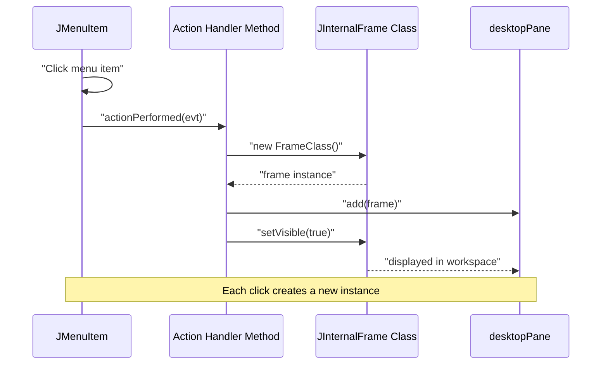

# Main Application Window

> **Relevant source files**
> * [src/main/java/com/adso/el_taller_de_adso/AplicacionPrincipal.form](https://github.com/BrayanTirado/Servicio-Mec-nico/blob/b80161f0/src/main/java/com/adso/el_taller_de_adso/AplicacionPrincipal.form)
> * [src/main/java/com/adso/el_taller_de_adso/AplicacionPrincipal.java](https://github.com/BrayanTirado/Servicio-Mec-nico/blob/b80161f0/src/main/java/com/adso/el_taller_de_adso/AplicacionPrincipal.java)

## Purpose and Scope

This page documents the `AplicacionPrincipal` class, which serves as the main container window for the El Taller de ADSO application. This class implements the Multiple Document Interface (MDI) pattern using a `JDesktopPane` to host multiple `JInternalFrame` windows. After successful authentication (see [Authentication System](/BrayanTirado/Servicio-Mec-nico/2.2-authentication-system)), users interact with all business functionality through this window's menu-driven navigation system.

For details about specific functional modules launched from this window, refer to:

* Vehicle management: [Vehicle CRUD Operations](/BrayanTirado/Servicio-Mec-nico/6.1-vehicle-crud-operations) and [Vehicle Query Interface](/BrayanTirado/Servicio-Mec-nico/6.2-vehicle-query-interface)
* Service operations: [Creating Services](/BrayanTirado/Servicio-Mec-nico/4.1-creating-services) and [Service History Viewer](/BrayanTirado/Servicio-Mec-nico/4.2-service-history-viewer)
* Client operations: [Client Registration](/BrayanTirado/Servicio-Mec-nico/7.1-client-registration) and [Client Management Interface](/BrayanTirado/Servicio-Mec-nico/7.2-client-management-interface)
* Inventory operations: [Product Search Interface](/BrayanTirado/Servicio-Mec-nico/5.1-product-search-interface) and [Adding Products](/BrayanTirado/Servicio-Mec-nico/5.2-adding-products)

---

## Architecture Overview

The `AplicacionPrincipal` class extends `javax.swing.JFrame` and serves as the application's central orchestrator. It implements the MDI (Multiple Document Interface) pattern where:

1. A single parent `JFrame` contains a `JMenuBar` with domain-organized menus
2. A central `JDesktopPane` acts as the workspace container
3. Menu item selections instantiate and display `JInternalFrame` child windows on-demand
4. Multiple instances of the same frame type can coexist simultaneously

This design provides a unified workspace where users can open multiple functional modules side-by-side, switch between tasks without closing windows, and maintain context across different business operations.

```

```

**Sources:** [src/main/java/com/adso/el_taller_de_adso/AplicacionPrincipal.java L27-L405](https://github.com/BrayanTirado/Servicio-Mec-nico/blob/b80161f0/src/main/java/com/adso/el_taller_de_adso/AplicacionPrincipal.java#L27-L405)

 [src/main/java/com/adso/el_taller_de_adso/AplicacionPrincipal.form L1-L240](https://github.com/BrayanTirado/Servicio-Mec-nico/blob/b80161f0/src/main/java/com/adso/el_taller_de_adso/AplicacionPrincipal.form#L1-L240)

---

## Component Structure

### Main JFrame Configuration

The `AplicacionPrincipal` frame is configured with the following properties:

| Property | Value | Purpose |
| --- | --- | --- |
| `defaultCloseOperation` | `EXIT_ON_CLOSE` (3) | Terminates application when window closes |
| `alwaysOnTop` | `true` | Keeps window above other applications |
| Window centering | `setLocationRelativeTo(null)` | Centers window on screen at startup |

The frame is generated using NetBeans GUI Builder, as evidenced by the `.form` file and generated code markers in the Java source.

**Sources:** [src/main/java/com/adso/el_taller_de_adso/AplicacionPrincipal.java L83-L84](https://github.com/BrayanTirado/Servicio-Mec-nico/blob/b80161f0/src/main/java/com/adso/el_taller_de_adso/AplicacionPrincipal.java#L83-L84)

 [src/main/java/com/adso/el_taller_de_adso/AplicacionPrincipal.form L186-L189](https://github.com/BrayanTirado/Servicio-Mec-nico/blob/b80161f0/src/main/java/com/adso/el_taller_de_adso/AplicacionPrincipal.form#L186-L189)

### JDesktopPane Container

The `desktopPane` field is the central workspace component with these characteristics:

* **Type:** `javax.swing.JDesktopPane` (declared at [line 379](https://github.com/BrayanTirado/Servicio-Mec-nico/blob/b80161f0/line 379) )
* **Layout:** Fills entire content area of the parent frame
* **Dimensions:** 1187x717 pixels (default size)
* **Custom rendering:** Overrides `paintComponent()` to display background image

The desktop pane initialization includes custom code to render a background image:

```

```

The background image path is hardcoded to: `/C:/Users/Brayan/Documents/NetBeansProjects/Servicio-Mec-nico/imagen/Imagen_Principal.png`

**Sources:** [src/main/java/com/adso/el_taller_de_adso/AplicacionPrincipal.java L50-L56](https://github.com/BrayanTirado/Servicio-Mec-nico/blob/b80161f0/src/main/java/com/adso/el_taller_de_adso/AplicacionPrincipal.java#L50-L56)

 [src/main/java/com/adso/el_taller_de_adso/AplicacionPrincipal.form L220-L238](https://github.com/BrayanTirado/Servicio-Mec-nico/blob/b80161f0/src/main/java/com/adso/el_taller_de_adso/AplicacionPrincipal.form#L220-L238)

### JMenuBar Structure

The menu bar (`jMenuBar1`) contains five top-level menus organized by business domain:

```mermaid
flowchart TD

MENUBAR["jMenuBar1"]
M1["jMenu1<br>'Vehículos'"]
M2["jMenu2<br>'Servicios'"]
M3["jMenu3<br>'Clientes'"]
M5["jMenu5<br>'Reportes'"]
M6["jMenu6<br>'Inventarios'"]
V1["menuItemVehiculos<br>'Gestión de Vehículos'"]
V2["menuItemConsultaVehiculos<br>'Consulta del vehiculo'"]
S1["menuItemGestionServicios<br>'Gestion de servicios'"]
S2["menuitemHistorialServicios<br>'Historial de servicios'"]
C1["menuItemRegistrarClientes<br>'Registrar clientes'"]
C2["menuItemGestionarClientes<br>'Gestionar clientes'"]
R1["menuItemReporte_Cliente<br>'Servicios por cliente'"]
R2["jMenuItem2<br>'Servicios por vehículo'"]
R3["jMenuItem3<br>'Servicios por fecha'"]
R4["jMenuItem4<br>'Ingresos generados'"]
I1["jMenuItem1<br>'Agregar producto'"]
I2["jMenuItem5<br>'Ver Stocks Bajos'"]
I3["jMenuItem6<br>'Hacer Pedido'"]
I4["jMenuItem7<br>'Buscar Producto'"]
I5["jMenuItem8<br>'Editar Producto'"]

MENUBAR --> M1
MENUBAR --> M2
MENUBAR --> M3
MENUBAR --> M5
MENUBAR --> M6
M1 --> V1
M1 --> V2
M2 --> S1
M2 --> S2
M3 --> C1
M3 --> C2
M5 --> R1
M5 --> R2
M5 --> R3
M5 --> R4
M6 --> I1
M6 --> I2
M6 --> I3
M6 --> I4
M6 --> I5
```



**Sources:** [src/main/java/com/adso/el_taller_de_adso/AplicacionPrincipal.form L25-L184](https://github.com/BrayanTirado/Servicio-Mec-nico/blob/b80161f0/src/main/java/com/adso/el_taller_de_adso/AplicacionPrincipal.form#L25-L184)

 [src/main/java/com/adso/el_taller_de_adso/AplicacionPrincipal.java L57-L240](https://github.com/BrayanTirado/Servicio-Mec-nico/blob/b80161f0/src/main/java/com/adso/el_taller_de_adso/AplicacionPrincipal.java#L57-L240)

---

## Menu Structure and Navigation

### Vehículos Menu

The vehicle menu (`jMenu1`) provides two navigation options:

| Menu Item | Text | Frame Instantiated | Handler Method |
| --- | --- | --- | --- |
| `menuItemVehiculos` | "Gestión de Vehículos" | `MarcoVehiculo` | `menuItemVehiculosActionPerformed()` |
| `menuItemConsultaVehiculos` | "Consulta del vehiculo" | `ConsultaVehiculo` | `menuItemConsultaVehiculosActionPerformed()` |

The vehicle management module separates CRUD operations (MarcoVehiculo) from query/history viewing (ConsultaVehiculo).

**Sources:** [src/main/java/com/adso/el_taller_de_adso/AplicacionPrincipal.java L97-L113](https://github.com/BrayanTirado/Servicio-Mec-nico/blob/b80161f0/src/main/java/com/adso/el_taller_de_adso/AplicacionPrincipal.java#L97-L113)

 [src/main/java/com/adso/el_taller_de_adso/AplicacionPrincipal.java L259-L276](https://github.com/BrayanTirado/Servicio-Mec-nico/blob/b80161f0/src/main/java/com/adso/el_taller_de_adso/AplicacionPrincipal.java#L259-L276)

### Servicios Menu

The services menu (`jMenu2`) provides access to service creation and history:

| Menu Item | Text | Frame Instantiated | Handler Method |
| --- | --- | --- | --- |
| `menuItemGestionServicios` | "Gestion de servicios" | `MarcoServicios` | `menuItemGestionServiciosActionPerformed()` |
| `menuitemHistorialServicios` | "Historial de servicios" | `HistorialServicios` | `menuitemHistorialServiciosActionPerformed()` |

This menu provides the most critical business functionality for recording repair services and tracking service history.

**Sources:** [src/main/java/com/adso/el_taller_de_adso/AplicacionPrincipal.java L117-L133](https://github.com/BrayanTirado/Servicio-Mec-nico/blob/b80161f0/src/main/java/com/adso/el_taller_de_adso/AplicacionPrincipal.java#L117-L133)

 [src/main/java/com/adso/el_taller_de_adso/AplicacionPrincipal.java L265-L283](https://github.com/BrayanTirado/Servicio-Mec-nico/blob/b80161f0/src/main/java/com/adso/el_taller_de_adso/AplicacionPrincipal.java#L265-L283)

### Clientes Menu

The clients menu (`jMenu3`) handles customer registration and management:

| Menu Item | Text | Frame Instantiated | Handler Method |
| --- | --- | --- | --- |
| `menuItemRegistrarClientes` | "Registrar clientes" | `MarcoClientes` | `menuItemRegistrarClientesActionPerformed()` |
| `menuItemGestionarClientes` | "Gestionar clientes" | `MarcoGestionClientes` | `menuItemGestionarClientesActionPerformed()` |

Similar to vehicles, client operations are split between initial registration and subsequent management tasks.

**Sources:** [src/main/java/com/adso/el_taller_de_adso/AplicacionPrincipal.java L137-L153](https://github.com/BrayanTirado/Servicio-Mec-nico/blob/b80161f0/src/main/java/com/adso/el_taller_de_adso/AplicacionPrincipal.java#L137-L153)

 [src/main/java/com/adso/el_taller_de_adso/AplicacionPrincipal.java L285-L295](https://github.com/BrayanTirado/Servicio-Mec-nico/blob/b80161f0/src/main/java/com/adso/el_taller_de_adso/AplicacionPrincipal.java#L285-L295)

### Reportes Menu

The reports menu (`jMenu5`) provides four reporting options:

| Menu Item | Text | Frame Instantiated | Handler Method |
| --- | --- | --- | --- |
| `menuItemReporte_Cliente` | "Servicios por cliente" | `reporte_cliente` | `menuItemReporte_ClienteActionPerformed()` |
| `jMenuItem2` | "Servicios por vehículo" | `reporte_vehiculo` | `jMenuItem2ActionPerformed()` |
| `jMenuItem3` | "Servicios por fecha" | `reporte_fecha` | `jMenuItem3ActionPerformed()` |
| `jMenuItem4` | "Ingresos generados" | `ingresos_generados` | `jMenuItem4ActionPerformed()` |

These reports leverage JasperReports for document generation (see [Build Configuration and Dependencies](/BrayanTirado/Servicio-Mec-nico/2.1-build-configuration-and-dependencies) for reporting stack details).

**Sources:** [src/main/java/com/adso/el_taller_de_adso/AplicacionPrincipal.java L157-L189](https://github.com/BrayanTirado/Servicio-Mec-nico/blob/b80161f0/src/main/java/com/adso/el_taller_de_adso/AplicacionPrincipal.java#L157-L189)

 [src/main/java/com/adso/el_taller_de_adso/AplicacionPrincipal.java L297-L324](https://github.com/BrayanTirado/Servicio-Mec-nico/blob/b80161f0/src/main/java/com/adso/el_taller_de_adso/AplicacionPrincipal.java#L297-L324)

### Inventarios Menu

The inventory menu (`jMenu6`) is the most feature-rich menu with five options:

| Menu Item | Text | Frame Instantiated | Handler Method |
| --- | --- | --- | --- |
| `jMenuItem1` | "Agregar producto" | `FormularioProducto` | `jMenuItem1ActionPerformed()` |
| `jMenuItem5` | "Ver Stocks Bajos" | `StockBajo` | `jMenuItem5ActionPerformed()` |
| `jMenuItem6` | "Hacer Pedido" | `FacturacionProductos` | `jMenuItem6ActionPerformed()` |
| `jMenuItem7` | "Buscar Producto" | `BuscarProducto` | `jMenuItem7ActionPerformed()` |
| `jMenuItem8` | "Editar Producto" | `EditarProducto` | `jMenuItem8ActionPerformed()` |

Note that `jMenuItem7` has both mouse click and action performed listeners, potentially causing double instantiation.

**Sources:** [src/main/java/com/adso/el_taller_de_adso/AplicacionPrincipal.java L193-L238](https://github.com/BrayanTirado/Servicio-Mec-nico/blob/b80161f0/src/main/java/com/adso/el_taller_de_adso/AplicacionPrincipal.java#L193-L238)

 [src/main/java/com/adso/el_taller_de_adso/AplicacionPrincipal.java L326-L366](https://github.com/BrayanTirado/Servicio-Mec-nico/blob/b80161f0/src/main/java/com/adso/el_taller_de_adso/AplicacionPrincipal.java#L326-L366)

---

## Frame Instantiation Pattern

### On-Demand Instantiation

All menu action handlers follow a consistent three-step pattern:

1. **Instantiate** the target frame class
2. **Add** the instance to `desktopPane`
3. **Set visible** to display the frame

Example implementation for vehicle management:

```

```

This pattern is repeated across all 15+ menu handlers with minimal variation.

**Sources:** [src/main/java/com/adso/el_taller_de_adso/AplicacionPrincipal.java L259-L263](https://github.com/BrayanTirado/Servicio-Mec-nico/blob/b80161f0/src/main/java/com/adso/el_taller_de_adso/AplicacionPrincipal.java#L259-L263)

### Multiple Instance Support

The application **does not** implement singleton patterns for internal frames. Each menu selection creates a new instance, allowing:

* Multiple windows of the same type open simultaneously
* Independent state management per window
* No shared instance state between windows

This design has both advantages (flexibility) and disadvantages (potential resource usage and data synchronization issues).



**Sources:** [src/main/java/com/adso/el_taller_de_adso/AplicacionPrincipal.java L259-L366](https://github.com/BrayanTirado/Servicio-Mec-nico/blob/b80161f0/src/main/java/com/adso/el_taller_de_adso/AplicacionPrincipal.java#L259-L366)

---

## Module-to-Frame Mapping

The following table maps each business module to its corresponding frame class and import statements:

| Business Domain | Frame Class | Import Statement | Lines |
| --- | --- | --- | --- |
| Vehicle Management | `MarcoVehiculo` | `com.adso.el_taller_de_adso.vehiculos.MarcoVehiculo` | 10 |
| Vehicle Query | `ConsultaVehiculo` | `com.adso.el_taller_de_adso.vehiculos.ConsultaVehiculo` | 9 |
| Service Creation | `MarcoServicios` | `com.adso.el_taller_de_adso.servicios.MarcoServicios` | 8 |
| Service History | `HistorialServicios` | `com.adso.el_taller_de_adso.servicios.HistorialServicios` | 11 |
| Client Registration | `MarcoClientes` | `com.adso.el_taller_de_adso.clientes.MarcoClientes` | 12 |
| Client Management | `MarcoGestionClientes` | `com.adso.el_taller_de_adso.clientes.MarcoGestionClientes` | 13 |
| Product Addition | `FormularioProducto` | `com.adso.el_taller_de_adso.inventario.FormularioProducto` | 19 |
| Product Search | `BuscarProducto` | `com.adso.el_taller_de_adso.inventario.BuscarProducto` | 21 |
| Product Editing | `EditarProducto` | `com.adso.el_taller_de_adso.inventario.EditarProducto` | 22 |
| Low Stock View | `StockBajo` | `com.adso.el_taller_de_adso.inventario.StockBajo` | 20 |
| Product Orders | `FacturacionProductos` | `com.adso.el_taller_de_adso.inventario.FacturacionProductos` | 14 |
| Client Reports | `reporte_cliente` | `com.adso.el_taller_de_adso.reportes.reporte_cliente` | 15 |
| Vehicle Reports | `reporte_vehiculo` | `com.adso.el_taller_de_adso.reportes.reporte_vehiculo` | 18 |
| Date Reports | `reporte_fecha` | `com.adso.el_taller_de_adso.reportes.reporte_fecha` | 17 |
| Income Reports | `ingresos_generados` | `com.adso.el_taller_de_adso.reportes.ingresos_generados` | 16 |

**Sources:** [src/main/java/com/adso/el_taller_de_adso/AplicacionPrincipal.java L8-L22](https://github.com/BrayanTirado/Servicio-Mec-nico/blob/b80161f0/src/main/java/com/adso/el_taller_de_adso/AplicacionPrincipal.java#L8-L22)

---

## Visual Customization

### Background Image Implementation

The `desktopPane` renders a custom background image using an anonymous inner class that overrides `paintComponent()`. The implementation:

1. Loads image at initialization: [lines 50-51](https://github.com/BrayanTirado/Servicio-Mec-nico/blob/b80161f0/lines 50-51)
2. Creates custom `JDesktopPane` subclass: [lines 52-56](https://github.com/BrayanTirado/Servicio-Mec-nico/blob/b80161f0/lines 52-56)
3. Draws image scaled to fit desktop pane dimensions

The image is loaded from an absolute path, which creates deployment challenges:

```
/C:/Users/Brayan/Documents/NetBeansProjects/Servicio-Mec-nico/imagen/Imagen_Principal.png
```

This hardcoded path will fail on different systems or when the application is deployed outside the development environment. The image will not display correctly, though functionality remains unaffected.

**Recommendation:** Replace with relative classpath resource loading:

```

```

**Sources:** [src/main/java/com/adso/el_taller_de_adso/AplicacionPrincipal.form L221-L223](https://github.com/BrayanTirado/Servicio-Mec-nico/blob/b80161f0/src/main/java/com/adso/el_taller_de_adso/AplicacionPrincipal.form#L221-L223)

 [src/main/java/com/adso/el_taller_de_adso/AplicacionPrincipal.java L50-L56](https://github.com/BrayanTirado/Servicio-Mec-nico/blob/b80161f0/src/main/java/com/adso/el_taller_de_adso/AplicacionPrincipal.java#L50-L56)

---

## Entry Point and Initialization

The `main()` method at [lines 370-376](https://github.com/BrayanTirado/Servicio-Mec-nico/blob/b80161f0/lines 370-376)

 follows the standard Swing pattern for launching GUI applications:

```

```

**Important:** This `main()` method is **not** the application's actual entry point. The login system (see [Authentication System](/BrayanTirado/Servicio-Mec-nico/2.2-authentication-system)) serves as the entry point, with `AplicacionPrincipal` instantiated only after successful authentication at [com.adso.el_taller_de_adso.login.login](https://github.com/BrayanTirado/Servicio-Mec-nico/blob/b80161f0/com.adso.el_taller_de_adso.login.login)

The `main()` method exists for:

* Direct testing during development
* NetBeans form preview functionality
* Bypassing authentication for debugging purposes

**Sources:** [src/main/java/com/adso/el_taller_de_adso/AplicacionPrincipal.java L370-L376](https://github.com/BrayanTirado/Servicio-Mec-nico/blob/b80161f0/src/main/java/com/adso/el_taller_de_adso/AplicacionPrincipal.java#L370-L376)

---

## Code Generation and Maintenance

### NetBeans GUI Builder Integration

The class is primarily generated and maintained through NetBeans GUI Builder:

* **Form file:** `AplicacionPrincipal.form` defines component hierarchy, properties, and layout
* **Generated sections:** Marked with `//GEN-BEGIN` and `//GEN-END` comments
* **Protected sections:** Code between `//GEN-FIRST:event_*` and `//GEN-LAST:event_*` markers
* **Manual edits:** Should be made only outside generated sections

The form file uses the following form metadata:

| Property | Value |
| --- | --- |
| `formSizePolicy` | 1 (Generate Pack) |
| `generateCenter` | true |
| `layoutCodeTarget` | 1 (Java 1.4+) |

**Warning:** Manual modifications to generated code sections will be overwritten when the form is edited in NetBeans GUI Builder.

**Sources:** [src/main/java/com/adso/el_taller_de_adso/AplicacionPrincipal.java L38-L42](https://github.com/BrayanTirado/Servicio-Mec-nico/blob/b80161f0/src/main/java/com/adso/el_taller_de_adso/AplicacionPrincipal.java#L38-L42)

 [src/main/java/com/adso/el_taller_de_adso/AplicacionPrincipal.form L195-L205](https://github.com/BrayanTirado/Servicio-Mec-nico/blob/b80161f0/src/main/java/com/adso/el_taller_de_adso/AplicacionPrincipal.form#L195-L205)