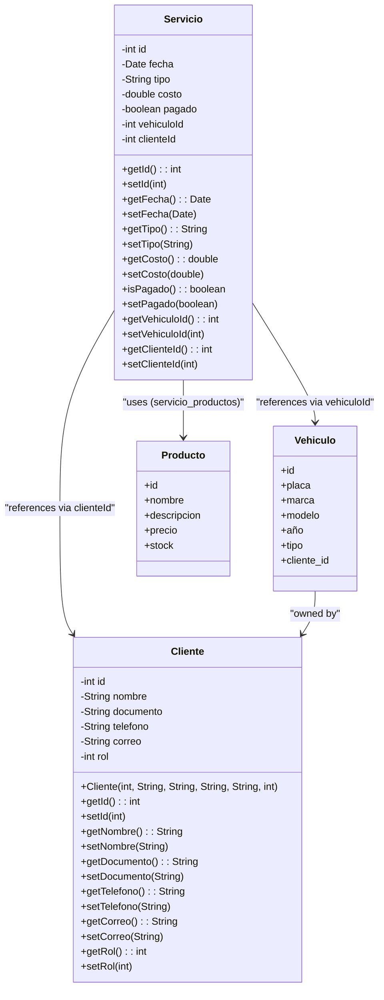
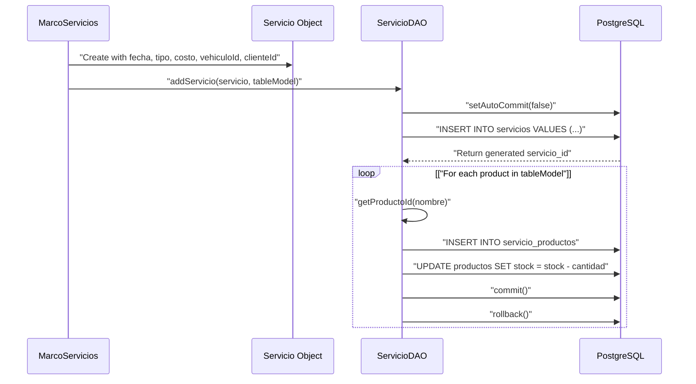
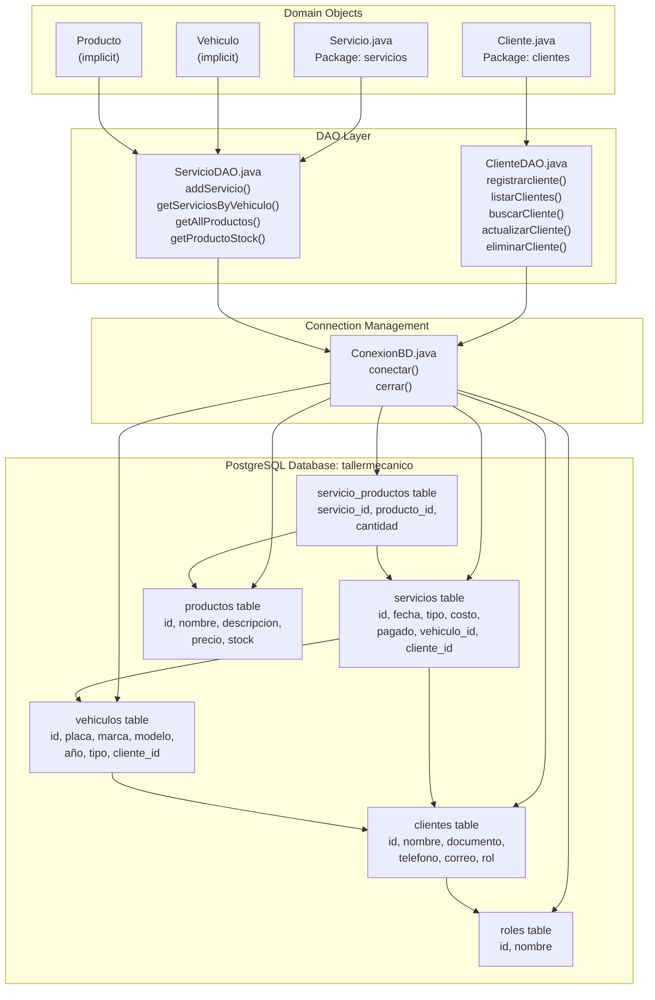

# Modelos de datos y objetos de dominio

> **Archivos fuente relevantes**
> * [libs/jcalendar-1.4.jar](https://github.com/BrayanTirado/Servicio-Mec-nico/blob/b80161f0/libs/jcalendar-1.4.jar)
> * [src/main/java/com/adso/el_taller_de_adso/ConexionBD.java](https://github.com/BrayanTirado/Servicio-Mec-nico/blob/b80161f0/src/main/java/com/adso/el_taller_de_adso/ConexionBD.java)
> * [src/main/java/com/adso/el_taller_de_adso/clientes/Cliente.java](https://github.com/BrayanTirado/Servicio-Mec-nico/blob/b80161f0/src/main/java/com/adso/el_taller_de_adso/clientes/Cliente.java)
> * [src/main/java/com/adso/el_taller_de_adso/clientes/ClienteDAO.java](https://github.com/BrayanTirado/Servicio-Mec-nico/blob/b80161f0/src/main/java/com/adso/el_taller_de_adso/clientes/ClienteDAO.java)
> * [src/main/java/com/adso/el_taller_de_adso/servicios/Servicio.java](https://github.com/BrayanTirado/Servicio-Mec-nico/blob/b80161f0/src/main/java/com/adso/el_taller_de_adso/servicios/Servicio.java)
> * [src/main/java/com/adso/el_taller_de_adso/servicios/ServicioDAO.java](https://github.com/BrayanTirado/Servicio-Mec-nico/blob/b80161f0/src/main/java/com/adso/el_taller_de_adso/servicios/ServicioDAO.java)

Esta página documenta las clases del modelo de dominio que representan las entidades de negocio principales en El Taller de ADSO. Estos objetos de Java (POJO) encapsulan las estructuras de datos de clientes, vehículos, servicios y productos en toda la aplicación. Cada objeto de dominio corresponde a una tabla de base de datos y es manipulado por su clase DAO correspondiente.

Para obtener información sobre la capa DAO y las operaciones de base de datos, consulte [Capa de base de datos](/BrayanTirado/Servicio-Mec-nico/3.2-database-layer) . Para obtener más información sobre cómo se utilizan estos objetos en los flujos de trabajo de la interfaz de usuario, consulte las páginas específicas de cada módulo: [Módulo de gestión de servicios](/BrayanTirado/Servicio-Mec-nico/4-service-management-module) , [Módulo de gestión de inventario](/BrayanTirado/Servicio-Mec-nico/5-inventory-management-module) , [Módulo de gestión de vehículos](/BrayanTirado/Servicio-Mec-nico/6-vehicle-management-module) y [Módulo de gestión de clientes](/BrayanTirado/Servicio-Mec-nico/7-client-management-module) .

---

## Arquitectura del modelo de dominio

La aplicación implementa cuatro objetos de dominio principales, cada uno de los cuales representa una entidad comercial principal en el dominio del taller mecánico.

**Diagrama de clases del modelo de dominio**



**Fuentes:** [src/main/java/com/adso/el_taller_de_adso/servicios/Servicio.java L9-L74](https://github.com/BrayanTirado/Servicio-Mec-nico/blob/b80161f0/src/main/java/com/adso/el_taller_de_adso/servicios/Servicio.java#L9-L74)

 [src/main/java/com/adso/el_taller_de_adso/clientes/Cliente.java L11-L77](https://github.com/BrayanTirado/Servicio-Mec-nico/blob/b80161f0/src/main/java/com/adso/el_taller_de_adso/clientes/Cliente.java#L11-L77)

 [src/main/java/com/adso/el_taller_de_adso/servicios/ServicioDAO.java L1-L300](https://github.com/BrayanTirado/Servicio-Mec-nico/blob/b80161f0/src/main/java/com/adso/el_taller_de_adso/servicios/ServicioDAO.java#L1-L300)

---

## Objeto de dominio del cliente

La `Cliente`clase representa las entidades de cliente en el sistema. Se define en[src/main/java/com/adso/el_taller_de_adso/clientes/Cliente.java L11-L77](https://github.com/BrayanTirado/Servicio-Mec-nico/blob/b80161f0/src/main/java/com/adso/el_taller_de_adso/clientes/Cliente.java#L11-L77)

y contiene identificación del cliente, información de contacto y asignación de roles.

### Atributos

| Campo | Tipo | Descripción | Columna de base de datos |
| --- | --- | --- | --- |
| `id` | `int` | Identificador de clave principal | `clientes.id` |
| `nombre` | `String` | Nombre completo del cliente | `clientes.nombre` |
| `documento` | `String` | Número de documento de identidad (único) | `clientes.documento` |
| `telefono` | `String` | Número de teléfono de contacto | `clientes.telefono` |
| `correo` | `String` | Dirección de correo electrónico | `clientes.correo` |
| `rol` | `int` | Clave externa a `roles`la tabla | `clientes.rol` |

### Constructor e inicialización

La `Cliente`clase proporciona un único constructor que inicializa todos los campos:

```
public Cliente(int id, String nombre, String documento, String telefono, String correo, int rol)
```

Este constructor se utiliza `ClienteDAO`cuando se asignan conjuntos de resultados de consultas de base de datos en[src/main/java/com/adso/el_taller_de_adso/clientes/ClienteDAO.java L46-L53](https://github.com/BrayanTirado/Servicio-Mec-nico/blob/b80161f0/src/main/java/com/adso/el_taller_de_adso/clientes/ClienteDAO.java#L46-L53)

y[src/main/java/com/adso/el_taller_de_adso/clientes/ClienteDAO.java L70-L78](https://github.com/BrayanTirado/Servicio-Mec-nico/blob/b80161f0/src/main/java/com/adso/el_taller_de_adso/clientes/ClienteDAO.java#L70-L78)

### Patrones de uso

El `Cliente`objeto se manipula a través de `ClienteDAO`métodos:

* **Inscripción** : `ClienteDAO.registrarcliente(Cliente)`en[src/main/java/com/adso/el_taller_de_adso/clientes/ClienteDAO.java L22-L37](https://github.com/BrayanTirado/Servicio-Mec-nico/blob/b80161f0/src/main/java/com/adso/el_taller_de_adso/clientes/ClienteDAO.java#L22-L37)
* **Listado** : `ClienteDAO.listarClientes()`devoluciones `List<Cliente>`en[src/main/java/com/adso/el_taller_de_adso/clientes/ClienteDAO.java L39-L60](https://github.com/BrayanTirado/Servicio-Mec-nico/blob/b80161f0/src/main/java/com/adso/el_taller_de_adso/clientes/ClienteDAO.java#L39-L60)
* **Buscando** : `ClienteDAO.buscarCliente(String, String)`en[src/main/java/com/adso/el_taller_de_adso/clientes/ClienteDAO.java L62-L85](https://github.com/BrayanTirado/Servicio-Mec-nico/blob/b80161f0/src/main/java/com/adso/el_taller_de_adso/clientes/ClienteDAO.java#L62-L85)
* **Actualizaciones** : `ClienteDAO.actualizarCliente(Cliente)`en[src/main/java/com/adso/el_taller_de_adso/clientes/ClienteDAO.java L87-L105](https://github.com/BrayanTirado/Servicio-Mec-nico/blob/b80161f0/src/main/java/com/adso/el_taller_de_adso/clientes/ClienteDAO.java#L87-L105)
* **Eliminación** : `ClienteDAO.eliminarCliente(String)`en[src/main/java/com/adso/el_taller_de_adso/clientes/ClienteDAO.java L106-L122](https://github.com/BrayanTirado/Servicio-Mec-nico/blob/b80161f0/src/main/java/com/adso/el_taller_de_adso/clientes/ClienteDAO.java#L106-L122)

**Fuentes:** [src/main/java/com/adso/el_taller_de_adso/clientes/Cliente.java L11-L77](https://github.com/BrayanTirado/Servicio-Mec-nico/blob/b80161f0/src/main/java/com/adso/el_taller_de_adso/clientes/Cliente.java#L11-L77)

 [src/main/java/com/adso/el_taller_de_adso/clientes/ClienteDAO.java L21-L123](https://github.com/BrayanTirado/Servicio-Mec-nico/blob/b80161f0/src/main/java/com/adso/el_taller_de_adso/clientes/ClienteDAO.java#L21-L123)

---

## Objeto de dominio de servicio

The `Servicio` class represents mechanical service records performed on vehicles. It is defined in [src/main/java/com/adso/el_taller_de_adso/servicios/Servicio.java L9-L74](https://github.com/BrayanTirado/Servicio-Mec-nico/blob/b80161f0/src/main/java/com/adso/el_taller_de_adso/servicios/Servicio.java#L9-L74)

 and serves as the central transaction entity linking clients, vehicles, and products.

### Attributes

| Field | Type | Description | Database Column |
| --- | --- | --- | --- |
| `id` | `int` | Primary key identifier | `servicios.id` |
| `fecha` | `java.sql.Date` | Service date | `servicios.fecha` |
| `tipo` | `String` | Service type description | `servicios.tipo` |
| `costo` | `double` | Total service cost | `servicios.costo` |
| `pagado` | `boolean` | Payment status flag | `servicios.pagado` |
| `vehiculoId` | `int` | Foreign key to `vehiculos` table | `servicios.vehiculo_id` |
| `clienteId` | `int` | Foreign key to `clientes` table | `servicios.cliente_id` |

### Key Design Decisions

1. **Uses `java.sql.Date`**: The `fecha` field uses SQL Date type rather than `java.util.Date` or `java.time.LocalDate`, ensuring direct compatibility with JDBC operations at [src/main/java/com/adso/el_taller_de_adso/servicios/Servicio.java L7](https://github.com/BrayanTirado/Servicio-Mec-nico/blob/b80161f0/src/main/java/com/adso/el_taller_de_adso/servicios/Servicio.java#L7-L7)
2. **Foreign Key References**: Rather than embedding `Cliente` and `Vehiculo` objects, the class stores integer IDs for database referential integrity, following a normalized design pattern.
3. **No Product List**: Although services contain products, the `Servicio` object does not maintain a `List<Producto>` field. Instead, the many-to-many relationship is managed through the `servicio_productos` join table at the DAO layer [src/main/java/com/adso/el_taller_de_adso/servicios/ServicioDAO.java L231-L252](https://github.com/BrayanTirado/Servicio-Mec-nico/blob/b80161f0/src/main/java/com/adso/el_taller_de_adso/servicios/ServicioDAO.java#L231-L252)

### Transactional Creation

Service creation is a multi-step transactional operation in `ServicioDAO.addServicio()` at [src/main/java/com/adso/el_taller_de_adso/servicios/ServicioDAO.java L205-L264](https://github.com/BrayanTirado/Servicio-Mec-nico/blob/b80161f0/src/main/java/com/adso/el_taller_de_adso/servicios/ServicioDAO.java#L205-L264)

:



**Sources:** [src/main/java/com/adso/el_taller_de_adso/servicios/Servicio.java L9-L74](https://github.com/BrayanTirado/Servicio-Mec-nico/blob/b80161f0/src/main/java/com/adso/el_taller_de_adso/servicios/Servicio.java#L9-L74)

 [src/main/java/com/adso/el_taller_de_adso/servicios/ServicioDAO.java L205-L264](https://github.com/BrayanTirado/Servicio-Mec-nico/blob/b80161f0/src/main/java/com/adso/el_taller_de_adso/servicios/ServicioDAO.java#L205-L264)

---

## Vehiculo Domain Object

The `Vehiculo` entity represents vehicles serviced at the workshop. While no explicit Java class file exists in the provided sources, the structure is evident from database operations in `ServicioDAO` and references throughout the codebase.

### Inferred Structure

Based on database queries in [src/main/java/com/adso/el_taller_de_adso/servicios/ServicioDAO.java L66-L84](https://github.com/BrayanTirado/Servicio-Mec-nico/blob/b80161f0/src/main/java/com/adso/el_taller_de_adso/servicios/ServicioDAO.java#L66-L84)

 and [src/main/java/com/adso/el_taller_de_adso/servicios/ServicioDAO.java L165-L183](https://github.com/BrayanTirado/Servicio-Mec-nico/blob/b80161f0/src/main/java/com/adso/el_taller_de_adso/servicios/ServicioDAO.java#L165-L183)

 the `Vehiculo` entity contains:

| Field | Type | Description | Database Column |
| --- | --- | --- | --- |
| `id` | `int` | Primary key identifier | `vehiculos.id` |
| `placa` | `String` | License plate (unique identifier) | `vehiculos.placa` |
| `marca` | `String` | Vehicle brand/make | `vehiculos.marca` |
| `modelo` | `String` | Vehicle model | `vehiculos.modelo` |
| `año` | `int` | Manufacturing year | `vehiculos.año` |
| `tipo` | `String` | Vehicle type category | `vehiculos.tipo` |
| `cliente_id` | `int` | Foreign key to owning client | `vehiculos.cliente_id` |

### Usage in Service Context

Vehicles are referenced in services through:

1. **ID Resolution**: `ServicioDAO.getVehiculoId(String placa)` at [src/main/java/com/adso/el_taller_de_adso/servicios/ServicioDAO.java L165-L183](https://github.com/BrayanTirado/Servicio-Mec-nico/blob/b80161f0/src/main/java/com/adso/el_taller_de_adso/servicios/ServicioDAO.java#L165-L183)  translates license plates to IDs
2. **Service Association**: The `Servicio.vehiculoId` field links services to vehicles
3. **History Queries**: `ServicioDAO.getServiciosByVehiculo(int vehicleId)` at [src/main/java/com/adso/el_taller_de_adso/servicios/ServicioDAO.java L22-L45](https://github.com/BrayanTirado/Servicio-Mec-nico/blob/b80161f0/src/main/java/com/adso/el_taller_de_adso/servicios/ServicioDAO.java#L22-L45)  retrieves all services for a vehicle
4. **Combo Box Population**: `ServicioDAO.getAllVehiculos()` at [src/main/java/com/adso/el_taller_de_adso/servicios/ServicioDAO.java L66-L84](https://github.com/BrayanTirado/Servicio-Mec-nico/blob/b80161f0/src/main/java/com/adso/el_taller_de_adso/servicios/ServicioDAO.java#L66-L84)  provides vehicle lists for UI selection

**Sources:** [src/main/java/com/adso/el_taller_de_adso/servicios/ServicioDAO.java L66-L84](https://github.com/BrayanTirado/Servicio-Mec-nico/blob/b80161f0/src/main/java/com/adso/el_taller_de_adso/servicios/ServicioDAO.java#L66-L84)

 [src/main/java/com/adso/el_taller_de_adso/servicios/ServicioDAO.java L165-L183](https://github.com/BrayanTirado/Servicio-Mec-nico/blob/b80161f0/src/main/java/com/adso/el_taller_de_adso/servicios/ServicioDAO.java#L165-L183)

 [src/main/java/com/adso/el_taller_de_adso/servicios/ServicioDAO.java L22-L45](https://github.com/BrayanTirado/Servicio-Mec-nico/blob/b80161f0/src/main/java/com/adso/el_taller_de_adso/servicios/ServicioDAO.java#L22-L45)

---

## Producto Domain Object

The `Producto` entity represents inventory items (parts and supplies) used in vehicle services. Like `Vehiculo`, no explicit Java class is provided, but its structure is clear from DAO operations.

### Inferred Structure

Based on queries in [src/main/java/com/adso/el_taller_de_adso/servicios/ServicioDAO.java L86-L143](https://github.com/BrayanTirado/Servicio-Mec-nico/blob/b80161f0/src/main/java/com/adso/el_taller_de_adso/servicios/ServicioDAO.java#L86-L143)

 and [src/main/java/com/adso/el_taller_de_adso/servicios/ServicioDAO.java L265-L283](https://github.com/BrayanTirado/Servicio-Mec-nico/blob/b80161f0/src/main/java/com/adso/el_taller_de_adso/servicios/ServicioDAO.java#L265-L283)

:

| Field | Type | Description | Database Column |
| --- | --- | --- | --- |
| `id` | `int` | Primary key identifier | `productos.id` |
| `nombre` | `String` | Product name | `productos.nombre` |
| `descripcion` | `String` | Product description | `productos.descripcion` |
| `precio` | `double` | Unit price | `productos.precio` |
| `stock` | `int` | Available quantity | `productos.stock` |

### Inventory Management Operations

Product data is accessed through multiple specialized methods in `ServicioDAO`:

* **Name Listing**: `getAllProductos()` returns `List<String>` at [src/main/java/com/adso/el_taller_de_adso/servicios/ServicioDAO.java L86-L104](https://github.com/BrayanTirado/Servicio-Mec-nico/blob/b80161f0/src/main/java/com/adso/el_taller_de_adso/servicios/ServicioDAO.java#L86-L104)
* **Price Retrieval**: `getPrecioProducto(String nombre)` at [src/main/java/com/adso/el_taller_de_adso/servicios/ServicioDAO.java L106-L124](https://github.com/BrayanTirado/Servicio-Mec-nico/blob/b80161f0/src/main/java/com/adso/el_taller_de_adso/servicios/ServicioDAO.java#L106-L124)
* **Description Retrieval**: `getProductoDescription(String nombre)` at [src/main/java/com/adso/el_taller_de_adso/servicios/ServicioDAO.java L125-L143](https://github.com/BrayanTirado/Servicio-Mec-nico/blob/b80161f0/src/main/java/com/adso/el_taller_de_adso/servicios/ServicioDAO.java#L125-L143)
* **Stock Checking**: `getProductoStock(String nombre)` at [src/main/java/com/adso/el_taller_de_adso/servicios/ServicioDAO.java L265-L283](https://github.com/BrayanTirado/Servicio-Mec-nico/blob/b80161f0/src/main/java/com/adso/el_taller_de_adso/servicios/ServicioDAO.java#L265-L283)
* **ID Resolution**: `getProductoId(String nombre)` at [src/main/java/com/adso/el_taller_de_adso/servicios/ServicioDAO.java L185-L203](https://github.com/BrayanTirado/Servicio-Mec-nico/blob/b80161f0/src/main/java/com/adso/el_taller_de_adso/servicios/ServicioDAO.java#L185-L203)
* **Stock Updates**: `updateStock(int productoId, int cantidad, Connection conn)` at [src/main/java/com/adso/el_taller_de_adso/servicios/ServicioDAO.java L285-L299](https://github.com/BrayanTirado/Servicio-Mec-nico/blob/b80161f0/src/main/java/com/adso/el_taller_de_adso/servicios/ServicioDAO.java#L285-L299)

### Stock Validation Logic

The `updateStock()` method implements critical business logic to prevent negative inventory:

```sql
UPDATE productos SET stock = stock - ? WHERE id = ? AND stock >= ?
```

This ensures atomicity: the stock decrement only succeeds if sufficient quantity exists, otherwise throwing `SQLException` to trigger transaction rollback at [src/main/java/com/adso/el_taller_de_adso/servicios/ServicioDAO.java L285-L299](https://github.com/BrayanTirado/Servicio-Mec-nico/blob/b80161f0/src/main/java/com/adso/el_taller_de_adso/servicios/ServicioDAO.java#L285-L299)

**Sources:** [src/main/java/com/adso/el_taller_de_adso/servicios/ServicioDAO.java L86-L143](https://github.com/BrayanTirado/Servicio-Mec-nico/blob/b80161f0/src/main/java/com/adso/el_taller_de_adso/servicios/ServicioDAO.java#L86-L143)

 [src/main/java/com/adso/el_taller_de_adso/servicios/ServicioDAO.java L185-L203](https://github.com/BrayanTirado/Servicio-Mec-nico/blob/b80161f0/src/main/java/com/adso/el_taller_de_adso/servicios/ServicioDAO.java#L185-L203)

 [src/main/java/com/adso/el_taller_de_adso/servicios/ServicioDAO.java L265-L299](https://github.com/BrayanTirado/Servicio-Mec-nico/blob/b80161f0/src/main/java/com/adso/el_taller_de_adso/servicios/ServicioDAO.java#L265-L299)

---

## Entity Relationships

The domain model implements a normalized relational structure with the following associations:

**Entity Relationship Diagram**

```css
#mermaid-qmq3eubave{font-family:ui-sans-serif,-apple-system,system-ui,Segoe UI,Helvetica;font-size:16px;fill:#333;}@keyframes edge-animation-frame{from{stroke-dashoffset:0;}}@keyframes dash{to{stroke-dashoffset:0;}}#mermaid-qmq3eubave .edge-animation-slow{stroke-dasharray:9,5!important;stroke-dashoffset:900;animation:dash 50s linear infinite;stroke-linecap:round;}#mermaid-qmq3eubave .edge-animation-fast{stroke-dasharray:9,5!important;stroke-dashoffset:900;animation:dash 20s linear infinite;stroke-linecap:round;}#mermaid-qmq3eubave .error-icon{fill:#dddddd;}#mermaid-qmq3eubave .error-text{fill:#222222;stroke:#222222;}#mermaid-qmq3eubave .edge-thickness-normal{stroke-width:1px;}#mermaid-qmq3eubave .edge-thickness-thick{stroke-width:3.5px;}#mermaid-qmq3eubave .edge-pattern-solid{stroke-dasharray:0;}#mermaid-qmq3eubave .edge-thickness-invisible{stroke-width:0;fill:none;}#mermaid-qmq3eubave .edge-pattern-dashed{stroke-dasharray:3;}#mermaid-qmq3eubave .edge-pattern-dotted{stroke-dasharray:2;}#mermaid-qmq3eubave .marker{fill:#999;stroke:#999;}#mermaid-qmq3eubave .marker.cross{stroke:#999;}#mermaid-qmq3eubave svg{font-family:ui-sans-serif,-apple-system,system-ui,Segoe UI,Helvetica;font-size:16px;}#mermaid-qmq3eubave p{margin:0;}#mermaid-qmq3eubave .entityBox{fill:#ffffff;stroke:#dddddd;}#mermaid-qmq3eubave .relationshipLabelBox{fill:#dddddd;opacity:0.7;background-color:#dddddd;}#mermaid-qmq3eubave .relationshipLabelBox rect{opacity:0.5;}#mermaid-qmq3eubave .labelBkg{background-color:rgba(221, 221, 221, 0.5);}#mermaid-qmq3eubave .edgeLabel .label{fill:#dddddd;font-size:14px;}#mermaid-qmq3eubave .label{font-family:ui-sans-serif,-apple-system,system-ui,Segoe UI,Helvetica;color:#333;}#mermaid-qmq3eubave .edge-pattern-dashed{stroke-dasharray:8,8;}#mermaid-qmq3eubave .node rect,#mermaid-qmq3eubave .node circle,#mermaid-qmq3eubave .node ellipse,#mermaid-qmq3eubave .node polygon{fill:#ffffff;stroke:#dddddd;stroke-width:1px;}#mermaid-qmq3eubave .relationshipLine{stroke:#999;stroke-width:1;fill:none;}#mermaid-qmq3eubave .marker{fill:none!important;stroke:#999!important;stroke-width:1;}#mermaid-qmq3eubave :root{--mermaid-font-family:"trebuchet ms",verdana,arial,sans-serif;}ownsrequestsreceivesuseshasclientesintidPKstringnombrestringdocumentoUKstringtelefonostringcorreointrolFKvehiculosintidPKstringplacaUKstringmarcastringmodelointañostringtipointcliente_idFKserviciosintidPKdatefechastringtipodoublecostobooleanpagadointvehiculo_idFKintcliente_idFKproductosintidPKstringnombreUKstringdescripciondoublepreciointstockrolesintidPKstringnombreservicio_productosintservicio_idFKintproducto_idFKintcantidad
```

### Key Relationships

1. **Cliente → Vehiculo**: One-to-many. Each vehicle belongs to one client, but clients may own multiple vehicles. The foreign key is `vehiculos.cliente_id`.
2. **Cliente → Servicio**: One-to-many. Each service is requested by one client. The foreign key is `servicios.cliente_id`, resolved via `ServicioDAO.getClienteId(String nombre)` at [src/main/java/com/adso/el_taller_de_adso/servicios/ServicioDAO.java L145-L163](https://github.com/BrayanTirado/Servicio-Mec-nico/blob/b80161f0/src/main/java/com/adso/el_taller_de_adso/servicios/ServicioDAO.java#L145-L163)
3. **Vehiculo → Servicio**: One-to-many. Each service is performed on one vehicle. The foreign key is `servicios.vehiculo_id`, resolved via `ServicioDAO.getVehiculoId(String placa)` at [src/main/java/com/adso/el_taller_de_adso/servicios/ServicioDAO.java L165-L183](https://github.com/BrayanTirado/Servicio-Mec-nico/blob/b80161f0/src/main/java/com/adso/el_taller_de_adso/servicios/ServicioDAO.java#L165-L183)
4. **Servicio ↔ Producto**: Many-to-many through `servicio_productos` join table. A service can use multiple products, and a product can be used in multiple services. The join table stores `servicio_id`, `producto_id`, and `cantidad` at [src/main/java/com/adso/el_taller_de_adso/servicios/ServicioDAO.java L231-L252](https://github.com/BrayanTirado/Servicio-Mec-nico/blob/b80161f0/src/main/java/com/adso/el_taller_de_adso/servicios/ServicioDAO.java#L231-L252)
5. **Cliente → Rol**: Many-to-one. Multiple clients can share the same role. The foreign key is `clientes.rol` at [src/main/java/com/adso/el_taller_de_adso/clientes/ClienteDAO.java L30](https://github.com/BrayanTirado/Servicio-Mec-nico/blob/b80161f0/src/main/java/com/adso/el_taller_de_adso/clientes/ClienteDAO.java#L30-L30)

**Sources:** [src/main/java/com/adso/el_taller_de_adso/servicios/ServicioDAO.java L145-L183](https://github.com/BrayanTirado/Servicio-Mec-nico/blob/b80161f0/src/main/java/com/adso/el_taller_de_adso/servicios/ServicioDAO.java#L145-L183)

 [src/main/java/com/adso/el_taller_de_adso/servicios/ServicioDAO.java L231-L252](https://github.com/BrayanTirado/Servicio-Mec-nico/blob/b80161f0/src/main/java/com/adso/el_taller_de_adso/servicios/ServicioDAO.java#L231-L252)

 [src/main/java/com/adso/el_taller_de_adso/clientes/ClienteDAO.java L23-L30](https://github.com/BrayanTirado/Servicio-Mec-nico/blob/b80161f0/src/main/java/com/adso/el_taller_de_adso/clientes/ClienteDAO.java#L23-L30)

---

## Database Schema Mapping

Each domain object maps to a PostgreSQL table accessible through the `ConexionBD` connection manager at [src/main/java/com/adso/el_taller_de_adso/ConexionBD.java L11-L42](https://github.com/BrayanTirado/Servicio-Mec-nico/blob/b80161f0/src/main/java/com/adso/el_taller_de_adso/ConexionBD.java#L11-L42)

 The database URL points to `tallermecanico` database at [src/main/java/com/adso/el_taller_de_adso/ConexionBD.java L12](https://github.com/BrayanTirado/Servicio-Mec-nico/blob/b80161f0/src/main/java/com/adso/el_taller_de_adso/ConexionBD.java#L12-L12)

**Code-to-Database Mapping**



### Table Definitions

**clientes**

* Populated via `ClienteDAO.registrarcliente()` at [src/main/java/com/adso/el_taller_de_adso/clientes/ClienteDAO.java L23](https://github.com/BrayanTirado/Servicio-Mec-nico/blob/b80161f0/src/main/java/com/adso/el_taller_de_adso/clientes/ClienteDAO.java#L23-L23)
* Primary key: `id`
* Unique constraint: `documento`
* Foreign key: `rol` references `roles.id`

**servicios**

* Populated via `ServicioDAO.addServicio()` at [src/main/java/com/adso/el_taller_de_adso/servicios/ServicioDAO.java L211-L219](https://github.com/BrayanTirado/Servicio-Mec-nico/blob/b80161f0/src/main/java/com/adso/el_taller_de_adso/servicios/ServicioDAO.java#L211-L219)
* Primary key: `id` (auto-generated, retrieved via `RETURN_GENERATED_KEYS` at [src/main/java/com/adso/el_taller_de_adso/servicios/ServicioDAO.java L212](https://github.com/BrayanTirado/Servicio-Mec-nico/blob/b80161f0/src/main/java/com/adso/el_taller_de_adso/servicios/ServicioDAO.java#L212-L212) )
* Foreign keys: `vehiculo_id` references `vehiculos.id`, `cliente_id` references `clientes.id`

**vehiculos**

* Referenced via `ServicioDAO.getVehiculoId()` and `ServicioDAO.getAllVehiculos()`
* Primary key: `id`
* Unique constraint: `placa`
* Foreign key: `cliente_id` references `clientes.id`

**productos**

* Manipulated via various `ServicioDAO` methods for inventory operations
* Primary key: `id`
* Stock updated transactionally during service creation at [src/main/java/com/adso/el_taller_de_adso/servicios/ServicioDAO.java L285-L299](https://github.com/BrayanTirado/Servicio-Mec-nico/blob/b80161f0/src/main/java/com/adso/el_taller_de_adso/servicios/ServicioDAO.java#L285-L299)

**servicio_productos**

* Join table for many-to-many relationship
* Composite primary key: (`servicio_id`, `producto_id`)
* Stores quantity of each product used in each service
* Populated during `ServicioDAO.addServicio()` transaction at [src/main/java/com/adso/el_taller_de_adso/servicios/ServicioDAO.java L233-L251](https://github.com/BrayanTirado/Servicio-Mec-nico/blob/b80161f0/src/main/java/com/adso/el_taller_de_adso/servicios/ServicioDAO.java#L233-L251)

**Sources:** [src/main/java/com/adso/el_taller_de_adso/ConexionBD.java L11-L42](https://github.com/BrayanTirado/Servicio-Mec-nico/blob/b80161f0/src/main/java/com/adso/el_taller_de_adso/ConexionBD.java#L11-L42)

 [src/main/java/com/adso/el_taller_de_adso/clientes/ClienteDAO.java L22-L37](https://github.com/BrayanTirado/Servicio-Mec-nico/blob/b80161f0/src/main/java/com/adso/el_taller_de_adso/clientes/ClienteDAO.java#L22-L37)

 [src/main/java/com/adso/el_taller_de_adso/servicios/ServicioDAO.java L205-L264](https://github.com/BrayanTirado/Servicio-Mec-nico/blob/b80161f0/src/main/java/com/adso/el_taller_de_adso/servicios/ServicioDAO.java#L205-L264)

---

## Domain Object Lifecycle

Domain objects follow consistent lifecycle patterns throughout the application:

### Creation Lifecycle

1. **UI Capture**: User input collected via Swing forms
2. **Object Instantiation**: New domain object created with form data
3. **DAO Persistence**: Object passed to DAO `add`/`registrar` method
4. **SQL Execution**: DAO translates object to `INSERT` statement
5. **Gestión de conexión** : `ConexionBD.conectar()`proporciona conexión, `ConexionBD.cerrar()`la cierra

Ejemplo de `ClienteDAO.registrarcliente()`at[src/main/java/com/adso/el_taller_de_adso/clientes/ClienteDAO.java L22-L37](https://github.com/BrayanTirado/Servicio-Mec-nico/blob/b80161f0/src/main/java/com/adso/el_taller_de_adso/clientes/ClienteDAO.java#L22-L37)

:

* Crea `Cliente`un objeto en la interfaz de usuario
* Pases a`registrarcliente(Cliente cliente)`
* Extrae campos a través de captadores: `cliente.getNombre()`, `cliente.getDocumento()`, etc.
* Ejecuta `INSERT`una declaración parametrizada

### Ciclo de vida de la recuperación

1. **Ejecución de consulta** : DAO ejecuta `SELECT`la declaración
2. **Mapeo de ResultSet** : cada fila se convierte en un objeto de dominio a través del constructor
3. **Ensamblaje de listas** : Objetos recopilados en`ArrayList`
4. **Regresar a la interfaz de usuario** : Lista pasada a la capa de presentación para su visualización

Ejemplo de `ClienteDAO.listarClientes()`at[src/main/java/com/adso/el_taller_de_adso/clientes/ClienteDAO.java L39-L60](https://github.com/BrayanTirado/Servicio-Mec-nico/blob/b80161f0/src/main/java/com/adso/el_taller_de_adso/clientes/ClienteDAO.java#L39-L60)

:

```
while(rs.next()){
    clientes.add(new Cliente(
        rs.getInt("id"),
        rs.getString("nombre"),
        rs.getString("documento"),
        rs.getString("telefono"),
        rs.getString("correo"),
        rs.getInt("rol")
    ));
}
```

### Ciclo de vida de la actualización

1. **Modificación de objetos** : el usuario edita los campos del formulario
2. **Invocación de establecedores** : valores modificados establecidos a través de establecedores de objetos
3. **Actualización de DAO** : objeto modificado pasado al `actualizar`método DAO
4. **Ejecución de SQL** : DAO genera `UPDATE`una declaración utilizando valores modificados

Ejemplo de `ClienteDAO.actualizarCliente()`at[src/main/java/com/adso/el_taller_de_adso/clientes/ClienteDAO.java L87-L105](https://github.com/BrayanTirado/Servicio-Mec-nico/blob/b80161f0/src/main/java/com/adso/el_taller_de_adso/clientes/ClienteDAO.java#L87-L105)

:

* Actualiza campos: `nombre`, `telefono`, `correo`,`rol`
* Se utiliza `documento`como identificador en `WHERE`la cláusula

**Fuentes:** [src/main/java/com/adso/el_taller_de_adso/clientes/ClienteDAO.java L22-L105](https://github.com/BrayanTirado/Servicio-Mec-nico/blob/b80161f0/src/main/java/com/adso/el_taller_de_adso/clientes/ClienteDAO.java#L22-L105)

 [src/main/java/com/adso/el_taller_de_adso/servicios/ServicioDAO.java L205-L264](https://github.com/BrayanTirado/Servicio-Mec-nico/blob/b80161f0/src/main/java/com/adso/el_taller_de_adso/servicios/ServicioDAO.java#L205-L264)