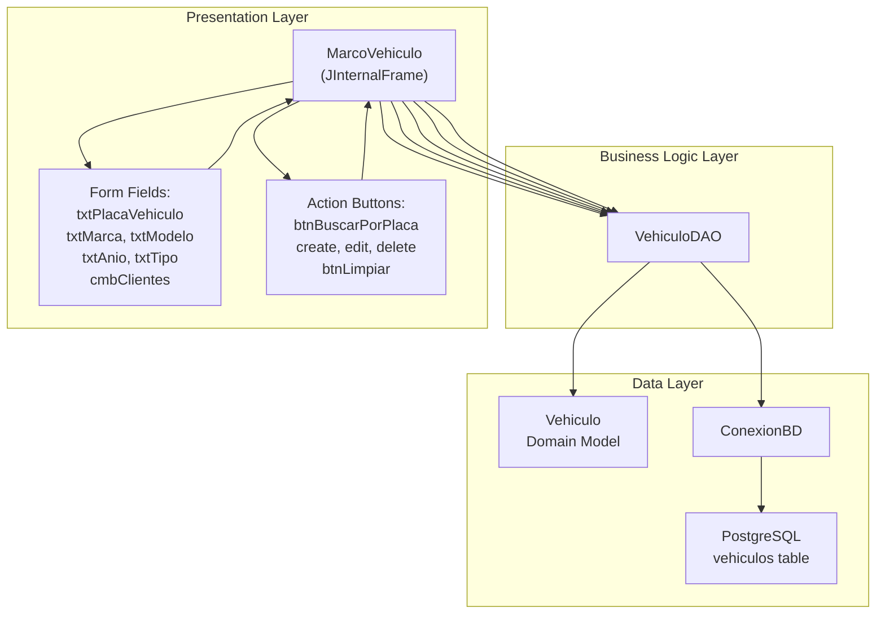
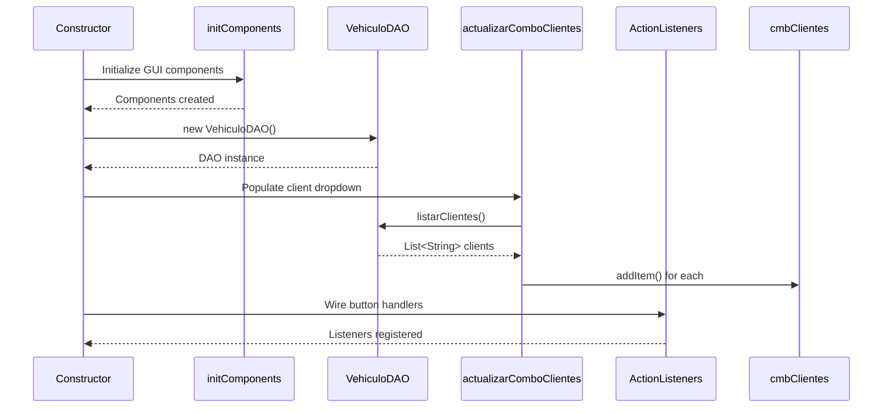
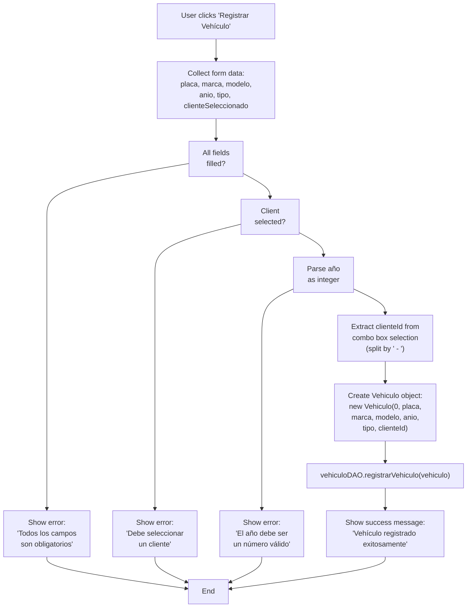
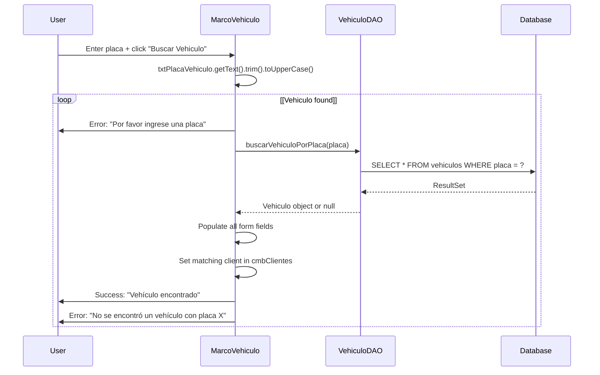
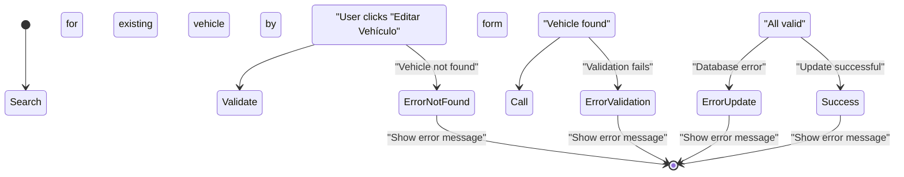
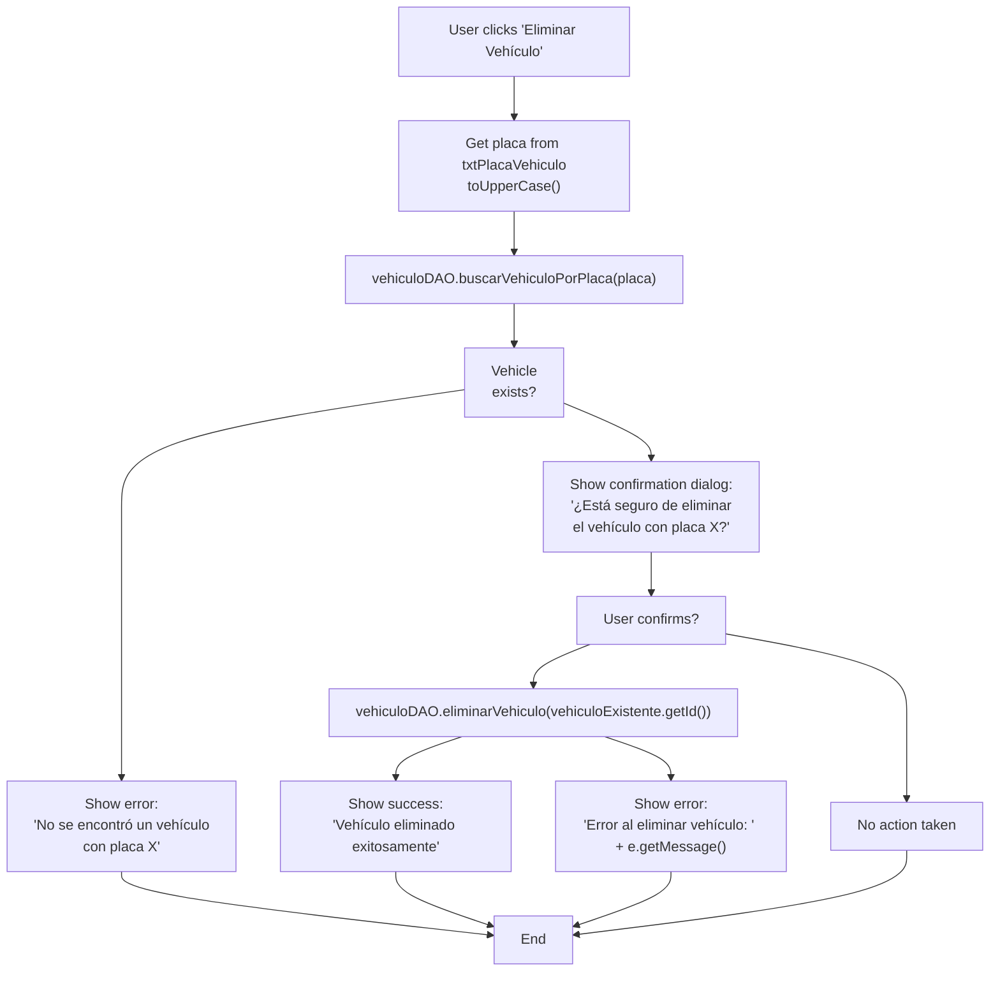

# Operaciones CRUD de vehículos

> **Archivos fuente relevantes**
> * [src/main/java/com/adso/el_taller_de_adso/vehiculos/MarcoVehiculo.form](https://github.com/BrayanTirado/Servicio-Mec-nico/blob/b80161f0/src/main/java/com/adso/el_taller_de_adso/vehiculos/MarcoVehiculo.form)
> * [src/main/java/com/adso/el_taller_de_adso/vehiculos/MarcoVehiculo.java](https://github.com/BrayanTirado/Servicio-Mec-nico/blob/b80161f0/src/main/java/com/adso/el_taller_de_adso/vehiculos/MarcoVehiculo.java)

## Propósito y alcance

Este documento detalla la interfaz de gestión de vehículos ( `MarcoVehiculo`), que proporciona funcionalidad completa de CRUD (Crear, Leer, Actualizar, Eliminar) para los registros de vehículos en el sistema El Taller de ADSO. La interfaz permite a los usuarios registrar nuevos vehículos, buscar vehículos existentes por matrícula, actualizar la información del vehículo y eliminar registros. Todos los registros de vehículos deben estar asociados a un cliente en el sistema.

Para obtener información sobre cómo consultar el historial de servicio del vehículo, consulte [la Interfaz de consulta del vehículo](/BrayanTirado/Servicio-Mec-nico/6.2-vehicle-query-interface) . Para las operaciones de gestión de clientes que controlan las asociaciones de clientes a las que se hace referencia aquí, consulte [la Interfaz de gestión de clientes](/BrayanTirado/Servicio-Mec-nico/7.2-client-management-interface) .

---

## Arquitectura de componentes

Esta `MarcoVehiculo`clase `JInternalFrame`implementa la interfaz CRUD del vehículo dentro del contenedor MDI. Sigue el patrón DAO estándar para el acceso a datos y utiliza NetBeans GUI Builder para la gestión del diseño.



**Fuentes:** [src/main/java/com/adso/el_taller_de_adso/vehiculos/MarcoVehiculo.java L1-L424](https://github.com/BrayanTirado/Servicio-Mec-nico/blob/b80161f0/src/main/java/com/adso/el_taller_de_adso/vehiculos/MarcoVehiculo.java#L1-L424)

---

## Campos de formulario y modelo de datos

El formulario de registro del vehículo captura la siguiente información:

| Nombre del campo | Componente de interfaz de usuario | Tipo de datos | Descripción | Validación |
| --- | --- | --- | --- | --- |
| Placa | `txtPlacaVehiculo` | Cadena | Matrícula del vehículo (identificador principal) | Obligatorio, recortado y convertido a mayúsculas para búsquedas |
| Marca | `txtMarca` | Cadena | Marca/fabricante del vehículo | Obligatorio, recortado |
| Modelo | `txtModelo` | Cadena | Nombre del modelo del vehículo | Obligatorio, recortado |
| Año | `txtAnio` | Entero | Año de fabricación | Obligatorio, debe ser un entero válido |
| Tipo | `txtTipo` | Cadena | Tipo de vehículo (por ejemplo, sedán, SUV, camión) | Obligatorio, recortado |
| Usuario (Cliente) | `cmbClientes` | Cuadro combinado | Cliente/propietario asociado | Obligatorio, seleccionado del menú desplegable |

El `cmbClientes`cuadro combinado se completa durante la inicialización con todos los clientes de la base de datos en el formato: `"<clienteId> - <clienteName>"`.

**Fuentes:** [src/main/java/com/adso/el_taller_de_adso/vehiculos/MarcoVehiculo.java L36-L281](https://github.com/BrayanTirado/Servicio-Mec-nico/blob/b80161f0/src/main/java/com/adso/el_taller_de_adso/vehiculos/MarcoVehiculo.java#L36-L281)

---

## Inicialización y configuración

El `MarcoVehiculo`constructor realiza la siguiente secuencia de inicialización:



El `actualizarComboClientes()`método[src/main/java/com/adso/el_taller_de_adso/vehiculos/MarcoVehiculo.java L275-L281](https://github.com/BrayanTirado/Servicio-Mec-nico/blob/b80161f0/src/main/java/com/adso/el_taller_de_adso/vehiculos/MarcoVehiculo.java#L275-L281)

Recupera todos los clientes de la base de datos y rellena el `cmbClientes`cuadro combinado. Esto garantiza que el menú desplegable siempre contenga los datos actuales del cliente al abrir el formulario.

**Fuentes:** [src/main/java/com/adso/el_taller_de_adso/vehiculos/MarcoVehiculo.java L16-L281](https://github.com/BrayanTirado/Servicio-Mec-nico/blob/b80161f0/src/main/java/com/adso/el_taller_de_adso/vehiculos/MarcoVehiculo.java#L16-L281)

---

## Crear Operación: Registro de Vehículos

El `registrarVehiculo()`método[src/main/java/com/adso/el_taller_de_adso/vehiculos/MarcoVehiculo.java L283-L308](https://github.com/BrayanTirado/Servicio-Mec-nico/blob/b80161f0/src/main/java/com/adso/el_taller_de_adso/vehiculos/MarcoVehiculo.java#L283-L308)

Se encarga del registro de vehículos nuevos.

### Flujo de trabajo de registro



### Lógica de validación de campos

El método de registro realiza la validación en el siguiente orden:

1. **Validación de campos de texto** [src/main/java/com/adso/el_taller_de_adso/vehiculos/MarcoVehiculo.java L285-L290](https://github.com/BrayanTirado/Servicio-Mec-nico/blob/b80161f0/src/main/java/com/adso/el_taller_de_adso/vehiculos/MarcoVehiculo.java#L285-L290) : All text fields are trimmed and checked for empty strings
2. **Empty Check** [src/main/java/com/adso/el_taller_de_adso/vehiculos/MarcoVehiculo.java L292-L295](https://github.com/BrayanTirado/Servicio-Mec-nico/blob/b80161f0/src/main/java/com/adso/el_taller_de_adso/vehiculos/MarcoVehiculo.java#L292-L295) : Validates that `placa`, `marca`, `modelo`, and `tipo` are not empty
3. **Client Selection** [src/main/java/com/adso/el_taller_de_adso/vehiculos/MarcoVehiculo.java L296-L299](https://github.com/BrayanTirado/Servicio-Mec-nico/blob/b80161f0/src/main/java/com/adso/el_taller_de_adso/vehiculos/MarcoVehiculo.java#L296-L299) : Ensures a client is selected from the combo box
4. **Year Parsing** [src/main/java/com/adso/el_taller_de_adso/vehiculos/MarcoVehiculo.java L288-L307](https://github.com/BrayanTirado/Servicio-Mec-nico/blob/b80161f0/src/main/java/com/adso/el_taller_de_adso/vehiculos/MarcoVehiculo.java#L288-L307) : Converts year string to integer, catching `NumberFormatException`

### Client ID Extraction

The selected client string format is `"<id> - <name>"`. The code extracts the ID using: `clienteSeleccionado.split(" - ")[0]` [src/main/java/com/adso/el_taller_de_adso/vehiculos/MarcoVehiculo.java L301](https://github.com/BrayanTirado/Servicio-Mec-nico/blob/b80161f0/src/main/java/com/adso/el_taller_de_adso/vehiculos/MarcoVehiculo.java#L301-L301)

 and parses it to an integer.

### Domain Object Creation

A new `Vehiculo` object is instantiated with ID set to 0 (auto-generated by database) [src/main/java/com/adso/el_taller_de_adso/vehiculos/MarcoVehiculo.java L302](https://github.com/BrayanTirado/Servicio-Mec-nico/blob/b80161f0/src/main/java/com/adso/el_taller_de_adso/vehiculos/MarcoVehiculo.java#L302-L302)

 The DAO layer handles the database insertion and ID generation.

**Sources:** [src/main/java/com/adso/el_taller_de_adso/vehiculos/MarcoVehiculo.java L283-L308](https://github.com/BrayanTirado/Servicio-Mec-nico/blob/b80161f0/src/main/java/com/adso/el_taller_de_adso/vehiculos/MarcoVehiculo.java#L283-L308)

---

## Read Operation: Search by License Plate

The `buscarVehiculoPorPlaca()` method [src/main/java/com/adso/el_taller_de_adso/vehiculos/MarcoVehiculo.java L363-L391](https://github.com/BrayanTirado/Servicio-Mec-nico/blob/b80161f0/src/main/java/com/adso/el_taller_de_adso/vehiculos/MarcoVehiculo.java#L363-L391)

 implements vehicle lookup functionality.

### Search Process



### Form Population Logic

When a vehicle is found, the form fields are populated [src/main/java/com/adso/el_taller_de_adso/vehiculos/MarcoVehiculo.java L372-L384](https://github.com/BrayanTirado/Servicio-Mec-nico/blob/b80161f0/src/main/java/com/adso/el_taller_de_adso/vehiculos/MarcoVehiculo.java#L372-L384)

:

1. **Direct field mapping**: `txtPlacaVehiculo`, `txtMarca`, `txtModelo`, `txtTipo` are set directly from the `Vehiculo` object
2. **Year conversion**: `txtAnio` receives `String.valueOf(vehiculo.getAnio())`
3. **Client selection**: The code iterates through `cmbClientes` items to find the one starting with the vehicle's `clienteId` and sets it as selected [src/main/java/com/adso/el_taller_de_adso/vehiculos/MarcoVehiculo.java L377-L383](https://github.com/BrayanTirado/Servicio-Mec-nico/blob/b80161f0/src/main/java/com/adso/el_taller_de_adso/vehiculos/MarcoVehiculo.java#L377-L383)

### Case-Insensitive Search

The search converts the input placa to uppercase using `.toUpperCase()` [src/main/java/com/adso/el_taller_de_adso/vehiculos/MarcoVehiculo.java L365](https://github.com/BrayanTirado/Servicio-Mec-nico/blob/b80161f0/src/main/java/com/adso/el_taller_de_adso/vehiculos/MarcoVehiculo.java#L365-L365)

 before querying, ensuring case-insensitive lookups.

**Sources:** [src/main/java/com/adso/el_taller_de_adso/vehiculos/MarcoVehiculo.java L363-L391](https://github.com/BrayanTirado/Servicio-Mec-nico/blob/b80161f0/src/main/java/com/adso/el_taller_de_adso/vehiculos/MarcoVehiculo.java#L363-L391)

---

## Update Operation: Edit Vehicle

The `editarVehiculo()` method [src/main/java/com/adso/el_taller_de_adso/vehiculos/MarcoVehiculo.java L310-L342](https://github.com/BrayanTirado/Servicio-Mec-nico/blob/b80161f0/src/main/java/com/adso/el_taller_de_adso/vehiculos/MarcoVehiculo.java#L310-L342)

 modifies existing vehicle records.

### Edit Workflow

The update operation requires a two-phase process:



### Key Differences from Create

| Aspect | Create Operation | Update Operation |
| --- | --- | --- |
| ID handling | Set to 0 (auto-generate) | Uses existing vehicle ID from search |
| Prerequisite | None | Must search for vehicle first |
| Validation | Same field validation | Same + vehicle existence check |
| DAO method | `registrarVehiculo()` | `actualizarVehiculo()` |

### Vehicle Existence Check

The edit method first searches for the existing vehicle [src/main/java/com/adso/el_taller_de_adso/vehiculos/MarcoVehiculo.java L312-L317](https://github.com/BrayanTirado/Servicio-Mec-nico/blob/b80161f0/src/main/java/com/adso/el_taller_de_adso/vehiculos/MarcoVehiculo.java#L312-L317)

:

```
Vehiculo vehiculoExistente = vehiculoDAO.buscarVehiculoPorPlaca(placa);
if (vehiculoExistente == null) {
    // Show error and return
}
```

This ensures the vehicle exists before attempting to update. The existing vehicle's ID is preserved in the updated object [src/main/java/com/adso/el_taller_de_adso/vehiculos/MarcoVehiculo.java L336](https://github.com/BrayanTirado/Servicio-Mec-nico/blob/b80161f0/src/main/java/com/adso/el_taller_de_adso/vehiculos/MarcoVehiculo.java#L336-L336)

: `new Vehiculo(vehiculoExistente.getId(), ...)`.

### Placa Modification

The implementation allows changing the placa itself [src/main/java/com/adso/el_taller_de_adso/vehiculos/MarcoVehiculo.java L319](https://github.com/BrayanTirado/Servicio-Mec-nico/blob/b80161f0/src/main/java/com/adso/el_taller_de_adso/vehiculos/MarcoVehiculo.java#L319-L319)

 The original placa is used to locate the record, but `placaNueva` can be different, effectively allowing license plate updates.

**Sources:** [src/main/java/com/adso/el_taller_de_adso/vehiculos/MarcoVehiculo.java L310-L342](https://github.com/BrayanTirado/Servicio-Mec-nico/blob/b80161f0/src/main/java/com/adso/el_taller_de_adso/vehiculos/MarcoVehiculo.java#L310-L342)

---

## Delete Operation: Remove Vehicle

The `eliminarVehiculo()` method [src/main/java/com/adso/el_taller_de_adso/vehiculos/MarcoVehiculo.java L344-L361](https://github.com/BrayanTirado/Servicio-Mec-nico/blob/b80161f0/src/main/java/com/adso/el_taller_de_adso/vehiculos/MarcoVehiculo.java#L344-L361)

 handles vehicle deletion with confirmation.

### Deletion Flow with Confirmation



### Confirmation Dialog

The system uses `JOptionPane.showConfirmDialog()` [src/main/java/com/adso/el_taller_de_adso/vehiculos/MarcoVehiculo.java L353-L354](https://github.com/BrayanTirado/Servicio-Mec-nico/blob/b80161f0/src/main/java/com/adso/el_taller_de_adso/vehiculos/MarcoVehiculo.java#L353-L354)

 to present a YES/NO confirmation before deletion. Only if the user selects `YES_OPTION` does the deletion proceed.

### Error Handling

The delete operation is wrapped in a try-catch block [src/main/java/com/adso/el_taller_de_adso/vehiculos/MarcoVehiculo.java L358-L360](https://github.com/BrayanTirado/Servicio-Mec-nico/blob/b80161f0/src/main/java/com/adso/el_taller_de_adso/vehiculos/MarcoVehiculo.java#L358-L360)

 to handle potential database errors, such as foreign key constraint violations if the vehicle has associated service records. The exception message is displayed to the user.

**Sources:** [src/main/java/com/adso/el_taller_de_adso/vehiculos/MarcoVehiculo.java L344-L361](https://github.com/BrayanTirado/Servicio-Mec-nico/blob/b80161f0/src/main/java/com/adso/el_taller_de_adso/vehiculos/MarcoVehiculo.java#L344-L361)

---

## Form Management Utilities

### Clear Form Function

The `limpiarFormulario()` method [src/main/java/com/adso/el_taller_de_adso/vehiculos/MarcoVehiculo.java L393-L402](https://github.com/BrayanTirado/Servicio-Mec-nico/blob/b80161f0/src/main/java/com/adso/el_taller_de_adso/vehiculos/MarcoVehiculo.java#L393-L402)

 resets all form fields:

* Establece todos los campos de texto ( `txtPlacaVehiculo`, `txtMarca`, `txtModelo`, `txtAnio`, `txtTipo`) en cadenas vacías
* Se restablece `cmbClientes`al primer elemento si existen elementos
* No se requiere interacción con la base de datos

Esta utilidad se llama después de operaciones exitosas o mediante el `btnLimpiar`botón[src/main/java/com/adso/el_taller_de_adso/vehiculos/MarcoVehiculo.java L23](https://github.com/BrayanTirado/Servicio-Mec-nico/blob/b80161f0/src/main/java/com/adso/el_taller_de_adso/vehiculos/MarcoVehiculo.java#L23-L23)

para preparar el formulario para la nueva entrada de datos.

### Registro de oyentes de acción

Los controladores de botones se registran en el constructor[src/main/java/com/adso/el_taller_de_adso/vehiculos/MarcoVehiculo.java L20-L24](https://github.com/BrayanTirado/Servicio-Mec-nico/blob/b80161f0/src/main/java/com/adso/el_taller_de_adso/vehiculos/MarcoVehiculo.java#L20-L24)

:

```sql
create.addActionListener(e -> registrarVehiculo());
edit.addActionListener(e -> editarVehiculo());
delete.addActionListener(e -> eliminarVehiculo());
btnLimpiar.addActionListener(e -> limpiarFormulario());
btnBuscarPorPlaca.addActionListener(e -> buscarVehiculoPorPlaca());
```

Esto utiliza expresiones lambda para vincular cada botón a su método de operación correspondiente.

**Fuentes:** [src/main/java/com/adso/el_taller_de_adso/vehiculos/MarcoVehiculo.java L20-L402](https://github.com/BrayanTirado/Servicio-Mec-nico/blob/b80161f0/src/main/java/com/adso/el_taller_de_adso/vehiculos/MarcoVehiculo.java#L20-L402)

---

## Integración con otros módulos

### Dependencias de la capa DAO

`MarcoVehiculo`Depende `VehiculoDAO`de todas las operaciones de acceso a datos:

| Método DAO | Objetivo | Tipo de retorno | Llamado desde |
| --- | --- | --- | --- |
| `listarClientes()` | Completar el menú desplegable del cliente | `List<String>` | `actualizarComboClientes()` |
| `registrarVehiculo(Vehiculo)` | Insertar nuevo vehículo | vacío | `registrarVehiculo()` |
| `buscarVehiculoPorPlaca(String)` | Buscar vehículo por placa | `Vehiculo`o nulo | `buscarVehiculoPorPlaca()`, `editarVehiculo()`,`eliminarVehiculo()` |
| `actualizarVehiculo(Vehiculo)` | Actualizar vehículo existente | vacío | `editarVehiculo()` |
| `eliminarVehiculo(int)` | Eliminar vehículo por ID | vacío | `eliminarVehiculo()` |

### Relación del módulo cliente

El `cmbClientes`cuadro combinado crea una dependencia con el módulo Cliente. El formato del cuadro combinado `"<id> - <name>"`requiere coordinación entre ambos módulos `VehiculoDAO.listarClientes()`y la estructura de datos del cliente. Los cambios en el formato de visualización del cliente requerirían actualizaciones en ambos módulos.

### Impacto del historial de servicio

Los vehículos pueden tener registros de servicio asociados. La operación de eliminación puede fallar si las restricciones de clave externa impiden la eliminación de vehículos con historial de servicio. La gestión de errores...[src/main/java/com/adso/el_taller_de_adso/vehiculos/MarcoVehiculo.java L358-L360](https://github.com/BrayanTirado/Servicio-Mec-nico/blob/b80161f0/src/main/java/com/adso/el_taller_de_adso/vehiculos/MarcoVehiculo.java#L358-L360)

Detecta este escenario y muestra el mensaje de error de la base de datos al usuario.

**Fuentes:** [src/main/java/com/adso/el_taller_de_adso/vehiculos/MarcoVehiculo.java L14-L370](https://github.com/BrayanTirado/Servicio-Mec-nico/blob/b80161f0/src/main/java/com/adso/el_taller_de_adso/vehiculos/MarcoVehiculo.java#L14-L370)

---

## Diseño y componentes de la interfaz de usuario

### Integración del generador de GUI de NetBeans

La interfaz de usuario está diseñada utilizando NetBeans GUI Builder, como lo indica el archivo de formulario.[src/main/java/com/adso/el_taller_de_adso/vehiculos/MarcoVehiculo.form L1-L421](https://github.com/BrayanTirado/Servicio-Mec-nico/blob/b80161f0/src/main/java/com/adso/el_taller_de_adso/vehiculos/MarcoVehiculo.form#L1-L421)

y las secciones de código generadas[src/main/java/com/adso/el_taller_de_adso/vehiculos/MarcoVehiculo.java L28-L253](https://github.com/BrayanTirado/Servicio-Mec-nico/blob/b80161f0/src/main/java/com/adso/el_taller_de_adso/vehiculos/MarcoVehiculo.java#L28-L253)

### Declaración de componentes

Todos los componentes de la interfaz de usuario se declaran como variables de instancia privadas[src/main/java/com/adso/el_taller_de_adso/vehiculos/MarcoVehiculo.java L403-L423](https://github.com/BrayanTirado/Servicio-Mec-nico/blob/b80161f0/src/main/java/com/adso/el_taller_de_adso/vehiculos/MarcoVehiculo.java#L403-L423)

:

```java
private javax.swing.JButton btnBuscarPorPlaca;
private javax.swing.JButton btnLimpiar;
private javax.swing.JComboBox<String> cmbClientes;
private javax.swing.JButton create;
private javax.swing.JButton delete;
private javax.swing.JButton edit;
private javax.swing.JTextField txtPlacaVehiculo;
private javax.swing.JTextField txtMarca;
private javax.swing.JTextField txtModelo;
private javax.swing.JTextField txtAnio;
private javax.swing.JTextField txtTipo;
```

### Propiedades de diseño

El marco está configurado como un marco interno con todas las funciones.[src/main/java/com/adso/el_taller_de_adso/vehiculos/MarcoVehiculo.java L52-L55](https://github.com/BrayanTirado/Servicio-Mec-nico/blob/b80161f0/src/main/java/com/adso/el_taller_de_adso/vehiculos/MarcoVehiculo.java#L52-L55)

:

* `closable`:Puede ser cerrado por el usuario
* `iconifiable`:Se puede minimizar
* `maximizable`:Se puede maximizar
* `resizable`:El tamaño se puede ajustar

**Fuentes:** [src/main/java/com/adso/el_taller_de_adso/vehiculos/MarcoVehiculo.java L28-L423](https://github.com/BrayanTirado/Servicio-Mec-nico/blob/b80161f0/src/main/java/com/adso/el_taller_de_adso/vehiculos/MarcoVehiculo.java#L28-L423)

 [src/main/java/com/adso/el_taller_de_adso/vehiculos/MarcoVehiculo.form L1-L421](https://github.com/BrayanTirado/Servicio-Mec-nico/blob/b80161f0/src/main/java/com/adso/el_taller_de_adso/vehiculos/MarcoVehiculo.form#L1-L421)

---

## Patrones de manejo de errores

La implementación utiliza una estrategia de manejo de errores consistente en todas las operaciones:

### Errores de validación de entrada del usuario

Mostrado usando`JOptionPane.ERROR_MESSAGE` [src/main/java/com/adso/el_taller_de_adso/vehiculos/MarcoVehiculo.java L293-L386](https://github.com/BrayanTirado/Servicio-Mec-nico/blob/b80161f0/src/main/java/com/adso/el_taller_de_adso/vehiculos/MarcoVehiculo.java#L293-L386)

:

* Validación de campo vacío
* Falta selección de clientes
* Formato de año no válido
* Vehículo no encontrado

### Confirmaciones de éxito

Mostrado usando`JOptionPane.INFORMATION_MESSAGE` [src/main/java/com/adso/el_taller_de_adso/vehiculos/MarcoVehiculo.java L304-L384](https://github.com/BrayanTirado/Servicio-Mec-nico/blob/b80161f0/src/main/java/com/adso/el_taller_de_adso/vehiculos/MarcoVehiculo.java#L304-L384)

:

* Registro exitoso
* Actualización exitosa
* Eliminación exitosa
* Búsqueda exitosa

### Manejo de excepciones

* `NumberFormatException`:Atrapado al analizar el campo de año[src/main/java/com/adso/el_taller_de_adso/vehiculos/MarcoVehiculo.java L305-L341](https://github.com/BrayanTirado/Servicio-Mec-nico/blob/b80161f0/src/main/java/com/adso/el_taller_de_adso/vehiculos/MarcoVehiculo.java#L305-L341)
* Genérico `Exception`: detectado durante operaciones de búsqueda y eliminación[src/main/java/com/adso/el_taller_de_adso/vehiculos/MarcoVehiculo.java L358-L390](https://github.com/BrayanTirado/Servicio-Mec-nico/blob/b80161f0/src/main/java/com/adso/el_taller_de_adso/vehiculos/MarcoVehiculo.java#L358-L390) para manejar errores inesperados de la base de datos

Todos los mensajes de error se muestran en español para que coincidan con la configuración regional de destino de la aplicación.

**Fuentes:** [src/main/java/com/adso/el_taller_de_adso/vehiculos/MarcoVehiculo.java L293-L390](https://github.com/BrayanTirado/Servicio-Mec-nico/blob/b80161f0/src/main/java/com/adso/el_taller_de_adso/vehiculos/MarcoVehiculo.java#L293-L390)