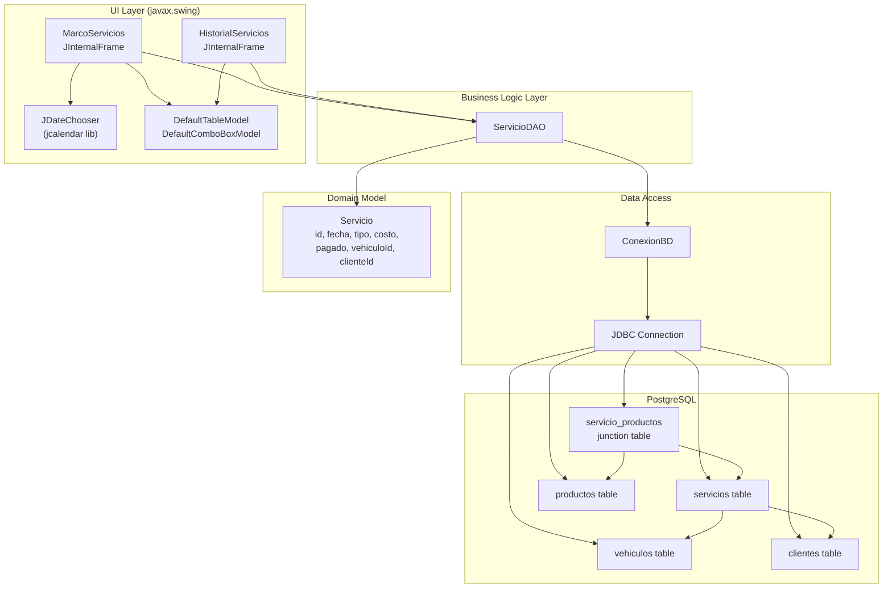
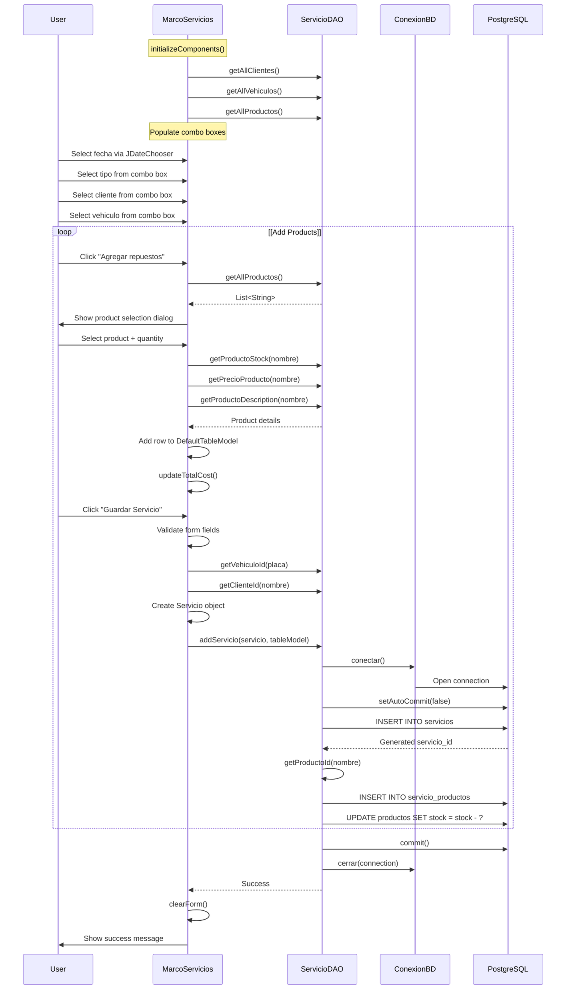
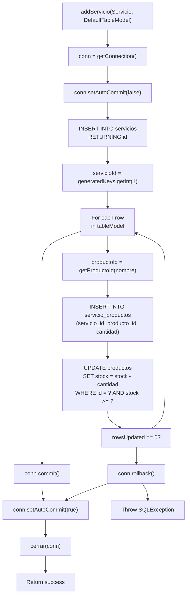

# Service Management Module

> **Relevant source files**
> * [libs/jcalendar-1.4.jar](https://github.com/BrayanTirado/Servicio-Mec-nico/blob/b80161f0/libs/jcalendar-1.4.jar)
> * [src/main/java/com/adso/el_taller_de_adso/ConexionBD.java](https://github.com/BrayanTirado/Servicio-Mec-nico/blob/b80161f0/src/main/java/com/adso/el_taller_de_adso/ConexionBD.java)
> * [src/main/java/com/adso/el_taller_de_adso/servicios/HistorialServicios.form](https://github.com/BrayanTirado/Servicio-Mec-nico/blob/b80161f0/src/main/java/com/adso/el_taller_de_adso/servicios/HistorialServicios.form)
> * [src/main/java/com/adso/el_taller_de_adso/servicios/HistorialServicios.java](https://github.com/BrayanTirado/Servicio-Mec-nico/blob/b80161f0/src/main/java/com/adso/el_taller_de_adso/servicios/HistorialServicios.java)
> * [src/main/java/com/adso/el_taller_de_adso/servicios/MarcoServicios.java](https://github.com/BrayanTirado/Servicio-Mec-nico/blob/b80161f0/src/main/java/com/adso/el_taller_de_adso/servicios/MarcoServicios.java)
> * [src/main/java/com/adso/el_taller_de_adso/servicios/Servicio.java](https://github.com/BrayanTirado/Servicio-Mec-nico/blob/b80161f0/src/main/java/com/adso/el_taller_de_adso/servicios/Servicio.java)
> * [src/main/java/com/adso/el_taller_de_adso/servicios/ServicioDAO.java](https://github.com/BrayanTirado/Servicio-Mec-nico/blob/b80161f0/src/main/java/com/adso/el_taller_de_adso/servicios/ServicioDAO.java)

## Purpose and Scope

This document provides an overview of the Service Management Module, which enables users to record mechanical services performed on vehicles and track service history. The module consists of two primary user interfaces: a service creation form with product association capabilities and a historical service viewer. This page describes the architectural components, data models, and workflows common to both interfaces.

For detailed documentation of service creation workflows, see [Creating Services](/BrayanTirado/Servicio-Mec-nico/4.1-creating-services). For service history retrieval and display, see [Service History Viewer](/BrayanTirado/Servicio-Mec-nico/4.2-service-history-viewer). For database connection management and DAO patterns used throughout this module, see [Database Layer](/BrayanTirado/Servicio-Mec-nico/3.2-database-layer).

**Sources:** [src/main/java/com/adso/el_taller_de_adso/servicios/MarcoServicios.java L1-L363](https://github.com/BrayanTirado/Servicio-Mec-nico/blob/b80161f0/src/main/java/com/adso/el_taller_de_adso/servicios/MarcoServicios.java#L1-L363)

 [src/main/java/com/adso/el_taller_de_adso/servicios/HistorialServicios.java L1-L186](https://github.com/BrayanTirado/Servicio-Mec-nico/blob/b80161f0/src/main/java/com/adso/el_taller_de_adso/servicios/HistorialServicios.java#L1-L186)

## Module Components

The Service Management Module is composed of four main code entities organized within the `com.adso.el_taller_de_adso.servicios` package:

| Component | Type | File | Primary Responsibility |
| --- | --- | --- | --- |
| `MarcoServicios` | JInternalFrame | MarcoServicios.java | Service creation UI with product selection |
| `HistorialServicios` | JInternalFrame | HistorialServicios.java | Service history query and display UI |
| `ServicioDAO` | Data Access Object | ServicioDAO.java | Database operations for services |
| `Servicio` | Domain Model | Servicio.java | Service entity representation |

Both UI components operate as `JInternalFrame` instances launched from the main application's Services menu and displayed within the `JDesktopPane` container of `AplicacionPrincipal`.

**Sources:** [src/main/java/com/adso/el_taller_de_adso/servicios/MarcoServicios.java L19-L30](https://github.com/BrayanTirado/Servicio-Mec-nico/blob/b80161f0/src/main/java/com/adso/el_taller_de_adso/servicios/MarcoServicios.java#L19-L30)

 [src/main/java/com/adso/el_taller_de_adso/servicios/HistorialServicios.java L19-L30](https://github.com/BrayanTirado/Servicio-Mec-nico/blob/b80161f0/src/main/java/com/adso/el_taller_de_adso/servicios/HistorialServicios.java#L19-L30)

 [src/main/java/com/adso/el_taller_de_adso/servicios/ServicioDAO.java L1-L16](https://github.com/BrayanTirado/Servicio-Mec-nico/blob/b80161f0/src/main/java/com/adso/el_taller_de_adso/servicios/ServicioDAO.java#L1-L16)

 [src/main/java/com/adso/el_taller_de_adso/servicios/Servicio.java L1-L74](https://github.com/BrayanTirado/Servicio-Mec-nico/blob/b80161f0/src/main/java/com/adso/el_taller_de_adso/servicios/Servicio.java#L1-L74)

## Module Architecture

The following diagram illustrates the component relationships and dependencies within the Service Management Module:



**Component Interactions:**

* **MarcoServicios** populates combo boxes by calling `ServicioDAO.getAllClientes()`, `getAllVehiculos()`, and `getAllProductos()` at initialization [src/main/java/com/adso/el_taller_de_adso/servicios/MarcoServicios.java L32-L36](https://github.com/BrayanTirado/Servicio-Mec-nico/blob/b80161f0/src/main/java/com/adso/el_taller_de_adso/servicios/MarcoServicios.java#L32-L36)
* **HistorialServicios** loads vehicle selection via `ServicioDAO.getAllVehiculos()` and retrieves history via `getServiciosByVehiculo(int)` [src/main/java/com/adso/el_taller_de_adso/servicios/HistorialServicios.java L32-L43](https://github.com/BrayanTirado/Servicio-Mec-nico/blob/b80161f0/src/main/java/com/adso/el_taller_de_adso/servicios/HistorialServicios.java#L32-L43)
* **ServicioDAO** obtains connections through `ConexionBD.conectar()` for all database operations [src/main/java/com/adso/el_taller_de_adso/servicios/ServicioDAO.java L18-L20](https://github.com/BrayanTirado/Servicio-Mec-nico/blob/b80161f0/src/main/java/com/adso/el_taller_de_adso/servicios/ServicioDAO.java#L18-L20)
* **ConexionBD** manages PostgreSQL connection lifecycle with static methods `conectar()` and `cerrar()` [src/main/java/com/adso/el_taller_de_adso/ConexionBD.java L16-L41](https://github.com/BrayanTirado/Servicio-Mec-nico/blob/b80161f0/src/main/java/com/adso/el_taller_de_adso/ConexionBD.java#L16-L41)

**Sources:** [src/main/java/com/adso/el_taller_de_adso/servicios/MarcoServicios.java L19-L41](https://github.com/BrayanTirado/Servicio-Mec-nico/blob/b80161f0/src/main/java/com/adso/el_taller_de_adso/servicios/MarcoServicios.java#L19-L41)

 [src/main/java/com/adso/el_taller_de_adso/servicios/HistorialServicios.java L19-L44](https://github.com/BrayanTirado/Servicio-Mec-nico/blob/b80161f0/src/main/java/com/adso/el_taller_de_adso/servicios/HistorialServicios.java#L19-L44)

 [src/main/java/com/adso/el_taller_de_adso/servicios/ServicioDAO.java L1-L300](https://github.com/BrayanTirado/Servicio-Mec-nico/blob/b80161f0/src/main/java/com/adso/el_taller_de_adso/servicios/ServicioDAO.java#L1-L300)

 [src/main/java/com/adso/el_taller_de_adso/ConexionBD.java L1-L42](https://github.com/BrayanTirado/Servicio-Mec-nico/blob/b80161f0/src/main/java/com/adso/el_taller_de_adso/ConexionBD.java#L1-L42)

## Domain Model: Servicio Class

The `Servicio` class represents a service record as a Plain Old Java Object (POJO) with no business logic. It contains seven fields mapped to the `servicios` database table:

| Field | Type | Database Column | Description |
| --- | --- | --- | --- |
| `id` | `int` | `id` | Primary key, auto-generated |
| `fecha` | `java.sql.Date` | `fecha` | Service date |
| `tipo` | `String` | `tipo` | Service type (e.g., "cambio de aceite", "lavado", "mantenimiento general") |
| `costo` | `double` | `costo` | Total service cost including products |
| `pagado` | `boolean` | `pagado` | Payment status flag |
| `vehiculoId` | `int` | `vehiculo_id` | Foreign key to vehiculos table |
| `clienteId` | `int` | `cliente_id` | Foreign key to clientes table |

The class provides standard getter/setter methods for all fields [src/main/java/com/adso/el_taller_de_adso/servicios/Servicio.java L18-L73](https://github.com/BrayanTirado/Servicio-Mec-nico/blob/b80161f0/src/main/java/com/adso/el_taller_de_adso/servicios/Servicio.java#L18-L73)

 It does not implement validation logic or business rules; validation is performed in the UI layer (`MarcoServicios`) before persisting.

**Sources:** [src/main/java/com/adso/el_taller_de_adso/servicios/Servicio.java L1-L74](https://github.com/BrayanTirado/Servicio-Mec-nico/blob/b80161f0/src/main/java/com/adso/el_taller_de_adso/servicios/Servicio.java#L1-L74)

## Database Schema and Relationships

The following diagram shows the database tables involved in service management and their relationships:

```css
#mermaid-a4r87u4jxqq{font-family:ui-sans-serif,-apple-system,system-ui,Segoe UI,Helvetica;font-size:16px;fill:#333;}@keyframes edge-animation-frame{from{stroke-dashoffset:0;}}@keyframes dash{to{stroke-dashoffset:0;}}#mermaid-a4r87u4jxqq .edge-animation-slow{stroke-dasharray:9,5!important;stroke-dashoffset:900;animation:dash 50s linear infinite;stroke-linecap:round;}#mermaid-a4r87u4jxqq .edge-animation-fast{stroke-dasharray:9,5!important;stroke-dashoffset:900;animation:dash 20s linear infinite;stroke-linecap:round;}#mermaid-a4r87u4jxqq .error-icon{fill:#dddddd;}#mermaid-a4r87u4jxqq .error-text{fill:#222222;stroke:#222222;}#mermaid-a4r87u4jxqq .edge-thickness-normal{stroke-width:1px;}#mermaid-a4r87u4jxqq .edge-thickness-thick{stroke-width:3.5px;}#mermaid-a4r87u4jxqq .edge-pattern-solid{stroke-dasharray:0;}#mermaid-a4r87u4jxqq .edge-thickness-invisible{stroke-width:0;fill:none;}#mermaid-a4r87u4jxqq .edge-pattern-dashed{stroke-dasharray:3;}#mermaid-a4r87u4jxqq .edge-pattern-dotted{stroke-dasharray:2;}#mermaid-a4r87u4jxqq .marker{fill:#999;stroke:#999;}#mermaid-a4r87u4jxqq .marker.cross{stroke:#999;}#mermaid-a4r87u4jxqq svg{font-family:ui-sans-serif,-apple-system,system-ui,Segoe UI,Helvetica;font-size:16px;}#mermaid-a4r87u4jxqq p{margin:0;}#mermaid-a4r87u4jxqq .entityBox{fill:#ffffff;stroke:#dddddd;}#mermaid-a4r87u4jxqq .relationshipLabelBox{fill:#dddddd;opacity:0.7;background-color:#dddddd;}#mermaid-a4r87u4jxqq .relationshipLabelBox rect{opacity:0.5;}#mermaid-a4r87u4jxqq .labelBkg{background-color:rgba(221, 221, 221, 0.5);}#mermaid-a4r87u4jxqq .edgeLabel .label{fill:#dddddd;font-size:14px;}#mermaid-a4r87u4jxqq .label{font-family:ui-sans-serif,-apple-system,system-ui,Segoe UI,Helvetica;color:#333;}#mermaid-a4r87u4jxqq .edge-pattern-dashed{stroke-dasharray:8,8;}#mermaid-a4r87u4jxqq .node rect,#mermaid-a4r87u4jxqq .node circle,#mermaid-a4r87u4jxqq .node ellipse,#mermaid-a4r87u4jxqq .node polygon{fill:#ffffff;stroke:#dddddd;stroke-width:1px;}#mermaid-a4r87u4jxqq .relationshipLine{stroke:#999;stroke-width:1;fill:none;}#mermaid-a4r87u4jxqq .marker{fill:none!important;stroke:#999!important;stroke-width:1;}#mermaid-a4r87u4jxqq :root{--mermaid-font-family:"trebuchet ms",verdana,arial,sans-serif;}has manybelongs tobelongs toreferencesserviciosintidPKdatefechastringtipodoublecostobooleanpagadointvehiculo_idFKintcliente_idFKservicio_productosintservicio_idFKintproducto_idFKintcantidadvehiculosintidPKstringplacastringmarcastringmodelointañostringtipointcliente_idFKclientesintidPKstringnombrestringdocumentostringtelefonostringcorreointrol_idFKproductosintidPKstringnombrestringdescripciondoublepreciointstock
```

**Key Schema Characteristics:**

1. **servicios table**: Core service record with foreign keys to vehiculos and clientes
2. **servicio_productos junction table**: Many-to-many relationship between services and products, includes `cantidad` field for quantity used
3. **vehiculos and clientes tables**: Referenced to associate services with specific vehicles and customers
4. **productos table**: Inventory items that can be included in services; stock is decremented during service creation

The `ServicioDAO.addServicio()` method performs atomic insertions into both `servicios` and `servicio_productos` tables within a single transaction [src/main/java/com/adso/el_taller_de_adso/servicios/ServicioDAO.java L205-L264](https://github.com/BrayanTirado/Servicio-Mec-nico/blob/b80161f0/src/main/java/com/adso/el_taller_de_adso/servicios/ServicioDAO.java#L205-L264)

**Sources:** [src/main/java/com/adso/el_taller_de_adso/servicios/ServicioDAO.java L22-L45](https://github.com/BrayanTirado/Servicio-Mec-nico/blob/b80161f0/src/main/java/com/adso/el_taller_de_adso/servicios/ServicioDAO.java#L22-L45)

 [src/main/java/com/adso/el_taller_de_adso/servicios/ServicioDAO.java L205-L264](https://github.com/BrayanTirado/Servicio-Mec-nico/blob/b80161f0/src/main/java/com/adso/el_taller_de_adso/servicios/ServicioDAO.java#L205-L264)

## Service Creation Workflow

The service creation process follows a multi-step user interaction pattern with progressive data accumulation:



**Key Workflow Steps:**

1. **Initialization**: Combo boxes are populated with client names, vehicle plates, and product names from database [src/main/java/com/adso/el_taller_de_adso/servicios/MarcoServicios.java L32-L40](https://github.com/BrayanTirado/Servicio-Mec-nico/blob/b80161f0/src/main/java/com/adso/el_taller_de_adso/servicios/MarcoServicios.java#L32-L40)
2. **Form Data Entry**: User selects date via `JDateChooser`, service type, client, and vehicle from pre-populated combo boxes
3. **Product Selection**: User clicks "Agregar repuestos" button, triggering a modal dialog for product selection [src/main/java/com/adso/el_taller_de_adso/servicios/MarcoServicios.java L279-L307](https://github.com/BrayanTirado/Servicio-Mec-nico/blob/b80161f0/src/main/java/com/adso/el_taller_de_adso/servicios/MarcoServicios.java#L279-L307)
4. **Stock Validation**: Before adding a product to the table, stock availability is checked via `getProductoStock()` [src/main/java/com/adso/el_taller_de_adso/servicios/MarcoServicios.java L290-L299](https://github.com/BrayanTirado/Servicio-Mec-nico/blob/b80161f0/src/main/java/com/adso/el_taller_de_adso/servicios/MarcoServicios.java#L290-L299)
5. **Cost Calculation**: The `updateTotalCost()` method recalculates the total by summing `price * quantity` for all table rows [src/main/java/com/adso/el_taller_de_adso/servicios/MarcoServicios.java L315-L332](https://github.com/BrayanTirado/Servicio-Mec-nico/blob/b80161f0/src/main/java/com/adso/el_taller_de_adso/servicios/MarcoServicios.java#L315-L332)
6. **Transactional Save**: The `addServicio()` method wraps service and product insertions in a database transaction [src/main/java/com/adso/el_taller_de_adso/servicios/ServicioDAO.java L205-L264](https://github.com/BrayanTirado/Servicio-Mec-nico/blob/b80161f0/src/main/java/com/adso/el_taller_de_adso/servicios/ServicioDAO.java#L205-L264)

**Sources:** [src/main/java/com/adso/el_taller_de_adso/servicios/MarcoServicios.java L27-L341](https://github.com/BrayanTirado/Servicio-Mec-nico/blob/b80161f0/src/main/java/com/adso/el_taller_de_adso/servicios/MarcoServicios.java#L27-L341)

 [src/main/java/com/adso/el_taller_de_adso/servicios/ServicioDAO.java L205-L264](https://github.com/BrayanTirado/Servicio-Mec-nico/blob/b80161f0/src/main/java/com/adso/el_taller_de_adso/servicios/ServicioDAO.java#L205-L264)

## Transaction Management

The `ServicioDAO.addServicio()` method implements explicit transaction control to ensure atomicity when creating a service with multiple products:



**Transaction Lifecycle:**

1. **Begin Transaction**: `conn.setAutoCommit(false)` disables auto-commit mode [src/main/java/com/adso/el_taller_de_adso/servicios/ServicioDAO.java L208](https://github.com/BrayanTirado/Servicio-Mec-nico/blob/b80161f0/src/main/java/com/adso/el_taller_de_adso/servicios/ServicioDAO.java#L208-L208)
2. **Service Insertion**: `INSERT INTO servicios` returns the generated `servicio_id` via `Statement.RETURN_GENERATED_KEYS` [src/main/java/com/adso/el_taller_de_adso/servicios/ServicioDAO.java L211-L228](https://github.com/BrayanTirado/Servicio-Mec-nico/blob/b80161f0/src/main/java/com/adso/el_taller_de_adso/servicios/ServicioDAO.java#L211-L228)
3. **Product Association Loop**: For each product in the table model: * Insert into `servicio_productos` junction table [src/main/java/com/adso/el_taller_de_adso/servicios/ServicioDAO.java L231-L252](https://github.com/BrayanTirado/Servicio-Mec-nico/blob/b80161f0/src/main/java/com/adso/el_taller_de_adso/servicios/ServicioDAO.java#L231-L252) * Decrement stock via `updateStock()` method [src/main/java/com/adso/el_taller_de_adso/servicios/ServicioDAO.java L247](https://github.com/BrayanTirado/Servicio-Mec-nico/blob/b80161f0/src/main/java/com/adso/el_taller_de_adso/servicios/ServicioDAO.java#L247-L247)
4. **Stock Validation**: The `UPDATE productos SET stock = stock - ? WHERE id = ? AND stock >= ?` statement atomically checks and decrements stock [src/main/java/com/adso/el_taller_de_adso/servicios/ServicioDAO.java L286-L287](https://github.com/BrayanTirado/Servicio-Mec-nico/blob/b80161f0/src/main/java/com/adso/el_taller_de_adso/servicios/ServicioDAO.java#L286-L287)
5. **Commit or Rollback**: If `rowsUpdated == 0`, insufficient stock exists and the entire transaction rolls back [src/main/java/com/adso/el_taller_de_adso/servicios/ServicioDAO.java L292-L295](https://github.com/BrayanTirado/Servicio-Mec-nico/blob/b80161f0/src/main/java/com/adso/el_taller_de_adso/servicios/ServicioDAO.java#L292-L295)
6. **Cleanup**: Auto-commit is restored and connection is closed in the finally block [src/main/java/com/adso/el_taller_de_adso/servicios/ServicioDAO.java L260-L263](https://github.com/BrayanTirado/Servicio-Mec-nico/blob/b80161f0/src/main/java/com/adso/el_taller_de_adso/servicios/ServicioDAO.java#L260-L263)

**Sources:** [src/main/java/com/adso/el_taller_de_adso/servicios/ServicioDAO.java L205-L264](https://github.com/BrayanTirado/Servicio-Mec-nico/blob/b80161f0/src/main/java/com/adso/el_taller_de_adso/servicios/ServicioDAO.java#L205-L264)

 [src/main/java/com/adso/el_taller_de_adso/servicios/ServicioDAO.java L285-L299](https://github.com/BrayanTirado/Servicio-Mec-nico/blob/b80161f0/src/main/java/com/adso/el_taller_de_adso/servicios/ServicioDAO.java#L285-L299)

## Service History Retrieval

The `HistorialServicios` frame queries service records by vehicle using a simplified workflow:

```

```

**Implementation Details:**

1. **Vehicle Selection**: The combo box is populated with vehicle plates during initialization [src/main/java/com/adso/el_taller_de_adso/servicios/HistorialServicios.java L36-L37](https://github.com/BrayanTirado/Servicio-Mec-nico/blob/b80161f0/src/main/java/com/adso/el_taller_de_adso/servicios/HistorialServicios.java#L36-L37)
2. **ID Resolution**: The selected vehicle plate is converted to a database ID via `ServicioDAO.getVehiculoId()` [src/main/java/com/adso/el_taller_de_adso/servicios/HistorialServicios.java L147](https://github.com/BrayanTirado/Servicio-Mec-nico/blob/b80161f0/src/main/java/com/adso/el_taller_de_adso/servicios/HistorialServicios.java#L147-L147)
3. **Service Query**: `getServiciosByVehiculo(int)` executes `SELECT id, fecha, tipo, costo FROM servicios WHERE vehiculo_id = ?` [src/main/java/com/adso/el_taller_de_adso/servicios/ServicioDAO.java L28-L30](https://github.com/BrayanTirado/Servicio-Mec-nico/blob/b80161f0/src/main/java/com/adso/el_taller_de_adso/servicios/ServicioDAO.java#L28-L30)
4. **Table Population**: The `updateTable()` method clears existing rows and adds a row for each returned `Servicio` object [src/main/java/com/adso/el_taller_de_adso/servicios/HistorialServicios.java L164-L174](https://github.com/BrayanTirado/Servicio-Mec-nico/blob/b80161f0/src/main/java/com/adso/el_taller_de_adso/servicios/HistorialServicios.java#L164-L174)

The table columns are configured as: `["ID Servicio", "Fecha", "Tipo", "Costo"]` [src/main/java/com/adso/el_taller_de_adso/servicios/HistorialServicios.java L41](https://github.com/BrayanTirado/Servicio-Mec-nico/blob/b80161f0/src/main/java/com/adso/el_taller_de_adso/servicios/HistorialServicios.java#L41-L41)

**Sources:** [src/main/java/com/adso/el_taller_de_adso/servicios/HistorialServicios.java L27-L174](https://github.com/BrayanTirado/Servicio-Mec-nico/blob/b80161f0/src/main/java/com/adso/el_taller_de_adso/servicios/HistorialServicios.java#L27-L174)

 [src/main/java/com/adso/el_taller_de_adso/servicios/ServicioDAO.java L22-L45](https://github.com/BrayanTirado/Servicio-Mec-nico/blob/b80161f0/src/main/java/com/adso/el_taller_de_adso/servicios/ServicioDAO.java#L22-L45)

## DAO Method Summary

The `ServicioDAO` class provides the following public methods for service management operations:

| Method | Return Type | Parameters | Purpose |
| --- | --- | --- | --- |
| `getServiciosByVehiculo()` | `List<Servicio>` | `int vehicleId` | Retrieve all services for a specific vehicle |
| `getAllClientes()` | `List<String>` | None | Get all client names for combo box population |
| `getAllVehiculos()` | `List<String>` | None | Get all vehicle plates for combo box population |
| `getAllProductos()` | `List<String>` | None | Get all product names for selection dialogs |
| `getPrecioProducto()` | `double` | `String nombre` | Retrieve product price by name |
| `getProductoDescription()` | `String` | `String nombre` | Retrieve product description by name |
| `getProductoStock()` | `int` | `String nombre` | Get current stock level for a product |
| `getClienteId()` | `int` | `String nombre` | Convert client name to database ID |
| `getVehiculoId()` | `int` | `String placa` | Convert vehicle plate to database ID |
| `getProductoId()` | `int` | `String nombre` | Convert product name to database ID |
| `addServicio()` | `void` | `Servicio, DefaultTableModel` | Transactionally insert service with products |

All methods use the private `getConnection()` helper to obtain connections via `ConexionBD.conectar()` [src/main/java/com/adso/el_taller_de_adso/servicios/ServicioDAO.java L18-L20](https://github.com/BrayanTirado/Servicio-Mec-nico/blob/b80161f0/src/main/java/com/adso/el_taller_de_adso/servicios/ServicioDAO.java#L18-L20)

 and close connections via `ConexionBD.cerrar()` in finally blocks to prevent resource leaks.

**Sources:** [src/main/java/com/adso/el_taller_de_adso/servicios/ServicioDAO.java L1-L300](https://github.com/BrayanTirado/Servicio-Mec-nico/blob/b80161f0/src/main/java/com/adso/el_taller_de_adso/servicios/ServicioDAO.java#L1-L300)

## Error Handling Patterns

The module employs two distinct error handling strategies depending on the component layer:

**DAO Layer:**

* `addServicio()` uses rollback on exceptions and re-throws `SQLException` to the caller [src/main/java/com/adso/el_taller_de_adso/servicios/ServicioDAO.java L256-L259](https://github.com/BrayanTirado/Servicio-Mec-nico/blob/b80161f0/src/main/java/com/adso/el_taller_de_adso/servicios/ServicioDAO.java#L256-L259)
* Query methods catch and print stack traces, returning empty lists or default values (`-1`, `0.0`, `null`) on failure [src/main/java/com/adso/el_taller_de_adso/servicios/ServicioDAO.java L58-L62](https://github.com/BrayanTirado/Servicio-Mec-nico/blob/b80161f0/src/main/java/com/adso/el_taller_de_adso/servicios/ServicioDAO.java#L58-L62)

**UI Layer:**

* `MarcoServicios` displays validation errors via `JOptionPane.showMessageDialog()` before database operations [src/main/java/com/adso/el_taller_de_adso/servicios/MarcoServicios.java L250-L258](https://github.com/BrayanTirado/Servicio-Mec-nico/blob/b80161f0/src/main/java/com/adso/el_taller_de_adso/servicios/MarcoServicios.java#L250-L258)
* Catch blocks in button handlers show error dialogs with exception messages [src/main/java/com/adso/el_taller_de_adso/servicios/MarcoServicios.java L274-L276](https://github.com/BrayanTirado/Servicio-Mec-nico/blob/b80161f0/src/main/java/com/adso/el_taller_de_adso/servicios/MarcoServicios.java#L274-L276)
* `HistorialServicios` uses try-catch around `getServiciosByVehiculo()` with logging [src/main/java/com/adso/el_taller_de_adso/servicios/HistorialServicios.java L149-L154](https://github.com/BrayanTirado/Servicio-Mec-nico/blob/b80161f0/src/main/java/com/adso/el_taller_de_adso/servicios/HistorialServicios.java#L149-L154)

**Sources:** [src/main/java/com/adso/el_taller_de_adso/servicios/ServicioDAO.java L256-L259](https://github.com/BrayanTirado/Servicio-Mec-nico/blob/b80161f0/src/main/java/com/adso/el_taller_de_adso/servicios/ServicioDAO.java#L256-L259)

 [src/main/java/com/adso/el_taller_de_adso/servicios/MarcoServicios.java L248-L277](https://github.com/BrayanTirado/Servicio-Mec-nico/blob/b80161f0/src/main/java/com/adso/el_taller_de_adso/servicios/MarcoServicios.java#L248-L277)

 [src/main/java/com/adso/el_taller_de_adso/servicios/HistorialServicios.java L143-L162](https://github.com/BrayanTirado/Servicio-Mec-nico/blob/b80161f0/src/main/java/com/adso/el_taller_de_adso/servicios/HistorialServicios.java#L143-L162)

## UI Form Lifecycle

Both `MarcoServicios` and `HistorialServicios` follow a common initialization pattern:

1. **Constructor**: Calls `initComponents()` (auto-generated by NetBeans GUI Builder) followed by custom `initializeComponents()` [src/main/java/com/adso/el_taller_de_adso/servicios/MarcoServicios.java L27-L30](https://github.com/BrayanTirado/Servicio-Mec-nico/blob/b80161f0/src/main/java/com/adso/el_taller_de_adso/servicios/MarcoServicios.java#L27-L30)
2. **initComponents()**: Sets up Swing components, layout, and event listeners (lines enclosed in `//GEN-BEGIN` and `//GEN-END` comments should not be manually edited)
3. **initializeComponents()**: Performs database-driven initialization such as populating combo boxes with DAO queries [src/main/java/com/adso/el_taller_de_adso/servicios/MarcoServicios.java L32-L41](https://github.com/BrayanTirado/Servicio-Mec-nico/blob/b80161f0/src/main/java/com/adso/el_taller_de_adso/servicios/MarcoServicios.java#L32-L41)

`MarcoServicios` additionally implements a `clearForm()` method to reset all fields after successful service creation [src/main/java/com/adso/el_taller_de_adso/servicios/MarcoServicios.java L334-L341](https://github.com/BrayanTirado/Servicio-Mec-nico/blob/b80161f0/src/main/java/com/adso/el_taller_de_adso/servicios/MarcoServicios.java#L334-L341)

**Sources:** [src/main/java/com/adso/el_taller_de_adso/servicios/MarcoServicios.java L27-L41](https://github.com/BrayanTirado/Servicio-Mec-nico/blob/b80161f0/src/main/java/com/adso/el_taller_de_adso/servicios/MarcoServicios.java#L27-L41)

 [src/main/java/com/adso/el_taller_de_adso/servicios/MarcoServicios.java L334-L341](https://github.com/BrayanTirado/Servicio-Mec-nico/blob/b80161f0/src/main/java/com/adso/el_taller_de_adso/servicios/MarcoServicios.java#L334-L341)

 [src/main/java/com/adso/el_taller_de_adso/servicios/HistorialServicios.java L27-L44](https://github.com/BrayanTirado/Servicio-Mec-nico/blob/b80161f0/src/main/java/com/adso/el_taller_de_adso/servicios/HistorialServicios.java#L27-L44)

## Dependencies on External Libraries

The Service Management Module relies on the following third-party libraries:

| Library | Component | Usage |
| --- | --- | --- |
| JCalendar 1.4 | `com.toedter.calendar.JDateChooser` | Date picker widget in `MarcoServicios` [src/main/java/com/adso/el_taller_de_adso/servicios/MarcoServicios.java L69](https://github.com/BrayanTirado/Servicio-Mec-nico/blob/b80161f0/src/main/java/com/adso/el_taller_de_adso/servicios/MarcoServicios.java#L69-L69) |
| PostgreSQL JDBC 42.7.1 | `java.sql.*` | Database connectivity via `ConexionBD` [src/main/java/com/adso/el_taller_de_adso/ConexionBD.java L12](https://github.com/BrayanTirado/Servicio-Mec-nico/blob/b80161f0/src/main/java/com/adso/el_taller_de_adso/ConexionBD.java#L12-L12) |
| Java Swing | `javax.swing.*` | UI framework for all components |

The JCalendar component is configured with preferred size `(150, 22)` [src/main/java/com/adso/el_taller_de_adso/servicios/MarcoServicios.java L136](https://github.com/BrayanTirado/Servicio-Mec-nico/blob/b80161f0/src/main/java/com/adso/el_taller_de_adso/servicios/MarcoServicios.java#L136-L136)

 and date values are converted to `java.sql.Date` via `new Date(jDateChooserfechadelservicio.getDate().getTime())` [src/main/java/com/adso/el_taller_de_adso/servicios/MarcoServicios.java L261](https://github.com/BrayanTirado/Servicio-Mec-nico/blob/b80161f0/src/main/java/com/adso/el_taller_de_adso/servicios/MarcoServicios.java#L261-L261)

**Sources:** [src/main/java/com/adso/el_taller_de_adso/servicios/MarcoServicios.java L7](https://github.com/BrayanTirado/Servicio-Mec-nico/blob/b80161f0/src/main/java/com/adso/el_taller_de_adso/servicios/MarcoServicios.java#L7-L7)

 [src/main/java/com/adso/el_taller_de_adso/servicios/MarcoServicios.java L69](https://github.com/BrayanTirado/Servicio-Mec-nico/blob/b80161f0/src/main/java/com/adso/el_taller_de_adso/servicios/MarcoServicios.java#L69-L69)

 [src/main/java/com/adso/el_taller_de_adso/servicios/MarcoServicios.java L136](https://github.com/BrayanTirado/Servicio-Mec-nico/blob/b80161f0/src/main/java/com/adso/el_taller_de_adso/servicios/MarcoServicios.java#L136-L136)

 [src/main/java/com/adso/el_taller_de_adso/ConexionBD.java L1-L42](https://github.com/BrayanTirado/Servicio-Mec-nico/blob/b80161f0/src/main/java/com/adso/el_taller_de_adso/ConexionBD.java#L1-L42)