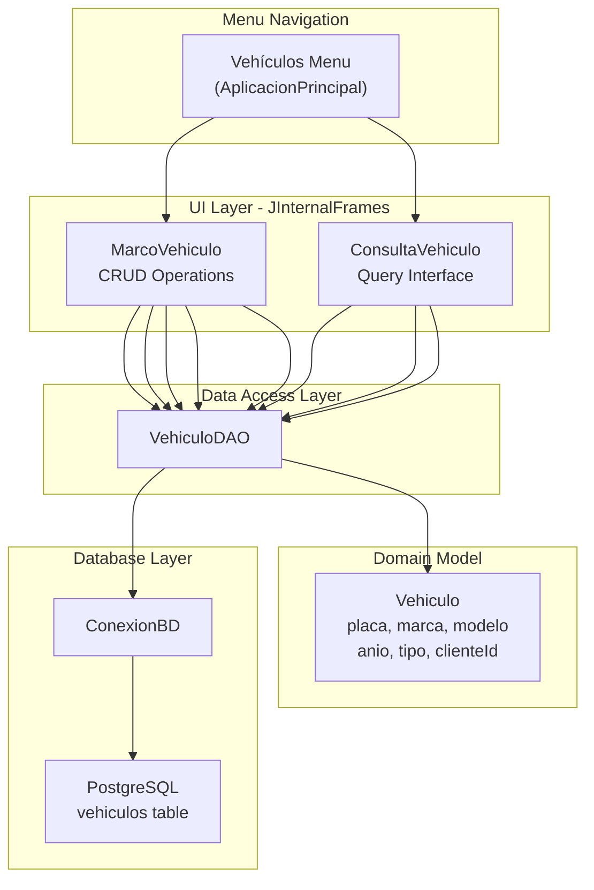
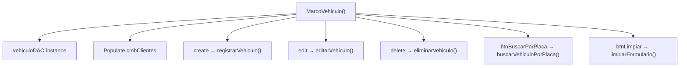
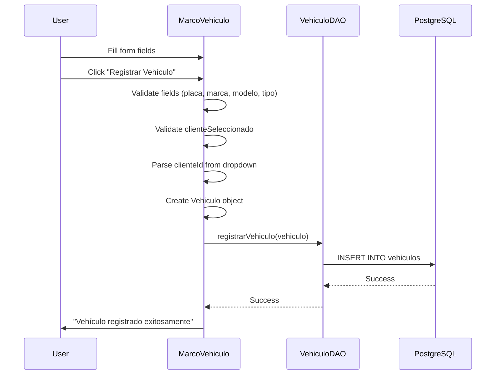
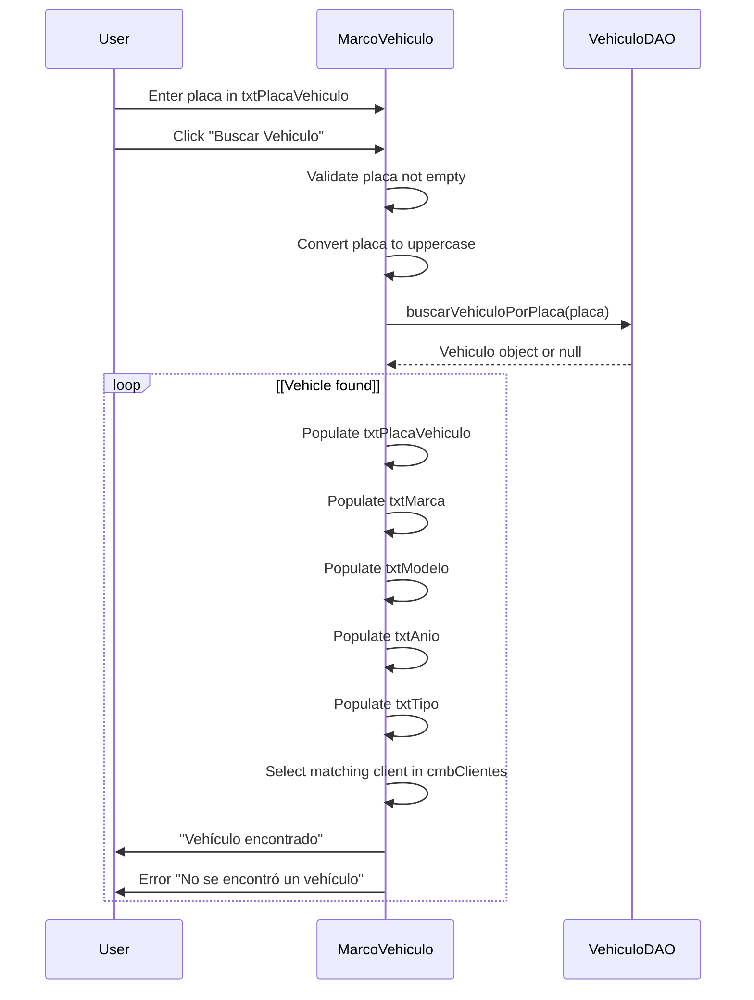
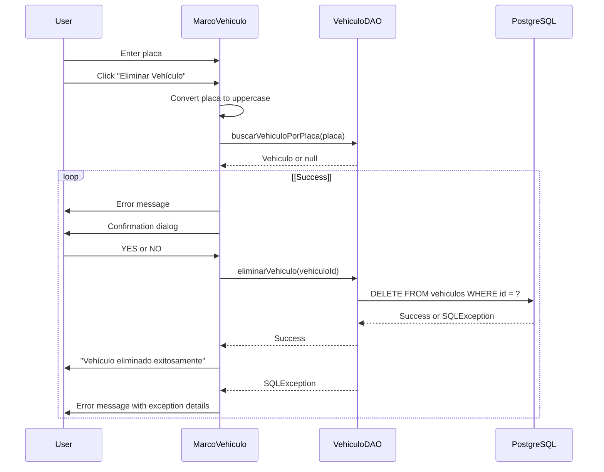
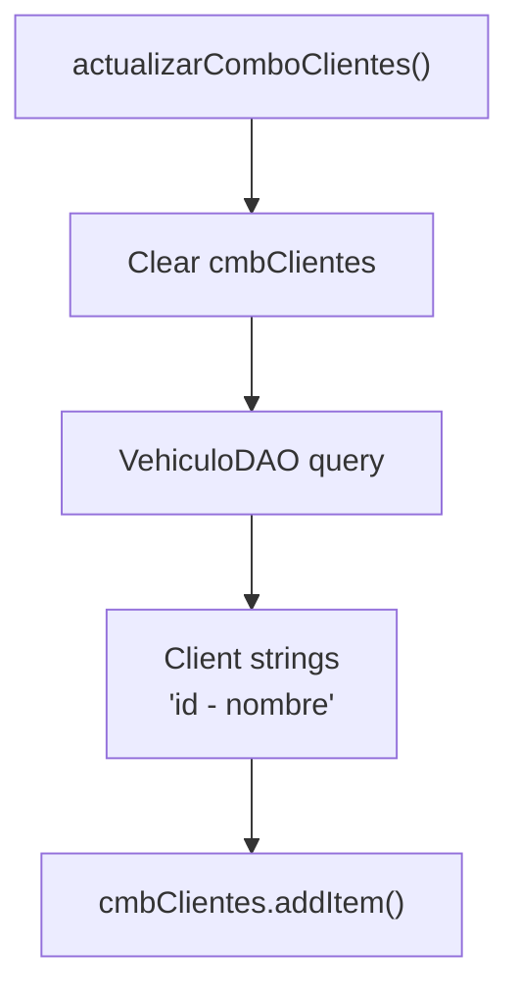
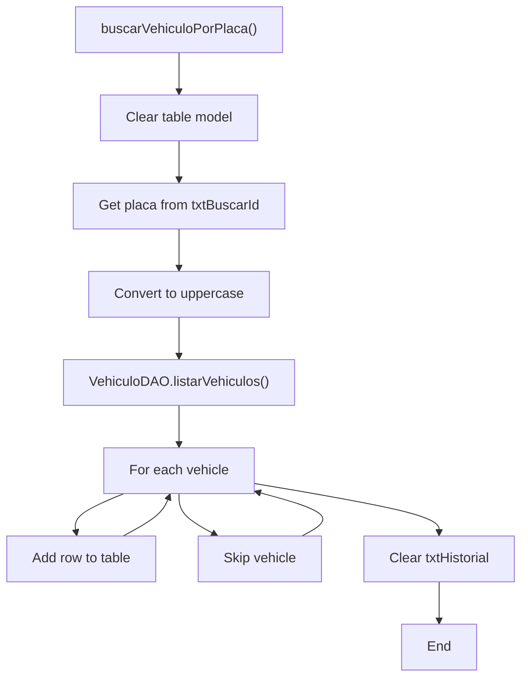
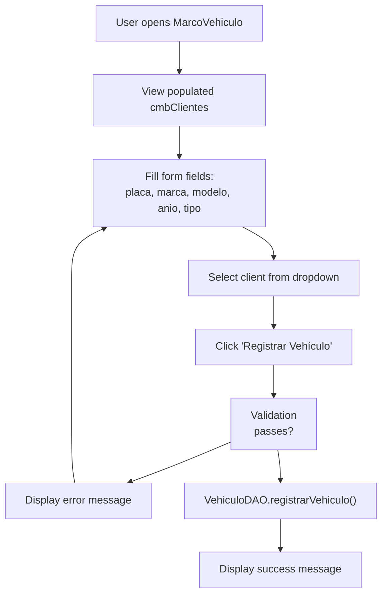
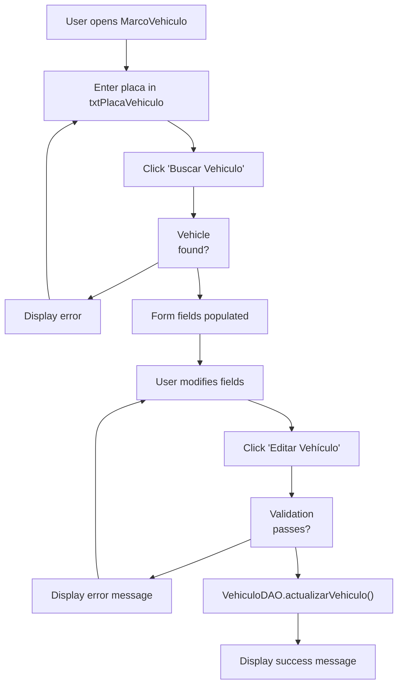
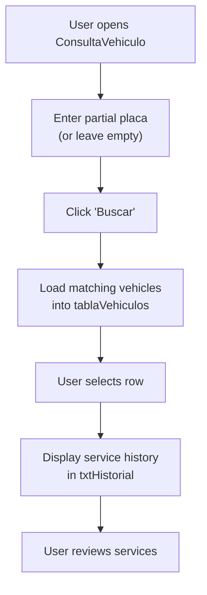

# Vehicle Management Module

> **Relevant source files**
> * [src/main/java/com/adso/el_taller_de_adso/vehiculos/ConsultaVehiculo.java](https://github.com/BrayanTirado/Servicio-Mec-nico/blob/b80161f0/src/main/java/com/adso/el_taller_de_adso/vehiculos/ConsultaVehiculo.java)
> * [src/main/java/com/adso/el_taller_de_adso/vehiculos/MarcoVehiculo.form](https://github.com/BrayanTirado/Servicio-Mec-nico/blob/b80161f0/src/main/java/com/adso/el_taller_de_adso/vehiculos/MarcoVehiculo.form)
> * [src/main/java/com/adso/el_taller_de_adso/vehiculos/MarcoVehiculo.java](https://github.com/BrayanTirado/Servicio-Mec-nico/blob/b80161f0/src/main/java/com/adso/el_taller_de_adso/vehiculos/MarcoVehiculo.java)

## Purpose and Scope

The Vehicle Management Module provides functionality for registering, updating, deleting, and querying vehicles in the mechanical workshop system. This module enables operators to maintain a complete inventory of customer vehicles and view their service history. The module consists of two primary interfaces: `MarcoVehiculo` for CRUD operations and `ConsultaVehiculo` for vehicle lookup and history viewing.

For information about service history tracking and service creation workflows, see [Service Management Module](/BrayanTirado/Servicio-Mec-nico/4-service-management-module). For client management operations, see [Client Management Module](/BrayanTirado/Servicio-Mec-nico/7-client-management-module).

## Module Architecture

The Vehicle Management Module follows the standard three-tier architecture used throughout the application. It consists of two `JInternalFrame` components launched from the main application menu, both interacting with the database through the `VehiculoDAO` data access object.



**Sources:** [src/main/java/com/adso/el_taller_de_adso/vehiculos/MarcoVehiculo.java L1-L426](https://github.com/BrayanTirado/Servicio-Mec-nico/blob/b80161f0/src/main/java/com/adso/el_taller_de_adso/vehiculos/MarcoVehiculo.java#L1-L426)

 [src/main/java/com/adso/el_taller_de_adso/vehiculos/ConsultaVehiculo.java L1-L205](https://github.com/BrayanTirado/Servicio-Mec-nico/blob/b80161f0/src/main/java/com/adso/el_taller_de_adso/vehiculos/ConsultaVehiculo.java#L1-L205)

## Core Components

### MarcoVehiculo - CRUD Interface

`MarcoVehiculo` is a `JInternalFrame` that provides the primary interface for vehicle registration and management. It implements the full Create, Read, Update, Delete lifecycle for vehicle records.

#### Component Structure

| Component | Type | Purpose |
| --- | --- | --- |
| `txtPlacaVehiculo` | JTextField | License plate input/search field |
| `txtMarca` | JTextField | Vehicle brand input |
| `txtModelo` | JTextField | Vehicle model input |
| `txtAnio` | JTextField | Manufacturing year input |
| `txtTipo` | JTextField | Vehicle type (car, truck, motorcycle, etc.) |
| `cmbClientes` | JComboBox<String> | Client selection dropdown |
| `create` | JButton | Trigger vehicle registration |
| `edit` | JButton | Trigger vehicle update |
| `delete` | JButton | Trigger vehicle deletion |
| `btnBuscarPorPlaca` | JButton | Search vehicle by license plate |
| `btnLimpiar` | JButton | Clear form fields |

**Sources:** [src/main/java/com/adso/el_taller_de_adso/vehiculos/MarcoVehiculo.java L403-L423](https://github.com/BrayanTirado/Servicio-Mec-nico/blob/b80161f0/src/main/java/com/adso/el_taller_de_adso/vehiculos/MarcoVehiculo.java#L403-L423)

#### Initialization and Event Binding

The constructor initializes the `VehiculoDAO` instance, populates the client dropdown, and binds action listeners to buttons:



**Sources:** [src/main/java/com/adso/el_taller_de_adso/vehiculos/MarcoVehiculo.java L16-L25](https://github.com/BrayanTirado/Servicio-Mec-nico/blob/b80161f0/src/main/java/com/adso/el_taller_de_adso/vehiculos/MarcoVehiculo.java#L16-L25)

#### CRUD Operation Workflows

##### Vehicle Registration Flow

The `registrarVehiculo()` method handles new vehicle creation:



The method performs the following validations:

* All text fields must be non-empty [src/main/java/com/adso/el_taller_de_adso/vehiculos/MarcoVehiculo.java L292-L295](https://github.com/BrayanTirado/Servicio-Mec-nico/blob/b80161f0/src/main/java/com/adso/el_taller_de_adso/vehiculos/MarcoVehiculo.java#L292-L295)
* A client must be selected from the dropdown [src/main/java/com/adso/el_taller_de_adso/vehiculos/MarcoVehiculo.java L296-L299](https://github.com/BrayanTirado/Servicio-Mec-nico/blob/b80161f0/src/main/java/com/adso/el_taller_de_adso/vehiculos/MarcoVehiculo.java#L296-L299)
* The year must be a valid integer [src/main/java/com/adso/el_taller_de_adso/vehiculos/MarcoVehiculo.java L288-L307](https://github.com/BrayanTirado/Servicio-Mec-nico/blob/b80161f0/src/main/java/com/adso/el_taller_de_adso/vehiculos/MarcoVehiculo.java#L288-L307)

The client ID is extracted from the combo box selection, which is formatted as `"<id> - <name>"` [src/main/java/com/adso/el_taller_de_adso/vehiculos/MarcoVehiculo.java L301](https://github.com/BrayanTirado/Servicio-Mec-nico/blob/b80161f0/src/main/java/com/adso/el_taller_de_adso/vehiculos/MarcoVehiculo.java#L301-L301)

**Sources:** [src/main/java/com/adso/el_taller_de_adso/vehiculos/MarcoVehiculo.java L283-L308](https://github.com/BrayanTirado/Servicio-Mec-nico/blob/b80161f0/src/main/java/com/adso/el_taller_de_adso/vehiculos/MarcoVehiculo.java#L283-L308)

##### Vehicle Search and Population Flow

The `buscarVehiculoPorPlaca()` method retrieves a vehicle by license plate and populates the form:



The search performs case-insensitive matching by converting the input to uppercase [src/main/java/com/adso/el_taller_de_adso/vehiculos/MarcoVehiculo.java L365](https://github.com/BrayanTirado/Servicio-Mec-nico/blob/b80161f0/src/main/java/com/adso/el_taller_de_adso/vehiculos/MarcoVehiculo.java#L365-L365)

 The client dropdown is synchronized by iterating through items to find the one matching the vehicle's `clienteId` [src/main/java/com/adso/el_taller_de_adso/vehiculos/MarcoVehiculo.java L377-L383](https://github.com/BrayanTirado/Servicio-Mec-nico/blob/b80161f0/src/main/java/com/adso/el_taller_de_adso/vehiculos/MarcoVehiculo.java#L377-L383)

**Sources:** [src/main/java/com/adso/el_taller_de_adso/vehiculos/MarcoVehiculo.java L363-L391](https://github.com/BrayanTirado/Servicio-Mec-nico/blob/b80161f0/src/main/java/com/adso/el_taller_de_adso/vehiculos/MarcoVehiculo.java#L363-L391)

##### Vehicle Update Flow

The `editarVehiculo()` method updates an existing vehicle record:

1. Searches for the vehicle by license plate to verify existence [src/main/java/com/adso/el_taller_de_adso/vehiculos/MarcoVehiculo.java L312-L317](https://github.com/BrayanTirado/Servicio-Mec-nico/blob/b80161f0/src/main/java/com/adso/el_taller_de_adso/vehiculos/MarcoVehiculo.java#L312-L317)
2. Validates all form fields (same as registration) [src/main/java/com/adso/el_taller_de_adso/vehiculos/MarcoVehiculo.java L326-L333](https://github.com/BrayanTirado/Servicio-Mec-nico/blob/b80161f0/src/main/java/com/adso/el_taller_de_adso/vehiculos/MarcoVehiculo.java#L326-L333)
3. Preserves the original vehicle ID from the database lookup [src/main/java/com/adso/el_taller_de_adso/vehiculos/MarcoVehiculo.java L336](https://github.com/BrayanTirado/Servicio-Mec-nico/blob/b80161f0/src/main/java/com/adso/el_taller_de_adso/vehiculos/MarcoVehiculo.java#L336-L336)
4. Calls `VehiculoDAO.actualizarVehiculo()` with the updated `Vehiculo` object [src/main/java/com/adso/el_taller_de_adso/vehiculos/MarcoVehiculo.java L337](https://github.com/BrayanTirado/Servicio-Mec-nico/blob/b80161f0/src/main/java/com/adso/el_taller_de_adso/vehiculos/MarcoVehiculo.java#L337-L337)

**Sources:** [src/main/java/com/adso/el_taller_de_adso/vehiculos/MarcoVehiculo.java L310-L342](https://github.com/BrayanTirado/Servicio-Mec-nico/blob/b80161f0/src/main/java/com/adso/el_taller_de_adso/vehiculos/MarcoVehiculo.java#L310-L342)

##### Vehicle Deletion Flow

The `eliminarVehiculo()` method performs a destructive delete operation with user confirmation:



The method uses `JOptionPane.showConfirmDialog()` with `YES_NO_OPTION` to prevent accidental deletions [src/main/java/com/adso/el_taller_de_adso/vehiculos/MarcoVehiculo.java L353-L357](https://github.com/BrayanTirado/Servicio-Mec-nico/blob/b80161f0/src/main/java/com/adso/el_taller_de_adso/vehiculos/MarcoVehiculo.java#L353-L357)

 If the vehicle has associated service records, a foreign key constraint error will be caught and displayed to the user [src/main/java/com/adso/el_taller_de_adso/vehiculos/MarcoVehiculo.java L358-L360](https://github.com/BrayanTirado/Servicio-Mec-nico/blob/b80161f0/src/main/java/com/adso/el_taller_de_adso/vehiculos/MarcoVehiculo.java#L358-L360)

**Sources:** [src/main/java/com/adso/el_taller_de_adso/vehiculos/MarcoVehiculo.java L344-L361](https://github.com/BrayanTirado/Servicio-Mec-nico/blob/b80161f0/src/main/java/com/adso/el_taller_de_adso/vehiculos/MarcoVehiculo.java#L344-L361)

#### Client Dropdown Management

The `actualizarComboClientes()` method populates the client dropdown:



The method retrieves a list of client strings formatted as `"<id> - <name>"` from the database [src/main/java/com/adso/el_taller_de_adso/vehiculos/MarcoVehiculo.java L277-L280](https://github.com/BrayanTirado/Servicio-Mec-nico/blob/b80161f0/src/main/java/com/adso/el_taller_de_adso/vehiculos/MarcoVehiculo.java#L277-L280)

**Sources:** [src/main/java/com/adso/el_taller_de_adso/vehiculos/MarcoVehiculo.java L275-L281](https://github.com/BrayanTirado/Servicio-Mec-nico/blob/b80161f0/src/main/java/com/adso/el_taller_de_adso/vehiculos/MarcoVehiculo.java#L275-L281)

### ConsultaVehiculo - Query Interface

`ConsultaVehiculo` is a simpler `JInternalFrame` focused on vehicle lookup and service history viewing. Unlike `MarcoVehiculo`, it does not support data modification operations.

#### Component Structure

| Component | Type | Purpose |
| --- | --- | --- |
| `txtBuscarId` | JTextField | License plate search input |
| `btnBuscar` | JButton | Trigger search operation |
| `tablaVehiculos` | JTable | Display vehicle list |
| `txtHistorial` | JTextArea | Display service history (read-only) |

**Sources:** [src/main/java/com/adso/el_taller_de_adso/vehiculos/ConsultaVehiculo.java L191-L203](https://github.com/BrayanTirado/Servicio-Mec-nico/blob/b80161f0/src/main/java/com/adso/el_taller_de_adso/vehiculos/ConsultaVehiculo.java#L191-L203)

#### Initialization and Event Binding

The constructor binds two event handlers:

1. Search button click → `buscarVehiculoPorPlaca()` [src/main/java/com/adso/el_taller_de_adso/vehiculos/ConsultaVehiculo.java L24](https://github.com/BrayanTirado/Servicio-Mec-nico/blob/b80161f0/src/main/java/com/adso/el_taller_de_adso/vehiculos/ConsultaVehiculo.java#L24-L24)
2. Table row selection → `mostrarHistorial()` [src/main/java/com/adso/el_taller_de_adso/vehiculos/ConsultaVehiculo.java L25-L29](https://github.com/BrayanTirado/Servicio-Mec-nico/blob/b80161f0/src/main/java/com/adso/el_taller_de_adso/vehiculos/ConsultaVehiculo.java#L25-L29)

The table selection listener uses `getValueIsAdjusting()` to prevent multiple triggers during selection changes [src/main/java/com/adso/el_taller_de_adso/vehiculos/ConsultaVehiculo.java L26](https://github.com/BrayanTirado/Servicio-Mec-nico/blob/b80161f0/src/main/java/com/adso/el_taller_de_adso/vehiculos/ConsultaVehiculo.java#L26-L26)

**Sources:** [src/main/java/com/adso/el_taller_de_adso/vehiculos/ConsultaVehiculo.java L21-L30](https://github.com/BrayanTirado/Servicio-Mec-nico/blob/b80161f0/src/main/java/com/adso/el_taller_de_adso/vehiculos/ConsultaVehiculo.java#L21-L30)

#### Vehicle Search Workflow

The `buscarVehiculoPorPlaca()` method implements a filter-based search:



The method supports two search modes:

* **Empty search**: Displays all vehicles [src/main/java/com/adso/el_taller_de_adso/vehiculos/ConsultaVehiculo.java L37](https://github.com/BrayanTirado/Servicio-Mec-nico/blob/b80161f0/src/main/java/com/adso/el_taller_de_adso/vehiculos/ConsultaVehiculo.java#L37-L37)
* **Partial match**: Displays vehicles where license plate contains the search term [src/main/java/com/adso/el_taller_de_adso/vehiculos/ConsultaVehiculo.java L37](https://github.com/BrayanTirado/Servicio-Mec-nico/blob/b80161f0/src/main/java/com/adso/el_taller_de_adso/vehiculos/ConsultaVehiculo.java#L37-L37)

The table displays columns: ID, Placa, Marca, Modelo, Año, Tipo [src/main/java/com/adso/el_taller_de_adso/vehiculos/ConsultaVehiculo.java L38](https://github.com/BrayanTirado/Servicio-Mec-nico/blob/b80161f0/src/main/java/com/adso/el_taller_de_adso/vehiculos/ConsultaVehiculo.java#L38-L38)

**Sources:** [src/main/java/com/adso/el_taller_de_adso/vehiculos/ConsultaVehiculo.java L31-L42](https://github.com/BrayanTirado/Servicio-Mec-nico/blob/b80161f0/src/main/java/com/adso/el_taller_de_adso/vehiculos/ConsultaVehiculo.java#L31-L42)

#### Service History Display

The `mostrarHistorial()` method displays service records for the selected vehicle:

```

```

The method retrieves the vehicle ID from column 0 of the selected row [src/main/java/com/adso/el_taller_de_adso/vehiculos/ConsultaVehiculo.java L47](https://github.com/BrayanTirado/Servicio-Mec-nico/blob/b80161f0/src/main/java/com/adso/el_taller_de_adso/vehiculos/ConsultaVehiculo.java#L47-L47)

 Each service record is appended as a new line in the text area [src/main/java/com/adso/el_taller_de_adso/vehiculos/ConsultaVehiculo.java L50-L52](https://github.com/BrayanTirado/Servicio-Mec-nico/blob/b80161f0/src/main/java/com/adso/el_taller_de_adso/vehiculos/ConsultaVehiculo.java#L50-L52)

**Sources:** [src/main/java/com/adso/el_taller_de_adso/vehiculos/ConsultaVehiculo.java L44-L54](https://github.com/BrayanTirado/Servicio-Mec-nico/blob/b80161f0/src/main/java/com/adso/el_taller_de_adso/vehiculos/ConsultaVehiculo.java#L44-L54)

## Vehicle Data Model

The `Vehiculo` domain object encapsulates vehicle attributes:

| Attribute | Type | Description |
| --- | --- | --- |
| `id` | int | Primary key (auto-generated) |
| `placa` | String | License plate (unique identifier) |
| `marca` | String | Vehicle brand/manufacturer |
| `modelo` | String | Vehicle model |
| `anio` | int | Manufacturing year |
| `tipo` | String | Vehicle type classification |
| `clienteId` | int | Foreign key to clientes table |

The `Vehiculo` object is constructed in `MarcoVehiculo.registrarVehiculo()` with ID set to 0 for new vehicles [src/main/java/com/adso/el_taller_de_adso/vehiculos/MarcoVehiculo.java L302](https://github.com/BrayanTirado/Servicio-Mec-nico/blob/b80161f0/src/main/java/com/adso/el_taller_de_adso/vehiculos/MarcoVehiculo.java#L302-L302)

 For updates, the existing ID is preserved from the database lookup [src/main/java/com/adso/el_taller_de_adso/vehiculos/MarcoVehiculo.java L336](https://github.com/BrayanTirado/Servicio-Mec-nico/blob/b80161f0/src/main/java/com/adso/el_taller_de_adso/vehiculos/MarcoVehiculo.java#L336-L336)

## Database Interactions

### VehiculoDAO Methods

The module interacts with the database through the following `VehiculoDAO` methods:

| Method | Purpose | Used By |
| --- | --- | --- |
| `registrarVehiculo(Vehiculo)` | INSERT new vehicle record | MarcoVehiculo |
| `actualizarVehiculo(Vehiculo)` | UPDATE existing vehicle | MarcoVehiculo |
| `eliminarVehiculo(int id)` | DELETE vehicle by ID | MarcoVehiculo |
| `buscarVehiculoPorPlaca(String)` | SELECT vehicle by placa | Both |
| `listarVehiculos()` | SELECT all vehicles | ConsultaVehiculo |
| `listarClientes()` | SELECT client dropdown data | MarcoVehiculo |
| `listarHistorialServicios(int)` | SELECT service history for vehicle | ConsultaVehiculo |

### Foreign Key Relationships

The `vehiculos` table has two foreign key relationships:

```css
#mermaid-p7hdl2dnyp{font-family:ui-sans-serif,-apple-system,system-ui,Segoe UI,Helvetica;font-size:16px;fill:#333;}@keyframes edge-animation-frame{from{stroke-dashoffset:0;}}@keyframes dash{to{stroke-dashoffset:0;}}#mermaid-p7hdl2dnyp .edge-animation-slow{stroke-dasharray:9,5!important;stroke-dashoffset:900;animation:dash 50s linear infinite;stroke-linecap:round;}#mermaid-p7hdl2dnyp .edge-animation-fast{stroke-dasharray:9,5!important;stroke-dashoffset:900;animation:dash 20s linear infinite;stroke-linecap:round;}#mermaid-p7hdl2dnyp .error-icon{fill:#dddddd;}#mermaid-p7hdl2dnyp .error-text{fill:#222222;stroke:#222222;}#mermaid-p7hdl2dnyp .edge-thickness-normal{stroke-width:1px;}#mermaid-p7hdl2dnyp .edge-thickness-thick{stroke-width:3.5px;}#mermaid-p7hdl2dnyp .edge-pattern-solid{stroke-dasharray:0;}#mermaid-p7hdl2dnyp .edge-thickness-invisible{stroke-width:0;fill:none;}#mermaid-p7hdl2dnyp .edge-pattern-dashed{stroke-dasharray:3;}#mermaid-p7hdl2dnyp .edge-pattern-dotted{stroke-dasharray:2;}#mermaid-p7hdl2dnyp .marker{fill:#999;stroke:#999;}#mermaid-p7hdl2dnyp .marker.cross{stroke:#999;}#mermaid-p7hdl2dnyp svg{font-family:ui-sans-serif,-apple-system,system-ui,Segoe UI,Helvetica;font-size:16px;}#mermaid-p7hdl2dnyp p{margin:0;}#mermaid-p7hdl2dnyp .entityBox{fill:#ffffff;stroke:#dddddd;}#mermaid-p7hdl2dnyp .relationshipLabelBox{fill:#dddddd;opacity:0.7;background-color:#dddddd;}#mermaid-p7hdl2dnyp .relationshipLabelBox rect{opacity:0.5;}#mermaid-p7hdl2dnyp .labelBkg{background-color:rgba(221, 221, 221, 0.5);}#mermaid-p7hdl2dnyp .edgeLabel .label{fill:#dddddd;font-size:14px;}#mermaid-p7hdl2dnyp .label{font-family:ui-sans-serif,-apple-system,system-ui,Segoe UI,Helvetica;color:#333;}#mermaid-p7hdl2dnyp .edge-pattern-dashed{stroke-dasharray:8,8;}#mermaid-p7hdl2dnyp .node rect,#mermaid-p7hdl2dnyp .node circle,#mermaid-p7hdl2dnyp .node ellipse,#mermaid-p7hdl2dnyp .node polygon{fill:#ffffff;stroke:#dddddd;stroke-width:1px;}#mermaid-p7hdl2dnyp .relationshipLine{stroke:#999;stroke-width:1;fill:none;}#mermaid-p7hdl2dnyp .marker{fill:none!important;stroke:#999!important;stroke-width:1;}#mermaid-p7hdl2dnyp :root{--mermaid-font-family:"trebuchet ms",verdana,arial,sans-serif;}ownsreceivesclientesintidPKstringnombrestringdocumentovehiculosintidPKstringplacaUKstringmarcastringmodelointaniostringtipointcliente_idFKserviciosintidPKintvehiculo_idFKdatefechastringtipo_serviciodecimalcosto_total
```

The foreign key constraint on `vehiculos.cliente_id` prevents deletion of clients with associated vehicles. Similarly, the constraint on `servicios.vehiculo_id` prevents deletion of vehicles with service history, which is caught and displayed to the user in `eliminarVehiculo()` [src/main/java/com/adso/el_taller_de_adso/vehiculos/MarcoVehiculo.java L358-L360](https://github.com/BrayanTirado/Servicio-Mec-nico/blob/b80161f0/src/main/java/com/adso/el_taller_de_adso/vehiculos/MarcoVehiculo.java#L358-L360)

## Form Validation

### MarcoVehiculo Validation Rules

Both `registrarVehiculo()` and `editarVehiculo()` implement identical validation logic:

| Field | Validation | Error Message |
| --- | --- | --- |
| All text fields | Non-empty after trim() | "Todos los campos son obligatorios" |
| txtAnio | Valid integer | "El año debe ser un número válido" |
| cmbClientes | Item selected | "Debe seleccionar un cliente" |

The validation occurs before any database operations [src/main/java/com/adso/el_taller_de_adso/vehiculos/MarcoVehiculo.java L292-L299](https://github.com/BrayanTirado/Servicio-Mec-nico/blob/b80161f0/src/main/java/com/adso/el_taller_de_adso/vehiculos/MarcoVehiculo.java#L292-L299)

### ConsultaVehiculo Validation

The search interface performs minimal validation:

* Empty search is allowed (returns all vehicles)
* No validation on search term format

The method uses case-insensitive matching by converting the input to uppercase [src/main/java/com/adso/el_taller_de_adso/vehiculos/ConsultaVehiculo.java L34](https://github.com/BrayanTirado/Servicio-Mec-nico/blob/b80161f0/src/main/java/com/adso/el_taller_de_adso/vehiculos/ConsultaVehiculo.java#L34-L34)

**Sources:** [src/main/java/com/adso/el_taller_de_adso/vehiculos/MarcoVehiculo.java L292-L299](https://github.com/BrayanTirado/Servicio-Mec-nico/blob/b80161f0/src/main/java/com/adso/el_taller_de_adso/vehiculos/MarcoVehiculo.java#L292-L299)

 [src/main/java/com/adso/el_taller_de_adso/vehiculos/ConsultaVehiculo.java L31-L42](https://github.com/BrayanTirado/Servicio-Mec-nico/blob/b80161f0/src/main/java/com/adso/el_taller_de_adso/vehiculos/ConsultaVehiculo.java#L31-L42)

## User Workflow Examples

### Complete Registration Workflow



### Search and Edit Workflow



### Query and History View Workflow



**Sources:** [src/main/java/com/adso/el_taller_de_adso/vehiculos/MarcoVehiculo.java L283-L391](https://github.com/BrayanTirado/Servicio-Mec-nico/blob/b80161f0/src/main/java/com/adso/el_taller_de_adso/vehiculos/MarcoVehiculo.java#L283-L391)

 [src/main/java/com/adso/el_taller_de_adso/vehiculos/ConsultaVehiculo.java L31-L54](https://github.com/BrayanTirado/Servicio-Mec-nico/blob/b80161f0/src/main/java/com/adso/el_taller_de_adso/vehiculos/ConsultaVehiculo.java#L31-L54)

## GUI Layout

Both frames use NetBeans GUI Builder with custom layouts:

### MarcoVehiculo Layout

The frame uses `GroupLayout` with the following structure:

* Title label at top [src/main/java/com/adso/el_taller_de_adso/vehiculos/MarcoVehiculo.java L98-L100](https://github.com/BrayanTirado/Servicio-Mec-nico/blob/b80161f0/src/main/java/com/adso/el_taller_de_adso/vehiculos/MarcoVehiculo.java#L98-L100)
* Action buttons in upper section [src/main/java/com/adso/el_taller_de_adso/vehiculos/MarcoVehiculo.java L214-L220](https://github.com/BrayanTirado/Servicio-Mec-nico/blob/b80161f0/src/main/java/com/adso/el_taller_de_adso/vehiculos/MarcoVehiculo.java#L214-L220)
* Form fields with labels in center section [src/main/java/com/adso/el_taller_de_adso/vehiculos/MarcoVehiculo.java L222-L244](https://github.com/BrayanTirado/Servicio-Mec-nico/blob/b80161f0/src/main/java/com/adso/el_taller_de_adso/vehiculos/MarcoVehiculo.java#L222-L244)
* Clear button at bottom [src/main/java/com/adso/el_taller_de_adso/vehiculos/MarcoVehiculo.java L246](https://github.com/BrayanTirado/Servicio-Mec-nico/blob/b80161f0/src/main/java/com/adso/el_taller_de_adso/vehiculos/MarcoVehiculo.java#L246-L246)

The background color is set to RGB(204, 204, 255) [src/main/java/com/adso/el_taller_de_adso/vehiculos/MarcoVehiculo.java L58](https://github.com/BrayanTirado/Servicio-Mec-nico/blob/b80161f0/src/main/java/com/adso/el_taller_de_adso/vehiculos/MarcoVehiculo.java#L58-L58)

### ConsultaVehiculo Layout

The frame uses `GridBagLayout` with the following vertical structure:

1. Search bar with label, text field, and button [src/main/java/com/adso/el_taller_de_adso/vehiculos/ConsultaVehiculo.java L163-L167](https://github.com/BrayanTirado/Servicio-Mec-nico/blob/b80161f0/src/main/java/com/adso/el_taller_de_adso/vehiculos/ConsultaVehiculo.java#L163-L167)
2. "Lista de Vehículos" label [src/main/java/com/adso/el_taller_de_adso/vehiculos/ConsultaVehiculo.java L169](https://github.com/BrayanTirado/Servicio-Mec-nico/blob/b80161f0/src/main/java/com/adso/el_taller_de_adso/vehiculos/ConsultaVehiculo.java#L169-L169)
3. Vehicle table in scroll pane [src/main/java/com/adso/el_taller_de_adso/vehiculos/ConsultaVehiculo.java L171](https://github.com/BrayanTirado/Servicio-Mec-nico/blob/b80161f0/src/main/java/com/adso/el_taller_de_adso/vehiculos/ConsultaVehiculo.java#L171-L171)
4. "Historial de Servicios" label [src/main/java/com/adso/el_taller_de_adso/vehiculos/ConsultaVehiculo.java L173](https://github.com/BrayanTirado/Servicio-Mec-nico/blob/b80161f0/src/main/java/com/adso/el_taller_de_adso/vehiculos/ConsultaVehiculo.java#L173-L173)
5. History text area in scroll pane [src/main/java/com/adso/el_taller_de_adso/vehiculos/ConsultaVehiculo.java L175](https://github.com/BrayanTirado/Servicio-Mec-nico/blob/b80161f0/src/main/java/com/adso/el_taller_de_adso/vehiculos/ConsultaVehiculo.java#L175-L175)

The background color matches `MarcoVehiculo` [src/main/java/com/adso/el_taller_de_adso/vehiculos/ConsultaVehiculo.java L83](https://github.com/BrayanTirado/Servicio-Mec-nico/blob/b80161f0/src/main/java/com/adso/el_taller_de_adso/vehiculos/ConsultaVehiculo.java#L83-L83)

**Sources:** [src/main/java/com/adso/el_taller_de_adso/vehiculos/MarcoVehiculo.java L56-L253](https://github.com/BrayanTirado/Servicio-Mec-nico/blob/b80161f0/src/main/java/com/adso/el_taller_de_adso/vehiculos/MarcoVehiculo.java#L56-L253)

 [src/main/java/com/adso/el_taller_de_adso/vehiculos/ConsultaVehiculo.java L63-L188](https://github.com/BrayanTirado/Servicio-Mec-nico/blob/b80161f0/src/main/java/com/adso/el_taller_de_adso/vehiculos/ConsultaVehiculo.java#L63-L188)

## Integration Points

### Integration with Service Module

The Vehicle Management Module is tightly integrated with the Service Management Module (see [Service Management Module](/BrayanTirado/Servicio-Mec-nico/4-service-management-module)):

* Services reference vehicles via `vehiculo_id` foreign key
* `ConsultaVehiculo.listarHistorialServicios()` retrieves service records for a specific vehicle
* Vehicle deletion fails if service records exist due to foreign key constraint

### Integration with Client Module

The module depends on the Client Management Module (see [Client Management Module](/BrayanTirado/Servicio-Mec-nico/7-client-management-module)):

* Vehicles must be associated with a valid client via `cliente_id`
* `MarcoVehiculo.actualizarComboClientes()` populates the client dropdown from the `clientes` table
* Client deletion is blocked if they own vehicles

### Integration with AplicacionPrincipal

Both frames are launched from menu items in the main MDI window:

* `MenuItemVehiculos` instantiates `MarcoVehiculo`
* `MenuItemConsulta` instantiates `ConsultaVehiculo`

For details on the menu structure and frame launching, see [Main Application Window](/BrayanTirado/Servicio-Mec-nico/3.1-main-application-window).

**Sources:** [src/main/java/com/adso/el_taller_de_adso/vehiculos/MarcoVehiculo.java L275-L281](https://github.com/BrayanTirado/Servicio-Mec-nico/blob/b80161f0/src/main/java/com/adso/el_taller_de_adso/vehiculos/MarcoVehiculo.java#L275-L281)

 [src/main/java/com/adso/el_taller_de_adso/vehiculos/ConsultaVehiculo.java L44-L54](https://github.com/BrayanTirado/Servicio-Mec-nico/blob/b80161f0/src/main/java/com/adso/el_taller_de_adso/vehiculos/ConsultaVehiculo.java#L44-L54)